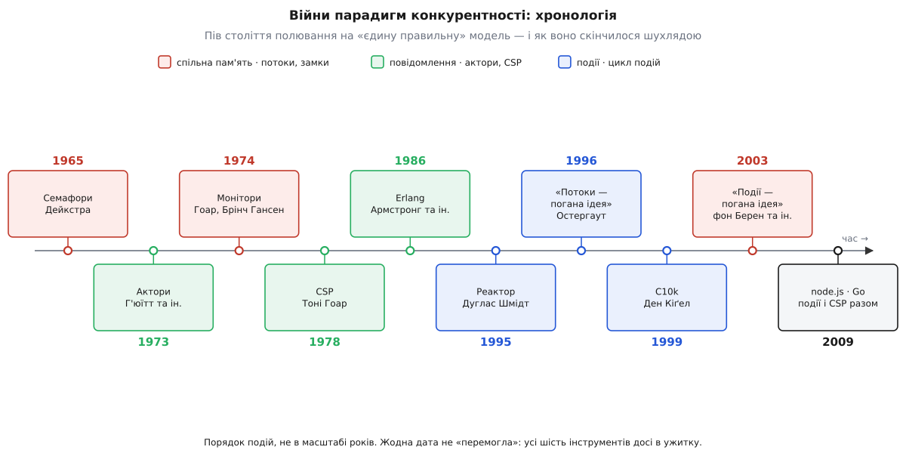
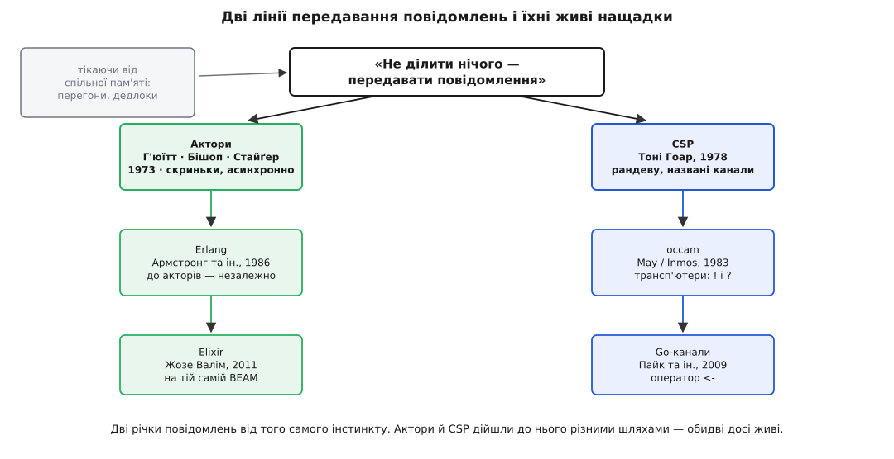

# 📜 Як конкурентність шукала єдину модель — і знайшла шухляду

Пів століття галузь ставилася до вибору моделі конкурентності не як до інженерного рішення, а майже як до символу віри. Кожне десятиліття лишало по собі маніфест із заголовком на кшталт «Чому X — погана ідея», де на місці X по черзі стояли то потоки, то події, то замки. За цими заголовками ховались не капризи, а справжні болі справжніх систем. І найдивовижніше в цій історії те, чим вона скінчилася: не перемогою жодної моделі, а тихим визнанням, що переможця не буде. Замість єдиного молотка галузь зібрала шухляду. Ось як вона до цього йшла.



*Уся дуга наперед: піввікова черга «єдино правильних» відповідей, кожна зі своїм роком і табором. Придивишся — і видно, що жодна не витіснила попередніх, вони просто перестали воювати.*

## Рана, від якої всі тікали: спільна пам'ять

Спершу був один спосіб, і він здавався єдино природним: хай усі потоки бачать ту саму пам'ять, а ми навчимося акуратно ділити доступ до неї. Перший інструмент дав ще 1965 року Едсгер Дейкстра (Edsger W. Dijkstra) у праці «Cooperating Sequential Processes» — семафор: маленький лічильник, на якому потоки домовляються, чий тепер хід, двома діями «зайняти» й «звільнити». За дев'ять років, 1974-го, Тоні Гоар (Tony Hoare) слідом за Пером Брінчем Гансеном (Per Brinch Hansen) підняв ту саму ідею на щабель вище — монітор, що замикає дані разом з операціями над ними. Це усталені дати, не легенда.

Але зі спільної пам'яті виростали чудовиська. Двоє потоків, що чіпають ту саму змінну без домовленості, дають перегони — результат залежить від того, хто мікросекундою раніше встиг, і відтворити помилку майже неможливо. А варто розставити замки надто старанно — і два потоки завмирають навік, кожен тримаючи те, чого жде інший: дедлок. Що більше потоків сходилось на спільній пам'яті, то гостріше кусали ці монстри. І тоді визріла єретична, як на той час, думка: а що, як не ділити пам'ять узагалі? Хай кожен має своє, а спілкуються хай передаванням повідомлень. На це питання майже одночасно дали дві відповіді — і виявились вони геть різні.

## Дві відповіді на одне питання: актори й CSP

Перша відповідь прийшла звідти, звідки й не чекали, — зі штучного інтелекту. 1973 року на конференції IJCAI у Стенфорді Карл Г'юїтт (Carl Hewitt) разом із Пітером Бішопом (Peter Bishop) і Річардом Стайґером (Richard Steiger) опублікували «Універсальний модульний формалізм акторів для штучного інтелекту» — документально засвідчена першоджерельна праця. Вони шукали один-єдиний універсальний будівельний блок обчислення й назвали його актором. Актор — крихітна самотня сутність: має власний стан, якого ніхто зовні не бачить, поштову скриньку, куди йому складають повідомлення, і право у відповідь на лист змінити свій стан, написати іншим і наплодити нових акторів. Жодної спільної пам'яті — сама лише [модель акторів](book:programming/actor-model) з її скриньками й ізоляцією. Спілкування асинхронне: кинув лист і йди далі, адресат прочитає, коли дійде черга.

Друга відповідь виросла з протилежного темпераменту — з бажання не творити розум, а строго доводити правильність паралельних програм. 1978 року той самий Тоні Гоар опублікував у «Communications of the ACM» працю «Communicating Sequential Processes» (CSP), розвиваючи, до речі, Дейкстрині ж «охоронювані команди». Тут одиниця — процес, а спілкуються процеси через рандеву (зустріч-рукостискання): той, хто дає, і той, хто бере, мусять зійтися в тій самій точці одночасно, інакше кожен чекає на іншого. Ніяких скриньок — синхронний обмін через названий канал. Якщо актор Г'юїтта — це вільний острів, що кидає в море пляшки з листами, то процес Гоара — це двоє, що передають річ із рук у руки, дивлячись одне одному в очі.

Придивись, і побачиш, як тут галузь розкололася надвоє. З одного берега — «спільна пам'ять із замками», з другого — «нічого не ділимо, лише повідомлення». А всередині табору повідомлень пролягла ще одна тріщина: асинхронні скриньки акторів проти синхронного рукостискання CSP. Жоден із цих розколів не загоївся дотепер — вони просто з часом перестали бути війною.

## Дзеркальні заголовки: потоки проти подій

Поки теоретики ділили пам'ять і повідомлення, у казармах реальних серверів точилася зовсім інша битва — не про те, що ділити, а про те, як одній машині жонглювати тисячею справ водночас. І тут теж стояло два табори. Перший: на кожну справу — свій потік, що чесно блокується й чекає свого; звично, як послідовний код. Другий: один потік крутить цикл, вихоплюючи готові події одну за одною; форму цього підходу 1995 року закарбував Дуглас Шмідт (Douglas C. Schmidt) у патерні «реактор».

І ось тут історія дає найдзвінкіший свій акорд — двома дзеркальними заголовками. 1996 року Джон Остергаут (John Ousterhout) виступає на конференції USENIX із доповіддю «Why Threads Are a Bad Idea»: потоки, каже, надто важкі для людини — замки, перегони, дедлоки; беріть їх лише там, де справді потрібен CPU-паралелізм, а решту робіть подіями. Минає сім років — і 2003-го на HotOS троє з Берклі, Роб фон Берен (Rob von Behren), Джеремі Кондіт (Jeremy Condit) та Ерік Бревер (Eric Brewer), відповідають заголовком, що читається як точне віддзеркалення: «Why Events Are a Bad Idea». Уся, мовляв, критика потоків — не про потоки, а про їхні кепські реалізації; а події натомість змушують руками різати логіку одного запиту на клапті-стани, і виходить нечитабельно.

Обидві доповіді — не тролінг, а чесний аргумент, і в цьому вся сіль: кожна мала рацію про свою форму задачі. Остергаут дивився на сервер, де тисячі з'єднань здебільшого просто чекають; фон Берен із колегами — на код, де логіку одного запиту хочеться читати згори вниз, рядком за рядком. Два заголовки-антоніми — і жоден не бреше. Це й є мініатюра всієї війни парадигм: питання ніколи не «хто правий», а «про яку саме форму йдеться».

## Що зробило суперечку пекучою: C10k

Абстрактна суперечка спалахнула цілком практичною пожежею наприкінці 1990-х. Близько 1999 року Ден Кіґел (Dan Kegel) сформулював те, що назвав проблемою C10k: настав час одному серверу тримати десять тисяч клієнтів водночас. Приклад був не з голови — FTP-вузол cdrom.com уже роздавав файли десяти тисячам з'єднань на гігабітному Ethernet. А панівна тоді архітектура — потік на з'єднання — під таким числом просто вмирала: кожен потік з'їдав свій шмат пам'яті під стек, а планувальник задихався, перемикаючись між тисячами майже завжди сплячих потоків.

Форма цієї задачі кричала одне: майже всі з'єднання чекають, CPU на кожне — копійки. Рівно та форма, під яку в Остергаута був готовий інструмент. Патерн-реактор Шмідта дістав друге дихання, а 2009 року Раян Дал (Ryan Dahl) на JSConf EU показав node.js — рантайм, що зробив [цикл подій](book:programming/event-loop) масовим ремеслом веброзробника. Подієвість повернулась тріумфально. Але вчитайся уважно: C10k не довів, що потоки погані. Він довів, що під одну конкретну форму — гори очікувань вводу-виводу — події лягають краще. Форму, а не всесвіт.

## Хто вижив: канали Go й актори Erlang

Найкращий доказ, що війна скінчилася внічию, — це те, хто дожив до сьогодні. Обидві лінії передавання повідомлень не просто вціліли, а стали хребтом живих мов, і кожна веде свій родовід прямо від тих давніх праць.



*Обидві річки витікають з одного інстинкту — не ділити стан, а передавати повідомлення. Актори й CSP дійшли до нього різними шляхами, і жодна з них не пересохла.*

Лінія CSP спершу втілилась у залізі: 1983 року Девід Мей (David May) з командою Inmos, консультуючись із самим Гоаром, зробив мову occam для процесорів-транспʼютерів. А далі ідею через низку своїх експериментальних мов проніс Роб Пайк (Rob Pike), аж поки 2009-го вона не вляглася в канали Go (мову оголосили того ж року Пайк, Роберт Ґрізмер і Кен Томпсон у Google). Спадок видно неозброєним оком — у самому синтаксисі передавання:

```
Рід CSP (дати в канал / взяти з каналу):
  occam (1983):   c ! x            c ? y
  Go    (2009):   c <- x           y := <-c

Рід акторів (надіслати повідомлення сутності):
  Erlang (1986):  Pid ! Msg        receive Msg -> ... end
```

Друга лінія, акторська, дала найгарнішу історичну іронію. 1986 року Джо Армстронг (Joe Armstrong), Роберт Вірдінг (Robert Virding) і Майк Вільямс (Mike Williams) в Ericsson зробили Erlang, щоб телефонні комутатори не падали ніколи. Вони дійшли рівно до акторської моделі — ізольовані процеси, повідомлення, жодної спільної пам'яті, — але, за власними свідченнями творців, про працю Г'юїтта тоді навіть не чули. Це не переказ формалізму 1973-го, а незалежне на нього натрапляння: та сама форма задачі вдруге покликала ту саму відповідь. Erlang і донині — найяскравіший приклад акторів у ділі, а 2011 року Жозе Валім (José Valim) дав йому друге життя мовою Elixir на тій самій віртуальній машині BEAM. Кумедна деталь родоводу: оператор надсилання в Erlang — той самий знак `!`, що й вихід у CSP, хоч значать вони протилежне — асинхронна скринька проти синхронного рукостискання.

## Розв'язка — не переможець, а форма

Оглянься на всю цю дугу — і побачиш дивну закономірність. Кожен маніфест «X — погана ідея» був водночас і правдивий, і хибний: правдивий як спостереження про одну форму задачі, хибний як вирок на всі форми. Потоки справді погана ідея — для десяти тисяч сплячих з'єднань. Події справді погана ідея — для коду, де логіку хочеться читати рядком за рядком. Актори, CSP, замки — кожне блищить на своїй формі й тоне на чужій.

Галузь перестала полювати на єдину модель тоді, коли зрозуміла, що модель ніколи й не була питанням. Питанням завжди була форма межі — хто чого торкається і хто на кого чекає, — а модель лише відповіддю на неї. Тому в шухляді сьогодні мирно лежать поруч і семафори Дейкстри, і скриньки Г'юїтта, і канали Гоара, і цикл подій Шмідта: не суперники, а різні ключі до різних замків. Розв'язка піввікової війни виявилась не прапором переможця, а простим правилом майстра — кожній задачі своя форма, і кожній формі свій інструмент.
