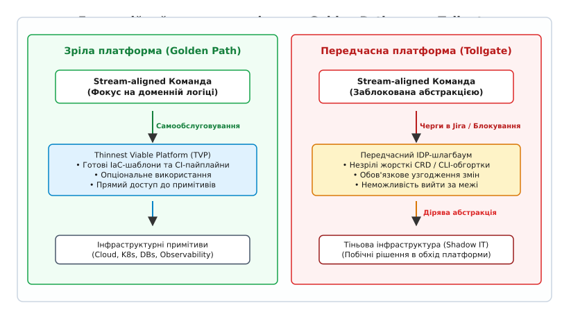
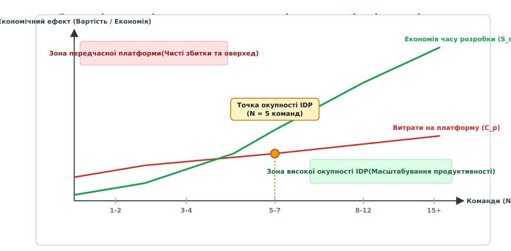
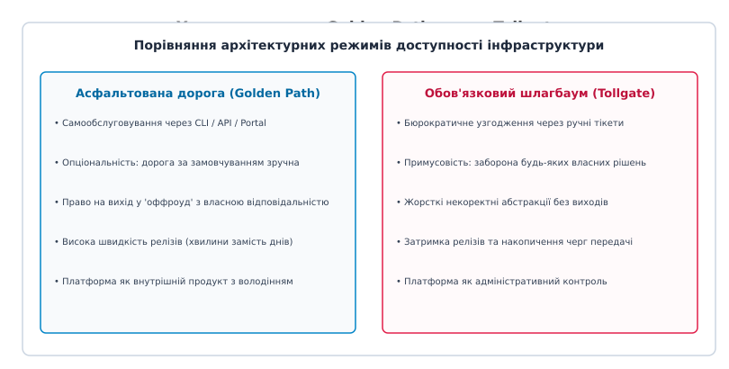

# Платформа проти передчасної платформи

<preknowlist>
- [Закон Конвея](book:programming/software-design/conways-law) — структура комунікацій організації форматирує архітектурну структуру системи.
- [Team topologies](book:programming/architecture-discipline/team-topologies) — класифікація команд на stream-aligned, platform, enabling та complicated-subsystem.
- [Когнітивне навантаження команди](book:programming/architecture-discipline/cognitive-load-teams) — межа спроможності команди утримувати контекст інфраструктури та домену.
- [Платформна інженерія](book:programming/architecture-discipline/platform-engineering) — створення внутрішніх самообслуговуваних продуктів для зниження тертя розробки.
- [YAGNI та вартість передчасної абстракції](book:programming/software-design/dry-kiss-yagni) — шкода від абстракцій, побудованих до поява стійкого повторюваного патерна.
- [Передачі й володіння як джерело затримки](root:progarch/handoffs-and-ownership) — як черги передачі відповідальності руйнують плинність релізів.
</preknowlist>

Компанія з двома продуктовими командами загальною чисельністю у 8 розробників вирішує побудувати повноцінну внутрішню платформу розробки (англ. *Internal Developer Platform, IDP*). Начитавшись публікацій про інженерну культуру технологічних гігантів, керівництво створює окрему платформну команду з 3 інженерів і виділяє 350 000 доларів річного бюджету на розробку власних операторів Kubernetes, жорстких абстракцій над Crossplane, шаблонів Helm та внутрішнього порталу розробників. Через дев'ять місяців інтенсивної роботи з'ясовується тривожний факт: середня швидкість доставки нових бізнес-функцій упала втричі. Продуктивні розробники замість 15 хвилин написання простих маніфестів Terraform тепер витрачають 4 дні на очікування доопрацювання недосконалих користувацьких ресурсів (англ. *Custom Resource Definitions, CRD*) та розбір помилок у внутрішньому платформному інструменті командного рядка.

Ця ситуація демонструє катастрофічний ефект **передчасної платформи** (англ. *premature platform engineering*). Подібно до того, як передчасна абстракція у вихідному коді створює складні, жорсткі й неефективні ієрархії класів до того, як виникли стійкі повторювані патерни, передчасна інфраструктурна платформа створює діряву абстракцію (англ. *leaky abstraction*), яка змушує продуктових розробників утримувати подвійний когнітивний контекст — і власного бізнес-домену, і внутрішніх багів самописного платформного шару.

## Анатомія передчасної абстракції в інфраструктурі

У розробці програмного забезпечення широко відомий принцип Санді Мец (*Sandi Metz*): «Помилкова абстракція коштує значно дорожче, ніж дублювання коду». Коли розробники занадто рано застосовують принцип DRY (англ. *Don't Repeat Yourself*), вони створюють узагальнення на основі двох випадкових збігів, що згодом зв'язує повністю незалежні модулі вузлом жорстких залежностей.

В інфраструктурній інженерії дія цього принципу є ще руйнівнішою. Побудова внутрішньої платформи являє собою процес створення узагальнювального шару абстракції над хмарними ресурсами, мережевими політиками, контейнерною оркестрацією та інструментами спостережуваності (англ. *observability*).

```
Стандартизація на основі реального досвіду:
[Практика команди А] ──┐
[Практика команди Б] ──┼──> [Виявлення спільного патерна] ──> [Побудова TVP / Golden Path]
[Практика команди В] ──┘

Спекулятивна передчасна стандартизація:
[Уявлення платформної команди] ──> [Жорстка абстракція / CRD] ──> [Тертя й опір 3 команд]
```

Передчасна стандартизація виникає тоді, коли платформна команда починає конструювати шар абстракції до того, як у компанії сформувалася достатня кількість продуктових команд із перевіреними, стабільними та повторюваними інфраструктурними потребами.

Механізм виникнення передчасного інфраструктурного тертя розгортається у чотири послідовні етапи:

1. **Спекулятивне проєктування:** Платформна команда, позбавлена репрезентативної вибірки реальних користувацьких сценаріїв, намагається передбачити всі можливі майбутні вимоги організації. Вони створюють універсальний конфігураційний маніфест, який намагається приховати параметри Kubernetes та хмарних провайдерів.
2. **Зіткнення з реальністю (Leaky Abstraction):** Перша ж продуктова команда, яка намагається скористатися платформною обгорткою, стикається з нетиповою вимогою — наприклад, налаштувати специфічний параметр таймауту для з'єднань WebSocket або підключити векторне розширення для бази даних PostgreSQL. 
3. **Виникнення блокувального тупика:** Оскільки платформа приховала сирі інфраструктурні примітиви й заборонила прямий доступ до маніфестів, продуктова команда потрапляє у пастку. Вона не може самостійно змінити конфігурацію, бо шар абстракції цього не передбачає. Розробники змушені створювати тікет у платформну команду і чекати тижнями, поки платформні інженери розширять свій внутрішній DSL або оператор.
4. **Обхід платформи (Shadow IT):** Відчуваючи тиск з боку бізнесу щодо строків релізів, продуктові інженери починають створювати приховані костилі — наприклад, розгортати власні бази даних за допомогою костомних скриптів у хмарі в обхід платформного стандарту.

У результаті замість зменшення когнітивного навантаження передчасна платформа подвоює його: розробники змушені знати і ванільну інфраструктуру (щоб розуміти, чому не працює обгортка), і специфічні обмеження внутрішнього недосконалого платформного інструменту.

## Антипатерн «Шлагбаум» проти «Асфальтованої дороги»

Головна архітектурна різниця між шкідливою та ефективною платформою полягає у режимі доступності інфраструктурних спроможностей для продуктових команд.


*Еволюційний спектр платформних абстракцій: зріла платформа створює самообслуговувану «Асфальтовану дорогу» (Golden Path), тоді як передчасна платформа перетворюється на бюрократичний «Шлагбаум» (Tollgate).*

### Модель «Шлагбаум» (Tollgate Anti-pattern)

У передчасній або бюрократизованій організації платформа функціонує як обов'язковий контрольно-пропускний пункт. Платформна команда створює жорсткі правила й оголошує себе єдиним розпорядником інфраструктурних ресурсів.

Основні характеристики моделі «Шлагбаум»:
- **Примусовість:** Продуктові команди зобов'язані використовувати виключно внутрішній платформний шар без права вибору чи прямого доступу до низькорівневих примітивів.
- **Централізація рішень:** Будь-яка зміна конфігурації середовища вимагає ручного перевірочного узгодження та виконання тікета платформним інженером (`root:progarch/handoffs-and-ownership`).
- **Перетворення на чергу затримок:** Платформна команда стає вузьким місцем (англ. *bottleneck*) усієї організації. Затримки передачі відповідальності накопичуються, а плинність релізів падає.

### Модель «Асфальтована дорога» (Paved Road / Golden Path)

Зріла платформна інженерія будується на принципі **Golden Path** (або *Paved Road*). Платформа надає зручний, повністю автоматизований та високооптимізований шлях самообслуговування для 80% стандартних задач розгортання та експлуатації.

Основні характеристики моделі «Асфальтована дорога»:
- **Добровільність та опціональність:** Використання Golden Path є найбільш вигідним та комфортним рішенням для розробника, але воно не є адміністративним примусом.
- **Право на «оффроуд» (Off-roading):** Якщо продуктова команда створює унікальний сервіс із нетиповими архітектурними вимогами, вона має повне право з'їхати з асфальтованої дороги та використати ванільні інфраструктурні примітиви (наприклад, написати власний модуль Terraform або маніфести Kubernetes).
- **Плата за оффроуд:** Команда, яка з'їжджає з Golden Path, бере на себе повне володіння (англ. *ownership*) та експлуатаційне навантаження за свій унікальний стек, втрачаючи автоматичну підтримку з боку платформи.

Детальний аналіз еволюції концепції платформної інженерії від ранніх PaaS до сучасних IDP наведено у 📜 [Історії платформної інженерії: від PaaS до IDP](root:progarch/platform-vs-premature/hist-platform-engineering-origin.md).

### Концепція Найтоньшої життєздатної платформи (Thinnest Viable Platform, TVP)

Щоб запобігти передчасній абстракції, Меттью Скелтон та Мануель Пайс у концепції *Team Topologies* ввели поняття **Найтоньшої життєздатної платформи** (англ. *Thinnest Viable Platform, TVP*).

> TVP — це найменший можливий шар продуктів, інструментів та документації, який забезпечує реальне зменшення когнітивного навантаження на продуктивні команди, не створюючи зайвих шарів автоматизації.

TVP на ранніх етапах розвитку компанії взагалі не містить власного коду чи складного UI-порталу. TVP може складатися з:
- Одного загального репозиторію з ретельно перевіреними та документованими модулями Terraform.
- Єдиного стандартизованого шаблону файлу CI/CD для GitHub Actions або GitLab CI.
- Чіткої інструкції у Wiki щодо конфігурації моніторингу та збору логів.

Головне правило TVP: кожен новий елемент платформи має заслужити своє право на існування (earn its keep) через доведене розв'язання реального болю розробників, а не через спекулятивні уявлення про майбутнє.

## Простеження життєвого циклу запиту розробника у двох режимах

Щоб отримати наочну інженерну картину різниці між передчасним «Шлагбаумом» та зрілим «Golden Path», простежимо крок за кроком життєвий цикл типового запиту продуктового інженера: **«Мені потрібна база даних PostgreSQL із підтримкою SSL-шифрування, реплікою читання та автоматичним щоденним резервним копіюванням»**.

### Сценарій А: Режим «Шлагбаум» (Tollgate / Передчасний IDP)

1. **День 1 (Створення тікета):** Продуктовий розробник відкриває задачу в Jira на платформну команду з описом потрібної бази даних. Контекст задачі зупиняється.
2. **День 3 (Тривога платформи):** Платформний інженер бере тікет у роботу і виявляє, що внутрішній самописний оператор платформи підтримує конфігурацію PostgreSQL, але не має параметра для увімкнення розширення `pg_trgm` та налаштування SSL-сертифіката custom CA.
3. **День 5 (Розшинення платформи):** Платформний інженер править код внутрішнього оператора, збирає нову версію CRD і вручну запускає Ansible-скрипт на кластері.
4. **День 7 (Отримання доступу):** Розробник отримує реквізити до бази через електронну пошту або Slack. Під час підключення з'ясовується, що репліка читання не має належних мережевих политик у Kubernetes NetworkPolicy.
5. **День 9 (Повторний тікет):** Створюється новий тікет на правку мережевих политик. Сумарна затримка становить 9 днів та вимагає 6 контекстних переключень між командами (`root:progarch/handoffs-and-ownership`).

### Сценарій Б: Режим «Golden Path» (Thinnest Viable Platform)

1. **Хвилина 1 (Декларація):** Продуктовий розробник додає у свій репозиторій файл конфігурації або виклику самообслуговування:
```yaml
apiVersion: platform.dh.internal/v1alpha1
kind: DatabaseClaim
metadata:
  name: telemetry-db
spec:
  engine: postgresql
  version: "15"
  replicas: 1
  sslRequired: true
  extensions:
    - pg_trgm
  backup:
    schedule: "0 2 * * *"
```
2. **Хвилина 3 (Автоматична синхронізація):** GitOps-оператор (ArgoCD / Crossplane) зчитує декларацію, підтягує перевірений хмарний модуль AWS RDS або оператор CloudNative-PG, генерує SSL-сертифікат через Vault і монтує Secret у Kubernetes namespace продуктової команди.
3. **Хвилина 5 (Готовність):** Сервіс розробника автоматично зчитує строки підключення з Secret і розпочинає роботу. Загальний час створення — 5 хвилин, 0 ручних узгоджень, 0 черг передачі.

## Кейс Digital Homes: від передчасного оператора до TVP

У процесі розвитку системи **Digital Homes (DH)** на етапі переходу від версії v2 (монолітний гексагональний застосунок, `root:progarch/dh-v2-hexagon`) до версії v3 (розподілені контексти з обробкою телеметрії) інженерна команда припустилася класичної помилки передчасної платформи.

При створенні сервісів телеметрії та автоматизації сценаріїв керівництво вирішило заздалегідь побудувати власний оператор Kubernetes для маршрутизації MQTT-трафіку та автоматичного створення топіків на базі Go та Custom Resource Definitions. 

Платформна група з 2 інженерів витратила 4 місяці на написання оператора. Проте коли продуктовій команді «Відео та медіа-стрімінг» знадобилося підключити камери спостереження через WebRTC та RTSP, з'ясувалося, що виділений платформний оператор не здатний обробляти бінарні медіа-потоки і підтримує лише тексти з JSON MQTT. Платформна обгортка стала жорстким шлагбаумом, що заблокував реліз медіа-модуля.

Після аналізу на Architecture Review Board було прийнято ADR про **декомпозицію передчасної платформи**:
1. Самописний Go-оператор MQTT було видалено.
2. Команда перейшла на модель **Thinnest Viable Platform (TVP)**: платформники підготували стандартний Helm-чарт для Eclipse Mosquitto/EMQX та модуль Terraform для AWS IoT Core.
3. Команда відеострімінгу отримала право на «оффроуд» — вони самостійно розгорнули медіа-сервер Mediamtx за допомогою стандартних маніфестів Kubernetes, взявши на себе повне володіння його підтримкою.

Результат: затримка релізів упала з 3 тижнів до 2 годин, а продуктивність розробки медіа-модуля зросла у чотири рази.

## Економіка та розрахунок межі доцільності IDP

Рішення про створення виділеної платформної команди (англ. *Platform Team*) має сувору фінансову та математичну підвалину. Платформна команда — це фіксовані накладні витрати організації. Для того щоб ці витрати виправдали себе, сумарна економія часу розробників усіх продуктових команд має перевищувати вартість утримання платформного підрозділу.

```
Формула чистого економічного ефекту платформи (ΔV):

ΔV = H_year · [ N_s · E_s · W_s · (T_infra · E_reduce - T_delay) - N_p · W_p ]
```

де:
- `N_s` — кількість продуктових (stream-aligned) команд.
- `E_s` — середня кількість розробників у продуктивній команді.
- `W_s` — вартість години продуктового інженера ($/год).
- `T_infra` — частка інфраструктурного часу розробників без платформи.
- `E_reduce` — коефіцієнт ефективності економії часу платформою.
- `T_delay` — коефіцієнт додаткового тертя платформи.
- `N_p` — кількість інженерів у платформній команді.
- `W_p` — вартість години платформного інженера ($/год).
- `H_year` — кількість робочих годин на рік (1920 год).


*Крива економічної окупності платформи: при малій кількості команд (N < 4) витрати на платформну команду перевищують сумарну економію часу, створюючи зону передчасних збитків.*

Сувора математична виводка точки рівноваги та критерію окупності наведена у 🧮 [Математичній моделі окупності платформи](root:progarch/platform-vs-premature/math-platform-roi-model.md).

### Три фази інфраструктурної зрілості організації

На основі розрахунку точки окупності можна чітко розмежувати три еволюційні фази доцільності розбудови платформи:

```
[Фаза 1: 1-3 команди] ──> [Фаза 2: 4-8 команд] ──> [Фаза 3: 9+ команд]
  Scaffold / Shared IaC     Thinnest Viable Platform    Platform as a Product
  No dedicated Platform     1-2 Platform Engineers      Full Platform Org + PM
```

#### Фаза 1: Каркас та спільні примітиви (Scaffold / Shared Primitives) — 1–3 продуктивні команди
- **Стан організації:** Малий масштаб розробки. Продуктові інженери працюють безпосередньо з ванільними інструментами хмари та контейнеризації.
- **Оцінка платформи:** Створення виділеної платформної команди є **чистим збитком** для організації. Витрати на 2–3 платформних інженерів перевищують можливу економію часу розробників.
- **Правильна архітектурна тактика:** Використання спільних модулів Terraform або Pulumi без створення проміжних обгорток. Допомога інфраструктурних експертів надається виключно у режимі **Facilitating** (тимчасова участь для передачі знань, `root:progarch/dh-team-topology-choice`).

#### Фаза 2: Зародження Golden Paths (Emergence of Paved Roads) — 4–8 продуктивних команд
- **Стан організації:** Виникає системне дублювання інфраструктурного коду. Продуктивні команди починають витрачати до 30% часу на траблшутинг CI/CD та конфігурацію Kubernetes.
- **Оцінка платформи:** Організація наближається до точки окупності (`N_{s,crit}`).
- **Правильна архітектурна тактика:** Створення першої мікрокоманди платформи (1–2 інженери) з жорстким фокусом на **Thinnest Viable Platform (TVP)**. Платформа будує перші автоматизовані асфальтовані дороги для створення нових мікросервісів та базового CI/CD, уникаючи побудови власних ускладнених порталів.

#### Фаза 3: Платформа як внутрішній продукт (Platform as a Product) — 9+ продуктивних команд
- **Стан організації:** Високий масштаб розробки, гетерогенні технологічні стеки, велика кількість нових інженерів, які потребують швидкого онбордингу.
- **Оцінка платформи:** Інвестиції у платформу дають **високий додатний ROI** (сотні тисяч доларів чистої економії на рік).
- **Правильна архітектурна тактика:** Повноцінна виділена платформа з продуктовим управлінням. Впровадження порталу розробника (Backstage/Crossplane), розробка внутрішніх самообслуговуваних API та встановлення суворих SLA/SLO для платформних послуг.

## Платформа як внутрішній продукт

Найважливішим ментальним зсувом при переході від бюрократичного IT до сучасної платформної інженерії є сприйняття платформи як **внутрішнього продукту** (англ. *Platform as a Product*).


*Специфікація характеристик моделі «Асфальтована дорога» проти бюрократичного «Шлагбаума».*

Якщо платформна команда сприймає свою роботу як розробку продукту, вона підпорядковується фундаментальним законам продуктового менеджменту:

1. **Внутрішній розробник — це клієнт:** Платформні інженери зобов'язані проводити регулярні дослідження користувацького досвіду (англ. *Developer User Research*), проводити інтерв'ю з розробниками та вивчати їхній щоденний шлях (англ. *Developer Journey Mapping*).
2. **Добровільне прийняття (Adoption Rate):** Головною метрикою успіху платформи є відсоток продуктових команд, які **добровільно** обрали Golden Path для своїх нових сервісів. Якщо розробники масово уникають платформи та обирають оффроуд — це вирок якості платформного продукту, а не привід для CTO видавати наказ про примусову стандартизацію.
3. **Метрики DevEx (Developer Experience):** Зріла платформна команда вимірює свою ефективність не кількістю написаних маніфестів чи піднятих кластерів, а показниками продуктивності розробників:
   - **Time to First Commit / Onboarding Time:** Час, необхідний новому інженеру для запуску першого робочого сервісу у проді.
   - **Deployment Frequency:** Частота безпечних розгортань у продуктивне середовище.
   - **Lead Time for Changes:** Час від моменту написання коду до його появи перед користувачем.
   - **Developer Satisfaction Score (DevNet NPS):** Індекс задоволеності інженерів внутрішніми інструментами.

> 🔧 **Навіщо це.**
> Платформа, збудована як продукт, вимірює свій успіх через зменшення когнітивного навантаження клієнтів (продуктових інженерів). Якщо впровадження платформного інструменту збільшує час доставки змін або змушує розробників проводити більше часу у нарадах щодо налаштування доступів — це надійний сигнал передчасної або хибної абстракції, яку необхідно негайно декомпозувати.

Практичний інструмент аудиту та калькулятор розрахунку показників платформи з прикладами коду наведено у ⚙️ [Калькуляторі ROI та аудиті меж платформи](root:progarch/platform-vs-premature/proj-platform-roi-calculator.md).

## Порівняльний аналіз інструментальних стеків IDP

Під час проєктування платформи архітектор зобов'язаний правильно обрати рівень інструментального шару, виходячи з фази зрілості організації:

| Інструментальний шар | Складові технології | Відповідна фаза організації | Ризик передчасної абстракції |
| :--- | :--- | :--- | :--- |
| **Шаблонований IaC** | Terraform, Pulumi, OpenTofu, Shared CI templates | Фаза 1–2 (1–5 команд) | Мінімальний (висока прозорість) |
| **Declarative Control Planes** | Crossplane, Kratix, ArgoCD GitOps | Фаза 2–3 (5–12 команд) | Середній (потребує чітких CRD) |
| **Internal Developer Portals** | Backstage, Port, Cortex | Фаза 3 (10+ команд) | Високий при впровадженні до появи Golden Paths |
| **Custom Internal Frameworks** | Власні CLI-обгортки на Go/Python | Виключно для гігантів (100+ команд) | Критичний (гарантований дефіцит) |

Прийняття рішення щодо вибору інструментального шару має базуватися на принципі **мінімально достатньої автоматизації**: ніколи не розгортайте Backstage чи Crossplane лише тому, що це є трендом, якщо ваш інфраструктурний біль вичерпно вирішується п'ятьма якісними модулями Terraform.

## Чекліст діагностики передчасного викривлення

Для архітектора та технічного керівництва організацій нижче наведено чекліст критичних сигналів, які свідчать про те, що організація потрапила у пастку передчасної платформи:

```
[ ] Співвідношення платформників > 20% від розробників при N_s < 5 команд.
[ ] «Самообслуговування» вимагає створення тікета в Jira для ручних дій.
[ ] Спроба створити власний DSL/оркестратор замість галузевих рішень.
[ ] Розробники змушені знати обмеження внутрішньої обгортки І ванільного K8s.
[ ] Показник Bypass Rate (використання Shadow IT) перевищує 25%.
```

1. **Дисбаланс чисельності (Platform Staff Ratio > 20%):** В організації з 10 розробників виділено 3 платформних інженерів. Платформна команда створює роботу сама для себе, генеруючи ускладнення швидше, ніж продукти встигають їх засвоювати.
2. **«Псевдо-самообслуговування» через Jira:** Платформа декларує наявність IDP, але для отримання нової бази даних чи домену розробник мусить відкривати тікет, який вручну обробляється інженером платформи. Це не платформа, це класичне бюрократичне IT у новій обгортці.
3. **Синдром власного фреймворку (Not Invented Here):** Платформна команда розробляє власний шаблонізатор конфігурацій або внутрішній інструмент оркестрації, який не має аналогів на ринку, замість використання відкритих стандартів (ArgoCD, Crossplane, Terraform, Helm).
4. **Подвійний когнітивний податок:** Під час виникнення інциденту в проді продуктовий розробник змушений спочатку налагоджувати внутрішній платформний оператор, а потім — ванільний Kubernetes, оскільки платформна обгортка приховала кореневу причину збою.
5. **Високий показник Bypass Rate:** Понад четверта частина продуктових команд свідомо відмовляється від платформи та купує власні хмарні ресурси, вважаючи внутрішню платформу головною перешкодою для своєї роботи.

## Синтез та правило еволюційного розвитку платформи

Внутрішня платформа розробки (IDP) є потужним множником продуктивності організації, але лише тоді, коли вона будується вчасно й у відповідь на об'єктивне когнітивне перевантаження інженерів.

Головне архітектурне правило розбудови платформи звучить так:

> **Платформа має слідувати за створенням бізнес-цінності, а не передувати їй.** 
> Еволюційний шлях інфраструктури зрілої організації рухається суворо послідовно: від мануальних ванільних примітивів → через легкі спільні шаблони та Thinnest Viable Platform (TVP) → до повноцінної продуктової IDP на етапі масштабного зростання.

Спроба перескочити етапи й побудувати монументальний IDP на ранніх стадіях життя організації гарантовано призводить до створення дірявих абстракцій, зниження швидкості розробки та вигорання продуктових команд. Архітектор зобов'язаний захищати організацію від передчасного платформного оверхеду так само суворо, як і від передчасної мікросервісної декомпозиції чи непродуманої складності вихідного коду.
