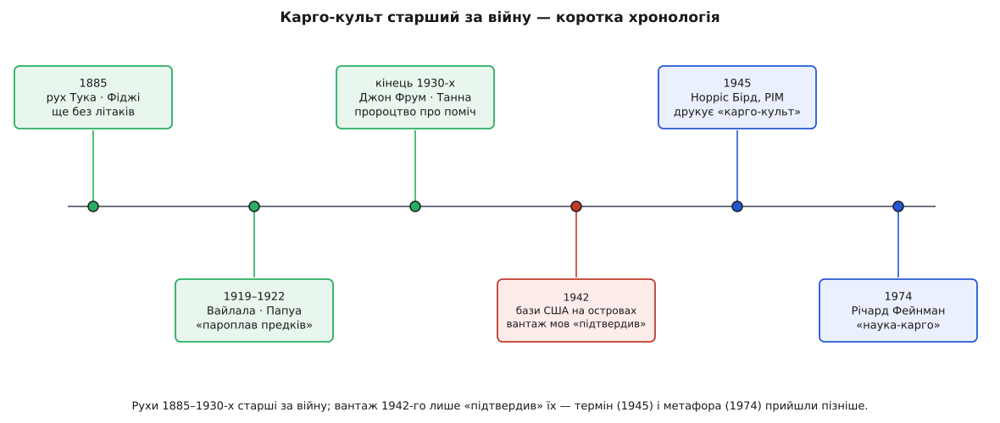

# 📜 Карго-культ: форма без причини, з якою літаки не сідають

Улітку 1974 року фізик **Річард Фейнман** (Richard Feynman, 1918–1988; американець, Нобелівська премія з фізики 1965 року за квантову електродинаміку) вийшов на сцену перед випускниками Каліфорнійського технологічного інституту. Промова називалася «Cargo Cult Science» — «наука-карго». Він говорив про хворобу, яку бачив і в парапсихології, і в цілком «поважних» галузях: коли дослідження носить усі зовнішні ознаки науки — таблиці, контроль, статистику, — а справжньої чесності під ними немає. І щоб назвати цю хворобу одним образом, Фейнман сягнув по історію з островів Тихого океану.

Уся промова трималася на одному правилі, яке він поставив першим принципом: **"you must not fool yourself—and you are the easiest person to fool"** (Фейнман) — не обманюй себе, а обманути себе тобі найлегше з усіх. Карго-культ був для нього найточнішим портретом саме такого самообману: коли людина щиро виконує обряд і щиро не помічає, що під обрядом порожньо.

## Картина, яку намалював Фейнман

Ось як він її подав. Під час війни на тихоокеанські острови сідали літаки й привозили небачений вантаж — консерви, тканину, інструменти, ліки. Війна скінчилася, бази згорнули, літаки перестали прилітати. І тоді, розповідав Фейнман, місцеві заходилися відтворювати **саму обставину**, за якої вантаж колись з'являвся: розчистили в джунглях смугу, обабіч запалили вогні, поставили дерев'яну будку, посадили в ній людину з двома дерев'яними «навушниками» на голові й бамбуковими «антенами», що стирчать назовні, — диспетчера. І чекали, коли ж сяде літак.

Усе — як було. Смуга є, вогні є, диспетчер на місці. А літаки не сідають. Бо скопійовано **видиму** обставину, а не ту **невидиму** причину, з якої літаки колись прилітали насправді: цілу армію, порти, накази, пальне, радіомережу за тисячі кілометрів. Фейнманове визначення було саме таке — ці люди дотримали кожної помітної ознаки процесу, виконали всі його форми, і все ж головного бракує, бо літаки не сідають. Такою, казав він, буває й наука: усі форми дотримано, а відкриття не сідає.

Варто одразу чесно позначити: **це стилізована, стисла картина**, а не польовий звіт. Фейнман — фізик, не етнограф; він узяв реальне явище й обточив його до різкого образу під свою думку. А що стояло за образом насправді — історія багатша й повчальніша, ніж «дикуни наївно копіюють літак».

## Що справді діялося на островах

Явище, яке Фейнман стиснув в одну сценку, антропологи називають **карго-культами** Меланезії. Під час Другої світової на острови ринула небачена лавина товарів: американські й японські бази скидали з неба та вивантажували з кораблів стільки добра, скільки місцеві не бачили за все життя. А потім усе це зникло так само раптово, як з'явилося, — і люди заходилися шукати спосіб повернути вантаж.

Найвідоміший із таких рухів — **Джон Фрум** (John Frum) на острові Танна (тепер Вануату). Тут криється факт, який уже надломлює простий образ: рух зародився ще **наприкінці 1930-х, до великого воєнного вантажу** — як пророцтво про таємничого заступника, що прийде, принесе добробут і прожене колоніальну владу. Коли 1942 року на острови справді ступили американці з їхнім казковим вантажем, це наче **підтвердило** пророцтво — і рух спалахнув із новою силою. Послідовники розчищали злітні смуги, зводили бамбукові «вежі», марширували з бамбуковими «рушницями», малювали на грудях літери «USA», піднімали американський прапор. Саме звідси Фейнманова сценка. Рух живий і досі: щороку 15 лютого на Танні святкують День Джона Фрума. Саме ім'я, за поширеним переказом, — це перекручене «John from America», Джон-з-Америки; етимологія ймовірна, але не доведена, тож лишімо її на рівні легенди.

## Старший за війну

І ось головне, що варто винести про доказовий бік справи. Спокуса — думати, що карго-культи «народила війна»: прилетіли літаки, пішли літаки, звідси й обряд. Насправді **явище старше за літаки**.

Ще 1885 року на Фіджі колоніальні документи фіксують **рух Тука** — обіцянку повернути золотий вік предків і віддати остров'янам добро прибульців. Жодних літаків, ясна річ, тоді не було й близько. А 1919 року в затоці Папуа спалахнуло так зване **вайлальське божевілля** (Vailala Madness, 1919–1922), що його описав австралійський урядовий антрополог Френсіс Едґар Вільямс: старійшина на ім'я Евара провістив, що **пароплав предків** привезе з Європи вантаж живим людям. Вантаж тоді уявляли не в літаку, а на пароплаві, — бо літаків ще не знали. Тобто незмінне ядро культу було не «літак», а зустріч із колоніальним світом і його товарами; літак лише пізніше став зручною формою для того самого давнього сподівання.

Сам **термін** теж молодший за явище. Уперше в друку слова «cargo cult» з'явилися в листопаді 1945 року — у колоніальному часописі *Pacific Islands Monthly*, у статті старого мешканця Території **Норріса Мервіна Берда** (Norris Mervyn Bird), що тривожився, чи не спалахне по війні заворушення серед новогвінейців. Берд узяв ці слова з презирливого жаргону плантаторів. Уже звідти термін підхопила академічна антропологія, а згодом він потрапив і у велике дослідження британця Пітера Ворслі «The Trumpet Shall Sound» (1957).

*Рухи 1885–1930-х старші за війну; вантаж 1942-го лише «підтвердив» давнє сподівання, а термін і метафора Фейнмана прийшли пізніше.*

Отже, статус простий і твердий: рухи задокументовані **задовго до** Другої світової; війна їх не породила, а **підсилила** й подарувала їм упізнаваний образ — смугу, вежу, диспетчера. Термін же прийшов аж 1945-го, а Фейнманова метафора — ще на покоління пізніше, 1974-го.

## Друге дно образу

Тепер найцікавіше — і саме воно робить цю історію вартою окремої розповіді. Пізніша антропологія **перевернула лінзу** й придивилася до самого образу «наївні тубільці копіюють форму, не тямлячи причини». І побачила, що цей образ — сам собою карго-культ.

Пітер Ворслі показав: за «дивними» обрядами стояла цілком твереза сила — це були **протонаціональні, антиколоніальні рухи**, спосіб зневаженого люду повернути собі гідність і лад, вибиті колонізацією. Американець Ламонт Ліндстром пішов далі й дослідив **саме західне захоплення** темою — «каргоїзм»: виявилося, що Заходові карго-культи цікавіші, ніж самим остров'янам, а ярлик «cargo cult» дослідники й журналісти заходилися ліпити мало не на будь-який сільський рух із релігійним чи політичним відтінком. Марта Каплан узагалі пропонувала облишити цей термін, бо він змазує справжню мету — не «наловити ящиків», а відновити зруйновані зв'язки між людьми. Ненсі Макдавелл додала різкий висновок: можливо, «карго-культів» як окремого різновиду й **не існує** — це радше вада ока спостерігача, схильного бачити раптовий надлам там, де насправді точиться повільна зміна.

Ось де ховається друге дно. Хто дивиться на остров'ян і сміється — «які дурні, літак же не сяде», — той **робить рівно той самий карго-культний рух**: копіює видиму форму (безглуздий на око обряд) і не питає про невидиму причину, навіщо цілком розумні люди його звели — заради гідності, ладу, сенсу після катастрофи, що впала на них із чужого світу. Насмішник над карго-культом сам чинить карго-культ над карго-культом.

Це не руйнує Фейнманів образ — це його **загострює**. Мішенню Фейнмана був самообман через скопійовану форму; чесний читач мусить прикласти ту саму дисципліну й до самої метафори — не спинятися на видимому ярлику, а копати до невидимої причини. Метафора й урок під нею крутяться навколо однієї осі.

## Що з цього забрати

Образ карго-культу живе півстоліття не тому, що він екзотичний, а тому, що називає **щось справжнє й повсюдне**: коли всі видимі рухи практики виконано, а невидимої причини, заради якої вони існували, під ними немає. У коді ти впізнаєш це будь-де, де форма — інтерфейс, шар, обряд «доброго коду» — присутня, а сила, що її колись виправдовувала, зникла або її тут ніколи й не було. Смуга розчищена, а літак не сідає.

Та історія додає до цього уроку другий, тонший. Коли рука тягнеться винести комусь присуд — «та це ж карго-культ!», — спинися й перевір, чи не робиш ти саме карго-культ: чи не ліпиш ярлик на видиму форму, не спитавши, яка сила тут насправді працювала. Ліки — ті самі, що їх Фейнман поставив першим принципом: не обманюй себе, а обманути себе тобі найлегше з усіх.
