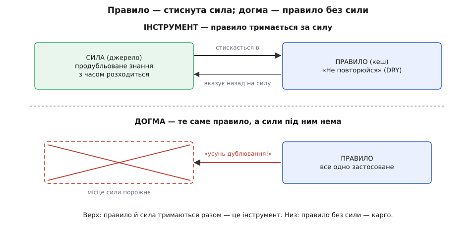
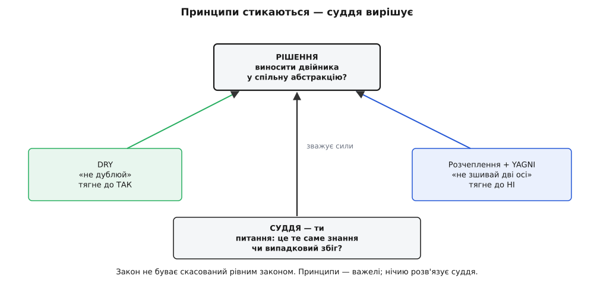
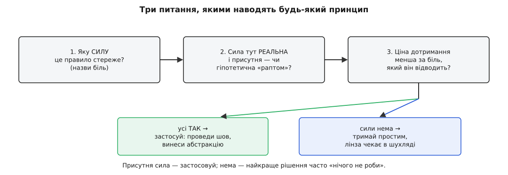

# Принципи як інструменти, не догми

<preknowlist>
- [Trade-off і його ціна](root:sf-apps/tradeoff-analysis) — кожне рішення виграє в одному ціною іншого; «краще» існує лише під конкретну силу, а не взагалі.
- [DRY, KISS, YAGNI](root:sf-apps/dry-kiss-yagni) — «не повторюйся», «тримай простим», «не будуй, поки не треба»: правила, які найлегше перетворити на догму.
</preknowlist>

За цей модуль ти зібрав у шухляду цілий набір компасів. SOLID — п'ять лінз на один шов. Композиція над спадкуванням. [Розділення команди й запиту](root:progarch/cqs-command-query). А ще раніше — зчеплення й зв'язність, інверсія залежностей, шов як точка зміни. Кожен показує свою «північ», і кожним ти вже вмієш скористатися поодинці.

Лишилося найважливіше — і найтонше — вміння: не дати компасові вести себе замість тебе. Бо той самий принцип, що рятує в одному місці, у сусідньому коштує дорого, коли застосувати його наосліп. Ми вже двічі це бачили. Коли [всі п'ять регуляторів SOLID викручують на максимум](root:progarch/solid-audit), код тоне в передчасних абстракціях. А CQS довелося свідомо зламати там, де розділення впускало між кроки чужий виклик. Обидва рази врятувало не правило, а рішення — коли його слухати, а коли ні. Цей крок робить те рішення явним: розберімо, **чим принцип є насправді**, чому спроба зробити з нього закон шкодить, і як тримати його в руці як інструмент, а не носити як заповідь.

## Що таке принцип насправді

Спитаймо по-фейнманівськи, від першопричини: звідки взагалі береться принцип? Ніхто не вигадав «залежи від абстракцій» за столом, із чистого розуму. Хтось прибив високорівневу політику до конкретного вендора, півроку не міг її протестувати без живого акаунта й рахунка за SMS, набив ґулю — і **стиснув** урок у коротке гасло, щоб наступний його не набивав. Принцип (лат. *principium* — начало, першооснова) — це **спресований досвід болю**: чиясь конкретна рана плюс висновок, як її оминути.

І тут криється все. Гасло — це не сам урок, а його **стисла форма**, вказівник на силу, що ховається під ним. Під «не повторюйся» лежить справжня сила: продубльоване знання з часом **розходиться** — виправив в одному місці, забув у трьох, і система сама собі суперечить. Під «залежи від абстракцій» — інша сила: волатильна деталь, пришпилена до стабільної політики, тягне свою нестабільність угору, у те, що мало б стояти твердо. Правило — це **кеш**; сила під ним — **джерело**. І, як усякий кеш, правило корисне рівно доти, доки не відірвалося від джерела.



*Правило — це стиснута форма реальної сили. Поки під гаслом жива сила, воно веде правильно; відірви гасло від сили — і лишиться порожній ритуал.*

Ось чому «догма» (гр. *dógma* — усталена думка, постанова; від *dokeín* — здаватися, вважати) — точна назва для протилежного способу поводитися з принципом. Догма бере **саме гасло** й виконує його незалежно від того, чи є під ним сила. «Тут дублювання — отже, усунути», без питання, чи це те саме знання, чи випадковий збіг двох різних. Правило спрацьовує механічно, а джерело, заради якого воно взагалі існувало, лишається осторонь.

> 🔧 **Навіщо це.** Різниця не філософська, а щоденна й грошова. Розробник, який знає **силу під правилом**, на рев'ю скаже: «тут дублювання нешкідливе — це дві різні осі зміни, вони завтра розійдуться». Розробник, який завчив саме гасло, скаже лише «DRY порушено» — і змусить злити те, що мусило лишитися нарізно. Перший ставить діагноз, другий виконує ритуал; кодова база розплачується за другого роками.

## Догма — це правило без сили під ним

Найточніший образ цієї помилки подарував фізик Річард Фейнман. Виступаючи 1974 року з промовою перед випускниками Каліфорнійського технологічного, він згадав так звані **карго-культи** тихоокеанських островів: під час війни там сідали літаки з вантажем, а коли війна скінчилась і літаки перестали прилітати, місцеві заходилися відтворювати **форму** побаченого — розчищали смуги, палили вогні обабіч, ставили бамбукові «антени» й садили людину з дерев'яними «навушниками» вдавати диспетчера. Усе як було — а літаки не сідають. Бо скопіювали видимий обряд, а не ту невидиму причину, з якої літаки колись прилітали.

Догматичне поводження з принципом — це те саме карго. Ти виконуєш усі видимі ознаки «доброго коду» — інтерфейс, шар абстракції, жодного повтору, — але робиш це тому, що так «належить», а не тому, що під цим є жива сила. Форма скопійована, літаки не сідають. [Звідки взявся образ карго-культу й чому Фейнман назвав ним цілий різновид самообману](root:progarch/principles-as-tools-not-dogma/hist-cargo-cult-science.md) — окрема історія, варта, щоб її знати.

Поглянемо, як це виходить у коді, на найпоширенішому прикладі — [DRY](root:sf-apps/dry-kiss-yagni), правилі «не повторюйся». У хабі Digital Homes два місця шлють власнику сповіщення. Одне — про рух в охоронюваній зоні, друге — коли пристрій зник зі зв'язку. Сьогодні вони на око однакові:

:::tabs
```ts
function notifyMotion(ev: MotionEvent): void {
  const text = `Рух у зоні «${ev.zone}» о ${time(ev.at)}`;
  owner.send(text);
}
function notifyOffline(ev: OfflineEvent): void {
  const text = `Пристрій «${ev.device}» офлайн о ${time(ev.at)}`;
  owner.send(text);
}
```
```py
def notify_motion(ev: MotionEvent) -> None:
    text = f"Рух у зоні «{ev.zone}» о {time(ev.at)}"
    owner.send(text)

def notify_offline(ev: OfflineEvent) -> None:
    text = f"Пристрій «{ev.device}» офлайн о {time(ev.at)}"
    owner.send(text)
```
:::

Рука сама тягнеться злити: обидва «складають рядок із назви й часу та шлють власнику» — то навіщо двічі? Виносимо в один `notify(kind, subject, at)` із шаблоном за `kind`. DRY задоволено, дублювання нема.

А тепер приходить майбутнє — те саме, під яким справжня сила DRY і ховається. Служба безпеки вимагає: тривога має **ескалуватися** — SMS *і* пуш, повторювати, доки власник не підтвердить, і додати рівень небезпеки зони. Офлайн-сповіщення, навпаки, має бути тихим одноразовим пушем, зате з рядком «останній зв'язок N хвилин тому». Дві причини для зміни, які здавалися однією, розходяться. І що робить наш злитий `notify`? Обростає прапорцями:

```ts
function notify(kind: "motion" | "offline", subject: string, at: number): void {
  let text = kind === "motion"
    ? `Рух у зоні «${subject}» о ${time(at)}`
    : `Пристрій «${subject}» офлайн о ${time(at)}`;
  if (kind === "motion") text += ` — небезпека: ${riskOf(subject)}`;   // тільки для тривоги
  const channels = kind === "motion" ? ["sms", "push"] : ["push"];    // тільки для тривоги
  const repeat   = kind === "motion";                                  // …і знову
  // …а завтра тут з'явиться третій kind, і кожне «if» доведеться правити
}
```

Кожна нова вимога до **однієї** з двох гілок тепер лягає в **спільний** метод і ризикує зачепити другу. Ти дивишся на функцію, всю в `if (kind === …)`, і не можеш безпечно чіпати тривогу, не перевіривши, що не зламав офлайн. Це і є **хибна абстракція**: спільним зробили те, що спільним лише **здавалося**. Помітила й назвала цю пастку інженерка Сенді Метц у есеї «The Wrong Abstraction» (2016, з ідеєю зі своєї доповіді 2014 року), і формула звідти варта, щоб її запам'ятати: **дублювання набагато дешевше за хибну абстракцію**. Дублікат ти бачиш і виправиш; хибна ж абстракція збирає навколо себе умовну логіку доти, доки її не стане страшно чіпати взагалі.

Найгірше тут те, що вихід із хибної абстракції коштує дорожче за вхід. Метц дає протиінтуїтивну пораду: **найкоротший шлях уперед — назад**. Те, що сплавлено докупи, розчепи назад по викликах — поверни дублювання; а тоді, коли справжні шви проступлять, абстрагуй заново, уже по правильній осі. [Повний розбір цього циклу на коді DH](root:progarch/principles-as-tools-not-dogma/proj-dry-wrong-abstraction.md) — від передчасного злиття через прапорцеву кашу до чесного розчеплення — показує кожен крок робочим прикладом.

> 🔧 **Навіщо це.** Звідси проста дисципліна проти передчасного DRY — **правило трьох**. Побачив дублікат — не абстрагуй одразу; побачив другий — терпи; аж на третьому, коли вісь спільності справді проступила, виноси. Мартін Фаулер закріпив це в книжці «Refactoring» (1999) з посиланням на Дона Робертса: «тричі — тоді рефактор». Два збіги ще нічого не доводять; три вже показують, **що саме** спільне. Так ти абстрагуєш за справжньою силою, а не за випадковою схожістю рядка.

## Принципи стикаються — тому вони не закони

Досі ми брали принципи поодинці. Але є аргумент, який робить «не догма» не порадою, а **логічною необхідністю**: принципи **суперечать один одному**. А те, що суперечить рівному собі, законом бути не може — закон не буває скасований іншим законом того самого рангу.

Подивись на щойно розібране. DRY тягнув: «злий, не дублюй». А [розчеплення](root:sf-apps/coupling-cohesion) разом із [YAGNI](root:sf-apps/dry-kiss-yagni) тягнули у зворотний бік: «не зшивай дві різні осі зміни, не будуй спільного, поки потреба не довела себе». На тому самому рядку коду два поважні принципи показали **протилежну** північ. Хто ж має рацію? Обидва — і жоден. Бо жоден не закон; кожен лише називає свою силу, а яка сила тут переважає, вирішує не гасло.

І це не одиничний випадок, а норма. OCP штовхає завести точку розширення заздалегідь — YAGNI велить не будувати її, поки другий варіант не постукав. [Приховування інформації](root:sf-apps/information-hiding) ховає нутрощі — а тестованість інколи просить лишити шов, крізь який видно всередину. Незмінність кричить «копіюй, не мутуй» — а гарячий цикл на мільйон елементів вимагає мутувати на місці, бо копія не влазить у бюджет. Скрізь та сама картина: два добрі принципи, одна ділянка коду, різні напрямки.



*Два поважні принципи на одному рішенні показують протилежне. Розв'язує не гасло гучніше, а суддя — той, хто питає, яка сила тут справжня.*

Якби принципи були законами, така суперечка була б катастрофою — систему правил, що самі собі перечать, не можна виконати. Але вони не закони, а **важелі**, кожен зі своєю вагою, і суперечка між ними — нормальний робочий стан, у якому хтось мусить **зважити**. Цей «хтось» — ти. Саме тут змикається все, з чого починався курс: рішення архітектора — це завжди [trade-off](root:sf-apps/tradeoff-analysis), вибір під конкретні сили, а не пошук відповіді, «правильної взагалі». Принцип у цьому виборі — не суддя, а свідок: він виходить і чесно каже, яку силу бачить зі свого боку. Судиш — ти.

## Як тримати принцип як інструмент

З цього випливає цілком практичний спосіб користуватися будь-яким принципом — старим, новим, ще не баченим. Замість питати «чи дотримано правило?» (питання догматика) став правилу три питання, і в такому порядку:

```
1. Яку СИЛУ це правило стереже?        → назви біль, від якого воно рятує
2. Ця сила тут РЕАЛЬНА і присутня —     → чи справді дві осі зміни / волатильна
   чи гіпотетична, «а раптом колись»?      деталь / нечесна підстановка вже тут?
3. Ціна дотримання менша за той біль?   → скільки коштує шов, абстракція, копія —
                                           і чи вона окупається саме тут?
```

Пройди їх на живому рішенні. `notify` з нашого прикладу: сила DRY — «спільне знання розійдеться» (Q1). Чи воно тут спільне? Ні — тривога й офлайн мають різні осі зміни, збіг рядка випадковий (Q2). Отже, дотримати DRY тут означає **створити** біль, а не відвести його — тримаємо нарізно. А тепер інше рішення з того ж хаба: рівень небезпеки зони рахують за однією формулою у трьох місцях, і бізнес міняє її як одне ціле. Сила є, вона спільна й реальна (Q1–Q2), ціна виносу — один невеликий модуль (Q3) — виносимо, тепер уже за правильною віссю.



*Ті самі три питання наводять будь-який принцип. Присутня сила — застосовуй; сили нема — найкраще рішення часто «не роби нічого», а лінзу лиши в шухляді до справжнього болю.*

Ключове в цьому тесті — друге питання, і воно ж найчастіше провалене. Сила має бути **присутня**, а не уявна. «А раптом колись знадобиться другий платіжний провайдер» — не сила, а фантазія про майбутнє, і саме на ній виростають передчасні абстракції, від яких застерігав минулий крок. Тиск має бути справжній: другий актор **уже** тягне у свій бік, другий канал **уже** на порозі, підстановку **вже** роблять. Немає тиску — принцип мовчить, а ти тримаєш просто.

> 🔧 **Навіщо це.** Цей тест — те, що відрізняє інженера від виконавця чекліста, і його видно на рев'ю. «Порушено DIP» — присуд догматика, під ним не підпишешся. «Ця політика прив'язана до Twilio (сила DIP), і другий канал уже в спринті (сила присутня), а вивести його — це один інтерфейс (ціна мала) — виносимо» — це рішення, яке можна захистити й яке хтось інший зможе оскаржити по суті. Принцип у такій розмові — не аргумент «бо так треба», а назва конкретної сили, про яку тепер сперечаються предметно.

## Що лишається в руках

Отже, весь набір компасів цього модуля — SOLID, композиція, CQS — здобуває тепер спільну оправу. Принцип не наказує; він **називає силу** й показує, куди та сила тягне. Твоя робота — не «дотриматися» всіх одразу (це неможливо, бо вони перечать), а на кожному рішенні спитати, яка сила тут справжня й присутня, зважити ціну та вибрати. Правило — стиснутий досвід, кеш чужого болю; корисний, поки не відірвався від джерела, і шкідливий, коли його женуть як обряд.

Це вміння більше за цей модуль. Далі курс дасть тобі ще десятки інструментів — [патерни](root:sf-apps/what-is-pattern), шаблони застосунку, моделі конкурентності, стилі сховищ. Кожен приходитиме зі спокусою вивчити його як припис і «застосовувати правильно». Читай їх усі однаково: не «як належить», а **яку силу цей інструмент стереже і чи є вона тут**. Патерн, накинутий без своєї сили, — таке саме карго, як абстракція без осі зміни.

А наступний модуль бере найтвердіший із цих інструментів — **контракт як межу**. Бо коли ти вирішив, де провести шов, лишається питання, яке роздивимось упритул: що саме ти обіцяєш по обидва боки цієї межі, і як зробити ту обіцянку такою, щоб її можна було перевірити.
