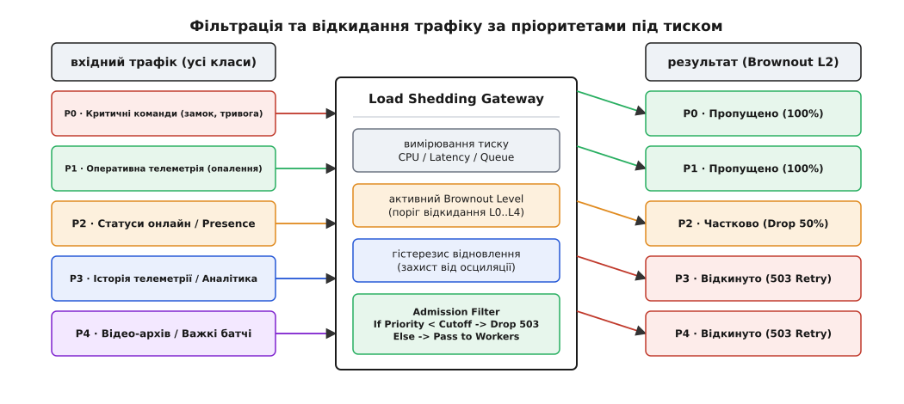
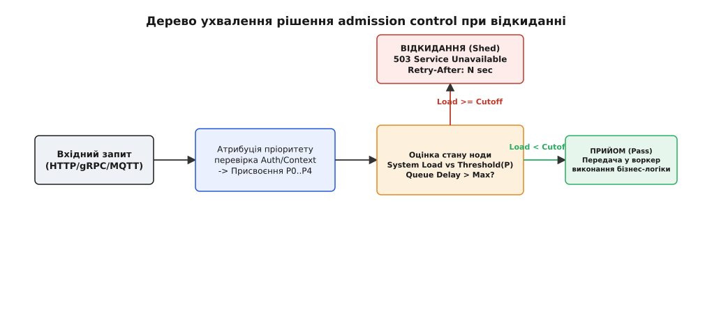
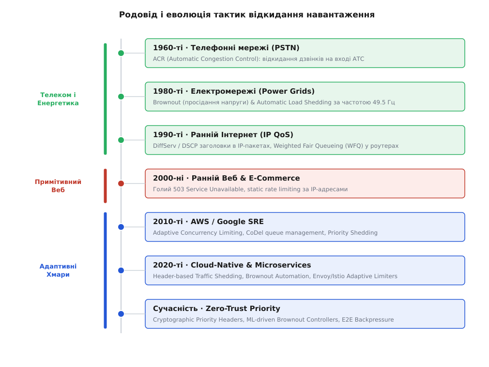
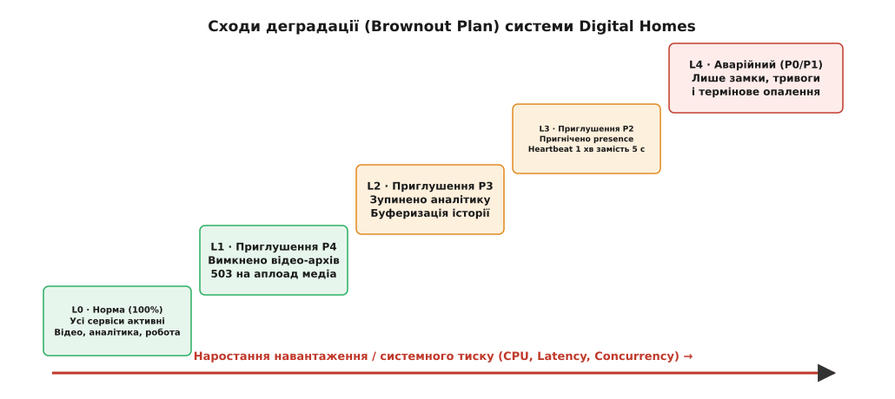
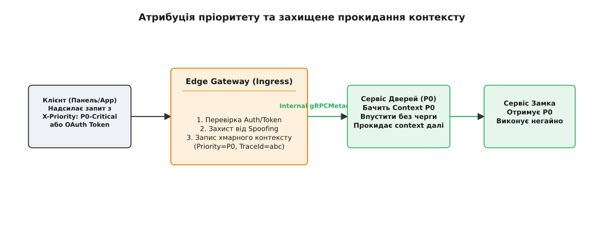

# Пріоритезація трафіку як рішення

<preknowlist>
- [Admission control](topic:sf-distributed/admission-control) — захист системи на межі прийому: чому не можна брати більше, ніж здатний обробити процесор.
- [Скидання навантаження](topic:sf-distributed/load-shedding) — відкидання надлишку запитів як єдиний спосіб врятувати систему від катастрофічного колапсу.
- [Graceful degradation](topic:sf-distributed/graceful-degradation-primary) — плавна деградація функціоналу замість падіння всієї системи під тиском.
- [Адаптивні ліміти конкурентності](topic:sf-distributed/adaptive-concurrency) — динамічне вимірювання пропускної здатності нод за затримкою та чергою.
</preknowlist>

Уявіть, що в житловому масиві на 100 000 квартир вимкнули електроенергію на три години. Коли живлення нарешті відновилося, 100 000 домашніх хабів платформи розумного дому Digital Homes (DH) одночасно вийшли в мережу й ринулися зв'язуватися з хмарою. Кожен хаб намагається відвантажити накопичені за три години гігабайти відео з дверних камер, передати тисячі записів історії температури, відновити сесію сповіщень та прозвітувати про свій онлайн-стан. Водночас мешканці, які повернулися додому з роботи, стоять біля своїх під'їздів і тиснуть у мобільному застосунку єдину критичну кнопку — «відчинити замок».

Якщо ваша система сприймає ці 500 000 вхідних запитів як однорідну масу і намагається обробити їх чесно в порядку надходження (First-In, First-Out), відбувається катастрофа. Вхідні черги серверів миттєво забиваються важкими пакетами відеоархіву та аналітики. Процесори нод закипають на 100% завантаження, затримка обробки (latency) зростає з 10 мілісекунд до 45 секунд, а запити на відкриття замків відпадають за таймаутом. Людина стоїть перед зачиненими дверима власної квартири й бачить помилку з'єднання, хоча обчислити знак відкриття замка вимагає лише 100 мікросекунд процесорного часу. Сервер згорів, виконуючи другорядну роботу, і завалив роботу критичну. Корисна продуктивність системи (goodput) упала майже до нуля.


*Сходи деградації та фільтрація трафіку під тиском. У разі виникнення перевантаження система послідовно скидає найнижчі класи пріоритетів (P4, P3), забезпечуючи 100% проходження критичних викликів P0 та P1.*

Головна причина цієї аварії — ілюзія рівноправності трафіку. У розподіленій системі, що перебуває під тиском, намагання ставитися до всіх запитів однаково — це не чесність, а гарантований спосіб убити систему. **Пріоритезація трафіку як рішення** полягає у відмові від ідеї обробити все під час сплеску та переході до усвідомленого вибору: що впустити першим, а що безжально скинути на межі.

> 🔧 **Навіщо це.** Спроба обробити 100% запитів при 150% навантаженні призводить до того, що система обробляє 0% корисної роботи. Пріоритезоване скидання навантаження (Priority Load Shedding) дає змогу відкинути 30% другорядного трафіку на самому вході й зберегти 100% працездатності для функцій, без яких бізнес чи фізична інфраструктура зупиняються.

---

## 1. Ілюзія однорідного трафіку та крах чесних черг

Більшість класичних алгоритмів керування мережевим трафіком та чергами задач розроблялися з розрахунку на чесність (Fair Queueing). Коли ресурси вузла обмежені, система намагається виділити кожному клієнту чи кожному типу запиту рівну частку процесорного часу або пропускної здатності шини. Проте в реальних бізнес-системах запити мають кардинально різну цінність та різний допуск до затримки.

Придивімося до того, що відбувається з вузлом, коли вхідний потік перевищує межу продуктивності. Згідно з теорією масового обслуговування (закон Літтла), якщо середня інтенсивність вхідного потоку `λ` перевищує інтенсивність обслуговування `μ` (`λ > μ`), довжина черги починає зростати до нескінченності. На практиці черга обмежена розміром буфера. Коли буфер заповнюється, нові запити або чекають у черзі до закінчення свого таймауту, або відкидаються випадковим чином (Tail Drop).

Якщо в цій єдиній черзі перемішані запити P0 («відчинити замок») та запити P4 («завантажити фонове відео»), виникають три руйнівні ефекти:

1. **Забруднення буфера (Bufferbloat)**: Важкі запити з великими тілами даних заповнюють оперативну пам'ять та буфери сокетів. Дрібний запит P0 змушений чекати в черзі позаду десятка мегабайтних батчів.
2. **Марна праця (Wasted Work)**: Запит P0 чекає в черзі 5 секунд, після чого мобільний застосунок скасовує його за таймаутом і повертає користувачу помилку. Проте сервер цього не знає: через 5 секунд процесор нарешті дістається до цього запиту й витрачає ресурси на його виконання, хоча результат уже нікому не потрібен.
3. **Метастабільний колапс (Metastable Failure)**: Клієнти, не отримавши відповіді через затримку, починають повторювати свої запити (retry storm). Старий запит усе ще висить у черзі сервера, а клієнт уже надсилає новий такий самий. Навантаження на систему подвоюється, хоча реальний попит не змінився.


*Дерево ухвалення рішення Admission Control. Перевірка пріоритету та стану ресурсів ноди відбувається до виділення пам'яті під обробку бізнес-логіки.*

Щоб розірвати це коло, архітектор мусить відмовитися від концепції однорідного трафіку й ввести **критичність як обов'язковий атрибут кожного запиту**, що перетинає межу системи.

---

## 2. Класифікація пріоритетів: критичність як атрибут запиту

Етимологія слова *пріоритет* походить від латинського *prior* — перший із двох, вищий за становищем чи значенням. Слово *shedding* у контексті *load shedding* походить від англійського *to shed* — скидати, позбавлятися баласту (як дерево скидає листя восени, а корабель скидає баласт під час шторму, щоб не піти на дно).

Щоб побудувати дієвий механізм скидання навантаження, систему класифікують за матрицею двох вимірів: **Біль від втрати (Business Loss)** × **Чутливість до затримки (Time Sensitivity)**.

На цій основі будується 5-рівнева ієрархія класів пріоритетів (Priority Classes):

### P0 · Critical Emergency (Найвищий пріоритет / Non-sheddable)
- **Суть**: Операції, зупинка яких означає фізичну небезпеку для людей, загрозу майну чи прямому фінансовому збитку.
- **Приклади**: Команда відмикання дверного замка при пожежній тривозі, сигнал датчика протікання води, первинна авторизація платіжної транзакції.
- **Поведінка**: Обробляються завжди. Скидаються лише у випадку абсолютного фізичного вичерпання ресурсів вузла (аппаратне падіння).

### P1 · High Operational (Високий операційний пріоритет)
- **Суть**: Основні інтерактивні сценарії користувача, які очікують миттєвої відповіді в режимі реального часу.
- **Приклади**: Ввімкнення світла з настінної панелі, запуск сценарію клімат-контролю, отримання списку активних кімнат у застосунку.
- **Поведінка**: Захищаються від скидання. Можуть дегрувати лише в умовах надзвичайного тиску (Brownout L4).

### P2 · Medium Status (Середній пріоритет / Presence)
- **Суть**: Періодичні сигнали життєдіяльності та оновлення стану, відсутність яких на короткий час не ламає систему.
- **Приклади**: Heartbeat-сигнали домашнього хаба (статус online/offline), оновлення фонових віджетів погоди.
- **Поведінка**: Під тиском частота їх прийому пригнічується (rate throttling) або вони частково відкидаються.

### P3 · Low Analytics (Низький пріоритет / Історія)
- **Суть**: Фонова телеметрія, накопичувальна статистика та аналітика.
- **Приклади**: Графік зміни температури у вітальні за місяць, збір статистики кліків у меню.
- **Поведінка**: Скидаються на перших стадіях виникнення заторів (Brownout L2). Дані буферизуються на боці джерела (на хабі чи клієнті).

### P4 · Background Bulk (Найнижчий пріоритет / Shed First)
- **Суть**: Фонове вивантаження великих обсягів даних, які не мають жодної терміновості.
- **Приклади**: Вивантаження архівного відео з камер спостереження у хмарний архів, пакетний експорт системних логів, завантаження оновлень прошивки.
- **Поведінка**: **Shed first.** Відкидаються першими при найменшому перевищенні нормального порогу завантаження ноди (Brownout L1).

Детальні технічні специфікації заголовків, коди відповідей та стандартизований конверт помилки RFC 9457 для сигналізації про відкидання описано у вставці [контракт метаданих пріоритезації та Brownout-відповідей](root:progarch/priority-and-shedding-choice/api-shedding-contract.md).

```
+-------------------------------------------------------------------------+
|                  МАТРИЦЯ АТРИБУЦІЇ ПРІОРИТЕТІВ                          |
+-------------------+---------------------------------+-------------------+
| Клас пріоритету   | Бізнес-критичність              | Допуск затримки   |
+-------------------+---------------------------------+-------------------+
| P0 · Critical     | Абсолютна (безпека / замок)     | < 100 мс          |
| P1 · High         | Висока (прямі дії користувача)  | < 500 мс          |
| P2 · Medium       | Середня (статуси / presence)     | < 5–10 с          |
| P3 · Low          | Низька (історія телеметрії)     | Хвилини / години  |
| P4 · Background   | Фонова (відеоархів / логи)      | Доби / дні        |
+-------------------+---------------------------------+-------------------+
```

---

## 3. Математика та алгоритми пріоритезованого прийому (Token Bucket & Concurrency Limiting)

Для точного керування прийомом навантаження застосовують два базових математичних алгоритми: **Multi-Tier Priority Token Bucket** та **Adaptive Concurrency Limiting (CoDel / TCP Vegas)**.

### 3.1. Багатоярусний Token Bucket (Priority Token Bucket)
У класичному Token Bucket генируються токени з постійною швидкістю `R` токенів/с до максимальної ємності `B`. При виклику запиту з кошика вилучається 1 токен. 

У пріоритетному варіанті кошики розділяються на рівні із зарезервованим мінімальним обсягом:

```
Загальна ємність кошика: B = 100 токенів
├── Резерв P0 (Critical):     20 токенів (доступні ЛИШЕ для P0)
├── Резерв P0 + P1:           30 токенів
├── Загальний пул P0..P3:     30 токенів
└── Спільний шар P0..P4:      20 токенів
```

Запит P4 може забрати токен лише зі спільного шару. Якщо спільний шар вичерпано, P4 отримує відмову `503`, навіть якщо в кошику залишається 50 токенів, зарезервованих для P0 та P1.

### 3.2. Адаптивні ліміти на основі затримки (Adaptive Concurrency)
Алгоритм адаптивної паралельності динамічно обчислює максимальну кількість паралельних запитів `Limit_t` на основі виміряного часу відгуку:

```
Gradient = RTT_noload / RTT_actual
Limit_(t+1) = Limit_t * Gradient + Headroom
```

Де `RTT_noload` — мінімальний час відгуку сервера без навантаження (наприклад, 4 мс), а `RTT_actual` — виміряний p95 час відгуку під поточним навантаженням. Коли `RTT_actual` зростає через черги, `Gradient` стає меншим за 1, і допустимий ліміт паралельності звужується, автоматично змушуючи контролер переходити на вищі рівні Brownout.

---

## 4. Механізм відкидання під тиском (Load Shedding Engine)

Щоб пріоритезація трафіку працювала, система повинна мати компонент, який на основі виміряного тиску ухвалює рішення про відкидання запитів. Цей компонент називається **Admission Controller** (або Load Shedder).

Історично концепція відкидання навантаження пройшла еволюцію від телефонних АТС 1960-х років та реле електромереж до сучасних хмарних проксі-серверів. Докладний розбір цієї еволюції та інженерних витоків наведено у вставці [історія скидання навантаження та brownout-планів](root:progarch/priority-and-shedding-choice/hist-priority-shedding.md).


*Родовід і еволюція тактик відкидання навантаження. Інженерні принципи пройшли шлях від АТС і частотних реле електромереж до сучасних хмарно-нативних адаптивних контролерів.*

Ключові вимоги до механізму відкидання:

### 4.1. Відкидання на самій межі (Early Dropping)
Запит, який підлягає скиданню, має зупинятися **якомога раніше** по ланцюжку викликів — ідеально на рівні Edge Gateway або Ingress Proxy (Envoy, Nginx). Якщо запит P4 уже пройшов шлюз, розпарсив JSON, створив об'єкти в пам'яті, пройшов аутентифікацію й відправив RPC-виклик у сервіс баз даних, а той його відкинув — 90% ресурсів уже витрачено даремно. Ранній відкидач перевіряє заголовки й повертає `503 Service Unavailable` за частки мікросекунди.

### 4.2. Динамічне вимірювання тиску замість статичних RPS
Статичний ліміт запитів за секунду (наприклад, «не більше 1000 RPS») не працює в реальних системах, оскільки складність запитів змінюється. 1000 дрібних P0 запитів створюють 5% навантаження CPU, а 1000 важких P4 запитів з вибіркою з БД завалять той самий сервер.

Сучасний Admission Controller вимірює **реальний фізичний стан вузла**:
- **Queueing Delay (Затримка в черзі)**: Час, який запит проводить у чеканні перед тим, як перший воркер почне його обробку. Якщо затримка в черзі перевищує 50 мс, сервер перебуває під тиском.
- **Active Concurrency (Кількість паралельних запитів)**: Кількість потоків або async-задач, що виконуються в даний момент.
- **CPU Utilization / Garbage Collection Pressure**: Завантаження процесора та час пауз збирача сміття.

Приклад реалізації адаптивного контролера з обчисленням рівнів деградації та гістерезисом мовами C та C++ розібрано у вставці [адаптивний контролер відкидання навантаження](root:progarch/priority-and-shedding-choice/proj-shedding-middleware.md).

---

## 5. Brownout-план: сходи деградації під тиском

Термін **brownout** запозичений з електротехніки. На відміну від **blackout** (повного аварійного вимкнення електроенергії), *brownout* означає контрольоване зниження напруги в мережі (наприклад, з 230 В до 205 В). Лампи починають світити тьмяніше, але енергосистема зберігає базову частоту 50 Гц і уникає катастрофічного падіння генераторів.

У програмній архітектурі **Brownout-план** — це чітко специфікована послідовність сходів деградації функціоналу системи залежно від рівня навантаження.


*Сходи деградації (Brownout Plan) системи Digital Homes. Зі зростанням навантаження система почергово вимикає шар за шаром, залишаючи в аварійному режимі лише критичне ядро.*

Придивімося до сходів деградації на прикладі 5 рівнів Brownout:

### Level 0 · Normal Operations (0–70% навантаження)
- **Стан**: Система працює у штатному режимі.
- **Поведінка**: Усі класи запитів (P0..P4) приймаються й обробляються з повними гарантіями якості (SLA).

### Level 1 · Light Degradation (70–85% навантаження)
- **Стан**: Помітне зростання затримки на нодах.
- **Дія**: Активація скидання класу **P4 (Background Bulk)**.
- **Ефект**: Припиняється прийняття нових відеоархівів. HTTP-запити вивантаження медіа отримують `503 Service Unavailable` з `Retry-After: 120s`. Відеокамери буферизують записи на своїх SD-картах.

### Level 2 · Moderate Degradation (85–92% навантаження)
- **Стан**: Високе завантаження CPU та оперативної пам'яті.
- **Дія**: Додаткове скидання класу **P3 (Low Analytics)**.
- **Ефект**: Припиняється запис та обробка аналітичних подій. Домашній хаб перестає надсилати статистику температури у хмару й зберігає її в локальному кільцевому буфері.

### Level 3 · Heavy Degradation (92–97% навантаження)
- **Стан**: Критична затримка в чергах.
- **Дія**: Скидання класу **P2 (Medium Status / Presence)**.
- **Ефект**: Інтервал надсилання heartbeat-повідомлень збільшується з 5 секунд до 60 секунд. Статуси пристроїв у мобільному застосунку переходять у режим «може бути застарілим» (stale data).

### Level 4 · Emergency Mode ( > 97% навантаження)
- **Стан**: Загроза повного колапсу вузла.
- **Дія**: Проходять **лише класи P0 та P1**. Усі інші запити скидаються негайно на вході Ingress.
- **Ефект**: Модулі аналітики, медіа та статуси повністю вимкнені. Уся обчислювальна потужність і смуга пропускання віддані сервісу замків, тривог та критичного опалення.

---

## 6. Наскрізний кейс DH: шторм перепідключення після blackout

Повернімося до нашої аварійної ситуації в системі Digital Homes (DH), коли після відновлення живлення в районі 100 000 домашніх хабів одночасно ринулися в хмару. Простежмо роботу Brownout-контролера в динаміці часу.


*Атрибуція пріоритету та захищене прокидання контексту. Edge Gateway аутентифікує запит, проставляє захищений заголовок пріоритету й прокидає його у внутрішні gRPC-метадані.*

### Хронологія порятунку системи:

- **Т + 0.0 с**: Електроенергію відновлено. 100 000 хабів шлють запити зв'язку. Вхідний потік становить 350 000 RPS при нормальній ємності кластера в 80 000 RPS.
- **Т + 0.5 с**: Вхідні черги Edge Gateway заповнюються. Затримка в черзі (`RTT_queue`) стрибає з 3 мс до 180 мс.
- **Т + 0.8 с**: Адаптивний контролер фіксує перевантаження й автоматично переводить систему в **Brownout Level 2**.
  - Усі вхідні запити P4 (відео з камер) відкидаються на вході Envoy-проксі за 0.1 мс з кодом `503` та заголовком `Retry-After: 300`.
  - Усі запити P3 (історія телеметрії) повертають `503 Retry-After: 180`. Хаби бачать цей код і переключаються в режим локального накопичення на флеш-пам'ять.
- **Т + 1.2 с**: Звільнення 75% обчислювальних ресурсів від відкидання P3/P4 не покриває сплеск, оскільки 100 000 хабів усе ще намагаються передати свої heartbeat-сигнали (P2). Затримка черги сягає 400 мс.
- **Т + 1.5 с**: Контролер підвищує рівень до **Brownout Level 3**.
  - Запити P2 (heartbeat) починають відкидатися з випадковим джитером (random drop 80%).
- **Т + 2.0 с**: Потік запитів, що доходять до бізнес-воркерів, падає з 350 000 RPS до 25 000 RPS (лише P0, P1 та залишок P2).
- **Т + 2.2 с**: Процесори нод розвантажуються до 65% CPU. Затримка обробки запиту P0 («відчинити замок») падає до **8 мілісекунд**.
- **Т + 2.5 с**: Людина біля під'їзду натискає кнопку в застосунку. Запит P0 миттєво проходить крізь розвантажений Edge Gateway, обробляється сервісом авторизації дверних засувок, і замок відкривається без жодної затримки.

Система пережила 4-кратний перевантажувальний шторм без жодного інциденту для користувачів у критичних сценаріях.

---

## 7. Архітектурні розплати, пастки та захист від осциляцій

Запровадження пріоритезації трафіку та відкидання навантаження вимагає вирішення кількох складних інженерних компромісів та захисту від типових пасток.

### 7.1. Інверсія пріоритетів (Priority Inversion)
Пастка виникає тоді, коли високопріоритетний запит (P0) зупиняється в очікуванні ресурсу, який заблокований низькопріоритетним запитом (P4).

*Приклад*: Запит P0 («відчинити замок») звертається до бази даних за ключем авторизації. У цей же момент запит P4 («експорт логів») відкрив транзакцію в цій же таблиці й тримає рядовий ексклюзивний lock. У результаті запит P0 чекає на P4, а відкидач P4 вже не може допомогти, бо запит P4 вже перебуває всередині бази даних.

*Рішення*: **Bulkheading (Ізоляція ресурсів)**. Пули з'єднань з базою даних, пули потоків та пам'ять для P0/P1 мусять бути строго ізольовані від P3/P4. Низькопріоритетний трафік не має права використовувати ті самі блоки пулу, що й критичний трафік.

### 7.2. Захист від осциляцій (Flapping & Hysteresis)
Якщо контролер змінює рівні Brownout строго за монотонним порогом (наприклад, `L1` при CPU > 80%, `L0` при CPU < 80%), система потрапляє в режим **осциляції (flapping)**:
- CPU досягає 81% -> Активація L1 -> Скидання P4 -> CPU падає до 78% -> Повернення в L0 -> Прийом P4 -> CPU знову 81%.

Сервер починає переключатися між режимами по 50 разів на секунду, породжуючи хаотичні сплески помилок.

*Рішення*: **Гістерезис (Hysteresis)**. Поріг повернення на нижчий рівень деградації має бути нижчим за поріг активації на величину дельти `Δ`. Якщо L1 вмикається при 80% завантаження, то вимикатися він повинен лише тоді, коли завантаження впаде нижче 70% і втримається на цьому рівні щонайменше 10 секунд.

### 7.3. Захист від підробки пріоритету (Anti-Spoofing Guard)
Якщо клієнтський застосунок дізнається, що заголовки `X-Priority: P0-Critical` проходять без черги, зловмисники чи сторонні розробники почнуть проставляти цей заголовок на всі свої запити (включаючи завантаження котиків чи аналітики).

*Рішення*: **Криптографічна атрибуція на Edge Gateway**. Зовнішні клієнти не мають права встановлювати пріоритет. Edge Gateway очищує будь-які вхідні заголовки `X-Priority` з ненадійного мережевого периметра й самостійно проставляє дійсний клас пріоритету на основі OAuth2-токена, API-ключа та типом викликаного ендпоінту.

---

## 8. Висновки та чек-лист архітектора

Пріоритезація трафіку та відкидання навантаження — це фундаментальна тактика стійкості, що перетворює систему з крихкої на адаптивну.

### Чек-лист для впровадження у вашому проєкті:

1. **Проведено класифікацію ендпоінтів**: Кожен маршрут API чітко віднесено до одного з класів P0..P4.
2. **Edge Gateway валідує метадані**: Зовнішні клієнти не можуть самостійно підробити свій пріоритет.
3. **Вимірювання тиску за затримкою**: Admission Controller спирається на Queue Delay та Active Concurrency, а не лише на статичний RPS.
4. **Контракт 503 з `Retry-After`**: Усі відкинуті запити отримують чітку інструкцію для повтору із обов'язковим клієнтським джитером.
5. **Активовано гістерезис**: Повернення з Brownout відбувається плавно, без осциляцій.
6. **Ізоляція пулів (Bulkheading)**: Критичні P0 запити не чекають на блоки чи транзакції, утримувані P4 запитами.
