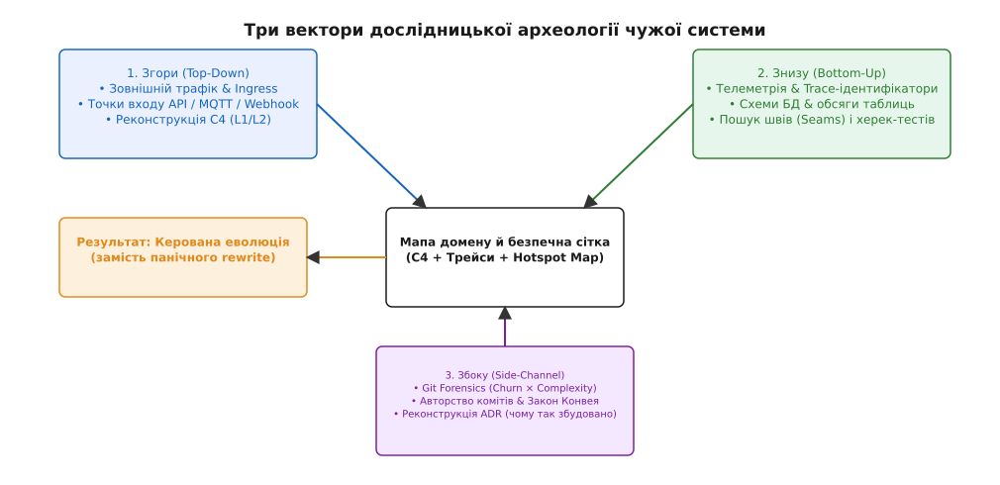
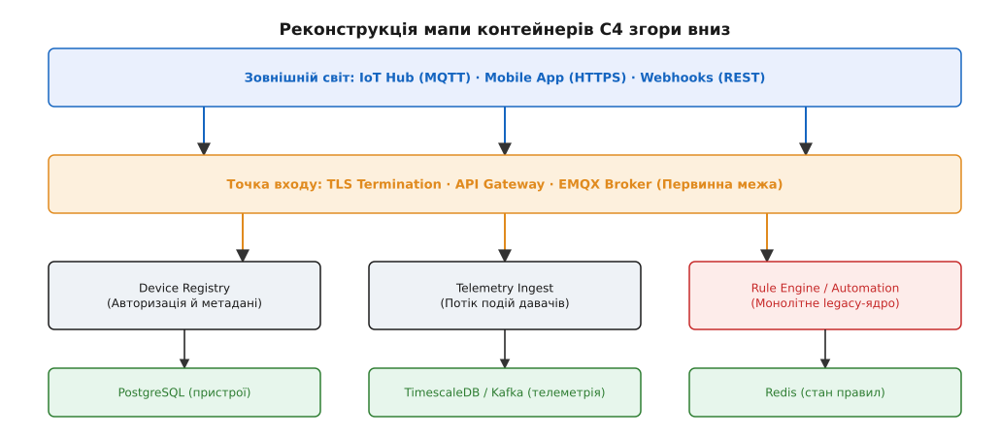
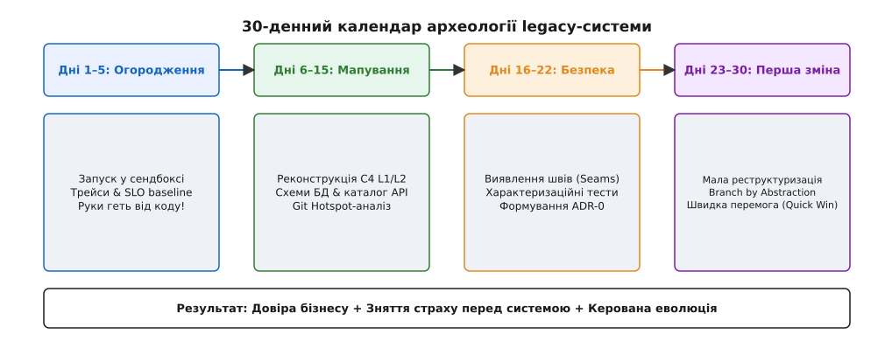

# Прийшов у чужу систему

<preknowlist>
- [Археологія legacy](root:sf-apps/legacy-archaeology) — реверс-інжиніринг системи без актуальної документації, відкриття швів та характеристичні тести.
- [Ерозія архітектури](root:sf-apps/architecture-erosion) — розходження між задуманою та реалізованою архітектурою під тиском років.
- [Модель C4](root:sf-apps/c4-model) — чотири рівні деталізації для опису та координації архітектури.
- [Трейси та логи](root:sf-release/distributed-tracing) — наскрізна спостережуваність як інструмент аналізу реальних шляхів трафіку.
</preknowlist>

Перший день нової команди на платформі Digital Homes (DH) починається з тиші в Slack і пів мільйона рядків коду у 40 репозиторіях. Попередній склад розробників повністю звільнився пів року тому, у Confluence лежить схематична C4-діаграма чотирирічної давнини, яка описує моноліт на Python 2.7, хоча в продакшні фактично працюють сервіси на Go, Java та C++, а давачі з всієї країни надсилають бінарні пакети у невідомо де розташований MQTT-брокер. Спроба натиснути «переписати все з нуля» вимагає двох років і мільйонного бюджету, а бізнес вимагає відремонтувати витік пам'яті в модулі обробки відео до кінця поточного місяця. У цей момент інженер розуміє: він потрапив у класичну ситуацію «курсу навиворіт».

Усі попередні модулі проєктування вчать зводити систему **вперед** — від бізнес-домену та атрибутів якості, крізь межі контекстів, до C4-діаграм, моделей даних, контрактів і журналів логів. Але коли ти успадковуєш чуже legacy, цей потік розвертається на 180 градусів. У тебе немає опису домену та меж контекстів — у тебе є лише сирі логи, відкриті мережеві порти, таблиці в PostgreSQL із незрозумілими назвами полів і мільйони комітів у git. Археологія незнайомої системи — це мистецтво реконструювати задум архітектора за його матеріальними слідами, побудувати безпечну сітку тестування та здійснити першу контрольовану зміну, не розваливши продакшн.


*Три класичні напрямки дослідницької археології: рух згори за мережевим трафіком формує C4-контейнери; рух знизу від БД і трейсів відкриває доменні інваріанти; рух збоку через git-історію викриває реальні точки болю.*

## 1. Фундаментальна пастка реверс-архітектури та парадигма «курсу навиворіт»

У класичному проєктуванні програмної архітектури процес вибудовується за методом прямого синтезу. Спочатку аналітики та архітектори досліджують доменну область, формують єдину мову (Ubiquitous Language), виділяють обмежені контексти (Bounded Contexts), обирають топологію сервісів, проєктують схеми баз даних і наприкінці додають логування й спостережуваність. Кожен шар є логічним наслідком попереднього:

```
[Бізнес-домен] → [Обмежені контексти] → [C4 Архітектура] → [Схеми БД] → [Код і Логи]
```

Проте при вході в незнайому чужу систему цей класичний ланцюжок повністю недоступний. Початкова документація застаріла або відсутня, автори системи звільнилися, а єдина доступна реальність — це запущений у продакшні вихідний код і потік даних. Археологія legacy-системи працює строго у зворотному напрямку:

```
[Сирі Логи й Порти] → [Схеми БД й Трейси] → [C4 Контейнери] → [Межі Контекстів] → [Домен]
```

Більшість команд, опинившись у чужій системі без цього розуміння, припускаються однієї з двох крайніх помилок, кожна з яких є однаково згубною для проєкту:

1. **Паніка й Big Rewrite Trap (Спроба переписати все з нуля).** Інженер дивиться на заплутаний код моноліту DH, бачить `switch` на 800 рядків і вигукує: «Це жахливо написана система, ми збудуємо нову за 3 місяці!». Він забуває, що за цими 800 рядками приховано п'ять років виправлень крайніх випадків, робочих обходів багів апаратних давачів та неявних бізнес-правил. Запустити паралельне переписування — означає потрапити в пастку Другої системи (Second-System Syndrome): нова версія затримається на роки, зжере весь бюджет і повторить 80% старих багів.
2. **Гарячковий локальний ремонт (Chesterton's Fence Trap).** Новачок бачить «очевидно зайвий» `if`-блок або застарілий виклик `sleep(5)` у коді обробника подій DH і відразу видаляє його, щоб «навести порядок». За декілька годин падає кластер брокера, бо цей `sleep(5)` був невідомим обходом затримки ініціалізації в апаратній прошивці зчитувачів контролю доступу.

Обидва збої виникають через відсутність **карти системи**. Читати 500 тисяч рядків коду послідовно файл за файлом — це тупиковий шлях: людський мозок не здатен утримати такий обсяг без рамки. Щоб оволодіти чужою системою, потрібна методична розвідка за трьома незалежними векторами: **Згори** (Top-Down), **Знизу** (Bottom-Up) та **Збоку** (Side-Channel).

> 🔧 **Навіщо це.** Без системного 30-денного плану розвідки нова команда витрачає перші місяці на гасіння пожеж, породжених власними необдуманими правками. Метод трьох векторів перетворює хаос невідомого коду на обчислювальну карту ризиків і дає змогу робити безпечні кроки з перших тижнів.

## 2. Вектор 1. Згори: розвідка через трафік і точки входу

Не починайте вивчення незнайомої системи з файлу `main.py` чи `server.go`. У великих проєктах точки запуску часто обгорнуті десятками фреймворків, конфігураторів та плагінів. Перша точка об'єктивної правди про систему — це її **мережева межа (Network Boundary)**.

Система розкриває свій справжній стан там, де вона спілкується із зовнішнім світом. Неважливо, яка документація лежить у Confluence — якщо порти `:1883`, `:443` та `:50051` відкриті й приймають пакети, саме вони утворюють реальну поверхню застосунку.

### Фіксація периметра та простеження мережевих протоколів

Розвідка згори починається із побудови карти зовнішньої поверхні системи Digital Homes. Ми аналізуємо вхідні шлюзи за наступними категоріями:

- **Балансувальники трафіку та TLS-термінація:** Аналіз конфігурацій Nginx, HAProxy, Envoy або Kubernetes Ingress controllers. Вони показують усі публічні домени, шлях маршрутизації URL (`/api/v1/devices`, `/api/v2/telemetry`, `/video/stream`) та точки розщеплення трафіку між мікросервісами.
- **Інспекція HTTP/REST та gRPC контрактів:** Використання інструментів типу `tcpdump`, `mitmproxy` або аналіз OpenAPI/Proto-файлів для опису моделей запитів і відповідей. Інженер фіксує, які поля є обов'язковими, а які передаються як необроблені JSON-блоби.
- **Брокери повідомлень та IoT-протоколи:** Аналіз активних топіків у MQTT (EMQX/Mosquitto) або RabbitMQ/Kafka. У системі Digital Homes давачі публікують події у топіки вигляду `dh/v1/home/{home_id}/sensor/{sensor_id}/state`. Запис кількості повідомлень на секунду в кожному топіку миттєво підказує, які сервіси живуть під найвищим навантаженням.
- **Зовнішні фонові задачі та Cron-джмоби:** Таблиці crontab, системні systemd-таймери або конфігурації Airflow/Celery. Вони відкривають «приховані» нічні процеси (агрегація білінгу, архівація відео, очищення застарілої телеметрії), які часто розвалюють систему в той момент, коли розробники сплять.

### Відновлення C4 згори вниз

Зафіксувавши поверхню, ми реконструюємо діаграму контейнерів C4 (C4 Container Diagram). Ми не намагаємося зрозуміти внутрішню логіку кожного мікросервісу — нас цікавлять лише **процеси, мережеві сокети та напрямок руху запитів**.


*Реконструкція контейнерної структури C4 на основі спостереження за трафіком. Вхідні запити розщеплюються на краї та спрямовуються до конкретних сервісів обробки й сховищ.*

Простежуючи шлях від клієнтського запиту на мобільному застосунку через API Gateway до сервісів `Device Registry`, `Telemetry Ingest` та `Rule Engine`, ми відновлюємо каркас C4 Level 2. Це дає координати: коли бізнес каже «у нас проблема з реєстрацією давачів», ми вже знаємо, який саме контейнер і які топіки беруть участь у цьому процесі.

### Статичний аналіз AST та підрахунок залежностей

Доповненням до мережевої розвідки є використання утиліт статичного аналізу абстрактних синтаксичних дерев (AST). Інструменти типу `tree-sitter`, `dependency-cruiser` (для JavaScript/TypeScript) або `go-callvis` (для Go) будують офлайн-граф викликів між модулями. Зіставивши статичний граф залежностей із динамічним мережевим трафіком, інженер швидко ідентифікує «мертвий код» (Dead Code) — функції та контролери, які присутні у репозиторії, але більше ніколи не викликаються реальним трафіком.

## 3. Вектор 2. Знизу: топологія даних, трейси та пошук швів

Якщо вектор «згори» показує, як трафік входить у систему, то вектор «знизу» описує, **де живе стан (State) і як він змінюється**. Схема баз даних — це найчесніший відбиток домену. Програмісти можуть перейменовувати класи, створювати непотрібні шари абстракцій і плутати патерни, але структура таблиць у PostgreSQL чи Mongo-колекцій залишається недоторканою роками, бо міграція даних — це найдорожча та найризикованіша операція в IT.

### Схеми баз даних як карта домену

1. **Ідентифікація головних сутностей:** Аналіз Foreign Keys та обсягів таблиць. У DH таблиця `devices` має зв'язки з `homes`, `telemetry_logs`, `access_policies` та `firmware_versions`. Таблиця з найбільшою кількістю зв'язків та записів — це головний доменний агрегат системи.
2. **Пошук модифікуючих і append-only таблиць:** Таблиці, де відбуваються постійні `UPDATE` (наприклад, поточний стан пристрою `device_states`), вимагають суворого контролю транзакцій і локування. Таблиці, де ідуть тільки `INSERT` (`telemetry_events`), показують часові ряди й підказують місця потенційного вичерпання дискового простору.
3. **Аналіз статистики запитів (`pg_stat_statements`):** Без читання коду ORM можна отримати топ-10 найповільніших SQL-запитів безпосередньо з системних таблиць СУБД. Виявлення послідовних сканувань (Seq Scan) та відсутніх індексів на зовнішніх ключах миттєво підказує джерела деградації продуктивності.
4. **Виявлення прихованих тригерів і збережених процедур:** У багатьох чужих системах критична бізнес-логіка виявляється зашитою у тригерах баз даних (`BEFORE INSERT` / `AFTER UPDATE`) або в збережених процедурах (PL/pgSQL). Неперевірка баз даних на наявність тригерів призводить до того, що інженер намагається знайти винуватця зміни даних у коді застосунку, тоді як мутацію робить сама СУБД.

### Розподілене простеження (Distributed Tracing)

Якщо у успадкованій системі вже встановлено інструменти спостережуваності (Zipkin, Jaeger, OpenTelemetry) — вам пощастило. Запустивши один клієнтський запит із унікальним `traceparent` заголовоком стандарту W3C (`traceparent: 00-4bf92f3577b34da6a3ce929d0e0e4736-00f067aa0ba902b7-01`), ви отримуєте реальний деревоподібний граф викликів між сервісами.

Якщо спостережуваність відсутня, першою дією команди на 1-му тижні стає **ін'єкція скрізного Correlation ID** у точці входу (API Gateway) та прокидання його крізь заголовки HTTP та метадані gRPC. Навіть сирий лог-файл, згрупований за Correlation ID, миттєво підказує порядок викликів:

```text
[REQ-89012] 10:15:01.102 [Gateway] IN POST /api/v1/devices/101/lock
[REQ-89012] 10:15:01.108 [AuthService] CheckAccess user=44 device=101 -> OK (6ms)
[REQ-89012] 10:15:01.115 [DeviceRegistry] FetchDeviceStatus device=101 -> ONLINE (7ms)
[REQ-89012] 10:15:01.120 [MQTTBroker] Publish to dh/v1/home/12/device/101/cmd -> LOCK (2ms)
[REQ-89012] 10:15:01.450 [MQTTBroker] IN ACK from device=101 -> LOCKED (330ms)
[REQ-89012] 10:15:01.455 [Gateway] OUT 200 OK (353ms)
```

Цей єдиний кадр із журналу логів розповідає про архітектуру системи більше, ніж 50 сторінок застарілої документації. Ми бачимо синхронний ланцюжок перевірки прав, перехід у асинхронний MQTT-канал та реальний час відповіді заліза (330 мс).

### Пошук «Швів» (Seams) і характеристичних тестів

Щоб безпечно працювати з чужим кодом, необхідно знайти **шви (Seams)** — поняття, введене Майклом Фізерсом у книзі *Working Effectively with Legacy Code*. Шов — це місце у програмі, де можна змінити її поведінку або перехопити керування без безпосереднього редагування коду в цьому місці.

Коли шов знайдено (наприклад, інтерфейс відправки сповіщень чи вказівник на функцію роботи з мережею), навколо нього будується **характеристичний тест (Characterization Test)**. Мета цього тесту — не перевірити, чи «правильно» працює код за ТЗ, а **зафіксувати його поточну фактичну поведінку**. Якщо чужий код при від'ємній температурі повертає `status = -999` — характеристичний тест записує це як факт:

:::tabs
```c
/* Приклад характеристичного тесту на C */
void test_legacy_temperature_sensor_behavior(void) {
    int status = process_sensor_readings(-15.5f);
    /* Ми фіксуємо ФАКТИЧНУ поведінку legacy-коду, щоб не зламати її при рефакторингу */
    assert(status == -999);
}
```
```cpp
// Приклад характеристичного тесту на C++
void test_legacy_temperature_sensor_behavior() {
    int status = process_sensor_readings(-15.5f);
    // Ми фіксуємо ФАКТИЧНУ поведінку legacy-коду, щоб не зламати її при рефакторингу
    assert(status == -999);
}
```
:::

Детальні інструменти розрахунку гарячих точок та написання характеристичних тестів на C і C++ наведено у вставці [⚙️ Автоматизація кодової археології: git forensics та гарячі точки](root:progarch/reading-unknown-system/proj-codebase-recon.md).

## 4. Вектор 3. Збоку: git-археологія, закон Конвея та ADR

Кодова база — це не статичний зріз, це історія рішень, конфліктів та компромісів багатьох людей. Журнал `git log` зберігає хроніку того, як система набула своєї сучасної форми. Git-археологія дає змогу побачити систему збоку (Side-Channel).

### Гарячі точки: Churn × Complexity

Файли в репозиторії розподіляються нерівномірно. 80% коду написані один раз і не змінюються роками. Баги та архітектурний борг зосереджені в 5% файлів. Щоб знайти ці 5%, використовується метрика **Hotspots**:

```
Hotspot Score = Churn × Complexity
```

Де `Churn` — кількість модифікованих рядків коду в даному файлі за останні 90 днів (сума доданих і видалених рядків), а `Complexity` — цикльоматична складність або кількість рядків коду (`LOC`).

Запустивши аналітичний скрипт по репозиторію DH, ми отримуємо рейтинг:

1. `hub/core/rule_engine.py` (Churn: 4500, Complexity: 1200) → **Hotspot Score: 5,400,000** (Абсолютна зона ризику!).
2. `hub/network/mqtt_client.c` (Churn: 120, Complexity: 450) → Hotspot Score: 54,000.
3. `hub/utils/logger.go` (Churn: 10, Complexity: 50) → Hotspot Score: 500.

Цей розрахунок чітко показує: будь-яка зміна в `rule_engine.py` з ймовірністю 80% викличе регресію. Саме цей модуль потребує першочергового обгортання характеристичними тестами.

### Аналіз часового зчеплення (Temporal Coupling)

Окрім аналізу окремих файлів, git-історія показує приховане зчеплення між модулями. Якщо при кожній зміні у сервісі авторизації розробники системно правили файл конфігурації у модулі білінгу, це означає наявність неявного зв'язку, який відсутній у коді. Виявлення таких пар файлів за допомогою аналізу спільних комітів викриває архітектурні тріщини чужої системи.

### Закон Конвея навиворіт (Reverse Conway's Law)

[Закон Конвея](root:sf-apps/conways-law) стверджує, що структура системи копіює структуру комунікації організації. Аналізуючи `git blame` та авторів комітів, ми можемо реконструювати історію команд, які будували DH:

- Чому сервіс `Billing` спілкується з `DeviceRegistry` через дивний спільний файл на NFS? Аналіз комітів за 2023 рік показує, що розробники білінгу та розробники реєстру працювали в різних офісах і не мали спільного API-шлюзу, тому обрали «швидкий» костиль із файлом.
- Коли автори найбільш критичних модулів звільнилися? Це підказує, які частини коду втратили доменних експертів і стали «темними зонами», де знання про систему повністю втрачено.

### Відновлення ADR постфактум

Виявивши незрозуміле архітектурне рішення (наприклад, чому відеопотік з камер передається через бінарний проксі, а не по стандартному WebRTC), ми не видаляємо його. Ми складаємо **ретроспективний ADR (Architecture Decision Record)**. Ми документуємо контекст, виявлені обмеження та зафіксований інваріант. Це створює місток між минулим і майбутнім системи.

Готові шаблони ретроспективних ADR, чек-листи та матриці оцінки кандидатів на першу зміну детально розібрано у вставці [📋 Чек-лист 30-денної археології та шаблони артефактів](root:progarch/reading-unknown-system/api-archeology-playbook.md).

## 5. План розвідки на 30 днів: від спостереження до першої зміни

Щоб процес дослідження чужої системи не перетворився на нескінченне читання коду, архітектор впроваджує строгий 30-денний план із чіткими межами (Timeboxes).


*Часова шкала 30-денного плану дослідження legacy-системи. Процес розділено на 4 тижневі етапи від безпечного спостереження до першої перевіреної зміни.*

### Дні 1–5: Огородження й спостережуваність (Containment)

- **Правило 1:** Жодних змін у вихідному коді продакшну під час першого тижня!
- **Задача:** Запустити систему локально або в тестовому сендбоксі. Створити автоматизований скрипт `docker-compose up` або dev-енвіронмент.
- **Впровадження скрізного Trace ID:** Додати логування Correlation ID на краї системи. Зафіксувати базовий рівень SLO (поточний Error Rate, P99 Latency).

### Дні 6–15: Мапування C4 й даних (Mapping)

- **Реконструкція C4 (Level 1 & Level 2):** Створити мапу контейнерів на основі вивчення мережевого трафіку.
- **Мапування схем БД:** Описати ERD-діаграму баз даних, виявити append-only таблиці та сутності-агрегати.
- **Каталогізація API:** Заповнити реєстр вхідних HTTP-ендпоінтів, MQTT-топіків та gRPC-сервісів.

### Дні 16–22: Безпека й шви (Safety Net)

- **Проведення Git Hotspot аналізу:** Ідентифікувати топ-3 найбільш небезпечних файлів (Churn × Complexity).
- **Виділення швів (Seams):** Обернути гарячі точки у шви (вказівники на функції, інтерфейси або DI-контейнери).
- **Написання характеристичних тестів:** Покрити виділені шви тестами, які фіксують поточну поведінку системи.

### Дні 23–30: Перша швидка перемога (Quick Win)

- **Вибір малої ізольованої задачі:** Обрати невеликий баг або ізольований модуль (наприклад, винесення генерації PDF-звітів або виправлення валідації номера телефону).
- **Застосування Branch by Abstraction:** Впровадити нову реалізацію поруч зі старою за допомогою перемикача конфігурації.
- **Тіньовий запуск (Dark Launch / Traffic Shadowing):** Провезення живого продакшн-трафіку крізь новий модуль у «тіньовому» режимі без відправки відповідей реальним клієнтам, щоб порівняти результат із legacy-версією.
- **Деплой малої зміни:** Провести зміну крізь CI/CD конвеєр. Переконатися за метриками SLO, що система стабільна.

Ця перша швидка перемога має колосальний психологічний ефект: команда долає страх перед чужою системою, бізнес бачить реальний результат, а архітектор отримує перевірений конвеєр безпечних змін.

## 6. Три пастки чужих систем і як у них не потрапити

Навіть маючи 30-денний план, розробники часто провалюються через типові ментальні пастки.

### 1. Паркан Честертона (Chesterton's Fence)

Британський мислитель Гілберт Честертон описав класичний парадокс: якщо ви бачите паркан, зведений посеред поля, і не розумієте, навіщо він тут стоїть, ви не маєте права його зносити. Ви мусите спочатку дізнатися, хто й навіщо його збудував. Лише коли ви зрозумієте його початкове призначення — ви зможете вирішити, чи досі він потрібен.

У системі Digital Homes таким «парканом» виявився дивний перевірочний блок у коді авторизації, який робив повторний запит до БД при кожному виклику:

```python
# Legacy code у DH Access Control
def check_access(user_id, device_id):
    res = db.query_access(user_id, device_id)
    if not res:
        # Честертонів паркан: навіщо тут повторна пауза й запит?
        time.sleep(0.2)
        res = db.query_access(user_id, device_id)
    return res
```

Новий інженер видалив `time.sleep(0.2)` і другий запит як «очевидно безглуздий дублікат». У той же день у продакшні почали масово виникати помилки доступу при додаванні нових пристроїв. Виявилося, що головна БД мала асинхронну реплікацію з затримкою 150 мс: перший запит ішов до репліки, і якщо запис ще не встиг прилетіти, пауза 200 мс давала змогу репліці наздогнати майстер! Стирати «паркан» можна було лише після заміни асинхронної реплікації на Read-Your-Writes консистентність.

### 2. Міф про Big Rewrite (Велике переписування)

Переписати чужу систему з чистого аркуша здається привабливим рішенням, бо писати свій код завжди легше й приємніше, ніж читати чужий. Проте історія програмної інженерії доводить: великі переписування програють у 90% випадків.

Коли ви переписуєте систему з нуля:
- Ви витрачаєте 100% ресурсів команди на відтворення вже існуючих фіч, у той час як конкуренти випускають нові.
- Ви не бачите неявних бізнес-правил і крайніх випадків, які роками закривалися у легасі-коді.
- Ви створюєте ризик того, що новий проєкт затягнеться, команда вигорить, а бізнес закриє фінансування.

Правильна стратегія переходу — це не вибух (Big Bang), а поступова еволюція за допомогою патернів [Strangler Fig](root:sf-apps/strangler-fig) та [Rewrite vs Refactor](root:sf-apps/rewrite-vs-refactor).

### 3. Задокументувати все підряд

Інша крайність — спроба описати в Confluence кожен клас, кожне поле й кожен метод чужої системи. Така документація застаріває в момент написання і перетворюється на ще один шар архітектурного сміття.

Документувати потрібно не код, а **інваріанти, межі та рішення**:
- **C4 Level 1 та Level 2** (контейнери й токени трафіку).
- **Схеми баз даних та ERD** (де живе стан).
- **Реєстр ADR** (чому було прийнято саме такі компроміси).

Все інше має документувати сам код — через чіткі назви та зелену сюїту характеристичних тестів.

## 7. Синтез: відкриття дверей для керованої еволюції

Дослідження незнайомої системи — це не одноразова акція прибирання після попередніх розробників. Це фундаментальна архітектурна дисципліна, яка перетворює невідомий хаос на прозору, вимірювану й керовану карту.

Застосовуючи три вектори розвідки — **згори** через трафік і C4, **знизу** через схеми даних і трейси, **збоку** через git-аналіз гарячих точок та ADR, — команда звільняється від страху перед чужим кодом. Замість ризикованого переписування ви отримуєте зафіксовану безпечну сітку характеристичних тестів.

Цей крок завершує фазу «археології та діагностики legacy». Збудувавши карту чужої системи, архітектор готовий до наступних свідомих рішень: як саме розвивати цю систему далі, які модулі підлягають винесенню за патерном [Strangler fig](root:sf-apps/strangler-fig), а які варто оздоровлювати по місцю, оцінюючи компроміси між [Rewrite vs Refactor](root:sf-apps/rewrite-vs-refactor).
