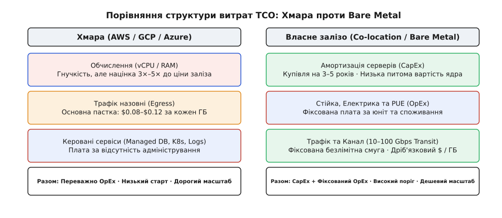
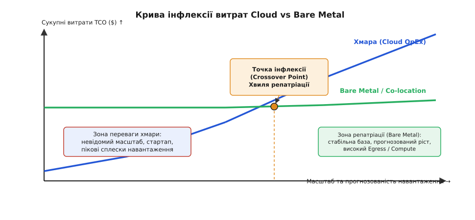
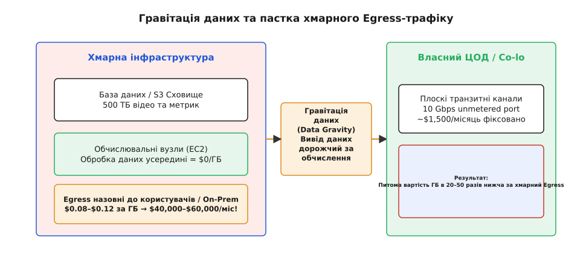

# Розбір Cloud vs Bare Metal

<preknowlist>
- [Cloud cost як архітектурний драйвер](topic:sf-apps/cloud-cost-model) — вартість запиту, лічильники ресурсів та різниця між OpEx і CapEx.
- [Прив'язка і вартість виходу](topic:sf-apps/lock-in-exit-cost) — egress, специфічні API та оцінка кредиту залежності від постачальника.
- [FinOps-важелі](topic:sf-apps/finops-levers) — reserved/spot, right-sizing та data gravity.
- [Build vs buy](topic:sf-apps/build-vs-buy) — межі між орендою та власною інфраструктурою.
</preknowlist>

Головне інфраструктурне та економічне роздоріжжя зростаючої системи — це вибір між еластичною публічною хмарою (Cloud) та власною серверною інфраструктурою (Bare Metal / Co-location). Коли у серпні 2006 року Amazon запустив перший загальнодоступний екземпляр EC2 `m1.small` за 10 центів на годину, індустрія отримала привабливий обмін: відмову від капітальних витрат на сервери (CapEx) та очікування поставок місяцями заради миттєвого отримання обчислень через API (OpEx). Стартап міг запуститися без єдиного долара інвестицій у залізо, платячи лише за спожиті хвилини. Однак у міру зростання системи ця економічна модель виявляє свій зворотний бік: компанія з прогнозованим навантаженням у 100 000 vCPU та петабайтами трафіку, купуючи обчислення в хмарі, сплачує від 300% до 500% маржі хмарному провайдеру порівняно з собівартістю фізичного обладнання.

Ппитання вибору між публічною хмарою (Cloud) та власним залізом (Bare Metal або Co-location) давно вийшло з площини релігійних суперечок і стало чистою економікою архітектури. Дизайн системи безпосередньо визначає форму її рахунку. У цій статті ми розберемо структуру сукупної вартості володіння (TCO), точку інфлексії витрат, вплив мережевого трафіку та три реальні приклади, де світові компанії прийшли до протилежних, але фінансово виправданих рішень.

## 1. Анатомія TCO: Хмарний OpEx проти капітального заліза

Головна помилка при порівнянні хмари та власного заліза — спрощене зіставлення ціни оренди віртуальної машини `c6i.4xlarge` в AWS із вартістю сервера Dell PowerEdge у прайсі дистриб'ютора. Розрахунок сукупної вартості володіння (TCO — Total Cost of Ownership) вимагає зведення двох принципово різних фінансових моделей до єдиного щомісячного показника на горизонті 3–5 років.

Хмарна модель повністю побудована на **OpEx (Operational Expenditures — операційних витратах)**. Усі ресурси купуються за вимогами та цокають за лічильниками провайдера:

1. **Обчислення (vCPU та RAM)**: Провайдер продає не фізичне ядро, а потік часу на віртуальному ядрі (vCPU) з потоком гіпервізора. У базовому тарифі On-Demand націнка провайдера до собівартості кремнію досягає 4×–6×. Зарезервовані ресурси (Reserved Instances або Savings Plans) дають знижку 30%–60%, але вимагають довгострокового зобов'язання на 1–3 роки, перетворюючи частину OpEx на фіксований борговий обов'язок.
2. **Апаратно-архітектурна відмінність ядер**: На фізичному серваку Bare Metal кожне ядро процесора (наприклад, AMD EPYC 9654 або Intel Xeon 8480+) надає монопольний доступ до кешів L1/L2/L3 та високу пропускну здатність шини RAM. У хмарі vCPU — це зазвичай один потік Hyper-Threading спільного фізичного ядра. Якщо два сусідні vCPU належать різним віртуальним машинам, вони змагаються за кеш L3 та канальну ширину пам'яті. У результаті питома продуктивність фізичного ядра Bare Metal нерідко виявляється на 20%–40% вищою за еквівалентний vCPU хмари під стабільним обчислювальним навантаженням.
3. **Приховані мережеві дрібниці**: Окрім основного трафіку назовні, хмара нараховує кошти за трафік між зонами доступності (Cross-AZ traffic по \$0.01/ГБ), трафік через NAT Gateways (\$0.045/годину + \$0.045 за кожен оброблений Гігабайт) та за публічні IPv4-адреси. Для системи з мікросервісною архітектурою та інтенсивними міжсервісними викликами ці «дрібниці» можуть складати до 25% загального рахунку.
4. **Мережевий трафік назовні (Egress)**: Найпідступніша стаття хмарного рахунку. Передача даних усередині однієї зони доступності безкоштовна, між зонами (AZ) — коштує \$0.01/ГБ, а вивід даних в інтернет або до власного дата-центру сягає \$0.08–\$0.12 за кожен Гігабайт.
5. **Керовані сервіси (Managed Services)**: Оренда RDS PostgreSQL, Elasticache Redis або Managed Kubernetes (EKS/GKE). Провайдер бере додаткову націнку (від 30% до 100% над ціною віртуальних машин) за автоматизацію патчингу, реплікації та резервного копіювання.
6. **Сховище та IOPS**: Блокові диски (AWS EBS) та об'єктні сховища (S3). Оплата нараховується окремо за зарезервований обсяг (ГБ/місяць), окремо за гарантовану швидкість (IOPS) та окремо за кількість API-операцій (PUT/GET).

Модель власного заліза (Bare Metal / Co-location) комбінує **CapEx (Capital Expenditures — капітальні витрати)** та **фіксований OpEx**:

1. **Закупівля заліза (CapEx)**: Купівля серверів, мережевих комутаторів (TOR switches) та блоків живлення. Це одноразова інвестиція, яка амортизується у бухгалтерському обліку протягом 3–5 років (36–60 місяців).
2. **Розміщення у ЦОД (Co-location OpEx)**: Оренда юнітів або цілих стійок (racks) у комерційному дата-центрі Tier III. Сюди входить плата за фізичну площу, дубльоване живлення (A+B power feeds від UPS та дизель-генераторів), кліматичний контроль та охорону.
3. **Електрика та PUE**: Споживання електроенергії рахується за формулою: `Потужність серверів (кВт) × Години × PUE × Тариф`. Коефіцієнт PUE (Power Usage Effectiveness) показує ефективність ЦОД (типове значення 1.2–1.35, де 0.2–0.35 іде на охолодження та трансформацію).
4. **Транзитний трафік (Transit Bandwidth)**: На відміну від хмари, у Co-location трафік купується не за Гігабайти, а за ширину каналу (наприклад, плоский порт 10 Gbps або 40 Gbps unmetered). Питома вартість передачі Гігабайта тут нижча у 20–50 разів порівняно з хмарою.
5. **Апаратний буфер та запчастини (Cold Standby & Spares)**: Закупівля 10%–15% додаткових серверів та комплектів NVMe/RAM для миттєвої заміни при виході з ладу без зупинки сервісу.
6. **Фонд оплати праці (Ops/Engineering Salary)**: Частка зарплати системних адміністраторів та DevOps-інженерів, які обслуговують фізичне обладнання (заміна дисків, заміна планок RAM, оновлення прошивок IPMI/iDRAC).


*Структура TCO хмари домінується змінним OpEx із високою націнкою за vCPU та Egress; модель Bare Metal вимагає початкового CapEx, але надає прогнозований і фіксований OpEx із невагомою питомою вартістю трафіку.*

Для системного зіставлення цих параметрів розробляють математичні моделі та сценарії. Практичну реалізацію такого алгоритму мовами TypeScript та C++ наведено в окремому проєктному матеріалі [Модель і розрахунок TCO: Хмара проти заліза в коді](root:progarch/cost-and-lock-in/rozbir-cloud-or-metal/proj-cloud-vs-metal-tco.md).

## 2. Крива інфлексії: Коли хмара стає пасткою

Головна архітектурна характеристика інфраструктурних витрат — це їхня динаміка залежно від масштабу та прогнозованості навантаження. Зв'язок між типом інфраструктури та сукупними витратами описується кривою інфлексії (Crossover Point).

```
TCO_Cloud(V) = (vCPU(V) · P_vcpu + RAM(V) · P_ram + Egress(V) · P_egress + S_managed) · (1 - Discount)
TCO_Metal(V) = (N_servers(V) · CapEx / Horizon) + (N_servers(V) · Power · PUE) + Rack_Fee + Bandwidth_Flat + Ops_Salary
```

При малих обсягах навантаження `V` (стартап, новий продукт, неперевірена гіпотеза) `TCO_Cloud` набагато менший за `TCO_Metal`. Щоб запустити один сервер у Bare Metal, потрібно орендувати мінімум півстійки в ЦОД, підписати річний контракт на канал зв'язку та витратити \$10 000 на закупівлю обладнання. У хмарі той самий сервіс стартує за \$50 на місяць. У цій зоні хмара є безперечним переможцем, бо вона усуває початковий капітальний ризик.


*Крива інфлексії TCO: до точки перетину хмара дешевша завдяки відсутності CapEx; після точки перетину висока маржа хмарного vCPU та Egress робить Bare Metal значно вигіднішим.*

Однак у міру зростання системи та стабілізації навантаження ситуація міняється:

- **Зміна форми навантаження**: Коли продукт виходить на плато з прогнозованим графіком (наприклад, 10 000 запитів за секунду вдень і 3 000 вночі), 80% обчислювальних потужностей стають базовим постійним навантаженням (Baseline). Утримувати цей Baseline у хмарі — означає постійно переплачувати роздрібну маржу провайдеру.
- **Ефект масштабної націнки**: Однорідне навантаження у 500 фізичних серверів у хмарі еквівалентне тисячам vCPU. Різниця в сукупному рахунку між хмарою та Bare Metal на такому масштабі починає обчислюватися мільйонами доларів на рік.
- **Точка перетину (Crossover Point)**: Мить, коли щомісячна економія від використання власного заліза перевищує початковий CapEx на його закупівлю разом із витратами на його обслуговування. Зазвичай цей перехід стає актуальним, коли хмарний рахунок за сервери та трафік стабільно перевищує \$20 000–\$50 000 на місяць.

## 3. Гравітація даних та Egress як архітектурний стіноріз

При розборі економіки заліза та хмари ключовим фактором часто виступає не процесорний час, а мережевий трафік. Це явище тісно пов'язане з поняттям **Гравітації даних (Data Gravity)**: що більший обсяг даних накопичується в певній інфраструктурі, то сильніше вона притягує до себе обчислення та застосунки, оскільки переміщення даних між межами є повільним та дорогим.

Хмарні провайдери свідомо будують цінову политику asymmetric egress:
- Вхідний трафік у хмару (Ingress) — **безкоштовний (\$0.00/ГБ)**.
- Трафік усередині однієї зони доступності — **безкоштовний**.
- Вихідний трафік назовні (Egress) — **надзвичайно дорогий (\$0.08–\$0.12/ГБ)**.

Ця цінова структура створює архітектурну пастку. Якщо ваша система зберігає 500 Терабайтів медіа-файлів або аналітичних логів у AWS S3 і віддає їх користувачам або обробляє на зовнішніх серверах, щомісячний рахунок лише за мережу може складати від \$40 000 до \$60 000.


*Asymmetric Egress у хмарі створює фінансовий бар'єр: безкоштовний вхід затягує дані, а дорогий вихід блокує побудову гібридних архітектур.*

У со-location ЦОД модель оплати мережі принципово інша. Оператори зв'язку продають bandwidth за схемою **95th percentile** або **unmetered port**. Наприклад, порт 10 Gbps із гарантованою безлімітною смугою коштує близько \$1 200–\$1 800 на місяць. Пропускна здатність 10 Gbps при 70% утилізації дозволяє прокачати за місяць понад **2 000 Терабайтів (2 Петабайти)** трафіку.

Порівняймо вартість передачі 2 Петабайтів трафіку:
- **У публічній хмарі (AWS Egress)**: `2 000 000 ГБ × $0.08 = $160 000 на місяць`.
- **У Co-location на власному порті**: `$1 500 на місяць`.

Різниця в **100 разів** на мережевому трафіку робить хмару абсолютно непридатною для дата-інтенсивних та відео-інтенсивних продуктів (стрімінг, файлові сховища, високонавантажені CDN, обробка сирих логів), якщо тільки обчислення не замкнені повністю всередині тієї ж хмари.

## 4. Три різні правильні відповіді: Netflix, Dropbox та 37signals

Не існує єдиного універсального шаблону «хмара чи залізо». Правильність рішення визначається специфікою бізнесу, формою навантаження та структурою доходу. Розглянемо три класичні кейси, де компанії ухвалили протилежні, але архітектурно обґрунтовані рішення.

### Варіант А: 100% AWS Cloud — Кейс Netflix

Netflix є найвідомішим прикладом повного виходу з власних дата-центрів у хмару AWS. Після важкої аварії у власному ЦОД у 2008 році компанія розпочала 7-річний процес повної міграції і в 2016 році закрила свій останній дата-центр.

Чому хмара виявилася правильною відповіддю для Netflix?

1. **Екстремальна диверсифікація навантаження**: Залежно від часу доби, релізу популярного серіалу чи часового поясу, потреби в обчисленнях коливаються у рази. Тримати власні сервери для покриття вечірніх піків означало б тримати 60% заліза без діла протягом дня.
2. **Фокус інженерії**: Netflix відмовився від витрат людського ресурсу на адміністрування заліза та зосередився на продуктових фічах, рекомендаційних системах і кодеках.
3. **Гібридне розділення функцій**: Важливо розуміти, що Netflix не прокачує основний відео-трафік через дорогий Egress AWS. Усі відео-файли лунають через власну розподілену CDN-мережу **Open Connect** (спеціальні залізні сервери-кеші, безкоштовно встановлені у провайдерів інтернету по всьому світу). Хмара AWS керує лише координуючою логікою, рекомендаціями, білінгом та кодуванням відео.

### Варіант Б: Масштабна репатріація даних — Кейс Dropbox

Dropbox започаткував зворотний тренд. Починаючи з AWS S3, компанія зросла до сотень петабайтів даних користувачів. Зберігання та видача цих даних були не допоміжною функцією, а **самим продуктом** Dropbox.

Сплачуючи десятки мільйонів доларів на рік за S3, Dropbox виявив, що маржинальність бізнесу падає. У 2016 році компанія реалізувала проєкт `Magic Pocket`, збудувавши власні кастомні сервери збереження даних та розмістивши їх у трьох со-location дата-центрах.

Результат репатріації Dropbox:
- Переміщено понад **500 Петабайтів** даних із AWS S3 на власне залізо.
- Заощаджено **\$75 мільйонів** сукупних витрат за перші 2 роки.
- Валова маржа (Gross Margin) зросла з **33% у 2015 році до 67% у 2017 році**, що зіграло вирішальну роль під час успішного виходу компанії на IPO.

### Варіант В: Репатріація середнього SaaS — Кейс 37signals (Basecamp / HEY)

У 2022–2023 роках Деніел Гайнмайєр Ганссон (DHH) опублікував маніфест про вихід застосунків Basecamp та HEY з публічних хмар AWS та GCP на власне орендоване залізо в со-location ЦОД.

Детальний аналіз цього кейсу розкрито у висвітленні історії інфраструктурного вибору [Історія хвилі репатріації: 37signals, Dropbox та еволюція інфраструктурного вибору](root:progarch/cost-and-lock-in/rozbir-cloud-or-metal/hist-cloud-repatriation-wave.md).

Ключовий висновок кейсу 37signals: для середнього SaaS із прогнозованою аудиторією та стабільним навантаженням хмарна націнка є невиправданою розкішшю. Купівля сучасного заліза з амортизацією на 5 років скоротила їхній інфраструктурний рахунок з \$3.2 млн до \$840 тис. на рік, вивільнивши понад **\$2 млн щороку** без збільшення штату системних адміністраторів.

## 5. Спостережуваність, апаратне управління та протокольні відмінності

Під час переходу між хмарою та Bare Metal суттєво змінюється інструментарій системної спостережуваності (Observability) та апаратного управління:

### Апаратно-агностична спостережуваність
- **У хмарі**: Метрики гіпервізора приховані. Показники CPU Steal Time (`%st` у `/proc/stat`) свідчать про те, що сусіди по віртуальній машині (Noisy Neighbors) відбирають процесорні такти. Метрики дисків обмежені штучними штучними лімітами CloudWatch IOPS/Throughput throttling.
- **На Bare Metal**: Повний доступ до фізичних лічильників продуктивності процесора (Perf counters), кешів L1/L2/L3, балансування переривань сітьових карт (`/proc/interrupts`, `ethtool -S`), топології NUMA-вузлів (`numactl`) та прямої діагностики накопичувачів через SMART (`smartctl`).

### Управління залізом Out-of-Band (IPMI / iDRAC / Redfish)
На фізичному залізі завдання первинної оркестрації та відновлення після збоїв вирішуються через Out-of-Band інтерфейси IPMI/iDRAC. Протокол `Redfish` (сучасний RESTful стандарт ISO/IEC) дозволяє програмно через API вмикати, вимикати сервери, перевіряти температуру датчиків, оновлювати BIOS та монтувати віртуальні ISO-образи для встановлення ОС.

### Сховища високої швидкодії: NVMe over Fabrics (NVMe-oF)
У публічній хмарі для отримання високошвидкісного блокового сховища (наприклад, AWS EBS `io2 Block Express`) доводиться сплачувати астрономічні суми (\$0.065 за кожен IOPS на місяць). Для кластера у 100 000 IOPS це означає додаткові \$6 500 на місяць лише за дозвіл швидко читати з диска.

У Bare Metal інфраструктурі технологія **NVMe over Fabrics (NVMe-oF)** поверх 100GbE RoCE (RDMA over Converged Ethernet) дозволяє об'єднувати локальні NVMe-накопичувачі серверів у єдину розподілену SAN-мережу із затримками менше 100 мікросекунд та мільйонами IOPS без додаткової плати за кожен IOPS.

## 6. Архітектурні пастки гібридних моделей (Hybrid Cloud Pitfalls)

Спроба «взяти найкраще з обох світів» шляхом побудови гібридної архітектури (наприклад, збереження баз даних на Bare Metal, а веб-застосунків у AWS) часто стає найдорожчим інфраструктурним вибором. Архітектори припускаються трьох типових помилок:

1. **Пастка міжмережевої затримки (Cross-Premise Latency Trap)**: Якщо веб-сервер у хмарі виконує 15 SQL-запитів до бази даних у со-location ЦОД для обробки одного HTTP-запиту, затримка мережевого тунелю (2–5 мс) додасть 30–75 мс до кожного запиту користувача. Система стає повільною незалежно від потужності процесорів.
2. **Подвійне платіжне кільце за Egress**: При передачі сирих даних з Bare Metal у хмару для аналітики та наступному виводі результатів користувачам компанія платить двічі: спочатку за VPN/DirectConnect канал, а потім за Egress AWS.
3. **Розщеплення моделей безпеки (Split-Brain IAM)**: Управління правами доступу в хмарі здійснюється через AWS IAM / GCP IAM, а на Bare Metal — через Linux PAM, LDAP або SSH-ключі. Подвійний контур безпеки збільшує ризик помилок конфігурації.

## 7. Операційна складність та техніка оборотного виходу

Найпоширеніший контраргумент проти власного заліза — «Вам знадобиться армія сисадмінів, які здувають пил із серверів». Цей аргумент був правдивим у 2005 році, але втратив силу в сучасній інженерії.

### Сучасний стек оркестрації Bare Metal

Завдяки еволюції DevOps-інструментів управління сотнею фізичних серверів сьогодні виглядає практично так само, як управління кластером Kubernetes у хмарі:

- **Автоматизація заліза (Bare Metal Provisioning)**: Інструменти на кшталт `Ironic`, `MaaS` (Metal as a Service) або `Tinkerbell` дозволяють накатувати операційну систему на «голе залізо» через PXE-завантаження за API-викликом.
- **Оркестрація контейнерів**: Kubernetes, HashiCorp Nomad або легкі оркестратори (Kamal, Docker Swarm) усувають різницю між віртуальною машиною AWS та фізичним сервером Dell. Застосунок розгортається у контейнер однакової форми.
- **Програмно-визначені сховища (SDS)**: MinIO для S3-сумісного об'єктного сховища та Ceph / Rook для блокових дисків дають змогу збудувати власну надійну розподілену систему збереження даних поверх локальних NVMe-дисків із високою швидкодією.
- **Мережевий фабрик та Service Mesh**: Використання eBPF (Cilium) та CoreDNS на Bare Metal надає динамічне виявлення сервісів (Service Discovery), шифрування mTLS та балансування навантаження без потреби в купованих хмарних Load Balancers.

### Проєктування оборотних меж (Exit-Ready Architecture)

Головний урок репатріації полягає не в тому, щоб негайно тікати з хмари, а в тому, щоб **не купувати незворотну прив'язку (Lock-in)** під час роботи в хмарі.

Щоб зберегти можливість міграції в обидва боки без переписування коду системи, слід дотримуватися чотирьох правил ізоляції:

1. **Контейнеризація замість специфічних PaaS**: Застосунки мають пакуватися в OCI-контейнери (Docker) і не покладатися на специфічні середовища виконання хмарних провайдерів (AWS Beanstalk, Azure App Service).
2. **Абстрагування сховища за стандартами**: Використовуйте стандартні протоколи. Для об'єктного сховища коду має бути байдуже, куди звертатися — до справжнього AWS S3 чи до локального MinIO/Ceph, бо обидва працюють за однаковим S3 API.
3. **Стандартні бази даних замість Vendor-Lock баз**: Використання стандартного PostgreSQL або MySQL у контейнері чи на Bare Metal дозволяє легко переносити дані між AWS RDS, GCP Cloud SQL та власним сервером. Зав'язування на пропреітарні бази даних (AWS DynamoDB, GCP BigQuery, Azure CosmosDB) створює колосальний кредит прив'язки, вихід з якого може коштувати дорожче за саму хмару.
4. **IaC та декларативна конфігурація**: Інфраструктура описується кодом (Terraform / OpenTofu, Ansible). Конфігурація мережі, DNS та сертифікатів ізолюється у шарі оркестрації.

### П'ятифазний план міграції без зупинки системи

Перехід із хмари на залізо реалізується не «Big Bang» перемиканням за ніч, а поступовим п'ятифазним алгоритмом:

1. **Фаза 1: Синхронізація сховищ (Dual Write / S3 Sync)**: Налаштовується фонова реплікація об'єктного сховища з S3 у MinIO/Ceph на Bare Metal.
2. **Фаза 2: Гібридна мережева зв'язність**: Налаштування захищеного тунелю (WireGuard або IPsec) між хмарою та со-location стійкою.
3. **Фаза 3: Реплікація бази даних**: Підняття PostgreSQL standby-вузлів у со-location ЦОД як ведених (read-replicas) для хмарного primary.
4. **Фаза 4: Переключення читаючого навантаження**: Маршрутизація читаючих запитів на Bare Metal сервери та перевірка показників затримки.
5. **Фаза 5: Промоушн Primary та демонтаж хмари**: Коротке вікно обслуговування, переключення ролей PostgreSQL, перенаправлення DNS-трафіку та поступове вимкнення інстансів у хмарі.

## 8. Матриця архітектурного вибору

Для ухвалення зрілого рішення сформулюємо чек-лист оцінки інфраструктурного вектора за чотирма основними вимірами:

| Вимір оцінки | Коли обирати Публічну Хмару (Cloud) | Коли обирати Власне Залізо (Bare Metal) |
| :--- | :--- | :--- |
| **Прогнозованість навантаження** | Висока невизначеність, вибуховий ріст, нерегулярні піки (в 5–10 разів). | Стабільне плато, відомий добовий графік, зростання пропорційне клієнтській базі. |
| **Інтенсивність трафіку (Egress)** | Низький Egress, більшість обчислень виконуються всередині хмари. | Високий Egress (десятки й сотні ТБ/місяць), відео-стрімінг, розподілені логи. |
| **Масштаб інфраструктурного рахунку** | Рахунок за compute/storage до \$10 000 – \$20 000 на місяць. | Рахунок перевищує \$30 000 – \$50 000 на місяць протягом 6+ місяців. |
| **Зрілість команди та процесу** | Стартап без виділеної Ops-команди; потреба перевірити фічу «на вчора». | Зріла команда з досвідом Linux/DevOps, наявність IaC та оркестрації контейнерів. |

Вибір між хмарою та залізом — це не разове й остаточне рішення на все життя компанії. Це еволюційний важіль, який регулюється залежно від фази життя продукту: **хмара дає швидкість і гнучкість на старті, власне залізо повертає маржинальність і контроль на стадії зрілості.**
