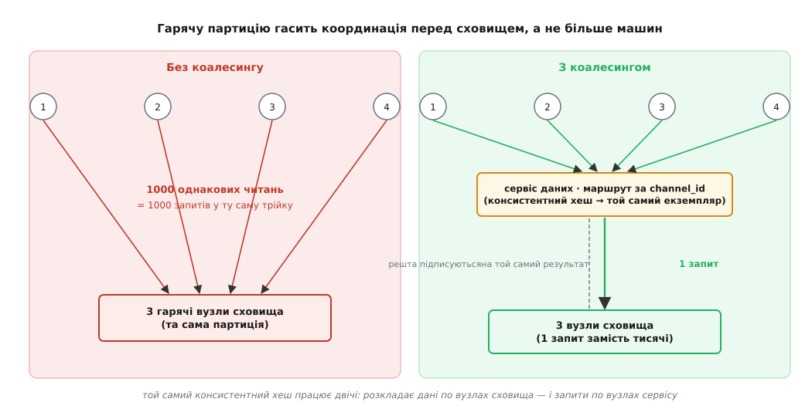

# Розбір: як Discord зберігає трильйони повідомлень

<preknowlist>
- [Час-сортовні ID (Snowflake)](book:programming/sequences-counters) — як згенерувати унікальний ID, у якого старші біти є показом годинника, тож більший ID означає «створено пізніше».
- [Коалесинг запитів (single-flight)](book:programming/request-coalescing) — як багато однакових одночасних читань згорнути в один похід у сховище, а результат роздати всім, хто чекав.
</preknowlist>

Ми щойно питали, навіщо взагалі розподіляти. І зібрали для цього цілий набір: шардинг, консистентне хешування, дерева Меркла, кворуми з минулого модуля, а на початку цього — годинники, що дають порядок без єдиного дзиґаря на всіх. Час побачити весь цей набір у роботі — на одній системі, яка не мала розкоші вибирати, розподіляти чи ні.

Discord зберігає **трильйони** повідомлень. Не мільярди — трильйони, і щодня прибуває ще. При цьому «показати останні повідомлення каналу» мусить відкритися за десяток мілісекунд, хоч канал жив три роки, хоч у ньому мільйон реплік. Найкраще ж у цьому кейсі те, що вся конструкція збирається рівно з тих цеглинок, які ми щойно тримали в руках. Розберімо її — і заразом побачимо, як [хто саме й коли будував це сховище](root:progarch/rozbir-discord-storage/hist-discord-storage-journey.md) двічі переписував його з нуля, не змінюючи однієї головної ідеї.

## Стіна, об яку розбилася одна машина

Discord починав 2015-го з однісінької бази — MongoDB, один реплікасет. Це нормальний, чесний старт: поки даних мало, одна машина возить усе. Але вже в листопаді 2015-го, на позначці **сто мільйонів повідомлень**, система вперлася в стіну. Не в диск — у пам'ять. Індекс, за яким база знаходить рядок, перестав уміщатися в RAM. А щойно індекс не влазить у пам'ять, кожен його промах — це похід на диск, і затримки стають непередбачуваними: то мілісекунда, то раптом сотні.

Ось вона, «навіщо розподіляти» без жодної теорії, живцем. Одна машина має стелю не там, де скінчився диск, а там, де робочий набір переріс RAM. Далі — або спускатися до диска на кожен запит (і втратити швидкість), або розкласти дані по багатьох машинах так, щоб кожна тримала гарячою свою частку. Discord обрав друге — і тоді все вирішувалося не тим, *яку* базу взяти, а тим, *за яким ключем* різати дані.

## Ключ — це вся гра

Discord перейшов на Cassandra — сховище [без головного вузла](book:programming/replication-leader-follower) (англ. *leaderless* — жодна машина не командує рештою), збудоване під важкий запис і горизонтальне зростання. Cassandra — це, по суті, велика розподілена таблиця, де ти власноруч обираєш дві речі, і вони вирішують долю системи: **партиційний ключ**, що визначає, *на якій машині* лежить рядок, і **кластерний ключ**, що визначає *порядок* рядків усередині партиції. Помилишся з ключем — жодне залізо не врятує.

Перша спроба була очевидна: партиційний ключ — `channel_id`, кластерний — `message_id`. Усі повідомлення каналу лягають в одну партицію (а отже, «показати канал» — це читання однієї партиції), відсортовані за `message_id`. І тут з'являється перша цеглинка нашого модуля.

Кожен ID у Discord — це **Snowflake** (англ. *snowflake* — сніжинка, бо кожна унікальна): 64-бітне число, у якого старші **42 біти** — це мітка часу в мілісекундах від власної епохи Discord (1 січня 2015). Решта бітів — 5 на воркер, 5 на процес, 12 на лічильник усередині мілісекунди — просто розводять близнюків, народжених тієї самої мілісекунди. Наслідок магічний: **більший ID означає «створено пізніше»**. Сортувати за `message_id` — те саме, що сортувати за часом, і для цього не треба ні окремого поля дати, ні глобального годинника. Це прямий відгук того, що ми бачили в цьому модулі: порядок не мусить приходити від настінного часу (який [бреше й стрибає](book:algorithms/lamport-clocks)) — його можна вшити в сам ідентифікатор.


*Ключ несе і час, і місце: message_id дає порядок за часом задарма, а (channel_id, відро) вирішує, на яких машинах партиція живе.*

> 🔧 **Навіщо це.** Партиційний ключ — найдорожче за наслідками рішення в усій системі, і водночас найдешевше змінити, поки система порожня, та майже неможливо — коли вона повна. Він одночасно прибиває дані до машин *і* задає форму запитів, які будуть швидкими. Тому обирають його не від структури даних, а від головного запиту: у Discord головний запит — «останні повідомлення цього каналу», тож ключ будують навколо каналу й часу, а не навколо, скажімо, автора.

Здавалося б, ідеально. Але коли Discord залив історію, Cassandra почала попереджати про партиції, більші за 100 МБ. Причина проста: канал живе роками, повідомлень у ньому мільйони — і партиція `channel_id` росте **без упину**. А велика партиція — це біль: вона цілком лягає на одні й ті самі вузли й тисне на прибирання (компакцію) під час кожного обслуговування.

Рішення — **відра (buckets)**. Партиційний ключ став складеним: `((channel_id, bucket), message_id)`. Відро — це вікно у **10 діб**, номер якого рахують із тієї самої мітки часу всередині Snowflake. Тепер партиція — це не «весь канал навіки», а «цей канал за ці 10 діб», і її розмір обмежений згори. Щоб показати свіжі повідомлення, Discord бере поточний час, рахує номер відра й читає партиції назад у часі — відро за відром, — поки не набереться повний екран.

Порахуймо номер відра для конкретного повідомлення — це вся арифметика розміщення на одному прикладі:

```
message_id (Snowflake)   = 181 193 932 800 000 000
мс від епохи Discord     = message_id >> 22          (відкидаємо 22 молодші біти)
                         = 181 193 932 800 000 000 / 4 194 304
                         = 43 200 000 000 мс
календарний час          = 43 200 000 000 + 1 420 070 400 000   (епоха = 1 січ. 2015)
                         = 1 463 270 400 000 мс   →   десь весна 2016
номер відра (bucket)     = 43 200 000 000 / 864 000 000   (10 діб = 864 000 000 мс)
                         = 50
партиція                 = (channel_id, 50)
```

Один зсув і одне ділення — і з ID народжується адреса партиції. [Повний робочий код: як з message_id дістати відро й як згенерувати діапазон відер для «останніх N повідомлень»](root:progarch/rozbir-discord-storage/proj-bucket-range.md) винесено окремо, щоб не топити розбір у деталях.

## Де живе партиція: кільце токенів

Ми знаємо ключ партиції. Але на *якій* із двохсот машин вона лежить? Тут Cassandra застосовує [консистентне хешування](book:algorithms/consistent-hashing), яке ми розбирали кроком раніше. Партиційний ключ хешується в число — **токен**, — а токен показує точку на уявному кільці; машина, що володіє цією ділянкою кільця, і тримає партицію. Плюс дві копії на наступних машинах за кільцем — **фактор реплікації 3**. Читання й запис ідуть **кворумом**: домовитися мусять двоє з трьох. Це наш кворум із минулого модуля в чистому вигляді — жодного головного вузла, і втрата однієї машини нікого не зупиняє.

А коли одна репліка відстала (машина полежала й повернулася), її доганяють [деревами Меркла](book:algorithms/merkle-tree) — теж знайомою цеглинкою. Кожна репліка згортає свій діапазон даних у хеш-дерево; репліки звіряють корені, спускаються гілками лише там, де хеші розійшлися, і пересилають самі різницю, а не всю партицію. Уся анти-ентропія — це порівняння кількох хешів, а не переливання терабайтів.


*Рівномірно розкладені ключі не означають рівномірне навантаження: одна гаряча пара «канал+відро» вантажить лише три машини з двохсот.*

## Гаряча партиція: коли розміщення обертається проти тебе

І ось де ховається пастка, яку не видно з теорії. Консистентне хешування чесно розкидає *ключі* по кільцю рівномірно. Але *навантаження на ключ* — величина дика й нерівна. Хай один канал стане вірусним: гучний сервер, зірка з мільйоном підписників, роздача ключів у грі. Усі читання й записи цього каналу мають однаковий партиційний ключ, лягають на одну партицію — і б'ють у ті самі **три** репліки з-поміж двохсот машин. Двісті вузлів у кластері, а розжарюються три. Це **гаряча партиція**.

У Cassandra це виглядало особливо болісно. Cassandra написана на Java, і збирач сміття (garbage collector) її середовища періодично спиняє світ, щоб прибрати пам'ять. Під навантаженням гарячої партиції ці паузи наростали, затримки стрибали, а часом вузол доводилося перезавантажувати руками. Додай сюди рутину обслуговування — вивести вузол, дати йому наздогнати компакцію, повернути — і помнож на 177 вузлів, до яких кластер доріс на 2022 рік. Сховище працювало, але коштувало команді нервів щодня.

## Полагодити не більшим кільцем, а координацією перед ним

Спокуса очевидна: додати ще машин. Але це не допомогло б — гаряча партиція за побудовою живе на трьох вузлах, скільки б їх не було в кільці. Discord розв'язав це інакше, і саме тут криється головний урок розбору.

Придивись, що таке гаряча партиція зблизька: це **ті самі рядки, які тисячі людей читають одночасно**. Тисяча читачів каналу за одну секунду хоче побачити ту саму сотню свіжих повідомлень. Навіщо тисяча однакових походів у базу, якщо відповідь одна? Discord поставив перед сховищем проміжний шар — **сервіси даних** (data services), написані на Rust — і навчив їх [коалесингу запитів](book:programming/request-coalescing): якщо в цю мить уже летить запит за той самий рядок, новий запит не йде в базу, а **підписується** на вже запущений. Перший читач будить робітника, той раз питає базу, а результат отримують усі, хто чекав. Тисяча читань згортається в один похід у сховище.

Щоб коалесинг спрацьовував, усі запити за один канал мусять потрапити в *один* екземпляр сервісу — інакше нема чого зливати. І тут консистентне хешування виринає **вдруге**, тепер уже не в сховищі, а на рівні сервісів: запит несе ключ маршрутизації (для повідомлень — `channel_id`), і той самий хеш направляє весь трафік каналу в той самий екземпляр. Один інструмент — консистентне хешування — працює на двох поверхах системи заразом: розкладає дані по вузлах сховища й розкладає запити по вузлах сервісу.



*Гарячу партицію гасять не залізом, а координацією: однакові читання зливають в одне ще до того, як вони дійдуть до сховища.*

## Поміняти двигун, не чіпаючи креслення

Сервіси даних приборкали гарячі партиції, але java-паузи в самому сховищі нікуди не поділися. Тож 2020-го Discord почав переводити бази на **ScyllaDB** — сховище, сумісне з Cassandra, але написане на C++: без збирача сміття, з архітектурою «шард на ядро», без пауз, що спиняють світ. Найголовніше для нашого розбору: **модель даних не змінилася ні на йоту**. Той самий партиційний ключ `((channel_id, bucket), message_id)`, те саме консистентне хешування, ті самі дерева Меркла — бо Scylla розмовляє мовою Cassandra. Discord поміняв *двигун*, лишивши *креслення*. Це і є нагорода за правильно обраний ключ: рішення про розміщення переживає навіть заміну самого сховища.

Саму міграцію трильйонів повідомлень оцінювали в три місяці стандартним інструментом. Discord натомість розширив свій rust-каркас сервісів даних у мігратор і **перелив усе за дев'ять днів**, женучи 3.2 мільйона повідомлень за секунду, з подвійним записом у стару й нову базу для звірки. Підсумок: із **177 вузлів Cassandra — до 72 вузлів ScyllaDB**; затримка читання історії впала з 40–125 мс до стабільних **15 мс**, а вставки — до 5 мс. За півроку, у фіналі Кубка світу 2022, кожен гол було видно на графіках навантаження як окремий сплеск — і сховище тримало їх, не змигнувши.

## Прочитати крізь наш верстак

Найцінніше тут — не захват біржовими числами масштабу, а те, що вся конструкція складається з інструментів цього модуля, кожен на своєму місці:

- **Порядок без глобального годинника** — Snowflake: час зашито в старші біти ID, тож сортування за ключем дає причинно-часовий лад задарма. Це наш модуль про час і порядок, застосований буквально.
- **Розміщення** — консистентне хешування кладе партиції на кільце токенів, а потім, несподівано, ще й розкладає запити по сервісах даних. Той самий інструмент на двох поверхах.
- **Згода на кожен запис** — кворум двох реплік із трьох: жодного головного вузла, стійкість до втрати машини.
- **Сходження розбіжних копій** — дерева Меркла звіряють хеші й шлють лише різницю.
- **Обмеження зростання** — відра тримають партицію скінченною, щоб один канал не ріс без краю.

А головна нитка, що проходить крізь усе: справжній важіль був не в тому, *яке* сховище взяти, а в тому, *за яким ключем* розкласти дані й куди поставити координацію. Discord двічі переписав сховище — MongoDB, Cassandra, ScyllaDB, — але рішення про розміщення (ділити за каналом і відром, впорядковувати за Snowflake) пережило обидві заміни. Ключ обирають так, ніби він назавжди, бо він майже назавжди й лишається.

## Що бере із цього наш хаб

Digital Homes не має трильйонів повідомлень і, дасть Бог, ніколи не матиме. Тож урок — не «візьміть Cassandra», а метод.

Обирай партиційний ключ від свого головного запиту, а не від форми таблиці: якщо DH найчастіше питає «дай телеметрію цього дому за останню добу», ключ будують навколо дому й часу — так само, як Discord навколо каналу й відра. Обмежуй ріст партиції наперед, поки вона не обмежила тебе: вікно часу у ключі коштує дешево, а рятує від великих партицій задовго до того, як вони стануть болем. І коли один ключ раптом розжариться — популярний дім, вибух подій, — гаси його **координацією перед сховищем** (злий однакові читання в одне), а не панічним доливанням машин. А якщо колись переростеш саме сховище — чистий вибір ключа дасть поміняти двигун, не переписуючи креслення. Discord показав це на трильйонах; ту саму дисципліну DH застосує на своїй скромній тисячі домів.
