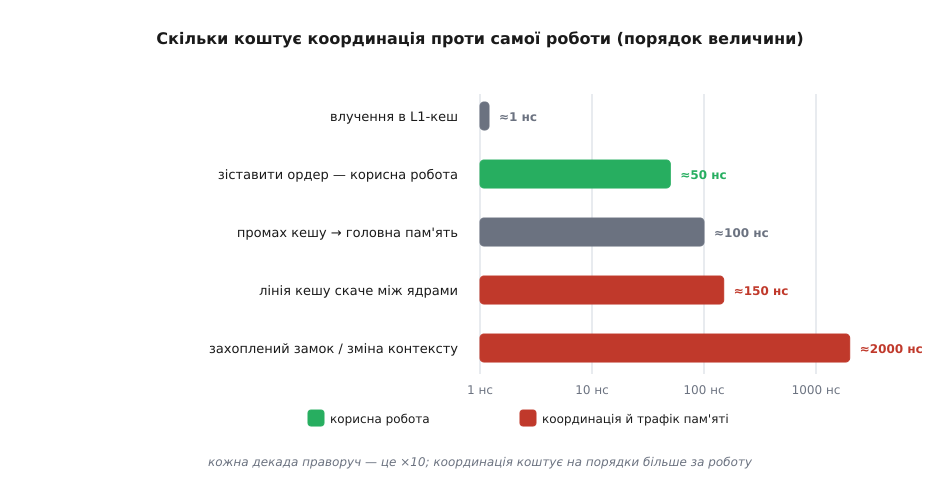
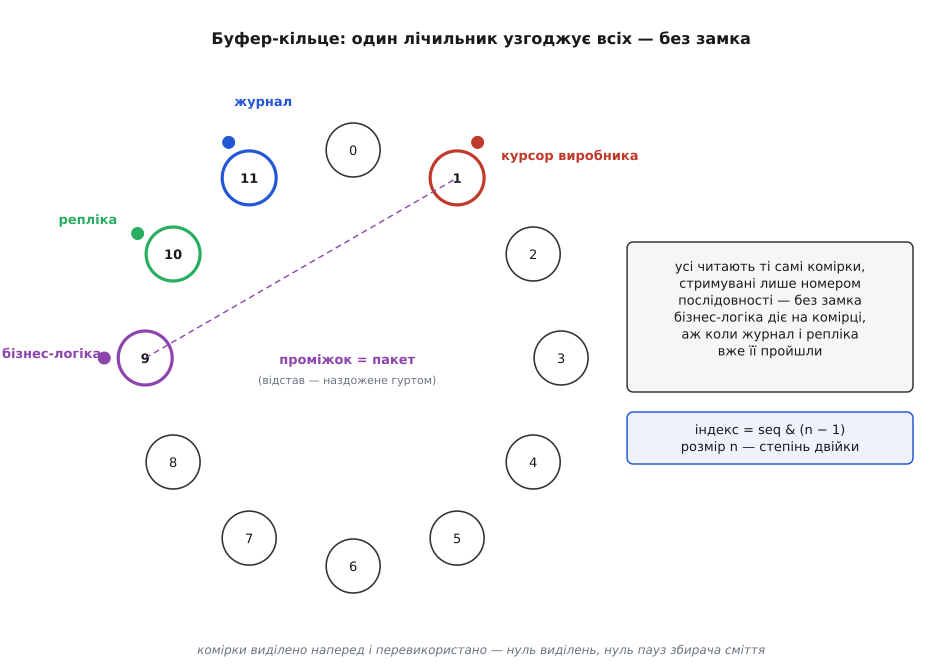

# Розбір: LMAX Disruptor

<preknowlist>
- [Кеш процесора й лінія кешу](topic:hw-arch/cache) — дані з пам'яті ходять цілими лініями (~64 байти); що таке промах кешу й «хибне сусідство» (false sharing), і чому звернення до холодних даних коштує в рази більше за саму арифметику.
</preknowlist>

Ми зібрали цілий верстак: замки й безлокові лічильники, актори й канали, виробник-споживач, цикл подій, пули потоків, thread-per-core. Час перевірити його на одній реальній системі — і то на такій, що ламає першу-ліпшу інтуїцію.

2011 року лондонська біржа **LMAX** оприлюднила число, схоже на друкарську помилку: **6 мільйонів ордерів за секунду — на одному потоці**. Не на кластері, не на сотні ядер. Один потік перемелює всю торгову логіку. І досягли цього не тим, що додали конкурентності, а тим, що прибрали її звідти, де вона боліла. Розберімо цю систему по гвинтиках — кращого іспиту для всього, що ми вивчили, годі шукати. [Звідки взялася LMAX, хто будував Disruptor і як він потрапив у відкритий код](root:progarch/rozbir-lmax/hist-lmax.md) — окрема історія; тут нас цікавить, *чому* він так влаштований.

## Очевидний проєкт — і чому він програв

Як зробити біржу «правильно»? Інтуїція диктує знайомий малюнок: багато потоків-робітників, спільна черга ордерів, база даних для стану, замки навколо спільних книг заявок. Команда LMAX приблизно так і почала — а тоді *зміряла*. Виявилося дивне: потоки більше часу *домовлялися*, ніж працювали. Вони билися за голову черги, засинали на замках, ганяли ту саму лінію кешу між ядрами. Координація й *була* роботою.

Щоб відчути, чому так, порахуймо бюджет часу однієї операції. Порядки величини тут приблизні, але співвідношення між ними — залізне:

```
зіставити один ордер (сама корисна робота)   ≈ 50 нс
звернення до головної пам'яті (промах кешу)   ≈ 100 нс
лінія кешу «скаче» між ядрами                 ≈ 150 нс
захоплений замок / перемикання контексту      ≈ 1000–3000 нс
```

Порахуймо наслідок. Корисної роботи — десятки наносекунд. А кожна передача ордера через спільну чергу штовхає лічильник голови й хвоста туди-сюди між кешами ядер — сотні наносекунд самого лише змагання за пам'ять; захопити замок під сплеск навантаження — вже мікросекунди. Виходить, що дев'ять десятих часу система не торгує, а координує. Дані ходять лініями по ~64 байти, і коли дві незалежні гарячі змінні падають в одну лінію, ядра б'ються за неї намарно — це [хибне сусідство (false sharing)](topic:hw-arch/cache), і на гарячому шляху воно нищівне.



*Корисна робота — унизу шкали; усе дороге — це координація й трафік пам'яті, а не обчислення. Прибирати треба саме координацію.*

Ось перший урок розбору, ще до жодного хитрого прийому: **вузьке місце було не в обчисленні, а в узгодженні**. І побачити це можна було лише вимірюванням — інтуїція показувала пальцем не туди.

## Інверсія: один письменник

Якщо координація така дорога, найрадикальніше рішення — прибрати її зовсім. Посадити *всю* бізнес-логіку на *один* потік. Один потік одноосібно володіє книгою заявок — і тоді навколо цих даних немає ні замків, ні проблем видимості, ні змагання: нема з ким змагатися. Логіка стає детермінованою, а робочий набір лишається гарячим у кеші одного ядра, бо його ніхто не виштовхує.

Це **принцип одного письменника (single-writer principle)**: кожен шматок змінного стану має рівно один потік, який у нього пише. Конкуренцію усунено *за побудовою*, а не приборкано замком постфактум. Знайома нам ідея — так само shared-nothing розкладає стан по ядрах у підході thread-per-core; LMAX доводить її до межі, стягуючи весь стан на один потік.

> 🔧 **Навіщо це.** Принцип одного письменника — найдешевше, що можна забрати з LMAX у будь-який звичайний код, і жодного буфера-кільця для цього не треба. Переважна більшість перегонів даних — це двоє чи більше потоків, що пишуть в одне місце. Дай тому місцю **одного власника** — один потік, один актор, одну горутину, — і цілий клас гонок зникає ще до того, як ти згадав про замок. Питання «хто єдиний пише цей стан?» вартує запитати над кожним спільним полем.

Але один потік мусить *встигати*. Тому все, що не є бізнес-логікою, з нього знімають: приймання з мережі, розбір і збирання повідомлень, журналювання на диск заради довговічності, реплікацію на резервний вузол. Усе це крутиться *паралельно* на інших ядрах. Сам потік логіки лише споживає готові події й породжує події-відповіді. А стан його довільно відновлюваний: усі вхідні події довговічно журналюються, і поточний стан — це просто результат їх програвання (event sourcing). Тому один потік не страшно тримати єдиним: його можна відтворити чи підмінити резервним, програвши журнал наново.


*Угорі конкуренція — всередині, у самому серці системи. Унизу її винесено на краї, а серце лишили без жодного замка.*

## Disruptor: черга без черги

Лишалося питання: як передавати події тому одному потокові — і забирати від нього — так, щоб черга не протягла назад ту саму конкуренцію, від якої ми щойно втекли? Звичайна черга має два змагальні кінці (виробники б'ються за хвіст, споживачі — за голову) і зазвичай виділяє вузол пам'яті на кожне повідомлення: тиск на збирач сміття й свіжий промах кешу на кожному кроці. **Disruptor** (англ. *disruptor* — руйнівник усталеного ладу) розчиняє чергу на простіші, дешевші частини.

**Буфер-кільце (ring buffer)** — один наперед виділений масив, розміром у степінь двійки, комірки якого переживають повідомлення й використовуються знову і знову. Виділень на кожне повідомлення немає → немає й пауз збирача. Індекси йдуть послідовно → процесор наперед підтягує наступні комірки в кеш. А перенос через край роблять бітовою маскою `seq & (n - 1)`, а не дорогим діленням.

**Одна монотонна послідовність (sequence)** — виробник займає наступну комірку, зсунувши один спільний лічильник, пише в неї, а тоді *публікує*, зсунувши курсор. Кожен споживач тримає власний номер і читає до опублікованого курсора. Уся координація — це один лічильник плюс [бар'єр пам'яті](topic:sf-tasks/lock-free-basics), а не замок: потік ніколи не засинає в очікуванні, він лише бачить, доки безпечно читати.

:::tabs
```cpp
// виробник: зайняти → записати → опублікувати
int64_t seq = cursor.fetch_add(1, std::memory_order_relaxed) + 1;
slots[seq & mask] = event;                          // маска замість ділення
published.store(seq, std::memory_order_release);    // бар'єр: запис у комірку видно ДО публікації

// споживач: прочитати все опубліковане — одним пакетом
int64_t avail = published.load(std::memory_order_acquire);
while (next <= avail) {
    handle(slots[next & mask]);
    ++next;
}
```
```rust
// виробник: зайняти → записати → опублікувати
let seq = cursor.fetch_add(1, Ordering::Relaxed) + 1;
slots[(seq & mask) as usize] = event;        // маска замість ділення
published.store(seq, Ordering::Release);     // бар'єр: запис у комірку видно ДО публікації

// споживач: прочитати все опубліковане — одним пакетом
let avail = published.load(Ordering::Acquire);
while next <= avail {
    handle(&slots[(next & mask) as usize]);
    next += 1;
}
```
:::

Це серцевина; [повний робочий буфер-кільце з набивкою проти хибного сусідства](root:progarch/rozbir-lmax/proj-ring-buffer.md) — окремо, щоб не роздувати розбір кодом.

**Граф залежностей споживачів** — журналер і реплікатор читають те саме кільце *паралельно*, кожен своїм темпом; споживача бізнес-логіки налаштовано чекати, поки *обидва* пройдуть комірку (не можна діяти на ордері, якого ще не записано на диск і не відбито на репліці). Жодного копіювання між стадіями, жодної окремої черги на стадію — усі читають ті самі комірки, стримувані лише номерами послідовності. По суті це той самий [виробник-споживач](topic:sf-tasks/producer-consumer), тільки чергу між ними розчинено у спільному масиві й кількох лічильниках.

**Пакетування задарма** — відстав споживач, бачить курсор далеко попереду й обробляє цілий пробіг комірок за один захід, розмазуючи сталі витрати на весь пакет. Тому під сплеском навантаження система *пришвидшується* на одиницю роботи, а не захлинається, як черга, що росте без упину.



*Один лічильник-послідовність узгоджує всіх без жодного замка; хто відстав — доганяє пакетом, а не по одному.*

## Механічна симпатія

Над усіма цими прийомами стоїть одна ідея, яку Мартін Томпсон, один з авторів Disruptor, назвав **механічною симпатією (mechanical sympathy)**. Термін він позичив у Джекі Стюарта, триразового чемпіона Формули-1: найкращий гонщик розуміє машину настільки, щоб працювати *з* нею в лад, а не проти неї. У коді це означає писати так, як насправді працює процесор: лініями кешу, випереджальним читанням, передбаченням переходів — і без хибного сусідства.

Конкретно це видно в дрібницях, які легко проґавити. Лічильники-послідовності *набивають* порожніми байтами (padding), щоб два гарячі лічильники не опинилися в одній лінії кешу, — інакше два ядра билися б за неї тим самим хибним сусідством. Дані кладуть під суто послідовний доступ, найзручніший для процесора. Нуль виділень означає нуль пауз збирача сміття посеред гарячого шляху. Кожен прийом — це відмова боротися з машиною.

Плата за цю дисципліну — цифри. На триступеневому конвеєрі Disruptor показав середню затримку приблизно на *три порядки* нижчу, ніж рівнозначна черга, і десь у *вісім разів* більшу пропускну здатність. Ті самі шість мільйонів ордерів за секунду на одному потоці — не диво, а прямий наслідок: коли не платиш за координацію, лишається платити тільки за роботу.

## Прочитати крізь наш верстак

Найцінніше в цьому розборі — не захват біржовими числами, а те, що вся конструкція збирається з інструментів, які ми вже тримали в руках. Складімо її назад.

Це **виробник-споживач** — але *черга*, до якої ми тягнемося за замовчуванням, і виявилася вузьким місцем; LMAX замінили структуру даних, лишивши сам патерн. Це конкуренція на **спільній пам'яті** — але приборкана принципом одного письменника, тож без жодного замка; отже, не все конче переписувати на актори чи канали, дисциплінована спільна пам'ять теж виграє свій клас задач. Це **закон Амдала** живцем: серійну частину, яку не прибрати (сама торгова логіка мусить бути послідовною й узгодженою), зробили *дешевою* до дрібниці — один гарячий потік без накладних, — а розпаралелили лише те, що справді паралельне: краї вводу-виводу, журнал, репліку. І скрізь наскрізна нитка одна: справжня ціна була не в обчисленні, а в координації й трафіку пам'яті, і побачити це можна тільки вимірюванням.

## Коли братися — і коли ні

Тут криється й пастка. Disruptor — вузько заточений інструмент під конкретну форму задачі: дуже висока пропускна здатність або дуже низька затримка, на *одній* машині, де накладні на координацію переважують саму роботу. Біржі, стрічки ринкових даних, рушії зіставлення — його рідний дім. Для переважної ж більшості систем — зокрема нашого хаба Digital Homes — звичайна черга чи канал саме те, що треба: простіше, зрозуміліше, а ті наносекунди змагання, які черга «марнує», нічого не важать проти мілісекунд мережевого оберту до хмари. Тягнути Disruptor у DH — це механічна симпатія до проблеми, якої немає: усе ускладнення заради виграшу, меншого за похибку вимірювання.

Тому DH бере від LMAX не механізм, а **метод**. Зміряй очевидний проєкт, перш ніж на нього ставити. Знай, де живе твоя справжня ціна, — і не вгадуй її, а знаходь приладом. Сумнівайся в дефолті, коли цифри так кажуть, — але не раніше. І забери собі принцип одного письменника, бо він портативний і безкоштовний: дай кожному шматку змінного стану одного власника, і цілі класи перегонів зникнуть навіть у найзвичайнішому коді, без жодного кільця.

Один потік обігнав кластер, бо команда відмовилася від дефолту й дослухалася до машини. У цьому й суть синтезу цілого модуля: конкурентність — не драбина, якою лізеш угору (більше потоків ≠ швидше), а верстак. Мистецтво — прикласти потрібний інструмент саме туди, де справді болить. Далі ми розкладемо весь цей верстак відкрито — як набір інструментів під різні задачі, а не список догм, яких належить триматися.
