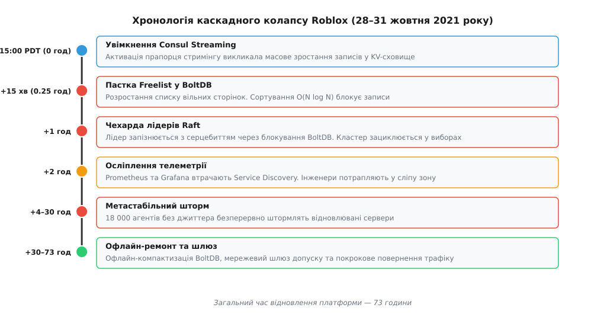
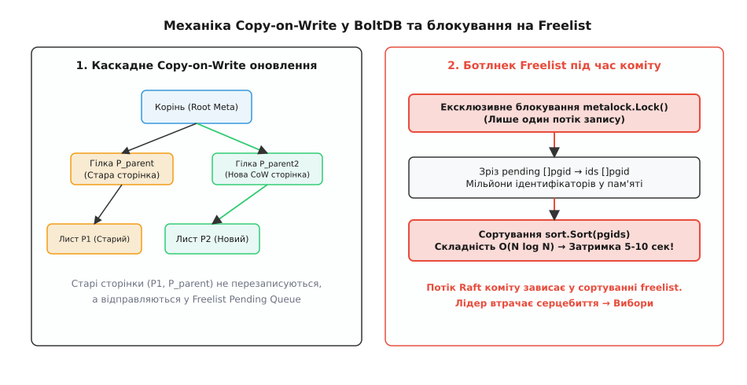
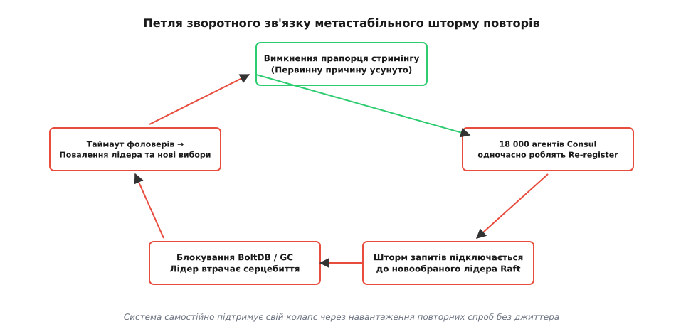
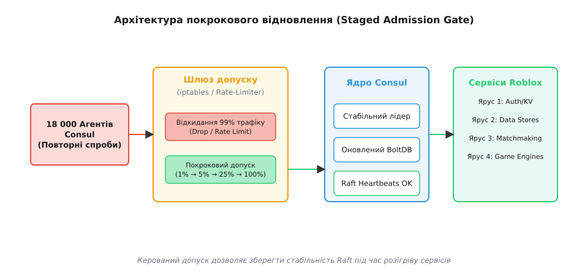

# Розбір: 73-годинний збій Roblox

<preknowlist>
- [Послідовний консенсус і Raft](topic:sf-distributed/raft) — як лідер тримає зв'язок із фоловерами через AppendEntries, що таке вибори й чому таймаут серцебиття повалює лідера.
- [B-дерева та LSM-дерева](topic:algorithms/b-tree-vs-lsm) — як структура сторінок у BoltDB відрізняється від журнала у LSM і чому каскадне переписування сторінок створює розростання (write amplification).
- [Принцип метастабільності в розподілених системах](topic:sf-distributed/metastable-failures) — чому система може опинитися у стійкому стані колапсу навіть після усунення первинної причини через шторм повторних спроб.
</preknowlist>

28 жовтня 2021 року о 15:00 PDT заплановане вмикання однієї функції у Consul-кластері платформи Roblox перетворилося на 73 години повного зупинення сервісу з 50 мільйонами щоденно активних гравців. Збій не був наслідком зовнішньої хакерської атаки, відмови дискових масивів чи знеструмлення дата-центру. Усі фізичні сервери, мережеві комутатори та оптичні канали залишалися повністю справними. Проте одна конфігураційна зміна спровокувала каскадний колапс, у якому кастомне дискове сховище BoltDB заблокувало алгоритм консенсусу Raft, позбавило інженерів системи спостережуваності та загнало 18 000 серверів у метастабільний шторм повторних викликів.

Цей розбір розкриває повну cause-and-effect ланцюгову реакцію інциденту: від молекулярного рівня роботи Copy-on-Write сторінок у пам'яті до глобальної топології відновлення платформи. [Як зростала інфраструктура Roblox та чому компанія обрала Consul](root:progarch/observability-and-operations/rozbir-roblox-73h/hist-roblox-scale-growth.md) — окрема історія еволюції від моноліту до кластера з 18 000 вузлів; тут нас цікавить системна механіка того, як і чому ця система розпалася на шматки.



*Каскадний розвиток інциденту: кожна наступна фаза поглиблювала колапс, перетворюючи локальну затримку сховища на загальносистемний метастабільний стопор.*

## Архітектурний контекст та роль Consul у Roblox

На момент жовтня 2021 року платформа Roblox являла собою гігантську розподілену систему, в якій одночасно працювали сотні тисяч мікросервісних екземплярів та ігрових серверів. Для координації цієї інфраструктури використовувався кластер HashiCorp Consul, що складався з 18 000 вузлів-агентів та ядра з 5 серверів-валідників (Consul Server Nodes), які підтримували узгоджений стан за допомогою алгоритму консенсусу Raft.

Consul виконував у системі чотири критичні функції:
1. **Service Discovery (Виявлення сервісів):** динамічна реєстрація IP-адрес та портів усіх мікросервісів. Коли ігровий сервер підіймався, він реєструвався у локального агента Consul.
2. **Health Checking (Перевірка життєздатності):** періодичне відправлення серцебиттєвих запитів (heartbeats) від агентів до сервера для відстеження збоїв.
3. **KV Store (Сховище ключ-значення):** централізоване зберігання конфігурацій, динамічних прапорців функцій (Feature Flags), параметрів безпеки та лімітів трафіку.
4. **Long Polling & Event Delivery (Доставка подій):** сповіщення тисяч клієнтських сервісів про зміни у конфігурації або у складі сервісів через блокуючі HTTP-запити.

Усередині кожного сервера Consul для збереження логу Raft та стану KV-сховища використовувався модифікований рушій **BoltDB** — вбудована база даних ключ-значення мовою Go, яка зберігає B+ дерево у файлі, відображеному у віртуальну пам'яті через `mmap`.

Успішна робота цієї схеми трималася на припущенні: **операції читання становлять понад 99% навантаження, а операції запису у KV-сховище відбуваються рідко й невеликими пакетами**. Оновлення прапорця функції або конфігу траплялося кілька разів на годину. Проте увімкнення нової технології стримінгу миттєво зруйнувало це припущення.

## Тригер: Consul Streaming та вибух мутацій у KV

У версії Consul 1.7 компанія HashiCorp представила нову функцію — **Consul Streaming**. Її метою була оптимізація Service Discovery та доставки змін KV. У класичній схемі тисячі агентів Consul використовували блокуючі HTTP-запити (Blocking Queries): потік робив запит і чекав на сервері до 5 хвилин, поки не станеться зміна. Це створювало величезну кількість відкритих TCP-з'єднань та навантажувало пам'ять серверів Consul.

Consul Streaming замінив блокуючі запити на тривалі gRPC-стрими (gRPC Streams) на базі підписок Pub/Sub. Замість того, щоб тримати тисячі заблокованих запитів, сервер Consul формував стримінгові канали й надсилав диф (різницю) змін безпосередньо підписникам.

О 15:00 PDT інженери Roblox увімкнули прапорець конфігурації для активації Consul Streaming на кластері.

Реакція системи виявилася протилежною до очікуваної. Ввімкнення стримінгу викликало одночасну перебудову підписок та масову підписку агентів на ключі KV-сховища. На внутрішньому рівні gRPC-мультиплексування вимагало реєстрації нових каналів підписок та фіксації стану зсуву (offset tracking) у KV-сховищі для кожного з 18 000 агентів. Через особливості внутрішньої інвалідації кєшів та підтвердження станів підписок у кастомній збірці Consul кожен новий стрим почав генерувати серію внутрішніх мутацій метаданих.

Замість того, щоб лише читати змінені ключі, сервер Consul почав записувати метадані сесій підписників у власне KV-сховище. Кожна нова підписка або її перепідключення генерували транзакцію запису в лог Raft.

Трафік запису у KV-сховище Consul вибухнув:
- Кількість мутацій ключів за секунду зросла у **десятки разів**.
- Кожна мутація в KV-сховищі вимагала запису нової транзакції в лог Raft.
- Кожна транзакція Raft мусила атомарно скоммітитися у дискове сховище **BoltDB**.

Система миттєво перейшла з режиму переважного читання (Read-heavy) у режим екстремального масового запису (Write-heavy). І саме тут спрацювала пастка внутрішнього устрою BoltDB.

## Механіка колапсу BoltDB: Copy-on-Write та сортування Freelist

Щоб зрозуміти, чому спалах записів у заблокував цілий дата-центр, необхідно спуститися на рівень структури сторінок BoltDB. [Архітектура сховища BoltDB: Copy-on-Write B+ дерево та пастка розростання freelist](root:progarch/observability-and-operations/rozbir-roblox-73h/comp-boltdb-cow-b-tree.md) детально розбирає цей механізм; розберімо його причинно-наслідковий ланцюг.

BoltDB реалізує B+ дерево з механізмом **Copy-on-Write (CoW)**. Це означає, що при зміні будь-якого значення у листовій сторінці `P1`:
1. Сторінка `P1` **не перезаписується на диску**.
2. Виділяється **нова сторінка `P2`**, куди копіюється модифікований вміст.
3. Батьківська гілкова сторінка `P_parent` мусить оновити вказівник на `P2`, тому вона також копіюється у нову сторінку `P_parent2`.
4. Процес іде каскадом до кореневого вузла дерева.
5. Ідентифікатори старих сторінок (`P1`, `P_parent`) відправляються у список **вільних сторінок (Freelist)** для майбутнього повторного використання.

Транзакції запису в BoltDB виконуються строго послідовно під єдиним глобальним замком `metalock.Lock()`. Лише один потік у кожен момент часу може виконувати коміт.



*Кожен запис створює нові CoW-сторінки й наповнює Freelist. Під час коміту потік утримує глобальний замок і сортує мільйони ідентифікаторів у пам'яті, блокуючи всі інші операції.*

Коли потік запитів у KV зростав, у BoltDB відбувалися тисячі CoW-виділень на секунду. Розмір масиву вільних сторінок (Freelist) вибухнув до **мільйонів ідентифікаторів (`pgid`)**.

І тут спрацював алгоритмічний ботлнек. Під час коміту кожної транзакції BoltDB виконує об'єднання вільних сторінок та **сортує масив ідентифікаторів** мовою Go за допомогою `sort.Sort(pgids)`:

```
Т_commit = Т_alloc + Т_copy + Т_sort_freelist + Т_sync_disk
= Т_alloc + Т_copy + O(N·log N) + Т_sync_disk    [де N = розмір Freelist]
```

При `N = 10 000` сортування зайняло б мікросекунди. Але коли `N` перевищило **понад 5 мільйонів сторінок**, сортування зрізу `[]pgid` під ексклюзивним замком `metalock` вимагало мільярдів обчислювальних операцій.

Час коміту однієї транзакції у BoltDB виріс із **1 мікросекунди до 5–10 секунд**!

У цей час у рушії Go (Go Runtime) відбувався паралельний процес деградації. Потік, що виконував `.Commit()`, блокував `metalock`. Тисячі горутин, які намагалися прочитати стан або записати лог Raft, викликали операцію `gopark()`, переходячи у стан очікування на заблокованому мутексі. Планувальник Go був вимушений плодити нові системні потоки (OS threads `M`), намагаючись впоратися зі зростаючою чергою заблокованих горутин `G`. Це призвело до вичерпання системного ліміту потоків та різкого тиску на пам'ять.

Усі інші потоки сервера Consul встали в глуху чергу до заблокованого `metalock`. Ба більше, постійне перевиділення гігабайтних зрізів у пам'яті спричинило катастрофічний тиск на збирач сміття Go (Go Garbage Collector), який ввів процесори серверів у тривалі паузи "Stop-the-World".

## Каскад 1: Колапс консенсусу Raft та чехарда лідерів

Затримка дискового сховища на 5–10 секунд на рівні окремого сервера — це прикро. Але у розподіленому кластері з консенсусом Raft це означає **повну руйнацію системи управління**.

Алгоритм Raft вимагає, щоб обраний лідер кластера постійно підтверджував свій статус перед фоловерами, надсилаючи періодичні повідомлення `AppendEntries` (серцебиття). Інтервал між серцебиттями `T_heartbeat` зазвичай становить 100–200 мс. Якщо фоловери не отримують `AppendEntries` протягом таймауту виборів `T_election` (наприклад, 1000–3000 мс), вони вважають лідера мертвим, переходять у стан кандидатів і оголошують нові вибори.

У Roblox відбувся наступний каскадний процес:

```
[Спалах записів у KV та метаданих gRPC]
       │
       ▼
[Затори BoltDB: metalock блокує потік на 7 секунд]
       │
       ▼
[Лідер Raft не може відправити AppendEntries heartbeat]
       │
       ▼
[Фоловери таймаутять (Т_election > 3 сек) → Оголошують вибори]
       │
       ▼
[Обрано Нового Лідера]
       │
       ▼
[Новий Лідер намагається застосувати накопичений лог Raft у свій BoltDB]
       │
       ▼
[Він потрапляє у ТЕ САМЕ блокування Freelist на 7 секунд]
       │
       ▼
[Новий Лідер втрачає серцебиття → Повалення → Нові вибори]
```

Виникла нескінченна зациклена петля — **Raft Leader Flapping (чехарда лідерів)**. Кластер Consul кожні 5–10 секунд обирав нового лідера, після чого цей лідер негайно зависав у сортуванні `freelist` BoltDB при спробі записати накопичені транзакції, втрачав корону за таймаутом і поступався місцем іншому серверу.

Кожного разу, коли кандидат ставав лідером, він мусив виявити незкоммічені записи у лозі Raft (`prevLogIndex`, `prevLogTerm`) та догнати стан фоловерів. Але через те, що BoltDB був заблокований, лідер не міг записати навіть власний ноу-оп коміт (No-op Commit) для фіксації терму.

Ніде в кластері не було стабільного лідера. А без стабільного лідера Raft кластер Consul **не міг підтвердити жодної транзакції запису й не міг віддавати узгоджених даних читання**.

## Каскад 2: Осліплення телеметрії (Observability Blackout)

Коли центральний Consul зациклився у виборах, виник другий каскадний удар, який позбавив інженерну команду Roblox можливості діагностувати проблему.

Усі системи моніторингу та телеметрії Roblox — Prometheus для збору метрик, Grafana для візуалізації, Fluentd для агрегації логів та Jaeger для розподіленого трейсингу — динамічно знаходили свої цілі (Target Discovery) через Consul Service Discovery.

Коли Consul припинив відповідати на запити й зациклився:
1. Prometheus втратив конфігурацію адрес мікросервісів, тригерив тайм-аути скрейпінгу і припинив збирати метрики з серверів.
2. Дашборди Grafana згасли: графіки CPU, використання пам'яті, затримок мережі та стану дисків перетворилися на порожні лінії.
3. Агрегатори логів втратили маршрути до контейнерів, через що лог-файли почали накопичуватися на локальних дисках і переповнювати розділи.
4. Внутрішній DNS-резолвер на базі Consul DNS почав віддавати помилки `NXDOMAIN` чи `SERVFAIL`, через що сервіси втратили можливість знаходити навіть класичні бази даних SQL та Redis.

Інженери Roblox опинилися в умовах **повного осліплення (Observability Blackout)**. Вони бачили, що весь метавсесвіт Roblox упав, але не мали доступу до метрик, щоб зрозуміти причина у базі даних, мережі, DNS чи у самому Consul.

Ба більше, примусові перезапуски серверів Consul, які виконувалися в паніці у перші години інциденту, погіршили стан файлової системи. Під час раптового вимкнення процесу Consul під час виконання `fdatasync()` у BoltDB, метасторінки (Meta Pages 0 та 1) залишалися у неузгодженому стані. При наступному старті BoltDB мусив сканувати весь файл для відновлення B+ дерева. Файли `consul.db` розрослися з початкових 500 Мб до **понад 30 Гігабайт кожна** через те, що BoltDB виділяла нові сторінки на диску в кінці файлу через `truncate()`, не встигаючи обробляти заблокований `freelist`.

## Метастабільний шторм та петля зворотного зв'язку

Через кілька годин після початку інциденту інженерам Roblox вдалося локалізувати джерело первинного спалаху записів і вимкнути прапорець Consul Streaming у конфігурації.

Здавалося б, первинну проблему усунуто, і після перезапуску кластера Consul система мала б повернутися до норми. Але коли сервери Consul спробували піднятися, кластер **миттєво впав знову**.

Система потрапила у **метастабільну відмову (Metastable Failure State)**.



*Загальна схема метастабільності: вимкнення первинного прапорця не повертає систему до життя, бо зворотний зв'язок від 18 000 агентів постійно відтворює умову відмови.*

Механіка метастабільної петлі у Roblox працювала так:
1. На 18 000 серверах Roblox працювали локальні Consul Agents, а у грах перебували мільйони ігрових клієнтів.
2. Кожен з 18 000 агентів втратив зв'язок із серверами Consul і увійшов у цикл повторних спроб (Retry Loop).
3. Оскільки клієнтські бібліотеки та агенти **не мали достатнього експоненційного зсуву з випадковим джиттером (Full Jitter)**, вони надсилали запити на повторне під'єднання та реєстрацію (Re-registration) майже синхронно, кожні кількасот мікросекунд.
4. Щойно обраний лідер Consul намагався відкрити мережевий порт, на нього одночасно обвалювався шторм із **понад 30 000 запитів за секунду** від 18 000 агентів.
5. Обробка цього шторму знову перезавантажувала процесори, викликала спалах записів у BoltDB, блокувала `metalock` і повалювала лідера Raft за таймаутом.

Первинної причини (Consul Streaming) більше не існувало. Але система **самостійно живила свій колапс** за рахунок енергії повторних спроб власної інфраструктури.

[Алгоритм адаптивного допуску та захисту від шторму повторних спроб](root:progarch/observability-and-operations/rozbir-roblox-73h/proj-metastable-recovery-gate.md) показує математику та реалізацію алгоритмів Full Jitter Backoff і Token Bucket Rate Limiter мовами Go, C та C++, які запобігають виникненню таких петель.

> 🔧 **Навіщо це.** Метастабільність — це найнебезпечніший клас архітектурних аварій у високонавантажених системах. Вона виникає тоді, коли трафік повторів (Retry Traffic) або накопичена черга запитів створює навантаження, що перевищує максимальну пропускну здатність системи у момент розігріву. Вимкнути тригер недостатньо: система потребує **активного розриву петлі зворотного зв'язку** — через скидання черг, блокування трафіку на мережевому рівні або покроковий допуск (Staged Admission Control).

## Стратегія та механіка відновлення: 73 години офлайн-інженерії

Щоб витащити платформу з метастабільного піке, команда Roblox була змушена розробити та реалізувати комплексну інженерну операцію, яка тривала три доби.



*План відновлення Roblox: повне відсікання апаратної маси агентів на шлюзах та покроковий допуск вузлів тонкими фракціями під контроль стабільності Raft.*

Операція відновлення включала чотири послідовні фази:

### Фаза 1: Офлайн-хірургія дискового сховища BoltDB
Оскільки файли `consul.db` розрослися до десятків гігабайт і були заповнені мільйонами зіпсованих ідентифікаторів у `freelist`, спроба запустити Consul на наявних дискових файлах викликала зависання сортування ще на етапі ініціалізації.

Інженери Roblox та HashiCorp написали спеціалізовані утиліти для **офлайн-компактизації та ремонту BoltDB**:
- Вони прочитали B+ дерево офлайн у пам'ять, обійшовши зламані масиви `freelist`.
- Експортували чистий зріз актуальних даних ключ-значення та логу Raft.
- Перезібрали файли бази даних з нуля, зменшивши їхній розмір з 30 Гб до **менш ніж 1 Гб** та очистивши `freelist`.

### Фаза 2: Створення мережевого шлюзу допуску (Ingress Rate Limiting)
Щоб запобігти зсуву у метастабільний шторм при старті, інженери перекрили мережевий доступ до серверів Consul.

За допомогою правил `iptables` (використовуючи модулі `hashlimit` та `recent`) та мережевих фільтрів на комутаторах вони **відкинули 99% вхідного трафіку** від 18 000 агентів Consul. Для серверів Consul створення кластера виглядало так, ніби у мережі є лише кілька десятків вузлів.

### Фаза 3: Покроковий допуск агентів (Staged Canary Admission)
Після того, як 5 серверів Consul сформували стабільний консенсус Raft на очищених файлах BoltDB, інженери почали поступово знімати мережеві блокування:
1. **1% вузлів (Канареєчна когорта):** допуск 180 серверів. Моніторинг затримки комітів BoltDB та серцебиття Raft.
2. **5% вузлів:** допуск 900 серверів. Перевірка роботи збирача сміття Go.
3. **25% → 50% → 100% вузлів:** покрокове відкриття шлюзів протягом 24 годин із постійним контролем метрик затримки.

### Фаза 4: Поярусне розігрівання та запуск сервісів платформи
Коли кластер Consul повністю стабілізувався й прийняв усі 18 000 агентів, почався розігрів сервісів платформи у строго визначеному порядку залежностей:
- **Ярус 1 (Core & Auth):** сервіси автентифікації, перевірки сесій та центральні KV-сховища.
- **Ярус 2 (Data Stores):** доступ до баз даних ресурсів, інвентарю та аватарів (відкриття з'єднань до DynamoDB та MySQL).
- **Ярус 3 (Matchmaking):** сервіси підбору ігор, балансувальники навантаження та пошуку сесій.
- **Ярус 4 (Game Engine Instances):** відкриття доступу для ігрових серверів та мільйонів гравців.

О 16:45 PDT 31 жовтня 2021 року — через 73 години після фатального виклику — платформа Roblox повністю відновила роботу.

## Архітектурні висновки та системні уроки

73-годинний збій Roblox увійшов у підручники з архітектури розподілених систем як класичний приклад каскадної метастабільної відмови. Аналіз інциденту сформулював п'ять фундаментальних уроків для проєктування високонавантажених систем.

### 1. Конфігурація — це код, і вона вимагає канареєчного деплою
Найголовніша першопричина збою — увімкнення прапорця Consul Streaming **одразу на всьому кластері з 18 000 вузлів**. Конфігураційні зміни мають такий самий радіус вибуху (Blast Radius), як і релізи виконуваного коду.
- **Урок:** Зміна будь-яких функціональних прапорців чи параметрів інфраструктури мусить розкочуватися за канареєчною стратегією (Canary Deployment): 1% вузлів → оцінка метрик протягом кількох годин → 10% → 100%.

### 2. Спостережуваність мусить бути винесена поза смугу (Out-of-Band Observability)
Залежність систем збору метрик (Prometheus) та логування від того самого сервісу discovery (Consul), який вони моніторять, створила «сліпу зону» в найкритичніший момент.
- **Урок:** Збір базових метрик життєздатності (CPU, RAM, Disk I/O, Network, Raft state) мусить працювати **Out-of-Band** — через статичні IP-адреси або автономні агенти моніторингу, які не залежать від стану центрального Service Discovery.

### 3. Захист від метастабільності — залізна вимога до клієнтів
Відсутність випадкового зсуву (Full Jitter) у повторних спробах 18 000 агентів перетворила 3-годинну локальну проблему на 73-годинний колапс.
- **Урок:** Жоден клієнт у розподіленій системі не має права виконувати повторні спроби через фіксований інтервал. Формула `Exponential Backoff + Full Jitter` мусить бути зашита в усі клієнтські мережеві бібліотеки на рівні платформного стандарту.

### 4. Межі застосування Copy-on-Write B+ дерев
Інцидент показав небезпеку використання Copy-on-Write B+ дерев (на кшталт BoltDB) у режимах із високою частотою мутацій (Write-heavy workload). Сортування `freelist` зі складністю `O(N log N)` під ексклюзивним замком створює алгоритмічну пастку.
- **Урок:** Для сховищ логу консенсусу (Raft Log Stores) та високочастотних KV-мутацій необхідно використовувати структури даних на базі **LSM-дерев (Log-Structured Merge-tree)** або специализированних циклевих журналів (наприклад, RocksDB чи BadgerDB), у яких запис є послідовним аппендом і не вимагає глобального сортування вільних сторінок.

### 5. Інфраструктурні форки — це прихований борг
Кастомізація BoltDB та Consul інженерами Roblox створила ситуацію, коли стандартні тести та профілі продуктивності HashiCorp не відповідали реальній поведінці форка.
- **Урок:** Глибока модифікація внутрішніх інструментів консенсусу вимагає регулярного проведення Stress-тестування та Chaos Engineering (Game Days), які імітують вибухові мутації ключів та спалахи підписок до виходу системи в продакшен.
