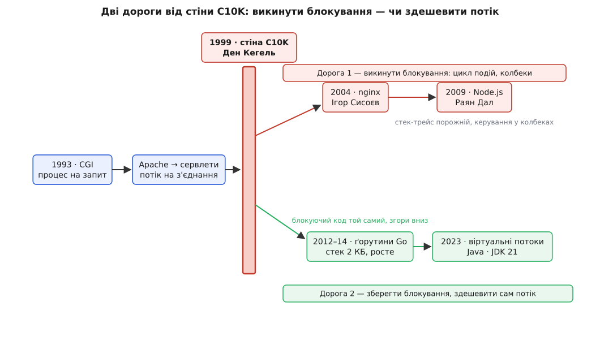

# 📜 Як подешевшав потік: падіння і повернення блокуючого коду

Блокуючий обробник — «прочитай кадр, онови стан, відповідай, читай далі» — це найстаріша й найприродніша форма серверного коду. Він читається згори вниз, як оповідь, і саме за це його цінували десятиліттями. Але одного дня ця модель врізалася в стіну — і галузь років на п'ятнадцять вирішила, що з нею покінчено. А тоді вона повернулася, майже незмінна ззовні, — бо люди переробили не її, а те, на чому вона стоїть. Це історія про те, що саме в блокуючому коді цінували так дорого, аж воліли перебудувати рантайм, ніж від нього відмовитися.

## Форк на кожен запит: наймолодший веб

Коли веб щойно навчився відповідати не готовими файлами, а обчисленим наживо, постало питання: як сервер запускає чужу програму на кожен запит? Відповідь дав **Роб Маккул** (Rob McCool) у грудні 1993-го — специфікацію CGI (англ. Common Gateway Interface — спільний шлюзовий інтерфейс) і її першу реалізацію в сервері NCSA HTTPd, прабатькові Apache. Модель CGI гранично проста: **на кожен запит сервер форкає окремий процес ОС**, той рахує відповідь і вмирає. Прийшов запит — народився процес; віддав HTML — згинув.

Це найчистіша, найдорожча форма «одна одиниця роботи — один потік керування»: не потік навіть, а цілий процес зі своїм адресним простором. І вона працювала — бо ранній веб був крихітний, десятки запитів на хвилину, і ціна форка губилася в шумі. Коли навантаження підросло, форк на кожен запит став задорогим, і модель здешевили, не міняючи її суті: замість процесу-на-запит — **потік-на-запит** усередині живого сервера. Apache в режимі worker садив потік на з'єднання; сервлет-контейнери Java (специфікація сервлетів вийшла 1997-го) дали кожному запитові свій потік із пулу. Форк процесу поступився потокові — дешевшому, але тій самій ідеї.

Чому саме ця модель захопила веб на два десятки років? Не через швидкість. Через те, що **код у ній думається так само, як виконується**: одна лінія згори вниз, без прихованих автоматів станів. Її обрали не тому, що вона найшвидша, а тому, що вона найзрозуміліша, — і цей борг зрозумілості галузь ще довго не готова буде повернути.

## Стіна на десять тисяч

1999 року інженер **Ден Кегель** (Dan Kegel) виклав на своїй сторінці `kegel.com/c10k.html` короткий, але дошкульний виклик. Він показав пальцем на FTP-сервер `cdrom.com`, що вже роздавав десять тисяч клієнтів воднораз через гігабітний Ethernet, і кинув галузі рукавичку: «It's time for web servers to handle ten thousand clients simultaneously» (Ден Кегель) — час серверам тримати десять тисяч клієнтів разом. Так народився **C10K** — числоскорот від *connections 10 000*, стіна на десяти тисячах одночасних з'єднань.

Суть проблеми Кегель окреслив точно: тримати багато **з'єднань** — це зовсім не те саме, що обробляти багато **запитів на секунду**. Друге вимагає швидкості; перше вимагає радше вміння дешево тримати те, що переважно **мовчить**. А модель потік-на-з'єднання платить за кожне живе з'єднання цілим потоком ОС — навіть коли те з'єднання годинами спить. На десятках потоків це непомітно. На десятьох тисячах стек кожного потоку в сумі з'їдає гігабайти адресного простору лише за те, що потоки **стоять**, а планувальник ОС починає більше часу перекладати контексти, ніж рахувати корисне. Це не хиба реалізації — це стеля самої моделі, об яку вона б'ється при рості.

Тут дороги й розійшлися. На стіну C10K галузь дала дві принципово різні відповіді — і майже п'ятнадцять років трималася першої, поки друга не довела, що модель не треба було ховати.


*Одна стіна — дві відповіді. Верхня дорога відмовляється від блокуючого коду заради циклу подій; нижня зберігає блокуючий код і робить дешевим сам потік. Модель Варіанта А живе на нижній.*

## Перша відповідь: викинути блокування

Найгучнішою відповіддю на C10K стало не «здешевити потік», а «взагалі його прибрати». Якщо тисяча сплячих з'єднань — це тисяча марних стеків, то викиньмо стеки: хай один потік крутить **цикл подій** (англ. event loop) і питає ядро «хто з тисячі з'єднань уже готовий?» — через неблокуючий ввід-вивід і механізми на кшталт `epoll`. Готове з'єднання смикає свій **колбек** (англ. callback — зворотний виклик), той робить крихітний крок і вертає керування в цикл. Жодного потоку на з'єднання; одне ядро тримає десятки тисяч.

> 🔧 **Навіщо це.** Неблокуючий ввід-вивід — це не деталь, а розвилка всієї архітектури: він вирішує, тримаєш ти стек на кожне з'єднання чи ні. Хто цю розвилку знає, той читає обидві дороги як відповідь на одне питання, а не як дві незалежні моди. Механіку неблокуючого вводу-виводу й циклу подій варто мати під рукою: [неблокуючий ввід-вивід](topic:programming/blocking-vs-nonblocking-io) — ядро не присипляє потік на `read`, а одразу каже «даних ще нема», і потік сам вирішує, чим зайнятися далі.

Цю дорогу проклали конкретні системи. 2004 року російський інженер **Ігор Сисоєв** (Igor Sysoev) випустив у Рамблері **nginx** — сервер на циклі подій з `epoll`/`kqueue`, що тримав тисячі з'єднань одним робочим процесом там, де Apache задихався. 2009-го **Раян Дал** (Ryan Dahl) побудував **Node.js** — той самий підхід, винесений у мову: увесь JavaScript на сервері став асинхронним за задумом, а Дал прямо посилався на архітектуру nginx. Сам Кегель у своєму маніфесті агітував саме за подієвий підхід. На півтора десятиліття «розв'язати C10K» практично означало «відмовитися від блокуючого коду».

Але за швидкість платили тим самим, що колись цінували, — зрозумілістю. Керування вивертається назовні, у колбеки, і оповідь згори вниз розсипається:

```js
// Той самий цикл — але керування вивернуте в колбеки
server.on('connection', (conn) => {
  conn.on('data', (frame) => {
    registry.update(frame.deviceId, frame.state, (err) => {   // теж асинхронно
      if (err) return conn.destroy(err);
      conn.write(ackFor(frame));            // відповіли…
    });                                     // …а стек-трейс уже порожній: цикл подій «забув», звідки прийшли
  });
});
```

Упало щось усередині — і стек-трейс не покаже історії: колбек вистрелив із порожнечі циклу подій, без роду-племені. Дебагер крокує рантаймом, а не логікою. Тобто дорога 1 розв'язала C10K ціною рівно тієї властивості, за яку блокуючу модель узагалі любили. Багато хто вважав це чесним обміном і замовк. Дехто — ні.

## Стара ідея, яку рано поховали

Найцікавіше, що альтернатива дорозі 1 була старша за саму проблему. Думка «а зробімо потік дешевим, не викидаючи блокуючий стиль» на момент C10K уже мала за плечима десятиліття доказів — просто не в тому кутку індустрії, що будував веб.

Найдалі зайшов **Erlang**. Його від 1986-го будували в шведському Ерікссоні **Джо Армстронг** (Joe Armstrong), **Роберт Вірдінг** (Robert Virding) і **Майк Вільямс** (Mike Williams) під телеком — а телекомові треба тримати мільйони одночасних дзвінків, кожен зі своєю логікою, і щоб один упалий не звалив сусідів. Відповіддю стали **легкі процеси** — не потоки ОС, а власні одиниці рантайму, кожен зі своїм крихітним стеком, ізольований, без спільної пам'яті, спілкується лише повідомленнями. Їх заводять мільйонами на одній машині. Erlang відкрили світові 1998-го — за рік до маніфесту Кегеля. Тобто доказ, що потік-у-просторі-користувача масштабується на мільйони, уже лежав на столі, поки веб бився в стіну.

Ба більше — і сама Java колись мала дешеві потоки й **власноруч їх викинула**. Ранні версії (1.0–1.1, середина 1990-х) виконувалися на «зелених потоках» (англ. green threads) — так їх назвала внутрішня «Зелена команда» (Green Team) у Sun. Це були потоки простору користувача: рантайм сам їх планував, накладаючи багато Java-потоків на один потік ОС. А тоді, у Java 1.3 (2000), зелені потоки викинули на користь справжніх потоків ОС — саме напередодні C10K. Іронія повна: Java відмовилася від дешевого потоку рівно перед тим, як світ уперся в дорожнечу потоку ОС, — і поверне його аж за двадцять з гаком років.

Чому ж стару ідею поховали? Бо ранні втілення були неповні: зелені потоки Sun не вміли по-справжньому паралелити роботу на кілька ядер (усе на одному потоці ОС) і спотикалися на будь-якому блокуючому системному виклику — один сплячий на `read` зупиняв усіх. Ідея була слушна; бракувало рантайму, що доводив би її як слід. Такий рантайм зробить Go.

## Друга відповідь: здешевити сам потік

2009 року — того самого, що й Node.js, — у Google **Роберт Ґрізмер** (Robert Griesemer), **Роб Пайк** (Rob Pike) і **Кен Томпсон** (Ken Thompson) оприлюднили Go (стабільна 1.0 вийшла 2012-го). Go пішов дорогою, протилежною до Node: не викидати блокуючий код, а зробити дешевим сам потік. Так з'явилася **ґорутина** — потік у просторі користувача, якого рантайм Go накладає на невеличкий пул потоків ОС (модель M:N: багато ґорутин на мало потоків).

Головний фокус — у стеку. Потік ОС резервує стек наперед, типово близько мегабайта, — звідси й уся ціна C10K. Ґорутина ж стартує з крихітного стека, що **росте на вимогу**. Шлях цієї цифри — окрема сага. Спершу Go використовував *сегментовані стеки*: стек, коли впирався в межу, доростав новим шматком пам'яті. Стартовий розмір спершу тримали малим, потім у Go 1.2 (2013) підняли з 4 КБ до 8 КБ — бо сегментовані стеки мали злий дефект: якщо межа сегмента випадала якраз усередині циклу, функція на кожній ітерації то відрізала новий сегмент, то вертала його, і це коштувало дорого (проблема «гарячого поділу», hot split). Щоб її прибрати, у Go 1.4 (2014) сегменти замінили на *суцільні стеки, що ростуть копіюванням*: коли стека бракує, рантайм виділяє більший, копіює туди весь уміст і поправляє вказівники. Тепер зростання рівномірне, без гарячого поділу, — і стартовий розмір змогли опустити до **2 КБ**, де він і стоїть донині.

```
потік ОС:     ~1 МБ стека, зарезервовано наперед
ґорутина:      2 КБ стека на старті → росте копіюванням на вимогу
─────────────────────────────────────────────────────────
10 000 з'єднань:  ~10 ГБ проти ~20 МБ — різниця у ~500 разів
```

Ось де все сходиться. Блокуючий виклик усередині ґорутини не присипляє потік ОС — рантайм **паркує ґорутину** (знімає з потоку, лишаючи її стек у пам'яті) і ставить на той самий потік іншу, готову. Потік ОС не простоює на `read`; простоює лише дешева ґорутина. Тому код лишається прямим, згори вниз, — а масштабується він тепер на мільйони:

```go
// Той самий цикл — прямий, згори вниз; ґорутина на кожне з'єднання
func handle(conn net.Conn) {
    for {
        frame := readFrame(conn)       // блокуємось — але спить ґорутина, не потік ОС
        registry.Update(frame.DeviceID, frame.State)
        conn.Write(ackFor(frame))      // відповіли — і знову чекаємо
    }
}
// на кожне нове з'єднання: go handle(conn)  ← ґорутина коштує 2 КБ, не мегабайт
```

Порівняй це з колбеками дороги 1: логіка та сама, але тут стек-трейс цілий, дебагер крокує кодом, а блокуючі бібліотеки просто працюють. Go повернув усе, що любили в моделі потік-на-з'єднання, і зняв ціну, за яку її ховали.

## Java наздоганяє: проєкт Loom

Java прийшла до тієї ж відповіді пізніше — і дуже обдумано. Ще до Oracle **Рон Пресслер** (Ron Pressler) робив Quasar — спробу принести легкі потоки в Java через маніпуляцію байткодом. 2017 року **Браян Ґец** (Brian Goetz) покликав його в Oracle очолити **проєкт Loom** (Project Loom) — вбудувати легкі потоки просто в рантайм JVM, а не збоку.

Результат — **віртуальний потік** (virtual thread): за суттю та сама ідея, що й ґорутина. Це продовження (continuation), яке планувальник накладає на невеликий пул потоків-носіїв ОС (carrier threads) — знову M:N. Блокуючий виклик у віртуальному потоці не займає потік-носій: віртуальний потік «згортається», звільняючи носія для інших. Стек живе в купі й займає кілобайти, а не мегабайт, — тож віртуальних потоків можна мати мільйони.

Loom навмисне не вигадував нового стилю. Мета проєкту, прямо записана в специфікації, — зберегти звичний стиль «потік на запит» і лише зняти з нього ціну потоку ОС. Тому в коді нічого не вивертається: пишеш той самий блокуючий обробник, лиш заводиш його у віртуальному потоці через `Executors.newVirtualThreadPerTaskExecutor()`.

Шлях у реліз був поетапний — Java випускає велике обережно:

```
JEP 425  Virtual Threads (Preview)          JDK 19   вересень 2022   перше прев'ю
JEP 436  Virtual Threads (Second Preview)   JDK 20   березень 2023   друге прев'ю
JEP 444  Virtual Threads                    JDK 21   19 вересня 2023  фінал (LTS)
```

Два прев'ю (JEP 425 у JDK 19 і JEP 436 у JDK 20) зібрали відгуки й досвід; фінальний JEP 444 закріпив віртуальні потоки в JDK 21 — довготривалій версії (LTS) від 19 вересня 2023-го. Відтоді «потік на з'єднання» в Java знову масштабується на мільйони, а старий блокуючий код лягає на нього без переписування.

## Що це означає

Складімо всю дугу в одне речення. На стіну C10K галузь дала дві відповіді. Дорога 1 (nginx, Node) сказала: блокуючий стиль надто дорогий — відмовмося від нього заради циклу подій, і заплатила зрозумілістю, вивернувши код у колбеки. Дорога 2 (ґорутини Go, віртуальні потоки Java) сказала протилежне: блокуючий стиль надто **цінний**, щоб його втрачати, — тож не чіпаймо його зовсім, а перебудуймо під ним рантайм, щоб потік перестав коштувати як потік ОС.

І ось у чому суть, найсильніша, яку варто винести. Простоту блокуючого коду — оповідь згори вниз, цілий стек-трейс, дебагер, що крокує логікою, — цінували не трохи. Її цінували настільки, що заради її збереження переписали не прикладний код, а **найглибший шар платформи**: як влаштований стек, як планувальник накладає одиниці виконання на ядра, що діється на блокуючому виклику. Легше було перебудувати рантайм, ніж змусити мільйони інженерів думати колбеками. Ґорутина й віртуальний потік — це не нова модель, а стара модель, якій нарешті дали рантайм, вартий її простоти. Дорога 2 — це виправдання того самого блокуючого коду, з якого починалася ця історія: його не треба було ховати, треба було дочекатися, поки потік подешевшає.
