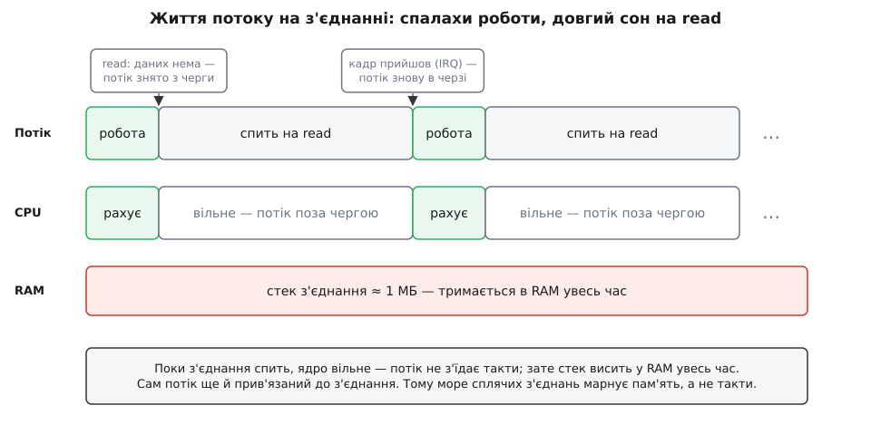
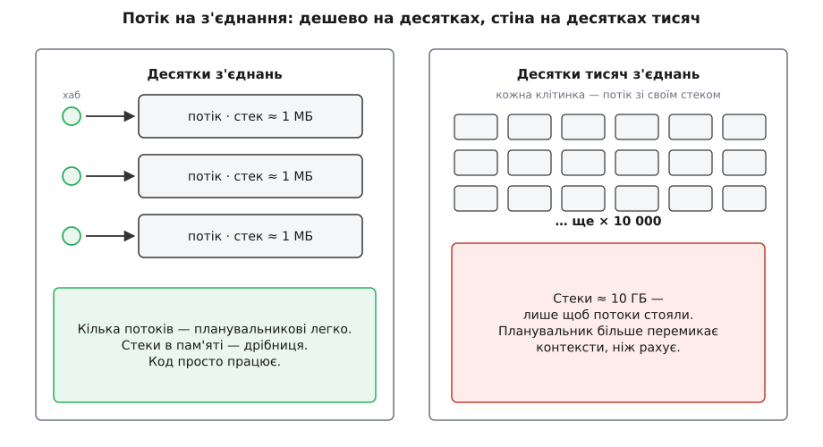
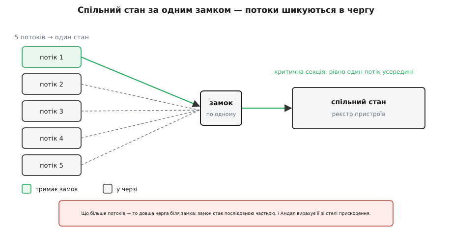

# Варіант А: потік на кожне з'єднання

<preknowlist>
- [Процеси й потоки](topic:programming/process-vs-thread) — потік має власний стек і власне місце в черзі планувальника ОС; створити його коштує і пам'яті, і часу. Уся ціна цього варіанта росте саме звідси.
- [Перегони даних і замки](topic:programming/data-races-locks) — спільну змінну два потоки псують без замка; м'ютекс пускає в критичну секцію по одному, і захищає він саме дані, а не рядки коду. Це і фундамент моделі, і корінь контеншну.
- [Дедлок](topic:programming/deadlock) — два замки, взяті в різному порядку, замикають одне одного назавжди (чотири умови Коффмана). «Страх дедлоків» — це про нього.
</preknowlist>

Весь цей модуль ми складали ящик з інструментами: потоки й ціну їх створення, замки та їхні капкани, пул із чергою задач, цикл подій, акторів, закон Амдала про стелю прискорення. Складали не заради колекції — заради одного рішення, до якого DH нарешті дійшов упритул.

Скрипт із-під столу став хмарою. Тепер до неї тримають **живе з'єднання** тисячі хабів одночасно: кожен цідить угору стан своїх пристроїв і чекає вниз команд. Один приймальний сервер мусить тримати всі ці з'єднання разом — не по черзі, а водночас. Питання вже не «чи впораємось», а «**якою моделлю виконання** це крутити». Чесних відповідей три, і це — [класична розвилка курсу](root:progarch/variant-block-anatomy): три варіанти, кожен захищають усерйоз, а вибір лишають на потім. Тут ми боронимо перший — найстарший і найзнайоміший — і боронимо його в найсильнішій формі, щоб згодом важити його чесно, а не бити опудало.

## Найпростіше, що працює: потік на з'єднання

Ідея Варіанта А коротка: **дай кожному з'єднанню власний потік**. Потік сідає на своє з'єднання й веде його від початку до кінця — читає кадр, оновлює стан, відповідає, знову читає. Читає **блокуючись**: коли від хаба нічого не чути, потік просто спить на `read`, не з'їдаючи ядро. Прийшов кадр — потік ожив, зробив крок і знову заснув на наступному читанні.

Придивись до тіла обробника — це ж [той самий цикл, що крутився в v0 під столом](root:progarch/dh-v0-one-sensor): прочитати → вирішити → діяти. Тільки тепер таких циклів не один, а тисячі — по одному на з'єднання, і кожен живе у своєму потоці, не знаючи про сусідів.

```java
// Приймальний сервер DH: тримає живі з'єднання від хабів
ExecutorService pool = Executors.newFixedThreadPool(200);   // обмежений пул (з попереднього розділу)
ServerSocket server = new ServerSocket(8443);

while (true) {
    Socket conn = server.accept();          // блокуємось, поки прийде новий хаб
    pool.submit(() -> handle(conn));        // потік із пулу бере це з'єднання собі
}

void handle(Socket conn) throws IOException {
    var in = new DataInputStream(conn.getInputStream());
    while (true) {                          // поки хаб на зв'язку
        Frame f = readFrame(in);            // БЛОКУЄМОСЬ, поки прийде кадр
        registry.update(f.deviceId(), f.state());   // спільний стан — за замком (нижче)
        reply(conn, ackFor(f));             // відповіли — і знову чекаємо
    }                                       // розрив → виняток → потік вивільняється в пул
}
```

Найнаївніша форма — `new Thread(...)` на кожне з'єднання без ліку — валиться від першого сплеску: скільки хабів під'єдналось, стільки й потоків народилось. Тому в проді її одразу заковують в [обмежений пул](topic:programming/thread-pool): фіксована армія потоків розбирає з'єднання з черги. Пул — це не окрема модель, це просто **доросла форма** того самого Варіанта А: скільки потоків тримати, вирішуєш ти, а не натовп клієнтів.

Але фіксований пул переносить проблему, а не знімає її. Потоків, скажімо, двісті, а живих з'єднань — тисячі; отже, тепер потік не сидить на одному з'єднанні від народження до смерті — він бере його, доки на ньому є робота, і вертається в пул, коли те замовкло. А якщо всі двісті зайняті, а робота все прибуває — нові задачі шикуються в **чергу перед пулом**. І тут ховається розвилка, яку легко проґавити: чи обмежена ця черга? Обмежена — сервер під перевантаженням чесно почне відмовляти («зайнято, спробуй згодом»), і це **зворотний тиск** (backpressure), сигнал угору, що пора гальмувати. Необмежена — черга тихо росте, латентність повзе вгору, аж поки не скінчиться пам'ять. Тобто навіть доросла форма не безкоштовна: ти проміняв «потік на кожне з'єднання» на «потік на кожне **активне** з'єднання» — і ще мусиш вирішити, що робити, коли активних більше, ніж потоків.

## Що робить `read`, коли даних нема

Слово «блокуємось» звучить як пасивне очікування, але за ним — точний механізм ОС, і саме він пояснює, чому ця модель воднораз така зручна й така дорога.

Коли потік кличе `read` на з'єднанні, де кадру ще нема, це системний виклик у ядро. Ядро бачить, що читати нема чого, і замість крутитися вхолосту робить головне: позначає потік як «чекає на цьому сокеті» і **знімає його з черги планувальника**. Потік, якого нема в черзі, не дістає процесорного часу взагалі — ось точна причина, чому сплячий потік «не з'їдає ядро». Для планувальника він на цей час просто зникає, доки його не збудять.

Будить його залізо. Прийшов пакет — мережева карта смикає апаратну перерву, ядро її обробляє, бачить, що дані для цього сокета, і повертає потік у чергу — знову «готовий до роботи». Трохи згодом планувальник дає йому такт, і `read` нарешті вертає кадр. З погляду твого коду `read` просто «трохи довше поспав». Усю бухгалтерію — хто на що чекає, кого будити — ядро провело за тебе.

Ось тиха магія моделі: ти пишеш пряму лінію, а ядро само перетворює «чекай на дані» на «приспи цей потік, збуди на приході». Ти ніколи не писав автомата станів — автомат станів **уже є**, один на всіх, і живе він у ядрі, а не в твоєму коді.

Але тут-таки й корінь ціни. Поки потік приспаний, він **поза чергою планувальника** — тактів не їсть; а його **стек лишається в пам'яті цілком**. Заблокований потік не коштує жодного циклу, зате коштує всього свого стека весь час, поки спить. Ба більше: у блокуючій моделі приспаний потік **прив'язаний до свого з'єднання** — він не може тим часом обслужити інше, бо стоїть усередині `read`. Пул його не забере, доки не прийде кадр.


*Один потік веде одне з'єднання. Робота — короткі спалахи; між ними потік спить на `read`, знятий з черги планувальника, тож ядро вільне. А стек висить у пам'яті весь час — і поки потік спить, він прив'язаний до цього з'єднання. Ось чому море сплячих з'єднань марнує саме пам'ять, а не такти.*

## Головний виграш: модель у голові = модель у машині

Чому за цю модель тримаються десятиліттями? Не через швидкість. Через те, що **вона збігається з тим, як ти про неї думаєш**. Ядро сховало все очікування за одним `read`, тож обробник лишився прямою лінією — і саме ця пряма лінія й виконується.

Коли обробник читається згори вниз — «дочекайся кадру, онови стан, відповідай» — то саме це й діється в машині, крок за кроком, в одному потоці. Немає прихованого автомата станів у **твоєму** коді, немає «а тепер керування полетіло кудись і колись повернеться». Через це:

- **стек-трейс — це справжня історія**: упало на `registry.update` — у трейсі видно весь шлях, хто і звідки сюди прийшов, а не голий колбек без роду-племені;
- **дебагер крокує логікою**, а не рантаймом: постав breakpoint, іди по кроках — вони ті самі, що й у коді;
- **блокуючі бібліотеки просто працюють**: драйвер бази, клієнт HTTP, читання файлу — усе синхронне, писане за двадцять років, лягає без обгорток.

> 🔧 **Навіщо це.** Ціна, яку рідко рахують у бенчмарках, — це **години інженера на баг у проді**. Коли о третій ночі рветься з'єднання, різниця між «дивлюсь стек-трейс і бачу історію» та «колбек вистрелив з порожнечі, контекст відновлюю руками» — це різниця між п'ятьма хвилинами й п'ятьма годинами. Варіант А платить пам'яттю машини, щоб зекономити пам'ять людини. Часто це вигідний обмін — просто його не видно на графіку latency.

## Хто так возить це в проді

Це не музейний експонат. На потоці-на-запит стояв майже весь веб два десятки років: Apache у режимах prefork і worker (процес або потік на з'єднання), сервлет-контейнери на кшталт Tomcat (потік на запит), PostgreSQL і донині дає кожному клієнтові окремий процес — заради залізної ізоляції, щоб один клієнт не завалив сусідів. Мільярди запитів на день пройшли цією моделлю — «іграшкою» її не назвеш.

Ба більше: індустрія не просто лишила її живою, а **воскресила**. Коли [межа C10K](topic:programming/blocking-vs-nonblocking-io) показала, що десятки тисяч потоків ОС — це стіна, спокуса була викинути блокуючий стиль геть. Натомість пішли іншим шляхом: лишити зручну модель, але **здешевити сам потік**. Go зробив це ґорутинами, Java — віртуальними потоками (проєкт Loom, фінал у JDK 21, вересень 2023). І ґорутина, і віртуальний потік стартують зі стеком у кілька кілобайтів, що росте на вимогу, — тож «потік на з'єднання» знову масштабується на мільйони. [Історію цього падіння й повернення](root:progarch/runtime-threads-variant/hist-virtual-threads.md) варто знати окремо: вона показує, що саме в цій моделі люди так цінували, аж переробили рантайм, щоб її зберегти.

## Чим платиш

Тепер — чесний рядок, найважливіший у будь-якому варіанті. Ціна Варіанта А має три обличчя, і всі три ми вже бачили в модулі поокремо; тут вони сходяться разом.

**Пам'ять на стеки.** Кожен потік ОС резервує власний стек — типово близько мегабайта. Точніше, це мегабайт **зарезервованого адресного простору**: фізичну пам'ять під нього ядро прирізає сторінками в міру того, як стек реально глибшає, тож порожній потік коштує менше за повний мегабайт. Але резерв усе одно тримає місце, і на десятках тисяч потоків самих лише резервів набігають гігабайти — витрачені **лише на те, щоб потоки стояли**, ще нічого не роблячи. А до пам'яті додається другий, менш очевидний рахунок — **перемикання контекстів**. Коли готових потоків більше, ніж ядер, планувальник крутить їх по черзі: зберегти регістри одного, завантажити регістри іншого, стрибнути в ядро й назад. Найдорожче тут навіть не самі регістри, а те, чого не видно: кожне перемикання холодить кеш процесора — новий потік приходить на чужі, вибиті з кеша дані, і перші його такти йдуть на промахи. Тож коли потоків тисячі, планувальник більше часу перекладає контексти й гріє холодні кеші, ніж рахує корисне. Це і є стіна, об яку модель б'ється при рості.


*Кожне живе з'єднання коштує цілого потоку ОС: стек у пам'яті плюс місце в черзі планувальника. Дешево на десятках, стіна на десятках тисяч.*

**Контеншн (англ. contention — суперництво за ресурс).** Тисячі потоків читають і правлять один спільний стан — реєстр пристроїв, мапу з'єднань. Спільне пишеться лише під замком, тож усі вони збігаються до однієї критичної секції — і шикуються в чергу. Що більше потоків, то довша черга; замок стає **послідовною часткою**, а [закон Амдала](topic:algorithms/amdahls-law) нам уже показав: саме послідовна частка ставить стелю прискоренню. Додав ще потоків — а швидше не стало, бо всі вони чекають на тому самому замку. І це не просто черга: сам замок під тиском дорожчає. Слово замка — одна комірка пам'яті, яку рвуть до себе кеші різних ядер: узяв замок на одному ядрі — його рядок кеша мусить перелетіти туди, наступне ядро тягне назад, і комірка «стрибає» між ядрами замість того, щоб тихо лежати. А коли потік так і не дочекався й ядро вирішило його приспати, це знову пара системних викликів — заснути й прокинутися. Найгірше, що контеншн **невидимий**, доки навантаження мале: на ноутбуку все летить, а під тисячею живих хабів сервер раптом упирається — і графік не пояснює, чому.


*Спільний стан за одним замком перетворює паралельні потоки на чергу. Замок — це послідовна частка, яку Амдал вирахує зі стелі прискорення.*

Ось де замок показує свою природу: він захищає **дані, а не код** — ти береш його, щоб ніхто не побачив реєстр напівзміненим. У Rust ця думка стає фізичною: стан живе **всередині** замка, і не взявши замок, ти навіть не дотягнешся до даних.

```rust
use std::sync::{Arc, Mutex};

// Стан, до якого лізуть УСІ потоки-з'єднання
let registry = Arc::new(Mutex::new(Registry::new()));

// у кожному потоці:
{
    let mut r = registry.lock().unwrap();   // взяв замок — аж тепер видно дані
    r.update(dev, state);                   // чіпати реєстр можна лише тут
}                                           // вийшов із блоку — замок віддано
```

**Страх дедлоків.** Один замок — просто черга. Але щойно замків стає два (реєстр і, скажімо, мапа сесій), з'являється шанс узяти їх у різному порядку в різних місцях коду — і два потоки замкнуть одне одного намертво. Це не гіпотетика, а [чотири умови Коффмана](topic:programming/deadlock), які ми розбирали, в дії. Головне: цей податок платиться **не з навантаженням, а з кодом**. Кожен новий спільний стан — це нове місце, де можна наплутати з порядком замків; складність коректності росте разом із кодовою базою, тихо, поки одного дня не клацне. Тримають це в шорах однією дисципліною — **єдиним порядком замків** на весь код: скрізь бери їх в одній і тій самій послідовності, і цикл не замкнеться. Але ця дисципліна живе в головах, а не в компіляторі, — і тому розсипається тим певніше, чим більша команда й старший код.

## Де ця модель виграє, а де стіна

Зведімо ціну й вигоду в одне чесне речення. Варіант А **сяє**, коли з'єднань відносно небагато або коли робота на них рахункова (CPU-bound): тоді потоки саме те, що треба — вони розкладають обчислення по ядрах, а замки беруться рідко, тож і черги майже нема. Він же й **найдешевший на старті** для команди: пишеш звичайний послідовний код, дебажиш звичним дебагером, віддаєш першу версію швидше за всіх.

А **стіна** в нього там, де з'єднань десятки тисяч і всі вони переважно **сплять**, зрідка перекидаючись кадром. Саме такі хаби DH: живе з'єднання тримається годинами, а трафіку по ньому — крапля. І пул тут не рятує — ми щойно бачили, чому: приспаний на `read` потік прив'язаний до свого сплячого з'єднання, пул його не забере. Отже, щоб тримати десять тисяч живих з'єднань, треба десять тисяч потоків, навіть якщо дев'ять із десяти будь-якої миті мовчать. Тримати повноцінний потік ОС заради з'єднання, що 99% часу мовчить, — це платити мегабайтом стека за краплю роботи. Ось той **один факт**, що перемикає вибір: важить не «скільки з'єднань», а «скільки з них зайняті **одночасно**». Багато зайнятих — потоки доречні; море сонних — потоки марнують пам'ять.

Саме цю слабину атакує [Варіант Б із циклом подій](root:progarch/runtime-eventloop-variant): один потік і тисяча сплячих з'єднань без тисячі стеків. А [Варіант В з акторами](root:progarch/runtime-actors-variant) б'є з іншого боку — прибирає спільний стан, а з ним і сам замок, і страх дедлоків. Кожен із двох наступних варіантів — це, по суті, відповідь на одну з трьох цін, які ми щойно назвали.

І остання лінза — зворотність. Почати з потоків — рішення радше **двобічне**: якщо тримати обробник охайним, а спільний стан за чистим швом, рантайм під ним можна замінити пізніше, коли впреш у стіну. Цей шов — не дрібниця стилю, а те, що потім дасть підмінити модель: обробник, який не знає, справжній під ним потік чи віртуальний, переживе зміну рантайму без переписування. Тому для першої версії Варіант А часто раціональний навіть там, де знаєш, що переростеш його: він найшвидше доводить, що вся інша система працює, — а модель виконання поміняєш, коли числа під навантаженням скажуть, що час. І найлагідніший шлях за стіну веде рівно звідси: лишити код блокуючим, а здешевити сам потік — ті самі ґорутини й віртуальні потоки, що ми згадали вище, дають цю ж пряму лінію за кілобайти замість мегабайта. Ці числа й порівняє [підсумковий вибір](root:progarch/runtime-choice), прогнавши всі три варіанти крізь спільні сценарії.
