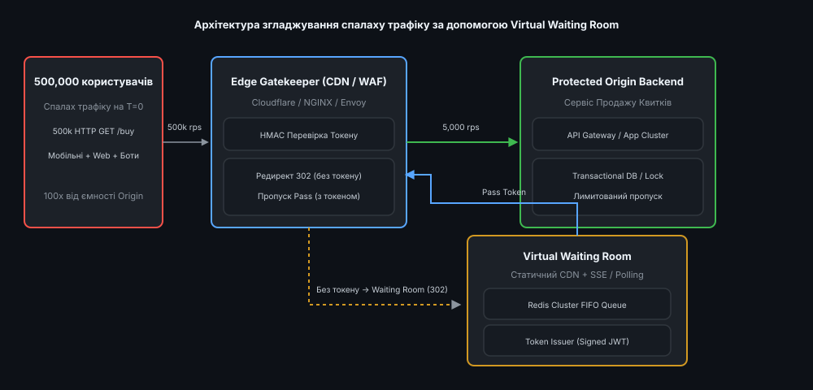
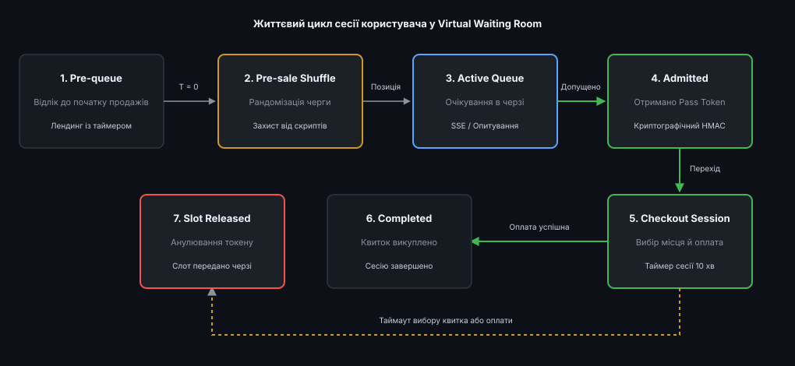
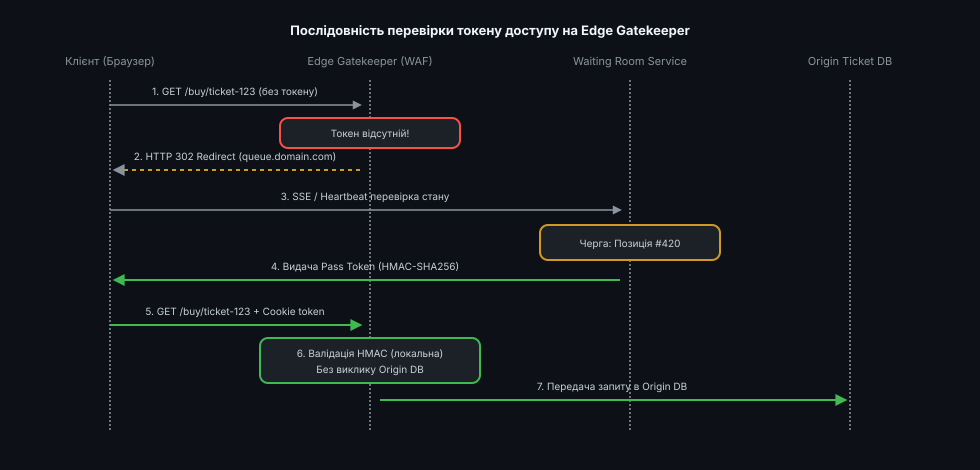
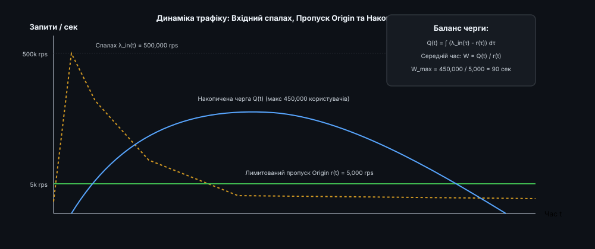

# Старт продажу на топ-концерт: Архітектура Virtual Waiting Room

<preknowlist>
- [Навантаження спалахами (Flash Crowds)](book:programming/distributed-systems/flash-crowds) — феномен масового одночасного трафіку та чому звичайне масштабування (autoscaling) не встигає реагувати.
- [Управління потоком (Rate Limiting та Throttling)](book:programming/distributed-systems/rate-limiting) — алгоритми обмеження частоти запитів (Token Bucket, Leaky Bucket, Sliding Window).
- [Токени доступу та криптографічні підписи](book:programming/security/crypto-tokens) — формування JWT/HMAC токенів для безпечного перенаправлення без зберігання стану на Edge.
</preknowlist>

О 10:00:00 стартує продаж квитків на фінал Чемпіонату світу з футболу або концерт стадіонного масштабу. За перші 500 мілісекунд понад 500 000 користувачів одночасно натискають кнопку оновлення сторінки або надсилають HTTP-запити на вибір місця у залі. Фізично допустима спроможність транзакційного ядра платформи (Origin Database та API Gateway) становить 5 000 активних сесій на секунду. Без надійного захисту така сторазова перевантаженість за частки секунди призводить до вичерпання пулу з'єднань із базою даних, дедлоків на транзакціях блокування місць, каскадних таймаутів HTTP 504 та повного краху системи.

Спроба розв'язати цю проблему автоматичним горизонтальним масштабуванням (Autoscaling) у хмарі зазнає поразки з двох причин. По-перше, проплітання та запуск нових контейнерів у Kubernetes або віртуальних машин у хмарі займає від 45 секунд до 3 хвилин, тоді як руйнівний спалах трафіку досягає піку за 500 мілісекунд. По-друге, навіть якщо розширити ярус обробників до тисячі вузлів, вузьке місце неминуче зміститься в джерело правди — реляційну базу даних, де тисячі паралельних транзакцій будуть конкурувати за блокування одних і тих самих рядків інвентаря квитків.

Єдиним архітектурно правильним розв'язком цієї проблеми є створення **Virtual Waiting Room (віртуальної кімнати очікування)**. Цей паттерн розділяє інфраструктуру на два контури: географічно розподілений шар фільтрації трафіку на Edge CDN, який утримує мільйонний натовп на статичних сторінках, та захищене Origin-ядро, куди покупці допускаються зі строго визначеною, безпечною швидкістю.


*Трикомпонентна архітектура Virtual Waiting Room: Edge Gatekeeper фільтрує вхідний потік 500 000 rps, перенаправляючи покупців без токенів у кімнату очікування та пропускаючи до Origin безпечну норму 5 000 rps.*

Детальний аналіз того, як індустрія квиткових продажів пройшла шлях від безпорадного падіння серверів на початку 2000-х до сучасних безсерверних заслонів, висвітлено у матеріалі [Історія еволюції захисту від трафікових спалахів](root:progarch/scale-and-load/sale-start-waiting-room/hist-waiting-room-evolution.md).

## Анатомія руйнівного спалаху трафіку (Flash Crowd vs DDoS)

Щоб зрозуміти, чому класичні засоби балансування навантаження виявляються безсилими перед масовими подіями, необхідно порівняти механіку атаки DDoS та естетичного спалаху трафіку (Flash Crowd).

При DDoS-атаці зловмисники надсилають синтетичні запити з ботнету. Вміст цих запитів часто можна відфільтрувати за допомогою правильних інструментів WAF (Web Application Firewall), гео-блокування або аналізу IP-репутації.

При старті продажів на топ-концерт трафік генерують реальні, авторизовані користувачі з валідними сесіями, банківськими картками та високим платоспроможним попитом. Кожен такий користувач виконує наступну послідовність дій:
1. За кілька хвилин до початку відкриває веб-сайт і починає постійно оновлювати сторінку (`F5 Storm`).
2. О 10:00:00 надсилає запит на завантаження інтерактивної карти залу (Stadium Map), яка вимагає вибірки тисяч доступних крісел із бази даних.
3. Обирає місце та натискає кнопку «Забронювати», ініціюючи транзакційне блокування рядка в базі даних із таймером викупу на 10 хвилин.

Якщо на платформу одночасно заходить 500 000 людей, а в залі є лише 50 000 місць, 90% користувачів у будь-якому разі не отримають квиток. Мета архітектури Virtual Waiting Room полягає у тому, щоб захистити систему від падіння, забезпечити чесний розподіл квитків за принципом черги та надати користувачам прозорий і спокійний досвід очікування замість споглядання помилок HTTP 502/504.

## Простеження шляху HTTP-запиту крізь яруси системи

Для розуміння взаємодії всіх залучених підсистем простежимо шлях поодинокого HTTP-запиту від моменту натискання кнопки у браузері користувача до збереження транзакції в інвентарній базі даних.

На етапі 1 запит проходить крізь мережу географічного DNS-маршрутизатора та термінується на найближчому Edge-вузлі CDN. Тут встановлюється TLS-з'єднання й виконується перевірка правил Web Application Firewall (WAF) на наявність сигнатур шкідливих атак.

На етапі 2 обробку перехоплює безсерверний скрипт Edge Gatekeeper. Він зчитує заголовок `X-Waiting-Room-Token` або кукі `vwr_token`. Якщо токена немає, Gatekeeper створює відповідь `HTTP 302` і перенаправляють користувача на кімнату очікування.

На етапі 3, у разі наявності токена, Edge Gatekeeper виконує обчислення HMAC-SHA256 від кодованої частини payload з використанням системного ключа `SecretKey`. Якщо підпис збігається і час `exp` є дійсним, Gatekeeper модифікує заголовок на `X-Waiting-Room-Status: ADMITTED` і проксіює запит у внутрішню мережу Origin.

На етапі 4 запит потрапляє на внутрішній API Gateway додатка, який перевіряє право користувача на резервування квитка і передає командний виклик у transactional lock engine бази даних PostgreSQL/ScyllaDB.

Завдяки такій каскадній обробці до етапу 4 доходять лише 5 000 запитів на секунду, тоді як решта 495 000 запитів повертаються клієнтам у формі статичних сторінок очікування ще на етапі 2.

## Географічне шардування та Edge-архітектура (Geo-Distributed POPs)

Сучасні системи Virtual Waiting Room розгортаються поверх глобальних Anycast-мереж CDN (Cloudflare, AWS CloudFront, Fastly). Коли півмільйона користувачів одночасно надсилають запити, вони потрапляють не у єдиний дата-центр, а розподіляються між 300+ точками присутності (Points of Presence — POPs) по всьому світу.

На кожній точки POP працює локальний безсерверний обробник (Worker), який контролює вхідну частоту запитів за допомогою лог-структурованих лічильників.

Для узгодження загального лічильника черги між 300 дата-центрами використовується дворівнева схема:
- **Локальний бакетинг на POP:** Кожен Edge-вузол обробляє запити локально й групує нових користувачів у пачки (batches) кожні 500 мілісекунд.
- **Глобальна синхронізація через Redis Cluster:** Усі POP надсилають узагальнені пачки до центрального Redis Cluster, де підраховується глобальний ранг користувача.

Це знижує навантаження на мережеве ядро черги у 100 разів і дає змогу витримувати мільйонні трафікові спалахи без втрати цілісності порядку.

## Життєвий цикл сесії та стейт-машина Virtual Waiting Room

Сесія кожного користувача у системі Virtual Waiting Room проходить крізь суворо визначену послідовність станів, що контролюється distributed state-машиною.


*Стейт-машина сесії користувача: від Pre-queue та випадкової рандомізації порядкового номера до активного очікування, отримання токена HMAC та завершення сесії купівлі.*

### Етап 1: Попередня кімната очікування (Pre-queue Warmup)

За 15–30 хвилин до офіційного початку продажів (наприклад, о 09:30:00) на сайті відкривається сторінка події. Усі користувачі, які заходять у цей проміжок часу, потрапляють у стан `Pre-queue`.

На цьому етапі сервіс не генерує порядкових номерів у черзі. Користувач отримує статичну HTML/JS-сторінку, віддану з географічного кешу Edge CDN. Сторінка містить зворотний відлік часу до 10:00:00 та ініціалізує фонове з'єднання WebSocket або SSE (Server-Sent Events) із вузлами черги.

Головна мета Pre-queue — зібрати вхідний натовп у «кімнаті очікування» без навантаження на Origin і підготувати їх до процедури справедливої рандомізації.

### Етап 2: Рандомізація передстартового натовпу (Pre-sale Shuffle)

Якби система призначала номери в черзі за часом надходження HTTP-запиту (First-In, First-Out за мережевим часом), перевагу отримали б автоматизовані боти, розташовані у дата-центрах поруч із серверами продажів, оскільки їхній мережевий RTT становить < 1 мс проти 50–100 мс у звичайних людей з мобільним інтернетом.

Щоб повністю знівелювати цю нечесну перевагу, о 10:00:00 система активує алгоритм **Pre-sale Shuffle**:
- Усі користувачі, які перебували в Pre-queue на момент `T = 0`, об'єднуються в єдиний масив сесій.
- Сервіс черги виконує перемішування масиву за допомогою збалансованого алгоритму Fisher-Yates із використанням криптографічно стійкого генератора псевдовипадкових чисел (CSPRNG).
- Кожному користувачу з Pre-queue випадає випадковий порядковий номер від 1 до `N_pre`.

Користувачі, які приходять після 10:00:00, уже не беруть участі в рандомізації — вони автоматично додаються в кінець черги на позиції `N_pre + 1`, `N_pre + 2` і так далі.

### Етап 3: Активне очікування в FIFO-черзі (Active Queueing)

Після вирахунку початкового рангу користувач переходить у стан `Active Queue`. На екрані з'являється лічильник із двома основними параметрами:
1. **Поточна позиція в черзі (Current Position):** Наприклад, «Перед вами в черзі 1,420 людей».
2. **Оцінка часу очікування (ETA — Estimated Time of Arrival):** Наприклад, «Приблизний час очікування: 3 хвилини».

Зв'язок із сервером черги підтримується за допомогою Server-Sent Events (SSE) або адаптивного фонового опитування (Adaptive Polling). Якщо сервіс черги помічає, що користувач надсилає запити частіше ніж дозволено (наприклад, кожні 500 мс замість 5 секунд), Gatekeeper повертає код `HTTP 429 Too Many Requests` із заголовком `Retry-After`.

### Етап 4: Видача токена доступу та допуск (Admitted & Pass Token)

Коли позиція користувача наближається до 0 (тобто в Origin звільняються слоти для оформлення квитків), сервіс черги генерує **Pass Token** (токен доступу).

Токен являє собою підписаний структурований рядок або JWT, кодований у Base64URL, який містить `customer_id`, `event_id`, UNIX-timestamp закінчення дії `exp` та криптографічний підпис HMAC-SHA256.

Сервіс черги повертає цей токен клієнту через SSE-подію або JSON-відповідь і виконує перенаправлення браузера (HTTP 302 / 307) на захищену URL-адресу Origin: `https://tickets.domain.com/buy/event-123`.

### Етап 5: Сесія купівлі та звільнення слота (Checkout Session & Slot Release)

Отримавши Pass Token, браузер зберігає його у `Cookie` або додає до заголовка `X-Waiting-Room-Token` і робить запит на Origin. Edge Gatekeeper локально перевіряє HMAC-підпис токена й пропускає запит до додатка.

Користувачу дається строго обмежений таймер на покупку `T_checkout` (наприклад, 10 хвилин). Протягом цього часу він обирає крісла на схемі залу, вводить дані пасажирів/глядачів та здійснює оплату через платіжний gateway.

Якщо користувач успішно здійснює оплату, слот вважається завершеним. Якщо ж користувач закриває вкладку, відмовляється від покупки або його таймер `T_checkout` вичерпується, захищене ядро Origin анулює резерв місць і сповіщає сервіс черги про можливість випустити новий Pass Token для наступного покупця в черзі.

## Контур перевірки токену на Edge (Zero-Origin Gatekeeper)

Ключовим елементом, який дозволяє системі витримувати 500 000 rps, є перенесення логіки валідації токенів на самісінький край мережі (Edge CDN).


*Послідовність викликів при перевірці токена: Edge Gatekeeper виконує валідацію HMAC за лічені мікросекунди без запитів до бази даних, відсікаючи 99% трафіку.*

При надходженні будь-якого HTTP-запиту на захищений роут (наприклад, `/buy/*`) Edge Gatekeeper (Cloudflare Worker, Envoy Filter або NGINX Lua module) виконує наступну покрокову процедуру:

1. **Витягування токена:** Gatekeeper шукає токен у заголовку `X-Waiting-Room-Token` або в кукі `vwr_token`.
2. **Перевірка наявності:** Якщо токен повністю відсутній, Gatekeeper перериває обробку й негайно повертає відповідь `HTTP 302 Found` із перенаправленням на домен кімнати очікування `https://queue.domain.com/?event=123&target=...`.
3. **Криптографічна валідація HMAC:** Gatekeeper відокремлює payload від підпису. Далі за допомогою системного секретного ключа `SecretKey` він обчислює локальний HMAC-SHA256 від рядка payload і порівнює його з підписом із токена у **константному часі** (для запобігання Timing Attacks).
4. **Перевірка терміну дії (Expiration Check):** Gatekeeper декодує `exp` з payload і порівнює його з поточним системним часом `now()`. Якщо `now() > exp`, токен вважається недійсним, і користувача перенаправляють у чергу.
5. **Проксіювання запиту (Origin Pass):** Якщо всі перевірки пройшли успішно, Gatekeeper додає службовий заголовок `X-Waiting-Room-Status: ADMITTED` і передає запит у внутрішню мережу до Origin API.

Оскільки всі п'ять кроків виконуються виключно у пам'яті Edge-вузла без звернення до бази даних або мережевих Redis-серверів, латентність перевірки становить менше 0.2 мікросекунди, а пропускна здатність Edge-шару масштабується пропорційно трафіку CDN.

Повну програмну реалізацію High-Performance Gatekeeper мовами C та C++ з використанням бібліотеки OpenSSL наведено у практичному матеріалі [Практична реалізація Gatekeeper та Rate Limiter на C/C++](root:progarch/scale-and-load/sale-start-waiting-room/proj-waiting-room-gatekeeper.md).

Повний контракт HTTP-заголовків, кукі, JSON-схем та специфікацію SSE-подій зібрано у довіднику [Довідник API та специфікація токенів доступу](root:progarch/scale-and-load/sale-start-waiting-room/api-waiting-room-contract.md).

## Математична модель допуску та контролер зворотного зв'язку

Головним завданням оркестратора черги є розрахунок максимально безпечної швидкості випуску токенів `r(t)` (вимірюється в токенах на секунду).


*Співвідношення пікового вхідного спалаху λ_in(t), контрольованого випуску r(t) та обсягу накопиченої віртуальної черги Q(t) у часі.*

Якщо швидкість випуску `r(t)` буде занадто високою, Origin-база даних перевантажиться, що призведе до падіння сайту. Якщо ж швидкість `r(t)` буде занадто низькою, користувачі чекатимуть у черзі без потреби, а квитки залишатимуться невикупленими.

Динамічний розрахунок базується на підтриманні інваріанта максимальної кількості активних сесій в Origin `K_active`:

```
r_safe(t) = (K_active - N_current_active(t)) / T_avg_checkout + μ_release(t)   [формула динамічного допуску]
```

Де:
- `K_active` — максимальна ємність активних покупців, яку здатна витримати база даних (наприклад, 3 000 сесій).
- `N_current_active(t)` — поточна кількість покупців, які перебувають на екрані вибору місць та оплати.
- `T_avg_checkout` — середня тривалість перебування покупця на екрані оплати (наприклад, 360 секунд).
- `μ_release(t)` — швидкість звільнення слотів покупцями, які завершили покупку або закрили вкладку.

Для підтримки цієї швидкості на рівні оркестратора застосовується паттерн **Token Bucket (бакет токенів)**, де токени допуску додаються у впорядкований список Redis ZSET із фіксованою частотою.

Детальний математичний вивід формул балансу потоків, адаптації закону Літтла для оцінки часу ETA та ймовірнісних моделей добровільного залишення черги наведено у матеріалі [Математична модель черги та пропускної здатності](root:progarch/scale-and-load/sale-start-waiting-room/math-queue-rates-and-token-bucket.md).

## Захист від ботів та аналіз біометричної поведінки у черзі

Перебування користувача у віртуальній кімнаті очікування використовується системою не лише для затримки трафіку, але й для проведенні безмовного аналізу поведінки (Invisible Bot Detection).

Протягом часу очікування статичний JavaScript-модуль на сторінці черги виконує наступні перевірки:
1. **Аналіз руху миші та сенсорного екрана:** Скрипт вимірює ентропію векторів руху курсора (Bezier curve trajectories). Автоматизовані боти або надсилають кліки без руху миші, або рухають курсор по строгих прямих лініях.
2. **WebGL / Canvas Fingerprinting:** Скрипт рендерить приховану графічну сцену на відеокарті клієнта й обчислює хеш зображення. Це дозволяє ідентифікувати унікальні конфігурації заліза й виявляти багатопотокові емулятори Headless Chrome / Puppeteer.
3. **JA3 / JA4 TLS Fingerprinting:** На рівні термінації TLS Edge Gatekeeper обчислює хеш від списку підтримуваних шифрів та розширень у пакеті `ClientHello`. Python-скрипти на базі `requests` або `curl` мають стандартні JA3-хеші, які відрізняються від реальних браузерів Safari чи Chrome.

Якщо користувач визначається як автоматизований бот, сервіс черги перенаправляють його сесію у «чорну діру» (Blackhole Queue) — ізольовану чергу, де позиція візуально зменшується, але Pass Token ніколи не видається.

## Моніторинг, спостережуваність (Observability) та ключові метрики

Ефективне управління віртуальною кімнатою очікування вимагає збору та візуалізації набору критичних системних метрик у режимі реального часу. Для цього використовується стек Prometheus та Grafana, де Edge Gatekeeper та Queue Orchestrator генерують наступні метрики:

1. `vwr_queue_depth_total`: Абсолютна кількість користувачів, які перебувають у черзі очікування в дану секунду.
2. `vwr_admitted_rate_rps`: Поточна швидкість допуску користувачів (выдача Pass Tokens per second).
3. `vwr_token_validation_latency_us`: Затримка валідації HMAC-підпису на Edge (вимірюється в мікросекундах). Норма: < 500 us.
4. `vwr_abandonment_rate_percent`: Відсоток користувачів, які закрили сторінку очікування до настання своєї черги.
5. `vwr_bypass_requests_total`: Кількість службових запитів, що пройшли за правилами обходу черги.

При зростанні затримки `vwr_token_validation_latency_us` понад 2 000 мікросекунд автоматична система сповіщень (Alertmanager) надсилає критичний сигнал про деградацію CPU на Edge-вузлах.

## Крайові випадки, атак-вектори та інженерні рішення

При розгортанні Virtual Waiting Room в реальних умовах інженери стикаються із низкою складних граничних випадків та спроб зламу системи.

### 1. Атака повторного відтворення токена (Replay Attack)

Зловмисник, отримавши валідний Pass Token, намагається поділитися ним із сотнею інших ботів або запустити багатопотоковий парсер для викупу всіх найкращих місць у залі.

*Захист:* Токен доступу жорстко прив'язується до сукупності трьох факторів:
- Хеш від `User-Agent` та IP-підмережі користувача.
- Унікальний одноразовий `nonce`, який випалюється в Redis при першому проходженні на Origin.
- Внутрішній `session_id`, прив'язаний до зашифрованого Cookie.

### 2. Мульти-вкладковий фрод (Multi-Tab Fraud)

Користувач відкриває 50 вкладок у браузері, сподіваючись отримати 50 різних номерів у черзі та обрати найкращий.

*Захист:* При першому заході в Pre-queue сервіс черги генерує стійкий ідентифікатор пристрою (Device Fingerprint) і записує його в `LocalStorage` та `IndexedDB`. Усі нові вкладки того самого браузера автоматично виявляють існуючий ідентифікатор сесії та підключаються до тієї самої позиції в черзі, не займаючи додаткових місць.

### 3. Масовий відтік і покинуті слоти (Queue Abandonment & Stale Slots)

Користувач на позиції #50 чекав 5 хвилин, а потім закрив ноутбук і пішов. Якщо система випустить для нього Pass Token, цей токен висітиме неактивним протягом усіх 10 хвилин `T_checkout`, уповільнюючи просування всієї черги.

*Захист:* Перед видачею Pass Token сервіс черги надсилає фінальний WebSocket/SSE ping-запит («Heartbeat Check»). Якщо клієнтський браузер не підтверджує активність протягом 5 секунд, його позиція анулюється, а токен негайно віддається наступному активному користувачу.

### 4. Шторм вигасання токенів (Token Expiration Thundering Herd)

Коли у 5 000 користувачів одночасно закінчується 10-хвилинний термін дії Pass Token, вони одночасно отримують відмову на Origin і перенаправляються назад у кімнату очікування, створюючи сплеск запитів на сервери черги.

*Захист:* До часу життя токена `exp` додається псевдовипадковий шум (Jitter) у діапазоні ±30 секунд. Завдяки цьому вигасання токенів розподіляється плавно у часі, розмиваючи сплеск трафіку.

### 5. Відмова кластера Redis (Circuit Breaker Strategy)

У разі аварійного падіння Redis-кластера черги система активує паттерн Circuit Breaker. Edge Gatekeeper переходить у режим закриття продажів і повертає користувачам статичну HTML-сторінку обслуговування (Maintenance Page), гарантуючи, що збій у черзі не призведе до руйнівного неконтрольованого шторму на Origin-базу даних.

## Оцінка економічної ефективності та витрат інфраструктури

Побудова Virtual Waiting Room є не лише архітектурним рішенням для забезпечення надійності, але й потужним інструментом оптимізації хмарових витрат (FinOps).

Порівняємо два підходи для забезпечення стабільності під час продажу квитків на подію з 500 000 відвідувачів:

### Підхід 1: Пряме масштабування Origin (Naive Autoscaling)

Для обробки 500 000 rps на рівні додатка та бази даних потрібно:
- 1,000 великих обчислювальних вузлів Kubernetes (наприклад, AWS c6i.4xlarge).
- Надпотужний мульти-майстер кластер баз даних із тисячами Read Replicas та розщепленням шардів.
- Вартість утримання такої інфраструктури під час піку становить приблизно **$5,000 – $12,000 за годину**.
- При цьому ризик падіння бази даних через блокування контенції залишається критично високим.

### Підхід 2: Архітектура з Edge Virtual Waiting Room

- Захищене ядро Origin залишається фіксованого розміру (наприклад, 10–20 вузлів), що обробляють 5 000 rps.
- 495 000 rps відсікаються та утримуються на Edge CDN (Cloudflare Workers / Fastly Compute).
- Вартість виконання 500 000 запитів на Edge становить близько **$0.50 – $2.00 за мільйон запитів**.
- Загальні витрати на інфраструктуру зменшуються у **100–500 разів**, а ймовірність падіння Origin-бази даних знижується до нуля.

Впровадження Virtual Waiting Room перетворює хаотичний і руйнівний трафіковий спалах на передбачуваний, керований і безпечний інженерний процес, забезпечуючи максимальну доступність сервісу та захист бізнесу.
