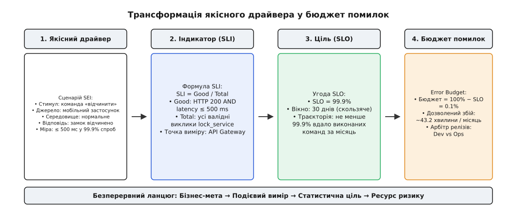
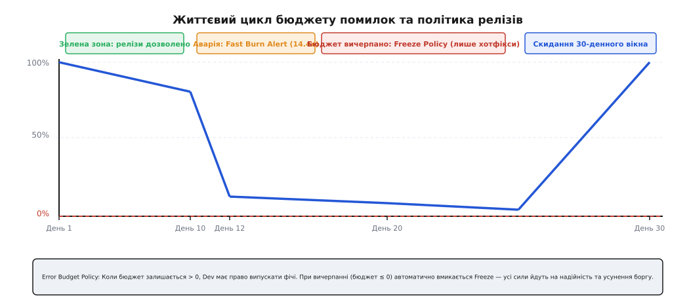
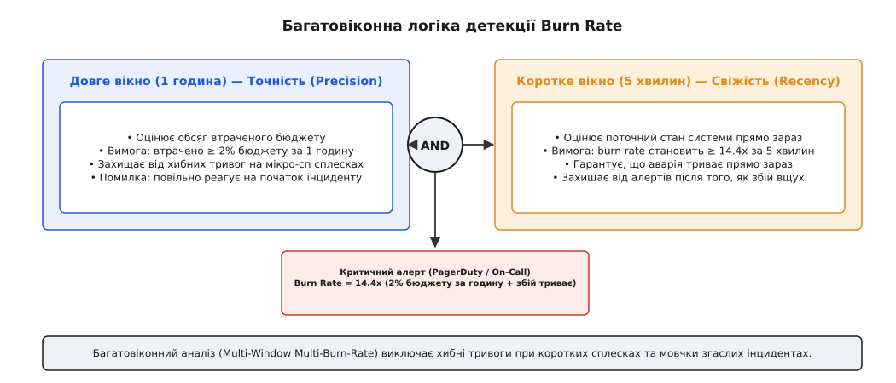

# SLO з якісних атрибутів

<preknowlist>
- [Якісні атрибути й сценарії](root:progarch/attribute-scenarios) — форма сценарію SEI (стимул → середовище → відповідь → міра) для вимірювання якісних вимог.
- [SLI, SLO та бюджети помилок](root:progarch/slo-sli-sla) — фундаментальне розрізнення індикаторів, цілей, угод та математика бюджету помилок.
- [Метрики та перцентилі](root:progarch/metrics-monitoring) — як гістограми й перцентилі (p95/p99) захищають від ілюзії «середнього значення».
</preknowlist>

Команди розробників, операційні інженери та бізнес-стейкхолдери в більшості IT-організацій розмовляють абсолютно різними мовами й керуються протилежними мотивами. Продакт-менеджер наполягає: «користувач повинен миттєво відчиняти двері зі смартфона, а система має бути абсолютно надійною та витримувати будь-який сплеск трафіку». Розробник відповідає: «ми зробимо мікросервісну архітектуру, поставимо асинхронні черги повідомлень у хмарі й налаштуємо автомасштабування у Kubernetes». Операційний інженер прокидається о третій ночі від дзвінка чергової системи, тому що середнє завантаження процесорів у кластері перевищило 85%, хоча користувачі в цей час спали й не зафіксували жодного збою. А коли наступного дня замок у коридорі перестає реагувати через мережевий таймаут у 15 секунд, жоден із серверних моніторів не червоніє, бо CPU, RAM та диск перебувають у «ідеальному зеленому стані».

Це класичний і дуже дорогий дефект відсутності зв'язку між архітектурними драйверами (Quality Drivers) та операційним управлінням системою в продакшені. Невизначені прикметники — «швидко», «надійно», «масштабовано», «беззбійно» — без конкретних числових меж та точок вимірювання є не вимогами, а порожніми деклараціями. Навіть формалізований сценарій якісного атрибута (за стандартом SEI: стимул, джерело, середовище, артефакт, відповідь, міра відповіді), розроблений під час проєктування системи, лишається лише теоретичним наміром, якщо його не переведено у вимірювану технічну ціль, за якою рантайм-система щодня й щохвилини оцінює свій реальний стан.

Справжня спостережність та стійкість виникають тоді, коли якісна вимога бізнесу проходить безперервний конвеєр трансформації: сценарій атрибута якості перетворюється на технічний індикатор рівня сервісу (SLI), індикатор визначає статистичну ціль рівня сервісу (SLO), ціль виділяє керований бюджет помилок (Error Budget), а швидкість спалювання цього бюджету (Burn Rate) безпосередньо управляє автоматичним замком релізів у конвеєрі CI/CD.

## Від якісного драйвера до технічного SLO: три ланки трансформації

Архітектурний драйвер (Quality Driver) описує вимогу з точки зору бізнес-цінності та споживчого досвіду. Для формалізації цієї вимоги в архітектурі програмного забезпечення використовують сценарії атрибутів якості за стандартом SEI (Software Engineering Institute). Сценарій визначає шість елементів: джерело стимулу, сам стимул, середовище, артефакт системи, відповідь системи та міру відповіді.

Наприклад, сценарій для сервісу розумного замка формулюється так: «Господар дому (джерело) надсилає команду відчинення дверей через мобільний застосунок (стимул) під час нормального навантаження хмари (середовище). Шлюз API та сервіс замків (артефакт) обробляють команду й змінюють стан замка (відповідь), причому затримка обробки не перевищує 500 мілісекунд у 99.9% спроб (міра відповіді)».

Однак для системи моніторингу текстове визначення SEI є непридатним: Prometheus чи OpenTelemetry не вміють обчислювати абстрактні сценарії. Потрібна трансформація у три послідовні технічні ланки.

```
Сценарій SEI (Бізнес-вимога)
  ↓
1. SLI (Індикатор): Good Events / Total Events
  ↓
2. SLO (Ціль): SLI ≥ Target % за Вікно W
  ↓
3. Error Budget (Бюджет): 100% − SLO %
```

Перша ланка — **Індикатор рівня сервісу (SLI, Service Level Indicator)**. Це точна математична формула, яка обчислює частку «вдалих» подій (`Good Events`) відносно загальної кількості валідних подій (`Total Events`) за певний часовий інтервал:

```
SLI = (Good Events / Total Events) · 100%
```

Критично важливо, щоб вимір SLI відбувався на самій межі системи, де користувач безпосередньо взаємодіє з продуктом (User-Perceived Boundary). Вимірювати доступність за завантаженням CPU сервера, вільним місцем на диску або за внутрішніми логами баз даних — це фундаментальна пастка. Сервер може мати 10% завантаження CPU, але при цьому скидати 50% запитів через зламаний сокет; або навпаки — процесор може бути завантажений на 95% під час обчислення відео, але всі запити на відкриття дверей відпрацьовують за 50 мілісекунд. Точкою виміру SLI для вебсервісів зазвичай є точки входу на API Gateway або крайні проксі-сервери (Edge Proxies), які бачать підсумковий HTTP-статус та повний час очікування клієнта.

При визначенні валідних подій (`Total Events`) з розрахунку зазвичай виключають помилки на боці клієнта (HTTP 4xx, такі як 400 Bad Request або 401 Unauthorized), адже вони свідчать про некоректний запит застосунку, а не про збій інфраструктури. Помилками вважають всі HTTP 5xx (500 Internal Error, 502 Bad Gateway, 503 Service Unavailable), мережеві таймаути, а також відповіді HTTP 200 OK, чий час виконання перевищив порогову міру з SEI-сценарію (наприклад, > 500 мс).

Технічно обчислення перцентилів латентності на розподіленому трафіку вимагає використання агрегованих гістограм (Histogram Bucket Aggregation) або квантильних скетчів (Quantile Sketches, таких як t-digest або DDSketch). Усереднення латентності (Average Latency) є категорично забороненим: один повільний запит на 30 секунд у сумі з 99 запитами по 10 мілісекунд дає «чудове середнє» у 309 мілісекунд, але 1% ваших користувачів отримав катастрофічний UX.

Друга ланка — **Ціль рівня сервісу (SLO, Service Level Objective)**. Це цільове статистичне значення індикатора SLI разом із скользячим часовим вікном (Compliance Window). Наприклад: «протягом будь-яких 30 днів підряд значення `SLI_lock` має бути не меншим за 99.9%».

У практиці SRE використовують саме скользячі часові вікна (Rolling Windows), наприклад, останні 30 днів або 28 днів (4 повні тижні), а не календарні місяці. Календарні вікна мають небезпечний дефект: 1-го числа кожного місяця бюджет помилок штучно оновлюється до 100%, через що система втрачає пам'ять про катастрофічний збій, який стався 31-го числа минулого місяця.

Третя ланка — **Бюджет помилок (Error Budget)**. Це математичний інвертувальний залишок від SLO:

```
Error Budget = 100% − SLO
```

Якщо SLO становить 99.9%, бюджет помилок дорівнює 0.1%. Це абсолютна кількість невдалих або повільних запитів, яку система має право «помилково виконати» або «затримати» протягом місяця без шкоди для довіри користувачів.



*Шлях від бізнес-вимоги до інструментованого індикатора, цільового SLO та бюджету помилок.*

Трансформація не просто перекладає слова у формули. Вона змінює сутність показника: якісний атрибут із суб'єктивного наміру стає жорстким ресурсом ризику, яким бізнес і розробка розпоряджаються спільно.

## Чому 100% — це неправильна ціль: крива вартості та надійність як ресурс

Найпоширеніша помилка недосвідчених архітекторів та менеджерів — вимога «100% доступності та нуль помилок у системі». Намагання побудувати абсолютну надійність руйнує систему з трьох причин: експоненціальна крива вартості, обмеження клієнтського середовища та параліч інновацій.

По-перше, вартість надійності зростає не лінійно, а експоненціально. Підвищення доступності з 99% (простій 7.3 години на місяць) до 99.9% (простій 43.2 хвилини на місяць) вимагає дублювання вузлів та базового балансування. Перехід від 99.9% до 99.99% (простій 4.3 хвилини на місяць) вимагає мульти-зонного розгортання, мульти-майстер реплікації баз даних із миттєвим кворумом та автоматичного відкату релізів. А спроба досягти 99.999% (простій менше 26 секунд на рік!) вимагає мульти-регіональної актив-актив архітектури, власної мережі доставки контенту (CDN), резервних супутникових каналів зв'язку та автономного керування без участі людини. Вартість розробки та утримання такої інфраструктури зростає у десятки разів, а виторг бізнесу збільшується на дрібні частки відсотка.

```
Доступність (SLO) | Простій на місяць | Архітектурна складність           | Відносна вартість
------------------|-------------------|-----------------------------------|------------------
99.0% (2 дев'ятки) | 7.3 години        | Один сервер + автоматичний рестарт| 1x
99.9% (3 дев'ятки) | 43.2 хвилини      | Кластер, балансувальник, репліка  | 3x–5x
99.99% (4 дев'ятки)| 4.3 хвилини       | Мульти-зони (AZ), auto-failover   | 10x–20x
99.999% (5 дев'яток)| 26 секунд на рік  | Мульти-регіон Active-Active, consensus | 50x–100x
```

По-друге, хмарний сервіс із доступністю 99.999% марно витрачає гроші, якщо кінцевий користувач взаємодіє з ним через мобільну мережу 4G або домашній Wi-Fi роутер, чия надійність рідко перевищує 99.0–99.5%. Якщо зв'язок на смартфоні господаря рветься на 15 хвилин щомісяця через проблеми провайдера, затримка хмарної бази даних на 10 мілісекунд не змінить його життєвого досвіду. Надійність бекенда повинна бути узгоджена з надійністю найслабшої ланки в ланцюгу доставки послуги.

По-третє, ціль у 100% означає, що бюджет помилок дорівнює 0%. Це означає, що у системи **немає жодного права на ризик**. Ви більше не можете випустити жодного оновлення коду, проведення канаркового деплою, міграції схеми бази даних чи оновлення версії мови програмування — адже будь-яка зміна має ненальову ймовірність збою. Прагнення 100% заморожує розвиток продукту і гарантує поразку в конкурентній боротьбі.

Бюджет помилок — це свідомий дозвіл на ризик. Якщо бізнес узгодив SLO 99.9%, це означає, що 0.1% помилок — це **вже оплачений ресурс**, який інженерна команда має використати для випуску нових функцій, експериментів та підвищення швидкості розробки. Невитрачений бюджет помилок наприкінці місяця свідчить не про досконалість, а про те, що команда рухалася занадто повільно і побоялася випускати нові фічі.

## Digital Homes на практиці: три типи SLO для різних драйверів

Наскрізний приклад системи розумного дому Digital Homes (DH) містить різнорідні компоненти, кожен із яких підпорядковується власному архітектурному драйверу. Для ілюстрації розглянемо три сервіси з різними вимогами до доступності, латентності та свіжості даних.

### 1. Сервіс дверних замків (`dh-lock-service`)
- **Архітектурний драйвер**: Безпека та критичність для користувача. Господар підходить до дверей і натискає кнопку в застосунку. Якщо двері відчиняються повільніше за 500 мілісекунд, користувач відчуває роздратування й вважає замок зламаним. Якщо замок не реагує зовсім — людина лишається на вулиці.
- **Сценарій SEI**: Користувач надсилає команду відчинення дверей під час нормальної роботи мережі. Двері змінюють стан протягом ≤ 500 мс у 99.9% випадків.
- **SLI (Індикатор)**: 
  ```
  SLI_lock = (Good_Lock_Requests / Total_Lock_Requests) · 100%
  ```
  де `Good_Lock_Requests` — запити, що повернули статус `HTTP 200 OK` **і** мала тривалість обробки (latency) `≤ 500 ms` на межі API Gateway.
- **SLO (Ціль)**: `SLI_lock ≥ 99.9%` протягом 30 днів.
- **Бюджет помилок**: `0.1%` від загального обсягу запитів (або не більше 43.2 хвилини загального простою на місяць).
- **Специфіка реалізації**: Сервіс замків має локальний fallback-канал у межах домашньої мережі (LAN), який спрацьовує при втраті зв'язку з хмарою. Завдяки цьому SLO хмарного API становить 99.9%, але загальна доступність замка для користувача вдома досягає 99.99%. Якщо зв'язок з інтернетом зникає повністю, мобільний застосунок автоматично перемикається на локальне шифроване з'єднання через Bluetooth Low Energy (BLE) або місцевий Wi-Fi розголос хаба.

### 2. Прийом телеметрії датчиків (`dh-telemetry-ingest`)
- **Архітектурний драйвер**: Пропускна здатність та свіжість потоку даних. Датчики температури, руху та вологості надсилають 50 000 метрик на секунду. Окремий пропущений пакет не є катастрофою, але затримка збереження телеметрії у базу даних більше ніж на 2 секунди ламає сценарії автоматизації (наприклад, увімкнення світла при вході у кімнату).
- **Сценарій SEI**: Сенсори передають потік телеметрії під час пікового навантаження. Подія реєструється у часовому сховищі (Time-Series DB) із затримкою (lag) ≤ 2 секунд у 99.5% випадків.
- **SLI (Індикатор)**: 
  ```
  SLI_telemetry = (Good_Events_Lag_le_2s / Total_Ingested_Events) · 100%
  ```
- **SLO (Ціль)**: `SLI_telemetry ≥ 99.5%` протягом 30 днів.
- **Бюджет помилок**: `0.5%` від загального потоку подій.
- **Специфіка реалізації**: При сплесках навантаження брокер повідомлень (Kafka/RabbitMQ) буферизує телеметрію. Якщо лаг перевищує 2 секунди, подія вважається «повільною» і зменшує SLI, але дані не губляться завдяки гарантіям at-least-once доставки. Дійсно критичні події охорони (виявлення протікання води або диму) передаються окремим високопріоритетним топіком із виділеним пулом консюмерів.

### 3. Ініціалізація Live-відеопотоку (`dh-video-stream`)
- **Архітектурний драйвер**: Інтерактивність та мультимедіа. При дзвінку в двері господар відкриває відеопотік з камери. Час до появи першого кадру (Time To First Frame, TTFF) визначає якість UX.
- **Сценарій SEI**: Запит на перегляд відео з камери через P2P або TURN-реле. Перший кадр відображається не пізніше ніж за 1500 мс у 99.0% випадків.
- **SLI (Індикатор)**:
  ```
  SLI_video = (Streams_TTFF_le_1500ms / Total_Stream_Requests) · 100%
  ```
- **SLO (Ціль)**: `SLI_video ≥ 99.0%` протягом 30 днів.
- **Бюджет помилок**: `1.0%` від усіх спроб відкриття відео.
- **Специфіка реалізації**: При невдалому встановленні прямого P2P-з'єднання через WebRTC застосунок автоматично перемикається на хмарний TURN-сервер. Це додає 300 мс затримки, але зберігає працездатність сесії. Крім того, при деградації мережевого каналу сервіс адаптивно знижує роздільну здатність відео з 1080p до 720p, щоб вкластися у поріг латентності TTFF.

Матриця порівняння трьох сервісів Digital Homes наочно демонструє різницю у вимогах:

```
Сервіс              | Драйвер якості        | Точка виміру (SLI)        | SLO   | Бюджет | Реакція на вичерпання
--------------------|-----------------------|---------------------------|-------|--------|----------------------
dh-lock-service     | Безпека / Латентність | API Gateway (/v1/unlock)   | 99.9% | 0.1%   | Заморозка всіх релізів
dh-telemetry-ingest | Свіжість / Обсяг      | Ingestion Queue Lag       | 99.5% | 0.5%   | Масштабування консюмерів
dh-video-stream     | Інтерактивність UX    | WebRTC Client TTFF        | 99.0% | 1.0%   | Перемикання на TURN
```

Зверніть увагу: кожен сервіс отримав власну ціль (99.9%, 99.5%, 99.0%), виходячи з реальної цінності для користувача та вартості підтримки. Спроба зрівняти їх і поставити 99.99% на відеопотік призвела б до розтрати бюджету на непотрібну інфраструктуру.

> 🔧 **Навіщо це.** Чітко визначені SLO для кожного драйвера припиняють безкінечні суперечки між продакт-менеджерами та інженерами. Замість емоційного «відео працює погано» з'явився числовий факт: «SLO відеопотоку становить 99.2%, ми перебуваємо в межах бюджету, розробка продовжує план».

## Error Budget як арбітр між швидкістю та стабільністю

Головна цінність бюджету помилок полягає в тому, що він є не просто графіком на панелі контролю, а **автоматичним арбітром** між командами розробки (Dev) та експлуатації (Ops).

Без бюджету помилок будь-яка аварія призводить до пошуку винних. Розробники стверджують, що Ops не вміє налаштувати автомасштабування, Ops стверджує, що Dev випустив сирий код.

Коли впроваджено **Політику бюджету помилок (Error Budget Policy)**, правило стає автоматичним та детермінованим:

1. **Поки залишок Бюджету помилок > 0%**: Команда розробки повністю володіє темпом випуску. Вона має право деплоїти нові функції, проводити експерименти, запускати канаркові релізи (Canary Deployments) та змінювати архітектуру.
2. **Якщо Бюджет помилок ≤ 0% (вичерпано повністю)**: Автоматично вмикається **Заморозка релізів (Release Freeze)**. Блокується деплой будь-яких нових продуктових функцій. 100% часу інженерів перенаправляється на завдання надійності: усунення технічного боргу, покриття тестами, покращення спостережності та рефакторинг слабких місць.
3. **Виняток із мораторію**: Єдиний тип змін, який дозволено випускати під час заморозки релізів — це термінові патчі безпеки (Security Hotfixes) та релізи, направлені безпосередньо на стабілізацію SLI й відновлення надійності.
4. **Умови зняття заморозки**: Релізи відновлюються лише тоді, коли скользяче вікно очиститься від аварійних днів і бюджет помилок знову стане більше нуля, або коли випущені виправлення надійності підтвердять стабілізацію SLI у проді.

Для запобігання спробам «протиснути» випуск фічі в обхід політики застосовують інституційний механізм Executive Override. Продакт-менеджер може обійти заморозку релізів тільки за особистим письмовим підписом технічного директора (CTO) або віцепрезидента з інженерії, який у разі аварії бере на себе повну персональну відповідальність перед бізнесом.

Крім того, кожна аварія, яка випалює більше ніж 10% місячного бюджету помилок за один інцидент, вимагає обов'язкового проведення безневинного постмортему (Blameless Postmortem). Головною метою постмортему є виявлення системних причин збою та додавання нових задач на стабілізацію до беклогу розробників. Усі ухвалені рішення записуються у вигляді архітектурних рішень (ADR), щоб запобігти повторенню аналогічного збою у майбутньому.



*Динаміка вигорання бюджету помилок протягом місяця та автоматичне перемикання політики релізів.*

[Детальна історія виникнення Error Budget Policy у Google SRE та протистояння релізійної швидкості та стабільності](root:progarch/observability-and-operations/slo-from-drivers/hist-error-budget-policy.md) розгортає еволюцію цього підходу від перших конфліктів у 2003 році до індустріального стандарту.

## Динаміка спалювання: від константного вигорання до алертів за швидкістю (Burn Rate)

Традиційний підхід до сповіщень (alerting) полягає у встановленні порогу на поточне значення помилок: наприклад, «якщо за останні 5 хвилин частка помилок > 1%, відправити сповіщення».

Цей підхід має дві протилежні вади:

- **Занадто чутливий (False Positives)**: Короткий сплеск помилок тривалістю 30 секунд через перезапуск пода викличе дзвінок черговому інженеру о 3-й ночі, хоча на місячний SLO це майже не вплинуло.
- **Занадто повільний (False Negatives)**: Якщо сервіс почне стабільно відхиляти 0.5% запитів при SLO 99.9% (тобто помилок у 5 разів більше дозволеного), традиційний алерт із порогом 1% не спрацює взагалі. При цьому увесь місячний бюджет помилок згорить повністю за кількома днів, а команда дізнається про це лише наприкінці місяця.

Для вирішення цієї проблеми у сучасній експлуатації використовують **Швидкість спалювання (Burn Rate, `B`)**.

Burn Rate = `1.0` означає, що сервіс витрачає бюджет помилок точно за графіком — тобто за 30 днів згорить рівно 100% бюджету.
Burn Rate = `2.0` означає, що бюджет згорить удвічі швидше — за 15 днів.
Burn Rate = `14.4` означає, що **2% всього місячного бюджету згорає всього за 1 годину**, а весь бюджет буде вичерпано за 50 годин.

Замість реагування на абстрактні сплески, SRE-команди налаштовують алерти на швидкість спалювання:

- **Критичний алерт (PagerDuty, дзвінок черговій зміні)**: `Burn Rate ≥ 14.4` (витрата 2% бюджету за годину). Інженер має втрутитися негайно.
- **Попереджувальний алерт (Ticket у Jira / Slack)**: `Burn Rate ≥ 6.0` (витрата 5% бюджету за 6 годин). Проблема потребує вирішення протягом робочого дня.

Щоб запобігти виникненню «фантомних тривог», коли критичне сповіщення продовжує горіти після того, як збій вщух, застосовують **багатовіконний аналіз (Multi-Window Multi-Burn-Rate)**. Алерт активується лише тоді, коли швидкість вигорання перевищує поріг **одночасно** у довгому вікні (наприклад, 1 година) та у короткому вікні (наприклад, 5 хвилин).

```
Alert_Triggered = (BurnRate(1h) ≥ 14.4) AND (BurnRate(5m) ≥ 14.4)
```

Довге вікно (1 година) гарантує високу точність (Precision): воно підтверджує, що втрата бюджету є вагомою (мінімум 2%). Коротке вікно (5 хвилин) гарантує свіжість (Recency): воно підтверджує, що аварія триває прямо зараз. Якщо збій припинився 2 хвилини тому, коротке вікно швидко падає до нуля, і алерт деактивується (Auto-Resolve) без виклику інженера.

У процесі налаштування Alertmanager також застосовують правила пригнічення сповіщень (Inhibitions). Якщо спрацював критичний алерт базової мережевої доступності дата-центру (P1 Critical), алерти швидкостей спалювання для окремих мікросервісів блокуються, щоб не зашумлювати черговому інженеру екран п'ятдесятьма дубльованими сповіщеннями.



*Багатовіконний аналіз (Multi-Window Multi-Burn-Rate) виключає хибні тривоги при коротких сплесках та мовчки згаслих інцидентах.*

[Повне математичне виведення рівнянь Burn Rate, графіки вичерпання та доведення точності багатовіконних алгоритмів](root:progarch/observability-and-operations/slo-from-drivers/math-burn-rate.md) розбирає алгебру швидкостей спалювання до найдрібніших деталей.

[Практична реалізація інструментування SLI у форматі OpenTelemetry, правила PromQL та код автономного контролера заморозки релізів](root:progarch/observability-and-operations/slo-from-drivers/proj-slo-alerting-rules.md) дає робочі приклади конфігурацій та коду мовами Python і Go.

## Пастки та антипатерни впровадження SLO

При практичному переході від архітектурних драйверів до SLO побудова системи може розбитися об декілька поширених антипатернів.

Перший антипатерн — **Метрики марнославства (Vanity SLIs)**. Команда обирає індикаторами ті параметри, які легко виміряти (завантаження CPU, використання RAM, кількість згенерованих логів), замість тих, які реально відчуває користувач. Сервер із завантаженням CPU 90% може чудово працювати, а сервіс із 5% CPU може повертати помилку HTTP 500 на кожен другий запит. Вимірювати потрібно лише події на межі взаємодії з користувачем.

Другий антипатерн — **Декоративний SLO (SLO without Policy)**. Команда малює гарний SLO 99.99% на панелі Grafana, але при вичерпанні бюджету помилок нічого не відбувається. Розробка продовжує випускати сирі фічі, а Ops продовжує гасити пожежі. SLO без авто-виконуваної політики заморозки релізів — це порожня декларація, яка лише витрачає час на її підтримку.

Третій антипатерн — **Недосяжні «дев'ятки» без підтримки архітектури**. Команда встановлює SLO 99.99% для сервісу, який спирається на зовнішню базу даних із власним SLA 99.5% без локального кешування чи патерну Circuit Breaker. Математично неможливо отримати надійність вищу за надійність єдиної точки відмови у ланцюгу залежностей. Цілі SLO повинні випливати з реальних можливостей архітектури, або змушувати її змінюватися.

Четвертий антипатерн — **Сигнальна втома (Alert Fatigue)**. Налаштування сотень алертів на дрібні флуктуації призводить до того, що інженери перестають реагувати на сповіщення, починають мовчки глушити їх або налаштовувати авто-архівування. Сповіщати людей потрібно тільки тоді, коли швидкість вигорання бюджету загрожує вичерпати ресурс надійності до завершення поточного вікна. Все інше має жити у вигляді тикетів та аналітичних звітів.

П'ятий антипатерн — **Надмірна кількість SLO (SLO Sprawl)**. Спроба описати SLO для кожного з 200 внутрішніх мікросервісів створює операційний хаос. Правильний підхід — визначати SLO лише для ключових шляхів користувача (User Journeys) на зовнішніх межах продукту, а внутрішні сервіси розцінювати як залежності, що забезпечують підсумковий результат.

Шостий антипатерн — **Календарна пастка (Calendar Window Trap)**. Розрахунок SLO за календарний місяць створює небезпечну ілюзію стабільності на початку кожного місяця, коли бюджет помилок мовчки обнуляється після важкої аварії наприкінці попереднього місяця. Тільки скользячі вікна (Rolling 30 days) забезпечують безперервну та чесну оцінку надійності системи.

Слід пам'ятати, що цілі SLO не є вічними константами. Роз у квартал архітектори та продакт-менеджери проводять ревізію SLO (Quarterly SLO Review). Якщо протягом року бюджет помилок не вигорав більше ніж на 5%, це свідчить про те, що ціль занадто слабка, і її варто підвищити, або команда має прискорити випуск нових функцій і брати на себе більше ризику. Навпаки, якщо бюджет вигорає регулярно, а бізнес не готовий інвестувати у переписання архітектури, SLO варто чесно знизити до реалістичного рівня, щоб повернути довіру до моніторингу.

Трансформація якісних атрибутів у SLO та бюджети помилок робить надійність системи не абстрактною обіцянкою, а вимірюваним інженерним параметром з чіткою економічною ціною та прозорим механізмом прийняття рішень.
