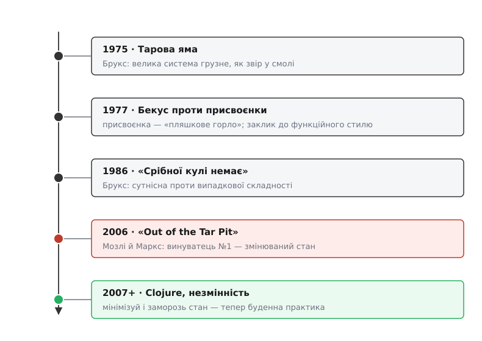

# 📜 Як стан став ворогом номер один

Одну й ту саму думку програмна інженерія відкривала заново щонайменше тричі за півстоліття — і щоразу дивувалася, наче вперше. Думка проста: **найдорожче в програмі коштує не обчислення, а пам'ять про минуле**. Не те, що код рахує, а те, що він між викликами запам'ятовує й тихо носить із собою. Сьогодні «мінімізуй стан, роби незмінним» — майже етикет, який повторюють на рев'ю, не питаючи, звідки він узявся. А народжувався цей висновок болісно: з гучних маніфестів, що здебільшого провалилися як рецепти й перемогли лише як діагнози. Пройдімо цю дорогу — вона повчальніша за будь-яке готове правило.


*Півстоліття однієї суперечки: метафора Брукса дала образ, Бекус — ворога, «Срібної кулі немає» — словник, «Out of the Tar Pit» — вирок, а Clojure переклала все це на щоденну звичку. Зверни увагу на дивну закономірність: гучні ліки (мова FP, система FRP) не прижилися — прижився самий діагноз.*

## Бекус зраджує власне дітище

Почнімо з парадокса. Людина, яка подарувала світові присвоєнку в її найвпливовішому вигляді, у зеніті слави встала й назвала цю присвоєнку в'язницею.

1977 року Тюрингову премію — найвищу відзнаку в інформатиці — дали Джонові Ворнеру Бекусу (John Warner Backus, 1924–2007), американцеві, що двадцятьма роками раніше очолив в IBM команду Фортрана, першої масової високорівневої мови. Фортран — це мова присвоєнок: `X = X + 1`, крок за кроком, одне слово за раз. І ось із трибуни Тюрингової лекції Бекус читає доповідь із назвою-викликом: «Чи можна звільнити програмування від фон-нейманівського стилю?» (надрукована 1978-го в *Communications of the ACM*). Батько імперативного стилю привселюдно від нього відрікається.

Щоб зрозуміти, проти чого він повстав, треба побачити машину його очима. Комп'ютер фон Неймана — це процесор, пам'ять і **тонка трубка** між ними, якою за раз проходить одне слово. Хоч який могутній процесор, уся робота протискається крізь цю трубку. Бекус назвав її **«пляшковим горлом фон Неймана»** (англ. *von Neumann bottleneck*). Але фізичне горло турбувало його менше за **інтелектуальне**: мови, зроблені за образом цієї машини, змушують і думати так само — по одному слову, ганяючи значення туди-сюди комірка за коміркою. А в мові це вузьке горло має точну текстову подобу:

> «The assignment statement is the von Neumann bottleneck of programming languages» — Джон Бекус.

Присвоєнка — ось воно, горло, всередині самої мови. Кожне `=` — це ще один оберт «узяв слово, змінив, поклав назад», ще один шматок пам'яті, що змінився й тепер згинатиме все подальше. Бекус пропонував інший світ: **функційний стиль**, де програма — це алгебра функцій над цілими структурами, без змінних, без присвоєнок, без покрокового смикання пам'яті. Функція комбінується з функцією, як у математиці; питати «яке зараз значення X» просто нема сенсу, бо ніякого мінливого X немає.

Чим це скінчилося — важливо для чесності сюжету. Конкретна мова Бекуса (він назвав її FP) великого поширення не здобула; як практичний інструмент вона радше провалилася. Але лекція зробила інше: вона **підпалила гніт**. Ідея, що присвоєнка — не безневинна дрібниця, а системна вада, пішла гуляти й на десятиліття роздмухала дослідження функційного програмування. Те, що ми сьогодні кличемо [чистою функцією без побічних ефектів](topic:sf-apps/pure-functions-side-effects) — функцією, чия відповідь залежить лише від аргументів, — це і є акуратно сформульована Бекусова мрія. Статус цього сюжету — усталений.

Та Бекус дав ворога **без імені**. Він показав пальцем на присвоєнку, проте не дав дисципліні словника, яким можна відрізнити складність неминучу від складності, яку ми накликали собі самі. Цей словник прийшов з іншого боку.

## Брукс дає імена: сутність і випадковість

За два роки до бекусової лекції, 1975-го, інший інженер IBM дав образ, без якого вся ця історія не має назви. Фредерік Брукс (Frederick P. Brooks Jr., 1931–2022), головний архітектор велетенської System/360 та її операційної системи OS/360, зібрав свій досвід у книжці «Міфічний людино-місяць». Її перший розділ зветься **«Тарова яма»** (англ. *The Tar Pit*). Брукс малює доісторичних звірів, що загрузли в смоляному озері: що дужче велика тварина борсається, то міцніше її тримає смола, і найсильніший мамонт кінець кінцем тоне. Отак, каже він, тоне у власній складності й велика програмна система — не від однієї фатальної помилки, а від тисячі дрібних, кожна з яких сама по собі здоланна. Запам'ятаймо цей образ: за тридцять років він повернеться в назві іншої статті.

Але справжній подарунок Брукс зробив 1986 року доповіддю **«Срібної кулі немає»** (No Silver Bullet), яку виголосив на конференції IFIP у Дубліні, а наступного року передрукував журнал *IEEE Computer*. Тут він розрізав складність надвоє — і цим розрізанням дисципліна користується й досі. Ножа він позичив у Аристотеля: у речі є **сутнісні** властивості — ті, без яких вона перестає бути собою, — і **випадкові** (акцидентні), яких вона просто випадком набула й могла б не мати. Брукс переніс це на софт:

- **Сутнісна складність** (англ. *essential*) — це складність самої задачі. Якщо користувач хоче, щоб система робила тридцять різних речей, то ці тридцять речей нікуди не дінеш — вони закладені в проблему.
- **Випадкова складність** (англ. *accidental*) — це складність, яку ми накинули собі самі: асемблер замість людської мови, пакетна обробка з нічним очікуванням результату, тисяча технічних дрібниць нашого способу будувати.

І далі — песимістичний удар, заради якого доповідь і писалася. За минулі десятиліття, каже Брукс, ми повибивали майже всю **випадкову** складність: з'явилися високорівневі мови, інтерактивність, пристойні середовища. Того, що лишилося, здебільшого **сутнісне** — а отже, жоден один прийом, жодна «срібна куля» вже не дасть десятикратного виграшу, бо різати нема чого. Розробка приречена лишатися важкою.

Ось де зав'язується вузол нашої історії. Брукс дав неоціненний словник — але сам приставив свій ніж не туди, куди треба. Увесь бедлам зі станом, спільною пам'яттю, копіями, що розходяться, він мовчки зарахував до **сутнісного**, до неминучого. Він не побачив того, що майже прямо казав Бекус: величезний шмат цієї «неминучої» складності ми накликали самі, вибравши будувати на змінюваній пам'яті. Треба було взяти бруксів ніж і повернути його вістрям на стан. Це й зробили за двадцять років.

## «Out of the Tar Pit» називає винуватця

2006 року з'явилася стаття двох інженерів-практиків, Бена Мозлі й Пітера Маркса (Ben Moseley, Peter Marks), із назвою, що одразу підморгує Бруксові: **«Out of the Tar Pit»** — «Геть із тарової ями». Той самий образ звіра в смолі, але тепер із обіцянкою вибратися. І вибиратися автори беруться саме бруксовим ножем — сутність проти випадковості, — тільки ставлять його правильно.

Хід їхньої думки такий. Вони погоджуються з поділом Брукса, але **не погоджуються з його вироком**, що решта складності вже майже вся сутнісна. Навпаки, кажуть Мозлі й Маркс: величезна частина того, що видається неминучим, — насправді випадкова, наша власна робота. І вони називають **єдиного найбільшого винуватця** випадкової складності прямо: це **змінюваний стан** (англ. *mutable state*). Друге місце — за **керуванням** (англ. *control*), тобто за тим, у якому порядку все виконується; але корінь — стан.

Чому саме стан, а не щось інше? Аргумент простий і нищівний, і його варто відчути на пальцях. Кожен доданий біт стану **подвоює** число можливих станів системи:

```
1 біт    →  2 можливі стани
2 біти   →  4
10 бітів →  1024
30 бітів →  понад мільярд
n бітів  →  2ⁿ
```

Розум, що намагається неформально простежити, «а що ж робитиме система», мусить утримувати цю хмару можливостей — а вона росте не додаванням, а подвоєнням. Кілька десятків незалежних змінних — і простір станів більший, ніж можна охопити думкою чи перебрати тестами. Ось чому стан такий дорогий: страшний не кожен окремий шматок, а **комбінаторний вибух** їхніх поєднань. Складність тут — не метафора, її можна полічити.


*Той самий загальний обсяг складності, поділений двома поколіннями по-різному. Ліворуч Брукс: майже все сутнісне, різати нема чого, «срібної кулі немає». Праворуч Мозлі й Маркс беруть той-таки поділ і показують — більшість тієї «сутності» насправді випадкова, і найбільша її частка є змінюваний стан. Той самий ніж, повернутий у правильний бік.*

Що ж вони пропонували натомість? Систему під назвою **Functional Relational Programming** (FRP, функційно-реляційне програмування; не плутати з функційно-реактивним). Задум — розкласти систему на три чітко відділені шухляди:

- **Сутнісний стан** — самі незамінні дані, подані не купою змінних об'єктів, а **відношеннями**, як у реляційній моделі баз даних Едгара Кодда: набором таблиць-фактів.
- **Сутнісна логіка** — усе, що можна **вивести** з тих даних: похідні відношення, обмеження-інваріанти, чисті функції. Жодного власного стану, жодного доступу до змінних — сама референційна прозорість.
- **Випадковий стан і керування** — кеші, порядок виконання, оптимізації швидкодії — зіштовхнуті в окремий, ретельно ізольований куток, куди логіка не заглядає.

Мета наскрізна: **звести змінюваний стан до мінімуму, а де можна — прибрати зовсім**, лишивши тонке ядро незамінних фактів і гору чистих функцій над ними.

І тут — та сама доля, що й у Бекуса, і це головна мораль усього сюжету. FRP як конкретну систему майже ніхто так і не збудував у тому вигляді, як її описали; як рецепт вона лишилася кресленням. Перемогла не система, а **діагноз**. Формула «змінюваний стан — головне джерело випадкової складності» виявилася такою чіткою й переконливою, що пішла в народ окремо від ліків, які до неї додавали. Статус цього твердження в дисципліні сьогодні — усталений.

## Від маніфесту до буденної звички

Лишалося перекласти діагноз із мови академічних статей на щоденну звичку інженера. Це зробили здебільшого одна людина й одна мова. 2007 року Річ Гікі (Rich Hickey) випустив Clojure — практичну мову, збудовану просто навколо тези «Out of the Tar Pit», яку Гікі відкрито називав серед своїх джерел. Її стрижень — розчепити три поняття, що їх імперативний код давно злив в одне:

- **значення** (англ. *value*) — незмінний факт: число 42, вчорашній список покупок; воно ніколи не міняється, бо факт про минуле й не може змінитися;
- **ідентичність** (англ. *identity*) — те, що ми звемо «той самий рахунок», хоча його значення з часом стають інші;
- **стан** — це просто значення ідентичності **в конкретну мить**.

Замість «змінити об'єкт» Clojure пропонує «взяти нове значення». А щоб це не коштувало копіювання цілих структур щоразу, під капотом працюють [незмінні (персистентні) структури даних](topic:sf-apps/immutability), що ділять спільну частину між версіями. Серію доповідей Гікі — насамперед «Simple Made Easy» (2011) — розібрали на цитати; саме звідти в лексикон робочого програміста ввійшло розрізнення «просте проти звичного» й настанова не сплітати стан із рештою в один клубок.

Далі діагноз розтікся вже без єдиного автора. Незмінність за замовчуванням із дивацтва перетворилася на норму: об'єкти-значення в доменному дизайні; стан-як-значення у фронтенді (та сама ідея за перемальовуванням інтерфейсу з нового стану замість ручного правлення старого); журнали подій (event sourcing), де правда — це незмінна стрічка фактів, а поточний стан лише **виводиться** з неї; copy-on-write усюди. Згодом той-таки Гікі збудував Datomic — базу даних, де записи не затирають, а лише дописують, тож історія фактів не гине; на практиці це втілило чималий шмат тієї самої FRP-мрії про незмінне ядро й похідні від нього подання. Коло замкнулося: те, що 1977-го звучало як єресь проти самої архітектури комп'ютера, стало банальним пунктом код-рев'ю.

## Той самий ворог, упізнаний нарешті

Відступімо на крок і глянемо на всю дорогу заразом. Тричі за півстоліття різні люди з різних боків показали пальцем на те саме. Бекус побачив ворога в присвоєнці, але не зміг його назвати й запропонував ліки, які не прижилися. Брукс дав точний словник — сутнісне проти випадкового, — та сам не помітив, що стан належить до випадкового. Мозлі й Маркс з'єднали одне з одним: узяли бруксів словник, повернули його вістрям на стан і промовили вирок уголос — а їхні ліки теж лишилися кресленням. І аж коли Гікі та ціле покоління по ньому відкинули великі рецепти й лишили саму скромну звичку — **менше стану, а що лишилось — заморозь** — діагноз нарешті переміг у практиці.

Ось чому варто знати цю історію, а не тільки правило з неї. Настанова тримати стан на короткому повідку — не чиясь примха й не мода фреймворка; це найкоротший підсумок п'ятдесятилітньої боротьби зі смолою, у якій потонуло чимало могутніх систем. Дивна річ: правильний діагноз ставили тричі, з проміжком у покоління, — і щоразу дисципліна мусила вчитися його заново, бо гучні ліки затуляли тиху правду. Коли наступного разу хтось на рев'ю відмахнеться від зайвого глобального поля як від дрібниці, ти знатимеш, що за цією «дрібницею» стоїть піввіку однієї впертої суперечки — і чому вона нарешті скінчилася на боці тих, хто стану боїться.
