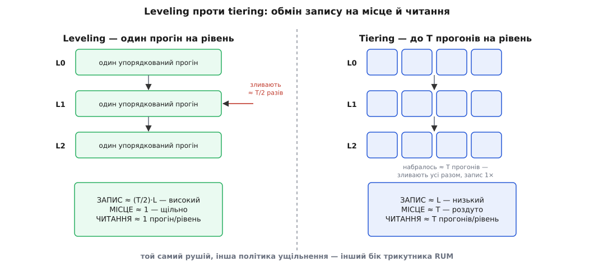
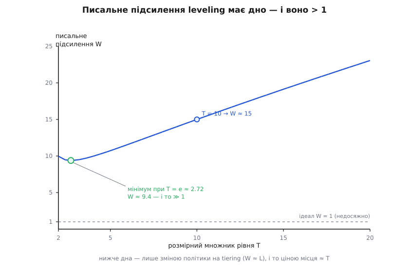

# 🧮 Гіпотеза RUM: чому одна структура не буває дешевою в усіх трьох підсиленнях

У кроці ми назвали три ціни сховища — читацьке, писальне й просторове підсилення — і кинули різку тезу: притиснеш два, третє неминуче підскочить. Звучить як прикмета, емпіричне спостереження бувалого інженера. Тут ми покажемо, що це **закон конструкції**, а не збіг реалізацій: дамо формальні означення трьох підсилень, на простій моделі побачимо, чому центр трикутника фізично порожній, а наприкінці порахуємо найгостріший із трьох обмінів — той, що ущільнення LSM робить буквально ручкою налаштування.

Ідею вперше зібрали в одне ім'я 2016 року: Манос Атанассуліс (Manos Athanassoulis) із співавторами у праці [«Designing Access Methods: The RUM Conjecture» (EDBT 2016)](https://dblp.uni-trier.de/rec/html/conf/edbt/AthanassoulisKM16). Серед семи авторів — не лише академіки (Атанассуліс, Стратос Ідреос, Анастасія Айламакі), а й **Марк Каллаган (Mark Callaghan)**, інженер, який вів **MyRocks** — LSM-рушій RocksDB під MySQL у Facebook. Деталь важлива: гіпотезу писали не тільки теоретики, а й той, хто на живому навантаженні соцмережі щодня впирався в ці самі три стіни. Назва — акронім: **R**ead, **U**pdate, **M**emory. *(Статус: усталено, багато цитована праця. Сама назва чесно каже «conjecture» — гіпотеза, проєктний принцип, а не доведена теорема; про межі доведеного — наприкінці.)*

## Означення: три підсилення як «реальне поділити на потрібне»

Почнімо строго, бо вся сила гіпотези — у тому, що всі три ціни міряються **однією міркою**. Візьми будь-яку операцію й спитай: скільки роботи вона зробила понад той абсолютний мінімум, без якого відповісти було б неможливо? Це «понад мінімум» і є підсилення. Формально — відношення, і завжди ≥ 1:

```
                       реально зачеплено
підсилення   =   ─────────────────────────────
                  логічний мінімум (корисне)

RO  (read)    =  прочитаних байтів   /  байтів, які насправді потрібні
UO  (update)  =  записаних байтів    /  байтів самого оновлення
MO  (memory)  =  зайнятих байтів     /  байтів живих (корисних) даних
```

Ідеал кожного — рівно **1**: прочитав точно те, що треба; записав рівно стільки, скільки змінив; зайняв рівно стільки місця, скільки важать дані. Реальність — завжди більше одиниці. **UO — це те саме [писальне підсилення](topic:algorithms/write-amplification)**, яке ми вже рахували на потоці телеметрії; RUM лише ставить його поряд із двома братами й міряє їх усіх тією ж лінійкою — «у скільки разів більше за необхідне».

Одразу вловімо, чого ця мірка **не** бачить, — бо тут причаїлася пастка. RUM рахує **кількості**: байти прочитані, байти записані, байти зайняті. Вона **не** розрізняє, лягли ці байти на диск послідовно чи врозкид. А ми в самому кроці бачили, що для пристрою це різниця в порядки. Отже, «LSM дешевший на запис» — це насправді **два різні виграші**: по-перше, менший UO (менше байтів на корисний запис), по-друге, послідовність цих байтів (бонус фізики носія, поза трикутником RUM). Тримаймо їх нарізно: трикутник — про обсяги роботи, а не про візерунок доступу. Плутати їх — типова помилка суперечок «B-дерево проти LSM».

## Інтуїція: роботу пошуку не можна знищити, лише перекласти

Тепер — чому центр трикутника порожній. Найглибша відповідь на диво проста: **щоб дані було де і як знайти, хтось мусить виконати роботу впорядкування — і цю роботу можна перекласти з одного плеча на інше, але не викинути.** Плечей рівно три: читач, писар, місце. Хто саме заплатить — вибір конструкції; що хтось заплатить — неминучість. Це той самий тип міркування, що й закон збереження у фізиці: величина не зникає, вона лише міняє форму.

Побачмо це на трьох «чистих» стратегіях, кожна з яких доводить одне підсилення до ідеалу — і одразу губить решту.

**Тримати все впорядкованим (як B-дерево).** Дані лежать відсортовані, тож читання — один короткий шлях згори вниз: RO ≈ 1, і то однаково для точки й для діапазону. Але порядок треба **підтримувати**: кожна вставка мусить сісти на своє місце, а це переписування сторінки — UO злітає. Ще й дерево тримає індексні вузли й недозаповнені сторінки — MO повзе вгору. Дешеве читання **оплачене** записом і місцем.

**Тільки дописувати в кінець (чистий журнал).** Запис ідеальний: додав рядок у хвіст, UO ≈ 1, нічого не шукав, нічого не переписав. Але дані лежать **без порядку**, тож читання мусить перебрати весь журнал: RO росте до O(N) — катастрофа. Дешевий запис **оплачений** читанням.

**Тримати одну щільну копію без надлишку.** Жодних дублів, індексів, порожнин — MO ≈ 1. Але тоді будь-яка зміна мусить переписати це щільне подання на місці (UO вгору), а читання без допоміжних структур знову длубається довше (RO вгору). Дешеве місце **оплачене** записом і читанням.

Помітили візерунок? Щоразу, коли одне підсилення падає до 1, воно **перекладає** свою роботу на два інші. Це не невдача інженерів, які «не дотягли», — це закон збереження роботи: сумарну роботу «зробити дані знаходжуваними» не спалиш, її можна лише пересунути по трикутнику. Ось чому [LSM-дерево](topic:algorithms/lsm-tree) — не «магічно кращий» варіант B-дерева, а той самий трикутник, обійдений з іншого кута: воно жертвує читанням (кілька прогонів замість одного) заради дешевого запису, а тоді дрібними хитрощами (фільтр Блума на кожен файл — крихітна ймовірнісна табличка, що дешево каже «цього ключа тут точно нема») відкуповує частину втраченого RO ціною дрібки MO. Пересування, не знищення — раз у раз.

## Формальний апарат: модель, де видно «два притиснув — третій виріс»

Зробімо інтуїцію рахунковою. Припишемо кожній знайомій структурі її трійку (RO, UO, MO). Не претендуючи на точні константи — вони залежать від тисячі деталей, — ми хочемо побачити **напрямок**: як рух до одного кута штовхає інші два. Ось чотири структури, розкладені по осях:

```
структура          RO (читання)         UO (запис)          MO (місце)
────────────────────────────────────────────────────────────────────────
B-дерево           ≈ 1  (точка й         ≈ сторінка/рядок     ≈ 1.4  (сторінки
(на місці)          діапазон: порядок)    ~ 80×  (врозкид)      в сер. ~⅔ повні)

LSM-leveling       ≈ L прогонів          ≈ (T/2)·L            ≈ 1  (щільно, один
                    (Блум ріже точку)     ~ 12–15×             прогін на рівень)

LSM-tiering        ≈ T·L прогонів        ≈ L                  ≈ T  (до T прогонів
                    (багато місць)        ~ 3–4×  (найменший)   співіснують)

геш-індекс         ≈ 1 на ТОЧЦІ,         ≈ 1  (амортизовано)  > 1  (коеф. заповнення
                    O(N) на діапазоні     + рехеш при рості     + вказівники)
────────────────────────────────────────────────────────────────────────
```

Прочитаймо таблицю як карту трикутника. **B-дерево** сидить у куті читання: RO ≈ 1, і платить за це найбільшим UO серед усіх. **Геш-індекс** теж тулиться до кута читання, але лише на **точковому** пошуку (O(1) за ключем) — щойно потрібен діапазон, порядку немає, і RO злітає до повного перебору; тому на трикутнику він стоїть біля кута R **однією ногою**, а другою висить у прірві, коли запит стає діапазонним. **LSM-tiering** — справжній кут запису: UO найменший з усіх (≈ L), але за це платить одразу двома сусідами — і місцем (≈ T копій-прогонів разом), і читанням (≈ T·L місць перевірити). А **LSM-leveling** цікавіший за всіх: він **не** в куті, а посеред ребра — навмисне зсунутий від чистого запису назад, щоб купити низький MO й пристойний RO. Чим оплачений цей зсув — зараз і порахуємо; саме він найяскравіше показує гіпотезу в дії.

## Найгостріший обмін: писальне підсилення ущільнення

LSM пише дешево на пристрій (усе послідовно), але **алгоритмічно** переписує ті самі дані багато разів, зливаючи рівні, — це і є його UO. Величина цього UO — не константа рушія, а **наслідок політики ущільнення**, і тут ховається ручка, якою інженер їздить по трикутнику. Виведімо її від початку.

Нехай memtable (буфер у пам'яті) має розмір B, а весь набір даних — N. Рівні LSM ростуть геометрично: кожен наступний у **T разів** більший за попередній (T — розмірний множник рівня, англ. *size ratio*; типово 10). Скільки рівнів? Стільки, щоб від B дорости до N множенням на T:

```
T^L ≈ N / B      ⇒      L = log_T (N / B)
```

Тепер — два способи зливати, і в самій їхній різниці сидить обмін.

**Leveling: один упорядкований прогін на рівень.** Кожен рівень тримає рівно **один** відсортований прогін даних. Щоб влити в рівень i вміст рівня i−1, доводиться переписати рівень i цілком — а оскільки рівень i у T разів більший, за час його наповнення таких вливань стається близько T, і щоразу переписується те, що вже там лежало. Усереднено (рівень наполовину повний) кожен байт на рівні i переписується ≈ T/2 разів, **поки живе на цьому рівні**; а пройти йому треба всі L рівнів:

```
UO_leveling  ≈  (T/2) · L        (+ скидання memtable ≈ 1, + WAL ≈ 1)
```

**Tiering: до T прогонів на рівень.** Тут рівень **не** переписують на кожне вливання — новий прогін просто **лягає поряд**, і рівень накопичує до T окремих прогонів. Аж коли їх набралося T, усі зливають **разом**, одним махом, і кладуть готовий прогін на рівень нижче. Отже, кожен байт записується на рівні лише **раз** (коли туди прибув), а не T/2 разів:

```
UO_tiering  ≈  L
```

Ось воно, ядро обміну — акуратно доведене в наступних працях тієї ж школи (Ніва Даяна, Атанассуліса й Ідреоса: Monkey, SIGMOD 2017, та [Dostoevsky, SIGMOD 2018](https://nivdayan.github.io/dostoevsky.pdf)): **leveling читає в ≈ T разів менше за tiering — один прогін на рівень проти T, — а платить за це дзеркально, записом.** Читацький бік тут точний: один прогін на рівень — це одне місце перевірити (RO ≈ L) і жодних дублів (MO ≈ 1); до T прогонів на рівень — це до T місць перевірити (RO ≈ T·L) і до T копій, що співіснують (MO ≈ T). А зайва робота запису — це та сама різниця «переписати рівень проти покласти прогін поряд»: у чистій моделі множник T на кожен рівень (тому й кажуть «leveling пише в ≈ T разів більше»), усереднено — половина того, (T/2)·L. Один рушій, дві політики — і ти на протилежних боках ребра U–(R, M) трикутника.


*Той самий LSM, дві політики ущільнення. Leveling тримає один прогін на рівень — щільно (місце ≈ 1) і мало місць для читання (≈ 1 прогін/рівень), але кожен рівень переписується ≈ T/2 разів, тож запис ≈ (T/2)·L. Tiering дає прогонам громадитися до T штук і зливає їх разом лише раз — запис дешевий (≈ L), зате місце роздуте (≈ T) і читання перевіряє до T прогонів на рівень. Ручка leveling↔tiering возить рушій по ребру трикутника між кутом запису й кутами читання-місця.*

**Порахуймо на потоці телеметрії DH.** Візьмемо T = 10 і набір, що переростає memtable у 1000 разів:

```
Дано:      T = 10,   N/B = 1000
Рівнів:    L = log₁₀ 1000 = 3

Leveling:  UO ≈ (T/2)·L = (10/2)·3 = 15    (модель; на практиці ~10–15,
                                            як зміряні ≈12 у кроці)
Tiering:   UO ≈ L = 3–4
Місце:     leveling MO ≈ 1     ·     tiering MO ≈ T = 10   (десятикратне роздуття!)
```

Той самий потік: leveling кладе на диск ≈ 15× корисного обсягу, tiering — лише ≈ 4×, майже вчетверо ощадливіше на запис. Але за це tiering роздуває сховище **вдесятеро** й змушує кожне читання зазирати в до десяти прогонів на рівень. Хочеш ще менший запис — бери tiering і плати місцем та читанням; хочеш щільно й швидко читати — бери leveling і плати записом. Дірки «і те, і те» немає — рівно як обіцяла гіпотеза.

І ще один поворот, суто математичний, але красивий. У формулі UO_leveling ≈ (T/2)·L підставмо L = log_T(N/B) = ln(N/B)/ln T:

```
UO_leveling(T)  ≈  (T/2) · ln(N/B) / ln T  =  const · T / ln T
```

Функція T/ln T має **мінімум**. Похідна (ln T − 1)/(ln T)² обертається на нуль при ln T = 1, тобто при **T = e ≈ 2.72**. Отже, є оптимальний розмірний множник, що мінімізує писальне підсилення leveling, і він близький до e (на практиці беруть трохи більший T заради інших міркувань — менше рівнів, простіша структура). Але та сама формула показує нещадне: навіть **у мінімумі** UO лишається помітно більшим за 1 — для N/B = 1000 це близько 9–10. **Тюнінгом T писальне підсилення leveling до одиниці не дотиснеш** — дно є, і воно високо над ідеалом. Щоб опуститися нижче цього дна, треба **змінити саму політику** на tiering (UO ≈ L, ще менше) — а це, як ми щойно бачили, миттю коштує місцем (MO ≈ T) і читанням (RO ≈ T·L). Дно одного підсилення впирається у стелю двох інших. Гіпотеза RUM, побачена в одній формулі.


*Писальне підсилення leveling як функція розмірного множника T (для N/B = 1000). Крива T/ln T має дно при T = e ≈ 2.72 — оптимальний множник, що мінімізує запис. Але навіть у мінімумі підсилення ≈ 9–10, далеко над ідеалом W = 1: самим лише T до одиниці не дотиснути. Нижче дна — тільки зміною політики на tiering (запис ≈ L), і то ціною місця ≈ T. Дно одного підсилення впирається у стелю двох інших.*

> 🔧 **Навіщо це.** Ця арифметика перетворює вибір рушія з питання смаку на розрахунок. Коли під телеметрію DH ти береш LSM, ти вже знаєш, що дальша ручка — **політика ущільнення**, і знаєш, чим саме крутиш: зсунеш до tiering — виграєш запис (важливо, коли впирається саме він), програєш місце й хвіст читання; лишишся на leveling — заплатиш записом, зате матимеш щільне сховище й рівні читання. Обидва варіанти RocksDB уміє; вибір — це вибір **кута трикутника** під твій профіль, а не пошук «правильного» налаштування, якого немає. І коли SSD зношується від записів, знання, що tiering ділить UO на ≈ T, — це прямо продовжений ресурс диска.

## Де в темі це працює: трикутник як компас вибору

Повернімося до рішення кроку. Профіль роботи — це вказівка, **у який кут трикутника** тобі треба, а гіпотеза RUM гарантує, що інші два кути ти цим самим віддаєш. Реєстр і конфіг DH тиснуть точковим читанням, яке має бачити свіже, — це кут R, і туди чисто лягає B-дерево (низький RO ціною UO, що на скромному обсязі не болить). Телеметрія тисне записом — це бік U, туди лягає LSM; а **всередині** LSM тонша ручка leveling↔tiering доводить вибір під те, чого бракує найдужче: щільного місця на диску (leveling) чи витривалості до запису (tiering).

Найважливіше, що дає гіпотеза, — вона **звільняє від пошуку неможливого**. Ніхто більше не марнує місяці на «структуру, що виграє скрізь»: RUM каже, що її нема, і показує, де натомість пролягають чесні межі. Тому це не вирок, а **компас**: назви, яке підсилення тобі найдорожче, — і трикутник одразу покаже, за що ти заплатиш, зробивши його дешевим. Саме так грамотний інженер читає бенчмарк — не «хто швидший», а «в який кут його загнали й що він за це віддав».

Останнє — про статус самого твердження, чесно. «RUM Conjecture» зветься гіпотезою не зі скромності: загального доведення, що для **будь-якої** структури сума чи добуток трьох підсилень обмежені знизу, немає — це радше **проєктний принцип**, підпертий інтуїцією збереження й горою прикладів. Але для конкретних підпросторів межі вже **доведені** строго: та сама школа у працях Monkey і Dostoevsky вивела точні компроміси читання/запису/місця для сімейства LSM і показала, як налаштуванням фільтрів Блума й політики ущільнення пройти саме **по** оптимальній межі, а не всередині неї. Тобто інтуїтивний трикутник із цього кроку має під собою й тверду математику — там, де хтось завдав собі труду її вивести.
