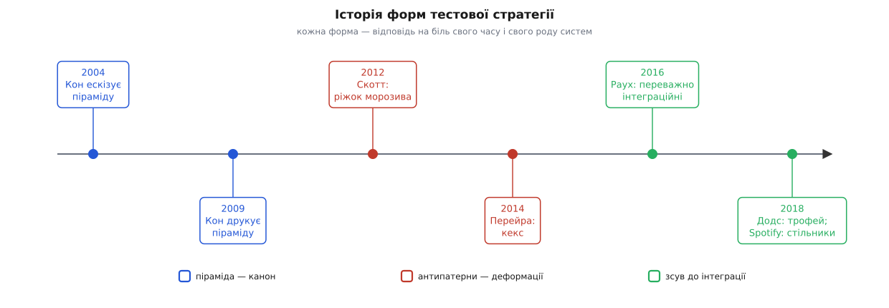
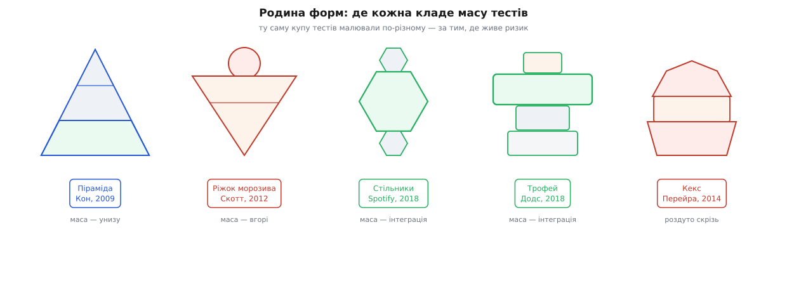

# 📜 Форми, які весь час перемальовували

Форма — це суперечка, стиснута в силует. Одним поглядом на трикутник видно ціле твердження: стільки тестів отут, стільки — там. Тому й дивно, що за неповних п'ятнадцять років ту саму просту картинку — скільки тестів якого рівня тримати — індустрія стирала й малювала наново разів п'ять. Не тому, що попередники помилялися. А тому, що кожна форма чесно вловлювала правду про **певний рід систем**, а коли системи мінялися, стара картинка переставала лягати — і хтось брав олівець. Історія цих перемальовувань варта не того, щоб завчити «переможну» форму, а того, щоб побачити просту річ: **форма йде слідом за тим, де живе ризик, а не за модою.** Пройдімо її по порядку — з датами, іменами й тим болем, що щоразу штовхав руку.


*Синім — канонічна піраміда, червоним — антипатерни (форма псується сама), зеленим — свідомий зсув маси до інтеграції. Кожна віха — відповідь на біль свого часу.*

## Піраміда: рахунок, який виписали інструменти запису-відтворення

На початку 2000-х автоматизувати тест здебільшого означало **записати** свої кліки крізь екран і потім **відтворювати** їх — інструментами на кшталт WinRunner чи QuickTest Professional. Спокуса очевидна: не пишеш коду, просто клацаєш сценарій, і він «сам себе тестує». А розплата приходила пізніше: варто дизайнерові посунути кнопку — і десятки записаних сценаріїв червоніють разом, бо чіплялися за координати й підписи, а не за поведінку. Набір таких тестів переставав бути страховкою й ставав податком: більшість часу команда не ловила помилки, а латала власні ж крихкі записи.

Майк Кон (Mike Cohn), одна з чільних постатей раннього agile, намалював трикутник, щоб сказати проти цієї спокуси одну річ: **масу автоматизації клади вниз** — туди, де тест дешевий і стабільний, бо чіпляється за код напряму, — а крихкі перевірки крізь екран лиши тонкою смужкою вгорі. За переказом самого Кона й Лізи Кріспін (Lisa Crispin), він накидав цю піраміду в розмові з нею близько 2003–4 років і показував на зустрічі скрам-спільноти 2004-го; у друк вона потрапила в його книжці «Succeeding with Agile» (2009), де він назвав її **пірамідою автоматизації тестів** (Test Automation Pyramid) і поділив на три яруси — Unit, Service, UI. Дата книжки задокументована; ранній ескіз тримається на спогадах учасників — це переказ, не документ.

Придивись до назви середнього ярусу. У Кона він — **Service**, «сервісний», а не «інтеграційний». Ця дрібниця аукнеться: наступне десятиліття люди плутатимуться, бо словом обростала форма, а не поняття. І ще одна прикмета того, що піраміда не була примхою одного гуру: Джейсон Гаґґінс (Jason Huggins), творець Selenium, за поширеним переказом дійшов тієї самої картинки незалежно, десь 2006-го. Коли двоє нарізно малюють однакове, це зазвичай означає, що форма — не чиясь думка, а **спільна відповідь на спільний біль.**

Чому взагалі трикутник, а не стовпчик рівних ярусів? Бо піраміда просто виносить назовні той торг, що його робить кожен рівень: унизу — дешево, стабільно, точно вказує на винуватця; угорі — дорого, крихко, довго шукати причину. Форма — це графік ціни певності. Мартін Фаулер (Martin Fowler) закріпив термін у 2012-му статтею «Test Pyramid» у своєму блозі, і саме звідти «піраміда» розійшлася галуззю як спільне слово. А ще за шість років Гем Вокке (Ham Vocke) написав на сайті Фаулера «The Practical Test Pyramid» (2018) — значною мірою для того, щоб **розплутати назви**: те, що Кон звав «service», уже майже всі звали «integration», і потрібно було звести це докупи. Показово: форму лишили ту саму, а перемальовувати взялися вже **підписи** до неї.

## Ріжок морозива: та сама піраміда, поставлена на голову

Першу справжню перемальовку зробив не теоретик, а діагност. Алістер Скотт (Alister Scott), тестувальник, 31 січня 2012 року в своєму блозі WatirMelon виклав допис «Introducing the Software Testing Ice-Cream Cone» — і це була не нова рекомендація, а **діагноз**. Він назвав форму, у яку команди сповзають самі собою, коли про стратегію тестів ніхто не думав: угорі роздута маса ручних і автоматизованих UI-перевірок, а внизу, у вістрі, — кілька самотніх модульних. Піраміда, поставлена на голову. Зверху — кулька морозива: ручне тестування.

Жарт тут несе точну економіку. Ріжок морозива тане згори, і танення стікає донизу: крихкі UI-тести вимагають стільки догляду, що їхнє обслуговування заливає всю решту роботи. Але головне для нашої нитки інше. Ріжок — **не суперник** піраміди й не окрема теорія. Це її тінь: форма, у яку тебе стягує тяжіння, коли ти тестуєш систему єдиним способом «поклацати очима». Тобто перша перемальовка була не новою ідеєю, а тим, що галузь нарешті назвала на ім'я **власний типовий провал** — і вже цим зробила його видимим.

## Кекс: коли форму ліплять три різні команди

Фабіо Перейра (Fabio Pereira) з Thoughtworks 11 червня 2014 року дав цій родині ще одну фігуру — «Software Testing Cupcake», кекс. Він прямо спирався на ріжок Скотта, але показав деформацію тоншу й підступнішу: набрякання **на кожному ярусі одночасно**. Звідки воно? Не з ліні й не з незнання, а з **устрою команд**. Розробники пишуть свої модульні й компонентні тести. Окрема команда автоматизації перевіряє те саме заново — чорною скринькою крізь графічний інтерфейс. А ручні тестувальники ще раз проганяють ті самі сценарії руками. Кожен ярус недовірливо передубльовує той, що під ним, бо його писала інша команда, якій він не довіряє.

Форма тут — симптом **не тестової філософії, а організаційної схеми**: закон Конвея дотягнувся до тестового набору, і структура команд віддрукувалася у структурі тестів. Це справжнє поглиблення історії. Форму можна зіпсувати не лише недбальством (ріжок), а й межами між командами (кекс) — і тоді ліки «пишіть більше юнітів» не працюють. Лікувати треба не яруси, а **шви між людьми**: щоб команди довіряли перевіркам сусіда й не тестували те саме втретє.

## «Пишіть тести. Не забагато. Переважно інтеграційні.»

Наступну перемальовку почав один рядок. 10 грудня 2016 року Ґільєрмо Раух (Guillermo Rauch) — творець socket.io, засновник компанії за Next.js (нинішній Vercel) — кинув у твіттер шестислівний маніфест: «Write tests. Not too many. Mostly integration.» (Пишіть тести. Не забагато. Переважно інтеграційні.) Контекст — фронтенд і світ JavaScript, де «модульний тест» на той час часто означав перевірку одного компонента в **цілковитій ізоляції**, з підробленими всіма сусідами. І виходив парадокс: стіна зелених модульних тестів — а застосунок зламаний, бо помилки жили саме в **проводці між** компонентами, рівно там, куди ізолювальні дублери й підмальовували жадану зелень.

> 🔧 **Навіщо це.** Дублер завжди вкладає в тест твоє припущення про сусіда й слухняно його підтверджує; коли в малому колі ти замінив ним кожного сусіда, ти перевіряєш уже не поведінку, а власні очікування. Саме тому лавина ізольованих юнітів у фронтенді давала оманливу певність — і саме тому Раухів заклик зсунути масу до інтеграції був не примхою, а спробою поставити коло тесту туди, де насправді ламалося. Механіку того, чому й скільки підробляти, курс розбирає окремо — [коли ставити дублери](root:progarch/test-doubles-when).

Кент Додс (Kent C. Dodds), автор Testing Library, перетворив цей твіт на картинку 2018 року — **трофей** (Testing Trophy). Знизу вгору: **статичний** ярус, якого в піраміди не було зовсім (типи й лінтери — ESLint, TypeScript чи Flow); над ним модульні; далі товстий пояс **інтеграційних** — чаша трофея; і тонка вершина наскрізних. Переставлення тут подвійне. По-перше, Додс міряє яруси не швидкістю, а **певністю на вкладену копійку**: інтеграційний тест дорожчий за модульний, але дає стільки впевненості, що окупається. По-друге — і це тонше — у мові з динамічною типізацією цілий клас помилок (описки, не та форма даних) найдешевше ловиться навіть не тестом, а компілятором чи лінтером, тож статичний аналіз стає **повноправним найнижчим ярусом**. Це не спростування піраміди. Це та сама логіка «клади масу туди, де дешево ловиться ризик», застосована до **іншої** системи: застосунку, зшитого з чужих бібліотек і тонкого власного клею, де ризик живе у швах і в неправильних типах, а не в глибокій власній логіці з розгалуженнями.

## Стільники Spotify: «integration» — це не «integrated»

Майже водночас із трофеєм, у січні 2018 року, Андре Шаффер (André Schaffer) в інженерному блозі Spotify описав форму для ще іншої системи — **стільники** (honeycomb), у статті «Testing of Microservices». Реальність мікросервісів така: найважче не всередині окремого сервісу, а в тому, **як він розмовляє** з іншими. Звідси форма: широкий пояс інтеграційних тестів (сервіс перевіряють ізольовано, а його співрозмовників підробляють рівно на межі), кілька тестів деталей реалізації (по суті — модульних) і, найголовніше, — якнайближче до **нуля** «інтегрованих» тестів.

Ця відмінність на одну літеру — **integration** проти **integrated** — тут несуча, і вона старша за стільники. Дж. Б. Рейнсберґер (J.B. Rainsberger) на конференції Agile 2009 у доповіді, спершу названій «Integration Tests Are A Scam» (згодом він загострив назву до «Integrated Tests Are A Scam»), довів річ невеселу: **інтегрований** тест — той, чий вислід залежить від правильності більш ніж одного нетривіального шматка, зведеного докупи по-справжньому, — росте комбінаторно й через це **ніколи** не покриє систему як слід. Порахуймо на пальцях, чому:

```
Три сервіси на шляху, у кожного 4 суттєві гілки поведінки.
«Інтегрований» тест мусив би перебрати комбінації всіх трьох:

    4 · 4 · 4 = 64 шляхи

Ланцюг із п'яти таких сервісів — уже:

    4⁵ = 1024 шляхи

А контрактом кожен сервіс покривають ОКРЕМО, з двох боків межі:

    4 + 4 + 4 + 4 + 4 = 20 перевірок   ← сума, а не добуток
```

Ось і вся арифметика скаму: намагаєшся вкрити систему **добутком** — тонеш; вкриваєш **сумою** незалежних контрактів — випливаєш. Рейнсберґерові ліки так і звучали: замість інтегрованих тестів — **контрактні** (кожен бік межі окремо) плюс тести взаємодії. А стільники Spotify — це буквально той рецепт, накреслений як стратегія для мікросервісів: масу — в інтеграцію на межах, «інтегроване» звести до нуля. Що саме означає перевіряти межу з обох боків окремо й чому це масштабується сумою, курс розкриває поіменно в [контрактних тестах](root:sf-release/contract-testing): кожен сервіс тримають за його обіцянку на межі, а не за всіх сусідів разом.

## Що ці перемальовування насправді кажуть

Виклади всі п'ять форм в один ряд — і видно, що це не мода, яка ходить по колу. Кожна форма — **відбиток панівного ризику своєї системи**, а ризик пересувався, бо пересувалися самі системи.


*Одну й ту саму купу тестів малювали по-різному — за тим, де в цьому роді систем найгустіше живе ризик на копійку витрат.*

- **Піраміда** — моноліт, повний власної логіки з розгалуженнями, який тестували крихкими інструментами запису-відтворення: масу клади вниз.
- **Трофей** — застосунок, зібраний із бібліотек і тонкого клею в мові з динамічними типами: масу — в інтеграцію, а під низ підклади статичний ярус, бо там дешево гине цілий клас помилок.
- **Стільники** — мережа мікросервісів: ризик у швах між ними, тож інтеграції багато, а «інтегрованого» — нуль.
- **Ріжок морозива** та **кекс** — узагалі не теорії: перший — форма недбальства, другий — форма роз'єднаних команд.

Під усіма перемальовками лежить один незмінний закон: **клади масу тестів туди, де ризик на одиницю витрат найгустіший.** Місце це рухалося не тому, що попередня форма була дурна, а тому, що рухалися самі системи — від моноліту до компонентного фронтенду й далі до мікросервісів. Тому чесне питання ніколи не звучить «піраміда чи трофей?». Воно звучить: **як влаштована саме моя система — і де в ній живе ризик?**

І звідси остання думка, задля якої варто було проходити цю історію. П'ять форм — це п'ять **замальовок**, кожна правдива для свого роду систем свого часу. Коли форма на стіні не лягає на твою систему, це не єресь і не привід затято боронити трикутник. Це знак, що картинка зробила свою єдину справжню роботу — змусила тебе поглянути на власну систему й, якщо треба, знову взяти олівець.
