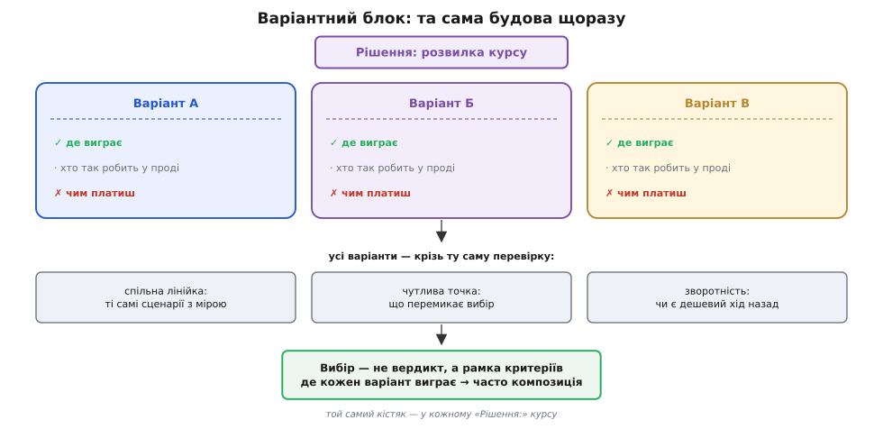
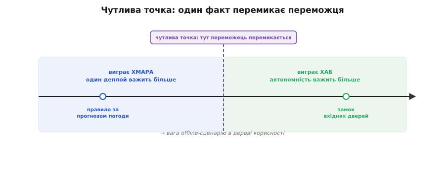

# Анатомія варіантного блоку

<preknowlist>
- [Зворотні й незворотні рішення](topic:sf-apps/reversible-irreversible-decisions) — ціна відкату рішення: однобічні двері (назад ходу майже нема) проти двобічних (вернувся дешево). Наступний модуль розгортає це повністю; тут досить самої ідеї.
</preknowlist>

Перше рев'ю DH ми провели над готовою структурою: узяли те, що вже стоїть, і питали — витримає чи ні. Але так архітектура трапляється рідко. Куди частіше перед тобою не одна структура на оцінку, а **розвилка**: два-три способи зробити те саме, кожен на вигляд розумний, і треба обрати. Де тримати стан — у пам'яті чи в базі? Гнати команди довгим конектом чи полінгом? Виконувати правило на хабі чи в хмарі? Майже кожне вагоме рішення в цьому курсі — така розвилка.

І щоразу, коли курс до неї доходить, він подає її **однаково** — окремим розділом «Рішення: …». Ця повторюваність не випадкова: у неї є будова, у будови — деталі, і якщо розібрати їх один раз, усі майже два десятки розвилок курсу читаються далі з півпогляду. Цей крок — розбір самого шаблону: з чого складається варіантний блок і як його читати, не потонувши.

Чому взагалі шаблон, а не просто «ось кілька варіантів, обирай»? Бо розсипом варіанти завжди зісковзують у нечесність: один любовно розписаний, решта — для галочки, і ти вже не обираєш, а **підганяєш обґрунтування** під те, що потай вирішив наперед. Сталий кістяк не дає збрехати: кожен варіант дістає свій найкращий доказ, а кожен вибір — свої названі критерії.

## Що таке варіантний блок

Варіантний блок — це те, як курс показує справжню розвилку. Кістяк у нього завжди той самий:

- **два-три варіанти**, кожен — окрема коротка стаття з **чесною адвокатурою**: де виграє, хто так робить у проді, чим платиш;
- **один вибір** — не «правильна відповідь», а рамка критеріїв.

Чому саме два-три, а не один і не десять? Один варіант — це не рішення, а вже готовий вирок у масці вибору. Десять — це шум: у реальної розвилки рідко буває більше кількох по-справжньому різних філософій, решта — їхні відтінки. Два-три чесно різні підходи — саме та кількість, яку голова здатна тримати поруч і порівнювати, не гублячи нитки.


*Та сама будова щоразу. Зверху — варіанти, кожен захищений усерйоз; посередині — спільна перевірка, крізь яку женуться всі; знизу — вибір, що не коронує переможця, а каже, де кожен виграє. Впізнав кістяк — читаєш будь-яке «Рішення:» курсу однаково.*

## Кожен варіант захищають усерйоз

Головна дисципліна блоку — і найлегша до втрати — у тому, що кожен варіант написано так, ніби його автор у нього вірить. Тріада однакова: **де виграє** (у яких сценаріях цей підхід сильний), **хто так робить** (хтось везе це в проді на реальному навантаженні — доказ, що це не іграшка), **чим платиш** (чесна ціна).

З цих трьох рядків найцінніший — останній. Вигоди назве будь-хто; інженерну зрілість видно по тому, чи названо **ціну**. Варіант без сказаної ціни — червоний прапорець: означає, що тобі щось продають, а не допомагають вибрати. І навпаки — коли поруч стоять три варіанти, кожен зі своєю чесною ціною, суперечка з війни вподобань стає нормальним інженерним зважуванням.

Протилежність цьому — бити по **опудалу** (англ. *straw man* — солом'яне опудало): зліпити чужий варіант навмисно кволим, щоб легко його звалити. Опудало — ворог доброго рішення, бо перемога над ним нічого не доводить. Тому варіантний блок вимагає зворотного — [показати кожну позицію в її найсильнішій формі](root:progarch/variant-block-anatomy/hist-steelman.md): прийом із довгим родоводом, від Джона Стюарта Мілла до теоретика ігор Анатоля Рапопорта.

> 🔧 **Навіщо це.** Коли наступного разу колега принесе «очевидно правильне» рішення, спитай про два його рядки: хто ще так робить у проді — і чим за це платить. Нема відповіді на ціну — рішення ще не дозріло: його не зважували, його **вподобали**. Чимала частка архітектурних катастроф саме звідси: варіант, який ніхто не спробував потопити, бо він одразу сподобався.

## Спільна лінійка — ті самі сценарії

«Варіант А простіший», «варіант Б ізольованіший» — доти, доки не сказано, **що саме** й **у якій ситуації** ми міряємо, це порівняння яблука з дорогою. Спільну лінійку ми вже маємо: [сценарії якості](topic:sf-apps/attribute-scenarios) — конкретна подія плюс число-межа замість розмитого побажання. Правило блоку: усі варіанти женуться крізь **той самий** набір сценаріїв. Лінійка одна на всіх — інакше кожен варіант міряють його ж мірками, і виграє той, чий адвокат гучніший.

Візьмімо розвилку, до якої DH дійде вже скоро: перше справжнє правило — «якщо рух після заходу сонця → увімкни світло». Де воно живе — на хабі в домі чи в хмарі? Проженемо два варіанти крізь два сценарії:

**Розвилка: де виконується правило автоматизації?**
```
                         S1 автономність            S2 оновлення логіки
                         (доба без інтернету →       (змінили правило →
                          критичні правила живі)      доїхало до всіх домів)
──────────────────────────────────────────────────────────────────────────────
Хаб  (правило в домі)    ✓  живе offline            ✗  деплой на мільйон хабів
Хмара (правило у хмарі)  ✗  без мережі — мертве      ✓  один деплой, і готово
```

Жоден варіант не бере обидва сценарії — класична **точка компромісу**: підкрутив під автономність, просів за оновленням, і навпаки. Матриця «варіант × сценарій» — це і є серце блоку; вона не оголошує переможця, вона тими самими мірками **показує, чим за кожного платиш**.

## Чутлива точка: один факт перемикає вибір

Матриця виклала розмін, але не сказала, кого обрати. Обирає **чутлива точка** — так ми [в ATAM-лайт називали параметр, від якого сильно залежить якість](topic:sf-apps/atam-lite). На рівні блоку це той **один факт про твою систему**, що перемикає переможця.

Для «хаб чи хмара» ця точка — наскільки критичний offline саме для **цього** правила. Якщо правило вмикає нічник, доба без інтернету не біда: важить дешеве оновлення, виграє хмара. Якщо ж те саме «правило» відмикає **замок вхідних дверей** — offline недопустимий, автономність б'є все, виграє хаб, і сперечатися нема про що. Один факт зрушив вагу в дереві корисності — і переможець перемкнувся.


*Переможця немає в порожнечі — є поріг, за яким він перемикається. Зсунь один факт (наскільки критичний offline) — і та сама розвилка дає протилежну відповідь. Прочитати блок — значить знайти цю точку: який факт про мою систему тут усе вирішує.*

Ось навіщо читати блок активно, а не визбирувати в ньому готову відповідь: відповідь залежить від твоєї чутливої точки, а її курс за тебе не знає. Він дає розвилку, дає лінійку й називає точку — а куди хилиться вага, каже вже твоє дерево корисності.

## Зворотність: чи є хід назад

Три лінзи досі зважували вибір за якостями. Є четверта, іншого роду: **скільки коштуватиме відкотити**, якщо вгадав не так. Це [зворотність](topic:sf-apps/reversible-irreversible-decisions), яку наступний модуль розбере впритул; тут — сама ідея. Одні розвилки — двобічні двері: обрав, поміряв на живому, не пішло — вернувся майже задарма. Інші — однобічні: обрав, і назад ходу або нема, або з великою кров'ю.

Цей вимір міняє не переможця, а **скільки думати над блоком**. Двобічні двері не заслуговують тижня аналізу: обери правдоподібний варіант швидко й дізнайся правду в бою. А от перед однобічними ретельне читання блоку якраз і окупається — бо другого дубля не буде. «Хаб чи хмара» на старті ще двобічне: домів мало, логіку можна перенести. Та щойно мільйон хабів роз'їхався зі вшитим локальним рушієм, який не оновиш за годину, — двері стали однобічними. Тому курс на кожному блоці позначає й цей вимір: не лише «що краще», а й «наскільки дорогий відкат».

## Вибір — це рамка, а не вердикт

Останній елемент блоку — стаття-вибір. Вона не каже «хмара правильна». Вона каже: за **таких** драйверів — цей варіант, за **таких** — той. Це таблиця критеріїв, що зводить твої пріоритети (з дерева корисності) до вибору, а не універсальна відповідь, якої не існує.

І чесний фінал майже кожного блоку — **композиція** (лат. *compositio* — складання разом): у реальній системі беруть не один варіант на все, а кожен там, де він виграє. DH так і зробить: критичні правила безпеки — на хабі (offline!), важкі аналітичні — у хмарі (обчислення!), а більшість — гібридом, де хмара редагує правило, а хаб його виконує. Робота рамки — не коронувати один варіант, а розкреслити, **де проходить межа** між їхніми зонами, щоб ти зміг їх скомпонувати.

> 🔧 **Навіщо це.** Це вододіл між джуном і сеньйором у читанні рішень. Джун шукає «правильний варіант» і «best practice»; сеньйор шукає критерій і межу композиції. Питання «а що тут краще?» майже завжди недороблене — доробляється до «краще **за яких драйверів** і **де саме**?». Варіантний блок тренує саме цей рефлекс: переможця поза контекстом не буває, буває «виграє ось для цих вимог».

## Як читати варіантний блок

Тепер кістяк можна згорнути в звичку — коротку послідовність, з якою читається будь-яке «Рішення:» курсу:

- **Не шукай переможця** — його поза контекстом нема; шукай критерій, що вибирає.
- **Найуважніше читай «чим платиш»** кожного варіанта — інформацію несе ціна, а не вигода.
- **Прожени їх крізь свої сценарії**, не авторові приклади: важить твоє дерево корисності.
- **Знайди чутливу точку**: який один факт про твою систему перемикає вибір?
- **Спитай про зворотність**: двобічні двері чи однобічні — це задає, наскільки ретельно думати.
- **Компонуй**: рамка показує, де кожен виграє; реальні системи майже завжди мішають.

Цей самий кістяк повернеться ще багато разів — і коли обиратимемо між потоками, циклом подій та акторами всередині процесу, і коли між REST, gRPC та власним бінарником для API, і коли між тим, тримати стан дому актором, рядками в базі чи журналом подій. Щоразу — ті самі частини. А згодом усі ці розвилки складуться в один [журнал архітектурних рішень](topic:sf-apps/architecture-decision-records), і курс стане видимою низкою зважених виборів — кожен із яких ти вже вмієш прочитати до кінця.
