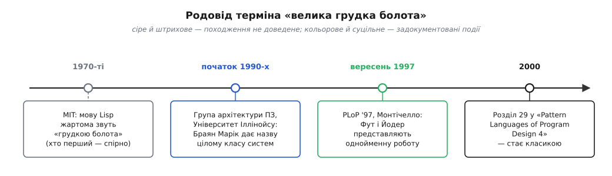

# 📜 Як «велика грудка болота» дістала ім'я

> Восени 1997-го двоє програмістів з Іллінойсу вийшли на конференцію й уголос сказали те, про що фах чемно мовчав: найпоширеніша архітектура на світі — не жоден із взірців із підручника, а безформна грудка, що наросла сама собою. Вони її не лаяли. Вони описали її як **патерн** — тверезо, майже з повагою, — бо вхопили головне: доки ганебне не назване на ім'я, з ним нічого не вдієш. Ця розповідь — про те, як у мовчазної вади з'явилося ім'я, і чому саме *назвати* її було вчинком.

## Двоє, що сказали вголос

Роботу «Big Ball of Mud» — «Велика грудка болота» — написали **«Браян Фут»** (англ. *Brian Foote*) і **«Джозеф Йодер»** (англ. *Joseph Yoder*), обидва з кафедри інформатики Іллінойського університету в Урбані-Шампейні (англ. *University of Illinois at Urbana-Champaign*). Уперше вони показали її у вересні 1997 року на четвертій конференції Pattern Languages of Programs — PLoP '97 — у Монтічелло, штат Іллінойс. Згодом текст ліг **розділом 29** до збірки «Pattern Languages of Program Design 4» (Addison-Wesley, 2000; за редакцією Ніла Гаррісона, самого Браяна Фута й Ганса Ронерта) і досі живе на сайті laputan.org/mud, куди автори роками дописували нові абзаци.

Теза була проста й незручна. Уся тодішня література захоплено малювала *високі* архітектури — конвеєр, шарувату структуру — так, ніби кожна реальна система є взірцем котроїсь із них. Фут і Йодер зауважили очевидне, чого ніхто не квапився вимовляти: **«Архітектура, що насправді переважає на практиці, досі не обговорена»**. Ось її вони й назвали — велика грудка болота, «де-факто стандартна» й «найчастіше розгортана» з усіх архітектур світу.

Означення вони дали без прикрас. У тілі статті: грудка болота — це система, зліплена **«недбало, ба навіть безладно»**, чия організація, «якщо це взагалі можна назвати організацією, **продиктована радше зручністю, ніж задумом**». А в анотації — образ, що вкарбувався у фахову пам'ять: **«безладно зліплена, розповзла, неохайна — на скотчі й дроті — джунглі спагеті-коду»**, система з «безпомильними ознаками нерегульованого росту й повторюваного латання нашвидкуруч». Кожне слово тут — зі свого досвіду, а не з чужого презирства. Ці двоє писали не про сусідів по цеху; вони писали про код, у якому жили самі.

## Хто насправді вигадав назву

Найчесніша деталь усієї історії — що самі автори **не приписали назву собі**. У подяках вони пишуть прямо: **«Браян Марік»** (англ. *Brian Marick*) першим запропонував назвати «великою грудкою болота» саме такого штибу архітектури — і разом із назвою кинув спостереження, що це, можливо, і є панівна нині архітектура, — на зборах Іллінойської групи з архітектури програм кількома роками раніше. Тобто і влучне ім'я, і головна думка — «отакого найбільше» — належать не тим двом, чиї прізвища стоять на роботі. Фут і Йодер зробили інше, не менш важливе: розгорнули кинуту в розмові фразу в докладний, аргументований опис із силами й наслідками. Той самий Марік згодом стане одним із сімнадцятьох, хто 2001 року підпише Agile-маніфест, — але в *цю* історію він увійшов єдиною влучною метафорою, зроненою на семінарі.

А в метафори — власна, глибша й туманніша передісторія. Сам вислів, зауважують автори, **«вигулькнув, здається, у 1970-х як характеристика Lisp»**. За переказом «Ґая Стіла» (англ. *Guy Steele*) і «Річарда Ґабріеля» (англ. *Richard Gabriel*) у їхній праці «Еволюція Lisp», хтось колись сказав: Lisp — наче грудка болота; скільки болота не додавай, вона однаково лишається грудкою болота. Ці слова прийнято приписувати математикові з MIT **«Джоелові Мозесу»** (англ. *Joel Moses*) — але сам Мозес заперечував, що таке казав, а Стіл однаково певен, що казав, тільки не там і не тоді, де переповідають. Тобто **чиї це слова насправді — досі спірне**. Тут варто спинитися й не піддатися спокусі вигадати впевненого «першовідкривача»: походження образу недоведене, це радше легенда фаху, і чесніше подати його саме так. Важить не те, чий язик уперше зліпив «грудку болота», а те, що метафора виявилася настільки влучною, що пережила півстоліття й перескочила з жарту про одну мову на діагноз усій індустрії.

*Термін мандрував десятиліттями: невиразний жарт про Lisp (чиї це слова — досі сперечаються) → Браян Марік дає назву цілому класу систем на іллінойському семінарі → Фут і Йодер розгортають її в роботу на PLoP '97 → 2000-го вона стає розділом книжки й класикою.*

## Чому грудка — це патерн, а не лайка

Ось найтонший хід усієї роботи, і саме він робить її не буркотінням, а внеском. Найлегше було б написати гнівний памфлет: погляньте лишень, який брудний код усі навколо пишуть, як не соромно. Фут і Йодер зробили протилежне — описали болото **як патерн**: повторюване рішення повторюваної задачі, у тому самому жанрі й тим самим строгим форматом, що й поважні взірці проєктування.

Різниця тут не косметична. Лайка ставить питання «хто винен» — і на цьому глухне, бо винних або немає, або всі. Патерн ставить інше питання: «які *сили* раз за разом штовхають розумних людей до того самого результату?» А це вже питання, на яке є відповідь і з якою можна щось робити. Автори наголошували на **«незаперечній дієвості»** цього підходу: грудка болота не тому всюдисуща, що програмісти ліниві чи невігласи, а тому, що в багатьох обставинах вона **справді працює** — дозволяє швидко відвантажити щось корисне, поки конкурент іще малює діаграми. Засудити її означало б заплющити очі на те, чому вона перемагає.

Назвати ваду на ім'я — уже половина ліку. Поки «наш код просто трохи заплутаний» — це туманна незручність, яку кожен відчуває, але ніхто не тримає в голові як окрему річ. Щойно з'являється ім'я — «велика грудка болота» — розмова змінюється: тепер це визначена, упізнавана сила, яку можна показати пальцем, обговорити на рев'ю, внести в план. Фут і Йодер дали фахові слово, яким можна вказати на слона в кімнаті, — і тому їхню роботу читають досі, хоч написана вона про код, якого давно немає.

> 🔧 **Навіщо це.** Коли наступного разу тобі схочеться сказати «та в нас просто трохи технічного безладу», зупинись і назви його точно: це грудка болота, і вона там не з примхи, а тому, що її вигнали конкретні сили. Названа вада перестає бути фоновим соромом і стає пунктом, який можна винести на обговорення, оцінити й свідомо вирішити — терпіти далі чи розчищати. Половина зрілості інженера саме в цьому: не в тому, щоб ніколи не мати болота (його матимеш), а в тому, щоб бачити його як окрему, названу річ, а не як розмиту «взагалі-то тут негарно».

## Сили, що зсувають систему в болото

Головна цінність роботи — не діагноз, а **перелік причин**. Фут і Йодер не махають пальцем; вони по черзі показують сили, що чесних людей з добрими намірами волочать у болото. І перша з них — найпідступніша.

**Одноразовий код, який приживається.** Майже кожна грудка болота починається з чогось, що *мало* бути тимчасовим. Автори описують це майже болісно точно: коли надходить час показати прототип, «спокуса напхати його вражаючими, але геть неефективними втіленнями» майбутньої функціональності стає нездоланною — і часом ця стратегія **«буває аж надто успішною»**: замовник, замість фінансувати наступну фазу, «може відправити сам прототип у реліз». Чернетку, зроблену «аби показати», раптом оголошують продуктом — і викинути її вже пізно. Кожна така латка — як позика: працює зараз, але «відсотки» наростають дедалі дорожчими майбутніми правками, і саме цю ціну описує окреме поняття [технічного боргу](topic:sf-apps/technical-debt) — швидке недбале рішення завжди повертається до тебе рахунком.

**Дедлайн, що не лишає вибору.** Час — сила, яку не переговориш. Коли до релізу три дні, ніхто не рефакторить архітектуру; кожен робить найкоротший рух, що змусить конкретну функцію запрацювати сьогодні. Один такий рух — дрібниця. Але дедлайни йдуть чередою, і система росте **кусковим ростом** (piecemeal growth): не за задумом, а латка за латкою, і кожна лягає туди, де саме зараз найлегше її прикласти, а не туди, де їй місце за логікою.

**Плинність команди.** Код живе довше за тих, хто його писав. Автори завважують сухо: **«Плинність кадрів здатна спустошити інституційну пам'ять організації — з хіба сумнівною втіхою, що приводить свіжу кров»**. Той, хто знав, *чому* тут зроблено саме так, іде — а лишається код, у якому наступний уже боїться щось чіпати, бо не розуміє задуму, і тому обкладає незрозуміле новими латками замість прибрати. Незнання множить обережність, обережність множить нашарування.

За цими трьома автори бачать ще ширший набір сил, що тиснуть в один бік: вартість (архітектура коштує зусиль наперед, а зиск невидимий), досвід (його бракує саме тоді, коли ухвалюють найдорожчі рішення), майстерність, невидимість самої структури «під капотом», невід'ємна складність задачі, мінливість вимог і масштаб. Жодна з них поодинці не фатальна. Але вкупі вони утворюють постійний ухил — і система, полишена котитися вільно, скочується в болото так само певно, як вода стікає в найнижчу точку.

## Ходи всередині болота

Робота не спиняється на одному патерні. Це ціла **мова патернів** — жменька названих ходів, якими болото і твориться, і виживає. Варто знати їх на ім'я, бо кожен ти впізнаєш у власній практиці.

- **Одноразовий код** (throwaway code) — швидкий брудний клапоть «на один раз», що напрочуд часто лишається назавжди.
- **Кусковий ріст** (piecemeal growth) — система, що прирощується нагодами й латками, а не за планом; окремо кожен крок розумний, укупі вони дають хаос.
- **Аби працювало** (keep it working) — понад усе тримати систему живою; краще криво, ніж мертво, бо простій дорожчий за неохайність.
- **Шари зсуву** (shearing layers) — частини, що змінюються з різною швидкістю, самі собою розшаровуються; те, що міняється щодня, відлипає від того, що стоїть роками.
- **Замести під килим** (sweeping it under the rug) — якщо безлад не подужати, бодай обгородити його чистим фасадом, щоб гнилля не розповзалося по решті системи.
- **Перебудова** (reconstruction) — коли латати вже дорожче, ніж почати з чистого аркуша, лишається викинути все й переписати наново.

Ці шість — не сходинки й не рецепт; це словник. Перші два пояснюють, *звідки* болото береться; решта — тактики виживання *всередині* нього. І два з них варто прочитати уважніше. «Замести під килим» тримається на тому, що чистий фасад відрубує безлад від решти коду, — а це можливо лише там, де [зв'язок між частинами свідомо ослаблений](topic:sf-apps/coupling-cohesion): коли ж усе зчеплене з усім, ховати нема за чим, і будь-яка зміна тягне хвилю правок по всій грудці. А «перебудова» — це найспокусливіша й найнебезпечніша відповідь на болото: [переписати з нуля чи все ж терпляче виправляти наявне](topic:sf-apps/rewrite-vs-refactor) — окреме важке рішення, у якому чистий аркуш надто часто обертається новою грудкою за кілька років.

## Чому ця чесність важить

Легко прочитати «Велику грудку болота» як капітуляцію: мовляв, усе одно все скотиться в багно, то навіщо старатися. Але автори мали на увазі протилежне. Вони не оспівували болото — вони знімали з нього туман. Поки найпоширеніша архітектура світу лишалася безіменною, з нею неможливо було впоратися: не можна цілитися в те, чого не названо. Давши їй ім'я, сили й патерни, Фут і Йодер перетворили розмиту ганьбу на річ, яку видно й з якою можна працювати.

Звідси й головний висновок, вартий цілого курсу. Болото — це не те, що стається з поганими програмістами; це те, що стається з **будь-якою** системою, полишеної котитися вільно, бо всі сили тиснуть в один бік. Отже, боротьба з ним — не героїчне прибирання постфактум, а щоденний свідомий вибір: ухвалювати дорогі рішення *навмисно*, доки вони ще дешеві, і не давати черговій «тимчасовій» латці тихо стати фундаментом. Двоє з Іллінойсу не дали рецепта, як не мати болота, — його не існує. Вони дали дещо корисніше: чесне ім'я, щоб ти бачив болото рано, коли з ним іще можна щось удіяти.
