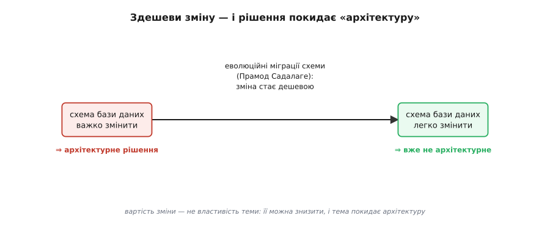
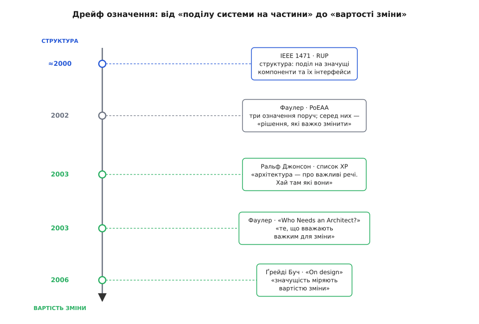

# 📜 Як «архітектура» стала «рішеннями, які дорого змінити»

Означення, яким ми користуємося в цьому курсі, звучить майже зухвало просто: архітектура — це набір рішень, які дорого змінити. Жодних згадок про рівні, шари чи компоненти. І це дивно, бо десятиліттями «архітектуру» означували геть інакше — через малюнок: найвищий рівень поділу системи на частини, квадратики й лінії між ними. Це означення й досі стоїть у стандартах і на кожній білій дошці. Тож звідки взявся інший, дивакуватий погляд — і чому саме він переміг?

Історія тут коротка й дуже повчальна, бо переможне означення не спустив зверху комітет. Воно вигранилося у суперечці в списку розсилки й в одному невеликому есеї, а потім хтось дотягнув його до леза одним реченням. І варто пройти цей шлях крок за кроком, бо кожен поворот пояснює, *чому* «вартість зміни» — практичніша мірка за «квадратики й лінії».

## «Найвищий рівень поділу системи» — означення, що вміло малювалося, але нічого не радило

Спершу побачмо означення, яке треба було подолати, — і чому воно так довго трималося.

Панівний погляд був **структурний**. Стандарт IEEE 1471, ухвалений 2000 року, означував архітектуру як «фундаментальну організацію системи, втілену в її компонентах, їхніх зв'язках між собою та із середовищем, і в засадах, що керують її проєктуванням та розвитком». Rational Unified Process, спираючись на ту саму традицію, казав про «сукупність значущих рішень щодо організації програмної системи, добору структурних елементів та їхніх інтерфейсів». Навіть Мартін Фаулер (Martin Fowler), британський інженер і головний науковець ThoughtWorks, у своїй книжці «Patterns of Enterprise Application Architecture» (Addison-Wesley, 2002) першим у переліку поширених означень назвав саме це: архітектура — «найвищий рівень поділу системи на частини».

Чому такий погляд природний? Бо він точно лягає на побутову метафору. Слово «архітектор» тягне за собою образ головного будівничого, який тримає в голові загальний план споруди; отже, «архітектура» — це велика картина, великі частини й те, як вони стикуються. І що найспокусливіше — таке означення чудово *малюється*. Береш маркер, ділиш систему на три шари, з'єднуєш стрілками — ось вона, архітектура, її видно.

Але придивімося, що це означення насправді *радить* робити. І тут воно порожніє. Воно каже: «поділи систему на частини» — але не каже, *які* частини важать, а які ні, і за яким мірилом. Воно велить намалювати компоненти — але не підказує, коли спинитися й над чим варто попітніти зайву годину. У самій його серцевині сидить слизьке слово «значущий»: значущий *за чим*? Структурне означення на це не відповідає. Сам Фаулер спершу відповів на нього цинізмом: архітектура, писав він, — «слово, яким ми послуговуємось, коли хочемо говорити про дизайн, але надути його так, щоб звучало поважно». У тому цинізмі, за його ж словами, ховалася дрібка правди: означення прикрашало малюнок, а не називало ставку.

Тут варто бути чесним і не спрощувати історію до чистого «до і після». Уже в тій-таки книжці 2002 року Фаулер поставив поруч три означення, і другим стояло «рішення, які важко змінити пізніше», а підсумовував він усе фразою «архітектура — це важливі речі, хай там які вони». Тобто зернина майбутнього погляду вже лежала в ґрунті. Бракувало одного: хтось мав пересунути її з узбіччя в самий центр — і пояснити, чому «важко змінити» не додаток до структурного означення, а його заміна.

## Джонсон на списку розсилки: «це геть фальшиве означення»

Поштовх стався не в книжці й не на конференції, а в буденній суперечці на списку розсилки спільноти Extreme Programming, десь на початку 2003 року. Хтось навів там канонічне означення — те саме, з RUP та стандарту IEEE: архітектура як «найвищий рівень уявлення про систему в її середовищі… організація чи структура значущих компонентів, що взаємодіють через інтерфейси, а ті компоненти складаються з дедалі дрібніших компонентів та інтерфейсів».

Відповів **Ральф Джонсон** (Ralph Johnson) — американський інформатик з Університету Іллінойсу, один із чотирьох авторів канонічної книжки «Design Patterns» 1994 року (славетна «банда чотирьох»). І відповів він не абстрактно: Джонсон сам був рецензентом того стандарту IEEE. Його репліка була рубана:

> «Я був рецензентом стандарту IEEE, який це вживав, і марно доводив, що це очевидно геть фальшиве означення. Немає жодного найвищого рівня уявлення про систему.»

Розгорнімо його доказ повільно, бо в ньому вся суть. Означення каже «найвищий рівень». Але «найвищий» передбачає одну привілейовану точку зору, з якої дивишся на систему. А її нема. Замовник тримає в голові одне уявлення про систему, розробник — зовсім інше; замовникові байдуже до «структури значущих компонентів». Отже, «найвищий рівень» — це не властивість самої системи, а властивість того, *хто дивиться*. Гаразд, звузьмо: нехай архітектура — це найвище уявлення *досвідчених розробників*. Але тоді спливає ще підступніше питання: а що робить компонент «значущим»? І ось Джонсонове лезо:

> «Він значущий, бо так кажуть досвідчені розробники.»

Це руйнує всю конструкцію. Значущість не лежить у коді, звідки її можна вичитати лінійкою. Значущість — це *судження* людей, які знають систему. А отже, й архітектура — не об'єктивний шар системи, а радше суспільна домовленість. Джонсон так і переозначив:

> «У більшості успішних програмних проєктів досвідчені розробники мають спільне розуміння дизайну системи. Це спільне розуміння й називають архітектурою.»

Погляд перевернувся. Архітектура — не те, що показує діаграма, а те, що досвідчена команда *згодилася* вважати важливим. Але й це ще не «вартість зміни». До неї Джонсон дійшов, розбираючи ще одного кандидата — означення «архітектура — це рішення, які треба ухвалити рано». Він і його підняв на кпини, та так влучно, що фраза стала класикою:

> «Архітектура — це рішення, які ти хотів би ухвалити правильно рано в проєкті, хоч насправді не факт, що ти ухвалиш їх правильніше за будь-які інші.»

Відчуваєте гостроту? Стара версія хвалькувато казала: «архітектурні рішення — ті, що їх ухвалюють рано». Джонсон повернув її до чесності: ми не вміємо ухвалювати їх правильно рано — ми лиш *хочемо*, бо вони здаються дорогими для відкату. «Рано» тут не про календар, а про страх помилитися там, де помилку важко забрати назад.

## «Архітектура — про важливі речі. Хай там які вони»

І тоді Джонсон підсумував усе рядком, який звучить як стенання втомленого інженера:

> «Архітектура — про важливі речі. Хай там які вони.»

На перший погляд це відмова від означення взагалі — знизування плечима замість відповіді. Але саме тут ховається сила. Фраза не описує систему — вона *переставляє питання*. Досі всі сперечалися, який рівень «найвищий» і що вважати компонентом. Джонсон каже: облиште рівні. Робота полягає в тому, щоб вирішити, *що важливе*, — а важливе залежить від конкретної системи й конкретної команди. Означення перестало бути малюнком і стало завданням.

Фаулер згодом розкрив, чому цей начебто банальний рядок «несе стільки багатства»: він означає, що архітектор мусить «вирішити, що важливе (тобто що архітектурне), а тоді витрачати сили на підтримання цих архітектурних елементів у доброму стані». Означення-знизування плечима виявилося означенням-обов'язком.

Тут варто зробити крихітну, але чесну поправку в атрибуції. Ту славетну фразу про «важливі речі» часто чіпляють Фаулерові — бо саме він розніс її світом. Та в першоджерелі це рядок із Джонсонового допису, який Фаулер цитує цілком. Джонсон її сформулював; Фаулер дав їй гучномовець. Тримати цю різницю варто не з педантизму, а тому, що вона показує, як народжуються ідеї в інженерії: один каже влучну річ у списку розсилки, інший упізнає її вагу й доносить до всіх.

## Есей, що зробив «дорого змінити» каноном

Гучномовцем став есей **«Who Needs an Architect?»** («Кому потрібен архітектор?»), який Фаулер надрукував у журналі IEEE Software за липень–серпень 2003 року (с. 11–13). Прочитавши Джонсонів допис, він визнав: «Він такий добрий, що процитую його весь», — і збудував колонку навколо нього.

Але Фаулер не спинився на «важливих речах». Він зробив наступний крок — той, що й дав нашому курсу його означення. Розділ, який він грайливо назвав «Позбутися програмної архітектури», починається з простого питання: *чому* люди взагалі відчувають потребу ухвалити деякі рішення правильно рано? І відповідає:

> «Відповідь, звісно, у тому, що вони сприймають ці речі як важкі для зміни. Тож архітектуру можна врешті означити як "речі, які люди сприймають як важкі для зміни".»

Ось вона, точка народження. Ланцюжок, який Фаулер пройшов на очах у читача, простий і невблаганний:

```
важливе для експертів
   → те, що хочеться вирішити правильно рано
      → бо здається важким для зміни
         → отже: архітектура = те, що дорого змінити
```

Кожна ланка витягає наступну. «Важливе» уточнюється до «того, що хочеться зробити правильно рано»; це бажання пояснюється страхом дорогої зміни; а страх дорогої зміни й стає означенням. Слизьке слово «значущий» зі старих стандартів нарешті дістало опору під ногами: значуще — те, що дорого відкотити.

## Найсміливіший хід: архітектуру можна прибрати

Якщо на цьому спинитися, вийшло б просто ще одне означення. Та Фаулер витягнув із нього висновок, який робить погляд «вартості зміни» по-справжньому робочим — і водночас найбільш контрінтуїтивним. Міркування таке: якщо річ архітектурна саме тому, що її важко змінити, то зроби її легкою для зміни — і вона *перестане бути архітектурною*.

Це не гра слів, а практика. Хрестоматійний приклад «ухвали правильно рано» — схема бази даних: усі знають, що її треба вилизати з самого початку, бо міняти схему потім (та ще й переганяти дані) страшенно дорого. Але на одному з проєктів колега Фаулера, **Прамод Садалаге** (Pramod Sadalage), збудував систему еволюційних міграцій, яка дала змогу міняти схему й мігрувати дані легко й безпечно. І Фаулер робить холоднокровний висновок:

> «Тим самим він зробив так, що схема бази даних перестала бути архітектурною.»



*Одне й те саме рішення покидає «архітектуру» не через переробку діаграм, а тому, що впала вартість його відкоту — знак, що архітектура є погляд, а не список тем.*

Зупинімося на цьому, бо тут ламається стара метафора. За структурним означенням схема БД або є частиною архітектури, або ні — раз і назавжди, як несуча стіна на кресленику. За означенням через вартість зміни та сама схема архітектурна в одному проєкті й дрібниця в іншому — залежно від того, скільки коштує її переграти сьогодні. Архітектура перестає бути фіксованим списком тем («бази даних, шари, протоколи») і стає *рухомою* мірою: усе, що зараз дорого відкотити. Знизив вартість — і пункт випав із категорії.

Фаулер підкріпив це думкою економіста **Енріко Заніното** (Enrico Zaninotto), який на конференції XP 2002 доводив, що незворотність — один із головних рушіїв складності, а гнучкі (agile) методи борються зі складністю саме тим, що зменшують незворотність. Звідси Фаулерове означення ролі архітектора, що звучить парадоксально: одне з найважливіших його завдань — «прибирати архітектуру, знаходячи способи усунути незворотність у дизайні». А сам Джонсон в окремому листі додав тезу, яка знімає останній наліт містики з «важко змінити»:

> «Немає теоретичної причини, чому щось у програмі має бути важким для зміни… Складність — ось що робить програму важкою для зміни. Це і дублювання.»

На відміну від будівлі, де підвал справді важко перекопати (фізика), у програмі важкість зміни не задана згори світом — її створюємо ми самі, накопиченою складністю й дублюванням. А отже, її можна й зменшити. «Вартість зміни» — не вирок, а величина, на яку інженер має важіль.

## Буч дотягує до леза: значущість = вартість зміни

Останній штрих поклав **Ґрейді Буч** (Grady Booch) — американський інженер, один зі співтворців мови UML, співробітник IBM. У нотатці «On design» 2006 року (її наводять Бушман, Генні та Шмідт у п'ятому томі «Pattern-Oriented Software Architecture», 2007) він сформулював те, що відтоді цитують як означення архітектури:

> «Усяка архітектура — це дизайн, але не всякий дизайн — архітектура. Архітектура — це значущі проєктні рішення, що формують систему, де значущість міряють вартістю зміни.»

Придивімося, що саме Буч додав, — бо це не переспів. Старі стандарти говорили про «значущі рішення», але жодного разу не сказали, значущі *за яким мірилом*, — і слово висіло риторичною прикрасою. Буч підставляє під нього мірку: значуще = дороге для зміни. Тепер «значущість» можна зважити, а не лише проголосити. І він акуратно вкладає поняття одне в одне: дизайн — це весь простір проєктних рішень; архітектура — його підмножина, та, що дорого відкотити. Саме цю вкладеність — суцільну смугу від дешевих деталей до дорогих рішень — курс і бере за робочу картину.



*Погляд зсувався поступово: структурне «що система є» відступало перед «що дорого відкотити», аж поки Буч зробив вартість зміни явною мірою значущості.*

## Чому «вартість зміни» практичніша за «квадратики й лінії»

Тепер зберімо докупи головне питання: чому інженерна спільнота проміняла красиве, доладне структурне означення на це незграбне «дороге змінити»? Не з любові до парадоксів. Порівняймо два означення не за красою, а за тим, що кожне *дозволяє робити*.

**Воно дає тест, а не картинку.** «Найвищий рівень поділу» велить малювати, але ніколи не каже, коли спинитися й що заслуговує на увагу. «Вартість зміни» вкладає тобі в руки питання, яке можна поставити до *будь-якого* рішення: якби я тут помилився, скільки коштувало б переробити? Це питання *сортує* рішення — відділяє ту жменьку, над якою варто думати повільно, від решти, яку просто пишеш. Діаграма не сортує нічого; вона однаково старанно малює і несучу стіну, і колір шпалер.

**Воно чесно відносне.** Структурні означення вдають, ніби архітектура — абсолютний шар системи, однаковий для всіх. Погляд вартості зміни визнає правду, яку побачив Джонсон: значущість залежить від системи й команди. Те саме рішення (схема БД) архітектурне в одному проєкті й дрібниця в іншому. Означення, що їде разом із реальністю, корисніше за те, що вдає, ніби реальність застигла.

**Воно називає ворога.** «Квадратики й лінії» не дають з чим боротися — намалював і милуйся. «Вартість зміни» вказує пальцем прямо на незворотність і складність — і тим самим каже архітекторові, що *робити*: не малювати більше, а знижувати вартість зміни. Ховати рішення за інтерфейсом, відкладати його, робити зміну схеми дешевою, як у Садалаге. Означення несе в собі власний список справ.

**Воно міряє те, що треба.** Бучове «значущість = вартість зміни» перетворює туманний почесний титул («це важливе, бо… ну, важливе») на величину, яку можна зважити. Ти перестаєш сперечатися, чи гідний якийсь квадратик потрапити на діаграму, і починаєш оцінювати, скільки коштував би відкіт.

Ось чому курс узяв означення, що звучить скромніше й навіть зухваліше водночас. «Архітектура — це найвищий рівень поділу системи» робить із тебе рисувальника діаграм. «Архітектура — це рішення, які дорого змінити» робить із тебе людину, яка вишукує дорогі рішення й працює над тим, щоб зробити їх дешевими. Перше означення описує систему. Друге каже, де твоя увага окупається.
