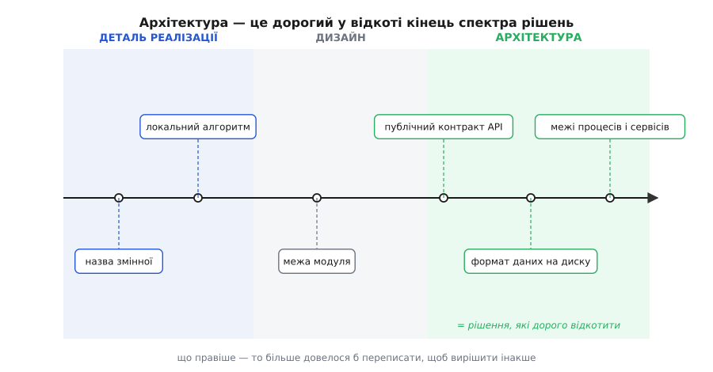
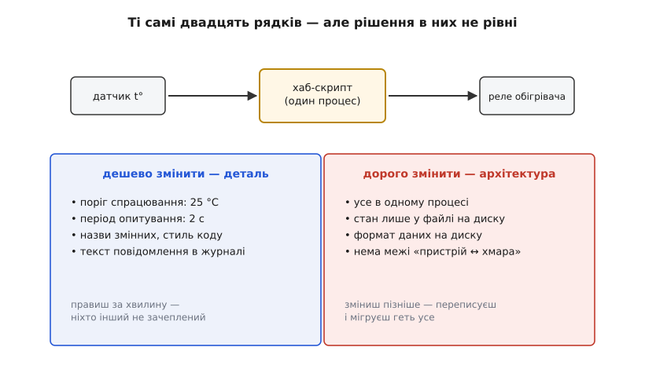

# Архітектура

<preknowlist>
- [Зчеплення і зв'язність](topic:sf-apps/coupling-cohesion) — чому зміна в одному місці коду тягне за собою правки в усіх, хто на нього спирається; звідси й береться «дорого змінити».
- [Інтерфейс проти реалізації](topic:sf-apps/interface-vs-implementation) — що модуль показує назовні (контракт) на противагу тому, що ховає всередині; без цієї межі не видно, чому одні рішення дешеві, а інші — ні.
</preknowlist>

Ти вже вмієш писати код, який працює. То навіщо цілий курс про архітектуру?

Бо «працює сьогодні» і «його можна змінювати далі» — це дві різні властивості, і друга дається значно важче. Візьмімо систему, яку ми вестимемо через увесь курс, — платформу розумного дому **Digital Homes**. Її найперша версія, v0, вміщається в один скрипт на дешевому одноплатнику: раз на дві секунди він читає температуру з давача, порівнює її з порогом і вмикає чи вимикає реле обігрівача. Двадцять рядків. Вони працюють бездоганно.

І все ж кожна спроба цей скрипт розвинути щось ламає. Додати другий давач — доводиться переписувати цикл. Захотіти, щоб дім слухався з телефона, — і виявляється, що «слухатись» просто нема куди причепити. Болить не там, де код рахує поріг. Болить у жменьці рішень, вбудованих у саму *форму* цієї програми. Ось ця жменька і є те, що ми називаємо архітектурою (гр. arkhitéktōn — головний будівничий: той, хто ухвалює найважливіші рішення про споруду, а не кладе кожну цеглину).

## Що робить рішення «архітектурним»

Слово вражає масштабом — і збиває з пантелику. Архітектура — це ж великі діаграми, посада сивого інженера, щось, що роблять «до того, як почнеться справжня робота»? Найкорисніше означення набагато скромніше й гостріше.

**Архітектура — це набір рішень, які дорого змінити.**

Означення не нове. Коли Мартін Фаулер з'ясовував, що ж люди мають на думці під «архітектурою», Ральф Джонсон (один з авторів канонічної книжки про патерни проєктування) відповів фразою, що стала класикою: «Архітектура — це про важливі речі. Хай там які вони.» А що робить річ важливою? Ґрейді Буч уточнив ту саму думку до леза: «Усяка архітектура — це дизайн, але не всякий дизайн — архітектура. Архітектура — це значущі рішення, а значущість міряють вартістю зміни.» [Звідки взялося це означення й чому воно витіснило «діаграму з квадратиків»](root:progarch/what-is-architecture/hist-expensive-to-change.md) — окрема, повчальна історія.

Звідси випливає простий тест. Хочеш знати, чи рішення архітектурне, — уяви, що ти помилився, і спитай: що коштуватиме вирішити інакше? У цього «що коштуватиме» чотири різні кишені, і варто бачити кожну. Скільки *свого коду* переписати. З ким *домовитися*, якщо рішення зачіпає не лише тебе. Які *дані*, вже записані в старій формі, перегнати в нову. Кого з *чужих*, хто сперся на твоє рішення, змусити оновитися. Якщо все разом важить «перейменувати одну штуку» — це деталь. Якщо «переписати пів системи, перегнати всі дані в новий формат і сказати кожному клієнтові оновитися» — це архітектура. Мірило — не важливість сама собою, а **ціна відкоту**.

## Чому деякі рішення дорогі

Тест працює, але з нього треба витягнути механізм: *чому* одні рішення відкотити копійки, а інші — катастрофа. Сходяться дві сили.

Перша — **радіус вибуху**. Рішення рідко живе саме. На нього спираються інші частини коду, а на ті — ще інші, тож залежність тягнеться ланцюжком: A спирається на рішення, B — на A, C — на B. Зміни рішення — і хвиля правок котиться по всьому ланцюжку: спершу пряме залежне місце, тоді його залежні, і так до кінця. Тому рахувати треба не тих, хто сперся *прямо*, а всіх, до кого дотягнеться хвиля.

Візьмімо це на дотик. Поміняти локальну змінну всередині функції — хвиля нульова: поза функцією на неї не спирається ніхто, ніхто її й не побачить. А тепер уяви, що по всій системі «команду пристрою» представлено просто цілим числом: 3 — увімкнути обігрівач, 7 — вимкнути. На цю форму сперлося все: планувальник, що команди створює; черга, що їх передає; журнал, що їх записує; драйвер, що їх виконує. Захотів замінити ціле число повноцінною структурою — з пристроєм, дією, параметрами, часом — і мусиш правити кожне з цих місць одночасно, бо всі вони припускали «команда — це число». Одне рішення про *форму* — і хвиля накриває десятки файлів. Що більше на рішенні [зчеплено](topic:sf-apps/coupling-cohesion) — прямо й через ланцюжки, — то ширша хвиля й дорожчий відкіт.

Друга — **зобов'язання назовні**. Поки рішення живе лише у твоєму коді, ти в ньому володар: захотів переграти — сам і переграв, сам полагодив усе залежне. Але тієї миті, коли рішення перетинає межу, якої ти не контролюєш, ця свобода зникає. Бо по той бік межі — не твій код, і наказати йому змінитися ти не можеш; щоб відкотити рішення, мусять зрушити всі по той бік, а вони живуть за своїм графіком, не за твоїм.

Таких меж, що заморожують рішення, зазвичай три. Перша — **публічний контракт**: твою функцію вже викликають чужі програми, з певними іменами, параметрами, очікуваною поведінкою. Перейменуєш чи зміниш параметри — їхній код зламається на виклику, а виправити його ти не можеш, він не твій. Друга — **дані на диску**: формат, у якому ти вже записав стан на диски тисяч пристроїв. Стара форма лежить на них і сама не перепишеться; змінити формат означає обійти й перегнати кожну копію, не загубивши жодної. Третя — **мережевий протокол**: машини по обидва боки вже говорять умовленою мовою, і зміниш її з одного боку — співрозмовник перестане розуміти; оновитися обидва боки мусять злагоджено, інакше зв'язок рветься. Спільне в усіх трьох одне: за межею твоя влада закінчується. Саме тому [зміна за інтерфейсом дешева, а зміна самого інтерфейсу — ні](topic:sf-apps/interface-vs-implementation): інтерфейс і є та зовнішня межа, на яку сперлися чужі, тобі не підлеглі.

Складімо ці дві сили — і матимемо точну природу архітектурного: **широкий радіус вибуху, помножений на затверділе зобов'язання**. Множення тут не для окраси. Рішення з величезним радіусом, але цілком усередині твого коду, ще піддається — важко, та можливо переграти все за раз. Рішення дрібне, зате вморожене в публічний контракт, теж стерпне — торкнеться небагатьох. А от коли обидві сили великі водночас — широка хвиля *і* межа, якої не переступиш, — відкіт стає майже неможливим. Це й є серце архітектури.

## Вартість зміни — важіль, а не вирок

І ось що з цього випливає, а на позір суперечить самому слову «архітектура»: цей добуток не сталий, він міняється з життям системи.

Рішення, якого сьогодні торкаєшся тільки ти, не архітектурне — радіус нульовий, зобов'язань нема. Але тієї миті, коли на нього сперся хтось іще, радіус підскочив; а коли воно вислизнуло за неконтрольовану межу — застигло зобов'язання. Те саме рішення *дозріло* в архітектурне, хоч ти й пальцем його не торкнувся. «Архітектурне» виявляється не вічним ярликом, наклеєним на певні теми (бази даних, шари, протоколи), а *станом*, якого рішення набуває.

А якщо стан набувається — його можна й утратити. І це найкорисніший висновок усього означення. Якщо рішення архітектурне саме тому, що дорого змінити, то зроби його дешевим — і воно перестане бути архітектурним. Вартість зміни — не вирок, накладений долею, а величина, на яку в інженера є важіль. Сховаєш рішення за інтерфейсом — і його радіус усихає до однієї стіни: за тією стіною міняй що завгодно, хвиля далі не пройде. Відкладеш рішення, поки справді не мусиш його ухвалити, — і зобов'язання не затвердне завчасно, поки ти ще нічого не знаєш. Обгородиш межею — і відрубаєш хвилю від решти системи.

Звідси інакший погляд на саму роботу архітектора. Вона не в тому, щоб *намалювати* дорогі рішення якнайпоказніше, а в тому, щоб їх було якнайменше: дороге зробити дешевим наперед, незворотне — зворотним. Не побільшити архітектуру, а зменшити її. Як саме здешевлюють зміну — інтерфейсами, відкладанням, межами — розбиратиме чи не весь дальший курс; поки що досить бачити, що важіль існує, і дорожнеча рішення — не властивість теми, а наслідок того, як ти його розмістив.

## Архітектура, дизайн, деталь — один спектр

Якщо вартість зміни — величина, що плавно росте від копійок до катастрофи, то й рішення не діляться на два ящики, «архітектура» і «не-архітектура». Немає між ними стіни. Є неперервна смуга вартості зміни, і рішення розсипані вздовж неї.

*Ті самі за формою рішення коштують різного відкоту; архітектура — це просто дорогий кінець спектра, а не окрема категорія речей.*

На лівому кінці — деталі реалізації: назва змінної, локальний алгоритм усередині функції, текст повідомлення в журналі. Радіус нульовий, зобов'язань нема; помилився — виправив за хвилину, ніхто й не помітив. Посередині — те, що зазвичай звуть дизайном: межі модулів, розподіл обов'язків між класами. Тут уже щось на щось спирається, хвиля відчутна, але керована. На правому кінці — архітектура: у якому сховищі й форматі лежать дані, який контракт система показує світові, синхронно чи асинхронно тече робота, скільки процесів і де пролягли межі між ними. Обидві сили тут великі — широкий радіус і тверді зовнішні зобов'язання, — тому відкіт найдорожчий.

Це, до речі, і є Бучева думка «всяка архітектура — дизайн, але не всякий дизайн — архітектура», покладена на вісь: дизайн — уся смуга проєктних рішень, архітектура — тільки її дорогий правий край. Не окрема порода речей, а ділянка одного спектра.

Ключове — **межа між ділянками не абсолютна, вона їде разом із системою**. Для скрипта-одноденки, який завтра викинуть, архітектурного немає майже нічого: перепиши хоч усе, вартість відкоту копійчана. Для платформи, від якої залежать тисячі пристроїв, вибір формату даних на диску — рішення на все життя проєкту. Рішення того самого *типу*, а місце на смузі різне — бо різні радіус і зобов'язання. Ось чому нема сталого списку «архітектурних тем», який можна було б завчити раз і назавжди: те, що архітектурне тут, деінде дрібниця.

## Повернімося до DH v0

Прогляньмо наш скрипт цим оком. Що в ньому дешеве, а що дороге — і чому саме?

*У крихітній програмі вже сидять архітектурні рішення — просто їх ніхто свідомо не ухвалював.*

Поріг 25 °C, період опитування дві секунди, назви змінних — усе це деталі: на них не сперся ніхто, за межу вони не вийшли; захотів інакше — поміняв число, і по всьому. А от чотири рішення сидять на дорогому кінці, і кожне тримається своєю силою. «Увесь код в одному процесі» дороге радіусом: коли все живе в одній програмі й ділить спільний стан у пам'яті, будь-яка спроба щось відщепити тягне за собою решту. «Стан живе тільки у файлі на локальному диску» — теж радіусом: кожен шматок коду звик читати й писати той файл напряму, тож винести стан деінде означає переробити всіх, хто в нього зазирає, за раз. «Дані лежать саме в такому форматі» — це вже зобов'язання назовні: щойно пристрої з цим форматом роз'їдуться по домівках, формат застигне на їхніх дисках, і зміна вимагатиме перегнати дані на кожному. «Між пристроєм і зовнішнім світом немає жодної межі» — найпідступніше: відсутність межі означає найширший можливий радіус, бо ніщо ні від чого не відгороджене. Коли Digital Homes захоче керувати домом із хмари, з'ясується, що цю відсутню межу треба прорізати наскрізь через усе, — а це вже не правка, а хірургія на живому.

І ось найголовніше: автор скрипта ніколи не сідав «робити архітектуру». Він просто писав код, що вмикає реле. Але архітектура однаково там — вирішена *за замовчуванням*, самим фактом, що код ліг саме так. Звідси правило, варте всього курсу: **архітектура є в кожної системи; питання лише в тому, чи ти її обрав, чи вона склалася сама.** Буч сказав про це точно: в одних систем архітектура задумана, у кількох випадкова, а в більшості — стихійна.

## Найпоширеніша архітектура світу — та, якої ніхто не обирав

Коли дорогі рішення не ухвалюють свідомо, вони не зникають — їх усе одно ухвалено, тільки не думкою, а зручністю. Правило вибору за замовчуванням завжди те саме: як зараз найшвидше. Одна швидка латка лягає туди, де найлегше її прикласти, — не туди, де їй місце за логікою; за нею друга, третя, і кожна з тієї ж зручності моменту. За рік ці нашарування застигають у щось, що Браян Фут і Джозеф Йодер 1997-го назвали [«великою грудкою болота» (Big Ball of Mud)](root:progarch/what-is-architecture/hist-big-ball-of-mud.md) — систему, чию форму «диктувала радше зручність, ніж задум». Їхнє спостереження було чесним і незручним: це не рідкісна патологія, а **найпоширеніша архітектура на світі**. Саме в неї сповзає будь-який код, коли архітектурні рішення пускають самопливом, — бо «як найшвидше зараз», повторене тисячу разів, і дає безформну грудку.

Курс і існує, щоб дорогі рішення ухвалювати *навмисне* — доки вони ще дешеві.

> 🔧 **Навіщо це.** Ти фізично не можеш обмірковувати кожен рядок — так нічого не відвантажиш. Тому перше вміння архітектора — сортування: бачити ту жменьку рішень, що дорого відкотити, і думати повільно й прискіпливо *саме над ними*, а решту просто писати. У DH v0 таких рішень чотири, не сорок, — і от над цими чотирма варто було посидіти зайву годину, перш ніж тиснути «зберегти». Друге вміння, яке будуватиме решта курсу, тонше: зробити дороге рішення дешевим наперед — сховати його за інтерфейсом, відкласти, обгородити межею, — щоб по-справжньому архітектурних рішень лишилося якомога менше.

Тож архітектура — не діаграма й не посада. Це живий набір рішень, які твоя система не може дешево забрати назад. Назви їх — і знатимеш, де думання окупається. Далі ми озброїмося двома інструментами саме для цих рішень: мовою, якою їх зважують (якісні атрибути), і дисципліною ухвалювати їх, коли даних іще нема.
