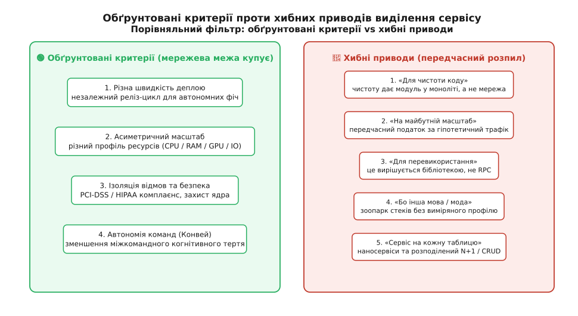
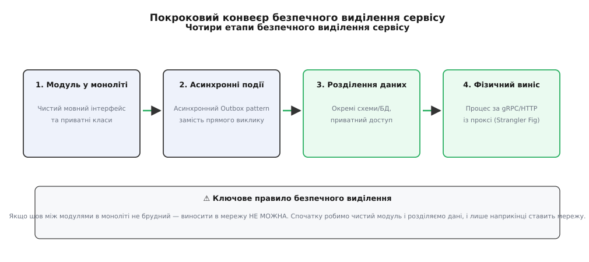

# Коли виділяти сервіс: критерії та хибні приводи

<preknowlist>
- [Модульний моноліт як дефолт](topic:root/course/progarch/modular-monolith-first) — чому моноліт із чіткими модулями є відправною точкою, а не тимчасовим компромісом.
- [Коли й як різати](topic:root/course/progarch/when-to-split) — загальний баланс між монолітом та мікросервісами і пастка розподіленого моноліта.
- [Закон Конвея](topic:programming/conways-law) — зв'язок між організаційною структурою команд і межами софту.
- [Обмежений контекст](topic:programming/bounded-context) — DDD-поняття автономної моделі та її мовних меж.
</preknowlist>

Інтернет-магазин із 50 000 унікальних відвідувачів на день обробляє замовлення, формує PDF-рахунки, відправляє Email-сповіщення та перевіряє залишки товарів на складі в одному монолітному процесі. У звичайний день система працює стабільно, а час відповіді серверів не перевищує 80 мілісекунд. Проте під час проведення маркетингової акції «Чорна п'ятниця» потік покупців зростає в 40 разів, і модуль генерації PDF-рахунків починає масово споживати процесорний час (CPU) для рендерингу штрихкодів та графічних елементів товарних чеків. Фонові воркери моноліта повністю забивають пул з'єднань із базою даних, через що звичайний HTTP-запит користувача на перегляд вмісту кошика чекає вільного сокета 15 секунд і завершується помилкою `504 Gateway Timeout`. У ту саму мить безпековий аудитор компанії вимагає сертифікації за стандартом PCI-DSS Level 1 для модуля обробки платіжних карток й наполягає на негайній ізоляції таблиць із токенами карток від решти бізнес-логіки. Одночасно команда мобільних розробників намагається котити виправлення коду 20 разів на день, але змушена чекати 2 години на проходження повного прогону регресійного тестування всього монолітного застоску.

Ця ситуація демонструє точний момент, коли монолітна архітектура починає створювати виміряний біль у трьох різних вимірах: надійності, швидкості релізів та безпеці. Проте спроба розв'язати цей біль шляхом сліпого «порізати все на мікросервіси» без чітких критеріїв створює проблему, значно важчу за вихідний моноліт — розподілений моноліт із високою затримкою та складною оркестрацією. Виділення сервісу — це не стилістична дія в середовищі розробки, а дорога архітектурна угода між швидкістю розробки, інфраструктурним чеком та фізикою мережі. У цій статті розібрано, за які саме властивості ми платимо мережевою межею, які чотири критерії роблять цей виніс обґрунтованим і які п'ять хибних приводів ведуть у пастку передчасного розпилу.

## Фізична ціна мережевої межі

Найперше, що повинен усвідомити архітектор перш ніж пропонувати створення нового сервісу — це фізична ціна, яку система сплачує за появу сокета між двома шматками коду. Усередині одного монолітного процесу виклик функції між двома модулями описується операцією `call` на рівні ассемблера. Параметри передаються у регістрах процесора або стек, обчислення займає від 10 до 150 наносекунд, процесорний кєш L1/L2 залишається гарячим, а ймовірність того, що виклик функції «зависне через мережевий таймаут», дорівнює нулю.

Як тільки між цими двома модулями ставиться мережева межа (HTTP/REST, gRPC, Apache Kafka), фізика взаємодії кардинально змінюється. Усі накладні витрати мережевого виклику можна згрупувати у чотири фундаментальні категорії:

### 1. Податок на затримку (Latency Tax)
Виклик через мережу вимагає серіалізації об'єкта в байти (JSON / Protobuf), проходження крізь сокети ядра Linux, віртуальні комутатори, мережеві карти, файрволи та Sidecar-проксі (Envoy / Istio). Замість 150 наносекунд одиночний виклик займає від 2 до 15 мілісекунд. Мережа сповільнює взаємодію у 20 000–50 000 разів. Якщо для формування однієї сторінки клієнтський запит змушений послідовно пройти ланцюжок із 5 сервісів, користувач отримує додаткові +50 мс затримки лише на проходження транспорту.

При цьому слід ураховувати джитер (Jitter) та хводові затримки (Tail Latency P99/P99.9). У той час як середня затримка (P50) може здаватися прийнятною (3 мс), затримка P99 через сплески сміттєзбору (Garbage Collection pauses) у мовних середовищах Node.js чи Java або через втрату пакетів у мережі може досягати 250–500 мілісекунд, викликаючи випадкові гальмування у реальних користувачів.

### 2. Податок на доступність (Availability Multiplication Tax)
Усередині монолітного процесу доступність двох модулів тотожна доступності самого процесу (A = 99.9%). Якщо два сервіси винесені в мережу й з'єднані синхронно, підсумкова доступність ланцюжка обчислюється як добуток доступностей кожної ланки:

```
A_chain = A_1 · A_2 · A_3 · ... · A_N
```

Якщо 5 міжсервісних ланок мають індивідуальну доступність 99.9% (3 дев'ятки), підсумкова доступність ланцюга становить `0.999⁵ ≈ 99.5%`. Це означає збільшення незапланованого простою системи з 8.7 годин до 43.8 годин на рік. Мережева межа між синхронними компонентами множить ризики відмов. Якщо один із сервісів починає тупити або повертати помилки, без налаштованих запобіжників (Circuit Breakers) ця хвиля відмов негайно накриває викликаючий сервіс, викличуючи каскадний колапс всієї платформи.

### 3. Операційний та інфраструктурний податок (TCO Overhead)
Виділення сервісу створює неперервний фінансовий чек для компанії. Кожен новий сервіс вимагає окремого Git-репозиторію, власного CI/CD конвеєра, мінімум 2 Production-реплік у Kubernetes для забезпечення відмовостійкості, Sidecar-контейнерів для збору логів і метрик, конфігурацій Vault для секретів та окремих панелей моніторингу в Grafana.

Витрати на розгортання та підтримку кожного мікросервісу включають:
- Резервування ресурсів RAM та CPU під Sidecar-контейнери (Envoy, Fluentbit, Datadog/OpenTelemetry collector), що додає 100–300 MB RAM на кожен под;
- Час інженерів на підтримку Helm-чартів, регулювання правил мережевої безпеки (NetworkPolicies) та оновлення базових Docker-образів;
- Складність відстеження помилок, яка вимагає впровадження наскрізного трасування (Distributed Tracing / OpenTelemetry) із прокиданням заголовка `traceparent` крізь усі сервісні межі.

### 4. Втрата атомарних транзакцій та узгодженість (Consistency & Transaction Tax)
У моноліті збереження замовлення й списання товару зі складу виконуються в єдиній ACID-транзакції бази даних: якщо списання не вдалося, `ROLLBACK` скасовує всі зміни атомарно за кілька мікросекунд. Після виділення сервісу складу ACID-транзакція руйнується. Інженер змушений впроваджувати складні розподілені паттерни узгодженості — Saga (компенсуючі транзакції), 2PC (Two-Phase Commit) або Eventual Consistency, які вимагають написання складного коду обробки часткових відмов.

При впровадженні асинхронної узгодженості з'явиться вікно неконсистентності (Inconsistency Window), під час якого користувач бачить списане замовлення, але статус на складі ще не оновився. Обробка конфліктів та написання компенсуючих транзакцій (наприклад, скасування оплати при відсутності товару) збільшує обсяг коду у 2–3 рази порівняно з монолітною ACID-транзакцією.

Детальний математичний розрахунок затримок, доступності та інфраструктурного чеку виділення сервісу із робочими кодовими прикладами на C++ та TypeScript наведено у проєктній вставці [Проєктування та розрахунок вартості виділення сервісу](topic:guide/progarch/monolith-vs-microservices/when-to-extract-service/proj-service-extraction-cost.md).

Отже, виділення сервісу є виправданим лише тоді, коли виграш від ізоляції перевищує сумарний податок за затримку, доступність, узгодженість та операційні витрати.

## Чотири обґрунтовані критерії виділення сервісу

Існує лише чотири фундаментальні сили, за наявності яких мережева межа справді щось купує для архітектури системи. Якщо жодної з цих чотирьох сил немає — виділення сервісу є помилкою.



*Порівняльний фільтр: виділяти сервіс варто лише за наявності хоча б одного із 4 обґрунтованих критеріїв. Хибні приводи створюють розподілений моноліт.*

### Критерій 1: Незалежний цикл деплойменту та еволюції

Найперша й головна валюта, яку купують мікросервіси — це **незалежне викочування** (Independent Deployability).

Оцінювати цей критерій слід через метрики продуктивності розробки DORA (Deployment Frequency, Lead Time for Changes, Change Failure Rate, Mean Time to Recovery). Якщо модуль А (наприклад, модуль персоналізованих рекомендацій чи маркетингових акцій) розробляється за методикою безперервного деплою (Continuous Deployment) й вимагає 15 викочувань у прод на день для проведення A/B експериментів, а модуль Б (бухгалтерський реєстр чи головна книга) є консервативним і релізиться раз на місяць після суворого аудиту, тримати їх в одному моноліті стає руйнівним для бізнесу.

У моноліті швидкість релізів визначається найповільнішим модулем. Реліз модуля рекомендацій блокуватиметься долготривалим прогоном регресійних тестів бухгалтерського модуля, а найменший баг у тегах рекомендацій здатний скасувати випуск фінансового звіту.

Мережева межа дозволяє команді рекомендацій котити свій код 15 разів на день за власною CI/CD пайплайн, не запитуючи дозволу у команди обліку й не ризикуючи пошкодити їхній стан.

### Критерій 2: Асиметричний масштаб і гетерогенні ресурси

Друга обґрунтована причина — різкий, виміряний у числах розрив у профілі навантаження та вимогах до апаратних ресурсів (10x+ discrepancy).

Розглянемо профіль споживання ресурсів чотирьох типових модулів:
- **Модуль профілів:** IO-bound, низька затримка, 500 запитів/сек, 200 MB RAM;
- **Модуль пошуку:** Memory-bound, високе використання RAM для індексів (64 GB RAM), Elasticsearch;
- **Модуль відеокодування:** CPU/GPU-bound, 100% завантаження 32 ядер CPU під час обробки файлу;
- **Модуль сповіщень:** Async Event-bound, сплески до 100 000 WebPush-повідомлень за секунду під час розсилок.

Якщо всі чотири модулі знаходяться в єдиному монолітному процесі, масштабувати моноліт означає розмножувати важкі 64 GB інстанси з GPU заради обробки дрібних HTTP-запитів профілів. Виділення модуля обробки відео та модуля пошуку в окремі сервіси дозволяє:
- Розмістити відеокодер на спеціалізованих інстансах із GPU-прискорювачами;
- Розмістити пошук на вузлах із великим обсягом оперативної пам'яті;
- Масштабувати кількість їхніх подій/процесів автоскалером (HPA) від 2 до 80 залежно від черги, залишаючи сервіс профілів на 2 скромних вузлах.

### Критерій 3: Ізоляція відмов та межі безпеки й комплаєнсу

Третя сила — це фізична ізоляція процесу заради надійності ядра або виконання юридичних вимог комплаєнсу.

- **Ізоляція відмов (Fault Isolation):** Якщо модуль виконує нестабільну роботу — наприклад, викликає сторонню C-бібліотеку для парсингу завантажених PDF-документів, працює з неочищеним бінарним потоком з IoT-пристроїв або виконує користувацькі скрипти, — існує ризик витоку пам'яті (Memory Leak), пошкодження купи (Heap Corruption) або системного крашу `SIGSEGV`. У моноліті падіння одного модуля валить увесь процес, залишаючи тисячі інших користувачів без обслуговування. Сервісна межа гарантує, що краш процесу парсингу PDF не зачепить приймання платежів.
- **Межа безпеки та комплаєнсу (Security Wall):** Обробка даних банківських карток за стандартом PCI-DSS Level 1 вимагає жорсткого обмеження доступу розробників, регулярних аудитів коду, шифрування дисків та ведення суворих логів. Якщо код обробки карток знаходиться у моноліті, під аудит PCI-DSS потрапляє **весь моноліт** і всі 50 розробників компанії. Виділення модуля карт у крихітний, ізольований сервіс (Zone 0) звужує контур аудиту до 2 інженерів та одного репозиторію, зберігаючи свободу розробки для решти команди.

### Критерій 4: Автономія команд на масштабі Конвея

Четверта причина є не технічною, а соціотехнічною. **Закон Конвея** ([Conway's Law](topic:programming/conways-law)) каже: *структура системи повторює структуру спілкування організації, що її будує*.

Коли над одним монолітом починає працювати понад 15–20 інженерів, розділених на кілька продуктів чи напрямків, вони неминуче починають заважати одне одному. Зміни у спільних таблицях бази даних вимагають міжкомандних нарад, релізні гілки зливаються з конфліктами, а відповідальність за баги в прод розмивається. Когнітивне навантаження команди (Cognitive Load) перевищує допустимі межі.

Якщо межа предметної області (Bounded Context) за методологією Domain-Driven Design є чіткою, а за цією межею стоїть окрема сформована команда (від 4 до 8 осіб), мережева межа стає засобом закріплення **автономії власності**. Команда отримує свій репозиторій, свою базу даних та свій CI/CD, спілкуючись із сусідніми командами виключно через стабільний версіонований контракт API.

## Альтернатива розпилу: приклад Shopify та модульний моноліт

Перш ніж розглядати хибні приводи, варто згадати приклад компанії Shopify. Замість виділення сотень мікросервісів Shopify роками утримує один із найбільших у світі монолітів на Ruby on Rails, обробляючи пікові навантаження в сотні тисяч запитів на секунду під час Flash Sales.

Секрет Shopify — **модульний моноліт із жорстким контролем меж** (за допомогою інструменту Packwerk). Кожен модуль усередині єдиної бази коду має приватні класи та публічний API-фасад. Якщо розробник з модуля замовлень намагається напряму прочитати приватну таблицю модуля покупців, лінтер `packwerk` блокує Pull Request на CI/CD.

Цей підхід доводить: 90% проблем чистоти коду та ізоляції моделей вирішуються дисципліною модульного моноліта в один процес без внесення мережевого податку за затримку.

## П'ять хибних приводів для виділення сервісу

На противагу обґрунтованим критеріям, існує п'ять поширених ілюзій, під впливом яких розробники масово порізали системи на наносервіси, створивши передчасну складність.

### Хибний привід 1: «Щоб код був чистішим»
Найпоширеніша помилка — намагатися вилікувати «спагеті-код» та плутанину в залежностях моноліта шляхом винесення коду в окремий сервіс.

Мережевий сокет принципово не здатний зробити брудний код чистим. Якщо всередині моноліта між модулем А та модулем Б не було чіткої мовної межі (інтерфейсу), то після розпилу ви отримаєте той самий спагеті-код, але тепер з'єднаний через HTTP-запити з таймаутами та десеріалізацією. Чистоту коду дає **межа модуля** (пакет, неймспейс, приватні класи), і усередині моноліта вона є абсолютно безкоштовною. Спочатку зробіть чистий модуль у пам'яті, і лише потім оцінюйте потребу в мережі.

### Хибний привід 2: «На майбутнє масштабування»
Намагання побудувати мікросервісну архітектуру «на майбутнє, бо коли ми виростемо до мільйона користувачів, моноліт не витримає».

Це класичне порушення принципу YAGNI ([You Aren't Gonna Need It](topic:programming/dry-kiss-yagni)). Ви купуєте реальний, виміряний податок мережевої затримки та інфраструктурних витрат сьогодні заради гіпотетичної проблеми, яка може не настати ніколи. За час до приходу мільйона користувачів вимоги бізнесу зміняться десять разів, і порізані заздалегідь межі сервісів доведеться зшивати й перерізати знову.

### Хибний привід 3: «Для повторного використання коду»
Винесення дрібної службової функції (наприклад, валідація формату номера телефону чи розрахунок податку) в окремий «спільний сервіс».

Це створює пастку синхронного зчеплення: кожен веб-запит системи починає ходити в цей сервіс за дрібницею. Перевикористання коду у софтверній інженерії вирішується створенням **спільної бібліотеки** (Gem, npm-пакет, NuGet, crate) або мовного модуля, а не створенням мережевого процесу.

### Хибний привід 4: «Бо нова технологія чи мова Х краща»
Бажання написати новий сервіс на Go чи Rust просто тому, що команда хоче спробувати нову мову, хоча основний стек моноліта — TypeScript чи C#.

Впровадження другої мови програмування ради мови мультиплікує витрати на підтримку: вам доведеться будувати друге середовище CI/CD, дублювати DTO-структури, тримати дві матриці безпеки та шукати фахівців із двома різними профілями знань. Мовна гетерогенність виправдана лише тоді, коли нова мова дає кардинальний виграш у специфічному ресурсі (наприклад, C/C++ для обробки аудіо).

### Хибний привід 5: «Сервіс на кожну таблицю / сутність» (Наносервіси)
Будівництво сервісів за принципом «одна таблиця бази даних — один сервіс» (`User Service`, `Order Service`, `Product Service`).

Це призводить до виникнення **наносервісів** (гр. *nános* — карлик) та пастки розподіленого CRUD. Система перетворюється на адову павутину, де для виконання однієї бізнес-операції створення замовлення `Order Service` синхронно смикає `User Service` за профілем, `Product Service` за ціною та `Inventory Service` за залишком. Граф викликів моноліта просто переклали на мережеві дроти, отримавши проблему N+1 викликів через HTTP.

Повчальну історію того, як компанія SoundCloud спочатку впала у пастку наносервісів та Gem-пекла, а потім вибралася з неї через впровадження суворих критеріїв та патерну BFF, детально описано в історичній вставці [Еволюція SoundCloud: від «Mothership» до виділених сервісів](topic:guide/progarch/monolith-vs-microservices/when-to-extract-service/hist-soundcloud-extraction.md).

## Чотириетапна процедура безпечного виділення сервісу

Якщо попередній аналіз показав, що кандидат відповідає щонайменше одному з чотирьох обґрунтованих критеріїв і не має вето-дискваліфікаторів, виділення сервісу повинно здійснюватися за строгою покроковою процедурою.

Спроба «вирізати шматок коду й відразу підняти новий сервіс» у 90% випадків закінчується аварією в прод. Безпечний розпил виконується у 4 стадії за патерном «Фігове дерево» (Strangler Fig).



*Покроковий конвеєр виділення сервісу: від чистой межі модуля в пам'яті до фізичного винесення в окремий процес.*

### Етап 1: Формування чистих меж модуля у пам'яті
Перш ніж рухатися до мережі, шов між кандидатом та рештою моноліта робиться ідеально чистим **усередині самого монолітного процесу**:
- Створюється чіткий публічний мовний інтерфейс (`interface` / `abstract class`);
- Усі прямі звернення з інших модулів до приватних класів кандидата видаляються;
- Модуль перестає звертатися до таблиць інших модулів у базі даних моноліта.

Якщо на цьому етапі виявилося, що модуль неможливо ізолювати в пам'яті без зачіпання десятків чужих класів — виділяти його в мережу **категорично заборонено**. Спершу виконайте внутрішній рефакторинг.

### Етап 2: Асинхронна розв'язка через події (Event Decoupling)
Усі міжмодульні взаємодії, які не вимагають негайної синхронної відповіді (наприклад, надсилання Email, оновлення пошукового індексу, перерахунок статистики), переводяться на подійну модель:
- Замість прямого виклику методів модуль майбутнього сервісу починає публікувати події у внутрішню шину подій (Transactional Outbox Pattern);
- Решта моноліта підписується на ці події асинхронно.

Це позбавляє майбутній сервіс від синхронних міжпроцесних залежностей і захищає доступність системи.

### Етап 3: Фізичне розділення даних (Data Ownership Isolation)
Найдорожча й найважливіша частина розпилу. Дані майбутнього сервісу фізично відокремлюються від бази даних моноліта:
- Створюється окрема схема бази даних (або окремий фізичний сервер СУБД);
- Таблиці майбутнього сервісу переносяться у нову базу за стратегією подвійного запису (Dual Writes / CDC via Debezium);
- Усі зовнішні ключі (Foreign Keys) між таблицями моноліта та нової бази видаляються;
- Прямий доступ коду моноліта до нової бази даних **заблоковується на рівні мережевих прав файрволу**.

З цього моменту моноліт може отримувати дані нового модуля **виключно через його публічний інтерфейс**.

### Етап 4: Фізичний виніс у мережевий процес (Strangler Fig Proxy Extraction)
Коли дані розділені, а шов перевірено в пам'яті, відбувається фізичне винесення:
- Код модуля пакується в окремий Docker-контейнер і розгортається поруч із монолітом;
- На проксі-шарі (API Gateway або Nginx / Cloudflare Workers) налаштовується правило розщеплення трафіку (Traffic Splitting);
- Трафік поступово перераховується з внутрішнього модуля моноліта на новий мережевий сервіс (Canary / Blue-Green routing: 1%, 5%, 25%, 100%);
- Старий код модуля у моноліті видаляється.

Формальний чек-лист кваліфікації, матрицю вето-приводів, формули бюджетів затримок та готовий шаблон документа ADR для ухвалення рішень на архітектурному комітеті наведено у довідниковій вставці [Специфікація та оціночний чек-лист виділення сервісу](topic:guide/progarch/monolith-vs-microservices/when-to-extract-service/api-extraction-checklist.md).

## Спостережуваність, трасування та тестування хаосом (Observability & Chaos Engineering)

Окремим аспектом, який вимагає уваги при виділенні сервісу, є зміна парадигми моніторингу та тестування відмовостійкості. У моноліті трасування виклику здійснюється у межах єдиного процесу через стандартні засоби логування (Stack Trace). 

При виділенні сервісу інженер зобов'язаний реалізувати прокидання контексту за специфікацією W3C Trace Context (або B3 Propagation):
- Заголовок `traceparent` передається у кожному вихідному HTTP/gRPC клієнті;
- Інфраструктура збору трас (Jaeger, Zipkin, Tempo) збирає спани (Spans) у єдине дерево виклику;
- Prometheus експортує метрики RED (Rate, Errors, Duration) окремо для кожного винесеного сервісу.

Для перевірки стійкості мережевої межі зрілі інженерні команди застосовують тестування хаосом (Chaos Engineering за допомогою Chaos Mesh або Gremlin). Шляхом штучного внесення затримок у 500 мс або імітації втрати 10% мережевих пакетів між монолітом та новим сервісом перевіряється корректність спрацювання таймаутів та автоматики Circuit Breaker без зупинки продуктивної системи. Це дозволяє впевнитися, що падіння виділеного сервісу не призведе до каскадного відключення всієї платформи.

## Злиття сервісів назад (Remonolithization)

Інженерна тверезість вимагає визнати: якщо сервіс було виділено помилково (під впливом хибного приводу чи зміни вимог бізнесу), найкращим архітектурним рішенням є **свідоме злиття сервісу назад у моноліт** (англ. *Remonolithization* або *Consolidation*).

Ознаки того, що виділений сервіс слід злити назад у моноліт або сусідній сервіс:

1. **Типова бізнес-зміна вимагає парного деплою:** Якщо кожна друга фіча вимагає одночасного оновлення коду моноліта та сервісу X — мережева межа не дала автономії деплою.
2. **Низька частота викликів та нульовий масштаб:** Сервіс споживає 2 GB RAM у Kubernetes, але отримує 50 запитів на день. Фінансова ціна його підтримки переважає користь.
3. **Висока міжсервісна затримка (Chatty Interface):** Для виконання однієї операції моноліт смикає сервіс десятками дрібних викликів у циклі.

Процедура злиття є зворотною до розпилу: мережевий клієнт замінюється на модуль у пам'яті, дані з окремої бази переносяться в схему моноліта, а мережевий процес знищується. Злити помилковий сервіс назад — це не поразка, а повернення до оптимального балансу складності.

> 🔧 **Навіщо це.** Запровадьте на архітектурному ревю правило «Однострокового тесту на розпил». На кожну пропозицію створити новий сервіс кандидат повинен усно відповісти на питання: **«Назви конкретний біль теперішнього часу у цифрах (затримка релізів, CPU, комплаєнс, розмір бази), який вилікує тільки мережева межа і який неможливо вилікувати створенням модуля у моноліті?»**. Якщо цифрової відповіді немає — заявка відхиляється без розгляду. Це захищає систему від накопичення передчасної складності й зберігає ресурс команди для справді важливих задач.
