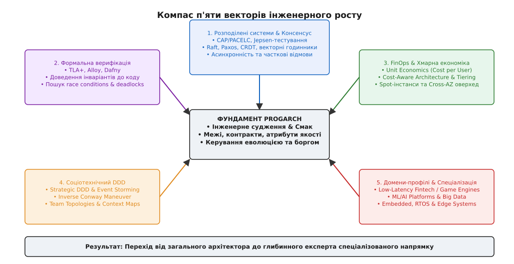
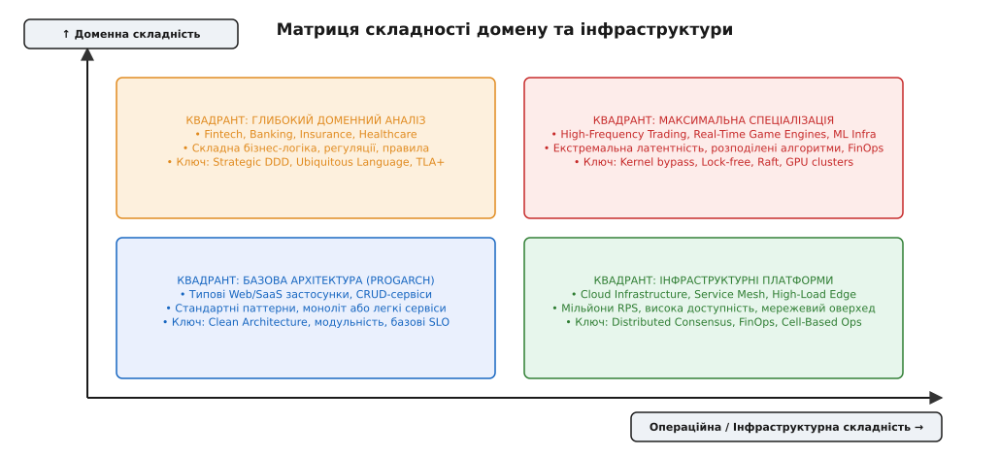
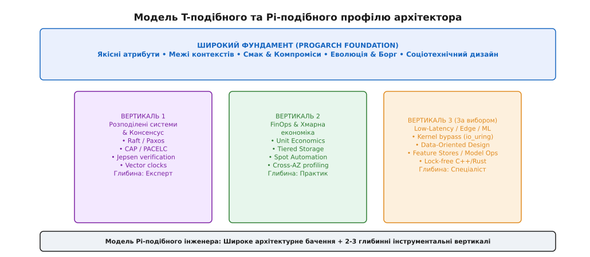

# Куди рости після progarch

<preknowlist>
- [Архітектурний смак](root:progarch/architect-taste) — інтуїція компромісу та боротьба з надлишковою складністю.
- [Соціотехнічний дизайн й еволюція оргструктури](root:progarch/capstone-org-evolution) — зворотний маневр Конвея та оновлення топології команд.
- [Масштабування, безпека та операційна стійкість](root:progarch/capstone-scale-secure-ops) — клітинна архітектура, budget-burn та резильєнтність.
- [Еволюція систем і міграційні вибори](root:progarch/migration-choice) — розщеплення моноліту та керування технічним боргом.
</preknowlist>

Платформа Digital Homes (DH) пройшла еволюційний шлях від єдиного давача й монолітного хаба у прототипі до географічно розподіленої клітинної архітектури із суворими бюджетами вигорання помилок, автоматичним канарейковим розгортанням і дбайливо ізольованими контекстами. Інженерна команда опанувала мову якісних атрибутів, навчилася розраховувати ціну незворотних рішень і проводити межі там, де зчеплення коду стає руйнівним. Проте під час спроби масштабувати ту саму систему на нові суміжні домени — наприклад, під вихід на високочастотний енергоринок із вимогами щодо реакції у 5 мілісекунд чи під автономні медичні контролери із захистом від фізичної загрози життю — інженери виявляють, що загальних знань з системної архітектури вже недостатньо. Загальні патерни дають каркас судження, але не вирішують фундаментальних фізичних, математичних та економічних обмежень конкретного домену.


*Компас подальшого росту: після вивчення фундаментальних архітектурних компромісів інженерний розвиток розгалужується на п'ять спеціалізованих векторів.*

## 1. Межа універсальної архітектури та перехід до спеціалізації

Фундаментальний курс архітектури дає універсальну оптику. Він навчає ставити правильно сформульовані запитання: Який радіус вибуху цієї відмови? Яка ціна відкату цього рішення? Як межі модулів співвідносяться з межами команд? Цей фундамент універсальний, оскільки компроміс між латентністю, консистентністю та вартістю виникає у будь-якій програмній системі незалежно від мови програмування чи хмарного провайдера.

Проте універсальність має межу. Коли система стикається з крайніми вимогами (extreme requirements), джерело складності зміщується із загальної структури коду у вузькоспеціалізовані дисципліни. За спробою спроєктувати розподілену базу даних без знання теорії консенсусу ховається не брак «чистоти коду», а математична неможливість. За рахунком від AWS на пів мільйона доларів на місяць ховається не неохайний алгоритм, а відсутність вартісно-свідомого дизайну (Cost-Aware Architecture).

Подальший розвиток інженера після проходження фундаментального курсу перестає бути лінійним накопиченням загальних знань. Він розгалужується на п'ять глибинних векторів поглиблення:

1. **Теорія розподілених систем і консенсус (Distributed Systems & Consensus).**
2. **Формальна верифікація та специфікація (Formal Methods & Specification).**
3. **Фінансово-архітектурний аналіз та хмарна економіка (FinOps & Infrastructure Economics).**
4. **Соціотехнічний дизайн та глибокий доменний аналіз (Socio-Technical Systems & Strategic DDD).**
5. **Спеціалізовані домени-профілі (Specialized Domain Archetypes).**

## 2. Напрямок 1: Розподілені системи та теорія консенсусу

У монолітному застосунку стан передається через спільну оперативну пам'ять, а порядок подій визначається центральним процесором. У розподіленій системі стан роздрібнений між десятками або сотнями вузлів, які спілкуються через асинхронну мережу. Мережа за своєю фізичною природою є ненадійною: байти губляться, затримуються на невизначений час або дублюються, а вузли можуть у будь-який момент зазнати краху або тимчасового замерзання через збір сміття (GC pauses).

### Нелінійність мережі та відсутність фізичного часу

Перша пастка недосвідченого архітектора — намагання спиратися на системний годинник (wall-clock time) для визначення порядку подій у різних датацентрах. Ефект дрейфу кварцових резонаторів (clock drift) гарантує, що годинники на двох серверах завжди розходяться на кілька мілісекунд або секунд. Якщо вузол А записав транзакцію о 12:00:00.001, а вузол Б о 12:00:00.000, це не означає, що подія А сталася пізніше за подію Б.

Розуміння цієї межі вимагає переходу від фізичного часу до **логічного часу** (Logical Clocks) та **векторних годинників** (Vector Clocks). Подія визначається не метрикою годинника на стіні, а причинно-наслідковим відношенням «передувало» (happened-before relation).

```
Вузол A: [v1: (A:1)] ─── (надсилання) ───► [v2: (A:2)]
                                              │
                                              ▼ (мережевий переліт)
Вузол B: [v1: (B:1)] ────────────────────► [v3: (A:2, B:2)] (злиття причинності)
```

Математично відношення `a → b` означає, що подія `a` сталася раніше за подію `b` й могла вплинути на її результат. Якщо ані `a → b`, ані `b → a` не справджуються, події вважаються **паралельними** (concurrent, `a || b`). Векторний годинник зберігає масив лічильників дій кожного вузла. Злиття векторів виконується як покомпонентний максимум:

```
V_merged[i] = max(V_local[i], V_received[i])
```

### Моделі узгодженості: від Strong Consistency до CRDT

Розподілений консенсус (лат. *consensus* — згода) — це процедура прийняття єдиного значення групою незалежних вузлів. Згідно з **теоремою CAP** (Consistency, Availability, Partition Tolerance) та її розширенням **PACELC** (якщо є мережеве розщеплення P, вибираємо між Availability та Consistency; інакше E, коли мережа нормальна, вибираємо між Latency та Consistency), система не може одночасно забезпечити миттєву строгу узгодженість і низьку латентність.

Архітектор розподілених систем обирає між кількома фундаментальними моделями:
- **Строга узгодженість (Strong Consistency / Linearizability):** Будь-яке читання повертає останнє записане значення. Вимагає кворумних алгоритмів консенсусу (Raft, Paxos). Цей вибір купує простоту розуміння ціною додаткових мережевих затримок (round-trips).
- **Кінцева узгодженість (Eventual Consistency):** Повідомлення розходяться асинхронно. Якщо нові оновлення припиняються, усі репліки врешті-решт стануть ідентичними.
- **Конфліктно-вільні репліковані типи даних (CRDT — Conflict-free Replicated Data Types):** Математичні структури даних (лічильники, множини, карти), які дозволяють паралельне оновлення на різних вузлах без центрального координатора. Злиття станів (merge operation) є комутативним, асоціативним та ідемпотентним, що гарантує сходження до єдиного стану без блокувань.

```
       ┌────────────────────────────────────────────────────────┐
       │                 Розподілений консенсус                 │
       └───────────────────────────┬────────────────────────────┘
                                   │
                 ┌─────────────────┴─────────────────┐
                 ▼                                   ▼
   Строгий кворум (Raft/Paxos)          Кінцева узгодженість (CRDT)
   • Гарантія Linearizability           • Висока доступність без блокувань
   • Плата: Затримка мережі (RTT)       • Плата: Складність злиття станів
```

Для верифікації реальних розподілених алгоритмів під умовами мережевого хаосу (втрата пакетів, асиметричні розриви, затримки) використовують фреймворки типу **Jepsen**. Вони показують, як «строгі» бази даних тихо втрачають оновлення під час часткових відмов.

> 🔧 **Навіщо це.** Без глибокого розуміння теорії консенсусу спроба побудувати розподілений транзакційний сервіс закінчується прихованими втратами фінансових даних під час першого ж мережевого розщеплення між хмарними зонами.

## 3. Напрямок 2: Формальна верифікація та специфікація

Традиційний підхід до перевірки якості коду опирається на тестування: юніт-тести, інтеграційні тести, симуляції. Проте тестування здатне показати лише наявність помилок, але ніколи не доводить їх відсутність. У паралельних і розподілених системах кількість можливих станів зростає як факторіал від кількості подій (state space explosion). Людина не здатна уявити комбінацію з 40 кроків, яка призводить до стану dead-lock у продакшні раз на шість місяців.

### Математичне доведення замість здогадів

Формальна верифікація (лат. *formalis* — за формою, впорядкований) — це метод перевірки відповідності системи її математичній специфікації за допомогою строгих логічних виведень.

Замість написання коду мовою програмування архітектор описує *модель поведінки* мовою специфікації, такою як **TLA+** (Temporal Logic of Actions), розробленою Леслі Лампортом. Докладно про це можна прочитати в матеріалі [історія поява формальних методів і консенсусу](root:progarch/where-next/hist-formal-methods-lineage.md).

Специфікація TLA+ складається з трьох ключових елементів:
1. **Початковий стан (`Init`):** Математичний предикат над змінними системи.
2. **Крок зміни стану (`Next`):** Диз'юнкція можливих дій, які переводять систему зі стану `S` у стан `S'`.
3. **Інваріанти (Invariants):** Умови, які повинні виконуватися у **кожному** досяжному стані (наприклад, `Len(buffer) <= MaxSize` або `MoneyTotal == Constant`).

```
---------------------------- MODULE BufferModel ----------------------------
EXTENDS Integers, Sequences

CONSTANTS MaxCapacity
VARIABLES buffer, state

Init ≡ buffer = <<>> ∧ state = "IDLE"

Produce(item) ≡ ∧ Len(buffer) < MaxCapacity
                ∧ buffer' = Append(buffer, item)
                ∧ state' = "PRODUCED"

Consume ≡ ∧ Len(buffer) > 0
          ∧ buffer' = Tail(buffer)
          ∧ state' = "CONSUMED"

Next ≡ ∃ item ∈ {1, 2}: Produce(item) ∨ Consume

InvariantNoOverflow ≡ Len(buffer) <= MaxCapacity
=============================================================================
```

Логіка дій ділить властивості системи на дві категорії:
- **Безпека (Safety):** «Нічого поганого не станеться у системі» (`□P` — завжди P). Приклад: два процеси не можуть одночасно увійти у критичну секцію.
- **Живучість (Liveness):** «Щось добре врешті-решт станеться» (`◇Q` — колись Q). Приклад: надісланий запит врешті-решт отримає відповідь.

Інструмент **TLC Model Checker** повністю обходить весь простір станів заданої моделі. Якщо існує бодай один маршрут виконання, який порушує `InvariantNoOverflow`, TLC зупиняється й демонструє точний контрприклад (trace) кроків від `Init` до помилки.

### Спектр формальних інструментів

Формальні методы не обмежені лише TLA+:
- **Alloy:** Мова структурної специфікації, яка вирізняється візуалізацією графів станів і підходить для моделювання складних реляційних доменних моделей та меж контекстів.
- **Dafny:** Мова програмування зі вбудованим верифікатором коду, яка вимагає від розробника завдання предумов (`requires`), постумов (`ensures`) та інваріантів циклів (`invariant`). Компайлер математично доводить коректність реалізації до її збірки.
- **PRISM:** Ймовірнісний модель-чекер для оцінки надійності та стійкості систем із випадковими відмовами.

Застосування формальних методів у компаніях рівня AWS, MongoDB та Microsoft довело: проведення 2-3 днів за специфікацією TLA+ перед написанням коду економить місяці складного налагодження розподілених гонок у продакшні.

## 4. Напрямок 3: FinOps та економіка хмарних ресурсів

Архітектура коду не існує у відриві від фінансової реальності бізнесу. Рішення, яке є ідеальним з точки зору мінімізації латентності (наприклад, дублювання даних у п'яти регіонах із постійним гарячим синхронним опитуванням), може виявитися інженерно банкротним, якщо воно спалює весь прибуток компанії.

FinOps (англ. *Financial Operations* — фінансові операції) — це інженерно-управлінська дисципліна, яка впроваджує вартісну свідомість (Cost Awareness) безпосередньо у процес прийняття архітектурних рішень.

### Одиниця вартості (Unit Economics)

Головний метричний важіль FinOps — це **одиниця вартості** (Unit Cost). Архітектор оцінює інфраструктуру не абстрактною сумою рахунку від AWS за місяць, а співвідношенням витрат до бізнес-метрики:

```
                  Загальні витрати на інфраструктуру ($)
Unit Cost = ───────────────────────────────────────────────────
            Кількість активних користувачів / Транзакцій (N)
```

Якщо при подвоєнні кількості користувачів `Unit Cost` зростає, а не падає, це ознака архітектурної неефективності: система має нелінійну випадкову складність або некоректно обрані рівні ресурсів.


*Матриця спеціалізації: вибір напрямку росту залежить від того, де лежить головне джерело складності — у бізнес-домені чи інфраструктурному середовищі.*

### Вартісно-свідомий дизайн (Cost-Aware Architecture)

Оптимізація витрат охоплює наступні архітектурні межі:
1. **Багаторівневе зберігання даних (Tiered Storage):** Поділ даних на гарячі (Hot — NVMe/RAM), теплі (Warm — SSD) та холодні (Cold / Glacier — S3). Автоматичне переміщення логів і старих телеметричних записів позбавляє від потреби тримати дорогі бази даних для архівних матеріалів.
2. **Локалізація трафіку (Cross-AZ Traffic Elimination):** Передавання даних між різними зонами доступності (Availability Zones) у межах одного хмарного регіону є платною операцією. Необачне розміщення мікросервісів, при якому кожен HTTP-запит тричі перетинає межу AZ, створює прихований витік бюджету.
3. **Градієнтне обмеження та деградація:** Впровадження вартісно-свідомих обмежувачів (Cost-Aware Rate Limiters), які аналізують фінансову вагу запиту й блокують ресурсоємні виклики під час сплесків.

Для практичного освоєння цього підходу підготовлено [практичний харнес для розрахунку вартісно-свідомого розподілу ресурсів](root:progarch/where-next/proj-cost-aware-arch-harness.md).

## 5. Напрямок 4: Соціотехнічний дизайн та доменний аналіз

Архітектурні патерни коду деградують, якщо вони не відповідають структурі людської організації, яка їх створює та підтримує. Поєднання стратегічного доменного аналізу (Strategic DDD) та соціотехнічного дизайну створює місток між бізнес-моделлю компанії та її розробкою.

### Стратегічний DDD та Event Storming

Аналіз складної предметної області починається з формування **єдиної мови** (Ubiquitous Language) — словника термінів, який використовується однаково як бізнес-експертами, так і в коді. 

Далі застосовується **стратегічний DDD**:
- **Обмежений контекст (Bounded Context):** Границя, всередині якої доменна модель має абсолютну синтаксичну та семантичну цілісність. Поняття «Користувач» у контексті авторизації — це токен та пароль; у контексті білінгу — це банківські реквізити та баланс; у контексті доставки — це фізична адреса. Намагання створити «єдину універсальну модель Користувача» для всієї компанії створює монолітне зчеплення.
- **Мапа контекстів (Context Map):** Опис відносин між контекстами (Upstream/Downstream, Customer/Supplier, Shared Kernel, Anti-Corruption Layer).

Паттерни інтеграції контекстів варіюються від тісного зчеплення до повної автономії:
- **Shared Kernel:** Спільний фрагмент коду чи схеми бази (високий ризик зчеплення).
- **Anti-Corruption Layer (ACL):** Захисний шар-транслятор, який конвертує чужі DTO у внутрішні чисті сутності.
- **Open Host Service (OHS) / Published Language (PL):** Стандартизований публічний API для багатьох споживачів.

Для швидкого проєктування меж використовується **Event Storming** (Альберто Брандоліні) — методологія дослідження домену через моделювання послідовності подій (Domain Events), які відбуваються в бізнесі.

### Закон Конвея та Team Topologies

Мелвін Конвей у 1967 році сформулював закон, який став основою соціотехнічного дизайну:

> «Організації, які проєктують системи, обмежені створенням дизайнів, які є дзеркальними копіями структур комунікації цих організацій.»

Якщо поділити команду з 10 розробників на три групи — «фахівці з бази даних», «розробники бекенду» та «розробники фронтенду», система неминуче перетвориться на тришаровий моноліт з високим зчепленням.

**Обернений маневр Конвея (Inverse Conway Maneuver):** Архітектор спочатку проєктує бажану цільову архітектуру коду (ізольовані сервіси з чіткими межами), а потім перебудовує оргструктуру команд під цю архітектуру.

Згідно з концепцією **Team Topologies** (Меттью Скелтон, Мануель Пайс), команди діляться на чотири чіткі типи:
1. **Stream-aligned teams:** Автономні команди, що відповідають за один наскрізний потік цінності для користувача.
2. **Enabling teams:** Експертні групи, які допомагають потоковим командам опановувати нові технології чи інструменти.
3. **Complicated-subsystem teams:** Команди, що розробляють вузькоспеціалізовані глибокі математичні або алгоритмічні модулі (наприклад, відеокодек чи криптографічне ядро).
4. **Platform teams:** Команди, що надають внутрішню платформу як сервіс (PaaS/Self-Service), зменшуючи когнітивне навантаження на потокові команди.

```
┌────────────────────────────────────────────────────────────────────────┐
│                        Stream-Aligned Teams                            │
│   [Потік бізнес-фіч A]     [Потік бізнес-фіч B]    [Потік бізнес-фіч C]  │
└──────────────┬────────────────────────┬───────────────────┬────────────┘
               │                        │                   │
               ▼                        ▼                   ▼
┌────────────────────────────────────────────────────────────────────────┐
│                        Platform Team (PaaS)                            │
│   • Самообслуговування (Self-Service Infrastructure & CI/CD)           │
│   • Зменшення когнітивного навантаження на потокові команди           │
└────────────────────────────────────────────────────────────────────────┘
```

## 6. Напрямок 5: Спеціалізовані домени-профілі

Після проходження фундаментального рівня архітектор обирає один або два доменні профілі, де вимоги до продуктивності або специфіки даних досягають граничних значень.

### 1. High-Frequency Trading (HFT) та Low-Latency Systems
У системах високочастотної торгівлі та ядерних телеком-маршрутизаторах рахунок іде на наносекунди. Загальні абстракції high-level мов з автоматичним збиранням сміття стають неприйнятними.
- **Особливості:** Відмова від динамічного виділення пам'яті у рантаймі (Zero-Allocation), використання lock-free структур даних (Disruptor ring buffers), обхід ядра операційної системи (Kernel Bypass через DPDK або `io_uring`), прив'язка потоків до ядер CPU (CPU pinning) та оптимізація під промахи L1/L2/L3 кешів.

### 2. Gamedev та Graphics Engine Architecture
Ігрові рушії обробляють десятки тисяч об'єктів у реальному часі із суворим фреймрейтом (60 FPS = 16.6 мс на кадр, 120 FPS = 8.33 мс).
- **Особливості:** Відмова від класичного ООП на користь **Data-Oriented Design (DOD)** та **Entity Component System (ECS)**. Дані зберігаються у плоских масивах у пам'яті (Structure of Arrays замість Array of Structures) для забезпечення максимальної кеш-локальності (Cache Locality) процесора.

### 3. ML/AI Platforms & Big Data Infrastructure
Розгортання та обслуговування великих мовних моделей (LLM) та аналітичних плаформ вимагає роботи з вектором даних у петабайтних масштабах.
- **Особливості:** Побудова Feature Stores, інфраструктура для боротьби з дрейфом даних (Data Drift), оркестрація розподілених GPU-кластерів, lineage оновлення моделей та асинхронне потокове оброблення через Apache Flink чи Spark.

### 4. Embedded, IoT & Edge Computing
Розробка прошивок для мікроконтролерів і бортових систем діє у жорстких обмеженнях обсягу оперативної пам'яті (кілобайти) та енергоспоживання.
- **Особливості:** Операційні системи реального часу (RTOS — FreeRTOS, Zephyr), керування режимами глибокого сну (Deep Sleep), апаратні переривання (ISR), роботу з периферійними шинами (SPI, I2C, CAN) та захищені оновлення прошивки по повітрю (OTA).

## 7. Траєкторія T-подібного фахівця та фундаментальна поличка книг

Еволюція архітектора підпорядковується моделі **T-подібного** (або **Pi-подібного**) профілю. 


*T-подібний та Pi-подібний профіль: фундаментальний горизонтальний пласт курсів системної архітектури доповнюється глибокими вертикальними спеціалізаціями.*

Горизонтальна риска T-подібного профілю — це фундаментальний пласт, отриманий у курсі `progarch`:
- Вимірюваність якісних атрибутів і сценаріїв.
- Проведення меж та керування зчепленням (Coupling & Cohesion).
- Дисципліна прийняття та фіксації рішень (ADR, трейд-оффи).
- Боротьба з ерозією та надлишковою складністю.

Вертикальні ніжки — це 1-2 обрані спеціалізації, де інженер досягає рівня експерта (наприклад, теорія консенсусу + FinOps або соціотехнічний DDD + Low-Latency).

### Фундаментальна поличка книг для подальшого читання

Для систематичного занурення у кожен напрямок рекомендовано опрацювати наступні класичні праці:

1. **Розподілені системи:**
   - Martin Kleppmann — *Designing Data-Intensive Applications* (Фундамент устрою баз даних, реплікації, партиціювання та консенсусу).
   - Alex Petrov — *Database Internals* (Глибокий розбір деталей сховищ, B-Trees, LSM-Trees та розподілених протоколів).
2. **Формальна верифікація:**
   - Leslie Lamport — *Specifying Systems: The TLA+ Language and Tools for Hardware and Software Engineers* (Базовий підручник з математичного моделювання систем від автора TLA+).
   - Daniel Jackson — *Software Abstractions: Logic, Language, and Analysis* (Практичний посібник з використання мови Alloy).
3. **Соціотехнічний дизайн та DDD:**
   - Eric Evans — *Domain-Driven Design: Tackling Complexity in the Heart of Software* (Канонічна праця зі стратегічного та тактичного DDD).
   - Matthew Skelton, Manuel Pais — *Team Topologies: Organizing Business and Technology Teams for Fast Flow* (Практичне керівництво з соціотехнічної організації команд).
4. **Архітектурний смак та простота:**
   - Rich Hickey — *Simple Made Easy* (Фундаментальна доповідь про різницю між Simple та Easy).
   - Fred Brooks — *The Mythical Man-Month* (Класика про управління складністю програмних проєктів та закон Брукса).

Шлях архітектора не має кінцевої точки зупинки. Зрілість проявляється не у прагненні вивчити всі наявні фреймворки чи інструменти, а у здатності бачити крізь синтаксичний шум фундаментальні фізичні й математичні закони системи, зберігати інженерну чесність перед бізнесом і постійно плекати професійний смак до елегантної простоти.
