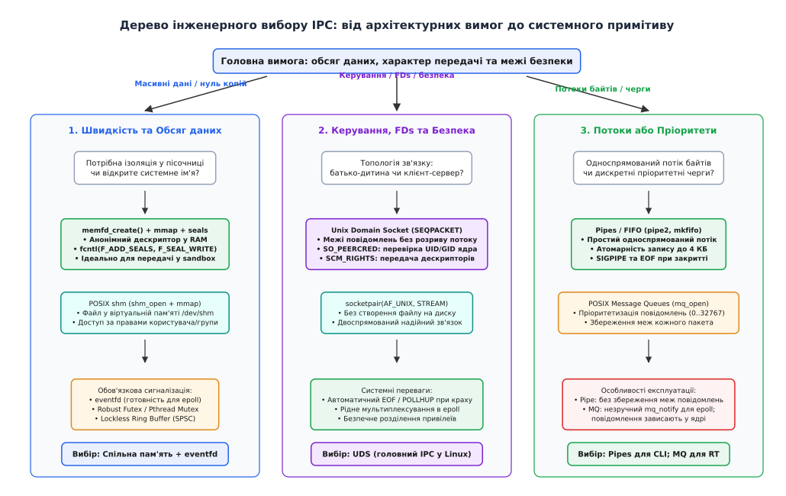
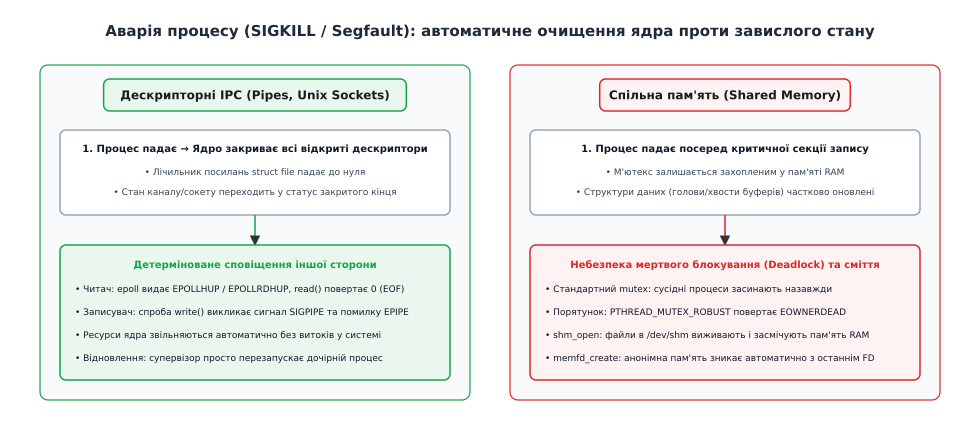
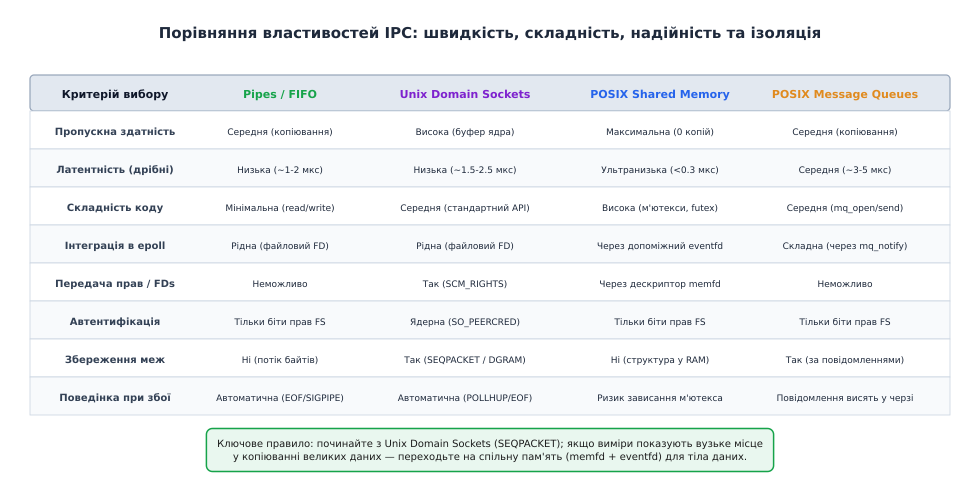

# Як обрати спосіб взаємодії під задачу

<preknowlist>
- [Віртуальний адресний простір](book:unix-linux/virtual-address-space) — кожен процес ізольований у власній таблиці відображень, тому прямий обмін покажчиками неможливий.
- [Файловий дескриптор](book:unix-linux/file-descriptor) — числовий індекс у системній таблиці відкритого вводу-виводу процесу.
- [Системний виклик](book:unix-linux/syscall-mechanics) — перехід із простору користувача в ядро та вартість перемикання контексту.
- [Канали й FIFO](book:unix-linux/pipe-and-fifo) — односпрямовані кільцеві буфери ядра зі збереженням черговості байтів.
- [Сокети домену Unix](book:unix-linux/unix-domain-sockets) — двоспрямований обмін, передача дескрипторів `SCM_RIGHTS` та автентифікація через `SO_PEERCRED`.
- [Спільна пам'ять POSIX](book:unix-linux/posix-shared-memory) — нульове копіювання через відображення спільних фізичних сторінок у таблиці кількох процесів.
- [Черги повідомлень](book:unix-linux/message-queues) — структуровані повідомлення з пріоритетами, атомарними межами та сповіщеннями.
- [eventfd і futex](book:unix-linux/eventfd-and-futex) — синхронізація в просторі користувача без переходів у ядро в неконкурентному режимі.
- [select, poll, epoll](book:unix-linux/select-poll-epoll) — мультиплексування багатьох дескрипторів в єдиному циклі подій.
</preknowlist>

Архітектура сучасного графічного браузера, медіасервера чи системного демона розподіляє задачі між ізольованими процесами: мережевий шлюз приймає вхідні пакети, наглядач керує правами, пісочниця парсить ненадійний контент, а рушій рендерингу формує піксельні кадри. Якщо для передачі відеопотоку у форматі 4K зі швидкістю 60 кадрів/с обрати звичайний конвеєр `pipe`, ядро змушене двічі копіювати понад 1.4 ГБ/с сирих пікселів через кільцевий буфер розміром 64 КБ, виконуючи понад 23 000 системних викликів щосекунди і спалюючи чверть процесорного ядра виключно на марне перекладання байтів між буферами. Навпаки, якщо спробувати організувати протокол керування та зміни прав між процесами через спільну пам'ять, аварійне завершення дочірньої програми заблокує спільний м'ютекс, викличе стан гонитви (TOCTOU) і позбавить ядро можливості перевірити автентичність відправника.

Помилка у виборі примітиву міжпроцесної взаємодії (англ. *Inter-Process Communication*, скорочено IPC; від лат. *communicare* — «робити спільним») або паралізує продуктивність системи, або перетворює надійність на крихку конструкцію, що руйнується від першого збою. Щоб обрати точний інструмент під конкретну інженерну задачу, потрібно оцінювати примітиви не за списками назв із документації, а за п'ятьма фундаментальними осями: способом зустрічі, кількістю копіювань байтів, збереженням меж повідомлень, інтеграцією в цикл подій та поведінкою при аварійних відмовах.

## Два фізичні шляхи перенесення даних: копіювання проти відображення

Фундаментальна ізоляція процесів у захищеному режимі роботи процесора спирається на те, що кожна програма володіє власною таблицею сторінок віртуальної пам'яті (англ. *Page Table*). Адреса `0x7ffe00401000` у процесі `A` і та сама адреса `0x7ffe00401000` у процесі `B` фізично вказують на абсолютно різні кадри оперативної пам'яті (DRAM). Передати покажчик на структуру через будь-який канал неможливо: для іншого процесу це число буде або вказувати на сміття, або призведе до аварійного завершення із сигналом `SIGSEGV`.

Усі наявні механізми перенесення даних між процесами в ядрі Linux зводяться до двох взаємовиключних підходів.

```
1. Модель із копіюванням через буфер ядра (Pipes, Sockets, Message Queues):
   [Процес A]                [Простір ядра]                [Процес B]
   +-----------+   write()   +---------------+   read()    +-----------+
   | Буфер RAM | ----------> |  Буфер ядра   | ----------> | Буфер RAM |
   +-----------+ (копія 1)   | (кільце стор) | (копія 2)   +-----------+
                             +---------------+

2. Модель із спільним відображенням сторінок (Shared Memory / memfd):
   [Процес A: Вірт. пам'ять]                      [Процес B: Вірт. пам'ять]
   +-----------------------+                      +-----------------------+
   | 0x7f00... (Сторінка)  |                      | 0x7f88... (Сторінка)  |
   +-----------+-----------+                      +-----------+-----------+
               \                                              /
                \  Відображення через Page Table (mmap)      /
                 +-------------------+----------------------+
                                     v
                        [Фізична сторінка DRAM]
                        (Дані пишуться без копій)
```

### Модель із проміжним копіюванням через ядро

Канали (`pipe`, `FIFO`), сокети домену Unix (`AF_UNIX`) та черги повідомлень (`POSIX mq`) працюють через проміжний буфер ядра:

1. Процес-відправник передає покажчик на свій буфер у системному виклику `write()` або `sendmsg()`.
2. Ядро здійснює перехід у режим суперкористувача (Syscall context switch), перевіряє права доступу та копіює байти з віртуального простору відправника у внутрішній буфер ядра за допомогою функції `copy_from_user()`.
3. Коли процес-отримувач викликає `read()` або `recvmsg()`, ядро виконує другу операцію `copy_to_user()`, переносячи дані з ядерного буфера у віртуальну пам'ять отримувача.

Внутрішня структура каналу в ядрі базується на структурі `struct pipe_inode_info`, яка містить кільцевий масив сторінкових дескрипторів `struct pipe_buffer`. За замовчуванням у Linux ємність каналу становить 16 сторінок по 4096 байтів (загалом 65 536 байтів або 64 КБ). Щойно записувач заповнює ці 16 сторінок, ядро призупиняє потік виконання процесу, переводячи його в чергу очікування `pipe_wait`, доки читач не вичистить хоча б одну сторінку.

**Переваги підходу**:
* **Повна ізоляція**: процеси не мають спільної пам'яті. Навіть якщо відправник негайно перезапише чи звільнить свій буфер після `write()`, дані в ядрі залишаються цілісними.
* **Автоматична синхронізація**: ядро саме призупиняє читача, якщо буфер порожній, і блокує відправника, якщо буфер заповнений.

**Ціна підходу**: дві операції `memcpy` та щонайменше два системні виклики на кожну транзакцію.

### Модель нульового копіювання (Zero-Copy Shared Memory)

Спільна пам'ять (`shm_open` або `memfd_create` у поєднанні з `mmap`) діє інакше. Ядро налаштовує таблиці сторінок обох процесів так, що різні віртуальні адреси в обох адресних просторах відображаються на **ті самі фізичні кадри оперативної пам'яті**.

Коли процес викликає `mmap()` із прапорцем `MAP_SHARED`, підсистема керування віртуальною пам'яттю ядра створює структуру `struct vm_area_struct`. Фізичні сторінки виділяються у віртуальній файловій системі `tmpfs` (shmem).

Щойно процес `A` записує байти в пам'ять за своєю адресою, процесор завантажує їх у кеш L1/L2/L3, і процес `B` бачить зміни негайно, без жодного системного виклику та без участі ядра операційної системи.

### Апаратна фізика: кеші процесора, фальшиве розділення та бар'єри

Робота зі спільною пам'яттю переносить відповідальність за узгодженість даних із ядра операційної системи безпосередньо на апаратний рівень процесора. У сучасних багатоядерних процесорах кожне ядро має власні кеші першого та другого рівнів (L1/L2), а кеш третього рівня (L3) зазвичай є спільним.

Коли процес `A` на ядрі 0 записує нове значення у спільну змінну, апаратний протокол когерентності кешів (наприклад, MESI або MOESI) змушений інвалідувати відповідну 64-байтну лінію кешу (Cache Line) в кеші ядра 1, де виконується процес `B`. Цей процес породжує два критичні явища:

1. **Фальшиве розділення ліній кешу (False Sharing)**: якщо вказівник голови кільцевого буфера (`head`) і вказівник хвоста (`tail`) лежать поруч у пам'яті всередині однієї 64-байтної лінії кешу, запис відправника в `head` буде постійно вибивати лінію кешу читача, який модифікує `tail`. Обидва процесори починають безперервно перезавантажувати лінію через шину пам'яті (Cache Line Bouncing), що сповільнює обмін у 5–10 разів. Для усунення цього дефекту змінні синхронізації вирівнюють на межу окремої лінії кешу (`alignas(64)` або 128 байтів).
2. **Апаратні бар'єри пам'яті (Memory Barriers)**: сучасні процесори виконують інструкції позачергово (Out-of-Order Execution) для максимальної утилізації конвеєра. Відправник може записати корисне навантаження в буфер, а потім оновити лічильник готовності. Проте процесор або компілятор мають право переставити ці операції місцями, якщо не вказано явний бар'єр пам'яті. В результаті читач може побачити оновлений прапорець готовності раніше, ніж байти корисного навантаження фізично оновляться в оперативній пам'яті. Безпечна реалізація вимагає використання атомарних операцій із семантикою Acquire-Release.

### Розрахунок граничного розміру користі (Cost Model)

Чому спільну пам'ять не використовують для абсолютно всіх задач, якщо вона не потребує копіювання? Тому що спільна пам'ять **не містить механізму сповіщення**. Коли процес записав байти, він повинен якось повідомити сусіда: «дані готові, читай». Для цього доводиться задіювати `eventfd`, `futex` або атомарні змінні, що створює власні накладні витрати на між'ядерну синхронізацію кешів.

**Порівняльний розрахунок вартості передачі повідомлення розміром 64 байти проти 1 мегабайта:**

```
Випадок 1: Коротке керуюче повідомлення (64 байти)
• Unix Domain Socket:
  Syscall send() + copy_from_user (64 Б) + Syscall recv() + copy_to_user (64 Б)
  Час виконання: ~1.2 мкс
• Shared Memory + eventfd:
  Запис у RAM (64 Б) + Syscall write(eventfd) + Syscall read(eventfd) + бар'єр пам'яті
  Час виконання: ~1.1 мкс
  -> Виграш нульовий, але складність коду спільної пам'яті в рази вища.

Випадок 2: Масивний буфер даних (1 МБ)
• Unix Domain Socket:
  Syscall send() + copy (1 МБ) + Syscall recv() + copy (1 МБ)
  Швидкість memcpy = 10 ГБ/с -> 2 МБ копіювання = 200 мкс роботи процесора!
• Shared Memory + eventfd:
  Запис у RAM (1 МБ) + Syscall write(eventfd, 8 Б) + Syscall read(eventfd, 8 Б)
  Час сигналізації: ~1.1 мкс (копіювання відсутнє, дані вже у фізичній пам'яті)
  -> Прискорення на два порядки (у 180 разів!).
```

Інженерний поріг переходу: для повідомлень розміром **до 8–16 кілобайтів** перевагу мають сокети та канали; для повідомлень та структур розміром **понад 64 кілобайти** безальтернативно перемагає спільна пам'ять.

### Передача без копіювання через виклики splice та vmsplice

Між двома полюсами — повним копіюванням та спільною пам'яттю — в ядрі Linux існує проміжний механізм передачі даних безпосередньо між дескрипторами без завантаження байтів у простір користувача: системні виклики `splice()`, `vmsplice()` та `tee()`.

Виклик `splice()` дозволяє перекачувати дані між каналом `pipe` та мережевим або файловим сокетом. Ядро не копіює дані: воно переставляє посилання на фізичні сторінки (`struct page`) із кільцевого буфера каналу у буфер сокета. Виклик `vmsplice()` дозволяє процесу відобразити буфер із простору користувача безпосередньо в канал у режимі нульового копіювання. Проте цей механізм накладає суворі обмеження: пам'ять повинна бути вирівняна по межах сторінок, а відправник не має права змінювати буфер доти, доки читач не завершить його обробку, що вимагає складного блокування сторінок ядра (Page Pinning).

## Безблокувальний обмін у спільній пам'яті: кільцеві буфери SPSC

Для досягнення граничної пропускної здатності в спільній пам'яті без використання м'ютексів та системних викликів `futex` застосовують архітектуру односпрямованого кільцевого буфера для одного відправника й одного отримувача (Single-Producer Single-Consumer, SPSC).

У цій моделі пам'ять ділиться на масив слотів фіксованого розміру та дві атомарні змінні:
* `head`: числовий індекс, який інкрементується виключно процесом-відправником.
* `tail`: числовий індекс, який інкрементується виключно процесом-отримувачем.

Оскільки кожен індекс модифікується рівно одним процесом, операції не вимагають блокувань (Lock-Free). Відправник перевіряє умову наявності вільного місця: `(head - tail) < CAPACITY`. Якщо місце є, він записує дані у слот за індексом `head & (CAPACITY - 1)` і публікує новий `head` за допомогою атомарного збереження з упорядкуванням `memory_order_release`. Отримувач зчитує `head` за допомогою `memory_order_acquire`, забирає дані зі слота `tail & (CAPACITY - 1)` і оновлює `tail`.

Використання розміру буфера, що є степенем двійки (`CAPACITY = 2^k`), дозволяє замінити повільну операцію взяття залишку від ділення `%` на швидку бітову операцію порозрядного «І» `& (CAPACITY - 1)`, що забезпечує виконання операцій публікації даних за кілька тактів процесора.

## Осі вибору: простір імен, топологія та межі ізоляції

Перше практичне питання, що постає перед розробником: як два процеси, що стартували незалежно, знаходять один одного.

```
Способи іменування та зустрічі сторін:
1. Без імені (Анонімні): pipe(), socketpair(), memfd_create()
   - Доступні тільки через успадкування у fork() або передачу через SCM_RIGHTS.
   - Максимальний захист: стороння програма не може відкрити об'єкт за назвою.

2. Ім'я у файловій системі (VFS): mkfifo(), сокети AF_UNIX (шлях на диску)
   - Використовують біти прав (mode 0600), власника (UID/GID) та каталоги.
   - Зручність адміністрування: видно через ls, видаляються через rm.

3. Абстрактний простір Linux: сокети AF_UNIX з ім'ям "\0/custom/name"
   - Не прив'язані до файлової системи, не залишають файлів після аварій.
   - Межа: доступні всім процесам у межах того самого Network Namespace.

4. Спеціалізовані простори IPC: /dev/shm (POSIX shm), mqueue (POSIX mq)
   - Віртуальні файлові системи ядра; об'єкти виживають після закриття програм.
```

### Розділення привілеїв: чому Unix Domain Socket є еталоном безпеки

У захищеній архітектурі (наприклад, у веб-сервері Nginx або демоні OpenSSH) головний процес працює з привілеями суперкористувача `root`, відкриває мережеві порти, читає приватні TLS-ключі, а потім створює дочірні процеси-робітники, які скидають привілеї до користувача `nobody`.

Сокети домену Unix надають дві системні можливості, яких не має жоден інший примітив IPC:

1. **Автентифікація через `SO_PEERCRED`**: коли процес викликає `getsockopt(fd, SOL_SOCKET, SO_PEERCRED, &cred, &len)`, ядро Linux повертає реальні `PID`, `UID` та `GID` процесу на іншому кінці з'єднання. Клієнт не може підробити свій UID, оскільки ці дані записуються ядром у момент встановлення з'єднання. У сучасних версіях ядра опція `SO_PEERPIDFD` додатково повертає дескриптор `pidfd`, що запобігає стану гонитви при швидкому перезапуску процесів.
2. **Передача дескрипторів через `SCM_RIGHTS`**: привілейований процес може відкрити файл конфігурації чи захищений мережевий сокет і передати готовий дескриптор у пісочницю, яка взагалі не має доступу до файлової системи через обмеження `chroot` або `seccomp`.

```
[Привілейований майстер: root]                   [Пісочниця: UID 1000, no VFS]
          |                                                    |
          | 1. open("/etc/shadow", O_RDONLY) -> FD 7          |
          | 2. sendmsg(unix_sock, SCM_RIGHTS, FD 7)           |
          | =================================================> |
          |        (Ядро створює FD 3 в таблиці дитини)        | 3. recvmsg() -> FD 3
          |                                                    | 4. Читає FD 3 напряму!
```

### Механізм збирання сміття дескрипторів у ядрі (unix_gc)

Передача дескрипторів через сокети домену Unix створює унікальний системний виклик для ядра Linux: можливість виникнення циклічних посилань. Розглянемо ситуацію, коли процес створює пару сокетів `A` і `B`. Через сокет `A` відправляється дескриптор сокета `B`, а через сокет `B` — дескриптор сокета `A`. Після цього процес закриває обидва дескриптори у своїй таблиці.

У звичайній системі підрахунку посилань лічильник відкритих файлів `f_count` для обох сокетів ніколи не досягне нуля, оскільки сокети посилаються один на одного всередині буферів повідомлень ядра (In-Flight Descriptors). Щоб уникнути незворотного витоку пам'яті та дескрипторів, у ядрі Linux реалізовано спеціальний граф-орієнтований збирач сміття `unix_gc()`. Ядро періодично будує граф посилань між сокетами в чергах і звільняє ізольовані циклічні структури.

Повний системний контракт структур `msghdr` та правила конфігурації облікових даних зведені у вставці [довідкова системна матриця примітивів взаємодії](guide:unix/choosing-ipc/api-ipc-matrix.md).

## Межі повідомлень та інтеграція в epoll

При виборі примітиву часто припускаються помилки, плутаючи потокову передачу байтів (Stream) та дискретні пакети (Datagram / Packet).

### Потік байтів проти збереження меж

* **Потокові примітиви (Pipes, FIFO, `SOCK_STREAM`)**: не мають поняття «повідомлення». Якщо процес `A` робить три виклики `write()` по 100 байтів, процес `B` під час одного виклику `read(300)` може отримати всі 300 байтів одразу, або 50 байтів у першому виклику і 250 у другому. Програміст зобов'язаний самостійно реалізувати кадрування протоколу (наприклад, передавати 4 байти довжини на початку кожного пакета).
* **Примітиви зі збереженням меж (`SOCK_DGRAM`, `SOCK_SEQPACKET`, POSIX Message Queues)**: гарантують, що один виклик `send()` відповідає рівно одному виклику `recv()`. Якщо надіслано повідомлення довжиною 128 байтів, читач отримає рівно 128 байтів.
* **Чому `SOCK_SEQPACKET` кращий за `SOCK_DGRAM`**: `SOCK_DGRAM` не гарантує послідовності доставки при переповненні буфера та тихо відкидає хвіст повідомлення, якщо буфер читача замалий. `SOCK_SEQPACKET` поєднує надійне з'єднання з контролем порядку (як у `SOCK_STREAM`) та збереження меж повідомлень (як у `SOCK_DGRAM`).

### Мультиплексування в реактивному циклі подій

Якщо сервер обслуговує 10 000 одночасних клієнтів за допомогою `epoll`, кожен канал комунікації повинен бути представлений дійсним файловим дескриптором, який генерує події `EPOLLIN`, `EPOLLOUT` та `EPOLLHUP`.

```
Сумісність із epoll_wait:
• Pipes / FIFO:            Ідеальна (рідний файловий дескриптор).
• Unix Domain Sockets:     Ідеальна (підтримує EPOLLIN, EPOLLOUT, EPOLLRDHUP).
• eventfd:                 Ідеальна (лічильник переходів для сповіщень).
• POSIX Message Queues:    Обмежена (дескриптор mqd_t у Linux працює в epoll,
                           але стандарт POSIX вимагає використання mq_notify).
• POSIX Shared Memory:     Прямо неможлива (відображена пам'ять не має дескриптора
                           готовності; вимагає обов'язкової зв'язки з eventfd).
```



*Послідовність критеріїв — від топології й безпеки до обсягу даних та аварійної поведінки — що однозначно визначає оптимальний IPC-примітив.*

## Поведінка при аваріях: стійкість до раптових відмов

Найважчий аспект експлуатації міжпроцесної взаємодії проявляється тоді, коли один із процесів аварійно завершується посеред виконання операції (отримує сигнал `SIGSEGV` через помилку пам'яті або `SIGKILL` від підсистеми OOM Killer).



*Ядро автоматично очищує дескрипторні канали та генерує EOF/SIGPIPE, тоді як спільна пам'ять вимагає робастних м'ютексів для уникнення зависання.*

### Дескрипторні канали (Pipes, Sockets): автоматичне очищення ядром

Коли процес завершується, ядро операційної системи автоматично закриває всі відкриті файлові дескриптори в його таблиці `files_struct`:
1. Якщо загинув процес-записувач, лічильник посилань на запис у каналі стає рівним нулю. Процес-читач у черзі `epoll` отримує подію `EPOLLHUP` / `EPOLLRDHUP`, а його виклик `read()` повертає `0` (ознака EOF — End of File). Читач коректно звільняє ресурси.
2. Якщо загинув процес-читач, процес-записувач при наступній спробі виконати `write()` отримує сигнал `SIGPIPE` та помилку `EPIPE`. Якщо обробник сигналу встановлено в `SIG_IGN`, виклик завершується помилкою без падіння процесу.

Ніяких завислих ресурсів, блокувань чи витоків пам'яті в системі не залишається.

### Спільна пам'ять: загроза мертвого блокування

У спільній пам'яті ядро не знає внутрішньої структури ваших даних. Якщо процес захопив спільний м'ютекс `pthread_mutex_t` і загинув до виклику `pthread_mutex_unlock()`, м'ютекс залишається замкненим назавжди. Усі інші процеси, які спробують його захопити, заснуть у черзі назавжди (Deadlock).

Для вирішення цієї проблеми стандарт POSIX вимагає конфігурації **робастних м'ютексів** (`PTHREAD_MUTEX_ROBUST`):

:::tabs
```c
/* Налаштування робастного м'ютекса у спільній пам'яті */
pthread_mutexattr_t attr;
pthread_mutexattr_init(&attr);
pthread_mutexattr_setpshared(&attr, PTHREAD_PROCESS_SHARED);
pthread_mutexattr_setrobust(&attr, PTHREAD_MUTEX_ROBUST);

pthread_mutex_t *mutex = (pthread_mutex_t*)shm_ptr;
pthread_mutex_init(mutex, &attr);
pthread_mutexattr_destroy(&attr);

/* Захоплення з обробкою аварії партнера */
int rc = pthread_mutex_lock(mutex);
if (rc == EOWNERDEAD) {
    /* Попередній власник загинув усередині критичної секції! */
    /* 1. Відновлюємо інваріанти даних (наприклад, очищаємо напівзаписаний елемент) */
    repair_inconsistent_data(shm_ptr);
    
    /* 2. Фіксуємо узгодженість м'ютекса */
    pthread_mutex_consistent(mutex);
}
/* Продовжуємо роботу у критичній секції */
do_critical_work(shm_ptr);
pthread_mutex_unlock(mutex);
```
```cpp
#include <pthread.h>
#include <system_error>
#include <cerrno>

class RobustProcessMutex {
    pthread_mutex_t* mutex_{nullptr};
public:
    explicit RobustProcessMutex(pthread_mutex_t* m) noexcept : mutex_(m) {}

    void lock_and_repair(auto&& repair_fn) {
        int rc = pthread_mutex_lock(mutex_);
        if (rc == EOWNERDEAD) {
            // Попередній процес аварійно загинув
            repair_fn();
            pthread_mutex_consistent(mutex_);
        } else if (rc != 0) {
            throw std::system_error(rc, std::generic_category(), "pthread_mutex_lock failed");
        }
    }

    void unlock() noexcept {
        pthread_mutex_unlock(mutex_);
    }
};
```
:::

## Реальні архітектури міжпроцесної взаємодії у великих проектах

Щоб побачити, як ці теоретичні принципи втілюються у промисловому програмному забезпеченні, розглянемо чотири еталонні архітектури сучасних відкритих систем:

### 1. Графічний сервер Wayland (wl_shm + Unix Domain Sockets)

У графічній підсистемі Wayland клієнтські програми малюють вікна інтерфейсу у власній пам'яті. Передавати мільйони пікселів через мережевий сокет було б катастрофічно повільно.
* **Канал керування**: сокет домену Unix (`/run/user/1000/wayland-0`), по якому передаються протокольні повідомлення (положення курсора, натискання клавіш, розміри вікна).
* **Канал графіки**: клієнт виділяє анонімний буфер через `memfd_create()`, заповнює його пікселями та передає дескриптор композитору через `SCM_RIGHTS`.
* Композитор відображає отриманий `memfd` у свій адресний простір і виводить пікселі на екран без жодної проміжної копії в ядрі.

### 2. Веб-браузер Chromium (Mojo IPC)

Браузер Chromium ізолює кожну вкладку в окремому процесі-рендерері.
* Процес рендерингу працює під суворим контролем фільтрів `seccomp-bpf` і не має доступу до файлової системи (`open()` повертає `EPERM`).
* Зв'язок із головним процесом браузера здійснюється через сокети `AF_UNIX`. Коли вкладці потрібен доступ до локального файлу чи шрифту, головний процес відкриває файл, верифікує права та відправляє готовий числовий дескриптор у пісочницю через `SCM_RIGHTS`.

### 3. Реляційна СУБД PostgreSQL

База даних PostgreSQL використовує багатопроцесну модель замість багатопотокової. Кожне клієнтське з'єднання обслуговується окремим процесом-сервером (`postgres backend`).
* Усі бекенди мають доступ до гігантського пулу сторінок даних (`Shared Buffer Pool`) через єдиний великий сегмент спільної пам'яті (`mmap` із прапорцем `MAP_SHARED`).
* Синхронізація доступу до окремих сторінок здійснюється за допомогою внутрішніх защіпок (Latches) на базі `futex` та атомарних інструкцій процесора, що забезпечує виконання сотень тисяч транзакцій на секунду без накладних витрат на системні виклики перемикання контексту.

### 4. Системний менеджер systemd (Socket Activation та fdstore)

Менеджер ініціалізації `systemd` використовує механізм сокетної активації.
* `systemd` створює сокети служб (наприклад, сокет журналу `/run/systemd/journal/socket`) до запуску відповідних демонів.
* Коли демон стартує, `systemd` передає йому вже відкриті дескриптори через фіксовані номери (дескриптор 3 і далі), повідомляючи про це через змінну середовища `LISTEN_FDS`.
* Якщо демон падає або перезапускається під час оновлення, сокети зберігаються у внутрішньому сховищі `systemd` (`fdstore`). Клієнтські запити не губляться, а накопичуються в буфері ядра, поки новий екземпляр демона перепідключається до дескриптора.

## Зведена матриця та порівняльний аналіз

Вибір інструменту є пошуком інженерного балансу між швидкістю виконання, складністю супроводу коду, межами безпеки та надійністю.



*Співвідношення ключових інженерних параметрів для основних родин міжпроцесної взаємодії.*

| Примітив | Головна перевага | Головний недолік | Типовий розмір даних | Сфера застосування |
| :--- | :--- | :--- | :--- | :--- |
| **Pipes / FIFO** | Гранична простота (`read`/`write`) | Тільки 1-в-1 потік байтів, 2 копії | До 64 КБ | Конвеєри CLI-утиліт, передача логів |
| **Unix Sockets (`SEQPACKET`)** | Межі повідомлень, `SO_PEERCRED`, передача FDs | Дві копії через ядро | До 64 КБ | Клієнт-серверні демони, керування пісочницями |
| **Shared Memory + eventfd** | Нуль копій, максимальна пропускна здатність | Складна синхронізація, ризик збоїв | Від 64 КБ до ГБ | Відеопотоки, AI-тензори, спільні кеші |
| **POSIX Message Queues** | Пріоритети (0..32767), атомарність | Складна інтеграція в epoll, витоки в ядрі | До 8 КБ | Системи реального часу (RT), диспетчери задач |

## Типові архітектурні сценарії та шаблони вибору

Щоб закріпити розуміння вибору, розглянемо чотири реальні системні задачі та обґрунтування вибору оптимального примітиву.

### Сценарій 1: Конвеєрна обробка журналів та CLI-утиліти

* **Задача**: утиліта збирає системні журнали, фільтрує рядки за регулярним виразом і записує результат у файл.
* **Вимоги**: простота реалізації, автоматичне завершення при закритті виводу, робота зі стандартними потоками `stdin`/`stdout`.
* **Оптимальний вибір**: **Анонімні канали (`pipe2`)**.
* **Чому**: стандартний інтерфейс Unix-конвеєрів (`a | b | c`), нульові накладні витрати на налаштування, автоматичний сигнал `SIGPIPE` та детекція EOF при падінні сусіднього процесу.

### Сценарій 2: Безпечний системний демон та розділення прав

* **Задача**: сервіс аутентифікації приймає запити від користувацьких додатків, перевіряє права клієнтів і делегує доступ до системних ресурсів.
* **Вимоги**: надійна верифікація особи клієнта на рівні ядра, передача відкритих дескрипторів файлів, мультиплексування тисяч під'єднань в одному потоці.
* **Оптимальний вибір**: **Сокети домену Unix (`AF_UNIX`, `SOCK_SEQPACKET`)**.
* **Чому**: ядро гарантує непідробність структури `ucred` через `SO_PEERCRED`, макроси `SCM_RIGHTS` дозволяють безпечно передати відкритий дескриптор у пісочницю, а тип `SOCK_SEQPACKET` зберігає межі запитів без необхідності парсити байти потоку.

### Сценарій 3: Графічний композитор Wayland або обробка 4K-відео

* **Задача**: віконний менеджер приймає готові кадри інтерфейсу від сотні клієнтських вікон і виводить їх на екран зі швидкістю 120 кадрів/с.
* **Вимоги**: пропускна здатність понад 3 ГБ/с, відсутність навантаження на процесор від копіювання байтів, захист сервера від зависання через некоректного клієнта.
* **Оптимальний вибір**: **Гібридна схема (`memfd_create` + `F_SEAL_WRITE` + `eventfd` + сокет керування `AF_UNIX`)**.
* **Чому**: клієнт малює вікно в анонімній пам'яті `memfd`, запечатує буфер печатками `F_SEAL_SHRINK | F_SEAL_GROW`, передає дескриптор композитору через `SCM_RIGHTS` сокета керування, а зміну кадрів сигналізує через `eventfd`. Композитор відображає пам'ять без жодної операції копіювання і захищений від зміни розміру буфера з боку клієнта.

### Сценарій 4: Вбудована телеметрія реального часу

* **Задача**: мікроконтролерний контролер дрона обмінюється критичними повідомленнями між процесом навігації та процесом стабілізації двигунів.
* **Вимоги**: гарантована доставка високопріоритетних повідомлень (команда аварійної зупинки повинна випереджати звичайні байти телеметрії).
* **Оптимальний вибір**: **POSIX Message Queues (`mq_open`, `mq_send` з атрибутом `prio`)**.
* **Чому**: ядро забезпечує впорядкування черги за пріоритетом від 0 до 32767; аварійне повідомлення з максимальним пріоритетом миттєво опиняється на початку черги, випереджаючи всі накопичені телеметричні дані.

## Пастки та крайові випадки при експлуатації

Розробка надійних розподілених систем вимагає врахування чотирьох специфічних крайових станів:

1. **Небезпека обробки сигналу `SIGPIPE`**: за замовчуванням дія сигналу `SIGPIPE` — негайне аварійне завершення процесу (`SIG_DFL`) без генерації дампу пам'яті. Якщо мережевий сервіс записує дані в сокет, клієнт якого раптово закрив з'єднання, сервер негайно падає. Промислові бібліотеки зобов'язані або встановлювати обробник `SIGPIPE` у стан `SIG_IGN`, або передавати прапорець `MSG_NOSIGNAL` у системному виклику `send()`, перевіряючи код помилки `EPIPE` вручну.
2. **Асиметрія неблокуючого відкриття FIFO**: якщо процес відкриває іменований канал `mkfifo` на читання з прапорцем `O_NONBLOCK`, виклик `open(path, O_RDONLY | O_NONBLOCK)` завершується миттєво і повертає дескриптор. Проте спроба відкрити FIFO на запис `open(path, O_WRONLY | O_NONBLOCK)` за відсутності відкритого процесу-читача негайно завершується системною помилкою `ENXIO` (No such device or address).
3. **Ліміти та витоки черг POSIX у просторах імен**: системні ліміти черг повідомлень (`/proc/sys/fs/mqueue/queues_max`) діють на весь простір імен IPC. Якщо дочірній процес у контейнері створює черги й аварійно завершується без виклику `mq_unlink()`, пам'ять черг у ядрі залишається зайнятою до перезавантаження хоста або явного видалення через псевдофайлову систему `mqueue`.
4. **Контроль зворотного тиску (Backpressure)**: якщо відправник генерує дані швидше, ніж отримувач встигає їх обробляти, буфер сокета `SO_SNDBUF` заповнюється, і наступний неблокуючий виклик повертає `EAGAIN`. Архітектура повинна підтримувати призупинення генерації даних (зняття прапорця `EPOLLOUT` у циклі подій) до моменту звільнення буфера ядром.

## Діагностика та спостереження за IPC у живій системі

Під час налагодження складних міжпроцесних архітектур критично важливо вміти відстежувати стан каналів, заповненість буферів та дескриптори процесів за допомогою системних утиліт Linux:

```
# 1. Перегляд активних сокетів домену Unix та стану черг
ss -x -a -p
# Показує inode, шлях, PID процесу та обсяг незчитаних байтів у Send-Q / Recv-Q

# 2. Інспекція відкритих дескрипторів конкретного процесу
ls -la /proc/1234/fd/
# Дескриптор каналу виглядає як pipe:[892134], сокет як socket:[892135], memfd як /memfd:ipc_buffer

# 3. Перевірка вмісту спільної пам'яті POSIX
ls -lh /dev/shm/
# Показує розмір і права створених сегментів пам'яті

# 4. Перегляд активних черг повідомлень POSIX
ls -la /dev/mqueue/
# Відображає поточну кількість повідомлень та ліміти для кожної черги

# 5. Трасування системних викликів передачі даних у реальному часі
strace -p 1234 -e trace=sendmsg,recvmsg,read,write,epoll_wait -T
# Виводить точний час виконання кожного виклику та вміст переданих дескрипторів
```

> 🔧 **Навіщо це.** В архітектурі сучасного веб-рушія Chromium кожна вкладка працює в ізольованому процесі під контролем фільтрів `seccomp`. Вкладка не має права викликати системний виклик `open()` для відкриття файлів на диску. Коли користувач завантажує файл, процес вкладки відправляє запит через Unix Domain Socket до головного процесу браузера. Головний процес перевіряє права, відкриває файл на диску і передає готовий дескриптор назад у пісочницю через `SCM_RIGHTS`. Цей шаблон унеможливлює викрадення даних навіть за умови повного злому коду рендерингу вкладки.

Повнофункціональний зразок реалізації такої гібридної системи з детальним аналізом наведено в проєктній вставці: [практична реалізація гібридного диспетчера IPC](guide:unix/choosing-ipc/proj-ipc-dispatcher.md).

## Алгоритм інженерного вибору: підсумкове правило

Під час проектування взаємодії між процесами дотримуйтесь простого покрокового алгоритму:

1. **За замовчуванням завжди починайте з Unix Domain Sockets (`SOCK_SEQPACKET` або `SOCK_STREAM`)**:
   * Ви отримуєте повну підтримку `epoll`, автоматичне очищення дескрипторів при аваріях, захист від зависань та можливість передавати дескриптори через `SCM_RIGHTS`.
2. **Якщо задача є простим односпрямованим конвеєром батько-дитина** — використовуйте звичайні **канали `pipe2()`**.
3. **Якщо виміри профілювальника показують деградацію продуктивності через копіювання великих обсягів даних (понад 64 КБ)** — виділяйте тіло даних у спільну пам'ять **`memfd_create()` з печатками `fcntl(F_ADD_SEALS)`**, залишаючи канал керування та сигналізації на базі сокетів і `eventfd`.
4. **Якщо потрібна жорстка пріоритетизація повідомлень у реальному часі** — використовуйте **POSIX Message Queues**, заздалегідь налаштувавши обробку аварійного переповнення черг.
