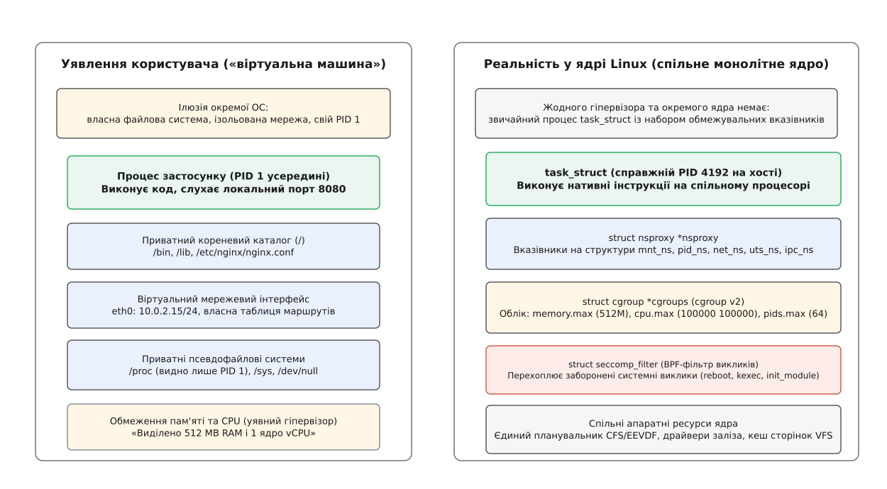
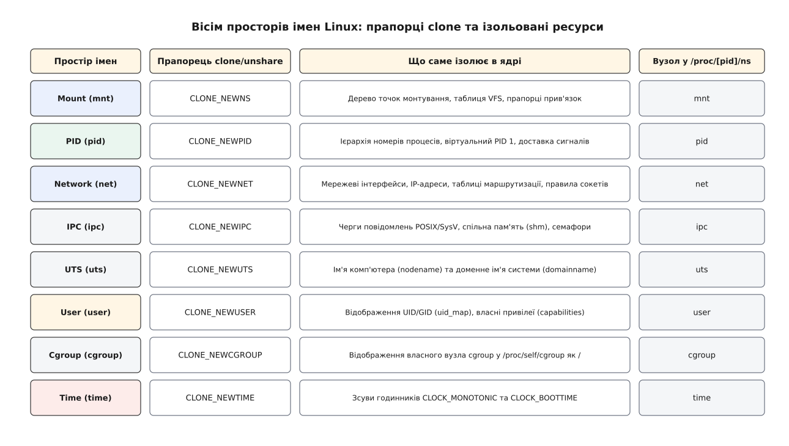
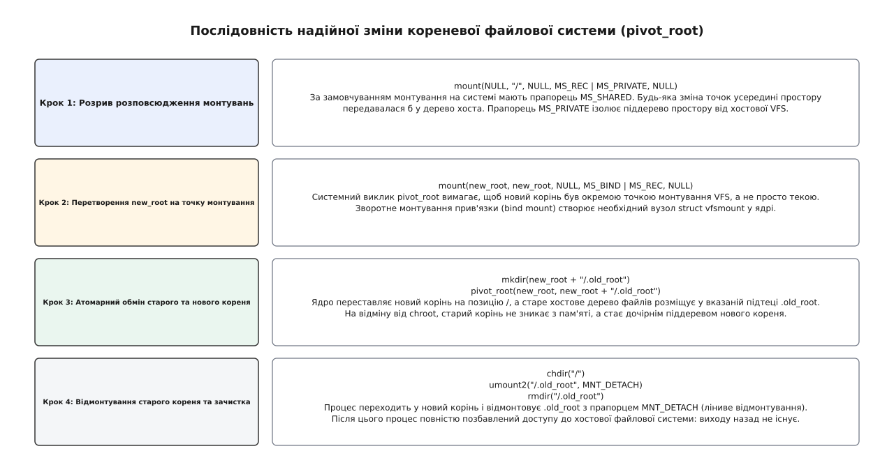
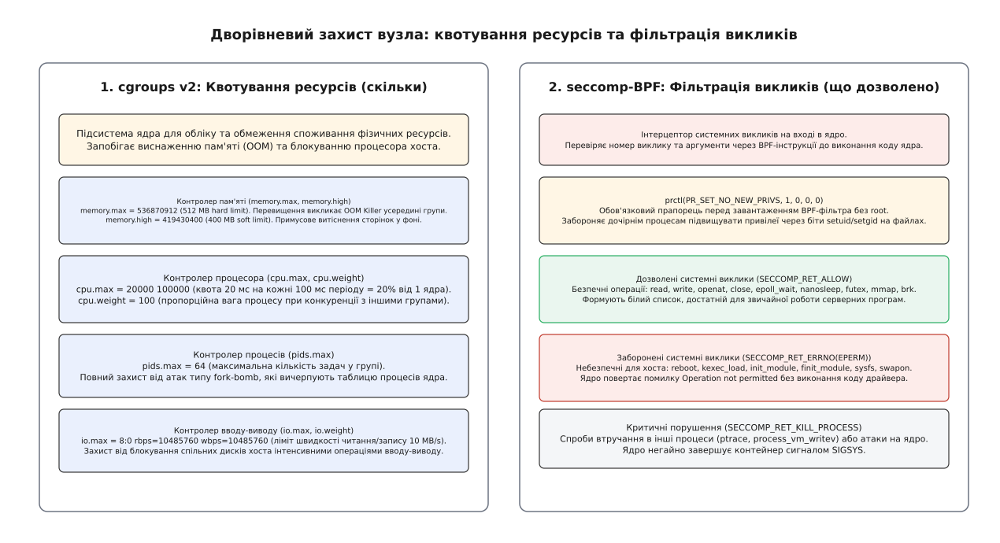

# Контейнер із примітивів: звідки береться ізоляція

<preknowlist>
- [Процес](book:unix-linux/process-model) — одиниця виконання, адресний простір і таблиця дескрипторів.
- [cgroups](book:unix-linux/cgroups) — облік і квотування фізичних ресурсів процесу.
- [Простори імен](book:unix-linux/namespaces) — розмежування глобальних таблиць та ідентифікаторів ядра.
- [VFS і монтування](book:unix-linux/mount-model) — дерево файлових систем, точки монтування та прапорці прив'язки.
</preknowlist>

Коли на одному фізичному сервері одночасно запускаються два незалежні веб-сервіси, системний адміністратор очікує, що збій або злам одного застосунку ніяк не вплине на інший. Проте якщо запустити їх як звичайні процеси Unix під різними користувачами, ця незалежність виявляється ілюзорною.

Будь-який процес бачить повний список усіх запущених програм у системі через спільний каталог `/proc`, може сканувати відкриті мережеві порти, прослуховувати чужі з'єднання або намагатися виснажити таблицю дескрипторів. Якщо шкідливий процес почне нескінченно виділяти пам'ять, ядро активує механізм аварійного вивільнення пам'яті (*OOM-killer*), який може примусово знищити сусідній критичний сервіс.

Спроба вирішити цю проблему за допомогою класичного виклику `chroot` (англ. *change root* — зміна кореня) закриває лише доступ до файлів вище призначеного каталогу, але залишає спільними таблицю процесів, мережевий стек, міжпроцесну пам'ять і доступ до системних викликів ядра.

В операційній системі Linux не існує системного виклику `sys_create_container()`, як не існує і структури даних `struct container` у вихідному коді ядра. Те, що простір користувача називає «контейнером» (від лат. *continere* — містити в собі), є інженерною композицією чотирьох незалежних механізмів ядра:

1. **Простори імен (Namespaces)** — визначають, що процес може *бачити* (власні номери PID, ізольована мережа, персональне дерево файлових систем).
2. **Контрольні групи (cgroups v2)** — визначають, скільки ресурсів процес може *спожити* (квоти пам'яті, процесорного часу, операцій вводу-виводу, ліміт кількості задач).
3. **Механізм перемикання кореневої файлової системи (`pivot_root`) та шаруваті ФС (OverlayFS)** — надійно відрізають процес від файлової системи хоста, формуючи комбінований шар копіювання при записі.
4. **Фільтрація привілеїв та системних викликів (Capabilities та seccomp-BPF)** — позбавляє суперкористувача всемогутності та блокує небезпечні виклики до ядра.


*Користувацька ілюзія («віртуальна машина») проти реальності ядра: процес task_struct зі структурами nsproxy, cgroup та seccomp на спільному монолітному ядрі.*

Еволюцію цієї концепції від простого ізолятора файлових шляхів до стандартизованих специфікацій відкритої контейнеризації детально розібрано у вставці [Від chroot до OCI: як Unix прийшов до контейнеризації](guide:unix/container-from-primitives/hist-chroot-to-containers.md).

---

### 1. Розмежування простору видимості: вісім просторів імен

У ядрі Linux кожен процес описується структурою `task_struct`. Серед численних полів цієї структури міститься вказівник на структуру проксі просторів імен `struct nsproxy *nsproxy`. Ця структура містить вказівники на конкретні примірники підсистем ізоляції:

```c
struct nsproxy {
    atomic_t count;
    struct uts_namespace  *uts_ns;
    struct ipc_namespace  *ipc_ns;
    struct mnt_namespace  *mnt_ns;
    struct pid_namespace  *pid_ns_for_children;
    struct net            *net_ns;
    struct time_namespace *time_ns;
    struct cgroup_namespace *cgroup_ns;
};
```

Коли процес народжується через системний виклик `fork()`, він за замовчуванням успадковує той самий вказівник `nsproxy`, що й батьківський процес, поділяючи з ним усі глобальні таблиці ядра. Проте якщо викликати `clone()` зі спеціальними прапорцями `CLONE_NEW*`, ядро виділяє для нового процесу свіжі структури просторів імен.


*Вісім просторів імен Linux: прапорці clone/unshare, ізольовані структури ядра та вузли в /proc/[pid]/ns/.*

#### 1.1. Mount Namespace (`CLONE_NEWNS`): ізоляція дерева файлових систем

Простір імен монтування (англ. *mount namespace*) був створений у Linux першим (2002 рік). Він надає процесу персональну таблицю змонтованих файлових систем.

Коли процес створює власний Mount Namespace, він отримує точну копію поточної таблиці монтувань хоста. Будь-які наступні виклики `mount()` або `umount()` змінюють лише локальну таблицю процесу і не зачіпають хостову систему.

Проте за замовчуванням у сучасних дистрибутивах Linux точки монтування мають прапорець спільного розповсюдження `MS_SHARED`. Це означає, що подія монтування автоматично реплікується в усі копії цього дерева. Щоб розірвати цей зв'язок, новостворений процес контейнера зобов'язаний явно зробити корінь дерева приватним: `mount(NULL, "/", NULL, MS_REC | MS_PRIVATE, NULL);`.

Прапорець `MS_REC` (рекурсивно) разом із `MS_PRIVATE` гарантує, що жодна майбутня зміна файлових систем усередині контейнера не вийде назовні.

Семантика розповсюдження монтувань у Linux визначається чотирма основними станами:
1. **Shared (`MS_SHARED`):** Події монтування та відмонтування в цьому дереві автоматично транслюються в усі інші спільні копії цієї групи (*peer group*).
2. **Slave (`MS_SLAVE`):** Точка монтування отримує події від свого майстра, але локальні зміни всередині підпорядкованого дерева ніколи не передаються назад до майстра.
3. **Private (`MS_PRIVATE`):** Повна ізоляція: точка монтування не отримує зовнішніх подій і не генерує власних назовні.
4. **Unbindable (`MS_UNBINDABLE`):** Приватне монтування, яке додатково заборонено клонувати через виклик `mount --bind`. Це захищає від експоненційного розростання таблиць VFS при вкладених рекурсивних прив'язках.

#### 1.2. PID Namespace (`CLONE_NEWPID`): віртуалізація ідентифікаторів процесів

Простір ідентифікаторів процесів створює власну незалежну нумерацію. Перший процес, породжений у новому просторі PID, отримує номер `PID 1`.

У традиційній системі Unix процес із `PID 1` виконує роль підсистеми ініціалізації (*init*). У новому просторі PID цей процес бере на себе два критичні обов'язки:
1. **Збирання процесів-сиріт:** коли будь-який вкладений процес завершує роботу, не маючи живого батька, ядро автоматично перепідпорядковує його процесу `PID 1` цього простору. Процес `PID 1` зобов'язаний викликати `waitpid()` для очищення записів про завершені процеси, інакше таблиця процесів ядра заповниться зомбі (*zombies*).
2. **Обробка сигналів:** ядро захищає `PID 1` від випадкового знищення. Сигнали `SIGKILL` або `SIGTERM`, надіслані зсередини контейнера, ігноруються, якщо `PID 1` явно не встановив для них обробник. Проте якщо сигнал надходить із батьківського простору імен (з боку хоста), ядро виконує його негайно.

Простори PID утворюють вкладену ієрархію: процес завжди бачить лише власні дочірні простори, але не бачить процесів вищого рівня. На хості контейнерний процес має звичайний глобальний ідентифікатор (наприклад, `PID 4192`), тоді як усередині контейнера він бачить себе як `PID 1`. Якщо головний процес `PID 1` завершується, ядро надсилає сигнал `SIGKILL` усім іншим процесам у цьому просторі імен і знищує сам простір.

#### 1.3. Network Namespace (`CLONE_NEWNET`): персональний мережевий стек

Простір імен мережі виділяє процесу повністю ізольовану копію мережевого стека Linux:
* Власний список мережевих інтерфейсів (початково лише неактивний `lo`).
* Персональні таблиці маршрутизації IPv4 та IPv6.
* Окремі правила міжмережевого екрана (iptables, nftables).
* Власний простір портів TCP та UDP (два контейнери можуть одночасно відкрити порт 80 на власних інтерфейсах).
* Окремий каталог сокетів домену Unix та списки з'єднань у `/proc/net/`.

Для підключення ізольованого контейнера до локальної мережі хоста ядро надає віртуальний кабель — пару інтерфейсів *veth* (англ. *virtual ethernet*). Робота цієї пари базується на прямій передачі пакетів між мережевими стеками:

```
[ Хостовий простір імен (net_ns хоста) ]           [ Простір імен контейнера (net_ns гостя) ]
┌───────────────────────────────────────┐           ┌────────────────────────────────────────┐
│ Міст br0 (10.0.0.1/24)                │           │ Інтерфейс eth0 (10.0.0.2/24)           │
│   └── veth-host (підключений до br0)  │ <=======> │   └── veth-guest (перейменований)      │
│ iptables: NAT / MASQUERADE            │  (veth)   │ Маршрут: default via 10.0.0.1          │
└───────────────────────────────────────┘           └────────────────────────────────────────┘
```

Коли мережевий пакет надходить на інтерфейс `eth0` всередині контейнера, драйвер `veth` перехоплює буфер сокета `sk_buff` і без проходження фізичного дроту викликає функцію ядра `dev_forward_skb()`, переносячи пакет прямо в чергу прийому спареного інтерфейсу `veth-host` на хості. Хостовий мережевий міст `br0` комутує цей пакет, а правила `iptables` у ланцюжку `POSTROUTING` здійснюють трансляцію мережевих адрес (SNAT/MASQUERADE), спрямовуючи трафік у зовнішній інтернет.

#### 1.4. User Namespaces (`CLONE_NEWUSER`) та Rootless контейнери

Простір імен користувачів дозволяє повністю ізолювати таблиці ідентифікаторів користувачів (UID) та груп (GID). Головна перевага User Namespace полягає в тому, що процес може бути створений непривілейованим користувачем хоста (без прав `sudo` чи біта `setuid`) і отримати повний набір можливостей (*capabilities*) всередині власного простору імен.

Відображення ідентифікаторів налаштовується через файли `/proc/[pid]/uid_map` та `/proc/[pid]/gid_map`. Кожен запис містить три поля:
```
<ID_усередині_контейнера> <ID_на_хості> <кількість_ідентифікаторів>
```

Наприклад, запис `0 100000 65536` означає:
* Користувач `root` (UID 0) усередині контейнера для хостового ядра є звичайним непривілейованим користувачем із UID 100000.
* Якщо процес у контейнері створює файл із правами `0600` від імені `root`, на диску хоста цей файл записується з власником UID 100000.
* Навіть якщо процес зуміє здійснити втечу з файлового дерева контейнера на хост, для ядра хоста він залишається користувачем 100000 і не має доступу до системних файлів `/etc/shadow` чи конфігурацій ядра.

Для надання звичайним користувачам права використовувати діапазони субрахунків системний адміністратор налаштовує системні файли `/etc/subuid` та `/etc/subgid`:

```
developer:100000:65536
```

Утиліти `newuidmap` та `newgidmap`, що мають прапорець `setuid root`, безпечно перевіряють ці файли та записують дозволені діапазони у `uid_map` контейнера.

#### 1.5. Решта просторів: IPC, UTS, Cgroup та Time

* **IPC (`CLONE_NEWIPC`):** Ізолює ресурси міжпроцесної взаємодії стандарту System V (сегменти спільної пам'яті `shmget`, семафори `semget`) та черги повідомлень POSIX MQ. Це унеможливлює ситуацію, коли процес контейнера читає незахищений сегмент спільної пам'яті бази даних хоста.
* **UTS (`CLONE_NEWUTS`):** Ізолює ім'я вузла (*nodename*, повертається командою `hostname`) та доменне ім'я NIS (*domainname*). Контейнер може викликати `sethostname("web-01")`, не змінюючи системне ім'я хостового сервера.
* **Cgroup (`CLONE_NEWCGROUP`):** Приховує повну ієрархію контрольних груп хоста. Замість довгого абсолютного шляху `/sys/fs/cgroup/docker/daemon/container_123` процес бачить свій локальний каталог cgroup як віртуальний корінь `/`. Це запобігає витоку інформації про структуру хостової системи та дозволяє вкладеним системним службам (наприклад, `systemd` усередині контейнера) коректно монтувати та контролювати власні підгрупи без конфліктів із хостом.
* **Time (`CLONE_NEWTIME`):** З'явився в Linux 5.6. Дозволяє встановлювати персональні зсуви для годинників `CLOCK_MONOTONIC` і `CLOCK_BOOTTIME` через файл `/proc/[pid]/timens_offsets`. Завдяки підтримці у віртуальній сторінці пам'яті `vDSO` (англ. *virtual Dynamic Shared Object*) програми всередині контейнера продовжують зчитувати монотонний час із нульовими накладними витратами безпосередньо з регістрів процесора (наприклад, `RDTSC`), тоді як ядро автоматично додає сконфігурований зсув.

Стан активних просторів процесу можна дослідити через магічні файли у `/proc/[pid]/ns/`:

```bash
ls -l /proc/$$/ns/
```
```
cgroup -> 'cgroup:[4026531835]'
ipc    -> 'ipc:[4026531839]'
mnt    -> 'mnt:[4026531840]'
net    -> 'net:[4026531992]'
pid    -> 'pid:[4026531836]'
user   -> 'user:[4026531837]'
uts    -> 'uts:[4026531838]'
```

Число у квадратних дужках відповідає унікальному номеру `inode` структури простору імен у внутрішній файловій системі ядра `nsfs`. Якщо два процеси мають однаковий номер `inode` для певного простору, вони перебувають в одному контексті ізоляції.

---

### 2. Надійна файлова ізоляція: від chroot до pivot_root та OverlayFS

Ізоляція файлової системи є найбільш очевидною вимогою: контейнер повинен бачити власні системні бібліотеки, конфігураційні файли у `/etc` та бінарні файли у `/usr/bin`, не маючи можливості прочитати файли хоста.

#### Чому chroot є дірявим примітивом

Історичний виклик `chroot(path)` змінює лише одне поле в структурі процесу — кореневий каталог `current->fs->root`. Проте цей виклик не створює нового дерева VFS.

Існує класичний спосіб втечі з `chroot`, доступний будь-якому процесу з правами `root`:

:::tabs
```c
/* Відкриваємо дескриптор на поточний робочий каталог до обмеження */
int fd = open(".", O_RDONLY);

/* Замикаємо процес у підкаталозі */
chroot("/tmp/jail");

/* Використовуємо відкритий дескриптор для виходу за межі кореня */
fchdir(fd);

/* Піднімаємося вгору по дереву хоста */
for (int i = 0; i < 50; i++) {
    chdir("..");
}
chroot(".");
```
```cpp
// C++ еквівалент демонстрації втечі з chroot
int fd = open(".", O_RDONLY);
chroot("/tmp/jail");
fchdir(fd);
for (int i = 0; i < 50; ++i) {
    chdir("..");
}
chroot(".");
```
:::

Оскільки `fchdir(fd)` переміщує робочий каталог процесу за межі нового кореня, ядро дозволяє подальші переходи `chdir("..")` аж до досягнення справжнього кореня файлової системи хоста. Після цього фінальний виклик `chroot(".")` повністю відновлює доступ до всієї системи.

#### Анатомія системного виклику pivot_root

Для надійної заміни кореня в контейнерах використовується виклик `pivot_root(new_root, put_old)`. Він здійснює атомарну перестановку в таблиці монтування VFS: точка монтування `new_root` стає новим коренем `/`, а старе дерево файлових систем переноситься у підкаталог `put_old`.


*Послідовність надійної зміни кореневої файлової системи (pivot_root) та очищення слідів старого кореня.*

Ядро накладає жорсткі вимоги на параметри `pivot_root`:
1. `new_root` мусить бути окремою точкою монтування VFS. Якщо образ розпаковано у звичайний каталог `/tmp/rootfs`, його слід перетворити на точку монтування через зворотне монтування прив'язки: `mount(rootfs, rootfs, NULL, MS_BIND | MS_REC, NULL);`.
2. Каталог `put_old` мусить знаходитися всередині дерева `new_root` (наприклад, `/tmp/rootfs/.old_root`).
3. Поточний корінь і `new_root` не можуть належати до кореневої системи `rootfs` (початковий `initramfs` у пам'яті).

Після виклику `pivot_root` процес виконує повне очищення: переходить у новий корінь `chdir("/")`, відмонтовує старе дерево хоста з прапорцем лінивого від'єднання `umount2("/.old_root", MNT_DETACH)` та видаляє тимчасовий каталог `rmdir("/.old_root")`.

Прапорець `MNT_DETACH` негайно від'єднує точку монтування хоста від дерева VFS процесу. Навіть якщо процес збереже відкритий файловий дескриптор, у нього не залишиться жодного шляху для навігації вгору по каталогах хоста.

#### Шаруваті файлові системи: механізм OverlayFS

Сучасні контейнерні рушії не копіюють повне дерево файлів під час запуску кожного примірника. Замість цього використовується об'єднана файлова система **OverlayFS**, яка реалізує механізм копіювання при записі (*copy-on-write*):

```
┌─────────────────────────────────────────────────────────────┐
│ Каталог merged (/): єдиний зведений корінь для контейнера   │
└─────────────────────────────────────────────────────────────┘
          ▲                                         ▲
          │ (читання/запис)                         │ (тільки читання)
┌───────────────────────────┐             ┌───────────────────────────┐
│ Верхній шар (upperdir)    │             │ Нижні шари (lowerdir)     │
│ Каталог змін контейнера   │             │ Базовий образ (Ubuntu/    │
│ Тимчасовий каталог (work) │             │ Alpine), спільний для всіх│
└───────────────────────────┘             └───────────────────────────┘
```

Команда монтування OverlayFS:
```bash
mount -t overlay overlay -o lowerdir=/images/alpine,upperdir=/containers/c1/diff,workdir=/containers/c1/work /containers/c1/merged
```

Коли процес у контейнері читає файл, ядро шукає його у верхньому шарі `upperdir`, а якщо його там немає — зчитує з нижнього незмінного шару `lowerdir`. Коли процес модифікує файл, ядро виконує операцію *copy-up*: створює копію файлу в `upperdir` і записує зміни туди, залишаючи базовий образ недоторканим.

#### Монтування приватних псевдофайлових систем

Після заміни кореня контейнер залишається без стандартних віртуальних каталогів ядра. Процес зобов'язаний змонтувати їх наново в межах свого Mount Namespace:

* `/proc`: монтується викликом `mount("proc", "/proc", "proc", MS_NOSUID | MS_NODEV | MS_NOEXEC, NULL)`. Оскільки процес перебуває в новому PID Namespace, новостворена `procfs` показує виключно процеси цього контейнера.
* `/sys`: монтується як `sysfs`. Для безпеки її обов'язково переводять у режим «тільки для читання» (`MS_RDONLY`), щоб процес не міг змінити конфігурацію апаратного забезпечення або параметри живлення хоста.
* `/dev`: монтується як віртуальна файлова система `tmpfs`, у якій створюються мінімально необхідні символьні пристрої (`/dev/null`, `/dev/zero`, `/dev/urandom`).
* `/dev/pts`: монтується як ізольований екземпляр псевдотерміналів `mount -t devpts devpts /dev/pts -o newinstance,ptmxmode=0666,mode=0620`, що дозволяє виділяти віртуальні термінали TTY без втручання в сеанси хоста.

---

### 3. Керування ресурсами: cgroups v2

Простори імен і `pivot_root` створюють ідеальну оптичну ілюзію окремої системи, але вони не захищають фізичні ресурси. Процес усередині контейнера продовжує виконуватися на спільному процесорі та виділяти сторінки в спільній оперативній пам'яті.

Якщо процес запустить нескінченний цикл виділення пам'яті `malloc()`, він вичерпає всю фізичну пам'ять сервера. Якщо процес виконає форк-бомбу `:(){ :|:& };:`, він вичерпає глобальну таблицю процесів ядра `pid_max`, паралізувавши роботу всього вузла.

Для розв'язання цієї проблеми використовується підсистема **контрольних груп другого покоління (cgroups v2)**.

#### Єдина ієрархія cgroups v2

На відміну від застарілої версії cgroups v1, де кожен ресурс мав власне незалежне дерево каталогів, у cgroups v2 існує єдина уніфікована ієрархія, змонтована у `/sys/fs/cgroup`.

Керування ресурсами відбувається через запис числових значень у контрольні псевдофайли. Коли створюється новий підкаталог (наприклад, `/sys/fs/cgroup/minibox`), ядро автоматично створює в ньому набір інтерфейсних файлів:

```
/sys/fs/cgroup/minibox/
├── cgroup.procs
├── cgroup.controllers
├── memory.max
├── memory.high
├── memory.low
├── memory.min
├── memory.current
├── cpu.max
├── cpu.weight
├── pids.max
└── io.max
```

Для додавання процесу до групи достатньо записати його ідентифікатор у файл `cgroup.procs`:

```bash
echo 4192 > /sys/fs/cgroup/minibox/cgroup.procs
```

Усі дочірні процеси, створені цим процесом, автоматично успадковують членство в цій контрольній групі.


*Дворівневий бар'єр безпеки: квотування споживання ресурсів через cgroups v2 та перехоплення системних викликів через seccomp-BPF.*

#### Контролери пам'яті, процесора, процесів та вводу-виводу

1. **Пам'ять (`memory.*`):**
   * `memory.max`: Жорсткий ліміт пам'яті у байтах (наприклад, `536870912` для 512 МБ). Якщо процеси групи намагаються виділити більше пам'яті, а витіснення кешу сторінок не дає результату, ядро активує локальний *OOM-killer*, який знищує найпрожерливіший процес усередині цієї cgroup, не зачіпаючи процеси хоста.
   * `memory.high`: М'який ліміт. При його досягненні ядро сповільнює процес і агресивно витісняє кешовані сторінки у фоновому режимі, запобігаючи аварійному знищенню.
   * `memory.low`: Захищений поріг пам'яті. Сторінки процесу нижче цього ліміту не витісняються ядром під час глобального дефіциту оперативної пам'яті, якщо є можливість звільнити сторінки з незахищених груп.
   * `memory.min`: Абсолютний апаратний захист пам'яті (hard protection). Сторінки нижче цього порогу ні за яких обставин не підлягають витісненню ядром, гарантуючи роботу критичних системних демонів.
   * `memory.swap.max`: Ліміт використання файлу підкачки. Встановлення `0` повністю забороняє контейнеру скидати пам'ять у swap хоста.
2. **Процесорний час (`cpu.*`):**
   * `cpu.max`: Визначає максимальну смугу процесорного часу планувальника CFS (*Completely Fair Scheduler*) або EEVDF. Задається двома числами: квотою часу та періодом у мікросекундах:
     ```
     20000 100000
     ```
     Цей запис означає, що процеси контейнера сумарно можуть виконуватися не більше 20 мс на кожні 100 мс стінного часу (рівно 20% потужності одного ядра CPU).
   * `cpu.weight`: Відносна вага пріоритету від `1` до `10000` (за замовчуванням `100`). Використовується ядром для пропорційного розподілу процесора при 100% завантаженні сервера.
3. **Кількість процесів (`pids.*`):**
   * `pids.max`: Максимальна кількість активних задач (процесів і потоків). Значення `64` повністю нейтралізує будь-яку спробу fork-бомби: 65-й виклик `fork()` повертає помилку `EAGAIN` (`Resource temporarily unavailable`).
4. **Дисковий ввід-вивід (`io.*`):**
   * `io.max`: Встановлює ліміти пропускної здатності (байти на секунду) та кількості операцій (IOPS) для кожного окремого блокового пристрою (`major:minor`). Наприклад, рядок `8:0 rbps=10485760 wbps=10485760` обмежує швидкість читання та запису на диск `/dev/sda` значенням 10 МБ/с.

#### Моніторинг голодування ресурсів: PSI (Pressure Stall Information)

Підсистема cgroups v2 містить файли аналізу тиску на ресурси у кожному каталозі групи:
* `memory.pressure`: Показує відсоток часу, протягом якого процеси контейнера очікували на виділення пам'яті або витіснення сторінок.
* `cpu.pressure`: Показує втрати часу через конкуренцію за процесорні ядра.
* `io.pressure`: Фіксує затримки виконання через блокування дисковим вводом-виводом.

Формат файлу містить показники за останні 10, 60 та 300 секунд:
```
some avg10=0.12 avg60=0.05 avg300=0.01 total=124500
full avg10=0.00 avg60=0.00 avg300=0.00 total=0
```
Метрика `some` показує час, коли хоча б один потік був заблокований, а `full` — коли всі потоки контейнера одночасно простоювали через дефіцит ресурсу.

Повний перелік параметрів контролерів, формат подій та інтерфейси зчитування статистики описано у довіднику [Інтерфейс системних примітивів контейнеризації](guide:unix/container-from-primitives/api-container-primitives.md).

---

### 4. Бар'єр безпеки: Capabilities та seccomp-BPF

Навіть якщо процес замкнений у власному просторі імен і обмежений cgroups, запуск від імені користувача `root` (UID 0) несе критичну загрозу для безпеки хоста. Якщо процес має доступ до системного виклику `reboot()`, він може перезавантажити весь фізичний сервер. Якщо процес може завантажити модуль ядра через `init_module()`, він отримує необмежений доступ до простору пам'яті ядра хоста.

Для побудови безпечного контейнера потрібен подвійний бар'єр захисту привілеїв.

#### Розщеплення прав root: Linux Capabilities

У традиційній моделі Unix привілеї користувача були бінарними: звичайний користувач або всемогутній `root`. В операційній системі Linux усі привілеї суперкористувача розділені на 41 незалежну можливість (англ. *capabilities*).

Під час запуску контейнера суперкористувача позбавляють небезпечних можливостей:

| Можливість ядра | Призначення | Дія в контейнері |
| :--- | :--- | :--- |
| `CAP_SYS_ADMIN` | Монтування файлових систем, керування просторами, налаштування cgroups | **Скидається:** унеможливлює модифікацію ядра |
| `CAP_SYS_MODULE` | Завантаження та вивантаження модулів ядра | **Скидається:** забороняє виконання стороннього коду в ядрі |
| `CAP_SYS_RAWIO` | Прямий доступ до фізичної пам'яті (`/dev/mem`) та портів вводу-виводу | **Скидається:** запобігає прямому запису в апаратні пристрої |
| `CAP_SYS_BOOT` | Перезавантаження системи викликом `reboot()` | **Скидається:** блокує вимкнення фізичного вузла |
| `CAP_SYS_PTRACE` | Трасування пам'яті інших процесів | **Скидається:** блокує перехоплення чужих процесів |
| `CAP_NET_BIND_SERVICE` | Прив'язка сокетів до привілейованих портів (< 1024) | **Залишається:** дозволяє запускати веб-сервер на портах 80 і 443 |

Скидання можливостей здійснюється системним викликом `prctl(PR_CAPBSET_DROP, cap, 0, 0, 0)`. Після цього процес (і всі його дочірні процеси) більше не зможуть отримати ці права, навіть якщо виконають файл із бітом `setuid root`.

#### Фільтрація викликів через seccomp-BPF

Механізм **seccomp** (англ. *Secure Computing Mode*) дозволяє перехоплювати системні виклики на вході в ядро та виконувати над ними перевірку за допомогою мікропрограм BPF (*Berkeley Packet Filter*).

Перед завантаженням BPF-фільтра процес викликає `prctl(PR_SET_NO_NEW_PRIVS, 1, 0, 0, 0);`. Цей прапорець є незворотним. Він гарантує, що жодна майбутня операція `execve()` не підвищить привілеї процесу через файлові біти `setuid` чи `setgid`.

Після цього процес завантажує BPF-байткод, який перевіряє номер системного виклику за чорним або білим списком:

```c
struct sock_filter filter[] = {
    /* Перевірка архітектури процесора */
    BPF_STMT(BPF_LD | BPF_W | BPF_ABS, (offsetof(struct seccomp_data, arch))),
    BPF_JUMP(BPF_JMP | BPF_JEQ | BPF_K, AUDIT_ARCH_X86_64, 1, 0),
    BPF_STMT(BPF_RET | BPF_K, SECCOMP_RET_KILL_PROCESS),

    /* Завантаження номера виклику */
    BPF_STMT(BPF_LD | BPF_W | BPF_ABS, (offsetof(struct seccomp_data, nr))),

    /* Блокування небезпечних викликів */
    BPF_JUMP(BPF_JMP | BPF_JEQ | BPF_K, __NR_reboot, 4, 0),
    BPF_JUMP(BPF_JMP | BPF_JEQ | BPF_K, __NR_kexec_load, 3, 0),
    BPF_JUMP(BPF_JMP | BPF_JEQ | BPF_K, __NR_init_module, 2, 0),
    BPF_JUMP(BPF_JMP | BPF_JEQ | BPF_K, __NR_swapon, 1, 0),

    /* Дозволити всі інші системні виклики */
    BPF_STMT(BPF_RET | BPF_K, SECCOMP_RET_ALLOW),

    /* Заблоковані виклики повертають помилку EPERM */
    BPF_STMT(BPF_RET | BPF_K, SECCOMP_RET_ERRNO | (EPERM & 0xffff))
};
```

Коли програма всередині контейнера намагається виконати виклик `reboot()`, ядро зупиняє обробку виклику ще до виконання коду драйвера і миттєво повертає застосунку стандартну помилку `EPERM` (*Operation not permitted*).

---

### 5. Збирання примітивів у єдиний контейнер

Поєднання всіх розглянутих механізмів дає змогу описати повний життєвий цикл контейнерного рушія (такого як `runc` або міні-реалізації `minibox`):

1. **Підготовка середовища на хості:**
   * Батьківський процес створює каталог контейнера в `/sys/fs/cgroup/` та налаштовує квоти `memory.max`, `cpu.max`, `pids.max`.
   * Створюється неіменований канал `pipe` для синхронізації запуску.
2. **Створення процесу в нових просторах:**
   * Батьківський процес викликає `clone()` з комбінацією прапорців `CLONE_NEWNS | CLONE_NEWPID | CLONE_NEWUTS | CLONE_NEWIPC | CLONE_NEWNET | CLONE_NEWCGROUP`.
   * Дочірній процес починає виконання, але негайно блокується на читанні з каналу `read(pipe_fd)`.
3. **Реєстрація у cgroups:**
   * Батьківський процес записує PID новоствореного дочірнього процесу у `/sys/fs/cgroup/.../cgroup.procs`.
   * Батьківський процес закриває свій кінець каналу, надсилаючи дочірньому процесу сигнал `EOF` для продовження роботи.
4. **Ініціалізація дочірнього процесу (PID 1 у контейнері):**
   * Встановлюється ім'я хоста через `sethostname()`.
   * Кореневе дерево переводиться у приватний режим викликом `mount(NULL, "/", NULL, MS_REC | MS_PRIVATE, NULL)`.
   * Виконується `pivot_root()`, старий корінь хоста відмонтовується з `MNT_DETACH`.
   * Монтуються приватні екземпляри `/proc`, `/sys` та `/dev`.
5. **Застосування безпекових обмежень:**
   * Скидаються небезпечні capabilities із Bounding Set.
   * Встановлюється прапорець `PR_SET_NO_NEW_PRIVS`.
   * Завантажується seccomp-BPF фільтр.
6. **Запуск цільової програми:**
   * Процес викликає `execve("/bin/sh", ...)` або запускає скомпільований бінарний файл застосунку.
   * Програма виконується як нативний процес на процесорі хоста, але повністю замкнена у створеній пісочниці.

Повнофункціональний робочий код такого контейнерного рушія на мовах C та C++ з детальним аналізом наведено у проєктній вставці [Реалізація міні-контейнера з системних примітивів](guide:unix/container-from-primitives/proj-mini-container.md).

---

### 6. Трасування та діагностика контейнерів на хості

Оскільки контейнер є звичайною групою процесів у ядрі Linux, системний адміністратор на хості може досліджувати та налагоджувати його за допомогою стандартних інструментів трасування:

#### 6.1. Вхід у простори імен контейнера: `nsenter`

Утиліта `nsenter` дозволяє адміністративному процесу хоста приєднатися до будь-яких просторів імен цільового контейнера через системний виклик `setns()`:

```bash
# Знаходимо PID контейнера на хості
CONTAINER_PID=$(pgrep -f "minibox")

# Входимо в простори монтування, PID та мережі контейнера
sudo nsenter --target $CONTAINER_PID --mount --pid --net /bin/sh
```

Після виконання цієї команди оболонка адміністратора опиняється всередині мережевого та файлового середовища контейнера, що дозволяє виконувати діагностику мережевих сокетів або аналізувати файли логів без зупинки застосунку.

#### 6.2. Огляд усіх активних просторів: `lsns`

Утиліта `lsns` сканує структури `/proc/*/ns/*` і відображає зведену таблицю всіх просторів імен, активних у ядрі:

```bash
lsns -t net,pid,mnt
```
```
        NS TYPE NPROCS   PID USER   COMMAND
4026531840 mnt     128     1 root   /sbin/init
4026531992 net     128     1 root   /sbin/init
4026532450 mnt       1  4192 root   /bin/sh
4026532451 pid       1  4192 root   /bin/sh
4026532452 net       1  4192 root   /bin/sh
```

Кожен новий контейнер виділяється унікальним номером `inode` простору імен та кількістю процесів (`NPROCS`), що належать до цієї пісочниці.

---

### 7. Межі ізоляції: де протікає контейнерна абстракція

Незважаючи на високу ефективність, контейнери не є повноцінними віртуальними машинами. Контейнер — це процес на спільному монолітному ядрі Linux. Ця архітектурна особливість створює фундаментальні межі ізоляції:

1. **Спільний простір пам'яті ядра:**
   Якщо в ядрі Linux існує вразливість переповнення буфера (наприклад, у реалізації мережевого драйвера чи підсистемі VFS), шкідливий процес із контейнера може виконати експлойт, пошкодити структури ядра хоста та повністю перехопити керування фізичним сервером.
2. **Неізольовані параметри ядра у `/proc/sys`:**
   Деякі параметри підсистеми `sysctl` не прив'язані до просторів імен і є глобальними для всього сервера (наприклад, параметри віртуальної пам'яті `vm.swappiness` або конфігурація TCP-буферів). Їх зміна впливає на всі контейнери на цьому вузлі.
3. **Конкуренція за неквотовані апаратні ресурси (Noisy Neighbor):**
   cgroups v2 чудово квотує час процесора та розмір оперативної пам'яті, але не може повністю ізолювати пропускну здатність шини пам'яті, кеш-пам'ять процесора L3 або час обробки апаратних переривань. Процес, який інтенсивно завантажує кеш L3 випадковими зверненнями, суттєво сповільнює виконання сусідніх контейнерів на тому самому процесорному сокеті.

Саме тому в хмарних середовищах із нульовою довірою між клієнтами (*multi-tenancy*) контейнери часто упаковують у мікровіртуальні машини (наприклад, AWS Firecracker або QEMU/KVM), де кожен клієнт отримує справжній апаратний гіпервізор і власне ядро операційної системи.

> 🔧 **Навіщо це.**
> Розуміння низькорівневих примітивів контейнеризації перетворює «магію Docker» на прозорий набір системних механізмів. Це критично під час діагностики складних збоїв на продакшені:
> * Коли контейнер раптово завершує роботу з кодом `137`, системний інженер перевіряє лічильник `memory.events: oom_kill` у cgroupfs, а не гадає про причини.
> * Коли процес завершується сигналом `SIGSYS`, інженер розуміє, що застосунок спробував виконати системний виклик, заблокований завантаженим seccomp-профілем.
> * Коли всередині контейнера нагромаджуються процеси-зомбі, інженер усвідомлює, що запущений процес PID 1 не реалізує збирання сиріт через `waitpid()`, і додає легковикий менеджер ініціалізації на кшталт `tini`.
