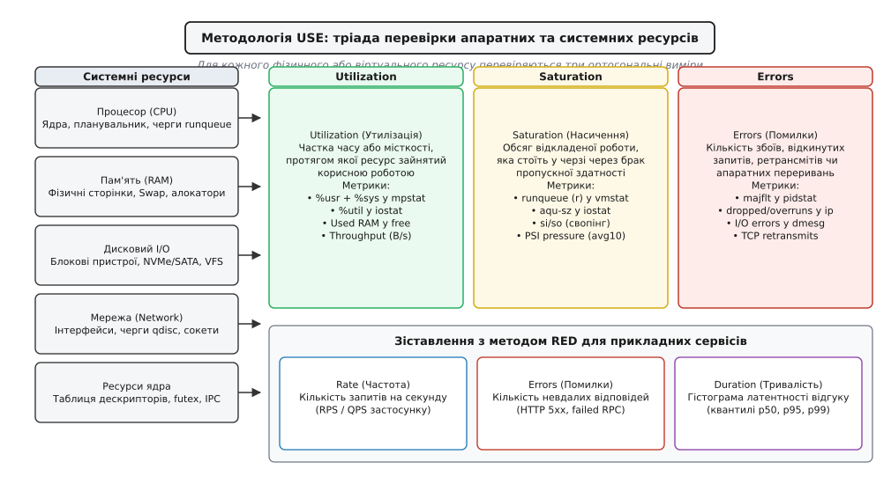
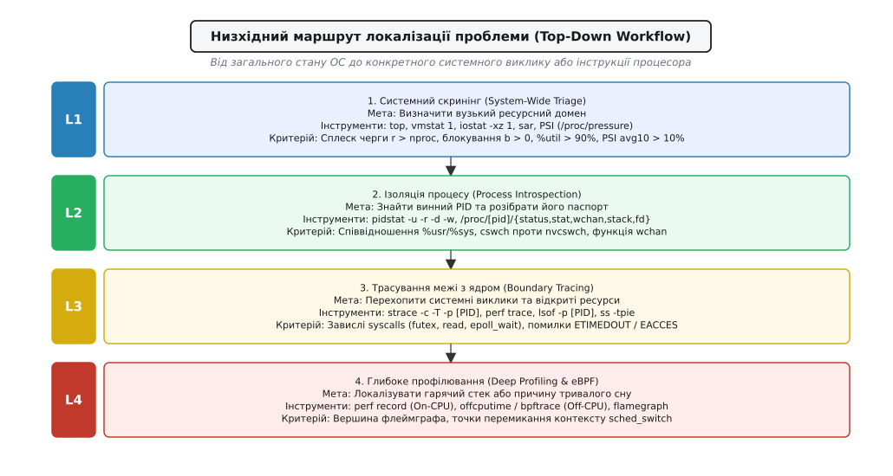
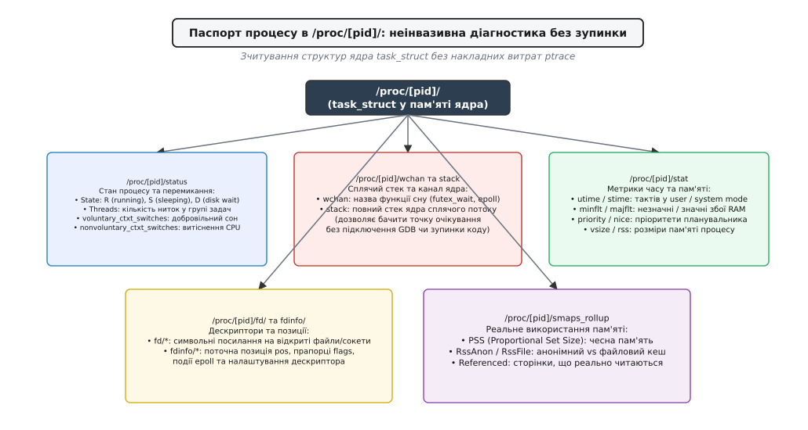

# Метод діагностики: від симптому до причини

<preknowlist>
- [/proc: процеси як файли](book:unix-linux/proc-filesystem) — внутрішня віртуальна файлова система ядра для інтроспекції структури task_struct.
- [ptrace: на чому тримається трасування й налагодження](book:unix-linux/ptrace-model) — механізм перехоплення сигналів, регістрів та системних викликів цільового процесу.
- [Трасування системних викликів](book:unix-linux/syscall-tracing) — перехоплення межі між простором користувача і ядром через strace та seccomp.
- [Підсистема perf: лічильники й вибірковий профіль](book:unix-linux/perf-events) — апаратні лічильники PMU, семплювання стеків та побудова флеймграфів.
- [Трасування ядра ftrace](book:unix-linux/ftrace-kernel-tracing) — вбудована підсистема трасування ядра Linux через tracefs та статичні tracepoints.
- [eBPF: власні програми всередині ядра](book:unix-linux/ebpf-extended-berkeley-packet-filter) — безпечне динамічне виконання байт-коду в ядрі для низьконакладного спостереження.
- [Навантаження й тиск на ресурси](book:unix-linux/load-and-pressure) — метрики PSI (Pressure Stall Information) як об'єктивна міра голодування апаратних ресурсів.
- [Аварійний дамп: як налаштувати й що з нього видно](book:unix-linux/core-dump) — зняття та посмертний аналіз зліпків пам'яті аварійно завершених процесів.
</preknowlist>

О другій годині пікового навантаження розподілений платіжний сервіс раптово починає відкидати транзакції користувачів. Час відповіді на запити на рівні 99-го перцентиля (`p99`) підскакує зі штатних 4 мілісекунд до 1400 мілісекунд, клієнтські балансувальники фіксують масові таймаути `HTTP 504 Gateway Timeout`, а моніторинг повідомляє про деградацію всієї кластерної інфраструктури. Черговий інженер підключається до термінала сервера, вводить команду `top` і бачить парадоксальну картину: сумарне завантаження процесорів становить лише 14%, вільної оперативної пам'яті в системі понад 38 ГіБ, а дискова активність за стандартними графіками наближається до нуля. У паніці інженер перезапускає фоновий процес застосунку, змінює розмір пулу з'єднань з 50 до 500 у конфігураційному файлі та перезавантажує мережевий демон. У результаті накопичені в чергах TCP-сокети миттєво викликають каскадний колапс суміжних баз даних, а всі сліди справжньої несправності безповоротно стираються з пам'яті сервера.

Цей сценарій є типовим наслідком антипатерну хаотичного пошуку несправностей. Спроба вгадати причину затримки навмання або усунути симптом за допомогою перезапусків та випадкової зміни системних параметрів `sysctl` майже завжди перетворює локальну затримку на повномасштабну аварію. Для надійної експлуатації складних систем Linux необхідний алгоритмічний, суворо детермінований підхід: **низхідна системна методологія діагностики**, яка веде інженера від зовнішнього симптому до фундаментальної першопричини на рівні коду чи заліза.

---

## 1. Симптом проти першопричини: ціна випадкових гіпотез

Будь-яка системна проблема у просторі Unix має два принципово різні рівні прояву:

**Зовнішній симптом** — це те, що спостерігає користувач або прикладний моніторинг. Сюди належать: зростання часу обробки запиту, падіння пропускної здатності (RPS), помилки з'єднання `ECONNREFUSED`, скидання сесій або переповнення черги завдань. Симптом констатує факт порушення контрактів сервісу, але не містить жодної інформації про те, де саме згорає час.

**Внутрішня першопричина** — це фізичне чи логічне вузьке місце всередині ядра або простору користувача, яке породжує затримку. Це може бути взаємне блокування ниток на м'ютексі (`futex contention`), очікування звільнення сторінки в пам'яті через прямий відбір (`direct reclaim`), затримка в черзі планувальника (`runqueue latency`), переповнення кільцевого буфера мережевої карти (`RX ring overflow`) або блокування журналювання на рівні VFS.

```
Симптом (L7 / Client):    HTTP 504 Gateway Timeout (p99 = 1400 мс)
                                  │
                                  ▼
Проміжний стан (L4 / OS):  Recv-Q сокета переповнений, стан процесу S (sleeping)
                                  │
                                  ▼
Межа з ядром (L2 / VFS):   Системний виклик futex(FUTEX_WAIT) триває 1380 мс
                                  │
                                  ▼
Першопричина (L1 / Lock): Контенція за спільний буфер логування у бібліотеці C++
```

Коли інженер намагається вирішити проблему перезапуском, він здійснює подвійну шкоду:
1. **Знищення доказів:** Очищається стан `/proc/[pid]/`, скидаються заповнені черги сокетів, зникають стеки ядра сплячих ниток, стирається інформація про відкриті дескриптори та фрагментацію пам'яті.
2. **Маскування проблеми:** Перезапуск дає тимчасове полегшення на кілька хвилин, доки черги не накопичаться знову, створюючи хибне враження, що проблему «вирішено».

Системний метод вимагає збереження холодного розуму: спочатку зняти об'єктивний стан системи та винного процесу, локалізувати вузьке місце за моделлю, і лише після фіксації доказів застосовувати коригувальні дії.

---

## 2. Системна методологія USE

Фундаментальною основою для аналізу апаратного та системного стану є **методологія USE** (Utilization, Saturation, Errors — утилізація, насичення, помилки), розроблена Бренданом Греггом (Brendan Gregg).

Головний принцип методу простий: **для кожного фізичного та віртуального ресурсу системи необхідно послідовно перевірити рівно три ортогональні виміри**.


*Методологія USE: тріада перевірки ресурсів системи та її зіставлення з методом RED.*

Розглянемо фізичний зміст кожного з трьох вимірів:

1. **Utilization (Утилізація):** Частка часу або ємності, протягом якої ресурс зайнятий корисною роботою. Для процесора — це відсоток часу, коли ядра виконували інструкції (`%usr + %sys`); для накопичувача — частка часу, коли на пристрій надходили операції вводу-виводу (`%util`); для пам'яті — відсоток зайнятої фізичної пам'яті від загального обсягу RAM.
2. **Saturation (Насичення / переповнення):** Ступінь, до якого ресурс має більше роботи, ніж може обробити негайно. Насичення виражається у появі черг очікування. Для процесора — це кількість готових ниток у черзі `runqueue` (стовпчик `r` у `vmstat`); для диска — середня довжина черги запитів `aqu-sz`; для пам'яті — обсяг активного витіснення у Swap; для мережі — заповнення черг сокетів `Recv-Q`/`Send-Q`.
3. **Errors (Помилки):** Кількість та частота збоїв у роботі ресурсу. Сюди належать апаратні збої контролерів, втрачені мережеві пакети (`rx_dropped`), збої контрольних сум кадрів Ethernet, події нестачі пам'яті (OOM Killer) або значні сторінкові збої (`majflt`).

### Чому утилізації недостатньо

Поширена помилка полягає у фокусуванні виключно на утилізації. Ресурс може мати утилізацію лише 20%, але при цьому демонструвати 100% насичення. 

Наприклад, якщо багатопотоковий застосунок виконує операції синхронного запису на дисковий масив, де один потік чекає на завершення операції `fsync`, фізична шина диска використовується лише на 5% пропускної здатності. Проте всі інші 64 робочі нитки вишиковуються в чергу за спільним замком файлу. Утилізація диска низька, але насичення черги блокувань колосальне. Метод USE гарантує, що інженер не пропустить черги (Saturation) та аномальні збої (Errors), навіть якщо загальні графіки споживання ресурсів виглядають спокійно.

Повний перелік системних команд, метрик та граничних значень для кожного ресурсу ядра наведено у вставці [матриця діагностики за методом USE](guide:unix/diagnosis-method/api-use-matrix.md).

---

## 3. Низхідний маршрут діагностики (Top-Down Workflow)

Процес системного пошуку першопричини будується як 4-рівнева низхідна ієрархія (Top-Down): від макроскопічного огляду всієї операційної системи до мікроскопічного аналізу окремих інструкцій та стеків викликів.


*Низхідний маршрут локалізації проблеми: 4 рівні аналізу від системи до ядра.*

---

## Рівень 1. Системний скринінг і тріаж (System-Wide Triage)

Мета першого рівня — за 60 секунд звузити простір пошуку від сотень можливих проблем до одного конкретного ресурсного домену: процесор, пам'ять, дисковий ввід-вивід, мережа або сторонній блокуючий процес.

### 1.1. Об'єктивна оцінка тиску на систему через PSI

Традиційний показник середнього навантаження (Load Average у `top` та `uptime`) є сумою процесів у станах `TASK_RUNNING` (готових до виконання) та `TASK_UNINTERRUPTIBLE` (сплячих у дисковому очікуванні). Він змішує в одне число навантаження на процесор і затримки дисків, не даючи відповіді про реальне голодування системи.

Сучасні ядра Linux надають механізм [навантаження й тиск на ресурси](book:unix-linux/load-and-pressure) — **PSI (Pressure Stall Information)**. Він вимірює точну частку часу, яку процеси провели в стані вимушеного простою через брак конкретного ресурсу:

```sh
# Зчитування метрик системного тиску за останні 10, 60 та 300 секунд
cat /proc/pressure/cpu
cat /proc/pressure/memory
cat /proc/pressure/io
```

Типовий вивід показує:
* `some avg10=18.40` у файлі `cpu` — означає, що протягом останніх 10 секунд щонайменше один потік у системі втрачав 18.4% часу просто стоячи в черзі до зайнятих процесорних ядер.
* `full avg10=5.20` у файлі `memory` — означає, що протягом 5.2% часу **всі** без винятку активні потоки системи були повністю заблоковані через витіснення сторінок або прямий відбір пам'яті.

Якщо значення `avg10` у будь-якому з файлів перевищує `10.0`, відповідна підсистема є головним джерелом затримок.

### 1.2. Огляд черг і контексту через `vmstat 1`

Утиліта `vmstat 1` є найшвидшим інструментом скринінгу стану ядра. Її запускають на 5–10 секунд:

```sh
$ vmstat 1 5
procs -----------memory---------- ---swap-- -----io---- -system-- ------cpu-----
 r  b   swpd   free   buff  cache   si   so    bi    bo   in   cs us sy id wa st
 8  0      0 412580  12400 895420    0    0     0   120 4520 8900 78 22  0  0  0
12  1      0 405100  12400 895420    0    0     0   450 6100 12400 82 18  0  0  0
```

Критичні стовпчики для аналізу:
1. `r` (Runqueue): Кількість ниток, готових до виконання. Якщо `r > nproc` (де `nproc` — кількість логічних процесорів сервера), система страждає від черг планувальника завдань.
2. `b` (Blocked): Кількість задач у неперериваному стані очікування (`TASK_UNINTERRUPTIBLE` / стан `D`). Якщо `b > 0`, процеси зависають на дискових операціях, очікуванні сторінок або блокуваннях VFS.
3. `si` / `so` (Swap In / Swap Out): Якщо значення відмінні від 0, фізичної пам'яті недостатньо, і система активно перекачує сторінки на диск.
4. `us` / `sy` / `wa` / `st`: Відсоток часу користувача (`us`), ядра (`sy`), очікування диска (`wa`) та вкраденого часу гіпервізора (`st`).

### 1.3. Розподіл по ядрах (`mpstat`) та дисках (`iostat`)

Якщо загальний процесорний час виглядає помірним, окреме ядро може бути завантажене на 100% обробкою програмних переривань мережевої карти (`softirq`):

```sh
# Перевірка навантаження на кожне ядро окремо
mpstat -P ALL 1 3
```

Якщо стовпчик `%softirq` на одному з ядер сягає 100%, це свідчить про перекос обробки мережевого трафіку (необхідно налаштувати RPS/RFS або балансування переривань `smp_affinity`).

Для перевірки накопичувачів використовують команду `iostat`:

```sh
# Моніторинг затримок та черг блокових накопичувачів
iostat -xz 1 3
```

Головні червоні прапорці в `iostat`:
* `r_await` / `w_await > 10.0` (для SSD) або `> 2.0` (для NVMe) — дискове сховище перевантажене.
* `aqu-sz > 4.0` — накопичується черга блокових запитів.
* `%util > 90%` — шина контролера працює на межі фізичних можливостей.

### 1.4. Діагностика в ізольованих середовищах: cgroups v2

Якщо застосунок виконується всередині контейнера Docker або Kubernetes, традиційні системні утиліти (`top`, `free`) можуть вводити в оману, оскільки вони читають загальносистемні файли `/proc/stat` та `/proc/meminfo`. У результаті інженер бачить 128 ГіБ вільної пам'яті на хості, тоді як контейнер має жорсткий ліміт у 4 ГіБ і перебуває за крок до аварії.

Для точної діагностики контейнеризованих процесів перевіряють файлову систему контрольних груп `cgroupfs` v2 у каталозі `/sys/fs/cgroup/`:

* **Тротлінг процесора (`cpu.stat`):** Файл містить лічильники `nr_throttled` (кількість періодів обмеження) та `throttled_usec` (сумарний час примусового замороження ниток). Якщо ці показники зростають, процес періодично зупиняється ядром через перевищення квоти `cpu.max`, навіть якщо фізичні ядра хоста вільні.
* **Тиск на пам'ять (`memory.events`):** Фіксує події наближення до ліміту: `low`, `high`, `max` та кількість аварійних завершень `oom_kill` всередині контрольної групи.

---

## Рівень 2. Ізоляція процесу через `/proc/[pid]/`

Коли системний скринінг локалізував тип навантаження або конкретний PID, що споживає ресурси чи затримує відповіді, наступним кроком є **неінвазивна інтроспекція процесу**.

Головна перевага читання віртуальної файлової системи `procfs` над інструментами динамічного трасування полягає в **нульових накладних витратах**. Зчитування текстових файлів `/proc/[pid]/` не потребує призупинення виконання програми, не вставляє точок зупинки і абсолютно безпечне для використання на найкритичніших вузлах інфраструктури.


*Паспорт процесу в /proc/[pid]/: ключові вузли ядра для діагностики стану без використання ptrace.*

### 2.1. Стан і характер перемикань: `/proc/[pid]/status`

Файл `status` містить інтегральну інформацію про життєвий цикл задачі:

```sh
$ grep -E '^(State|Threads|voluntary|nonvoluntary)' /proc/14205/status
State:                      S (sleeping)
Threads:                    8
voluntary_ctxt_switches:    2451092
nonvoluntary_ctxt_switches: 142
```

Ключові діагностичні індикатори:
* **`State`:** Літера стану. `R` (Running) — виконується на CPU або стоїть у черзі; `S` (Sleeping) — перериваний сон (очікує сокет, таймер чи м'ютекс); `D` (Disk/Uninterruptible) — неперериваний сон (очікує апаратну відповідь або блокування ядра); `Z` (Zombie) — завершився, але не вичитаний батьком через `waitpid()`.
* **Баланс перемикань контексту:** Співвідношення `voluntary` до `nonvoluntary`:
  * Якщо `voluntary_ctxt_switches` зростає на тисячі одиниць на секунду при низькому споживанні CPU — процес страждає від блокувань або частих системних викликів введення-виведення.
  * Якщо переважає `nonvoluntary_ctxt_switches` — планувальник примусово знімає процес із процесора через вичерпання виділеного кванта часу (голодування CPU або жорсткі ліміти cgroup).

### 2.2. Де саме заснув процес: `/proc/[pid]/wchan` та `/proc/[pid]/stack`

Якщо потік перебуває у стані сну (`S` або `D`), постає головне запитання: **на якій саме операції ядра він заснув?**

1. **Файл `/proc/[pid]/wchan` (Waiting Channel):**
   Повертає текстове ім'я функції ядра, всередині якої потік викликав планувальник `schedule()`:
   * `futex_wait_queue_me` — потік спить на користувацькому м'ютексі (`pthread_mutex_lock`, `std::mutex`).
   * `do_sys_poll` / `epoll_wait` — потік очікує мережевих подій або даних у сокетах.
   * `blk_mq_make_request` — потік заблокований на черзі дискового запису.
   * `nfs_wait_bit_uninterruptible` — потік завис на очікуванні віддаленого файлового сервера NFS.

2. **Файл `/proc/[pid]/stack` (Стек ядра):**
   Показує повний ланцюг адрес та імен функцій ядра сплячого потоку (потребує прав `root` або можливості `CAP_SYS_ADMIN`):

```sh
$ sudo cat /proc/14205/stack
[<0>] futex_wait_queue_me+0xc2/0x120
[<0>] futex_wait+0x139/0x240
[<0>] do_futex+0x12f/0x1a0
[<0>] __x64_sys_futex+0x8a/0x1b0
[<0>] do_syscall_64+0x5c/0x90
[<0>] entry_SYSCALL_64_after_hwframe+0x6e/0xd8
```

Цей зліпок миттєво підтверджує: потік виконав системний виклик `futex` і заблокований ядром через контенцію м'ютекса.

### 2.3. Відкриті ресурси та дескриптори: `/proc/[pid]/fd/` та `fdinfo/`

Каталог `/proc/[pid]/fd/` містить символічні посилання на всі відкриті дескриптори процесу. Для отримання додаткового контексту (поточної файлової позиції `pos`, прапорців відкриття `flags` або подій `epoll`) читають каталог `/proc/[pid]/fdinfo/[FD]`:

```sh
# Перегляд відкритих сокетів та файлів процесу
ls -l /proc/14205/fd/

# Перегляд внутрішнього стану дескриптора epoll
cat /proc/14205/fdinfo/5
```

Детальну реалізацію неінвазивного сканера структури процесу наведено у практичній вставці [неінвазивний інспектор стану процесу через procfs](guide:unix/diagnosis-method/proj-proc-spy.md).

---

## Рівень 3. Трасування межі з ядром (Boundary Tracing)

Якщо аналіз структури `/proc/[pid]/` вказує на високу активність у просторі ядра (`%sys > 30%`), або процес періодично зависає на системних операціях, наступним кроком є **трасування системних викликів на межі між простором користувача і ядром**.

### 3.1. Пастка `ptrace` та накладні витрати `strace`

Класична утиліта [трасування системних викликів](book:unix-linux/syscall-tracing) `strace` базується на механізмі [ptrace](book:unix-linux/ptrace-model).

Коли `strace` підключається до цільового процесу, ядро переводить процес у режим покрокового контролю. На кожному системному виклику відбуваються дві примусові зупинки:
1. **Зупинка перед входом у ядро (`sys_enter`):** Ядро зупиняє виконання процесу, надсилає трасувальнику сигнал `SIGTRAP`, виконує перемикання контексту на `strace`, який зчитує регістри процесора через `PTRACE_GETREGSET` та декодує аргументи виклику.
2. **Зупинка після виходу з ядра (`sys_exit`):** Після виконання функції ядро знову заморожує потік, будить `strace` для зчитування коду повернення та змінної `errno`, і лише після цього дозволяє процесу продовжити роботу.

У результаті кожен системний виклик генерує 4 додаткових перемикання контексту. Якщо застосунок здійснює 100 000 викликів на секунду, підключення `strace` **сповільнює виконання програми у 10–50 разів**. Це може призвести до розриву тайм-аутів з'єднань, втрати кардіограм (Heartbeat) у розподіленому кластері та аварійного відключення сервісу.

```
Без трасування:   Userspace  ────── syscall ──────>  Kernel  ────── return ──────>  Userspace
                                                              (Швидкість: 100-300 нс)

Під ptrace:       Userspace ──> [Stop] ──> strace ──> Kernel ──> [Stop] ──> strace ──> Userspace
                                  (Швидкість: 5-20 мкс, сповільнення у 50 разів)
```

### 3.2. Безпечне використання `strace` у продакшені

Щоб мінімізувати накладні витрати, дотримуються трьох залізних правил:
1. **Ніколи не запускати `strace` без фільтрації:** Трасувати лише специфічні класи викликів за допомогою прапорця `-e trace=`:
   * `-e trace=%network` — мережеві сокети (`socket`, `connect`, `sendto`, `recvfrom`);
   * `-e trace=%file` — файлові операції (`openat`, `unlink`, `stat`);
   * `-e trace=%desc` — дескрипторні виклики (`read`, `write`, `epoll_ctl`, `close`).
2. **Використовувати підрахунок статистики замість суцільного виводу:**
   Прапорець `-c` активує режим зведеної таблиці, де ядро рахує час викликів, не виводячи кожен рядок у термінал:

```sh
# Збір статистики системних викликів процесу на 5 секунд
strace -c -p 14205
```

Типовий звіт показує сумарний час, кількість помилок та середню затримку на один виклик:

```
% time     seconds  usecs/call     calls    errors syscall
------ ----------- ----------- --------- --------- ----------------
 84.12    1.245012         152      8190           futex
 12.45    0.184210          18     10240           epoll_wait
  2.15    0.031800           3     10240           read
  1.28    0.018900           2      8190           write
------ ----------- ----------- --------- --------- ----------------
100.00    1.479922                 36860           total
```

### 3.3. Альтернатива без накладних витрат: `perf trace`

Сучасною безпечною альтернативою `strace` є команда `perf trace`. Вона не використовує `ptrace` і не зупиняє нитки процесу. Натомість вона читає події безпосередньо зі статичних трасувальних точок ядра `raw_syscalls:sys_enter` та `raw_syscalls:sys_exit` через кільцевий буфер у спільній пам'яті:

```sh
# Безпечне трасування системних викликів із затримкою понад 10 мс
perf trace --duration 10.0 -p 14205
```

Команда виводить лише ті системні виклики, чия тривалість виконання всередині ядра перевищила 10 мілісекунд, що дозволяє миттєво відловити довгі блокування введення-виведення без деградації продуктивності застосунку.

---

## Рівень 4. Глибоке профілювання та динамічне трасування

Коли системні виклики не виявляють аномалій, але процес споживає 100% потужності процесора (проблема **On-CPU**) або проводить левову частку часу у просторі користувача без переходів у ядро (проблема **Off-CPU**), застосовують інструменти апаратного профілювання та динамічного трасування.

### 4.1. On-CPU профілювання: `perf` та флеймграфи

Для аналізу того, які саме функції коду спалюють процесорний час, використовують підсистему [perf: лічильники та профілювання](book:unix-linux/perf-events).

1. **Оцінка ефективності виконання через апаратні PMU-лічильники:**
   
```sh
# Збір базових мікроархітектурних метрик процесу
perf stat -p 14205 -- sleep 5
```

Аналізують ключовий показник `insn per cycle` (IPC):
* Якщо `IPC > 1.5` — процесор ефективно виконує машинний код. Вузьке місце має алгоритмічний характер (нескінченний цикл, важкий парсинг регулярних виразів, надмірна математична обробка).
* Якщо `IPC < 0.5` при 100% завантаженні CPU — конвеєр процесора більшість часу простоює в очікуванні надходження даних з оперативної пам'яті через постійні промахи кешів L1/L2/L3 (Memory Stall Cycles).

2. **Семплювання стеків та побудова флеймграфа (FlameGraph):**

```sh
# Семплювання стека викликів із частотою 99 Гц на 10 секунд
perf record -F 99 -g -p 14205 -- sleep 10

# Генерація інтерактивного звіту
perf report --stdio
```

На побудованому флеймграфі найширші плато на вершині стовпчиків візуалізують конкретні функції прикладного коду або динамічних бібліотек, де процесор провів найбільшу кількість тактів.

### 4.2. Off-CPU профілювання через eBPF

Якщо процес відповідає повільно, але споживає мало CPU, класичний `perf record` є безсилим: він семплює лише ті моменти, коли процес фізично перебуває на процесорному ядрі. Якщо потік спить 95% часу, профілювальник просто не побачить цих затримок.

Для локалізації причин сну використовують технологію [eBPF: власні програми всередині ядра](book:unix-linux/ebpf-extended-berkeley-packet-filter). eBPF-програма чіпляється до події планувальника `sched:sched_switch` і фіксує точний час перебування потоку поза процесором разом із користувацьким стеком викликів:

```sh
# Збір стеків затримок сплячого процесу за допомогою BCC-утиліти offcputime
offcputime-bpfcc -p 14205 10 > offcpu.stacks

# Перетворення у флеймграф затримок очікування
flamegraph.pl --color=io offcpu.stacks > offcpu.svg
```

На Off-CPU флеймграфі найширшими будуть ті гілки коду, які найдовше утримували потік у заблокованому стані (наприклад, конкретні виклики читання з бази даних або очікування блокувань пам'яті).

### 4.3. Високорівневе трасування ядра через `bpftrace`

Утиліта `bpftrace` дає змогу писати короткі сценарії мовою типу C/AWK для миттєвого вимірювання затримок будь-якої функції ядра з побудовою логарифмічних гістограм безпосередньо в просторі ядра:

```sh
# Вимірювання розподілу затримки дискового вводу-виводу блокових пристроїв
bpftrace -e '
kprobe:blk_account_io_start { @start[arg0] = nsecs; }
kprobe:blk_account_io_done /@start[arg0]/ {
    @latency_us = hist((nsecs - @start[arg0]) / 1000);
    delete(@start[arg0]);
}'
```

Цей однорядковий сценарій збирає мільйони дискових операцій у реальному часі з мінімальними накладними витратами і друкує точну гістограму затримок у мікросекундах.

---

## 5. Посмертний аналіз: діагностика аварійних завершень

Якщо процес завершується аварійно (крашиться), динамічне трасування є запізнілим. Для встановлення причини падіння використовують підсистему генерації аварійних дампів [core dump](book:unix-linux/core-dump).

Коли процес отримує фатальний сигнал від ядра (`SIGSEGV` через помилку сегментації, `SIGABRT` через паніку алокатора, `SIGBUS` через апаратну помилку пам'яті або `SIGFPE` через ділення на нуль), ядро Linux зберігає точний зліпок адресного простору, регістрів та стеків усіх ниток у файл дампа.

```sh
# Перевірка шаблону збереження аварійних дампів ядра
cat /proc/sys/kernel/core_pattern

# Перегляд списку останніх аварійних завершень через systemd-coredump
coredumpctl list

# Відкриття останнього аварійного дампа в налагоджувачі GDB
coredumpctl debug 14205
```

Команди налагоджувача для миттєвого отримання точки аварії:
* `bt` (backtrace) — показує точний ланцюг викликів функцій, що призвів до падіння.
* `info registers` — стан процесорних регістрів у момент збою (значення вказівника інструкцій `RIP` та покажчика стека `RSP`).
* `p variable_name` — значення локальних змінних та структур у пам'яті в момент аварії.

---

## 6. Дерево ухвалення рішень: 4 типові діагностичні картини

Систематизуємо повний процес діагностики у вигляді 4 класичних шаблонів поведінки системи:

```
                                  [СИМПТОМ: Затримка або деградація сервісу]
                                                     │
                                                     ▼
                                        [Крок 1: vmstat 1 + PSI]
                                                     │
                         ┌───────────────────────────┴───────────────────────────┐
                         ▼                                                       ▼
                CPU утилізація висока                                   CPU утилізація низька
                   (%usr + %sys > 80%)                                     (%usr + %sys < 30%)
                         │                                                       │
             ┌───────────┴───────────┐                               ┌───────────┴───────────┐
             ▼                       ▼                               ▼                       ▼
      %usr переважає          %sys переважає                  Стан процесу 'D'        Стан процесу 'S'
     (Клітинний код)          (Ядерні виклики)                 (Диск / Пам'ять)       (Блокування / Мережа)
             │                       │                               │                       │
             ▼                       ▼                               ▼                       ▼
    [perf record -g]        [perf trace / strace]           [cat /proc/pid/stack]   [offcputime / bpftrace]
    Локалізація циклу       Буря системних викликів,        Блокування на I/O,      Futex контенція або
    або промахів кешу       page faults, mmap lock          fsync або свопінг       очікування сокета
```

### Патерн 1. Обчислювальний тупик (On-CPU High User)
* **Симптоми:** `%usr > 80%`, `IPC > 1.2`, черга `r > nproc`, PSI CPU високий.
* **Діагностичний маршрут:** `mpstat` → `pidstat -u 1` → `perf record -F 99 -g` → побудова флеймграфа.
* **Першопричина:** Алгоритмічна складність (квадратичний пошук `O(N²)`), нескінченний цикл, катастрофічне повернення регулярних виразів, надмірна серіалізація JSON.

### Патерн 2. Шторм системних переходів (On-CPU High System)
* **Симптоми:** `%sys > 40%`, висока частота контекстних перемикань `cs`, зростання `minflt`.
* **Діагностичний маршрут:** `pidstat -w -r 1` → `perf trace` або `strace -c` → аналіз викликів `mmap`/`futex`/`read`.
* **Першопричина:** Відсутність буферизації (читання файлу по 1 байту замість 64 КіБ), постійне виділення та звільнення великих обсягів пам'яті через `mmap`/`munmap`, контенція за семафор пам'яті процесу `mmap_lock`.

### Патерн 3. Дисковий затор та дефіцит RAM (Off-CPU Disk / Memory)
* **Симптоми:** Стовпчик `b > 0` у `vmstat`, стан процесу `D`, PSI I/O або Memory високий, зростання `r_await` у `iostat` або `majflt` у `pidstat`.
* **Діагностичний маршрут:** `iostat -xz 1` → `cat /proc/[pid]/wchan` → `cat /proc/[pid]/stack` → `biolatency` (eBPF).
* **Першопричина:** Перевантаження черги накопичувача, зависання на операції `fsync()` у фоновому журналі, активний свопінг через брак RAM, затримки мережевої файлової системи NFS.

### Патерн 4. Внутрішня контенція та очікування подій (Off-CPU Locks / Network)
* **Симптоми:** CPU низький, час відповіді високий, стан процесу `S`, `voluntary_ctxt_switches` вимірюється сотнями тисяч, черги сокетів `Recv-Q` або `Send-Q` заповнені.
* **Діагностичний маршрут:** `cat /proc/[pid]/wchan` (показує `futex_wait_queue_me` або `epoll_wait`) → `offcputime-bpfcc` → `ss -tpie`.
* **Першопричина:** Контенція за внутрішні м'ютекси застосунку, взаємне блокування (Deadlock), таймаути віддаленої бази даних або стороннього мікросервісу.

---

## 7. Наскрізний розбір реального інциденту: дедлок пулу з'єднань

Щоб закріпити взаємодію всіх ланок діагностичного ланцюга, простежимо ліквідацію реального збою у розподіленій системі.

### Етап 1. Системний зріз
Клієнти повідомляють про сплеск помилок таймауту. Інженер виконує команду `vmstat 1 3`:
* Стовпчик `r = 2` при 32 доступних процесорах хоста.
* Стовпчик `b = 0` (дискових блокувань немає).
* Стовпчик `us = 4`, `sy = 2`, `id = 94` (процесори повністю вільні).
* `cat /proc/pressure/cpu` показує нульовий тиск `avg10=0.00`.

**Висновок етапу 1:** Проблема має виключно характер **Off-CPU**; апаратні ресурси хоста не перевантажені.

### Етап 2. Інтроспекція процесу
Знаходимо PID сервісу (`28401`) та запускаємо розроблену утиліту `proc_spy 28401`:
* `State: S (sleeping)`
* `Threads: 64`
* `voluntary_ctxt_switches: 4892010` (99.9% від усіх перемикань).
* `wchan` повертає: `futex_wait_queue_me`.
* Читання стеків усіх 64 ниток через `/proc/28401/task/*/stack` показує, що 60 ниток обробки клієнтських запитів заблоковані у виклику `ConnectionPool::acquireConnection()`, а 4 фонові нитки пулу зависли на системному виклику `read()` на файловому дескрипторі сокета.

### Етап 3. Аудит відкритих дескрипторів та мережі
Перевіряємо дескриптори завислих ниток через `/proc/28401/fd/`:
* Дескриптор `18` вказує на сокет `socket:[984120]`.
* Виконуємо команду `ss -tpie dst 10.0.4.15`:
* Бачимо стан з'єднання з базою даних: сокет перебуває у стані `ESTABLISHED`, але лічильник непідтверджених байтів `unacked` не змінюється протягом 120 секунд, а `rto` зріс до максимального значення.

**Першопричина знайдена:** Міжсерверний мережевий екран мовчки скинув сесію TCP (Blackhole drop) без надсилання прапорця `RST`. Застосунок не налаштував прапорці сокета `SO_KEEPALIVE` та `TCP_USER_TIMEOUT`, через що пул з'єднань назавжди завис у блокуючому читанні `read()`, заблокувавши спільний м'ютекс пулу і паралізувавши всі 60 робочих потоків.

**Рішення:** Налаштування тайм-ауту `TCP_USER_TIMEOUT = 5000` (5 секунд) на рівні сокетів та впровадження неблокуючого таймауту захоплення пулу `try_acquire_for()` усунули проблему назавжди.

---

## 8. Підводні камені та типові спотворення системних метрик

Під час проведення діагностики інженер повинен враховувати специфіку збору метрик ядром, щоб уникнути хибних висновків:

1. **Спотворення метрики `%iowait` на багатоядерних серверах:** Метрика `%iowait` усереднюється по всіх логічних ядрах процесора. Якщо на 64-ядерному сервері одна робоча нитка повністю заблокована на повільному дисковому записі, але решта 63 ядра простоюють (Idle), загальний `%iowait` складе лише близько 1.5%. Інженер, орієнтуючись на середнє число, пропустить факт катастрофічної затримки. Завжди перевіряйте стан окремих ниток та стовпчик `b` у `vmstat`.
2. **Процеси в стані `D` не реагують на сигнали:** Стан `TASK_UNINTERRUPTIBLE` розроблений для того, щоб структури ядра не пошкодилися через передчасне переривання під час очікування апаратних драйверів. Сигнал `SIGKILL` (`kill -9`) не буде доставлено процесу, доки драйвер контролера не поверне керування ядру. Якщо мережева файлова система NFS зависла назавжди, єдиним способом позбутися такого процесу є перезавантаження вузла або примусове відновлення зв'язку з NFS-сервером.
3. **Крадіжка часу гіпервізором (`%steal` / `st`):** У віртуалізованих середовищах (AWS EC2, Google Compute Engine) високе значення стовпчика `st` у `vmstat` свідчить про те, що фізичний хост перевантажений іншими віртуальними машинами («галасливими сусідами», Noisy Neighbors), і гіпервізор відбирає процесорні такти у вашої системи незалежно від стану процесів Linux.

---

> 🔧 **Навіщо це.** У промисловій розробці та підтримці високонавантажених платформ здатність швидко та безпомилково локалізувати першопричину інциденту за алгоритмічною моделлю відрізняє зрілого системного інженера від аматора. Застосування методології USE у поєднанні з низхідним маршрутом аналізу (від системного скринінгу через procfs до eBPF) дозволяє скоротити середній час відновлення сервісу (MTTR, Mean Time To Repair) з годин хаотичного перебору до лічених хвилин детермінованого розслідування.
