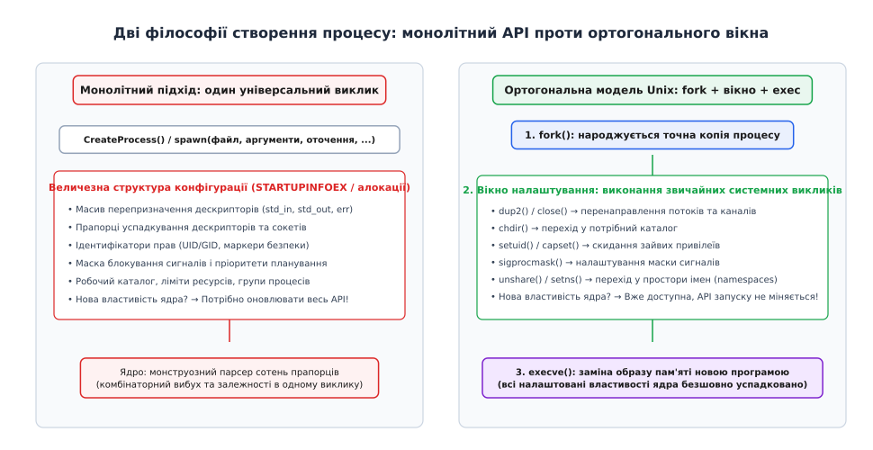
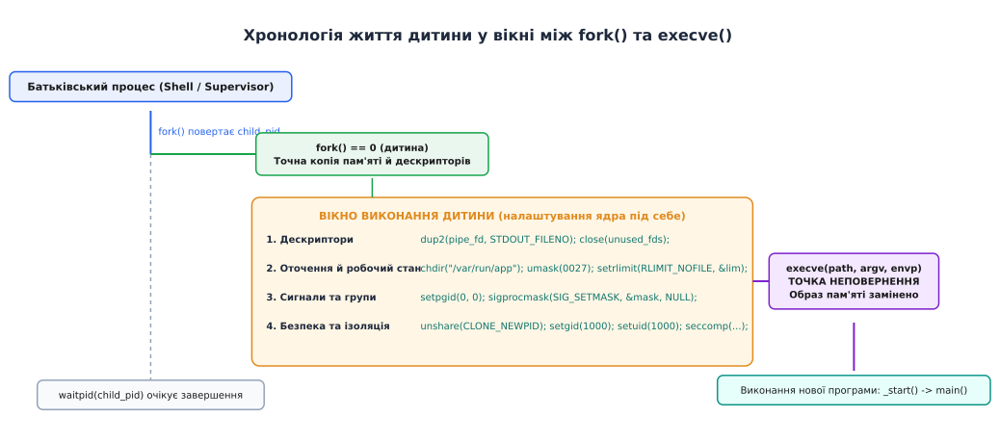
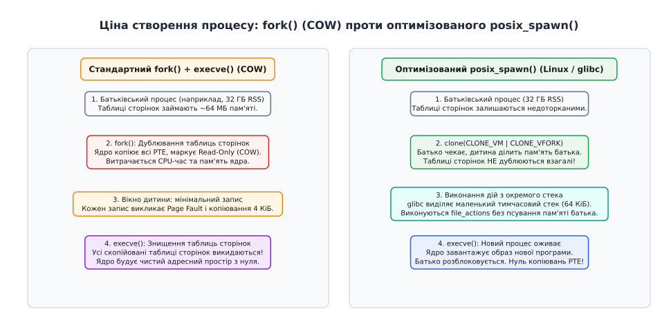

# Чому саме два виклики, а не один

<preknowlist>
- [Процес: що це насправді](book:unix-linux/process-model) — процес має власний адресний простір, таблицю дескрипторів, облікові структури ядра та контекст виконання.
- [PID і дерево процесів](book:unix-linux/pid-and-hierarchy) — кожен процес у системі має унікальний ідентифікатор і жорсткий зв'язок із батьківським процесом.
- [fork: розмноження процесу](book:unix-linux/fork-semantics) — створення нового процесу через точне клонування наявного з поверненням двох різних значень.
- [exec: заміна образу](book:unix-linux/exec-semantics) — системний виклик, що замінює адресний простір і код новою програмою зі збереженням ідентичності.
- [Файловий дескриптор](book:unix-linux/file-descriptor) — цілочисельний індекс у таблиці відкритого вводу-виводу процесу.
</preknowlist>

Коли командна оболонка виконує конвеєр із трьох команд на зразок `cat /var/log/nginx/access.log | grep "404" | wc -l > report.txt`, ядро операційної системи мусить одночасно розв'язати десяток різнорідних задач. Для кожного з трьох процесів потрібно виділити новий ідентифікатор, налаштувати неіменовані канали між дескрипторами стандартного виводу попередньої програми та входу наступної, відкрити підсумковий файл на запис під дескриптором 1 для останньої команди, перевести всі три процеси в спільну групу для коректної обробки сигналів термінала й завантажити у їхню пам'ять три різні виконувані файли.

Якби операційна система намагалася виконати цю роботу через один універсальний системний виклик, розробникам ядра довелося б спроєктувати функцію із сотнею параметрів або гігантською структурою конфігурації. Будь-яка комбінація перенаправлень, зміна робочого каталогу, обмеження ресурсів пам'яті чи зміна привілеїв користувача вимагала б внесення нових полів у цей монолітний інтерфейс.

Unix пішов принципово іншим шляхом, розділивши створення процесу на два незалежні системні виклики: `fork` (англ. *fork* — «розвилка», «роздвоєння») створює точну копію поточного процесу, а `execve` (від лат. *exsequi* — «виконати, довести до кінця») замінює вміст пам'яті новою програмою. Між цими двома викликами виникає унікальне часове й просторове вікно, у якому новостворена дитина є повноправним процесом і може налаштувати власне оточення стандартними викликами операційної системи перед тим, як запустити чужий код.

## Проблема конфігурації процесу: комбінаторний вибух параметрів

Запуск нової програми в сучасній багатозадачній операційній системі рідко зводиться до простої передачі шляху до бінарного файлу на диску. Щоб процес міг коректно функціонувати в системному ландшафті, операційна система має знати десятки аспектів його початкового стану:

1. **Таблиця файлових дескрипторів**: куди спрямовано дескриптори 0, 1 та 2 (термінал, файл на диску, сокет чи канал); які службові дескриптори батька потрібно успадкувати, а які — негайно закрити з міркувань безпеки.
2. **Контекст файлової системи**: поточний робочий каталог (`cwd`), маска створення файлів (`umask`), а для ізольованих контейнерів — зміна кореневого каталогу (`chroot` або `pivot_root`).
3. **Ідентичність та привілеї**: реальний і ефективний ідентифікатори користувача (UID) та групи (GID), список додаткових груп (`setgroups`), набори системних можливостей (Linux capabilities) та фільтри безпеки системних викликів (seccomp).
4. **Обмеження системних ресурсів**: жорсткі та м'які ліміти процесорного часу (`RLIMIT_CPU`), максимального обсягу віртуальної пам'яті (`RLIMIT_AS`), кількості відкритих дескрипторів (`RLIMIT_NOFILE`) та розміру файлу дампу ядра.
5. **Планування та ієрархія**: пріоритет планувальника (`nice`), алгоритм реального часу (`SCHED_FIFO` чи `SCHED_RR`), маска прив'язки до процесорних ядер (CPU affinity), ідентифікатор групи процесів (PGID) та сеансу (SID).
6. **Сигнали та оточення**: маска тимчасово заблокованих сигналів (`sigprocmask`), таблиця диспозицій сигналів (скидання в ігнорування або дію за замовчуванням) та масив змінних середовища (`envp`).
7. **Простори імен (Namespaces)**: ізоляція мережевого стека, простору ідентифікаторів процесів, точок монтування та користувацьких мапінгів.

Якщо спробувати об'єднати всі ці вимоги в один системний виклик, виникає класична проблема монолітного проектування інтерфейсів.



*Монолітний підхід змушує ядро парсити складні конфігураційні структури, тоді як декомпозиція Unix дозволяє налаштовувати процес наявними системними викликами.*

У монолітній моделі, реалізованій у Win32 API функцією `CreateProcess`, системний виклик приймає понад десять аргументів, включно зі структурою `STARTUPINFOEX`, яка містить списки атрибутів `PROC_THREAD_ATTRIBUTE_LIST`, масиви успадкованих дескрипторів та прапорці створення. Щоразу, коли в операційній системі з'являється новий механізм ізоляції чи керування ресурсами, монолітну функцію доводиться модифікувати, ускладнюючи синтаксис та створюючи нові версії структур даних.

## Історичний генезис: як з'явилося розділення

Наприкінці 1960-х років операційна система MULTICS використовувала монолітну концепцію запуску програм. Створення процесу було складною системною процедурою, яка вимагала виділення пам'яті, ініціалізації внутрішніх структур ядра та передачі вичерпного масиву параметрів.

Коли Кен Томпсон (Ken Thompson) і Денніс Рітчі (Dennis Ritchie) у 1969 році створювали першу версію Unix на комп'ютері PDP-7, вони мали в розпорядженні лише 8 кілослів (приблизно 16 кілобайтів) оперативної пам'яті. Створення складного диспетчера конфігурації процесів було неможливим через брак пам'яті.

Томпсон реалізував системний виклик `fork`, запозичений з берклійської експериментальної системи GENIE (SDS 940), усього у 27 рядках асемблерного коду. На апаратурі без віртуальної пам'яті `fork` буквально записував образ процесу на магнітний диск або копіював сегмент пам'яті, а виклик `exec` зчитував новий бінарний файл поверх поточного сегмента.

Рітчі згодом зазначав, що розділення створення процесу на два примітиви спершу здавалося вимушеним спрощенням для економії пам'яті PDP-7. Проте незабаром з'ясувалося, що це рішення породило несподівану модульну елегантність: командна оболонка отримала можливість повністю керувати дескрипторами вводу-виводу та оточенням дитини без допомоги ядра.

## Ортогональна декомпозиція: магія вікна між fork та exec

Архітектурний прорив Unix полягав у застосуванні принципу ортогональності: замість створення спеціалізованого інтерфейсу конфігурації запуску ядро надало можливість налаштовувати новий процес його **власними руками**.

Цей підхід спирається на чітку послідовність дій:

1. Батьківський процес викликає `fork()`. Ядро дублює стан батька й повертає дитині значення `0`.
2. У просторі користувача дитина прокидається як повноцінний, незалежний процес. Вона має власні регістри, власний стек і власні дескриптори, але виконує той самий код, що й батько.
3. Дитина викликає звичайні системні виклики операційної системи, модифікуючи свій власний стан:
   - `dup2(pipe_fd, STDOUT_FILENO)` перемикає стандартний вивід на канал;
   - `chdir("/var/empty")` змінює каталог;
   - `setgid(1000)` та `setuid(1000)` скидають суперкористувацькі права;
   - `setrlimit(RLIMIT_NOFILE, &lim)` встановлює ліміт на дескриптори;
   - `sigprocmask(SIG_SETMASK, &mask, NULL)` виставляє маску сигналів;
   - `unshare(CLONE_NEWNET)` створює новий мережевий простір імен.
4. Коли всі налаштування завершено, дитина робить останній крок — викликає `execve()`.
5. Ядро знищує старий адресний простір, завантажує виконуваний бінарний образ з диска, скидає обробники сигналів на типові дії, але **зберігає** налаштовані дескриптори, права, ліміти, групу процесів та оточення.



*Вікно між розгалуженням і заміною образу: дитина поетапно змінює системні атрибути за допомогою звичайних системних викликів, після чого execve замінює виконуваний образ.*

У цій моделі ядро операційної системи не потребує жодного додаткового коду для підтримки нових параметрів запуску. Якщо розробники ядра створюють новий системний виклик — наприклад, підсистему обмеження доступу `landlock_restrict_self` або завантаження фільтрів `seccomp`, — цей механізм **автоматично** стає доступним для конфігурації будь-яких дочірніх процесів у вікні між `fork` та `exec`.

> 🔧 **Навіщо це.** Без розділення на `fork` і `exec` створення командного конвеєра в оболонці вимагало б спеціального виклику ядра, який умів би атомарно відкривати канали, створювати три процеси та зв'язувати їхні дескриптори. Завдяки `fork` оболонка реалізує складні конвеєри довільної довжини (`a | b | c | d`) виключно в просторі користувача, використовуючи лише базові примітиви `pipe`, `dup2` та `close`.

Практична реалізація надійного запуску з контролем помилок розібрана в окремій вставці: [безпечний запуск процесів із перенаправленням та діагностикою](guide:unix/fork-exec-why-two/proj-process-launcher.md).

## Внутрішній шлях у ядрі: що насправді відбувається під час викликів

Щоб побачити механіку створення процесу на рівні ядра Linux, розглянемо послідовність внутрішніх операцій, які виконуються під час системних викликів `fork` та `execve`.

### Внутрішній механізм fork у ядрі (sys_clone / copy_process)

Коли процес звертається до системного виклику `fork()`, ядро переходить у функцію `kernel_clone()`, серцем якої є функція `copy_process()`:

1. **Виділення структур дескриптора процесу**: ядро алокує нову структуру `task_struct` та пов'язаний із нею блок `thread_info`. Встановлюються базові лічильники використання.
2. **Дублювання дескрипторів (`copy_files`)**: ядро створює копію структури `files_struct`. Усі файлові дескриптори дитини вказують на ті самі описи відкритих файлів (`struct file`), що й дескриптори батька, а лічильники посилань на файли інкрементуються.
3. **Дублювання контексту файлової системи (`copy_fs`)**: копіюється структура `fs_struct`, що містить посилання на поточний каталог (`pwd`) та кореневий каталог (`root`).
4. **Копіювання таблиць пам'яті (`copy_mm`)**: ядро викликає `dup_mmap()`. Для кожної області віртуальної пам'яті (`vm_area_struct`) створюється копія, а відповідні записи в таблицях сторінок (PTE) позначаються як спільні та захищені від запису (Read-Only) для підтримки механізму Copy-On-Write.
5. **Призначення PID**: у просторі імен процесів (`pid_namespace`) виділяється новий числовий ідентифікатор процесу через структуру IDR.
6. **Ініціалізація регістрів (`copy_thread`)**: значення регістрів процесора копіюються з батьківського потоку, проте в регістр повернення значення системного виклику (наприклад, `RAX` на x86-64) для дитини записується жорсткий нуль `0`.
7. **Активація в планувальнику**: функція `wake_up_new_task()` додає новий `task_struct` до черги виконання (runqueue) планувальника CFS / EEVDF.

### Внутрішній механізм execve у ядрі (do_execveat_common)

Коли процес викликає `execve(pathname, argv, envp)`, ядро запускає функцію `do_execveat_common()`:

1. **Перевірка файлу та прав**: ядро відкриває файл через `do_open_execat()` і перевіряє право на виконання (`MAY_EXEC`).
2. **Підготовка структури `linux_binprm`**: ядро зчитує перші 128 байтів бінарного файлу для ідентифікації формату (магічні байти ELF `0x7f 'E' 'L' 'F'` або shebang `#!`).
3. **Копіювання аргументів та середовища**: рядки `argv` та `envp` копіюються з адресного простору користувача в тимчасові сторінки пам'яті ядра.
4. **Точка неповернення (`begin_new_exec`)**:
   - Старий адресний простір (`mm_struct`) безповоротно знищується разом із усіма старими сторінками пам'яті.
   - Усі дескриптори з прапорцем `FD_CLOEXEC` закриваються функцією `do_close_on_exec()`.
   - Обробники сигналів скидаються на `SIG_DFL` функцією `flush_signal_handlers()`.
   - Усі додаткові потоки процесу (pthreads) знищуються.
5. **Завантаження бінарного образу (`load_elf_binary`)**:
   - Ядро відображає сегменти ELF-файлу (`.text`, `.rodata`, `.data`, `.bss`) у новий адресний простір через механізм `vm_mmap()`.
   - Завантажується динамічний компонувальник (`/lib64/ld-linux-x86-64.so.2`), якщо бінарний файл динамічно скомпонований.
   - На вершині нового стека формується структура з аргументами, змінними середовища та допоміжним вектором ядра (`auxv` — Auxiliary Vector).
6. **Передача керування**: регістр покажчика інструкцій процесора встановлюється на точку входу (`_start`), і ядро повертає керування в простір користувача вже всередині нової програми.

## Анатомія операцій у вікні налаштування

Щоб усвідомити всю потужність цього підходу, розглянемо, які саме трансформації здійснюються у вікні виконання дитини в реальних системних компонентах — від командної оболонки до рушіїв контейнеризації на зразок `runc`.

### 1. Перенаправлення потоків вводу-виводу

Найчастіша операція у вікні між викликами — підміна файлових дескрипторів. Утиліта `grep` чи `sort` нічого не знає про файли на диску: вона завжди читає дані з дескриптора `0` (`STDIN_FILENO`) і пише результат у дескриптор `1` (`STDOUT_FILENO`).

Оболонка здійснює перенаправлення за допомогою виклику `dup2(oldfd, newfd)`. Якщо користувач написав `cmd > output.txt`, оболонка в дочірньому процесі виконує:

:::tabs
```c
int fd = open("output.txt", O_WRONLY | O_CREAT | O_TRUNC, 0644);
if (fd < 0) {
    _exit(1);
}
dup2(fd, STDOUT_FILENO); /* тепер дескриптор 1 вказує на файл output.txt */
close(fd);               /* закриваємо дублікат покажчика */
execvp("cmd", argv);
```
```cpp
int fd = open("output.txt", O_WRONLY | O_CREAT | O_TRUNC, 0644);
if (fd < 0) {
    _exit(1);
}
dup2(fd, STDOUT_FILENO);
close(fd);
std::vector<char*> c_argv = { const_cast<char*>("cmd"), nullptr };
execvp(c_argv[0], c_argv.data());
```
:::

Коли новий образ `cmd` розпочинає роботу, його функція `main()` пише в дескриптор 1, навіть не підозрюючи, що байти потрапляють у файл на диску, а не на екран термінала.

### 2. Скидання привілеїв суперкористувача

Системні демони (наприклад, веб-сервери Nginx або сервери SSH) стартують від імені суперкористувача `root`, щоб відкрити захищені мережеві порти (номери 80 чи 443) або прочитати секретні ключі сертифікатів. Обробляти вхідні запити клієнтів із правами `root` категорично заборонено через загрозу безпеці всієї системи.

Розв'язання задачі у вікні `fork` + `exec` виглядає бездоганно:

1. Головний процес відкриває захищений сокет.
2. Викликається `fork()`.
3. Дочірній процес у вікні налаштувань скидає права через виклики `setgid(nogroup)` та `setuid(nobody)`.
4. Дочірній процес викликає `execve()`, запускаючи ізольований обробник запитів від імені непривілейованого користувача.

### 3. Керування завданнями та групами процесів (Job Control)

Командна оболонка є менеджером завдань. Коли користувач запускає команду або конвеєр, оболонка зобов'язана згрупувати всі процеси конвеєра в одну групу процесів (`Process Group`) за допомогою системного виклику `setpgid()`.

Якщо завдання запускається на передньому плані (foreground), оболонка передає контроль над керуючим терміналом цій групі процесів через `tcsetpgrp(STDIN_FILENO, pgid)`. Це гарантує, що натискання клавіш `Ctrl+C` (`SIGINT`) або `Ctrl+Z` (`SIGTSTP`) надішле сигнал усім процесам конвеєра одночасно, не зупиняючи саму оболонку. Усе це налаштування відбувається у вікні між `fork` та `exec`.

### 4. Ініціалізація контейнерів (Namespaces та Seccomp)

Сучасні системи контейнеризації (Docker, Podman, Kubernetes) функціонують виключно завдяки вікну між `fork` та `exec`. Коли контейнерний рушій створює ізольоване середовище, процес-ініціалізатор усередині дитини виконує складну послідовність низькорівневих налаштувань:

- Викликає `unshare(CLONE_NEWNS | CLONE_NEWPID | CLONE_NEWNET | CLONE_NEWIPC | CLONE_NEWUTS)`, створюючи нові простори імен ядра.
- Монтує нову кореневу файлову систему й робить `pivot_root(".", "old_root")`.
- Монтує віртуальні файлові системи `/proc`, `/sys` та `/dev`.
- Встановлює біт заборони отримання нових привілеїв через `prctl(PR_SET_NO_NEW_PRIVS, 1, 0, 0, 0)`.
- Встановлює фільтри системних викликів `seccomp`, блокуючи небезпечні виклики ядра на зразок `reboot` чи `kexec_load`.
- Скидає непотрібні Linux capabilities.
- І лише після цього викликає `execve()`, передаючи керування точці входу контейнера (PID 1 усередині простору імен).

Жоден монолітний системний виклик у світі не здатний надати таку гнучкість без перетворення власного формату параметрів на повноцінну мову програмування.

### 5. Класична демонізація (Патерн Double-Fork)

В історичній практиці системного адміністрування фонові процеси (демони) створювалися за допомогою подвійного розгалуження (double-fork):

:::tabs
```c
pid_t pid = fork();
if (pid > 0) exit(0); /* перший батько виходить */

setsid(); /* створюється новий сеанс без керуючого термінала */

pid = fork();
if (pid > 0) exit(0); /* лідер сеансу виходить */

/* Онук більше ніколи не зможе випадково захопити термінал через open() */
chdir("/");
umask(0);
close(0); close(1); close(2);
open("/dev/null", O_RDWR); /* fd 0 */
dup2(0, 1);                /* fd 1 */
dup2(0, 2);                /* fd 2 */
execve("/usr/sbin/daemon", argv, envp);
```
```cpp
pid_t pid = fork();
if (pid > 0) std::exit(0);

setsid();

pid = fork();
if (pid > 0) std::exit(0);

chdir("/");
umask(0);
for (int fd : {0, 1, 2}) close(fd);
int null_fd = open("/dev/null", O_RDWR);
dup2(null_fd, STDOUT_FILENO);
dup2(null_fd, STDERR_FILENO);

std::vector<char*> c_argv = { const_cast<char*>("/usr/sbin/daemon"), nullptr };
execve(c_argv[0], c_argv.data(), environ);
```
:::

Сьогодні сучасні системи ініціалізації (systemd) відмовилися від цього патерну на користь запуску безпосередньо через супервізор із дескрипторами `systemd-journald`, проте сама можливість реалізувати таку поведінку в просторі користувача завдячує саме гнучкості вікна між викликами.

## Матриця успадкування: що переживає execve і чому

Розуміння того, які саме структури ядра переживають виклик `execve`, а які знищуються, спирається на базовий інваріант Unix: **гине все, що адресується всередині адресного простору процесу; зберігається все, що зберігається в структурах ядра**.

| Ресурс / Стан процесу | Доля при fork() | Доля при execve() | Технічне обґрунтування |
| :--- | :--- | :--- | :--- |
| **Віртуальна пам'ять (код, купа, стек)** | Клонується (COW) | Повністю знищується | `execve` завантажує новий ELF-образ з диска |
| **Файлові дескриптори** | Клонуються посилання | Зберігаються (якщо нема `FD_CLOEXEC`) | Таблиця дескрипторів належить процесу, а не коду |
| **Користувач та група (UID, GID)** | Успадковуються | Зберігаються (крім бітів `setuid`) | Права належать обліковому запису процесу |
| **Поточний каталог (cwd)** | Успадковується | Зберігається | Вказівник на `struct dentry` живе в ядрі |
| **Маска створення файлів (umask)** | Успадковується | Зберігається | Поле цілого числа в структурі `task_struct` |
| **Ліміти ресурсів (setrlimit)** | Успадковуються | Зберігаються | Таблиця `rlimit` закріплена за процесом |
| **Група процесів і сеанс (PGID, SID)** | Успадковуються | Зберігаються | Ієрархія процесів не змінюється при заміні образу |
| **Маска заблокованих сигналів** | Успадковується | Зберігається | Бітова маска `sigset_t` не залежить від коду |
| **Обробники сигналів (сигнальні функції)** | Успадковуються | Скидаються на `SIG_DFL` | Адреси функцій старого коду стають недійсними |
| **Ігнорування сигналів (`SIG_IGN`)** | Успадковується | Зберігається | Позначка ігнорування живе в ядрі, а не в коді |
| **Потоки виконання (pthreads)** | Гинуть усі, крім одного | Відсутні (один потік) | Новий образ починає роботу з одного потоку |
| **Блокування записів у файлах (fcntl)** | Не успадковуються | Зберігаються | Блокування прив'язані до комбінації PID та файлу |

## Темний бік fork: ціна копіювання та пастки багатопотоковості

Попри бездоганну математичну елегантність та гнучкість, модель `fork` + `exec` створює серйозні інженерні проблеми на сучасних високонавантажених серверах. У 2019 році група дослідників із Microsoft Research та ETH Zurich опублікувала відому статтю під назвою *«A fork() in the road»*, у якій детально проаналізувала чотири фундаментальні вади класичного розгалуження в контексті сучасного апаратного та програмного забезпечення.

### 1. Катастрофа багатопотоковості: небезпека блокувань

Коли процес, що має десятки активних потоків виконання (threads), викликає `fork()`, ядро копіює стан адресного простору, але **створює в дитині рівно один потік** — той самий, який здійснив системний виклик. Усі інші потоки в дочірньому процесі миттєво й безслідно зникають.

Це породжує критичну вразливість до взаємних блокувань (deadlocks):

- Уявімо, що в батьківському процесі потік `A` викликав `malloc()`. Всередині бібліотеки `libc` потік `A` захопив внутрішній м'ютекс розподілювача пам'яті (`pthread_mutex_lock(&arena_lock)`).
- У цей самий момент потік `B` викликає `fork()`.
- Дочірній процес з'являється на світ з копією всієї пам'яті, де прапорець м'ютекса `arena_lock` позначений як **захоплений**.
- Оскільки потік `A` у дочірньому процесі не існує, звільнити цей м'ютекс нікому.
- Якщо дочірній процес у вікні між `fork` та `exec` викличе `malloc()`, `printf()`, `getpwuid()` або будь-яку іншу функцію, що потребує динамічної пам'яті чи блокувань, потік дитини заблокується **назавжди**.

Саме тому стандарти POSIX накладають суворе залізне обмеження: у дочірньому процесі багатопотокової програми між `fork` та `exec` дозволено викликати **виключно асинхронно-безпечні функції** (async-signal-safe functions). Будь-яке виділення пам'яті через `malloc` або звернення до складних об'єктів мови C++ у цьому вікні є невизначеною поведінкою (undefined behavior).

### 2. Ціна дублювання таблиць сторінок

Механізм [копіювання при записі](book:unix-linux/copy-on-write) (Copy-On-Write, COW) позбавив операційну систему потреби копіювати фізичні кадри оперативної пам'яті під час `fork()`. Проте саме ядро зобов'язане скопіювати **самі таблиці сторінок** (Page Table Entries, PTE).

На архітектурі x86-64 для адресації 1 ГБ оперативної пам'яті зі стандартним розміром сторінки 4 КіБ потрібно приблизно 2 МБ таблиць сторінок. Якщо на сервері працює процес бази даних (наприклад, Redis чи PostgreSQL) з обсягом даних 128 ГБ, його таблиці сторінок займають у пам'яті ядра близько 256 МБ:

```
PTE_size
= 128 ГБ ÷ 4 КіБ · 8 байтів      [обчислення кількості записів і розміру]
= 33 554 432 · 8 байтів
= 268 435 456 байтів
= 256 МБ                         [чистий розмір таблиць відображення]
```

Під час виклику `fork()` процесор змушений витратити від 100 до 300 мілісекунд чистого часу ядра на створення копії цих 256 МБ таблиць, скидання кешів трансляції адрес (TLB) та маркування мільйонів сторінок прапорцем захисту від запису (Read-Only). Потім дочірній процес робить один виклик `execve()` — і всі ці щойно створені 256 МБ таблиць сторінок викидаються на смітник. Для високонавантаженого сервера затримка у 300 мс на кожному запуску підпроцесу є неприйнятною деградацією продуктивності.

### 3. Пастка вичерпання пам'яті (Overcommit та OOM)

Коли процес на 64 ГБ викликає `fork()`, операційна система має формально гарантувати, що в разі одночасного запису обох процесів у всі сторінки системі вистачить фізичної пам'яті та простору підкачування (swap).

Якщо на сервері вимкнено механізм надлишкового виділення пам'яті (параметр ядра `/proc/sys/vm/overcommit_memory = 2`), системний виклик `fork()` завершиться помилкою `ENOMEM` (брак пам'яті), якщо в системі немає вільних 64 ГБ оперативної пам'яті, навіть якщо дитина планує негайно викликати `execve("/bin/true")` і не потребує жодного байта пам'яті батька.

### 4. Небезпека прихованого витоку ресурсів

Типово в Unix усі відкриті файлові дескриптори батьківського процесу залишаються відкритими й доступними дочірньому процесу після заміни образу. Якщо розробник забув встановити прапорець `FD_CLOEXEC` на чутливий дескриптор (наприклад, сокет підключення до бази даних з паролями або дескриптор каталогу з правами адміністратора), цей дескриптор витікає в сторонню утиліту, що може призвести до критичних уразливостей несанкціонованого доступу.

## Порівняльні вимірювання: скільки коштує запуск процесу

Реальні вимірювання затримки створення процесу на сучасних багатоядерних серверах Linux наочно демонструють межі застосування обох підходів.

У серії експериментів вимірювався час від моменту ініціалізації виклику створення процесу до моменту входу в функцію `main()` цільової програми при різному обсязі зайнятої пам'яті (RSS) батьківського процесу:

| Обсяг пам'яті батька (RSS) | fork() + execve() | posix_spawn() (glibc 2.24+) | vfork() + execve() |
| :--- | :--- | :--- | :--- |
| **10 МБ** | 0.25 мс | 0.08 мс | 0.07 мс |
| **1 ГБ** | 2.10 мс | 0.09 мс | 0.08 мс |
| **16 ГБ** | 34.50 мс | 0.09 мс | 0.08 мс |
| **64 ГБ** | 148.00 мс | 0.10 мс | 0.08 мс |
| **128 ГБ** | 295.00 мс | 0.10 мс | 0.09 мс |

Як видно з вимірювань, затримка класичного `fork() + execve()` лінійно зростає зі збільшенням обсягу таблиць сторінок батька, тоді як оптимізований `posix_spawn()` демонструє стабільний константний час запуску (близько 0.1 мс) незалежно від того, скільки гігабайтів пам'яті споживає батьківський процес.

## Сучасна еволюція: vfork, posix_spawn та clone3

Усвідомлення накладних витрат класичного розгалуження стимулювало створення нових системних механізмів, покликаних зберегти контроль над конфігурацією процесу, позбувшись зайвого дублювання пам'яті.

### Ера vfork: швидкість ціною безпеки стека

Ще у 1979 році Білл Джой (Bill Joy) у системі 3BSD реалізував виклик `vfork()` (англ. *virtual memory fork*). Його ідея полягала в повній відмові від копіювання таблиць сторінок:

- Батьківський процес повністю призупиняє своє виконання.
- Дочірній процес починає виконуватися **в тому самому адресному просторі й на тому самому стеку**, що й батько.
- Дитина зобов'язана негайно викликати `execve()` або `_exit()`. Щойно заміна образу або вихід відбулися, батько прокидається й продовжує роботу.

Виклик `vfork()` був надзвичайно швидким (працював за лічені мікросекунди), але становив інженерне мінне поле: якщо дитина змінювала значення локальних змінних на стеку, викликала іншу функцію або поверталася з поточної функції через `return`, вона безповоротно руйнувала стек батьківського процесу, що призводило до фатальних аварійних завершень (Segmentation Fault).

### posix_spawn: структурована декларативна альтернатива

Щоб надати стандартизовану, швидку та безпечну заміну зв'язці `fork` + `exec`, робоча група POSIX у стандарті IEEE 1003.1-2001 представила функції `posix_spawn` та `posix_spawnp`.

Замість написання довільного процедурного коду у вікні між викликами, програміст формує дві структури даних:
1. **Атрибути процесу (`posix_spawnattr_t`)**: визначають маску сигналів, дії за замовчуванням, групу процесів та прапорці планувальника.
2. **Файлові дії (`posix_spawn_file_actions_t`)**: лінійний масив операцій над дескрипторами (`addopen`, `addclose`, `adddup2`, `addchdir_np`).



*Традиційний fork копіює сотні мегабайтів таблиць сторінок, тоді як сучасний posix_spawn використовує CLONE_VM і спеціальний стек, усуваючи накладні витрати пам'яті.*

Починаючи з версії glibc 2.24 (2016 рік), у середовищі Linux виклик `posix_spawn` отримав революційну оптимізацію: бібліотека виконує створення процесу через системний виклик `clone` із прапорцями `CLONE_VM | CLONE_VFORK`, виділяючи для виконання файлових дій **окремий захищений тимчасовий стек** розміром 64 КіБ.

Це дозволило досягти максимальної продуктивності:
- Таблиці сторінок батьківського процесу не копіюються взагалі (прискорення запуску в десятки разів для процесів з великим RSS).
- Стек батька надійно захищений від пошкодження, оскільки дитина працює на виділеному буфері пам'яті.
- Будь-яка помилка конфігурації автоматично синхронізується й повертається батькові як статус виклику `posix_spawn`.

Детальний довідник функцій, масок атрибутів та прикладів використання наведено у вставці: [інтерфейс posix_spawn: структурований запуск із набором дій](guide:unix/fork-exec-why-two/api-posix-spawn.md).

### Системний виклик clone3 та дескриптори pidfd у сучасному Linux

Сучасне ядро Linux продовжує еволюцію механізмів створення процесів за допомогою системного виклику `clone3()`, доданого у версії Linux 5.3. Він приймає розширювану структуру `struct clone_args` і дозволяє безпосередньо контролювати всі параметри нового процесу:

- Отримання дескриптора процесу `pidfd` для безпечного відстеження життєвого циклу без небезпеки перевикористання PID (PID rollover race conditions);
- Встановлення цільової контрольної групи cgroups (`cgroup` FD);
- Атомарний перехід у набір просторів імен;
- Налаштування розміру та розташування стека.

Завдяки дескриптору `pidfd` батьківський процес більше не ризикує надіслати сигнал чужому процесу через числове співпадіння ідентифікаторів, а може очікувати на завершення дочірнього процесу за допомогою стандартних викликів `poll`, `select` або `epoll`.

## Синтез: чому два виклики пережили пів століття

Історія розвитку системного програмування довела, що розділення створення процесу на два примітиви — розгалуження та заміну образу — було одним із найвдаліших архітектурних рішень в історії інформатики.

| Критерій порівняння | Монолітний підхід (CreateProcess / spawn) | Композиційна модель Unix (fork + вікно + exec) |
| :--- | :--- | :--- |
| **Принцип побудови** | Один великий виклик із вичерпним переліком параметрів | Два ортогональні виклики з вікном виконання між ними |
| **Розширюваність ядра** | Будь-яка нова властивість вимагає оновлення API запуску | Нові системні виклики автоматично доступні у вікні налаштування |
| **Гнучкість композиції** | Обмежена заздалегідь передбаченими прапорцями | Необмежена: доступна вся повнота мови програмування |
| **Багатопотокова безпека** | Висока: ядро атомарно налаштовує стан | Потребує обережності: дозволені лише async-signal-safe функції |
| **Швидкодія на великій пам'яті** | Висока: немає дублювання таблиць сторінок | Традиційний `fork` дорогий; оптимізується через `posix_spawn` / `CLONE_VM` |

Сьогодні в інженерній практиці спостерігається чіткий і раціональний розподіл ролей:

1. **`posix_spawn`** використовується в багатопотокових високонавантажених серверах, віртуальних машинах (Java Virtual Machine, Node.js, Python `subprocess`) та системних бібліотеках, де критично важливі максимальна швидкість запуску, нульове навантаження на пам'ять і захист від взаємних блокувань м'ютексів.
2. **`fork` + `exec`** залишається безальтернативним фундаментом для командних оболонок (bash, zsh), супервізорів процесів (systemd), рушіїв контейнеризації (containerd, runc) та систем віртуалізації, де потрібен повний, недекларативний контроль над кожною деталлю операційного оточення процесу перед передачею керування новому бінарному образу.

Unix обрав композицію малих, ортогональних примітивів замість одного всемогутнього виклику — і саме ця властивість забезпечила життєздатність моделі процесів упродовж понад п'ятдесяти років.
