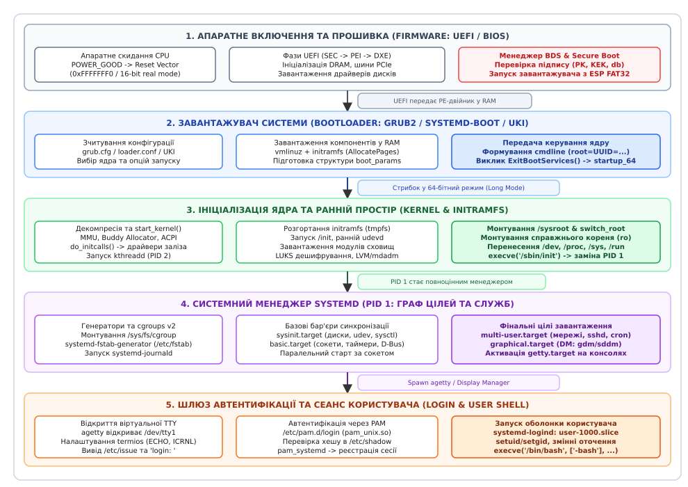
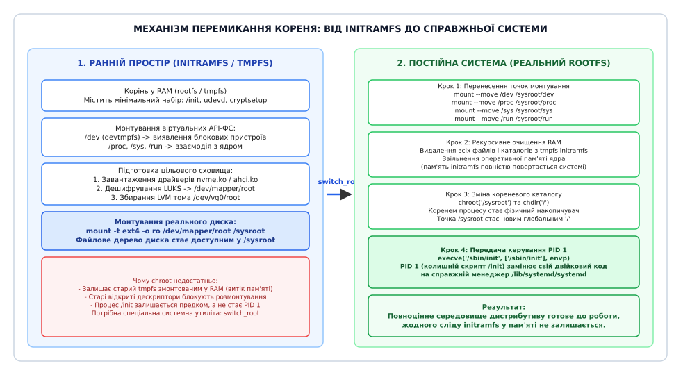
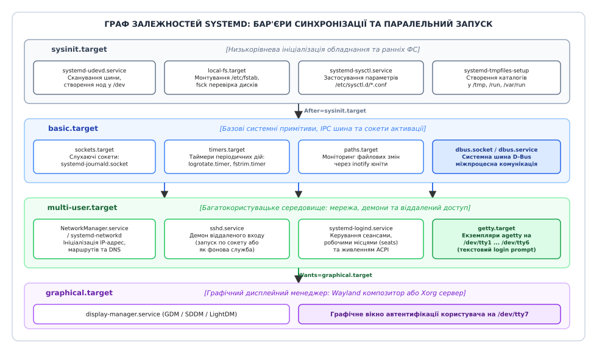
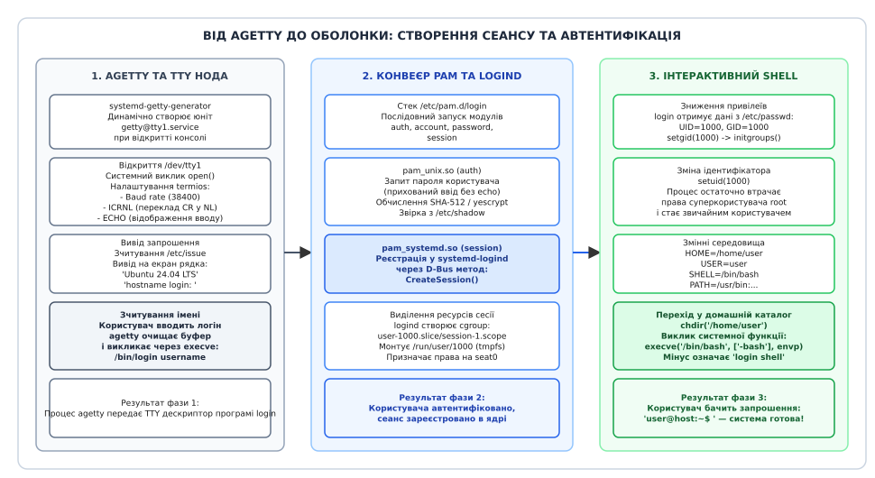

# Від живлення до запрошення входу

<preknowlist>
- [Архітектура системного комп'ютера](root:hw-arch/what-is-processor) — шини пам'яті, регістри CPU, системне скидання та адресація пам'яті.
- [Системний виклик](root:sys-unix/syscall-mechanics) — механіка переходу через межу привілеїв між простором користувача та ядром.
- [ELF](root:sys-unix/elf-structure) — формат виконуваних двійкових файлів, таблиці сегментів та динамічні заголовки.
- [Двійкові формати та лінкування](root:sf-lang/linking) — організація заголовків PE/COFF, точки входу та динамічне завантаження коду.
</preknowlist>

Коли оператор натискає кнопку живлення на передній панелі сервера, блок живлення активує первинні перетворювачі напруги й тестує стабільність ліній +12V, +5V та +3.3V. Протягом 100–500 мілісекунд, необхідних для згасання перехідних процесів у котушках індуктивності та конденсаторах фільтрів, блок живлення утримує низький рівень на сигнальній лінії `POWER_GOOD`. Щойно електричні параметри входять у штатний коридор допусків (±5%), контролер виставляє високий рівень (+5V). Схема системного скидання чипсета знімає блокуючий сигнал із контакту `#RESET` центрального процесора.

У цю саму мить апаратна логіка ядра x86_64 ініціалізує внутрішні регістри процесора: регістр сегмента коду `%cs` отримує селектор `0xF000` з прихованою базовою адресою `0xFFFF0000`, а регістр покажчика інструкцій `%rip` встановлюється у значення `0xFFF0`. Сумарна фізична адреса першої машинної інструкції дорівнює `0xFFFFFFF0` — це апаратний вектор скидання (*Reset Vector*), розташований рівно за 16 байтів нижче верхньої межі 4 ГіБ фізичного адресного простору. Рівно через 3.2 секунди на екрані з'являється мерехтливий текстовий курсор біля запрошення `login: ` віртуальної консолі `/dev/tty1`.

Між цими двома митями комп'ютер проходить естафету крізь п'ять кардинально відмінних середовищ виконання. Процесор тричі змінює апаратні режими роботи — з 16-бітного реального режиму в 32-бітний захищений і далі в 64-бітний довгий режим (*Long Mode*). Операційна система ініціалізує сторінкову пам'ять MMU, виявляє тисячі апаратних пристроїв, розгортає тимчасовий корінь у RAM, розблоковує криптографічні ключі накопичувачів, перемикає файлове дерево на фізичний диск і розгортає орієнтований ациклічний граф із сотень взаємозалежних системних служб. Якщо хоча б одна ланка цієї естафети втратить передачу — система зависне без жодного повідомлення користувачеві.


*Повний наскрізний ланцюг завантаження Linux: послідовна передача керування між п'ятьма рівнями системи, зміна режимів процесора та трансформація кореневого файлового дерева.*

## Етап 1: Апаратне скидання та прошивка (Firmware: UEFI / BIOS)

У момент системного скидання оперативна пам'ять комп'ютера DRAM ще не налаштована: її контролер не знає частоти шини, таймінгів та конфігурації встановлених модулів DIMM. Адреса вектора скидання `0xFFFFFFF0` апаратно транслюється чипсетом материнської плати через шину SPI (*Serial Peripheral Interface*) на мікросхему енергонезалежної флеш-пам'яті SPI Flash, де зберігається початковий код прошивки.

Сучасні комп'ютерні системи використовують стандарт [прошивки UEFI](root:sys-unix/uefi-firmware) (англ. *Unified Extensible Firmware Interface* — єдиний розширюваний інтерфейс прошивки), який прийшов на заміну застарілій системі BIOS (англ. *Basic Input/Output System*). Ініціалізація материнської плати під керуванням UEFI реалізується як модульний конвеєр із чотирьох чітких фаз:

1. **SEC (Security Phase):** Перші інструкції процесора виконуються в особливому режимі без оперативної пам'яті (*Cache-as-RAM*, CAR). Прошивка налаштовує кеш-пам'ять L1/L2 процесора так, щоб вона тимчасово виконувала роль оперативної пам'яті для зберігання стека та локальних змінних. Модуль SEC перевіряє цілісність початкового блоку прошивки (Microcode Update, автентифікація коду відновлення) та готує базові структури передачі параметрів.
2. **PEI (Pre-EFI Initialization):** Фаза апаратної ініціалізації мінімального рівня. Модулі PEIM (*PEI Modules*) опитують мікросхеми SPD на планках пам'яті через шину SMBus, налаштовують напруги живлення DRAM, проводять навчання ліній сигналів контролера пам'яті та тестують стабільність шини. Щойно оперативна пам'ять стає доступною, код переносить стек із кешу CPU у фізичну RAM і виявляє базові лінії шини PCI Express.
3. **DXE (Driver Execution Environment):** Центральна та найбільш тривала фаза UEFI. Диспетчер DXE завантажує десятки модульних драйверів у двійковому форматі PE/COFF: драйвери кореневих портів PCIe, хост-контролерів USB (xHCI), накопичувачів NVMe та SATA AHCI, контролерів гігабітної мережі та відеоадаптерів GOP (англ. *Graphics Output Protocol*). DXE будує в пам'яті базу даних протоколів і створює таблиці конфігурації ACPI (DSDT, SSDT, MADT, FADT). Якщо на картах розширення встановлено модулі Option ROM, DXE перевіряє їхні криптографічні підписи перед виконанням.
4. **BDS (Boot Device Selection):** Менеджер завантаження прошивки опитує енергонезалежні змінні NVRAM `BootOrder` та `BootNext`. Знайшовши цільовий накопичувач із розміткою GPT (*GUID Partition Table*), прошивка монтує системний розділ EFI (ESP — *EFI System Partition*, розділ із файловою системою FAT32) і знаходить підписаний завантажувальний файл (наприклад `\EFI\BOOT\BOOTX64.EFI` або `\EFI\ubuntu\shimx64.efi`).

```
Ланцюг перевірки Secure Boot:
[Апаратний корінь довіри: Ключ платформи PK]
                  │
                  ▼
   [Ключ обміну ключами: KEK]
                  │
                  ▼
 [База дозволених підписів: db]
                  │
                  ▼
[Підпис PE-двійника: shimx64.efi / grubx64.efi] ──► Успіх ──► Запуск у RAM
```

Якщо в прошивці активний механізм [безпечного завантаження Secure Boot](root:sys-unix/secure-boot), прошивка перевіряє криптографічний підпис двійкового файлу за алгоритмом RSA-2048/SHA-256 або ECDSA. Процес верифікації спирається на ієрархію сертифікатів: Ключ платформи PK (*Platform Key*) контролює Ключ обміну ключами KEK (*Key Exchange Key*), який підписує базу дозволених сертифікатів `db`. Якщо контрольна сума файлу або його цифровий підпис відсутні в `db` або явно внесені до чорного списку `dbx`, прошивка негайно перериває виконання з апаратною помилкою `Access Denied`.

Паралельно з перевіркою підписів система може здійснювати виміряне завантаження (*Measured Boot*) за допомогою криптографічного чипа TPM2 (*Trusted Platform Module*). Прошивка обчислює хеші SHA-256 кожного завантаженого коду і розширює ними регістри конфігурації платформи PCR (*Platform Configuration Registers*):
* `PCR 0`: Хеш коду базової прошивки UEFI (SEC/PEI);
* `PCR 2`: Хеш драйверів DXE та Option ROM карт розширення;
* `PCR 4`: Хеш виконуваного файлу завантажувача (GRUB/shim);
* `PCR 7`: Стан та сертифікати Secure Boot.

Ці вимірювання утворюють криптографічний зліпок системи, який згодом використовується для автоматичного розблокування шифрованих дисків через LUKS без запиту пароля.

> 🔧 **Чому застарілий BIOS поступається UEFI.**
> Класичний BIOS зчитував лише один перший сектор накопичувача розміром 512 байтів — Master Boot Record (MBR). З них під код завантажувача виділялося лише 446 байтів (решта відводилася під 4 записи таблиці розділів по 16 байтів і двобайтову сигнатуру `0x55AA`). Цього обсягу вистачало лише на те, щоб прочитати наступні кілька секторів диска (Stage 1.5), які потім завантажували основний код (Stage 2). Крім того, BIOS працював у 16-бітному реальному режимі з адресним обмеженням у 1 МіБ і таблицею розділів MBR, яка не підтримувала диски понад 2 ТіБ. UEFI працює безпосередньо у 64-бітному режимі, розуміє таблицю розділів GPT і самостійно зчитує файли будь-якого розміру з файлової системи FAT32.

## Етап 2: Завантажувач системи (GRUB2 / systemd-boot / UKI)

Завантажувач (англ. *Bootloader*) — це автономна програма, завдання якої полягає в тому, щоб перенести образ ядра операційної системи та образ тимчасового диска з накопичувача в оперативну пам'ять, підготувати параметри запуску й передати процесор ядру.

У сучасних дистрибутивах Linux використовуються універсальний модульний завантажувач GRUB2, мінімалістичний завантажувач `systemd-boot` або монолітні образи [systemd-boot та UKI](root:sys-unix/systemd-boot-and-systemd-stub-uki).

Завантажувач виконує чотири послідовні задачі:

1. **Зчитування конфігурації:** Завантажувач відкриває конфігураційний файл (наприклад `/boot/grub/grub.cfg` або `/loader/entries/*.conf`), відображає меню вибору доступних ядер операційної системи або очікує завершення зворотного відліку таймера.
2. **Виділення оперативної пам'яті:** За допомогою сервісів прошивки UEFI Boot Services (функція `AllocatePages()` з типом пам'яті `EfiLoaderData`) завантажувач виділяє безперервні фізичні сторінки пам'яті для розміщення стисненого образу ядра `vmlinuz` та тимчасового образу раннього простору `initramfs`.
3. **Формування структури параметрів:** Завантажувач заповнює спеціальну системну структуру ядра x86 `struct boot_params` (історично відому як *Zero Page*). Ця структура містить повну карту фізичної пам'яті E820, покажчики на ACPI RSDP, налаштування відеорежиму VESA/GOP, розмір і фізичну адресу образу ramdisk (`hdr.ramdisk_image`, `hdr.ramdisk_size`), а також 64-бітний фізичний покажчик `hdr.cmd_line_ptr` на рядок аргументів [завантажувач і cmdline](root:sys-unix/bootloader-and-cmdline) (наприклад `root=UUID=4a2b... ro quiet splash`).
4. **Вихід із сервісів прошивки:** Завантажувач викликає фінальну функцію UEFI `ExitBootServices()`. З цієї миті всі тимчасові драйвери прошивки в оперативній пам'яті вимикаються, пам'ять типу `EfiBootServicesCode` та `EfiBootServicesData` звільняється для використання операційною системою, а керування процесором передається на фізичну точку входу ядра `startup_64`.

```
Формування та передача параметрів ядру:
[ESP: /boot/vmlinuz]   ──► Зчитування в RAM (0x1000000)
[ESP: /boot/initramfs] ──► Зчитування в RAM (0x4000000)
[UEFI Memory Map]      ──► Заповнення struct boot_params
[Командний рядок]      ──► "BOOT_IMAGE=/vmlinuz root=UUID=... ro"
                                  │
                                  ▼
                     ExitBootServices() ──► jmp startup_64
```

У разі завантаження через застарілий BIOS або при переході з 32-бітного завантажувача ядро виконує перемикання режимів за допомогою коду трампліна (*Trampoline Code*):
* Створюється тимчасова глобальна таблиця дескрипторів GDT (*Global Descriptor Table*) з дескрипторами 64-бітного сегмента коду та даних;
* Активується розширення фізичних адрес PAE (*Physical Address Extension*) встановленням біта `CR4.PAE = 1`;
* Вмикається довгий режим у модельно-специфічному регістрі `MSR IA32_EFER` встановленням біта `LME = 1` (*Long Mode Enable*);
* Активується сторінкова трансляція встановленням біта `CR0.PG = 1` (*Paging*);
* Виконується дальній стрибок `ljmp` на 64-бітний селектор сегмента, який остаточно переводить процесор у 64-бітний Long Mode.

У сучасній архітектурі UKI (англ. *Unified Kernel Image*) потреба у складному завантажувачі зникає. Двійковий файл UKI є єдиним монолітним файлом формату PE/COFF, усередині якого в окремих секціях упаковано:
* Секція `.stub`: невеликий завантажувальний стаб `systemd-stub`;
* Секція `.cmdline`: незмінний вшитий командний рядок ядра;
* Секція `.linux`: стиснений бінарник ядра `vmlinuz`;
* Секція `.initrd`: образ файлової системи `initramfs`;
* Секція `.osrel`: інформація про версію дистрибутиву `/etc/os-release`.

Такий монолітний файл підписується єдиним ключем Secure Boot, що повністю унеможливлює атаку підміни параметрів ядра або підробку образу `initramfs` на диску.

## Етап 3: Рання ініціалізація ядра (Early Kernel Init)

Коли процесор починає виконувати код точки входу `startup_64` (файл ядра `arch/x86/boot/compressed/head_64.S`), ядро перебуває у стані саморозпаковувача.

```
Послідовність старту ядра Linux:
startup_64 (декомпресор zstd/xz)
       │
       ▼
Розпакування vmlinuz у фізичну пам'ять
       │
       ▼
Налаштування базових 4-рівневих сторінок MMU (PML4)
       │
       ▼
Вхід у головну функцію start_kernel() (init/main.c)
       ├── setup_arch(): читання ACPI, резервування пам'яті
       ├── trap_init() & early_irq_init(): переривання CPU
       ├── mm_init(): запуск Buddy Allocator та SLUB-алокатора
       ├── sched_init(): черги задач планувальника (EEVDF)
       ├── smp_init(): запуск інших процесорних ядер (IPI)
       └── do_initcalls(): ініціалізація вбудованих драйверів
              │
              ▼
Створення процесу kthreadd (PID 2) для потоків ядра
       │
       ▼
Виклик kernel_init() ──► run_init_process() (PID 1)
```

Ядро розгортає стиснені двійкові секції коду та даних у виділену пам'ять і переходить у головну функцію ініціалізації `start_kernel()` (файл `init/main.c`), яка виконує повну побудову підсистем операційної системи:

* **Ранній вивід повідомлень (`earlycon` та `earlyprintk`):** До ініціалізації повнофункціонального графічного стека та TTY-драйверів ядро налаштовує прямий запис символів у регістри послідовного порту UART (порт `0x3F8` для COM1) або у лінійний кадровий буфер GOP через механізм `earlycon`. Це дозволяє відстежувати хід завантаження навіть при фатальних збоях на перших мілісекундах.
* **Парсинг ранніх аргументів:** Спеціальний парсер `parse_early_param()` обробляє низькорівневі налаштування ядра, такі як конфігурація відладки `debug`, параметри розподілу сторінок пам'яті `hugepages=` та параметри безпеки ізоляції `mitigations=`.
* **Ініціалізація керування пам'яттю (`setup_arch` та `mm_init`):** Ядро зчитує мапу пам'яті E820, налаштовує постійні 4-рівневі (PML4) або 5-рівневі (PML5) таблиці сторінок віртуальної пам'яті MMU, виділяє зони пам'яті `ZONE_DMA`, `ZONE_NORMAL`, `ZONE_MOVABLE` та запускає сторінковий алокатор фізичної пам'яті (*Buddy Allocator*) разом із кешувальним алокатором системних структур SLUB (`kmem_cache`). Ядро створює пряме відображення всієї фізичної пам'яті (*Direct Physical Mapping*) у верхню половину віртуального простору ядра `PAGE_OFFSET`, розмежовує області динамічного виділення `VMALLOC_START` та системні структури опису фізичних сторінок `VMEMMAP_START`.
* **Ініціалізація таблиці переривань (`trap_init` та `early_irq_init`):** Процесор налаштовує таблицю дескрипторів переривань IDT (*Interrupt Descriptor Table*), реєструючи обробники апаратних винятків процесора (Page Fault `#PF`, General Protection `#GP`, Divide by Zero `#DE`).
* **Ініціалізація планувальника (`sched_init`):** Створюються базові черги виконання для кожного фізичного ядра процесора, налаштовуються структури таймерів та запускається планувальник задач EEVDF (*Earliest Eligible Virtual Deadline First*).
* **Багатопроцесорна ініціалізація (`smp_init`):** Головне процесорне ядро (Bootstrap Processor, BSP) надсилає міжпроцесорні переривання IPI (*Inter-Processor Interrupts* — послідовність INIT-SIPI-SIPI) через контролер переривань APIC іншим ядрам процесора (Application Processors, AP), виводячи їх зі стану сну й підключаючи до спільного планувальника.
* **Вбудовані драйвери (`do_initcalls`):** Спеціальний цикл лінкувальника послідовно викликає функції ініціалізації, скомпільовані безпосередньо в монолітний образ (секції від `.initcall0.init` до `.initcall7.init`). На цьому етапі реєструються базові шини (PCI Express, USB), таймери TSC/HPET та створюються кореневі структури підсистеми VFS.
* **Створення системних потоків:** Ядро створює перший потік ядра `kthreadd` (завжди отримує PID 2), який відповідає за породження службових воркерів `kworker/*` та потоків скидання пам'яті на диск `kswapd0`.

Після завершення цих дій функція `start_kernel()` перетворюється на нескінченний фоновий цикл енергозбереження процесора `cpu_idle_loop()` (потік PID 0, або *swapper*), попередньо запустивши окремий потік `kernel_init()`, який зобов'язаний розгорнути перший процес простору користувача.

## Етап 4: Тимчасовий корінь (initramfs) та перемикання кореня (`switch_root`)

Сучасне універсальне ядро Linux не знає, на якому саме накопичувачі розташована коренева файлова система комп'ютера: це може бути NVMe SSD, диск у масиві Hardware RAID, зашифрований том LUKS, логічний розділ LVM, том Btrfs або віддалений мережевий диск iSCSI/NFS. Усі ці технології вимагають завантаження відповідних модулів ядра (`.ko`), наявності службових утиліт та ключів дешифрування.

Щоб вирішити цю проблему без роздування монолітного ядра сотнями мегабайтів сторонніх драйверів, ядро використовує [внутрішню будову initramfs](root:sys-unix/initramfs) (англ. *initial RAM filesystem* — початкова файлова система в оперативній пам'яті).

```
Фаза 1 (initramfs):
[Пам'ять RAM: tmpfs] ──► /init, udevd, cryptsetup, lvm
                             │
                             ▼ (пошук, дешифрування)
[Фізичний диск NVMe] ──► Монтування кореня в /sysroot (ro)

Фаза 2 (switch_root):
1. Перенесення точок: mount --move /dev /sysroot/dev (також /proc, /sys, /run)
2. Очищення RAM:      rm -rf на всі файли старого tmpfs
3. Зміна кореня:      chroot("/sysroot") + chdir("/")
4. Заміна коду PID 1: execve("/sbin/init", ["/sbin/init"], envp)
```

Образ `initramfs` являє собою звичайний архів формату CPIO, стиснений алгоритмом zstd, gzip або xz, який генерується інструментами на зразок [генераторів dracut](root:sys-unix/dracut-and-mkinitcpio-toolchains). Часто до початку основного архіву дописується нестиснений блок мікрокоду процесора (*Early Microcode Container*), який ядро застосовує ще до старту підсистеми VFS. Ядро розпаковує архів у спеціальну кореневу файлову систему `rootfs` на основі `tmpfs` у пам'яті й викликає перший користувацький файл `/init`.

Програма `/init` (зазвичай скрипт оболонки або мінімальний екземпляр systemd) виконує такі послідовні кроки:
1. Монтує віртуальні файлові системи ядра: `devtmpfs` у каталог `/dev`, `procfs` у `/proc`, `sysfs` у `/sys` та `tmpfs` у `/run`.
2. Запускає ранній демон керування пристроями `systemd-udevd` та відкриває сокет Netlink `NETLINK_KOBJECT_UEVENT` для прийому апаратних повідомлень ядра. Потім відправляє подію сканування шин `udevadm trigger`. Демон зчитує апаратні ідентифікатори пристроїв (Vendor/Device ID) і завантажує потрібні модулі ядра (наприклад `nvme.ko` або `ahci.ko`).
3. Виконує підготовку сховища: парсить конфігурацію `/etc/crypttab`, запускає утиліту `cryptsetup` для розблокування зашифрованого розділу LUKS2 (використовуючи ключ із чипа TPM2 або запитуючи пароль у користувача через plymouth), активує групи томів LVM (`vgchange -ay`) або збирає масиви RAID (`mdadm -As`).
4. Знаходить цільовий розділ за ідентифікатором `UUID` із параметра ядра `root=UUID=...` і монтує його в каталог `/sysroot` (типово в режимі лише для читання `ro` для безпечної перевірки цілісності).


*Механіка switch_root: атомарне перенесення точок монтування API-файлових систем, рекурсивне звільнення RAM-диска та передача PID 1 справжньому бінарнику systemd.*

### Чому класичний виклик `chroot` тут не підходить

Після монтування справжнього диска в `/sysroot` виникає потреба переключити систему на цей новий корінь. Звичайний системний виклик `chroot()` не здатен виконати це коректно з трьох причин:
1. **Витік оперативної пам'яті:** `chroot()` змінює лише вказівник кореня для поточного процесу (`current->fs->root`), але початкова файлова система `rootfs` (RAM-диск initramfs) залишається змонтованою в пам'яті ядра. Десятки мегабайтів RAM залишаються заблокованими назавжди.
2. **Блокування точок монтування:** Віртуальні каталоги `/dev`, `/proc` та `/sys` залишаються прив'язаними до старого кореня. Їх неможливо просто розмонтувати, бо на них посилаються відкриті файлові дескриптори процесів.
3. **Ідентифікатор PID 1:** Процес `/init` залишається предком усіх наступних процесів, утримуючи старий стан пам'яті.

Для вирішення цієї задачі застосовується спеціальна системна операція `switch_root`. Її алгоритм строго визначений:
* Вона виконує системні виклики `mount(MS_MOVE)` (або `mount --move`), переміщуючи вже змонтовані точки `/dev`, `/proc`, `/sys` та `/run` усередину нового кореня: `/sysroot/dev`, `/sysroot/proc`, `/sysroot/sys`, `/sysroot/run`.
* Вона рекурсивно видаляє всі файли й каталоги з початкового `tmpfs`, повністю повертаючи сторінки пам'яті алокатору ядра.
* Вона виконує системний виклик `chroot("/sysroot")` та змінює поточний робочий каталог `chdir("/")`.
* Через системний виклик `execve("/sbin/init", ...)` процес `/init` повністю замінює свій адресний простір, таблицю дескрипторів та стек на двійковий файл справжнього системного менеджера [init і PID 1](root:sys-unix/init-and-pid1) (типово `/lib/systemd/systemd`), зберігаючи унікальний ідентифікатор PID 1.

## Етап 5: PID 1 (systemd) та розгортання графа юнітів

Отримавши керування як процес з PID 1, `systemd` перетворюється на центрального диспетчера системи. Він блокує небажані сигнали через `sigprocmask()`, встановлює обробник завершення дочірніх процесів `SIGCHLD`, монтує єдину ієрархію контрольних груп `cgroups v2` у каталог `/sys/fs/cgroup` та відкриває локальний сокет `/run/systemd/journal/socket` для раннього логування демоном [підсистема логування journald](root:sys-unix/journald-structured-entry-model). Вся ієрархія процесів розміщується у трьох кореневих зрізах cgroups: `system.slice` для системних демонів, `user.slice` для користувацьких сеансів та `machine.slice` для віртуальних машин і контейнерів.

Під час старту `journald` спочатку пише повідомлення у летючу оперативну пам'ять у каталозі `/run/log/journal/`. Згодом, коли служба `systemd-journal-flush.service` дочікується монтування кореневого розділу в режимі запису (`rw`), демон атомарно переносить накопичені логи на постійний диск у каталог `/var/log/journal/`, гарантуючи відсутність прогалин у системному аудиті.

```
Ешелони графа цілей systemd:
             sysinit.target
    (диски, udev, sysctl, tmpfiles)
                   │
                   ▼ (After=sysinit.target)
              basic.target
     (сокети, таймери, шина D-Bus)
                   │
                   ▼ (After=basic.target)
  ┌────────────────┴────────────────┐
  ▼                                 ▼
sshd.service (паралельно)    NetworkManager.service
  │                                 │
  └────────────────┬────────────────┘
                   ▼
           multi-user.target
      (консолі getty, фонові служби)
                   │
                   ▼ (Wants=graphical.target)
           graphical.target
      (Display Manager: GDM / SDDM)
```

Першою дією `systemd` є запуск системних генераторів — двійкових утиліт із каталогу `/usr/lib/systemd/system-generators/`. Генератори динамічно створюють unit-файли на основі конфігурації хоста:
* `systemd-fstab-generator`: парсить файл `/etc/fstab` і створює юніти монтування `.mount` та розділів підкачки `.swap`;
* `systemd-gpt-auto-generator`: сканує GUID-типи розділів GPT диска й автоматично створює правила монтування для `/home`, `/srv` та `swap`;
* `systemd-getty-generator`: аналізує активні віртуальні та послідовні консолі, створюючи екземпляри служб терміналів.

Далі `systemd` будує орієнтований ациклічний граф (DAG) для цільового юніта за замовчуванням `default.target` (який зазвичай є символьним посиланням на `multi-user.target` на серверах або `graphical.target` на робочих станціях). 

У [модель systemd](root:sys-unix/systemd-model) залежності розділені на дві незалежні ортогональні категорії:

1. **Залежності наявності (Requirement Dependencies):** Ключі `Requires=` (жорстка залежність: якщо залежний юніт падає, поточний зупиняється) та `Wants=` (м'яка залежність: спробувати запустити, але не зупинятися у разі помилки). Додатково існують зв'язки `BindsTo=` (прив'язка життєвого циклу до стану апаратного пристрою) та `Requisite=` (вимога, щоб юніт уже був активним до старту).
2. **Залежності порядку (Ordering Dependencies):** Ключі `After=` та `Before=`. Вони не визначають, *чи потрібно* запускати юніт, вони визначають виключно *часову черговість*, якщо обидва юніти потрапили в одну транзакцію завантаження.

Алгоритм планування транзакцій у `systemd` будує граф робіт (*Job Graph*), де кожна операція представлена сутністю `JOB_START`, `JOB_STOP` або `JOB_RELOAD`. Системний менеджер перевіряє граф на наявність циклічних блокувань (*Cycles*). Якщо виявляється цикл (наприклад `A.service After B.service`, а `B.service After A.service`), `systemd` застосовує евристику розриву циклу: видаляє одне з м'яких ребер `Wants=` або завершує менш пріоритетний юніт із помилкою, фіксуючи попередження у системному журналі.


*Граф залежностей systemd: бар'єри синхронізації (sysinit.target, basic.target) та паралельний асинхронний запуск системних служб.*

Завантаження проходить крізь стандартизовані [цільові юніти target](root:sys-unix/systemd-target-units-and-boot-targets), які слугують бар'єрами синхронізації:

* **`sysinit.target`:** Початкова підготовка системи. Тут завершується перевірка цілісності локальних файлових систем `local-fs.target`, запускається повнофункціональний `systemd-udevd`, застосовуються параметри ядра через `systemd-sysctl` та ініціалізуються тимчасові каталоги через `systemd-tmpfiles-setup`.
* **`basic.target`:** Готовність базових середовищних механізмів. Тут активуються всі сокети активації (`sockets.target`), системні таймери (`timers.target`) та запускається системна шина D-Bus (`dbus.service`).
* **Паралельна активація служб:** Одразу після досягнення `basic.target` системний менеджер починає масовий паралельний запуск усіх прикладних служб. Завдяки механізму [активація за сокетом](root:sys-unix/socket-activation) службам не потрібно чекати повної готовності одна одної: `systemd` створює дескриптор сокета заздалегідь і передає його демону через дескриптор під номером `3` (константа `SD_LISTEN_FDS_START`). Якщо клієнт надсилає запит до демона, який ще ініціалізується, ядро просто буферизує байти у сокеті до моменту виклику `accept()` сервером.
* **`multi-user.target`:** Стан готовності повнофункціональної багатокористувацької системи. Тут піднято мережеві інтерфейси (`NetworkManager`), запущено сервер SSH (`sshd.service`) та активовано системні термінали `getty.target`.
* **`graphical.target`:** Досягається на робочих станціях, запускаючи дисплейний менеджер (`gdm.service`, `sddm.service` або `lightdm.service`), який відкриває графічний сеанс Wayland або X11.

## Етап 6: Шлюз входу (Virtual Consoles, agetty, PAM та сеанс користувача)

Фінальним кроком завантаження є надання користувачеві точки інтерактивного доступу. Для текстових терміналів цей процес забезпечує зв'язка `agetty`, утиліти `login`, підсистеми PAM та демона `systemd-logind`.

```
Шлях створення інтерактивної сесії користувача:
systemd-getty-generator ──► getty@tty1.service
                                  │
                                  ▼
agetty відкриває /dev/tty1 ──► налаштування termios (ECHO, ICRNL)
                                  │
                                  ▼
Вивід /etc/issue та 'login: ' ──► Ввід імені користувача
                                  │
                                  ▼
execve("/bin/login", ...) ──► Стек PAM (/etc/pam.d/login)
                                  ├── pam_unix.so (перевірка пароля /etc/shadow)
                                  └── pam_systemd.so (D-Bus виклик до logind)
                                         │
                                         ▼
systemd-logind виділяє cgroup user-1000.slice/session-1.scope
Монтує XDG_RUNTIME_DIR=/run/user/1000 (tmpfs)
Призначає права на пристрої seat0 (audio, video, input)
                                  │
                                  ▼
setgid(1000) ──► initgroups() ──► setuid(1000) (скидання привілеїв root)
                                  │
                                  ▼
chdir("/home/user") + execve("/bin/bash", ["-bash"], envp)
```

1. **Відкриття TTY-ноди:** Генератор `systemd-getty-generator` активує екземпляр шаблону `getty@tty1.service`. Служба запускає програму `agetty` (англ. *alternative getty*), яка виконує системний виклик `open("/dev/tty1", O_RDWR)`. Цей виклик зв'язує стандартні потоки вводу-виводу процесу з [драйвером TTY та termios](root:sys-unix/tty-and-termios) ядра. Драйвер TTY виділяє кільцевий буфер вводу і призначає лінійну дисципліну `N_TTY`.
2. **Конфігурація термінала:** Програма `agetty` налаштовує структуру ядра `struct termios` через виклик `tcsetattr()`: встановлює швидкість передачі (baud rate), активує канонічний режим буферизації рядків (`ICANON`), переклад повернення каретки в новий рядок (`ICRNL`) та відображення введених символів (`ECHO`). Дисципліна ліній перехоплює комбінації клавіш керування процесами (Ctrl+C генерує сигнал `SIGINT`, Ctrl+Z — `SIGTSTP`, Ctrl+\\ — `SIGQUIT`).
3. **Вивід запрошення:** Програма читає файл `/etc/issue`, замінює макроси (наприклад `\n` на ім'я вузла, `\r` на версію ядра, `\l` на ім'я поточної TTY) і виводить текст на екран разом із запрошенням `hostname login: `.
4. **Передача керування `login`:** Коли оператор вводить ім'я облікового запису та натискає Enter, `agetty` зчитує рядок і викликає `execve("/bin/login", ["login", "username"], envp)`.
5. **Стек автентифікації PAM:** Програма `login` запускає конвеєр модулів PAM (англ. *Pluggable Authentication Modules* — підключаємі модулі автентифікації), описаний у конфігурації `/etc/pam.d/login`, який послідовно проходить чотири групи перевірок:
   * **`auth` (Автентифікація):** Модуль `pam_nologin.so` перевіряє відсутність блокувального файлу `/etc/nologin`. Далі модуль `pam_unix.so` запитує пароль користувача (тимчасово вимкнувши прапорець `ECHO` у termios), обчислює криптографічний хеш за допомогою алгоритмів SHA-512 або yescrypt і порівнює його із записом у захищеному файлі `/etc/shadow`.
   * **`account` (Перевірка облікового запису):** Перевіряється термін дії пароля, блокування облікового запису та дозволені години входу.
   * **`password` (Зміна пароля):** Викликається лише у разі необхідності примусової зміни пароля при першому вході.
   * **`session` (Налаштування сесії):** Модуль `pam_limits.so` застосовує обмеження ресурсів із `/etc/security/limits.conf` (ліміти `RLIMIT_NOFILE`, `RLIMIT_NPROC`), а модуль `pam_systemd.so` надсилає D-Bus повідомлення до демона [керування сеансами logind](root:sys-unix/logind-sessions-seats).
6. **Створення сеансу в `systemd-logind`:** Демон `systemd-logind` створює для користувача виділену контрольну групу `user-1000.slice/session-1.scope` у дереві cgroups v2, монтує тимчасову файлову систему `XDG_RUNTIME_DIR=/run/user/1000` у пам'яті RAM і налаштовує права списків контролю доступу (ACL) на апаратні пристрої (відеокарту, звук, вебкамеру) для робочого місця `seat0`. Якщо користувач входить у графічний сеанс, `systemd-logind` передає відкриті дескриптори DRM/KMS відеокарти безпосередньо процесу Wayland-композитора.
7. **Зниження привілеїв та запуск оболонки:** Програма `login` отримує параметри користувача з бази `/etc/passwd`:
   * Викликає `initgroups()` та `setgid(1000)` для призначення груп безпеки;
   * Викликає `setuid(1000)`, остаточно позбавляючись привілеїв суперкористувача root;
   * Встановлює змінні середовища `USER=user`, `HOME=/home/user`, `SHELL=/bin/bash`, `PATH=/usr/local/bin:/usr/bin`;
   * Змінює поточний каталог `chdir("/home/user")`;
   * Виконує фінальний системний виклик `execve("/bin/bash", ["-bash"], envp)`.

Символ мінуса на початку першого аргументу (`"-bash"`) є сигналом оболонці про те, що вона є *оболонкою входу* (*Login Shell*). Оболонка зчитує системний конфігураційний файл `/etc/profile`, а потім особисті налаштування користувача `~/.bash_profile` або `~/.bashrc`, виводить запрошення командного рядка `user@hostname:~$ ` та переходить у режим очікування команд.


*Шлюз автентифікації та створення сеансу: взаємодія agetty, конвеєра PAM, реєстрація в systemd-logind та execve оболонки користувача.*

## Діагностика збоїв і відновлення системи

Складна багатоланкова природа завантаження означає, що несправність на кожному окремому рівні викликає характерні симптоми:

| Етап збою | Характерний прояв (симптом) | Типова причина | Метод відновлення |
| :--- | :--- | :--- | :--- |
| **Прошивка (UEFI)** | `Security Violation`, чорний екран | Недійсний підпис Secure Boot, збій DRAM | Скидання NVRAM (CMOS), оновлення ключів у BIOS |
| **Завантажувач** | Меню `grub rescue>`, `Error: no such device` | Помилка UUID у `grub.cfg`, пошкоджено ESP | Завантаження з LiveUSB, відновлення `grub-install` |
| **Ядро Linux** | `Kernel Panic - not syncing: VFS: Unable to mount root fs` | Відсутній драйвер диска, хибний `root=` | Передача коректного `root=UUID=...` у меню GRUB |
| **initramfs** | Консоль `(initramfs)`, `dracut-initqueue timeout` | Не розблоковано LUKS, відсутня нода в `/dev` | Використання [довідки параметрів завантаження та діагностики](root:unix/from-power-to-login/api-boot-diagnostics.md) (`rd.break=pre-mount`) |
| **Менеджер PID 1** | Зависання на 90 секунд (`A start job is running for...`) | Недоступний диск у `/etc/fstab`, циклічний граф | Вхід через `systemd.unit=emergency.target` |
| **Шлюз входу** | Мерехтіння консолі, циклічний виліт після вводу логіна | Помилка в `/etc/pam.d/login`, переповнений `/home` | Запуск налагоджувального шелла `systemd.debug-shell=1` |

Для кількісного дослідження затримок завантаження використовують утиліту `systemd-analyze`. Вона дозволяє розкласти часовий бюджет на складові (`systemd-analyze time`), виявити найповільніші служби (`systemd-analyze blame`) та побудувати критичний шлях виконання (`systemd-analyze critical-chain`). Для глибокого аналізу телеметрії завантажувача та низькорівневих таймерів ядра застосовують [практичний інструмент аналізу телеметрії](root:unix/from-power-to-login/proj-boot-trace.md).
