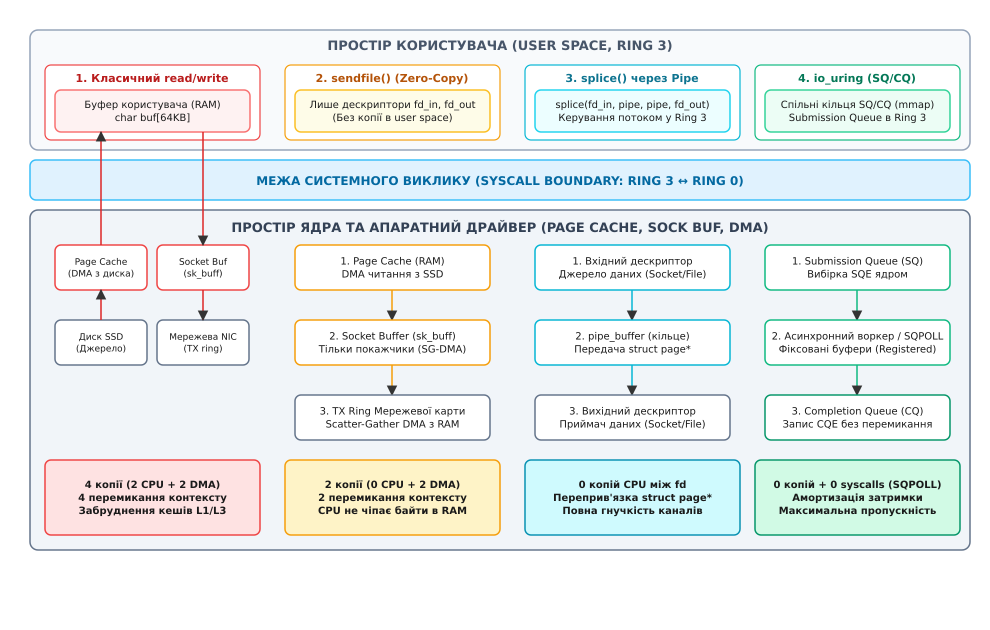
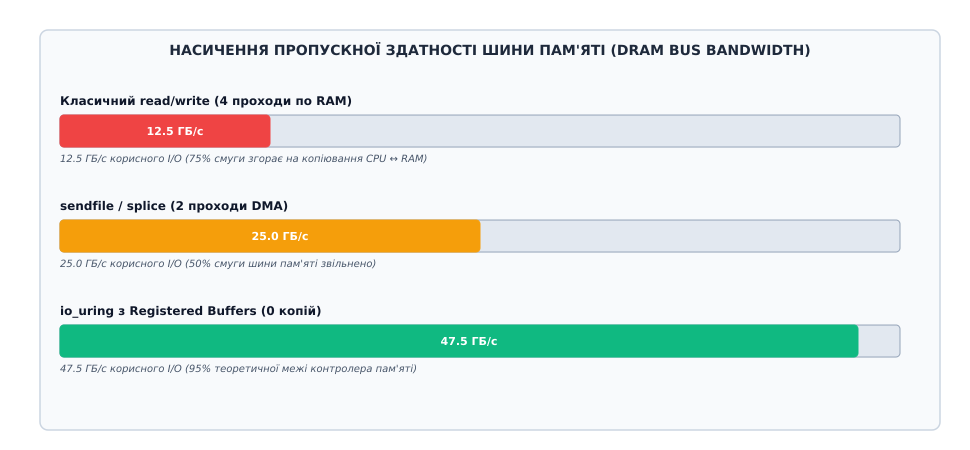
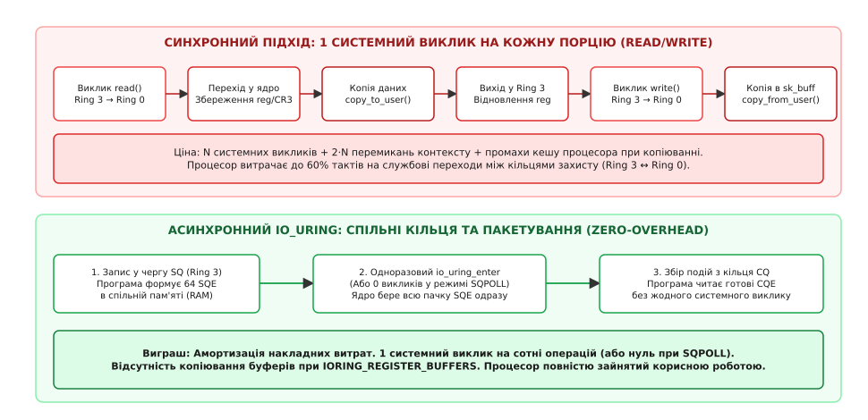

# Скільки коштує ввід-вивід

<preknowlist>
* [Буферизований і прямий ввід-вивід](topic:unix-linux/buffered-and-direct-io)
* [Передача без копіювання](topic:unix-linux/zero-copy)
* [io_uring](topic:unix-linux/io-uring)
* [select, poll, epoll](topic:unix-linux/select-poll-epoll)
</preknowlist>

Коли програма викликає функцію `read()` або `write()`, у вихідному коді це виглядає як просте копіювання байтів із дескриптора у масив пам'яті. Проте на рівні апаратури та операційної системи передача кожного кілобайта запускає складний ланцюг подій: зміну привілеїв процесора, перемикання таблиць сторінок, копіювання даних крізь внутрішні буфери ядра та витіснення робочих наборів із процесорного кешу. На гігабітних мережевих інтерфейсах та швидких накопичувачах NVMe ці накладні витрати стають головним вузьким місцем, перетворюючи процесор на диспетчера пам'яті, який спалює до 80% тактів на службове перекладання байтів замість корисної бізнес-логіки.

Розуміння справжньої вартості операцій вводу-виводу дозволяє перейти від наївного побайтового читання до високоефективних конвеєрів прямої передачі даних, які повністю усувають зайві копії та скорочують кількість переходів у ядро на порядки.

---

## 1. Анатомія системного виклику: шлях від `read()` до кремнію пам'яті

Щоб побачити справжню ціну операції вводу-виводу, простежимо шлях виконання класичного системного виклику `read(fd, buf, count)` на 64-бітній архітектурі x86-64.

```
Простір користувача (Ring 3)        Простір ядра (Ring 0)
┌─────────────────────────┐         ┌─────────────────────────┐
│ Застосунок              │         │ Обробник переривань     │
│  buf[64 KiB]            │         │  entry_SYSCALL_64       │
│           │             │         │           │             │
│   SYSCALL ├─────────────┼────────►│ Збереження регістрів    │
│           │             │         │           │             │
│           │             │         │ VFS: vfs_read()         │
│           │             │         │           │             │
│           │             │         │ Page Cache / Socket     │
│           │◄────────────┼─────────┼─ copy_to_user()         │
│   SYSRET  │             │         │           │             │
│           ▼             │         │ Відновлення регістрів   │
└─────────────────────────┘         └─────────────────────────┘
```

### Перемикання кілець захисту (Ring 3 ↔ Ring 0)

Процесор виконує прикладний код у непривілейованому кільці захисту Ring 3. Щоб звернутися до апаратного пристрою або структур ядра, застосунок виконує спеціальну машинну інструкцію `SYSCALL`.

У цей момент апаратура процесора здійснює кілька обов'язкових кроків:
1. Зберігає поточний покажчик інструкцій `RIP` у регістрі `RCX` та регістр прапорців `RFLAGS` у регістрі `R11`.
2. Завантажує нове значення `RIP` із системного регістру `MSR_LSTAR` (де записана адреса вхідної точки ядра `entry_SYSCALL_64`).
3. Перемикає покажчик стека `RSP` зі стека користувача на захищений стек ядра конкретного потоку, збережений у структурі TSS (Task State Segment).
4. Змінює рівень привілеїв процесора з Ring 3 на Ring 0.

Усередині ядра обробник `entry_SYSCALL_64` зберігає регістри загального призначення на стеку ядра (`struct pt_regs`), перевіряє права доступу та передає керування функції віртуальної файлової системи `vfs_read()`. Після завершення операції зворотна інструкція `SYSRET` відновлює регістри користувача, повертає покажчик стека та скидає рівень привілеїв назад у Ring 3.

Один такий перехід туди й назад забирає від 150 до 300 тактів процесора (близько 50–100 наносекунд на сучасних CPU). Якщо в системі активовано апаратний захист від вразливостей спекулятивного виконання (KPTI — Kernel Page Table Isolation, захист від Meltdown), кожна зміна кільця додатково скидає таблиці сторінок через перемикання регістра `CR3`, що збільшує вартість переходу до 800–1500 тактів.

### Валідація адрес та підсистема пам'яті (MMU)

Отримавши адресу буфера `buf`, ядро зобов'язане перевірити, чи належить цей діапазон пам'яті поточному процесу, і чи має він права на запис. Функція `access_ok()` валідує межі віртуального адресного простору.

Далі, під час копіювання даних у буфер функцією `copy_to_user()`, блок управління пам'яттю (MMU) процесора транслює віртуальні адреси у фізичні. Якщо сторінка пам'яті буфера була виділена функцією `malloc()`, але ще не була фізично заповнена (Lazy Allocation), перший запис у неї спричиняє виняткову ситуацію промаху сторінки (Page Fault). Ядро перериває операцію вводу-виводу, шукає вільний фізичний фрейм RAM, очищує його нулями, додає запис у таблицю сторінок і лише після цього продовжує передачу байтів. Кожен такий збій сторінки додає від 1 до 3 мікросекунд затримки.

У багатопотокових серверах виникає додаткове ускладнення: коли один потік змінює відображення сторінок або викликає `mprotect()`, ядро змушене надсилати міжпроцесорні переривання (IPI, Inter-Processor Interrupts) усім іншим ядрам процесора для інвалідації їхніх буферів асоціативної трансляції (TLB Shootdown). Це призводить до миттєвої зупинки виконання коду на сусідніх ядрах.

### Апаратні переривання проти опитування: NAPI та життєвий цикл пакетів

Коли мережева карта або диск NVMe завершують прийом чи запис блоку даних, контролер генерує апаратне переривання (Hard IRQ). Процесор зупиняє поточні обчислення, переходить до таблиці векторів переривань (IDT) і викликає верхню половину обробника (Top-Half Handler).

Верхня половина виконує лише критичну роботу: квитує переривання на контролері та планує виконання нижньої половини (Bottom-Half) у вигляді програмного переривання `NET_RX_SOFTIRQ`.

При надходженні сотень тисяч пакетів на секунду традиційна обробка переривань призводить до стану паралічу системи (Interrupt Storm / Receive Livelock), коли процесор витрачає 100% часу лише на збереження та відновлення стеків переривань, не встигаючи передати жодного байта застосунку.

Для запобігання цьому ядро Linux використовує підсистему NAPI (New API):
1. Отримавши перший пакет через апаратне переривання, драйвер мережевої карти вимикає подальшу генерацію переривань на цьому інтерфейсі.
2. Драйвер реєструє функцію опитування `poll()` у структурі `napi_struct` поточного процесорного ядра.
3. Потік `ksoftirqd` забирає пакети з кільцевого буфера драйвера пачками (за замовчуванням до 64 пакетів за ітерацію) у циклі опитування без генерації апаратних переривань.
4. Лише після повного спорожнення черги адаптера драйвер знову вмикає генерацію апаратних переривань.

### Руйнування процесорного кешу (Cache Pollution)

Найдорожчим наслідком класичного вводу-виводу є вимивання даних із багаторівневого кешу процесора. Процесори оптимізовані під локальність даних: кеш першого рівня L1D (32–48 КіБ) має затримку доступу близько 1 нс (4 такти), кеш L2 (512–1024 КіБ) — 3–4 нс (14 тактів), кеш L3 (16–64 МБ) — 10–15 нс (40–60 тактів), тоді як звернення до оперативної пам'яті DRAM забирає понад 60–80 наносекунд (200+ тактів).

Коли функція `copy_to_user()` зчитує 64 КіБ даних із кешу сторінок ядра та записує їх у буфер користувача, вона примусово заповнює рядки кешу L1D та L2 новими байтами. Якщо розмір передачі перевищує обсяг L1D, корисні змінні застосунку, об'єкти мови програмування та структури стек-фреймів миттєво витісняються в повільну DRAM. Коли після повернення з системного виклику програма намагається продовжити виконання своєї логіки, процесор стикається з масовими кеш-промахами (Cache Misses) і простоює в очікуванні пам'яті.

---

## 2. Ланцюжки копіювання та пропускна здатність шини пам'яті

Щоб зрозуміти, чому просте копіювання байтів обмежує швидкість всієї системи, подивимося на шлях даних від фізичного накопичувача або мережевого адаптера до сокета клієнта.


*Ланцюжки копіювання даних у ядрі Linux від класичного копіювання до асинхронного io_uring*

### Традиційний 4-копійний ланцюг (User-Space Proxy / File-to-Socket)

Розглянемо класичний веб-сервер або проксі, який читає файл із диска та відправляє його у мережу за допомогою стандартних викликів `read()` та `write()`:

1. **Копія 1 (Диск → Кеш сторінок ядра):** Контролер диска зчитує блоки даних і за допомогою механізму прямого доступу до пам'яті (DMA, Direct Memory Access) записує їх у виділені ядрами сторінки RAM (Page Cache). Процесор не бере участі в цій копії.
2. **Копія 2 (Кеш сторінок → Буфер процесу):** Системний виклик `read()` змушує центральний процесор скопіювати байти з пам'яті ядра в буфер застосунку (`copy_to_user()`). Процесор зчитує кожне 64-бітне слово в регістри й записує його назад у RAM.
3. **Копія 3 (Буфер процесу → Буфер сокета):** Системний виклик `write()` змушує процесор знову скопіювати ті самі байти з буфера користувача у вихідний буфер мережевого сокета в ядрі (`copy_from_user()`).
4. **Копія 4 (Буфер сокета → Мережева карта NIC):** Мережевий контролер за допомогою механізму DMA забирає байти з пам'яті сокета і передає їх у фізичний мережевий кабель.

У цьому класичному ланцюжку кожен переданий байт **чотири рази перетинає шину пам'яті**, і двічі копіюється безпосередньо регістрами центрального процесора.

### Насичення шини оперативної пам'яті та NUMA-фактор

Пропускна здатність шини оперативної пам'яті є жорстко обмеженим фізичним ресурсом. Для сервера з двоканальною пам'яттю DDR4-3200 теоретична пікова пропускна здатність становить близько 51.2 ГБ/с (на практиці досяжно близько 40 ГБ/с). Для сучасних платформ DDR5-4800 пропускна здатність сягає 76.8 ГБ/с на канал.


*Насичення пропускної здатності шини пам'яті DDR4/DDR5 залежно від кількості проходів копіювання байтів*

Оскільки кожна операція копіювання процесором вимагає одного читання і одного запису по шині, подвійне процесорне копіювання (`copy_to_user` + `copy_from_user`) разом із двома апаратними циклами DMA генерує 6 звернень до шини пам'яті на кожен переданий корисний байт. У результаті реальна стеля пропускної здатності всього сервера обмежується значенням близько 6.8 ГБ/с, навіть якщо мережеві адаптери та диски здатні передавати значно більше.

У багатосокетних системах із неоднорідним доступом до пам'яті (NUMA, Non-Uniform Memory Access) ситуація стає ще критичнішою. Якщо потік процесора працює на Socket 0, а мережевий адаптер підключений до ліній PCIe Socket 1, кожен байт додатково перетинає міжпроцесорну шину зв'язку (Intel UPI або AMD Infinity Fabric). Пропускна здатність міжпроцесорної шини вдвічі нижча за локальну пам'ять, а затримка зростає зі 60 до 140 наносекунд.

Повний математичний розрахунок затримок, пропускної здатності шини та аналіз взаємного блокування процесорних ядер наведено у [математичній моделі вартості вводу-виводу](topic:unix/io-cost-model/math-io-cost-model.md).

---

## 3. Векторний ввід-вивід: усунення конкатенації у просторі користувача

У прикладних протоколах передачі даних (HTTP, gRPC, бази даних, власні бінарні протоколи) корисне навантаження майже завжди супроводжується метаданими: заголовками фіксованого розміру, прапорцями, довжиною блоку та контрольними сумами.

### Проблема роздільних викликів та штучної склейки

Перед інженером постає вибір із двох неефективних підходів:
1. **Два окремі виклики `write()`:** Спочатку записати заголовок пакета (наприклад, 64 байти), а потім тіло даних (наприклад, 64 КіБ). Це подвоює кількість системних викликів, генерує два перемикання кілець захисту і провокує відправку двох окремих TCP-пакетів через роботу алгоритму Нейгла, що суттєво збільшує затримку мережі.
2. **Попередня склейка через `memcpy()`:** Виділити в просторі користувача спільний буфер більшого розміру, скопіювати туди заголовок, скопіювати тіло і викликати `write()` один раз. Це усуває зайвий системний виклик, але додає ще одне повнорозмірне копіювання всього масиву пам'яті силами CPU, марно спалюючи ресурси кешу.

### Механізм Scatter-Gather через `readv` та `writev`

Векторний ввід-вивід (Scatter-Gather I/O) вирішує цю проблему на рівні системного інтерфейсу ядра. Замість одного покажчика на пам'ять застосунок передає масив структур `struct iovec`, кожна з яких описує адресу та довжину окремого фрагмента пам'яті:

```
Простір користувача:
iov[0] ──► [ Заголовок 64 B ] ──┐
iov[1] ──► [ Дані 64 KiB     ] ──┼──► writev(fd, iov, 2)
                                 │
Простір ядра (VFS / Socket):     │
[ Спільний пакет у черзі NIC ] ◄─┘  (Збирання ядром за один системний виклик)
```

Ядро Linux обробляє масив векторів за один системний виклик за допомогою внутрішнього ітератора `iov_iter`. Підсистема VFS обходить вказані буфери в пам'яті користувача і послідовно монтує їх у структуру мережевого пакета `sk_buff` без створення проміжних копій у просторі користувача.

:::tabs
```c
#include <sys/uio.h>
#include <unistd.h>
#include <stdint.h>

struct PacketHeader {
    uint32_t magic;
    uint32_t length;
    uint64_t sequence;
};

ssize_t send_packet(int sock_fd, const struct PacketHeader *hdr, 
                    const void *payload, size_t payload_len) {
    struct iovec iov[2];
    iov[0].iov_base = (void *)hdr;
    iov[0].iov_len = sizeof(struct PacketHeader);
    iov[1].iov_base = (void *)payload;
    iov[1].iov_len = payload_len;

    return writev(sock_fd, iov, 2);
}
```
```cpp
#include <sys/uio.h>
#include <unistd.h>
#include <array>
#include <span>
#include <cstdint>

struct PacketHeader {
    std::uint32_t magic;
    std::uint32_t length;
    std::uint64_t sequence;
};

ssize_t send_packet_cpp(int sock_fd, const PacketHeader& hdr, 
                        std::span<const std::byte> payload) {
    std::array<struct iovec, 2> iov{{
        { .iov_base = const_cast<PacketHeader*>(&hdr), .iov_len = sizeof(PacketHeader) },
        { .iov_base = const_cast<std::byte*>(payload.data()), .iov_len = payload.size() }
    }};

    return ::writev(sock_fd, iov.data(), static_cast<int>(iov.size()));
}
```
:::

Використання `writev` гарантує атомарність передачі: дані заголовка та тіла записуються в мережевий буфер неподільно, запобігаючи перемішуванню фрагментів від різних потоків, і об'єднуються в єдиний мережевий кадр Ethernet.

### Розширені прапорці `preadv2` та `pwritev2`

Починаючи з ядра Linux 4.6, інтерфейс векторного вводу-виводу було розширено викликами `preadv2()` та `pwritev2()`, які підтримують бітові прапорці поведінки:
* `RWF_NOWAIT` — Вимагає від ядра повернути помилку `EAGAIN` негайно, якщо дані відсутні у кеші сторінок або запис потребує блокування файлової системи. Це дозволяє уникнути несподіваного засинання робочого потоку в асинхронних архітектурах.
* `RWF_HIPRI` — Вмикає апаратне опитування стану контролера NVMe (High-priority Polling). Опитування черги завершення замість очікування переривання зменшує затримку доступу до SSD з 15 мкс до 4–6 мкс.

---

## 4. Технології прямої передачі даних (Zero-Copy): `sendfile` та `splice`

Коли єдиним завданням програми є пересилка байтів із одного файлового дескриптора в інший без їх модифікації в процесі передачі, будь-яке копіювання в простір користувача є абсолютно зайвим. Для цього ядро Linux надає спеціалізовані механізми прямої передачі даних (Zero-Copy).

### Системний виклик `sendfile`

Виклик `sendfile()` з'явився в Linux для оптимізації передачі статичних файлів у мережеві сокети веб-серверами:

```
[ Диск ] ──(DMA)──► [ Page Cache (Ядро) ] ──(DMA Scatter-Gather)──► [ Мережева карта ]
                               │
                      sendfile(out_fd, in_fd)
                      (0 копій силами CPU)
```

1. Програма викликає `sendfile(sock_fd, file_fd, &offset, count)`.
2. Ядро перевіряє наявність потрібних сторінок файлу в кеші сторінок (`Page Cache`). Якщо сторінки відсутні, дисковий контролер завантажує їх за допомогою DMA.
3. Замість копіювання байтів у буфер сокета, ядро створює мережевий дескриптор пакета `sk_buff`, записуючи туди лише покажчики на фізичні адреси сторінок у кеші сторінок (`skb_frag_t`).
4. Мережевий контролер за допомогою апаратного механізму Scatter-Gather DMA зчитує байти безпосередньо з кешу сторінок RAM і формує Ethernet-кадри.

У цьому сценарії процесор взагалі не копіює дані — кількість копій процесором дорівнює **нулю** (True Zero-Copy). Навантаження на шину пам'яті скорочується до теоретичного мінімуму (2 операції по шині замість 6: одне дискове читання і один мережевий запис).

### Універсальний конвеєр `splice`

Системний виклик `sendfile` має суттєве обмеження: його джерелом обов'язково має бути регулярний файл, що підтримує операцію позиціонування `mmap`. Він не може працювати з довільними потоками даних, сокетами або каналами.

Для усунення цього обмеження було створено системний виклик `splice()`, що дозволяє переміщувати дані між двома довільними дескрипторами в просторі ядра за умови, що хоча б один із них є анонімним каналом (`pipe`).

```
[ Вхідний сокет ] ──splice()──► [ Кільцевий буфер pipe ] ──splice()──► [ Вихідний сокет ]
                                (struct pipe_buffer)
                                (лише передача покажчиків struct page*)
```

Канал у Linux всередині організовано як кільцевий масив структур `struct pipe_buffer`, кожна з яких містить покажчик на фізичну сторінку пам'яті ядра `struct page*`, зміщення та довжину.

Коли дані переміщуються через `splice`:
1. Перший виклик `splice(sock_in, NULL, pipe_fd[1], NULL, len, flags)` вилучає отримані мережеві сторінки з буфера сокета і додає посилання на них у кільцевий буфер каналу, збільшуючи їхній лічильник посилань `page_ref_inc()`.
2. Другий виклик `splice(pipe_fd[0], NULL, sock_out, NULL, len, flags)` забирає посилання на ці сторінки з каналу і монтує їх у вихідну чергу сокета призначення.

Жоден байт даних не переміщується в пам'яті — пересилаються виключно службові 32-байтні дескриптори сторінок.

### Взаємодія з шифруванням: Kernel TLS (kTLS)

Історичною перешкодою для використання Zero-Copy в сучасному інтернеті було повсюдне впровадження протоколу TLS/HTTPS. Класичні бібліотеки (OpenSSL, BoringSSL) шифрують дані у просторі користувача, що вимагало копіювання байтів із диска в пам'ять програми для накладання шифру AES-GCM перед відправкою у сокет.

Для вирішення цієї проблеми ядро Linux отримало підсистему Kernel TLS (kTLS). Програма виконує первинне TLS-рукостискання у просторі користувача, а потім передає сформовані симетричні ключі шифрування ядру через опцію сокета `setsockopt(fd, SOL_TLS, TLS_TX, ...)`.

Після цього застосунок викликає звичайний `sendfile()` або `splice()`. Ядро самостійно шифрує сторінки кешу під час передачі або делегує шифрування безпосередньо апаратному прискорювачу мережевої карти (TLS Hardware Offloading), повністю відновлюючи всі переваги нуль-копійної передачі даних через зашифровані з'єднання.

Детальні сигнатури функцій, бітові маски прапорців та правила узгодження сторінок задокументовано у [довіднику системних викликів Zero-Copy та io_uring](topic:unix/io-cost-model/api-io-cost-primitives.md).

---

## 5. Асинхронний інтерфейс `io_uring`: ліквідація системних викликів

Навіть при використанні технологій Zero-Copy залишається суттєве джерело накладних витрат — самі системні виклики. Якщо сервер обробляє 1 000 000 запитів на секунду, йому потрібно виконати щонайменше 2 000 000 перемикань контексту Ring 3 ↔ Ring 0 щосекунди, що повністю перевантажує процесор.

Для подолання цієї межі в ядрі Linux було створено підсистему `io_uring`.


*Часова шкала обробки запитів: синхронні системні виклики проти пакетного опрацювання в io_uring*

### Архітектура спільних кільцевих буферів (SQ та CQ)

Фундаментальна відмінність `io_uring` від класичних інтерфейсів полягає у відмові від передачі параметрів через регістри системного виклику. Натомість ядро та простір користувача взаємодіють через дві спільні кільцеві черги в пам'яті (Shared Memory Rings), створені під час ініціалізації викликом `io_uring_setup()`:

1. **Submission Queue (SQ) — Черга надсилання:** Масив 64-байтних структур `io_uring_sqe`. Програма заповнює слоти описом операцій (читання, запис, передача через `splice`, закриття сокета) і пересуває покажчик `tail`.
2. **Completion Queue (CQ) — Черга завершення:** Масив 16-байтних структур `io_uring_cqe`. Ядро виконує операції, записує результат (кількість байтів або код помилки) у слоти CQ і пересуває покажчик `tail`.

```
ПРОСТІР КОРИСТУВАЧА                         ПРОСТІР ЯДРА
┌─────────────────────────┐                 ┌─────────────────────────┐
│ Застосунок (Producer)   │                 │ Ядро Linux (Consumer)   │
│ Запис SQE -> tail++     │                 │ Зчитування SQE          │
│ smp_store_release()     │                 │ smp_load_acquire()      │
└────────────┬────────────┘                 └────────────▲────────────┘
             │                                           │
             ▼                                           │
       ╔═══════════════════════════════════════════════════════╗
       ║   Спільне кільце надсилання (Submission Queue, SQ)    ║
       ╚═══════════════════════════════════════════════════════╝
             ▲                                           │
             │                                           ▼
       ╔═══════════════════════════════════════════════════════╗
       ║   Спільне кільце завершення (Completion Queue, CQ)    ║
       ╚═══════════════════════════════════════════════════════╝
             │                                           ▲
┌────────────┴────────────┐                 ┌────────────┴────────────┐
│ Застосунок (Consumer)   │                 │ Ядро Linux (Producer)   │
│ Зчитування CQE -> head++│                 │ Запис CQE -> tail++     │
│ smp_load_acquire()      │                 │ smp_store_release()     │
└─────────────────────────┘                 └─────────────────────────┘
```

### Пакетування та робота без системних викликів (SQPOLL)

Завдяки спільній пам'яті застосунок може підготувати пачку з 64 або 128 запитів у черзі SQ і відправити їх ядру **одним-єдиним системним викликом** `io_uring_enter()`. Це зменшує кількість переходів у Ring 0 у 64–128 разів.

Більше того, у режимі `IORING_SETUP_SQPOLL` ядро створює виділений потік ядра (`io_uring-sq`), який самостійно опитує покажчики кільця SQ в пам'яті. У цьому режимі програма додає операції в чергу взагалі **без виконання системних викликів**: процесор не перемикає кільця захисту, не змінює регістри і не скидає конвеєр інструкцій.

### Зареєстровані буфери та дескриптори (`io_uring_register`)

У класичному вводі-виводі ядро під час кожного системного виклику зобов'язане перевіряти файловий дескриптор у таблиці відкритих файлів процесу (`files_struct`) та виконувати трансляцію віртуальних адрес буфера у фізичні (`get_user_pages`).

Механізм реєстрації ресурсів `io_uring_register()` дозволяє виконати цю роботу одноразово:
* **`IORING_REGISTER_BUFFERS`:** Програма одноразово блокує фізичні сторінки пам'яті буферів у RAM (`pin_user_pages`). Операції читання та запису (`IORING_OP_READ_FIXED`, `IORING_OP_WRITE_FIXED`) звертаються до вже перевірених адрес без участі MMU.
* **`IORING_REGISTER_FILES`:** Ядро створює прямий внутрішній масив покажчиків `struct file*`, повністю усуваючи накладні витрати на пошук і блокування дескрипторів.

---

## 6. Порівняльний аналіз та інженерний вибір конвеєра

Зведемо фундаментальні характеристики всіх розглянутих підходів в єдину порівняльну таблицю:

| Характеристика конвеєра | Класичний `read/write` | Векторний `writev` | Нуль-копійний `sendfile` | Конвеєр `splice` | Асинхронний `io_uring` |
| :--- | :--- | :--- | :--- | :--- | :--- |
| **Кількість копій CPU** | 2 копії на байт | 2 копії на байт | **0 копій** | **0 копій** | 0 або 1 (без GUP) |
| **Проходів по шині пам'яті** | 6 проходів | 6 проходів | **2 проходи** | **2 проходи** | 2 проходи (fixed) |
| **Системні виклики на батч** | 2 × N | N | N | 2 × N | **1 на весь батч** (або 0 в SQPOLL) |
| **Забруднення кешу L1/L2** | Критичне | Помірне | **Відсутнє** | **Відсутнє** | Мінімальне |
| **Підтримувані джерела** | Будь-які | Будь-які | Лише mmap-файли | Файли, сокети, канали | Будь-які файли та мережа |
| **Асинхронність** | Ні (блокуючий) | Ні | Ні | Ні | **Повна асинхронність** |

Практичну перевірку цих показників, вимірювання затримок за допомогою `getrusage()` та повний вихідний код бенчмарка мовами C та C++ наведено у [практикумі із порівняльним бенчмарком конвеєрів](topic:unix/io-cost-model/proj-zero-copy-pipeline.md).

### Архітектурний синтез: вибір під інженерну задачу

1. **Якщо задача — роздача файлів через сокети (HTTP-сервери, CDN):** Оптимальним вибором є `sendfile()` або `io_uring` з операцією `IORING_OP_SPLICE`. Це забезпечує максимальну пропускну здатність шини та повну відсутність навантаження на процесорний кеш.
2. **Якщо задача — побудова проксі або маршрутизація трафіку між сокетами:** Найефективнішим інструментом є `splice()` з конвеєром анонімних каналів, що дозволяє передавати пакети без виходу в простір користувача.
3. **Якщо задача — високонавантажені бази даних та сервери черг (Kafka, ScyllaDB):** Безальтернативним стандартом сучасної архітектури є `io_uring` із зареєстрованими буферами (`IORING_REGISTER_BUFFERS`) та прямим вводом-виводом (`O_DIRECT`).
4. **Якщо протокол вимагає конкатенації дрібних службових структур:** Слід використовувати векторний ввід-вивід `writev()` / `preadv2()`, що усуває накладні витрати на виділення проміжної пам'яті.

---

## 7. Діагностика вартості вводу-виводу у промислових системах

Для моніторингу реального навантаження вводу-виводу на серверах використовують набір спеціалізованих інструментів ядра Linux:

### 1. Розподіл часу процесора через `sar` та `vmstat`

* `vmstat 1` — Показує кількість перемикань контексту (`cs`), кількість апаратних переривань (`in`) та стовпчики використання CPU: `%us` (простір користувача), `%sy` (простір ядра), `%wa` (очікування дискового вводу-виводу). Якщо `%sy` перевищує 40% при передачі даних, система страждає від надлишкових системних викликів або копіювання в ядрі.
* `sar -u ALL 1` — Деталізує час, витрачений на обробку апаратних (`%irq`) та програмних переривань (`%soft`). Високий `%soft` вказує на перевантаження мережевого стека NAPI.

### 2. Аналіз перемикань контексту окремого процесу через `pidstat`

Команда `pidstat -w -p <PID> 1` виводить два ключові лічильники:
* `cswch/s` (Voluntary context switches) — Потік добровільно засинає через відсутність даних у сокеті або каналі. Зростання цього показника свідчить про занадто малий розмір буферів вводу-виводу.
* `nvcswch/s` (Involuntary context switches) — Потік примусово витісняється планувальником ядра через вичерпання часового кванта під час копіювання великих масивів пам'яті.

### 3. Профілювання через `perf` та динамічне трасування `bpftrace`

Для точної локалізації копій пам'яті використовують апаратні події процесора:
```sh
perf stat -e cycles,instructions,cache-misses,bus-cycles -p <PID> sleep 5
```

Співвідношення `cache-misses` до загальної кількості інструкцій наочно показує, чи вдалося конвеєру досягти чистого режиму Zero-Copy: при переході з `read/write` на `sendfile` або `io_uring` кількість кеш-промахів на переданий гігабайт зменшується на один-два порядки.

---

## 8. Апаратні прискорювачі та еволюція архітектури вводу-виводу

Розвиток апаратної інфраструктури поступово переносить завдання маршрутизації даних із центрального процесора на виділені кремнієві співпроцесори (Offloading Engines).

### Апаратні рушії копіювання (Intel DSA та AMD CDX)

У сучасних серверних процесорах (наприклад, Intel Xeon Scalable 4-го покоління Sapphire Rapids) впроваджено технологію Intel Data Streaming Accelerator (DSA). Це виділений апаратний контролер DMA, інтегрований безпосередньо в кристал процесора.

Замість виконання інструкцій `REP MOVSB` на процесорних ядрах, ядро Linux може сформувати дескриптор копіювання пам'яті та відправити його безпосередньо черзі DSA. Рушій DSA копіює гігабайти пам'яті по внутрішніх шинах процесора, не навантажуючи кеші L1/L2 та залишаючи ядра повністю вільними для виконання коду застосунку.

### Об'єднана когерентна пам'ять (CXL)

Шинний інтерфейс Compute Express Link (CXL), побудований поверх фізичного рівня PCIe 5.0/6.0, вводить апаратну когерентність кешу між центральним процесором, графічними прискорювачами GPU та зовнішніми пулами пам'яті.

Це докорінно змінює вартісну модель вводу-виводу: накопичувачі NVMe та мережеві карти CXL можуть безпосередньо відображати власні буфери в єдиний фізичний адресний простір системи, перетворюючи мережевий ввід-вивід на прямий доступ до пам'яті (Remote Direct Memory Access, RDMA) без участі ядра операційної системи. 

Яскравим прикладом такої архітектури є технологія GPUDirect Storage (GDS): дані зчитуються з накопичувачів NVMe безпосередньо у відеопам'ять графічних прискорювачів GPU через комутатори шини PCIe, повністю оминаючи системну оперативну пам'ять хоста (DRAM) та процесорні ядра. Це виключає навантаження на підсистему пам'яті сервера під час тренування та інференсу великих нейромережевих моделей.

### Kernel Bypass проти `io_uring`

Для досягнення ультранизьких затримок (субмікросекундний діапазон у високочастотному трейдингу HFT) використовують технології повного обходу ядра (Kernel Bypass) — такі як DPDK для мережі та SPDK для NVMe. Вони повністю забирають контроль над чергами контролера у простір користувача в режимі безперервного активного опитування (Busy-Polling).

Проте ціна такого підходу надзвичайно висока: програма втрачає весь захист операційної системи, стек TCP/IP, підтримку файлових систем, права доступу та утилізує 100% процесорного ядра навіть за повної відсутності трафіку.

Підсистема `io_uring` у поєднанні з технологіями Zero-Copy стала ідеальним компромісом сучасної інженерії: вона забезпечує 90–95% продуктивності систем Kernel Bypass, зберігаючи повну безпеку, ізоляцію та багату функціональність ядра Linux. Завдяки цьому сучасні високонавантажені сервери можуть повністю утилізувати 100-гігабітні мережеві канали та швидкісні сховища NVMe, залишаючи обчислювальні потужності процесора для безпосереднього виконання бізнес-задач.
