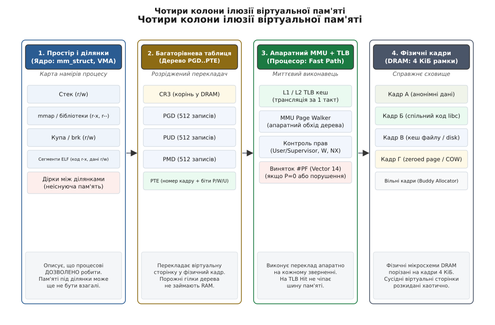
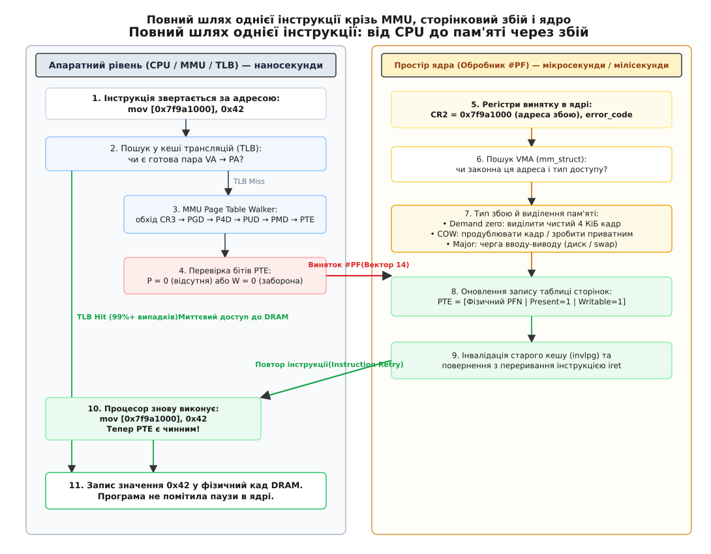
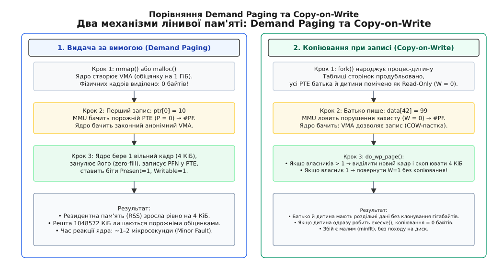

# Ілюзія власної пам'яті: на чому вона тримається

<preknowlist>
- [Віртуальний адресний простір](topic:sf-os/virtual-address-space) — простір адрес процесу є вигаданою смугою чисел, розбитою на окремі ділянки (VMA) з власними правами.
- [Сторінки, таблиці сторінок і MMU](topic:sf-os/paging-and-mmu) — апаратний вузол процесора транслює адреси блоками по 4 КіБ через чотири- або п'ятирівневе дерево таблиць, корінь якого задає регістр CR3.
- [Сторінковий збій](topic:sf-os/page-fault) — точний виняток процесора (вектор 14), який зупиняє інструкцію перед виконанням і передає керування ядру для виправлення трансляції.
- [Копіювання при записі](topic:sf-os/copy-on-write) — відкладене дублювання пам'яті при розгалуженні процесів через спільні сторінки з забороною запису.
- [Системний виклик](topic:sys-unix/syscall-mechanics) — механізм переходу процесора в привілейований режим ядра для запиту системних операцій.
- [Кеш трансляцій (TLB)](topic:hw-arch/tlb) — апаратний буфер процесора, що зберігає останні обчислені трансляції віртуальних адрес у фізичні.
</preknowlist>

Кожен процес у сучасній операційній системі переконаний у двох речах: що він володіє неозорим, суцільним і приватним адресним простором на 128 терабайтів (на 48-бітній архітектурі x86-64), і що за будь-якою виділеною адресою його чекають справжні фізичні байти, заповнені нулями.

Насправді це грандіозний обман, у якому узгоджено беруть участь компілятор, апаратура процесора та ядро операційної системи.

У комп'ютері немає 128 терабайтів пам'яті на кожен процес. Фізична оперативна пам'ять (DRAM) — це скінченний набір мікросхем обсягом 16, 64 чи 256 гігабайтів, спільний для сотень процесів одночасно. Вона порізана на невеликі блоки по 4 КіБ — фізичні кадри (англ. *page frames*), які розкидані по мікросхемах у цілковитому безладі. Сусідні віртуальні байти масиву у фізичній пам'яті можуть лежати на різних планках оперативної пам'яті або взагалі не існувати в кремнії в цю мить.

У цьому кроці ми зведемо воєдино всі раніше розглянуті механізми — віртуальні області, дерево таблиць сторінок, апаратний блок MMU, кеш TLB, сторінкові збої та копіювання при записі. Ми простежимо повний шлях однієї машинної інструкції від транзисторів процесора до комірок DRAM і з'ясуємо, на яких чотирьох опорних колонах тримається ілюзія власної пам'яті, де вона дає тріщини та як діагностувати її поведінку в робочій системі.

## Чотири опорні колони системи

Щоб програма могла виконувати мільярди інструкцій на секунду й не помічати підміни адрес, система спирається на чотири взаємопов'язані рівні абстракції. Якщо прибрати хоча б один із них — уся конструкція розсиплеться: або пам'ять знову доведеться виділяти неподільними суцільними шматками, або кожне звернення до змінної коштуватиме тисячі тактів процесора на перехід у ядро.


*Чотири колони ілюзії: карта намірів у ядрі описує дозволи, розріджене дерево транслює номери, апаратний MMU з кешем TLB забезпечує наносекундну швидкість, а фізичні кадри зберігають байти лише тоді, коли до них справді торкнулися.*

### 1. Карта намірів: структури `mm_struct` та `vm_area_struct`

На найвищому рівні ядро Linux взагалі не оперує окремими сторінками пам'яті. Воно мислить неперервними діапазонами адрес — **віртуальними областями пам'яті** (англ. *Virtual Memory Areas*, VMA).

Кожен процес у ядрі описується структурою `task_struct`, яка містить покажчик на дескриптор пам'яті `mm_struct`. Усередині `mm_struct` зберігається повний опис адресного простору:
- Початок і кінець сегментів коду, даних, купи та стека;
- Дерево віртуальних областей (структури `vm_area_struct`), організоване у вигляді кленового дерева (англ. *Maple Tree*, починаючи з Linux 6.1) або червоно-чорного дерева (*RB-Tree* у старіших версіях);
- Права доступу для кожної ділянки: читання (`PROT_READ`), запис (`PROT_WRITE`), виконання (`PROT_EXEC`);
- Походження ділянки: анонімна пам'ять (купа, стек) або файл на диску (відображені бібліотеки, виконуваний файл).

Головна властивість VMA: **це декларація прав і намірів, а не виділена пам'ять**. Коли ви викликаєте `mmap()` на 10 ГіБ, ядро лише створює одну нову структуру `vm_area_struct` розміром близько 200 байтів і вставляє її в дерево процесу. Жоден кадр DRAM при цьому не бронюється.

### 2. Розріджений перекладач: дерево сторінкових таблиць

Щоб апаратура знала, куди перенаправляти кожне числове значення віртуальної адреси, ядро будує дерево таблиць сторінок.

Якби таблиця була плоским масивом, для 48-бітного адресного простору (256 ТіБ) вона вимагала б 512 ГіБ пам'яті на кожен процес. Оскільки адресний простір процесу є надзвичайно розрідженим — зайняті лише кілька мегабайтів коду, купа внизу та стек угорі, а між ними зяють терабайти порожнечі, — дерево будується ієрархічно:
- **PGD** (*Page Global Directory*) — коренева таблиця 4-го рівня (512 записів);
- **P4D** (*Page Level 4 Directory*) — рівень, що використовується на 5-рівневому пейджингу (57-бітні адреси); на 4-рівневому він згорнутий в один запис;
- **PUD** (*Page Upper Directory*) — таблиця 3-го рівня (512 записів);
- **PMD** (*Page Middle Directory*) — таблиця 2-го рівня (512 записів);
- **PTE** (*Page Table Entry*) — таблиця 1-го рівня, кожен запис якої містить фізичний номер кадру (*Page Frame Number*, PFN) та службові біти захисту.

Кожен вузол цього дерева займає рівно 4096 байтів (512 записів по 8 байтів), тобто рівно одну сторінку. Якщо цілий терабайтний діапазон не використовується, запис у PGD містить нуль, і жодна проміжна таблиця (PUD, PMD, PTE) під ним не створюється. Фізична адреса кореневої таблиці PGD завантажується в апаратний регістр процесора `CR3` (на x86-64) або `TTBR0_EL1` (на ARM64) під час перемикання контексту задач.

### 3. Апаратний прискорювач: MMU та TLB

Ядро не бере участі в повсякденному читанні та записі пам'яті. Якби кожна машинна команда вимагала переходу в ядро, комп'ютер працював би в тисячі разів повільніше.

Переклад віртуальної адреси у фізичну виконує апаратний блок процесора — **MMU** (англ. *Memory Management Unit*). Він діє за жорстким апаратним алгоритмом: розбиває віртуальну адресу на бітові індекси, спускається рівнями таблиці сторінок, читає кінцевий запис PTE і формує фізичну адресу для шини пам'яті.

Але навіть апаратний обхід чотирьох рівнів таблиць у DRAM коштував би близько 200–300 тактів процесора на кожне звернення до пам'яті. Щоб звести цей час до частки наносекунди, процесор оснащений спеціалізованим кешем трансляцій — **TLB** (англ. *Translation Lookaside Buffer*).

TLB зберігає останні обчислені пари «номер віртуальної сторінки → номер фізичного кадру» разом із бітами прав. У понад 99% випадків потрібна трансляція вже є в TLB (*TLB Hit*), і процесор звертається до кешу L1 Data / DRAM за 1–4 такти без жодного заглядання в таблиці сторінок.

### 4. Невидимий міст: сторінковий збій (#PF)

Що відбувається, коли програми торкаються адреси, якої ще немає в таблицях сторінок або яка позначена як доступна лише для читання?

Апаратура не може самостійно вирішити, що робити: створити нову сторінку, завантажити дані з диска чи аварійно завершити процес. Тому процесор зупиняє виконання інструкції, зберігає її адресу на стеку винятку, записує цільову віртуальну адресу в регістр `CR2` (на ARM64 — у `FAR_EL1`) і піднімає апаратний виняток — **сторінковий збій** (вектор 14 на x86-64).

Сторінковий збій — це головний міст, що з'єднує віртуальні обіцянки ядра з реальною апаратурою. Саме всередині обробника `#PF` ядро перетворює абстрактну область VMA на заповнений запис PTE у таблиці сторінок і повертає процесор до виконання тієї самої інструкції, яка тепер проходить успішно.

## Шлях однієї інструкції: від регістрів до кремнію

Розглянемо покроково, що відбувається на рівні заліза та ядра, коли звичайна користувацька програма виконує інструкцію запису одного байта:

```
mov byte ptr [0x7f9a1000], 0x42
```


*Повний цикл звернення до пам'яті: якщо трансляції немає в TLB, апаратний MMU спускається таблицями сторінок; при відсутності запису генерується #PF, ядро виділяє кадр з пулу, оновлює PTE, і процесор повторно виконує ту саму команду без затримки.*

Пройдемо цей шлях за мікросекундами та наносекундами:

### Етап 1: Швидкий шлях (Fast Path в апаратурі)
1. Процесор обчислює віртуальну адресу `0x00007f9a1000`.
2. Блок MMU виділяє номер віртуальної сторінки `VPN = 0x00007f9a1` (старші біти) та зміщення всередині сторінки `Offset = 0x000` (молодші 12 бітів).
3. Процесор перевіряє кеш трансляцій L1 D-TLB. Припустимо, це перше звернення до адреси, тому виникає **TLB Miss**.
4. Апаратний модуль обходу таблиць (*Page Table Walker*) зчитує фізичну адресу кореня з регістру `CR3` і послідовно читає записи PGD → P4D → PUD → PMD.
5. У таблиці нижнього рівня PMD відповідний запис або порожній, або вказує на запис PTE, у якому біт присутності `Present (P) = 0`.
6. Апаратура не має права продовжувати. Вона скидає всі конвеєрні операції, завантажує адресу `0x7f9a1000` у регістр `CR2`, формує апаратний код помилки (`error_code`, що вказує: доступ на запис, у просторі користувача, сторінка відсутня) і перемикає процесор у режим ядра (Ring 0), стрибаючи за вектором переривання 14.

### Етап 2: Повільний шлях (Slow Path в ядрі)
7. Ядро заходить у низькорівневий обробник `page_fault` на асемблері, зберігає регістри процесу на стеку ядра та викликає функцію `do_user_addr_fault()`.
8. Ядро намагається взяти блокування віртуальної області. У сучасних ядрах Linux (починаючи з версії 6.4) для зменшення конкуренції потоків впроваджено **блокування на рівні окремих VMA** (*Per-VMA locks*): якщо ділянки пам'яті незалежні, різні ядра процесора можуть одночасно обробляти збої без взаємного блокування всього адресного простору (`mmap_lock`).
9. Якщо адреса потрапила в «дірку» між ділянками VMA, ядро перевіряє, чи не є це допустимим розширенням стека вниз. Якщо ні — адреса не належить нікому: ядро генерує сигнал `SIGSEGV` (*Segmentation Fault*), і процес аварійно завершується.
10. Якщо область знайдена (наприклад, це анонімна купа або буфер `mmap`), ядро перевіряє права VMA: чи дозволено запис (`VM_WRITE`)? Якщо VMA призначена лише для читання, це знову `SIGSEGV`.
11. Якщо доступ законний, ядро викликає універсальну функцію `handle_mm_fault()`.

### Етап 3: Виділення та прив'язка фізичного кадру
12. Обробник бачить, що запис PTE відсутній, а ділянка є анонімною. Це класичний випадок **Demand Paging**.
13. Ядро звертається до алокатора фізичних сторінок (*Buddy Allocator*) через функцію `alloc_zeroed_user_highpage_movable()`. Алокатор дістає з вільного списку один 4 КіБ кадр DRAM (скажімо, з фізичним номером кадру `PFN = 0x14a20`) і занулює його процесорними інструкціями або механізмом DMA.
14. Ядро конструює новий 64-бітний запис PTE:
    ```
    PTE = (0x14a20 << 12) | PTE_PRESENT | PTE_WRITE | PTE_USER | PTE_ACCESSED | PTE_DIRTY
    ```
15. Ядро записує цей рядок у відповідну комірку таблиці сторінок процесу в оперативній пам'яті. Якщо проміжні таблиці PUD чи PMD ще не існували, ядро попередньо виділяє по одній сторінці й під них.
16. Лічильник малих сторінкових збоїв процесу (`ru_minflt`) збільшується на одиницю.

### Етап 4: Повернення та повтор інструкції
17. Ядро звільняє блокування VMA і викликає інструкцію повернення з переривання `iretq`.
18. Процесор відновлює збережений стан регістрів і покажчик інструкцій `RIP`, повертаючись у простір користувача (Ring 3).
19. Завдяки принципу **точного винятку** (англ. *precise exception*), покажчик `RIP` показує рівно на ту саму команду `mov byte ptr [0x7f9a1000], 0x42`, ніби вона ніколи не починалася.
20. Процесор знову починає виконувати `mov`. MMU знову робить запит: Page Table Walker читає щойно записаний PTE, бачить `Present = 1`, `Write = 1`, завантажує трансляцію в кеш TLB і записує байт `0x42` безпосередньо у фізичний кадр `0x14a20000` в DRAM.

Програма витратила на цю операцію близько 1.5 мікросекунди, але з погляду її коду жодного системного виклику не було — інструкція просто виконалася.

## Два трюки лінивої видачі

Ілюзія власної пам'яті була б марнотратною розкішшю, якби ядро виділяло фізичну пам'ять на кожен запит. Замість цього система використовує два фундаментальні прийоми відкладеної роботи.


*Порівняння двох механізмів: видача за вимогою створює нові нульові кадри при першому торканні, а копіювання при записі дозволяє процесам читати спільний кадр, розщеплюючи його лише в момент запису.*

### 1. Видача за вимогою (Demand Paging)

Коли серверна програма виділяє великий хеш-масив на 10 ГіБ за допомогою `malloc()`, системна бібліотека робить анонімний виклик `mmap()`:

:::tabs
```c
#include <sys/mman.h>
#include <stdio.h>

int main(void) {
    size_t size = 10ULL * 1024 * 1024 * 1024; // 10 ГіБ
    char *buf = mmap(NULL, size, PROT_READ | PROT_WRITE,
                     MAP_PRIVATE | MAP_ANONYMOUS, -1, 0);
    if (buf == MAP_FAILED) {
        perror("mmap");
        return 1;
    }
    // Фізичної пам'яті виділено: 0 байтів
    buf[0] = 'A'; // Тут виникає #PF: виділяється рівно 4 КіБ
    return 0;
}
```
```cpp
#include <sys/mman.h>
#include <iostream>
#include <system_error>
#include <cstddef>

int main() {
    constexpr std::size_t size = 10ULL * 1024 * 1024 * 1024; // 10 ГіБ
    void* ptr = ::mmap(nullptr, size, PROT_READ | PROT_WRITE,
                       MAP_PRIVATE | MAP_ANONYMOUS, -1, 0);
    if (ptr == MAP_FAILED) {
        throw std::system_error(errno, std::generic_category(), "mmap failed");
    }
    auto* buf = static_cast<volatile char*>(ptr);
    // Фізичної пам'яті виділено: 0 байтів
    buf[0] = 'A'; // Тут виникає #PF: виділяється рівно 4 КіБ
    ::munmap(ptr, size);
    return 0;
}
```
:::

У цій програмі віртуальний розмір процесу (VSZ) миттєво зростає на 10 ГіБ, проте його резидентний розмір (RSS) залишається нульовим. Якщо за весь час роботи програма запише дані лише в 1000 розкиданих елементів масиву, фізична пам'ять машини зменшиться лише на 4 МіБ (1000 сторінок по 4 КіБ).

Більше того, якщо програма вирішить **прочитати** дані з неініціалізованого буфера, Linux застосовує оптимізацію *Zero Page*: замість виділення тисяч окремих кадрів ядро відображає всі прочитані віртуальні сторінки на один глобальний фізичний кадр нулів із захистом від запису (`W = 0`). Мільйон сторінок читають нулі з одного спільного 4 КіБ кадру.

### 2. Копіювання при записі (Copy-on-Write) та зворотне відображення

Найвідоміший прояв ілюзії пам'яті — системний виклик `fork()`.

Коли процес бази даних Redis або PostgreSQL розміром 64 ГіБ створює дитину для створення знімка на диск (*snapshot*), виклик `fork()` завершується за лічені мілісекунди. Якби ядро чесно копіювало 64 ГіБ фізичної пам'яті, це зайняло б кілька секунд і зажадало б ще 64 ГіБ вільної RAM, якої на сервері може просто не бути.

Замість цього ядро:
1. Дублює структуру `mm_struct` та дерево VMA батька;
2. Обходить дерево таблиць сторінок батька й копіює самі записи PTE (а не пам'ять!);
3. У всіх записах PTE батька та дитини **скидає біт дозволу на запис** (`W = 0`), перетворюючи сторінки на Read-Only;
4. Збільшує лічильник посилань на кожен фізичний кадр (`struct page->_refcount`).

Тепер обидва процеси виконуються паралельно, читаючи ті самі кадри на повній швидкості апаратури. Щойно батько чи дитина виконує команду запису:
- Апаратний MMU бачить `W = 0` і викликає виняток `#PF`;
- Обробник ядра `do_wp_page()` перевіряє відповідний VMA: дозвіл на запис у правах області є! Отже, заборона була штучною пасткою COW;
- Ядро перевіряє статус володіння сторінкою. Завдяки структурі **зворотного відображення** (англ. *Reverse Mapping*, `rmap` через `struct anon_vma`), ядро точно знає всі таблиці сторінок, які зараз посилаються на цей фізичний кадр. Якщо сторінку ділять двоє, ядро виділяє новий чистий кадр, копіює туди 4096 байтів оригінального кадру, записує новий PFN у таблицю процесу, що писав, і ставить `W = 1`;
- Інший процес продовжує володіти старим кадром і при своєму наступному записі вже не копіюватиме нічого, оскільки залишився єдиним власником.

### 3. Прозорі великі сторінки (Transparent Huge Pages)

Стандартна гранулярність 4 КіБ ідеальна для економії пам'яті, але створює колосальний тиск на кеш трансляцій TLB. Якщо серверний процес активно використовує 64 ГіБ пам'яті, для його адресації потрібно 16 мільйонів записів PTE. Жоден сучасний процесор не здатний утримати стільки записів у кеші TLB (типовий розмір L2 TLB — 1536–2048 записів, що покриває лише 8 МіБ пам'яті).

Щоб розв'язати цю проблему, ядро Linux реалізує механізм **прозорих великих сторінок** (англ. *Transparent Huge Pages*, THP).

Коли ядро виявляє, що процес послідовно виділяє та заповнює область пам'яті розміром щонайменше 2 МіБ (рівно 512 стандартних сторінок), воно замінює 512 окремих записів PTE на **один запис у таблиці другого рівня PMD** з прапорцем `Page Size (PS) = 1`.

Наслідки цієї трансформації:
- Один запис у кеші TLB тепер покриває не 4 КіБ, а цілих 2 МіБ пам'яті (у 512 разів більше);
- Апаратний MMU скорочує обхід таблиці: замість чотирьох звернень до пам'яті (PGD → PUD → PMD → PTE) він зупиняється на PMD, заощаджуючи 25% часу при промаху TLB;
- Фоновий потік ядра `khugepaged` періодично сканує адресні простори процесів і автоматично об'єднує суміжні 4 КіБ сторінки у великі 2 МіБ кадри без жодних змін у коді застосунків.

> 🔧 **Навіщо це.** Якщо після `fork()` дитина одразу викликає `execve()` (типовий патерн запуску нових програм у Unix), жодна сторінка батьківської пам'яті взагалі не копіюється. Витрати на створення процесу зводяться лише до копіювання кількох мегабайтів дескрипторів таблиць сторінок.

## Ціна ілюзії: малі збої проти великих прірв

Ілюзія власної пам'яті не є безкоштовною. Її ціна вимірюється в часі виконання інструкцій та навантаженні на шину пам'яті. Розуміння цієї ціни критично важливе для високопродуктивних систем.

Усі сторінкові збої поділяються на дві принципово різні категорії за часом реакції:

| Тип збою | Що відбувається в системі | Типовий час затримки | Вплив на виконання |
|---|---|---|---|
| **Малий збій (Minor Fault)** | Виділення анонімної сторінки з RAM, розщеплення COW, повторне відображення з Page Cache | **0.5 – 2.5 мкс** (~1 500 – 7 000 тактів) | Потік залишається на CPU, виконує код ядра, відновлює роботу |
| **Великий збій (Major Fault)** | Зчитування сторінки з виконуваного файлу, підкачування з диска чи розділу Swap | **50 мкс – 15 мс** (до 40 000 000 тактів) | Потік блокується, переходить у стан очікування (D), планувальник перемикає CPU |

Порахуймо затримку на простому прикладі:

**Умова.** Серверний застосунок послідовно ініціалізує масив розміром 4 ГіБ (1 048 576 сторінок по 4 КіБ).

```
Кількість сторінок       = 4 ГіБ / 4 КіБ               = 1 048 576
Час одного малого збою   = 1.5 мкс                     = 0.0000015 с
Сумарний час на збої     = 1 048 576 · 1.5 мкс         = 1.572 секунди
Швидкість запису в DRAM  = 4 ГіБ / 0.1 с               = 40 ГіБ/с
```

З цих цифр видно колосальну різницю: сам запис 4 ГіБ у пам'ять на сучасній системі DDR5 займає менше 100 мілісекунд, тоді як обслуговування мільйона сторінкових збоїв ядром забирає понад півтори секунди чистого процесорного часу!

Саме тому в системах обробки даних у реальному часі (HFT, медіа-сервери, бази даних) пам'ять попередньо виділяють і «прогрівають» (*pre-faulting*) ще на стадії ініціалізації за допомогою прапорця `MAP_POPULATE` або функції `mlockall()`.

Як саме програмно виміряти кількість збоїв, перевірити наявність сторінок у DRAM та побачити поведінку COW на власні очі — розібрано в окремому проєкті з робочим кодом: [Дослідник збоїв пам'яті: спостереження за demand paging та copy-on-write](topic:unix/memory-illusion/proj-fault-probe.md).

## Діагностика: як побачити ілюзію наживо

Оскільки віртуальна пам'ять приховує фізичну реальність, традиційні утиліти моніторингу часто вводять розробників в оману. Розглянемо базові інструменти діагностики, що дозволяють зняти завісу віртуалізації:

### 1. `pmap -XX` та аналіз `/proc/<pid>/smaps`

Звичайна команда `top` чи `ps` показує дві цифри: `VSZ` (віртуальний розмір) та `RSS` (резидентний розмір). Але `RSS` не показує, яка частина пам'яті ділиться з іншими процесами.

Команда `pmap -XX <pid>` розгортає повну картину:

```sh
$ pmap -XX 14205
Address          Perm   Offset Device   Inode    Size    Rss    Pss  Shared_Clean Shared_Dirty Private_Clean Private_Dirty Referenced Anonymous Mapping
0000000000400000 r-xp 00000000  08:01  394812     128    128     16           128            0             0             0        128         0 my_app
00007f9a10000000 rw-p 00000000  00:00       0 1048576   8192   8192             0            0             0          8192       8192      8192 [anon]
```

Зверніть увагу на другий рядок:
- `Size = 1048576` (1 ГіБ) — обіцянка віртуального простору;
- `Rss = 8192` (8 МіБ) — реальні сторінки в DRAM, до яких торкнувся процес;
- `Pss = 8192` (8 МіБ) — пропорційна частка (сторінки повністю приватні);
- `Private_Dirty = 8192` — змінені сторінки, які вимагатимуть збереження у Swap при нестачі пам'яті.

### 2. Профілювання збоїв та трасування через `perf` і `ftrace`

Системний профілювальник `perf` дозволяє відстежити інтенсивність сторінкових збоїв та промахів TLB безпосередньо за апаратними лічильниками процесора:

```sh
$ perf stat -e faults,minor-faults,major-faults,dTLB-loads,dTLB-load-misses ./my_app

 Performance counter stats for './my_app':

            12,450      faults
            12,448      minor-faults
                 2      major-faults
     1,420,551,102      dTLB-loads
           210,440      dTLB-load-misses          #    0.01% of all TLB accesses

       0.412891230 seconds time elapsed
```

Якщо відсоток `dTLB-load-misses` перевищує 2–5%, це свідчить про високу фрагментацію доступу до пам'яті: процесор витрачає значну частину тактових циклів на обхід таблиць сторінок. Головним ліками в такому випадку є перехід на великі сторінки розміром 2 МіБ або 1 ГіБ (*Huge Pages*).

Щоб побачити, які саме інструкції у вашій програмі викликають сторінкові збої, можна записати трасу подій ядра:

```sh
$ perf record -e exceptions:page_fault_user -g ./my_app
$ perf report
```

Ця команда будує повне дерево викликів вашого коду, показуючи точний рядок вихідного коду, на якому процесор зупинився через відсутність сторінки.

## Де ілюзія тріщить по швах

У звичайних умовах віртуальна пам'ять працює бездоганно. Проте існують три крайні ситуації, коли ілюзія ламається, спричиняючи деградацію продуктивності або падіння системи.

### 1. Перекомітування та OOM-Killer

Оскільки ядро роздає обіцянки на гігабайти пам'яті, сума всіх віртуальних просторів процесів на сервері може в десятки разів перевищувати фізичну DRAM. Така політика зветься **надлишковим виділенням** (англ. *Memory Overcommit*).

Поки процеси використовують лише частину виділеного, все працює стабільно. Але коли всі процеси одночасно починають записувати дані у свої обіцяні сторінки, ядро опиняється в ситуації, коли вільні фізичні кадри закінчилися, а розділ Swap переповнений.

Оскільки процесор чекає у винятку `#PF`, ядро не може просто повернути системну помилку `NULL` з інструкції `mov`. Єдиний вихід — активувати **OOM-Killer** (*Out of Memory Killer*): спеціальний алгоритм ядра обирає один із процесів за формулою споживання пам'яті й надсилає йому нищівний сигнал `SIGKILL`. Ілюзія закінчується раптовою загибеллю процесу.

Поведінкою надлишкового виділення керує системний параметр:
```sh
# 0 - евристичний оверкоміт (за замовчуванням)
# 1 - дозволити необмежений оверкоміт (небезпечно)
# 2 - сувора заборона оверкоміту (виділяти не більше RAM + Swap)
$ sysctl vm.overcommit_memory=2
```

### 2. Бурі зневадження TLB (TLB Shootdown Storms)

У сучасних багатоядерних серверах (наприклад, на 64 чи 128 процесорних ядер) спільний процес (як-от JVM чи рушій бази даних) виконує сотні потоків одночасно на різних ядрах. Усі ці ядра тримають копії трансляцій спільних сторінок у своїх локальних кешах TLB.

Коли один потік звільняє ділянку пам'яті (`munmap()`) або ядро вирішує витіснити спільну сторінку в Swap, старі трансляції в кешах усіх інших процесорних ядер стають небезпечними: якщо ядро звернеться за старою трансляцією, воно запише дані в чужий або вже звільнений кадр.

Щоб цьому запобігти, ядро змушене виконати процедуру **TLB Shootdown**:
1. Ядро відправляє міжпроцесорне переривання (**IPI**, *Inter-Processor Interrupt*) усім іншим 63 процесорним ядрам;
2. Усі ядра призупиняють виконання користувацьких програм і заходять в обробник IPI;
3. Кожне ядро виконує інструкцію інвалідації свого TLB (наприклад, `invlpg`);
4. Ядра відправляють підтвердження й чекають на узгоджену синхронізацію бар'єру пам'яті.

На високонавантажених серверах із великою кількістю дрібних операцій `munmap()` чи `mprotect()` система може витрачати до 30–40% усієї обчислювальної потужності процесорів виключно на очікування переривань IPI та синхронізацію TLB.

### 3. Трашинг (Thrashing): коли диск стає пам'яттю

Якщо активний робочий набір даних усіх процесів (*Working Set*) перевищує фізичну пам'ять, фоновий демон ядра `kswapd` починає безперервно витісняти неактивні кадри на диск у розділ підкачки (Swap), а потоки при кожному дотику до витіснених сторінок зазнають великих сторінкових збоїв (*Major Faults*).

Коли пропускна здатність диска повністю забивається операціями підкачки сторінок, час виконання однієї інструкції з 1 наносекунди підстрибує до 10 мілісекунд (у 10 000 000 разів!). Процесор майже весь час простоює, черга вводу-виводу зростає, а система перестає реагувати на будь-які команди. Цей стан називається **трашингом** (англ. *thrashing*). Єдиний порятунок від нього — обмеження апетитів процесів через механізм контрольних груп `cgroups v2` (`memory.max`, `memory.high`).

---

Ілюзія власної пам'яті — це не просто трюк для економії мегабайтів. Це фундаментальний фундамент, на якому стоїть уся модель багатозадачності Unix: абсолютна ізоляція помилок, захист системного коду, нульова ціна розгалуження процесів та можливість працювати з файлами як зі звичайними масивами в пам'яті. Розуміючи, як апаратний MMU, кеш TLB, таблиці сторінок та сторінкові збої взаємодіють між собою, інженер отримує повний контроль над продуктивністю та надійністю своїх програм.
