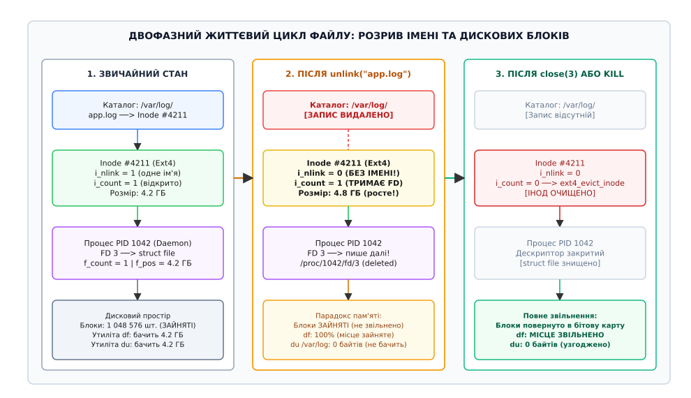
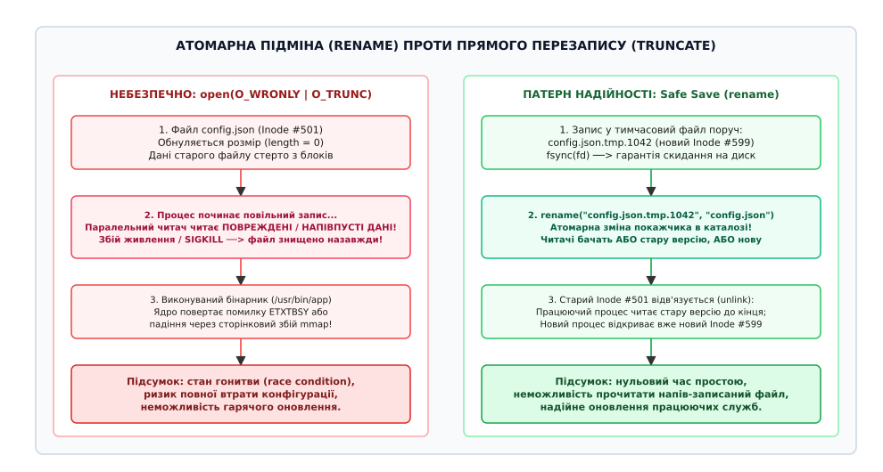
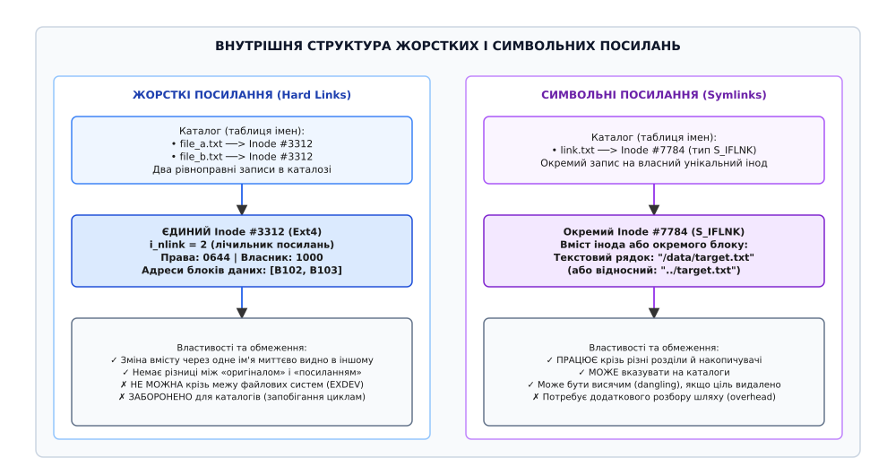

# Ім'я — не файл: наслідки для щоденної роботи

<preknowlist>
- [Inode](book:unix-linux/inode-model) — структура метаданих файлу; зберігає розмір, права, часи й карту блоків, але не знає власного імені.
- [Каталог як відображення](book:unix-linux/directory-as-mapping) — таблиця пар «ім'я → номер інода», що транслює людські рядкові шляхи у числові індекси файлової системи.
- [Жорсткі й символьні посилання](book:unix-linux/hard-and-symbolic-links) — два принципово різні способи зв'язування назв із сутностями файлової системи.
- [Файловий дескриптор](book:unix-linux/file-descriptor) — мале ціле число процесу, що посилається на відкритий стан ресурсу в пам'яті ядра.
- [Опис відкритого файлу](book:unix-linux/open-file-description) — структура ядра struct file, яка зберігає поточну позицію читання-запису та лічильник відкриттів.
</preknowlist>

Серверний накопичувач високонавантаженої системи обробки замовлень переповнюється до 100%, через що база даних блокує нові транзакції, а веб-сервіси починають масово повертати помилки 500. Черговий інженер підключається до сервера й бачить гігантський файл журналу `/var/log/orders.log` розміром тридцять гігабайтів. Щоб негайно врятувати систему від зупинки, він виконує швидку команду `rm /var/log/orders.log`. Файл моментально зникає зі списку `ls -l /var/log`, проте команда `df -h` продовжує показувати нуль вільних байтів і 100% заповненості розділу, тоді як рекурсивний аналіз дерева каталогів `du -sh /var/log` стверджує, що весь каталог займає лише кілька кілобайтів. Сервіси залишаються паралізованими, нові дані не записуються, а видалені тридцять гігабайтів дискового простору безслідно розчинилися у файловій системі.

Причина цієї критичної виробничої кризи криється в засадничому архітектурному рішенні Unix: у системі взагалі не існує операції «видалити файл». На рівні ядра та системних викликів існує лише вилучення імені з каталогу — системний виклик `unlink()`. Файлове ім'я є лише тимчасовим текстовим ярликом у каталожній таблиці відображення, тоді як сам файл — це безіменний вузол метаданих (англ. *inode*, від *index node*) та виділені йому блоки зберігання на фізичному носії. Поки фоновий демон журналювання продовжує утримувати відкритий файловий дескриптор, ядро зобов'язане зберігати всі дискові блоки цілими, а процес продовжує безперешкодно писати в них нові гігабайти даних.

Розуміння суворого поділу між іменем та інодом перетворює абстрактну теорію файлових систем на набір щоденних інженерних практик. Від цього поділу залежить, чому прямий перезапис конфігурацій руйнує дані під час збоїв живлення, як оновлювати виконувані бінарні файли демонів на гарячому сервері без зупинки процесів, чому ротація логів через `mv` не втрачає жодного рядка, чому жорсткі посилання ніколи не перетинають межі розділів і яким чином вичерпання таблиці інодів паралізує файлову систему за наявності сотень вільних гігабайтів пам'яті.

## Чотири рівні абстракції: Dirent, Dentry, Inode та File

У більшості файлових систем для персональних комп'ютерів ранньої епохи (наприклад, FAT) запис у каталозі був самим файлом: один сектор каталогу містив ім'я, розмір, початковий кластер та атрибути. Unix ще в 1970-х роках повністю відокремив простір назв від простору збереження.

Щоб зрозуміти, як операційна система оперує файлами, необхідно розрізняти чотири взаємопов'язані сутності, дві з яких живуть на диску, а дві — виключно в оперативній пам'яті ядра:

```
ПРОСТІР НАЗВ (КАТАЛОГИ)                   ПРОСТІР ЗБЕРЕЖЕННЯ (ДАНІ)
┌────────────────────────────────┐       ┌────────────────────────────────┐
│  Запис каталогу (на диску)     │       │  Інод (на диску та в RAM)      │
│  struct linux_dirent64         │       │  struct inode                  │
│  • Ім'я: "app.log"             │──────>│  • Номер: 4211                 │
│  • Номер інода: 4211           │       │  • Права: 0644 | Власник: 1000 │
└────────────────────────────────┘       │  • Розмір: 32.4 ГБ             │
               ▲                         │  • Карта блоків: [B12, B13...] │
               │ (кешування)             │  • i_nlink = 1                 │
┌──────────────┴─────────────────┐       │  • i_count = 1                 │
│  Кеш записів каталогу (RAM)    │       └────────────────────────────────┘
│  struct dentry                 │                       ▲
│  • d_name: "app.log"           │                       │
│  • d_inode ────────────────────┼───────────────────────┘
└────────────────────────────────┘                       │
                                                         │
                                         ┌───────────────┴────────────────┐
                                         │  Опис відкриття (в RAM)        │
                                         │  struct file                   │
                                         │  • f_pos: 34812928000          │
                                         │  • f_flags: O_WRONLY|O_APPEND  │
                                         │  • f_count = 1                 │
                                         └────────────────────────────────┘
```

1. **Запис каталогу на диску (`struct linux_dirent64`):** Каталог в Unix — це спеціальний файл, вмістом якого є таблиця пар `(ім'я, номер інода)`. Запис каталогу містить лише текстовий рядок назви та 64-бітне число інода. Він не містить жодної інформації про права, тип чи розмір файлу.
2. **Елемент кешу каталогів (`struct dentry`):** Щоб не читати дискові сектори каталогу при кожному зверненні до шляху, ядро підтримує в пам'яті хеш-таблицю `dcache`. Об'єкт `dentry` пов'язує текстове ім'я з покажчиком на `struct inode`. Якщо файл не існує, ядро створює «негативний dentry» (*negative dentry*), який кешує факт відсутності файлу, щоб повторні невдалі виклики `open()` завершувалися миттєвою помилкою `ENOENT` без звернення до диска.
3. **Вузол файлової системи (`struct inode`):** Головний об'єкт файлової системи. Зберігає тип об'єкта, біти дозволів, ідентифікатор власника, мітки часу (`atime`, `mtime`, `ctime`), розмір у байтах, кількість виділених 512-байтових секторів `i_blocks`, номер покоління `i_generation` та дерево екстентів для адресації дискових блоків. У самому іноді немає жодного символу власного імені чи шляху.
4. **Опис відкритого файлу (`struct file`):** Створюється в пам'яті ядра під час системного виклику `open()`. Зберігає контекст активного сеансу: поточну позицію читання-запису `f_pos`, прапорці доступу `f_flags` (`O_APPEND`, `O_NONBLOCK`) та таблицю методів драйвера `f_op`.

У структурі `inode` зберігаються два критичні лічильники життєвого циклу:

* **`i_nlink` (дисковий і системний лічильник):** фіксує кількість записів у різних або тому самому каталозі, які вказують на цей номер інода. Коли файл створюється вперше, `i_nlink = 1`.
* **`i_count` (виключно в оперативній пам'яті ядра):** лічильник посилань у VFS, що відображає кількість структур ядра (`struct file`, `struct dentry`), які прямо зараз тримають цей інод у використанні.

Фізичне повернення дискових секторів у бітову карту вільного простору файлової системи відбувається лише за умови виконання обов'язкового логічного інваріанта:

```
Звільнення дискових блоків ⟺ (i_nlink == 0) ∧ (i_count == 0)
```

Якщо `i_nlink == 0`, але `i_count > 0`, файл стає безіменним «фантомом»: його більше неможливо знайти за жодним іменем у файловому дереві, але його блоки надійно зафіксовані на диску, а відкриті процеси продовжують читати й писати в них дані на повній швидкості.

## Механіка `unlink()`: трасування шляху системного виклику

Коли користувач вводить у терміналі `rm /var/log/orders.log`, утиліта `rm` виконує системний виклик `unlinkat(AT_FDCWD, "/var/log/orders.log", 0)` або застарілий `unlink("/var/log/orders.log")`.

Розгляньмо крок за кроком, які операції виконує ядро Linux:

```
sys_unlink(pathname)
  │
  ├── 1. filename_lookup() ──> розбір шляху у dcache, знаходження dentry каталогу /var/log
  ├── 2. inode_permission() ──> перевірка прав: чи має процес право W_OK + X_OK на каталог /var/log
  │      (Увага: права на САМ файл /var/log/orders.log ядром НЕ перевіряються!)
  │
  ├── 3. vfs_unlink(dir_inode, dentry)
  │      │
  │      ├── 3.1. inode_lock_nested(dir_inode) ──> блокування м'ютекса батьківського каталогу
  │      ├── 3.2. ext4_unlink(dir_inode, dentry) ──> виклик драйвера файлової системи:
  │      │        ├── вилучення запису dirent із дискового блоку каталогу
  │      │        ├── зменшення лічильника inode->i_nlink (з 1 до 0)
  │      │        └── ext4_orphan_add(handle, inode) ──> внесення в «список сиріт» суперблока
  │      │
  │      ├── 3.3. d_drop(dentry) ──> відв'язування dentry з хеш-таблиці dcache
  │      └── 3.4. inode_unlock(dir_inode) ──> зняття блокування з каталогу
  │
  └── 4. iput(inode) ──> зменшення лічильника активних посилань i_count у пам'яті:
         ├── Якщо i_count > 0 (файл відкрито): вихід із виклику; блоки залишаються на диску
         └── Якщо i_count == 0 (дескрипторів немає): виклик ext4_evict_inode():
               ├── ext4_truncate() ──> звільнення екстентів у бітовій карті блоків
               ├── ext4_free_inode() ──> позначення номера інода як вільного
               └── ext4_orphan_del() ──> видалення зі списку сиріт суперблока
```


*Двофазне звільнення ресурсів: виклик unlink() знищує запис у каталозі, але дискові блоки звільняються лише після закриття останнього дескриптора close().*

Зверніть увагу на крок 2: для видалення файлу користувачеві взагалі не потрібні права на сам файл. Навіть якщо файл має режим `0000` і належить іншому користувачеві, будь-хто, хто має право запису у батьківський каталог, може безперешкодно його видалити (за винятком каталогів зі sticky-бітом `1777`, таких як `/tmp`). Це прямий наслідок моделі: операція `unlink` модифікує каталог, а не інод файлу.

Крок 3.2 містить фундаментальний механізм надійності — список сиріт (*Orphan List*). Якщо `i_nlink` впав до нуля, але процес усе ще тримає файл відкритим, драйвер файлової системи додає інод у зв'язаний список у заголовку суперблока на диску. Якщо в цей момент раптово зникне електроживлення, під час наступного завантаження підсистема відновлення журналу виявить ці безіменні іноди у списку сиріт і безпечно поверне їхні блоки у вільний простір, запобігаючи невидимим витокам пам'яті накопичувача.

Коли демон журналювання продовжує писати у свій дескриптор `3`, його системні виклики `write(3, buf, len)` звертаються безпосередньо до структури `struct file`, яка вже зберігає прямий покажчик на `struct inode`. Операція запису не виконує пошуку в каталозі: ядро виділяє нові сторінки в кеші сторінок (*page cache*), зв'язує їх з інодом, а фонові потоки ядра `kworker` періодично скидають їх на фізичний носій. Розмір файлу продовжує зростати, але для команди `ls` його не існує.

> 🔧 **Навіщо це.**
> Таке розділення гарантує повну безпеку роботи в багатозадачному середовищі. Якщо адміністратор або сторонній скрипт видаляє бібліотеку чи файл даних, які прямо зараз читаються іншою програмою, ця програма не впаде з помилкою сегментації або пошкодженням пам'яті. Вона стабільно дочитає свій сеанс до кінця, після чого ресурс тихо звільниться.

## Діагностика парадоксу: `df` проти `du` та пошук за `lsof +L1`

Розбіжність між системними утилітами `df` (*disk free*) та `du` (*disk usage*) є прямим наслідком того, звідки кожна з них бере дані про стан сховища:

* **Утиліта `du` (каталоговий обхід):** починає рекурсивний обхід із вказаного каталогу через `opendir()`/`readdir()`, робить виклик `lstat()` для кожного знайденого імені й сумує розміри зайнятих блоків `st_blocks`. Якщо файл був unlink-нутий, його імені немає в жодному каталозі, тому `du` його принципово не бачить і нараховує нуль байтів.
* **Утиліта `df` (опитування суперблока):** робить системний виклик `statvfs()`, який зчитує метадані суперблока файлової системи `struct super_block`. Суперблок знає точну кількість вільних і зайнятих блоків з глобальної бітової карти розподілу (block allocation bitmap). Оскільки блоки відкритого видаленого файлу позначені як зайняті, `df` чесно показує, що диск заповнений на 100%.

Крім відкритих видалених файлів, різницю між `df` та `du` можуть спричиняти ще два фактори:

1. **Зарезервований простір суперблока:** За замовчуванням `mkfs.ext4` резервує 5% блоків для користувача `root` (щоб запобігти фрагментації та дозволити системним службам запускатися при повному заповненні диска). Утиліта `df` враховує цей ліміт у стовпчику `Available`.
2. **Перекриття точок монтування (Mount Shadowing):** Якщо змонтувати новий розділ поверх каталогу, у якому вже лежали файли (наприклад, змонтувати диск у непорожній `/var`), старі файли стануть невидимими для `du`, але продовжуватимуть займати фізичне місце на кореневому розділі.

### Виявлення фантомних файлів

Для виявлення файлів, які займають дисковий простір, але не мають запису в каталозі, використовують утиліту `lsof` з фільтром за лічильником посилань:

```bash
lsof +L1
```

Ключ `+L1` вказує `lsof` вивести всі відкриті файли, у яких значення `i_nlink` (стовпчик `NLINK`) строго менше за 1:

```
COMMAND   PID USER   FD   TYPE DEVICE SIZE/OFF NLINK   NODE NAME
app_srv  1042 root    3w   REG    8,1 32412836480     0 421109 /var/log/orders.log (deleted)
```

Альтернативний спосіб без сторонніх утиліт — пряме опитування псевдофайлової системи ядра `/proc`:

```bash
ls -l /proc/*/fd/* 2>/dev/null | grep '(deleted)'
```

Ядро Linux додає явний суфікс ` (deleted)` до цільового шляху кожного псевдопосилання у `/proc/[pid]/fd/`, якщо відповідний `inode->i_nlink == 0`.

### Порятунок даних з видаленого файлу

Якщо критичний файл конфігурації або базу даних було випадково видалено через `rm`, але процес, який тримав його відкритим, усе ще працює, дані можна повністю врятувати без використання складних утиліт низькорівневого відновлення секторів.

У Linux псевдопосилання `/proc/[PID]/fd/[FD]` — це не просто текст, а так зване «магічне посилання» ядра (англ. *magic link*). Відкриття цього шляху звертається безпосередньо до `struct file` у ядрі, оминаючи стандартний пошук за іменем у каталозі:

```bash
# Відновлення 30-гігабайтного журналу або бази даних у новий файл
cp /proc/1042/fd/3 /recovered/orders.log.recovered
```

Після завершення копіювання процес можна перезапустити або надіслати йому сигнал перезавантаження конфігурації (`kill -HUP $PID`), щоб він нарешті закрив свій дескриптор і звільнив заблоковане місце на диску.

Повний алгоритм автоматизованого пошуку та порятунку таких файлів із вихідним кодом реалізовано в практичній вставці [атомарна заміна файлів та порятунок відкритих дескрипторів](guide:unix/name-is-not-the-file/proj-atomic-replace.md).

### Патерн анонімних тимчасових файлів

Властивість збереження інода при відкритому дескрипторі активно використовується у системному програмуванні для створення захищених тимчасових буферів:

:::tabs
```c
/* Створення гарантовано безпечного тимчасового файлу */
int fd = open("/tmp/scratchpad.tmp", O_RDWR | O_CREAT | O_EXCL, 0600);
if (fd >= 0) {
    /* Негайне видалення імені з каталогу! */
    unlink("/tmp/scratchpad.tmp");
    
    /* Продовжуємо читати й писати в fd */
    write(fd, "secret data", 11);
    
    /* При падінні процесу або SIGKILL файл зникне автоматично */
    close(fd);
}
```
```cpp
#include <iostream>
#include <string_view>
#include <unistd.h>
#include <fcntl.h>

void use_anonymous_temp_file() {
    int fd = ::open("/tmp/scratchpad.tmp", O_RDWR | O_CREAT | O_EXCL, 0600);
    if (fd < 0) return;

    // Негайний розрив зв'язку з каталогом
    ::unlink("/tmp/scratchpad.tmp");

    std::string_view data = "secret data";
    ::write(fd, data.data(), data.size());

    // Файл гарантовано зникне після закриття дескриптора
    ::close(fd);
}
```
:::

Після виклику `unlink()` жоден інший користувач чи процес не зможе знайти цей файл у каталозі `/tmp`, відкрити його чи підглянути дані. Коли процес завершиться (навіть через аварійний сигнал `SIGKILL`), ядро автоматично виконає `close()` усіх дескрипторів, і всі дискові блоки буфера миттєво повернуться системі без ризику засмічення диска сміттям.

У сучасному Linux цей патерн отримав спеціальний прапорець `O_TMPFILE`:

:::tabs
```c
/* Створення анонімного файлу безіменно у файловій системі */
int fd = open("/tmp", O_RDWR | O_TMPFILE | O_EXCL, 0600);
```
```cpp
#include <fcntl.h>
#include <unistd.h>

// Відкриття безіменного інода через прапорець O_TMPFILE
int fd = ::open("/tmp", O_RDWR | O_TMPFILE | O_EXCL, 0600);
```
:::

Прапорець `O_TMPFILE` одразу створює безіменний інод у файловій системі без попереднього створення та подальшого видалення запису в каталозі.

## Атомарне перейменування та безпечний перезапис файлів

Однією з найпоширеніших помилок початківців є спроба оновити файл прямо на місці через відкриття з прапорцем `O_TRUNC`:

:::tabs
```c
/* НЕБЕЗПЕЧНИЙ ПЕРЕЗАПИС: пошкодження даних при аваріях */
int fd = open("/etc/app/config.json", O_WRONLY | O_TRUNC);
write(fd, new_config, len);
close(fd);
```
```cpp
#include <fcntl.h>
#include <unistd.h>
#include <string_view>

// Небезпечний прямий перезапис: обнуляє інод перед записом
void unsafe_overwrite(std::string_view new_config) {
    int fd = ::open("/etc/app/config.json", O_WRONLY | O_TRUNC);
    if (fd >= 0) {
        ::write(fd, new_config.data(), new_config.size());
        ::close(fd);
    }
}
```
:::

Такий підхід породжує три критичні вразливості:

1. **Стан гонитви для читачів (Race condition):** прапорець `O_TRUNC` миттєво обнуляє довжину файлу в іноді (`length = 0`). Якщо в цей момент інший процес читає конфігурацію, він прочитає 0 байтів або частковий шматок нового тексту, що призведе до збою додатка.
2. **Втрата даних при збоях:** якщо під час виконання функції `write()` сервер втратить живлення або процес буде примусово зупинено ядром через брак пам'яті (OOM-killer), старі дані будуть повністю знищені, а нові — записані лише частково. Конфігураційний файл буде безповоротно пошкоджений.
3. **Помилка `ETXTBSY` при оновленні бінарних файлів:** якщо спробувати перезаписати виконуваний файл працюючого сервісу (`/usr/bin/daemon`), ядро поверне системну помилку `ETXTBSY` (*Text file busy*). Linux блокує запис у блоки виконуваного файлу, якщо хоча б один процес відображає цей бінарник у пам'ять через механізм сторінкової підкачки `mmap()`.

### Патерн безпечної заміни (Safe Save / Atomic Replace)

Щоб уникнути пошкодження файлів, використовують властивість системного виклику `rename()`:

```
rename(oldpath, newpath)
```

За стандартом POSIX, якщо `newpath` уже існує, системний виклик `rename()` атомарно відв'язує старий інод (`unlink(newpath)`) і пов'язує ім'я `newpath` із новим інодом у межах єдиної операції під блокуванням каталогу в пам'яті ядра.


*Атомарна заміна файлу: запис у тимчасовий інод із подальшим викликом rename() виключає стан гонитви та дозволяє паралельним читачам безперервно працювати зі старою версією.*

Алгоритм безпечного оновлення складається з чотирьох кроків:

1. Створити тимчасовий файл **у тому самому каталозі** (наприклад, `/etc/app/.config.json.tmp.1042`).
2. Повністю записати нові дані у тимчасовий файл.
3. Викликати `fsync(tmp_fd)`, щоб гарантувати запис сторінок із кешу ядра на фізичні пластини чи комірки пам'яті SSD.
4. Закрити тимчасовий файл і виконати атомарний виклик `rename("/etc/app/.config.json.tmp.1042", "/etc/app/config.json")`.
5. Відкрити батьківський каталог `open("/etc/app", O_RDONLY | O_DIRECTORY)` і викликати `fsync(dir_fd)` для фіксації запису каталогу на носії.

Будь-який сторонній процес у будь-який момент часу побачить або повністю стару версію файлу, або повністю нову. Проміжного стану «файл порожній» або «файл записаний наполовину» в цій моделі не існує фізично.

Саме так працює утиліта `install` під час оновлення бінарних файлів дистрибутива: вона не копіює байти поверх старого файлу (що викликало б `ETXTBSY`), а створює новий інод і підміняє запис у каталозі через `rename()`. Працюючий процес продовжує виконувати код зі старого інода, а всі наступні запуски стартують уже з нового бінарника.

### Безшовна ротація логів (Log Rotation без втрати даних)

Механізм розділення імені та інода лежить в основі роботи системного демона `logrotate`. Існує дві взаємовиключні стратегії ротації журналів:

1. **Стратегія `copytruncate` (небезпечна):** утиліта копіює поточний вміст файлу `app.log` у новий архівний файл `app.log.1`, після чого обнуляє старий файл через `truncate()`. Цей метод має небезпечний стан гонитви: усі байти журналу, які додаток записав у часовому проміжку між копіюванням та обнуленням, будуть безповоротно втрачені.
2. **Стратегія атомарного перейменування з сигналом (надійна):** утиліта виконує `mv /var/log/app.log /var/log/app.log.1`. Оскільки системний виклик `rename()` лише змінює ім'я в каталозі, працюючий демон продовжує безперервно писати в той самий інод за старим файловим дескриптором. Жоден рядок журналу не губиться! Після перейменування `logrotate` надсилає демону сигнал `kill -HUP $PID` або `kill -USR1 $PID`. Отримавши сигнал, демон закриває старий дескриптор `close(fd)` і відкриває новий файл `open("/var/log/app.log", O_WRONLY | O_CREAT | O_APPEND)`.

## Жорсткі проти символічних посилань у повсякденній практиці

Поділ «ім'я — це запис у каталозі, а файл — це інод» породжує два різні способи посилатися на один і той самий об'єкт: жорсткі посилання (hard links) та символічні посилання (symlinks / soft links).


*Внутрішня організація посилань: жорстке посилання додає новий запис на той самий інод; символьне посилання створює новий інод типу S_IFLNK, який містить текстовий шлях до цілі.*

### Жорсткі посилання (`link()`)

Жорстке посилання створюється системним викликом `link(oldpath, newpath)` або командою `ln source target`. Воно додає в таблицю каталогу ще один запис `(target, inode_num)`, що вказує на той самий номер інода, і збільшує значення `inode->i_nlink` на одиницю.

Властивості жорстких посилань:

* **Повна рівноправність імен:** у файловій системі немає поняття «оригінального файлу» і «посилання». Обидва записи мають однаковий статус. Якщо видалити одне ім'я, друге продовжує повноцінно існувати.
* **Спільні метадані:** зміна прав доступу (`chmod`), власника (`chown`) або вмісту через будь-яке з імен негайно змінює сам інод і стає видимою для всіх імен одразу.
* **Неможливість виходу за межі файлової системи (`EXDEV`):** номер інода є локальним індексом у межах конкретної структури суперблока `struct super_block`. Номер 4211 на розділі `/` та номер 4211 на розділі `/home` — це два абсолютно різні файли. Спроба створити жорстке посилання між різними томами призведе до помилки `EXDEV` (*Invalid cross-device link*).
* **Заборона жорстких посилань на каталоги:** за винятком системних записів `.` (посилання каталогу на самого себе) та `..` (посилання на батьківський каталог), створення жорстких посилань на каталоги суворо заборонено ядром для всіх користувачів, включно з `root`. Це запобігає утворенню циклічних петель у дереві файлової системи, які призвели б до нескінченних циклів при обході дисків та зависання утиліти відновлення `fsck`.
* **Оптимізація обходу каталогів за `st_nlink`:** Кількість посилань у каталогу завжди дорівнює `2 + кількість_підкаталогів` (одиниця за ім'я в батьківському каталозі, одиниця за внутрішнє посилання `.`, плюс по одному посиланню `..` від кожного дочірнього каталогу). Утиліта `find` використовує це число для оптимізації: якщо каталог має `st_nlink == 2`, вона знає, що підкаталогів у ньому немає, і не виконує додаткових викликів `stat()` для файлів усередині.

### Пастка текстових редакторів із жорсткими посиланнями

Припустимо, адміністратор створив жорстке посилання для швидкого дублювання конфігураційного файлу:

```bash
ln /etc/nginx/nginx.conf /root/nginx.conf.bak
```

Якщо відкрити `/etc/nginx/nginx.conf` у редакторі `vim` або `gedit`, внести зміни та зберегти файл, магія жорсткого посилання несподівано зникне: файл `/etc/nginx/nginx.conf` отримає новий номер інода і новий вміст, тоді як `/root/nginx.conf.bak` залишиться старим зі старим номером інода.

Причина полягає в патерні «безпечного збереження» текстових редакторів: щоб уникнути пошкодження конфігурацій при збоях, `vim` записує зміни у файл `nginx.conf~`, а потім викликає `rename()`. Як ми вже знаємо, `rename()` відв'язує старий інод від імені й прив'язує новий, розриваючи первинне жорстке посилання. Якщо потрібне гарантоване збереження зв'язку, у конфігурації редактора вмикають режим `backupcopy=yes` (прямий перезапис вмісту існуючого інода).

### Символічні посилання (`symlink()`)

Символічне посилання (англ. *symbolic link*, *symlink*) створюється системним викликом `symlink(target, linkpath)` або командою `ln -s`. Воно створює повноцінний новий інод із типом `S_IFLNK`.

Властивості символьних посилань:

* **Вміст — це текстовий рядок:** блоки даних символьного посилання містять лише текстовий рядок шляху до цілі. Якщо довжина шляху менша за 60 байтів (у файловій системі Ext4), ядро застосовує оптимізацію *Fast Symlink*: шлях зберігається прямо всередині 60-байтового масиву покажчиків на блоки `i_block` в самому іноді без виділення окремого 4-кілобайтного дискового блоку.
* **Робота крізь межі розділів:** оскільки розбір шляху виконується повторно за текстовим рядком, символьне посилання може вести на будь-який накопичувач, мережевий том NFS або псевдофайлову систему `/proc`.
* **Висячі посилання (Dangling symlinks):** якщо цільовий файл видалити або перейменувати, символьне посилання залишається існувати, але вказує в порожнечу. Спроба відкрити таке посилання через `open()` поверне помилку `ENOENT`.
* **Захист від нескінченних петель:** якщо створити циклічні посилання (`a -> b` та `b -> a`), ядро виявить зациклення за лічильником переходів. Ліміт `MAXSYMLINKS` у Linux дорівнює 40 переходам за один виклик. При його перевищенні системний виклик повертає помилку `ELOOP` (*Too many levels of symbolic links*).
* **Атомарне перемикання версій:** символьні посилання є класичним інструментом нульового простою при розгортанні додатків (blue-green deployment). Каталог `/var/www/current` створюється як symlink на `/var/www/releases/v1`. Коли розгортається реліз `v2`, створюється тимчасове посилання `/var/www/current.tmp -> /var/www/releases/v2`, після чого викликається `rename("/var/www/current.tmp", "/var/www/current")`. Усі нові запити миттєво підхоплюють нову версію коду без жодної мілісекунди зупинки сервісу.

## Вичерпання інодів (Inode Exhaustion) проти браку простору

Ще один критичний наслідок розділення імен та інодів полягає в тому, що дисковий простір може вичерпатися за двома незалежними вимірами: за обсягом блоків даних або за кількістю вільних інодів.

У класичних файлових системах сімейства Ext (Ext2, Ext3, Ext4) загальна кількість інодів жорстко фіксується в момент форматування розділу утилітою `mkfs.ext4` (за замовчуванням один інод на кожні 16 КіБ простору за параметром `-i 16384`). Таблиця інодів розміщується у фіксованих секторах на початку кожної групи блоків. Збільшити або зменшити кількість інодів на вже створеній файловій системі Ext4 без повного переформатування неможливо.

Якщо на сервері працює сервіс, який генерує мільйони крихітних файлів (наприклад, PHP-сесії по 50 байтів, поштові черги або кеш дрібних прев'ю зображень), таблиця інодів заповниться задовго до того, як закінчаться дискові гігабайти.

```bash
# Перевірка вичерпання інодів
df -i
```

Типовий результат аварійного стану:

```
Filesystem      Inodes   IUsed   IFree IUse% Mounted on
/dev/sda1      2621440 2621440       0  100% /var
```

У цій ситуації команда `df -h` може показувати 80% вільного простору (сотні гігабайтів), але будь-яка спроба створити навіть порожній файл `touch /var/test` закінчуватиметься помилкою:

```
touch: cannot touch '/var/test': No space left on device (ENOSPC)
```

Ядро повертає ту саму стандартну помилку `ENOSPC`, оскільки не може виділити новий запис у бітовій карті інодів.

### Чому видалення мільйона файлів через `rm -rf` зависає

Коли каталог містить мільйон дрібних файлів, спроба очистити його наївною командою `rm -rf /var/cache/app/*` часто призводить до зависання термінала або помилки `Argument list too long` (переповнення буфера аргументів `MAX_ARG_STRLEN` в оболонці).

Навіть якщо запустити `find /var/cache/app -type f -delete`, процес видалення може тривати годинами. Причина криється у внутрішній структурі каталогів:

1. **Індексація каталогів Htree:** У файловій системі Ext4 каталоги з великою кількістю файлів індексуються за допомогою B-дерева хешів (Htree). Кожен виклик `unlink()` вимагає пошуку запису в дереві, оновлення сусідніх записів dirent і балансування вузлів дерева.
2. **Журналювання метаданих JBD2:** Кожне видалення файлу — це окрема транзакція в журналі файлової системи: потрібно оновити бітову карту інодів, бітову карту блоків, лічильник каталогу і сам блок dirent. Якщо диск повільний (HDD або хмарний EBS з обмеженням IOPS), журнал стає вузьким місцем.
3. **Швидке очищення каталогу:** Набагато ефективніше не видаляти мільйон файлів по одному, а атомарно підмінити каталог і видалити старий у фоні:

```bash
# Миттєва підміна робочого каталогу новим порожнім
mkdir /var/cache/app_new
mv /var/cache/app /var/cache/app_old
mv /var/cache/app_new /var/cache/app

# Фонове повільне видалення старого каталогу без простою сервісу
rm -rf /var/cache/app_old &
```

### Пошук джерела вичерпання інодів

Щоб швидко локалізувати каталог, у якому накопичилися мільйони дрібних файлів, використовують однорядковий конвеєр аналізу кількості записів у підкаталогах:

```bash
find /var -xdev -type d -exec sh -c 'echo "$(ls -1a "$1" | wc -l) $1"' _ {} \; | sort -n -r | head -n 20
```

Сучасніші файлові системи нового покоління (XFS, Btrfs, ZFS) позбавлені обмеження статичної таблиці: вони виділяють іноди динамічно у вигляді B-дерев прямо в загальному пулі блоків пам'яті, тому проблема вичерпання інодів у них виникає лише при фізичному заповненні всього диска.

## Синтез моделі: інваріанти поведінки файлів у Unix

Підсумуймо ключові правила та інваріанти, які визначають щоденну поведінку файлової підсистеми Unix:

| Сутність | Де живе | Що зберігає | Коли знищується |
|---|---|---|---|
| **Ім'я (dirent)** | Блоки каталогу | Текстовий рядок + номер інода | При виклику `unlink()` або `rename()` |
| **Інод (`struct inode`)** | Таблиця інодів ФС / пам'ять | Права, розмір, часи, тип, карта блоків, лічильник `i_nlink` | Коли `i_nlink == 0` **ТА** `i_count == 0` |
| **Опис відкриття (`struct file`)** | Оперативна пам'ять ядра | Поточна позиція `f_pos`, прапорці `f_flags`, лічильник `f_count` | Коли всі дескриптори закрито викликом `close()` |
| **Дескриптор (`fd`)** | Таблиця процесу | Ціле число — індекс у масиві покажчиків | При закритті `close()` або завершенні процесу |

Чотири головні інженерні висновки:

1. **Ім'я — це лише покажчик.** Файл не належить каталогу, він лише зареєстрований у ньому. В одному каталозі чи на всьому розділі може бути безліч імен, що ведуть до одного інода, або не бути жодного.
2. **Видалення — це асинхронний процес.** Виклик `unlink()` лише забирає ім'я з каталогу. Дискові блоки та метадані продовжують жити в системі, доки останній відкритий дескриптор не буде закрито.
3. **Надійний запис завжди атомарний.** Щоб уникнути стану гонитви та руйнування даних при аваріях, конфігураційні файли записують у тимчасовий інод, скидають на носій через `fsync()` і підміняють вказівник у каталозі викликом `rename()`.
4. **Сховище має два ліміти.** Контролювати слід не лише гігабайти через `df -h`, а й щільність об'єктів у таблиці інодів через `df -i`.
