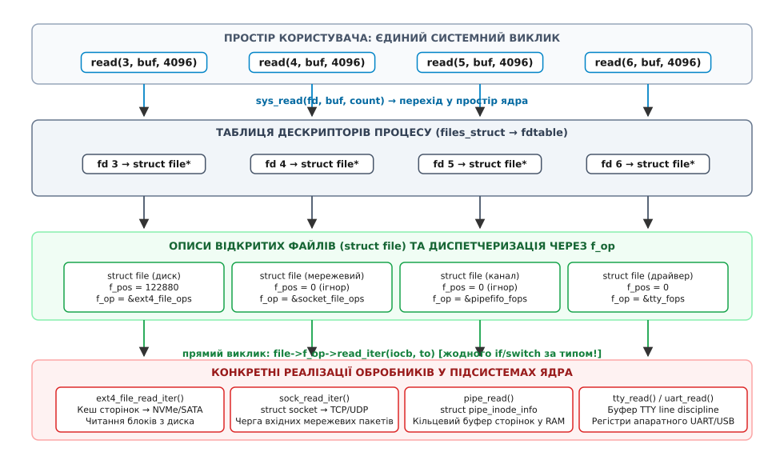
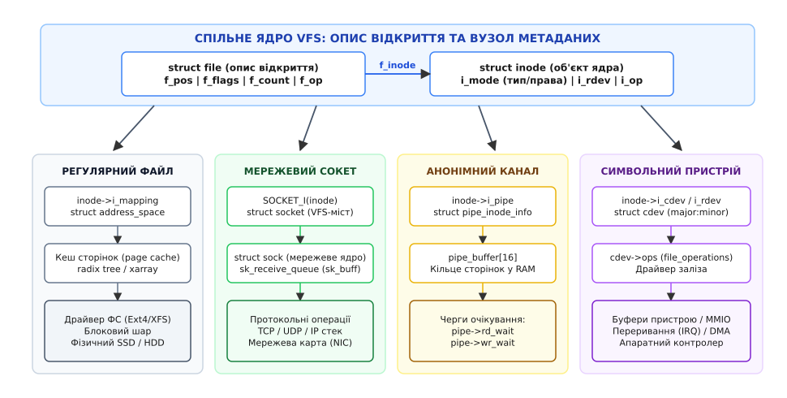

# Один інтерфейс на файл, сокет і пристрій

<preknowlist>
- [Файловий дескриптор](topic:sys-unix/file-descriptor) — мале ціле число, індекс у таблиці процесу, через яке програма адресує ресурси ядра.
- [Опис відкритого файлу](topic:sys-unix/open-file-description) — структура struct file, що зберігає стан відкриття, поточну позицію та прапорці доступу.
- [Сокет як дескриптор](topic:sys-unix/socket-as-descriptor) — мережеве з'єднання, представлене через файловий дескриптор у просторі користувача.
- [Поліморфізм](topic:sf-lang/polymorphism) — спільний інтерфейс для оперування сутностями різної внутрішньої структури.
- [Покажчики на функції](topic:sf-lang/function-pointers) — збереження адреси підпрограми в структурі даних для динамічного вибору поведінки.
</preknowlist>

Серверний процес обробки подій отримує з черги готовності чотири дескриптори: 3, 4, 5 і 6. Програма викликає для кожного з них абсолютно однаковий системний виклик `read(fd, buffer, 4096)` з ідентичними регістрами процесора та тією самою машинною інструкцією `syscall`. Проте за дескриптором 3 стоїть файл журналу на SSD-накопичувачі NVMe з файловою системою Ext4; за дескриптором 4 — активне TCP-з'єднання з віддаленою базою даних через мережевий адаптер; за дескриптором 5 — анонімний канал від дочірнього процесу обчислень; а за дескриптором 6 — послідовний порт мікроконтролера `/dev/ttyUSB0`.

Для прикладної програми всі чотири виклики виглядають нерозрізненними: вона передає ціле число, адресу буфера в пам'яті й ліміт байтів, отримуючи натомість масив прочитаних даних. Проте всередині ядра процесору доводиться виконувати принципово різні ланцюги дій. Для файлу ядро розраховує логічні блоки екстентів, звертається до кешу сторінок і планує звернення до блокового контролера. Для сокета воно вичитує заголовки мережевих пакетів із черги драйвера мережевої карти, розбирає вікно ковзання TCP й надсилає підтвердження прийому. Для каналу — копіює байти з кільцевого буфера в оперативній пам'яті та переводить у стан готовності заблокований процес-письменник. Для послідовного порту — взаємодіє з апаратною чергою UART-чіпа через регістри вводу-виводу або лінії переривань.

Якби ядро реалізовувало цю універсальність наївним розгалуженням через ланцюг умовних переходів `if (is_socket(fd)) ... else if (is_pipe(fd)) ... else if (is_ext4(fd)) ...`, додавання будь-якого нового драйвера пристрою, файлової системи чи типу сокета вимагало б ручного редагування кожного системного виклику в колі ядра. Центральний обробник `sys_read` перетворився б на велетенський монолітний диспетчер із тисячами розгалужень, де будь-яка помилка в одній підсистемі паралізувала б роботу всього вводу-виводу. Замість цього Unix-подібні системи вирішили цю проблему на рівні архітектури за допомогою віртуальної файлової системи (англ. *Virtual Filesystem Switch*, VFS) та механізму динамічного зв'язування на основі таблиць покажчиків на функції — об'єктно-орієнтованого поліморфізму, реалізованого мовою C задовго до поширення об'єктних мов у системному програмуванні.

## Три рівні абстракції: від дескриптора до апаратного ресурсу

Щоб зрозуміти, де саме відбувається перетворення єдиного виклику на специфічну дію, простежмо шлях системного виклику крізь структури ядра. Цей шлях проходить крізь три чітко розмежовані рівні абстракції: таблицю дескрипторів процесу, опис відкритого файлу та вузол файлової системи (inode).

Поліморфізм (лат. *polymorphus*, від грец. *πολύμορφος* — «багатоформний») у VFS спирається на те, що кожна сутність на кожному поверсі відповідає виключно за власну зону відповідальності.


*Шлях системного виклику read: від цілого числа в просторі користувача до безпосереднього виклику драйвера через покажчик f_op без розгалужень за типом у гарячому тракті ядра.*

### Рівень 1: Таблиця дескрипторів процесу (`struct files_struct`)

Кожен процес в операційній системі має власну структуру керування відкритими файлами `current->files`, у якій розташована динамічна таблиця дескрипторів `struct fdtable`. Число `fd`, яке повертають функції `open()`, `socket()` або `pipe()`, є звичайним індексом у масиві покажчиків `fdtable->fd[fd]`.

Елемент цього масиву містить лише дві речі:
1. Покажчик на структуру ядра `struct file *`, що представляє опис відкритого файлу;
2. Бітову маску прапорців дескриптора (наприклад, `FD_CLOEXEC`, який вказує закрити цей дескриптор під час виклику `execve`).

На цьому рівні ядро взагалі нічого не знає про те, що саме відкрито — файл на диску, порт USB чи з'єднання з інтернетом. Його задача — виключно перевірити, чи не перевищує індекс межі виділеного масиву, чи не є покажчик нульовим, та атомарно отримати посилання на `struct file`.

### Рівень 2: Опис відкритого файлу (`struct file`)

Структура `struct file` живе у пам'яті ядра незалежно від процесів і представляє **стан конкретного відкриття**. Якщо два процеси відкрили той самий файл незалежно через виклик `open()`, у ядрі створюються два окремі екземпляри `struct file`. Якщо ж процес викликав `fork()` або `dup()`, кілька дескрипторів посилаються на один і той самий `struct file`.

У цій структурі зберігаються параметри сеансу роботи:
* `f_pos` (`loff_t`) — поточна позиція читання/запису (зсув у байтах від початку ресурсу);
* `f_flags` (`unsigned int`) — прапорці режиму відкриття (`O_NONBLOCK`, `O_APPEND`, `O_DIRECT`, `O_SYNC`);
* `f_count` (`atomic_long_t`) — лічильник посилань на цей опис відкриття;
* `f_cred` (`const struct cred *`) — знімок повноважень користувача, який відкривав ресурс;
* `f_inode` (`struct inode *`) — покажчик на метадані ресурсу в файловій системі;
* `f_pos_lock` (`struct mutex`) — м'ютекс послідовного оновлення позиції читання й запису;
* `f_op` (`const struct file_operations *`) — покажчик на **таблицю операцій над файлом**.

Поле `f_op` — це центральний вузол поліморфізму VFS. Воно вказує на набір функцій, які вміють обслуговувати саме цей конкретний тип об'єкта.

### Рівень 3: Вузол файлової системи (`struct inode`)

Вузол `struct inode` представляє сам об'єкт (його метадані, фізичні блоки або прив'язку до підсистеми ядра), незалежно від того, скільки разів і ким він відкритий у системі.

Поле `inode->i_mode` кодує тип об'єкта за допомогою стандартних бітових констант POSIX:
* `S_IFREG` — регулярний файл на файловій системі;
* `S_IFDIR` — каталог;
* `S_IFCHR` — символьний пристрій (character device);
* `S_IFBLK` — блоковий пристрій (block device);
* `S_IFIFO` — іменований канал (FIFO);
* `S_IFSOCK` — сокет домену UNIX;
* `S_IFLNK` — символьне посилання.

Для пристроїв поле `inode->i_rdev` зберігає пару чисел `major:minor` (старший і молодший номери), що ідентифікують конкретний драйвер у системі та номер апаратного порту. Для сокетів та каналів `inode` зберігає покажчики на внутрішні структури мережевого стека або буфера каналу в пам'яті.

## Поліморфізм у C: таблиця `file_operations` як vtable ядра

В об'єктно-орієнтованих мовах на зразок C++ або Java поліморфні виклики компілюються через приховану таблицю віртуальних методів (vtable). У коді ядра Linux, написаному на C, цей механізм реалізовано явно через структуру `struct file_operations`.

Коли програма у просторі користувача викликає `read(fd, buf, count)`, ядро виконує швидкий ланцюг кроків:

```
sys_read(fd, buf, count)
  │
  ├── 1. file = fget_light(fd, &fput_needed)    [швидке взяття struct file з таблиці процесу]
  ├── 2. перевірка прав: file->f_mode & FMODE_READ
  ├── 3. перевірка діапазону: rw_verify_area(READ, file, ppos, count)
  ├── 4. виклик file->f_op->read_iter(iocb, &iter)  [динамічний перехід за покажчиком]
  ├── 5. оновлення file->f_pos += bytes
  ├── 6. сповіщення fsnotify_access(file)
  └── 7. fput_light(file, fput_needed)          [звільнення посилання на опис]
```

Зверніть увагу на крок 4: у гарячому тракті системного виклику немає жодного оператора `switch` чи каскаду `if`. Процесор бере адресу функції прямо з поля `file->f_op->read_iter` і здійснює непрямий перехід `call *%rax`.

Якщо дескриптор вказує на файл Ext4, викликається функція `ext4_file_read_iter`. Якщо дескриптор вказує на TCP-сокет, викликається `sock_read_iter`. Якщо це анонімний канал — `pipe_read`. Якщо послідовний порт — `tty_read`.

Повний контракт інтерфейсу, сигнатури всіх функцій, правила обробки векторних буферів `struct iov_iter` та конвенції повернення кодів помилок наведено в окремій довідці: [контракт таблиці операцій файлу](topic:unix/one-interface-many-things/api-file-operations.md).


*Спеціалізація об'єктів VFS: різні підсистеми ядра заміщають спільні покажчики своїми структурами кешу сторінок, мережевого сокета, кільцевого буфера або дескриптора пристрою.*

## Анатомія спеціалізацій: як різні сутності вбудовуються у VFS

Розгляньмо, як саме VFS зв'язує докупи кардинально різні підсистеми операційної системи.

### 1. Регулярний файл на диску (Ext4, XFS, Btrfs)

Коли процес відкриває звичайний файл на дисковому розділі:
1. VFS розбирає шлях крізь дерево каталогів, знаходить дисковий `inode` та створює екземпляр `struct file`.
2. Поле `f_op` ініціалізується статичною таблицею файлової системи (наприклад, `&ext4_file_operations`).
3. Поле `inode->i_mapping` вказує на структуру `struct address_space` — диспетчер кешу сторінок ядра (page cache).
4. Під час виклику `read` функція `ext4_file_read_iter` перевіряє, чи є запитані сторінки в оперативній пам'яті (у дереві xarray кешу сторінок). Якщо сторінки є, дані копіюються процесу без звернення до накопичувача. Якщо сторінок немає, ядро формує запит блокового вводу-виводу `struct bio` і звертається до контролера диска.
5. Після успішного читання лічильник `f_pos` збільшується на кількість переданих байтів.

Файл є повністю позиційованим: виклик `lseek()` вільно змінює `f_pos`, оскільки дисковий носій надає довільний доступ до секторів.

### 2. Мережевий сокет (TCP, UDP, UNIX domain)

Мережеві сокети народжуються не через `open()`, а через виклики `socket()` або `accept()`. Проте щоб повернути програмі дескриптор, мережевий стек використовує спеціальну псевдофайлову систему `sockfs`:
1. Ядро виділяє спеціальний об'єкт `struct socket_alloc`, який поєднує в собі `struct inode` та структуру мережевого сокета `struct socket`.
2. Викликається внутрішня функція `sock_alloc_file()`, яка створює `struct file` з таблицею операцій `socket_file_ops`.
3. У таблиці `socket_file_ops` поле `.read_iter` встановлено в `sock_read_iter`, а `.write_iter` — у `sock_write_iter`.
4. Коли процес викликає `read(sock_fd, buf, len)`, функція `sock_read_iter` звертається до структури `struct socket`, звідти переходить до протокольного ядра `struct sock *sk` (наприклад, екземпляра `struct tcp_sock`), і забирає байти з черги прийому пакетів `sk->sk_receive_queue`.
5. Поле `f_pos` для сокета не має сенсу і завжди дорівнює нулю. Спроба виконати `lseek(sock_fd, ...)` негайно повертає помилку `-ESPIPE` («Illegal seek»).

Мережевий сокет є класичним **потоком без стану позиції**: дані зникають із черги ядра в момент їхнього вичитування.

### 3. Анонімний канал (pipe) та FIFO

Канали створюються системним викликом `pipe2()` (або відкриттям іменованого каналу `mkfifo`):
1. Ядро виділяє спільний `struct inode` у псевдофайловій системі `pipefs` та структуру `struct pipe_inode_info`.
2. Структура `struct pipe_inode_info` містить кільцевий масив із 16 сторінок пам'яті `struct pipe_buffer` (за замовчуванням 64 КБ буфера в RAM) та дві черги очікування: `rd_wait` (для читачів) і `wr_wait` (для письменників).
3. Створюються два окремі дескриптори та два описи `struct file`:
   * Дескриптор читання дістає `f_op = &pipefifo_fops` із режимом тільки для читання;
   * Дескриптор запису дістає ту саму таблицю `pipefifo_fops` із режимом тільки для запису.
4. Виклик `write(p[1], ...)` викликає `pipe_write()`, яка розміщує байти у сторінках кільцевого буфера та будить процеси, що сплять у черзі `rd_wait`.
5. Виклик `read(p[0], ...)` викликає `pipe_read()`, яка забирає байти з кільця і будить процеси у `wr_wait`.

Позиціювання тут також заблоковане: дані в каналі існують лише у формі черги FIFO (First In, First Out).

### 4. Символьний пристрій (Character Device) та TTY Line Discipline

Символьні пристрої (файли у каталозі `/dev/`, такі як `/dev/ttyUSB0`, `/dev/urandom`, `/dev/i2c-1`) представляють прямий доступ до апаратних драйверів без проміжного дискового кешу:
1. Файл пристрою на диску має вузол `inode` з типом `S_IFCHR` та старшим/молодшим номерами в `inode->i_rdev`.
2. Коли процес викликає `open("/dev/ttyUSB0", ...)`, VFS спочатку використовує стандартну таблицю `def_chr_fops`, чий метод `.open` вказує на функцію ядра `chrdev_open()`.
3. Функція `chrdev_open()` бере старший і молодший номери `i_rdev`, шукає у внутрішній хеш-таблиці ядра `cdev_map` зареєстрований драйвер `struct cdev` і **підміняє таблицю операцій** (`file->f_op = cdev->ops`).
4. Після цього викликається вже власний метод `.open` конкретного драйвера.
5. У випадку терміналів (TTY) між таблицею `file_operations` та драйвером заліза вбудовується додатковий рівень — **дисципліна лінії** (`struct tty_ldisc`, за замовчуванням `n_tty`). Вона виконує порядкову буферизацію тексту в канонічному режимі, обробляє стирання символів клавішею Backspace та генерує сигнали завершення `SIGINT` при натисканні комбінації `Ctrl+C`.
6. Усі подальші виклики `read()` та `write()` спрямовуються крізь дисципліну лінії безпосередньо у функції драйвера, який спілкується з апаратними регістрами UART.

### 5. Блоковий пристрій (Block Device)

Файли блокових пристроїв (`/dev/sda`, `/dev/nvme0n1`) відкриваються через загальний обробник `def_blk_fops`:
1. VFS розпізнає тип `S_IFBLK` і пов'язує опис файлу з об'єктом `struct block_device`.
2. Читання транслюється у виклики `blkdev_read_iter()`, які працюють із розмірами, кратними розміру сектора (512 або 4096 байтів).
3. Операції можуть проходити через кеш сторінок або потрапляти безпосередньо у чергу запитів блокового планувальника ядра (I/O scheduler).

### 6. Анонімні дескриптори подій (`eventfd`, `signalfd`, `timerfd`, `pidfs`, `epoll`)

Однією з найпотужніших еволюцій поліморфізму VFS у сучасному Linux стало створення спеціальних дескрипторів ядра, які не мають жодного відношення до дисків чи фізичних портів:
* `eventfd()` — лічильник у пам'яті ядра розміром 8 байтів, призначений для міжпотокових сповіщень. Виклик `write` додає число до лічильника, а `read` вичитує поточне значення й обнуляє його;
* `signalfd()` — перетворює надходження сигналів процесу (наприклад, `SIGTERM`) на потік структурованих повідомлень, що читаються звичайним `read()`;
* `timerfd_create()` — таймер ядра, який переходить у стан готовності для читання при спрацьовуванні інтервалу часу;
* `pidfs` — механізм безпечного відстеження життєвого циклу процесів через файловий дескриптор без ризику колізії PID після перепризначення;
* `epoll_create1()` — дескриптор моніторингу черг готовності інших дескрипторів.

Усі вони використовують механізм `anon_inode_getfile()`: ядро створює фіктивний `struct file` з унікальною таблицею `file_operations`. Головна мета — надати цим об'єктам підтримку методу `.poll()`, що дозволяє відстежувати події файлів, мережі, сигналів і таймерів в **одному єдиному циклі `epoll_wait()`**.

## Межі єдиного інтерфейсу: де абстракція гнеться й ламається

Уніфікація «все є потоком байтів через дескриптор» — надзвичайно елегантна концепція, проте в реальній операційній системі фізичні властивості апаратури неминуче проривають абстракцію. Існують операції, які мають сенс для одного типу дескрипторів і є абсурдними для іншого.

```
                  ┌─────────────────────────────────────────────────────────┐
                  │                 СИСТЕМНИЙ ВИКЛИК VFS                    │
                  └──────┬───────────────────┬────────────────────┬─────────┘
                         │                   │                    │
                   read / write            lseek                 mmap
                         │                   │                    │
         ┌───────────────┴──────────┐        │                    │
         │                          │        │                    │
   [Регулярний файл]          [Мережа/Канал] │                    │
         │                          │        │                    │
   Успішна передача           Успішна передача                    │
                                             │                    │
                        ┌────────────────────┴──────────┐         │
                        │                               │         │
                  [Регулярний файл]               [Мережа/Канал]  │
                        │                               │         │
                  Зміна f_pos                      Помилка ESPIPE │
                                                                  │
                                      ┌───────────────────────────┴──────────┐
                                      │                                      │
                                [Регулярний файл]                      [Мережа/Канал]
                                      │                                      │
                                Сторінковий кеш                        Помилка ENODEV
```

### 1. Позиціювання: файли проти непозиційованих потоків

Для дискового файлу поняття «прочитати байти з 1000 по 2000» є природним: файл має фіксований розмір і випадковий доступ. Для сокета чи каналу поняття «повернутися на 100 байтів назад» є фізично неможливим, оскільки байти вже залишили мережевий буфер або кільцеву пам'ять.

Тому VFS формально розділяє об'єкти на **позиційовані** (seekable) та **непозиційовані** (stream-like). Для непозиційованих об'єктів ядро встановлює прапорець `FMODE_LSEEK` у 0 або призначає обробник `no_llseek`. Спроба викликати `lseek()` або позиційовані системні виклики `pread()` / `pwrite()` на каналі чи сокеті завершується помилкою `-ESPIPE`.

### 2. Семантика кінця файлу (EOF) та нульового `read()`

Системний виклик `read()` повертає 0 у трьох принципово різних ситуаціях залежно від підсистеми:
* **Дисковий файл**: досягнуто кінця файлу (`f_pos >= inode->i_size`). Подальші виклики повертатимуть 0, доки інший процес не допише нові дані;
* **TCP-сокет**: віддалений вузол надіслав пакет FIN (закрив з'єднання для запису). Даних більше ніколи не буде;
* **Канал (pipe)**: усі процеси-письменники закрили свої дескриптори запису. Буфер спорожнів.

Натомість символьні пристрої на зразок `/dev/urandom` або `/dev/zero` ніколи не повертають 0: вони генерують нескінченний потік байтів на вимогу.

### 3. Неблокуючий ввід-вивід: історична пастка `O_NONBLOCK` на файлах

Прапорець `O_NONBLOCK` має принципово різну дію для мережевих сокетів та дискових файлів:
* На сокетах, каналах та терміналах виклик `read()` або `write()` за відсутності даних негайно повертає помилку `-EAGAIN` / `-EWOULDBLOCK`, не блокуючи потік виконання програми;
* На звичайних дискових файлах традиційний виклик `read()` з прапорцем `O_NONBLOCK` **все одно блокує потік**, якщо потрібних сторінок немає в кеші пам'яті! Історично стандарт POSIX припускав, що локальні диски завжди готові відповісти за фіксований час, тому ядро переводить процес у стан очікування дискового вводу-виводу (`TASK_UNINTERRUPTIBLE`).

Справжній неблокуючий дисковий ввід-вивід з'явився лише з введенням прапорця `RWF_NOWAIT` для викликів `preadv2()` та підсистеми `io_uring`, де VFS перевіряє наявність сторінки в кеші і повертає `-EAGAIN`, якщо для операції потрібне звернення до фізичного накопичувача.

### 4. Прямий ввід-вивід (`O_DIRECT`): обхід кешу сторінок

Для баз даних високої продуктивності (PostgreSQL, MySQL InnoDB) подвійне кешування даних — спочатку в кеші сторінок ядра, а потім у власному буферному пулі СКБД — є надмірною витратою пам'яті. Прапорець `O_DIRECT` змушує VFS передавати операцію безпосередньо блоковому драйверу за допомогою DMA. Проте цей режим вимагає жорсткого вирівнювання буферів пам'яті користувача та розмірів операції за межами фізичного сектора (зазвичай 4096 байтів). Спроба передати невирівняний буфер завершується помилкою `-EINVAL`.

### 5. Обрив зв'язку: сигнал `SIGPIPE` проти помилок вводу-виводу

Спроба запису в дескриптор, зв'язок із яким втрачено, призводить до абсолютно різної реакції системи:
* Якщо процес намагається викликати `write()` у канал або сокет, у якого закрита сторона читання, ядро надсилає процесу сигнал `SIGPIPE` (який за замовчуванням аварійно завершує програму) і повертає помилку `-EPIPE`;
* Якщо ж запис виконується у звичайний дисковий файл, а накопичувач раптово вийшов із ладу або був від'єднаний від шини USB/SATA, жодні сигнали не генеруються — ядро повертає помилку апаратного збою `-EIO` або відкладає повідомлення про помилку до виклику `fsync()`.

### 6. Відображення у пам'ять (`mmap`)

Виклик `mmap()` вимагає, щоб об'єкт підтримував трансляцію своїх даних у сторінки віртуальної пам'яті процесу за допомогою сторінкових збоїв (page faults):
* Регулярні файли та блокові пристрої підтримують `mmap()` природно через кеш сторінок;
* Спеціальні символьні пристрої (відеокарти, фреймбуфери, прискорювачі обчислень) реалізують метод `.mmap` у своєму драйвері, відображаючи фізичну відеопам'ять або апаратні регістри в адресний простір користувача через `remap_pfn_range()`;
* Мережеві сокети, анонімні канали та черги подій не мають прямого відображення на сторінкову пам'ять. Спроба викликати для них `mmap()` завершується помилкою `-ENODEV` («No such device»).

### 7. Шлюзи винятків: `ioctl()` та `fcntl()`

Коли системі потрібно передати команду, яка не вкладається в концепцію потоку байтів, стандартний інтерфейс здається. Для цього Unix надав два спеціальні «евакуаційні люки»:

* **`fcntl()`** (file control) — керування атрибутами самого дескриптора та опису файлу VFS (перемикання `O_NONBLOCK`, зміна прапорця `FD_CLOEXEC`, встановлення блокувань діапазонів байтів `F_SETLK`);
* **`ioctl()`** (I/O control) — прямий канал передачі довільних структур між простором користувача та драйвером пристрою.

Через `ioctl()` програма налаштовує швидкість передачі модема, отримує MAC-адресу мережевої карти, керує роздільною здатністю екрана або відправляє низькорівневі SCSI-команди накопичувачу.

`ioctl()` є необхідним компромісом, проте порушує чистоту абстракції: коди команд у кожному драйвері унікальні, параметри не типізовані компілятором, а передача некоректного покажчика може призвести до збою або вразливості в ядрі.

## Передавання даних без копіювання: `splice` і конвеєр сторінок

Найяскравішим тріумфом поліморфізму VFS є сімейство системних викликів нульового копіювання (zero-copy): `splice(2)`, `vmsplice(2)`, `tee(2)` та `sendfile(2)`.

У класичній моделі Unix перекачування даних із файлу в мережевий сокет вимагає двох системних викликів і подвійного копіювання пам'яті через процесор:

```
[Диск] ──DMA──> [Кеш сторінок ядра] ──CPU copy──> [Буфер користувача] ──CPU copy──> [Буфер сокета ядра] ──DMA──> [NIC]
```

Процесор двічі прокачує гігабайти пам'яті крізь власні регістри й кеш L1/L2 лише для того, щоб перекласти байти з однієї ділянки RAM в іншу.

Завдяки поліморфній таблиці `struct file_operations` ядро Linux реалізувало виклик `splice()`, який переносить дані між дескрипторами без залучення буферів простору користувача:

```
[Диск] ──DMA──> [Кеш сторінок ядра (struct page*)] ──покажчик──> [pipe_buffer] ──покажчик──> [Буфер сокета] ──DMA──> [NIC]
```

Як це працює механічно:
1. Метод файлу `.splice_read` (наприклад, `filemap_splice_read`) бере сторінки `struct page *` безпосередньо з кешу сторінок файлу;
2. Замість копіювання байтів ядро збільшує лічильник посилань на фізичну сторінку (`get_page()`) і записує покажчик на неї в елемент масиву `pipe_buffer` анонімного каналу;
3. Наступний виклик `splice()` з каналу в мережевий сокет викликає метод сокета `.splice_write` (зокрема `sock_splice_write`), який бере покажчик на фізичну сторінку з `pipe_buffer` і передає його безпосередньо в мережевий пакет `sk_buff` драйвера мережевої карти;
4. Мережевий адаптер вичитує байти безпосередньо з фізичної пам'яті кешу сторінок за допомогою апаратного DMA (Scatter-Gather DMA).

Процесор не скопіював жодного байта даних — уся операція звелася до перекидання покажчиків на структури сторінок між трьома поліморфними драйверами VFS.

## Синхронізація та безпека в паралельному ядрі

Оскільки сучасні сервери мають сотні процесорних ядер, кілька потоків одного процесу або кілька незалежних процесів можуть одночасно виконувати системні виклики над дескрипторами, що ведуть до одного й того самого ресурсу. VFS реалізує багаторівневу модель блокувань, щоб гарантувати узгодженість без втрати масштабованості:

1. **Атомарний зсув позиції (`f_pos_lock`)**:
   Якщо два процеси або потоки розділяють один екземпляр `struct file` (наприклад, після `fork()` або дублювання), одночасні виклики `read()` чи `write()` конкурують за поточну позицію `f_pos`. Щоб запобігти перетинанню даних, VFS автоматично захоплює м'ютекс `file->f_pos_lock` перед зверненням до `.read_iter` або `.llseek`. Якщо ж дескриптор використовує незалежне позиціювання (як у викликах `pread()`, де зсув передається аргументом), м'ютекс `f_pos_lock` не захоплюється, забезпечуючи повний паралелізм.

2. **Блокування метаданих та екстентів (`inode->i_rwsem`)**:
   Під час операцій запису файлова система захоплює семафор `i_rwsem` на рівні `struct inode` (в ексклюзивному режимі для запису або спільному для паралельного читання). Це гарантує, що зміна розміру файлу або виділення нових дискових блоків не зруйнує паралельні операції читання кешу.

3. **Безпечне копіювання пам'яті простору користувача**:
   Драйвери та підсистеми VFS ніколи не розіменовують адреси пам'яті користувача напряму. Використання спеціальних функцій `copy_to_user()`, `copy_from_user()` або векторного ітератора `iov_iter` забезпечує апаратну перевірку меж таблиць сторінок MMU (Memory Management Unit). Якщо прикладний процес передав недійсний покажчик на неіснуючу пам'ять або спробував перезаписати сегмент коду, процесор викликає виправний сторінковий збій, а ядро повертає процесу помилку `-EFAULT` замість аварійного падіння всієї операційної системи (kernel panic).

## Ціна універсальності: накладні витрати поліморфізму VFS

Поліморфізм VFS надає системі безпрецедентну гнучкість, проте ця абстракція має ціну у тактах процесора та використанні оперативної пам'яті.

### 1. Непрямі виклики функцій та Retpoline

Кожен системний виклик `read()` змушений виконувати непрямий перехід `call *%rax` через покажчик на функцію у таблиці `file_operations`. 

На сучасних суперскалярних процесорах непрямі виклики створюють дві проблеми:
1. **Промах передбачувача переходів (Branch Target Buffer miss)**: якщо програма по черзі читає з файлу, сокета й каналу, процесор не може заздалегідь завантажити інструкції функції в конвеєр, що коштує від 15 до 20 тактів простою конвеєра;
2. **Захист від атак Spectre v2 (Retpoline)**: після відкриття атак спекулятивного виконання непрямі виклики в ядрі були замінені на спеціальні трампліни повернення (retpoline), які навмисно блокують спекулятивне передбачення переходів. Кожен поліморфний виклик через `f_op` додає фіксовані накладні витрати у 10–25 тактів CPU.

### 2. Промахи кешу пам'яті (Cache Line Bounces)

Щоб дійти від цілого числа `fd` до реального коду драйвера, ядру доводиться розіменувати три покажчики:
```
current->files->fdt->fd[fd]  →  struct file  →  struct file_operations
```

Структура `struct file` займає близько 256 байтів, а `struct inode` — понад 600 байтів. Якщо ці структури не перебувають у швидкому L1/L2 кеші процесора, проходження за цими покажчиками призводить до кількох звернень до основної оперативної пам'яті, що може тривати від 50 до 200 наносекунд.

### 3. Оптимізації ядра: `fget_light()`

Для мінімізації накладних витрат ядро Linux застосовує агресивні оптимізації. Зокрема, функція `fget_light()` перевіряє, чи є процес однопотоковим (`current->files->count == 1`). Якщо процес має лише один потік, ядро уникає дорогих атомарних інструкцій блокування шини пам'яті (`lock inc`) для лічильника `file->f_count`, що скорочує час входу в системний виклик на 30–40%.

## Діагностика поліморфізму в працюючій системі

Системний адміністратор та розробник можуть безпосередньо спостерігати поліморфні структури VFS у реальному часі за допомогою стандартних інструментів Linux:

1. **Інспекція дескрипторів через `/proc/[pid]/fd/`**:
   Каталог містить символьні посилання для кожного відкритого дескриптора. За їхніми цілями видно типи сутностей:
   ```sh
   ls -l /proc/$$/fd/
   # lrwx------ 1 user user 64 Aug 18 12:00 0 -> /dev/pts/1        (символьний пристрій TTY)
   # lr-x------ 1 user user 64 Aug 18 12:00 3 -> /var/log/syslog    (регулярний файл)
   # lrwx------ 1 user user 64 Aug 18 12:00 4 -> socket:[1245890]   (мережевий сокет sockfs)
   # l-wx------ 1 user user 64 Aug 18 12:00 5 -> pipe:[1245892]     (анонімний канал pipefs)
   # lrwx------ 1 user user 64 Aug 18 12:00 6 -> anon_inode:[eventpoll] (анонімний epoll)
   ```

2. **Інспекція стану відкриття через `/proc/[pid]/fdinfo/[fd]`**:
   Кожен дескриптор надає детальний знімок свого стану в `struct file`:
   ```sh
   cat /proc/$$/fdinfo/3
   # pos:    40960      (поточний зсув f_pos)
   # flags:  0100002    (прапорці відкриття f_flags у вісімковій формі: O_RDWR | O_LARGEFILE)
   # mnt_id: 32         (точка монтування VFS)
   # ino:    524290     (номер вузла inode)
   ```

3. **Динамічне трасування поліморфного диспетчера через bpftrace**:
   Можна наживо перехоплювати виконання викликів `vfs_read` та виводити, яка саме таблиця функцій `f_op` обслуговує кожен виклик:
   ```sh
   sudo bpftrace -e '
   kprobe:vfs_read {
       $file = (struct file *)arg0;
       printf("PID %-6d fd=%-2d f_op=%-16p pos=%lu\n",
              pid, arg2, $file->f_op, $file->f_pos);
   }'
   ```

## Наскрізний приклад: універсальний обробник дескрипторів

Наведений нижче приклад демонструє, як програма простору користувача може універсально обробляти вхідні дані з довільного дескриптора (файлу, сокета, каналу чи пристрою), водночас коректно запитуючи тип сутності через `fstat()` та адаптуючи поведінку до її можливостей.

:::tabs
```c
#define _GNU_SOURCE
#include <stdio.h>
#include <stdlib.h>
#include <unistd.h>
#include <fcntl.h>
#include <errno.h>
#include <sys/stat.h>
#include <sys/socket.h>

void inspect_and_process_descriptor(int fd)
{
    struct stat st;
    if (fstat(fd, &st) == -1) {
        perror("fstat failed");
        return;
    }

    const char *type_name = "невідомий";
    int is_seekable = 0;

    if (S_ISREG(st.st_mode)) {
        type_name = "регулярний файл на диску";
        is_seekable = 1;
    } else if (S_ISSOCK(st.st_mode)) {
        type_name = "мережевий сокет";
    } else if (S_ISFIFO(st.st_mode)) {
        type_name = "канал (pipe/FIFO)";
    } else if (S_ISCHR(st.st_mode)) {
        type_name = "символьний пристрій (char device)";
    } else if (S_ISBLK(st.st_mode)) {
        type_name = "блоковий пристрій (block device)";
        is_seekable = 1;
    }

    printf("Дескриптор %d: тип = %s, inode = %lu\n", fd, type_name, (unsigned long)st.st_ino);

    if (is_seekable) {
        off_t current_pos = lseek(fd, 0, SEEK_CUR);
        if (current_pos != (off_t)-1) {
            printf("  Поточна позиція у файлі: %ld байтів\n", (long)current_pos);
        }
    } else {
        printf("  Позиціювання не підтримується (потоковий ресурс)\n");
    }

    char buffer[256];
    ssize_t bytes_read = read(fd, buffer, sizeof(buffer) - 1);

    if (bytes_read > 0) {
        buffer[bytes_read] = '\0';
        printf("  Прочитано %zd байтів: \"%.*s\"\n", bytes_read, (int)bytes_read, buffer);
    } else if (bytes_read == 0) {
        printf("  Отримано кінець потоку (EOF або закриття з'єднання)\n");
    } else {
        if (errno == EAGAIN || errno == EWOULDBLOCK) {
            printf("  Дані ще не готові (режим O_NONBLOCK)\n");
        } else {
            perror("  Помилка read()");
        }
    }
}
```
```cpp
#include <iostream>
#include <string_view>
#include <array>
#include <system_error>
#include <span>
#include <unistd.h>
#include <fcntl.h>
#include <sys/stat.h>

class FileDescriptor {
    int m_fd = -1;
public:
    explicit FileDescriptor(int fd) noexcept : m_fd(fd) {}
    ~FileDescriptor() {
        if (m_fd >= 0) {
            ::close(m_fd);
        }
    }
    FileDescriptor(const FileDescriptor&) = delete;
    FileDescriptor& operator=(const FileDescriptor&) = delete;
    FileDescriptor(FileDescriptor&& other) noexcept : m_fd(other.m_fd) {
        other.m_fd = -1;
    }
    FileDescriptor& operator=(FileDescriptor&& other) noexcept {
        if (this != &other) {
            if (m_fd >= 0) ::close(m_fd);
            m_fd = other.m_fd;
            other.m_fd = -1;
        }
        return *this;
    }
    [[nodiscard]] int get() const noexcept { return m_fd; }
    [[nodiscard]] bool valid() const noexcept { return m_fd >= 0; }
};

void inspect_and_process_descriptor(int fd)
{
    struct stat st{};
    if (::fstat(fd, &st) == -1) {
        auto ec = std::error_code(errno, std::generic_category());
        std::cerr << "fstat failed: " << ec.message() << '\n';
        return;
    }

    std::string_view type_name = "невідомий";
    bool is_seekable = false;

    if (S_ISREG(st.st_mode)) {
        type_name = "регулярний файл на диску";
        is_seekable = true;
    } else if (S_ISSOCK(st.st_mode)) {
        type_name = "мережевий сокет";
    } else if (S_ISFIFO(st.st_mode)) {
        type_name = "канал (pipe/FIFO)";
    } else if (S_ISCHR(st.st_mode)) {
        type_name = "символьний пристрій (char device)";
    } else if (S_ISBLK(st.st_mode)) {
        type_name = "блоковий пристрій (block device)";
        is_seekable = true;
    }

    std::cout << "Дескриптор " << fd << ": тип = " << type_name 
              << ", inode = " << st.st_ino << '\n';

    if (is_seekable) {
        off_t current_pos = ::lseek(fd, 0, SEEK_CUR);
        if (current_pos != static_cast<off_t>(-1)) {
            std::cout << "  Поточна позиція у файлі: " << current_pos << " байтів\n";
        }
    } else {
        std::cout << "  Позиціювання не підтримується (потоковий ресурс)\n";
    }

    std::array<char, 256> buffer{};
    ssize_t bytes_read = ::read(fd, buffer.data(), buffer.size() - 1);

    if (bytes_read > 0) {
        buffer[bytes_read] = '\0';
        std::string_view received(buffer.data(), static_cast<size_t>(bytes_read));
        std::cout << "  Прочитано " << bytes_read << " байтів: \"" << received << "\"\n";
    } else if (bytes_read == 0) {
        std::cout << "  Отримано кінець потоку (EOF або закриття з'єднання)\n";
    } else {
        if (errno == EAGAIN || errno == EWOULDBLOCK) {
            std::cout << "  Дані ще не готові (режим O_NONBLOCK)\n";
        } else {
            auto ec = std::error_code(errno, std::generic_category());
            std::cerr << "  Помилка read(): " << ec.message() << '\n';
        }
    }
}
```
:::

> 🔧 **Навіщо це.** Поліморфізм дескрипторів лежить в основі всієї архітектури конвеєрів та сервісів Unix. Завдяки йому стандартні утиліти (`grep`, `cat`, `tee`, `sort`) можуть без жодних змін коду обробляти файли з диска, читати логи з сокета чи приймати дані з каналу. Проксі-сервери та веб-сервери (NGINX, Envoy) використовують системні виклики `splice()` та `sendfile()` для перекачування гігабайтів трафіку між дисковими файлами та мережевими сокетами ядра без жодного копіювання байтів у простір користувача — оскільки обидві сторони підтримують єдиний протокол взаємодії сторінок VFS.
