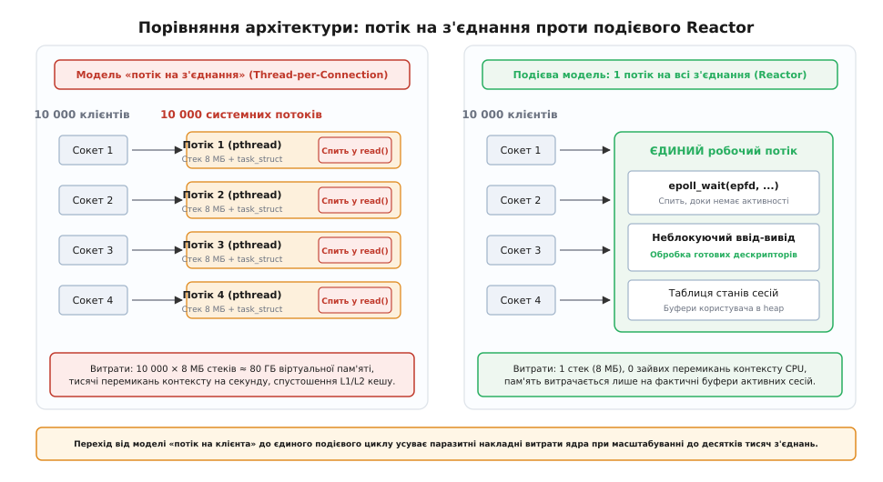
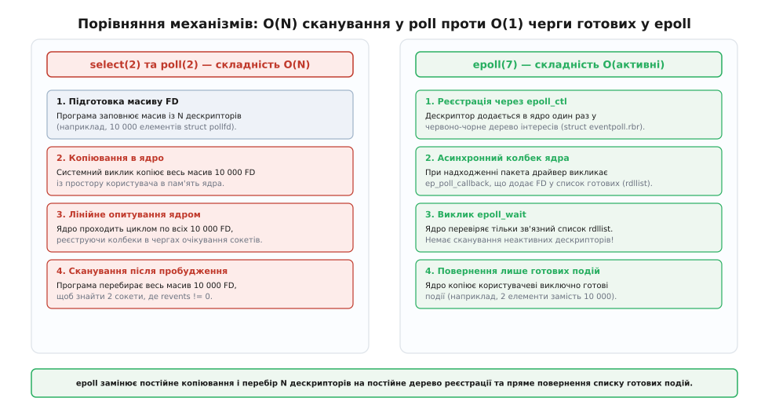
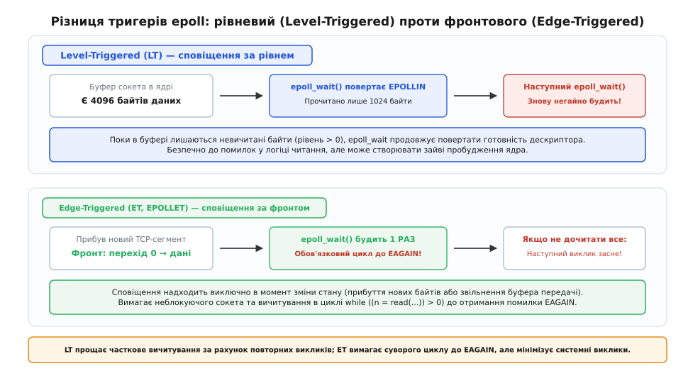
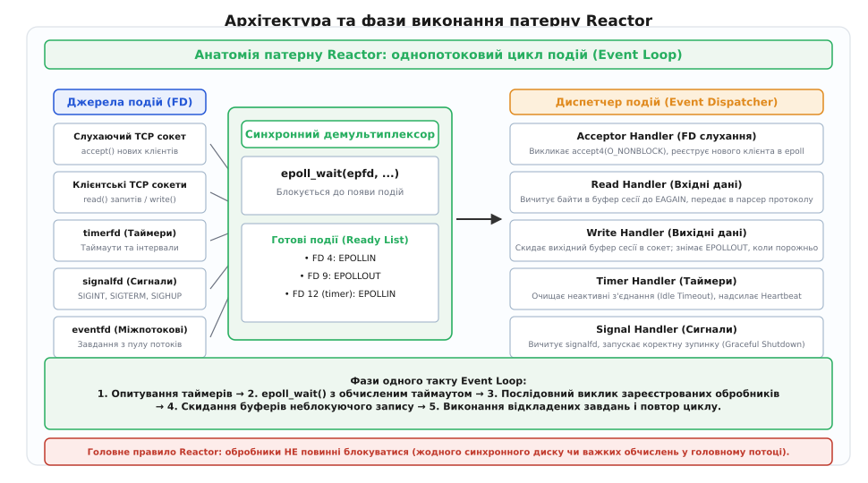

# Один потік на багато з'єднань

<preknowlist>
- [Блокуючий і неблокуючий режим](topic:sys-unix/blocking-and-nonblocking) — прапорець O_NONBLOCK, помилка EAGAIN та повернення керування без очікування.
- [Готовність проти завершення](topic:sys-unix/readiness-vs-completion) — різниця між сповіщенням про готовність дескриптора та асинхронним виконанням операції ядром.
- [select, poll, epoll](topic:sys-unix/select-poll-epoll) — еволюція системних викликів мультиплексування дескрипторів у ядрі Unix.
- [Файловий дескриптор](topic:sys-unix/file-descriptor) — мале невід'ємне ціле число як індекс у таблиці відкритих файлів процесу.
- [Сокет як дескриптор](topic:sys-unix/socket-as-descriptor) — мережеве з'єднання в просторі користувача, представлене дескриптором VFS.
</preknowlist>

Мережевий сервер під керуванням Linux отримує 10 000 одночасних підключень від клієнтських застосунків. Переважна більшість цих з'єднань перебуває у стані спокою: це постійні HTTP/2 або WebSocket сесії, де клієнт надіслав запит кілька секунд тому і тепер очікує дій користувача. За будь-яку окремо взяту мілісекунду нові байти даних надходять лише у 5–10 сокетів із десяти тисяч.

Якщо операційна система намагається виділити під кожне клієнтське з'єднання окремий системний потік виконання (модель Thread-per-Connection), сервер миттєво вичерпує оперативну пам'ять і впадає у параліч планувальника. Замість корисної обробки мережевих пакетів процесорні ядра витрачають майже всі такти на перемикання контексту між тисячами сплячих задач. Розв'язання цієї проблеми полягає в інверсії контролю: **один системний потік бере на себе обслуговування всіх 10 000 з'єднань**, спираючись на неблокуючий ввід-вивід та асинхронне мультиплексування готовності дескрипторів ядра.

Історичний шлях виникнення цієї проблеми та її вплив на появу серверів Nginx, Node.js та Redis детально викладено в історичній довідці: [Від кризи C10K до подієвої революції серверів](topic:unix/one-thread-many-connections/hist-c10k-problem.md).


*Порівняння архітектур: модель виділеного потоку на клієнта витрачає гігабайти пам'яті на стеки та паралізує планувальник, тоді як подієвий Reactor обробляє тисячі з'єднань в одному потоці без накладних витрат.*

## Фізичні межі багатопотокової моделі: чому падали сервери 1990-х

Щоб зрозуміти, чому модель «один потік на клієнта» зазнає колапсу при масштабуванні, розрахуймо точну ціну, яку операційна система сплачує за кожен створений потік виконання (`pthread` у Linux):

### 1. Витрати адресного простору та фізичної пам'яті

Кожен системний потік вимагає власного ізольованого стека викликів для збереження локальних змінних, адрес повернення з функцій та кадрів активації. За замовчуванням бібліотека `glibc` виділяє під стек одного потоку від 2 до 8 МБ віртуальної пам'яті:

```
10 000 потоків × 8 МБ = 80 000 МБ ≈ 78.1 ГБ віртуальної пам'яті
```

У 32-розрядних архітектурах адресний простір процесу взагалі був обмежений 3 або 4 ГБ, що робило створення навіть 500 потоків фізично неможливим. На сучасних 64-розрядних системах віртуального простору вистачає, проте кожен потік вимагає виділення структур ядра:
* Структури `struct task_struct` (близько 8 КБ пам'яті ядра);
* Стека ядра `thread_info` (16 КБ пам'яті ядра на кожну задачу);
* Таблиць сторінок віртуальної пам'яті (Page Tables) для відображення адрес стека.

Навіть якщо 99% із 10 000 потоків не виконують жодної корисної роботи й сплять у виклику `read()`, операційна система витрачає гігабайти дорогоцінної фізичної оперативної пам'яті лише на утримання їхніх дескрипторів і стеків.

### 2. Деградація планувальника ядра (Scheduler Thrashing)

Одиницею планування для ядра Linux є потік (`task_struct`). Планувальник CFS (Completely Fair Scheduler) або EEVDF (Earliest Eligible Virtual Deadline First) організовує черги виконання у вигляді червоно-чорних дерев або черг пріоритетів.

Коли мережева карта генерує апаратне переривання про надходження пакета, ядро визначає цільовий сокет, будить прив'язаний до нього потік і переводить його зі стану сну `TASK_INTERRUPTIBLE` у чергу виконання `TASK_RUNNING`. Якщо в системі одночасно прокидаються тисячі потоків, планувальник починає неперервно перемикати контекст процесора:
1. Збереження регістрів загального призначення, покажчика стека `RSP` та регістра інструкцій `RIP` попереднього потоку;
2. Зміна таблиць сторінок віртуальної пам'яті через запис у регістр `CR3` (якщо перемикання відбувається між різними процесами);
3. Інвалідація буфера асоціативної трансляції адрес (TLB — Translation Lookaside Buffer);
4. Завантаження регістрів нового потоку та передача керування.

Одне апаратне перемикання контексту займає від 1.5 до 3 мікросекунд (близько 3000–6000 тактів CPU). Якщо в системі відбувається 100 000 перемикань контексту на секунду, процесорні ядра витрачають понад 30% своєї сумарної потужності на обслуговування власної бюрократії, не виконуючи жодної інструкції прикладного коду.

### 3. Спустошення кешів процесора (Cache Thrashing)

Сучасні процесори досягають гігагерцових швидкостей лише завдяки багаторівневому кешуванню: надшвидким кешам L1 (32–64 КБ на ядро, час доступу ~1 нс) та L2 (512 КБ – 1 МБ, час доступу ~3–4 нс).

Коли один потік обробляє запити тривалий час, його робочі дані (буфери запиту, таблиці сесій, змінні) залишаються гарячими в кеші L1/L2. Якщо ж ядро змушене щомиті перемикатися між 10 000 різними потоками, кожен новий потік повністю вимиває кеш попереднього своїм стеком. Процесор постійно стикається з промахами кешу (L1/L2 Cache Misses) і зависає в очікуванні повільної основної пам'яті DRAM (час доступу ~50–80 нс).

## Фундамент неблокуючого вводу-виводу: прапорець `O_NONBLOCK`

Щоб звільнити системний потік від необхідності «сидіти й чекати» на кожному сокеті, операційна система надає механізм неблокуючого режиму (англ. *non-blocking I/O*).

За замовчуванням будь-який сокет, створений системним викликом `socket()` або отриманий через `accept()`, є **блокуючим**. Якщо програма викликає `read(fd, buf, len)` на блокуючому сокеті, а буфер прийому ядра порожній, потік негайно зупиняється ядром, знімається з виконання і переводиться в стан сну до прибуття мережевого пакета.

Переведення дескриптора в неблокуючий режим здійснюється встановленням прапорця `O_NONBLOCK` через системний виклик `fcntl()`:

:::tabs
```c
int flags = fcntl(fd, F_GETFL, 0);
if (flags != -1) {
    fcntl(fd, F_SETFL, flags | O_NONBLOCK);
}
```
```cpp
int flags = ::fcntl(fd, F_GETFL, 0);
if (flags != -1) {
    ::fcntl(fd, F_SETFL, flags | O_NONBLOCK);
}
```
:::

Або атомарно під час створення з'єднання за допомогою системного виклику `accept4()`:

:::tabs
```c
int client_fd = accept4(listen_fd, (struct sockaddr *)&addr, &len, SOCK_NONBLOCK | SOCK_CLOEXEC);
```
```cpp
int client_fd = ::accept4(listen_fd, reinterpret_cast<sockaddr*>(&addr), &len, SOCK_NONBLOCK | SOCK_CLOEXEC);
```
:::

### Семантика неблокуючих викликів:

1. **Читання (`read` / `recv`):**
   * Якщо в буфері прийому сокета є хоча б один байт, виклик негайно копіює доступні дані в буфер користувача та повертає кількість реально прочитаних байтів (від `1` до `len`);
   * Якщо буфер прийому сокета **порожній**, виклик **не блокує потік**, а негайно повертає значення `-1`, встановлюючи системну змінну `errno` у значення `EAGAIN` або `EWOULDBLOCK` (у Linux це синоніми з однаковим числовим кодом 11);
   * Якщо віддалений вузол закрив з'єднання (TCP FIN), виклик повертає `0` (ознака кінця файлу EOF).
2. **Запис (`write` / `send`):**
   * Якщо в буфері передачі сокета ядра є вільне місце, виклик копіює туди стільки байтів, скільки поміщається, і повертає записану кількість;
   * Якщо буфер передачі сокета **повністю заповнений** (наприклад, повільний клієнт не встигає забирати дані через вузький канал або переповнене вікно ковзання TCP), виклик негайно повертає `-1` з помилкою `EAGAIN`.

### Пастка активного опитування (Busy Waiting)

Отримавши неблокуючий ввід-вивід, недосвідчений розробник може спробувати організувати обслуговування масиву дескрипторів у простому нескінченному циклі:

:::tabs
```c
/* НАЇВНИЙ АНТИПАТЕРН: активне опитування в циклі (Busy Polling) */
while (running) {
    for (int i = 0; i < num_clients; ++i) {
        ssize_t n = read(client_fds[i], buf, sizeof(buf));
        if (n > 0) {
            handle_data(client_fds[i], buf, n);
        } else if (n == -1 && (errno == EAGAIN || errno == EWOULDBLOCK)) {
            continue; /* Даних немає — переходимо до наступного */
        }
    }
}
```
```cpp
// НАЇВНИЙ АНТИПАТЕРН: активне опитування в циклі (Busy Polling)
while (running) {
    for (int fd : client_fds) {
        ssize_t n = ::read(fd, buf.data(), buf.size());
        if (n > 0) {
            handle_data(fd, std::span(buf.data(), static_cast<size_t>(n)));
        } else if (n == -1 && (errno == EAGAIN || errno == EWOULDBLOCK)) {
            continue; // Даних немає — переходимо до наступного
        }
    }
}
```
:::

Цей підхід перетворює процесор на електричний обігрівач. Якщо всі 10 000 клієнтів мовчать, єдиний потік виконуватиме мільйони порожніх системних викликів `read()` на секунду, завантажуючи ядро процесора на 100% і марнуючи гігавати енергії на постійний перехід межі простору користувача та ядра. Навіть найшвидший системний виклик у Linux коштує від 50 до 100 наносекунд; помножте це на 10 000 сокетів — і повний прохід порожнього масиву триватиме близько 1 мілісекунди, спалюючи процесорні ресурси вщент.

Програмі потрібен механізм, який дозволить потоку **чесно спати**, коли активності немає, але прокидатися миттєво, коли ядро зафіксує прибуття даних на будь-якому з дескрипторів. Цей механізм називається **синхронним мультиплексуванням вводу-виводу**.

## Еволюція мультиплексування: від O(N) у select/poll до O(1) у epoll

Мультиплексування (лат. *multiplex* — «многократний, складний») у системному програмуванні — це метод об'єднання кількох потоків даних або сигналів в один спільний канал керування. В операційних системах Unix розвиток засобів очікування пройшов три ключові етапи.


*Еволюція мультиплексування: виклики select/poll змушують ядро щоразу сканувати повний список дескрипторів, тоді як epoll зберігає дерево інтересів у ядрі та повертає лише активні події.*

### 1. `select(2)` — бітові маски та ліміт 1024 дескриптори

Системний виклик `select()` приймає три бітові маски типу `fd_set` (на читання, запис та помилки). Кожен біт у масці відповідає номеру файлового дескриптора.

Механічні обмеження `select`:
* **Жорсткий ліміт розміру:** Розмір структури `fd_set` жорстко зафіксований константою компілятора `FD_SETSIZE` (зазвичай 1024 біти). Якщо ваш сервер відкрив 2000 файлів, і черговий клієнт отримав дескриптор з номером 1025, спроба передати його в макрос `FD_SET(1025, &set)` призведе до перезапису сусідньої пам'яті процесу та непередбачуваного падіння;
* **Знищення масок під час виклику:** Ядро модифікує передані бітові маски на місці, скидаючи в нуль біти тих дескрипторів, які не готові. Тому перед кожним новим викликом `select()` програма змушена заново копіювати й заповнювати всі маски пам'яті;
* **Складність `O(N)`:** Ядро повинно перевірити кожен біт від 0 до максимального `maxfd`, а після повернення програма змушена в циклі від 0 до `maxfd` перевіряти стан кожного біта через `FD_ISSET(i, &set)`.

### 2. `poll(2)` — зняття ліміту, але збереження лінійної складності

Системний виклик `poll()` замінив бітові маски динамічним масивом структур `struct pollfd`:

```c
struct pollfd {
    int   fd;       /* Файловий дескриптор */
    short events;   /* Маска запитаних подій (POLLIN, POLLOUT) */
    short revents;  /* Маска повернених ядром подій */
};
```

Це зняло обмеження на максимальний номер дескриптора (можна передавати масив будь-якого розміру), проте фундаментальна проблема складності `O(N)` залишилася невирішеною:
1. **Копіювання масиву туди й назад:** При кожному виклику `poll(fds, 10000, timeout)` ядро копіює весь масив із 10 000 елементів (близько 80 КБ пам'яті) із простору користувача в пам'ять ядра;
2. **Лінійний прохід ядра:** Ядро послідовно обходить усі 10 000 дескрипторів, викликає їхній метод `file->f_op->poll` та реєструє точку очікування;
3. **Лінійний прохід користувача:** Після пробудження ядро копіює масив назад, а програма змушена виконувати цикл по всіх 10 000 елементах:

:::tabs
```c
for (int i = 0; i < 10000; ++i) {
    if (fds[i].revents & POLLIN) {
        handle_read(fds[i].fd);
    }
}
```
```cpp
for (const auto& pfd : fds) {
    if (pfd.revents & POLLIN) {
        handle_read(pfd.fd);
    }
}
```
:::

Якщо з 10 000 дескрипторів активними є лише 2, ефективність використання процесора становить мізерні 0.02%.

### 3. `epoll(7)` — збереження стану в ядрі та константна складність O(1)

Підсистема `epoll` розв'язала проблему радикально: вона розділила процес мультиплексування на **реєстрацію інтересів** та **отримання готових подій**.

Замість того, щоб щоразу передавати ядру весь список дескрипторів, `epoll` створює в пам'яті ядра довгоживучий об'єкт `struct eventpoll`, який містить дві ключові структури даних:

1. **Червоно-чорне дерево інтересів (`rbr` — Red-Black Tree):**
   Зберігає всі дескриптори, за якими ведеться спостереження. Додавання нового клієнта (`EPOLL_CTL_ADD`), зміна маски подій (`EPOLL_CTL_MOD`) або видалення (`EPOLL_CTL_DEL`) виконуються за логарифмічний час `O(log N)`. Дескриптор додається в ядро **рівно один раз** при підключенні клієнта і залишається там до його відключення.
2. **Двозв'язний список готових подій (`rdllist` — Ready Double-Linked List):**
   Містить покажчики лише на ті дескриптори, які **вже готові** до операцій вводу-виводу.

```
       ПРОСТІР КОРИСТУВАЧА                         ПРОСТІР ЯДРА (struct eventpoll)
   ┌────────────────────────┐                   ┌────────────────────────────────────┐
   │ epoll_ctl(EPOLL_CTL_ADD) ───────────────> │  Червоно-чорне дерево інтересів    │
   │                        │                   │        (rbtree, O(log N))          │
   │                        │                   │         [FD 3]                     │
   │                        │                   │        /      \                    │
   │                        │                   │     [FD 4]   [FD 5] ... [FD 10000] │
   │                        │                   └──────────────────┬─────────────────┘
   │                        │                                      │ Подія драйвера
   │                        │                                      │ (ep_poll_callback)
   │                        │                                      ▼
   │ epoll_wait(events, 64) │                   ┌────────────────────────────────────┐
   │                        │ <──────────────── │   Список готових подій (rdllist)   │
   │  Отримує лише 2 готові │   Копіювання      │       [FD 4: IN] <-> [FD 9: OUT]   │
   │  події замість 10 000! │   O(активні)      └────────────────────────────────────┘
   └────────────────────────┘
```

Як це працює механічно в ядрі Linux:
1. Коли мережева карта приймає TCP-пакет, контролер генерує апаратне переривання, а мережевий стек ядра поміщає байти в чергу сокета `sk->sk_receive_queue`;
2. Ядро викликає зареєстровану функцію зворотного виклику `ep_poll_callback()`;
3. Ця функція миттєво додає відповідний елемент `struct epitem` у зв'язний список готових `rdllist` екземпляра `eventpoll` і будить робочий потік сервера, що спав у черзі `epoll_wait()`;
4. Системний виклик `epoll_wait()` просто копіює елементи зі списку `rdllist` у переданий масив простору користувача.

Складність системного виклику `epoll_wait()` становить **`O(активні)`**, де активні — це кількість реально готових дескрипторів у цей момент часу, і **повністю не залежить від загальної кількості підключених клієнтів `N`**.

Повний опис контрактів системних викликів, бітових прапорців, кодів помилок та внутрішніх структур наведено у довіднику: [Інтерфейс системних викликів epoll у ядрі Linux](topic:unix/one-thread-many-connections/api-epoll-system-calls.md).

## Рівневий тригер (Level-Triggered) проти фронтового тригера (Edge-Triggered)

Підсистема `epoll` підтримує два принципово різні режими сповіщення про події, запозичені з теорії цифрової мікроелектроніки: сповіщення за рівнем сигналу (Level-Triggered, LT) та сповіщення за фронтом/перепадом сигналу (Edge-Triggered, ET).


*Рівневий режим повторно сигналізує про готовність, поки буфер не порожній; фронтовий режим будить один раз при зміні стану і вимагає читання в циклі до EAGAIN.*

### 1. Level-Triggered (LT) — поведінка за замовчуванням

У рівневому режимі системний виклик `epoll_wait()` повертатиме дескриптор як готовий **доти, доки стан готовності залишається істинним** (тобто поки в буфері прийому залишається хоча б один незчитаний байт, або в буфері передачі є вільне місце).

**Приклад сценарію LT:**
1. У буфер сокета прибуло 4096 байтів;
2. `epoll_wait()` прокидається і повертає подію `EPOLLIN` для цього сокета;
3. Програма зчитує лише 1024 байти за допомогою `read(fd, buf, 1024)`;
4. Програма знову викликає `epoll_wait()`;
5. **Результат:** `epoll_wait()` **негайно прокидається знову**, оскільки в буфері сокета все ще залишається 3072 байти.

*Переваги LT:* Простота та стійкість до помилок у прикладній логіці. Якщо програма вичитала не всі дані, вона отримає сповіщення на наступній ітерації циклу. Можна безпечно використовувати як блокуючі, так і неблокуючі сокети.

*Недоліки LT:* Можлива надлишкова кількість системних викликів ядра, якщо дані споживаються дрібними порціями.

### 2. Edge-Triggered (ET) — сповіщення за фронтом (`EPOLLET`)

У фронтовому режимі (вмикається прапорцем `EPOLLET` у структурі `epoll_event`) ядро надсилає сповіщення **виключно в момент переходу з неактивного стану в активний** (тобто коли буфер прийому був порожнім і туди прибули нові байти).

**Приклад сценарію ET:**
1. У буфер сокета прибуло 4096 байтів (перепад з 0 на 4096);
2. `epoll_wait()` прокидається і повертає подію `EPOLLIN | EPOLLET`;
3. Програма робить помилку і зчитує лише 1024 байти;
4. Програма знову викликає `epoll_wait()`;
5. **Результат:** `epoll_wait()` **засинає і НЕ прокидається**, незважаючи на те, що в буфері лежить 3072 байти! Наступне сповіщення надійде лише тоді, коли віддалений клієнт надішле **новий** TCP-пакет, який спричинить новий фронт сигналу. Якщо клієнт очікує відповіді на надісланий запит і більше нічого не надсилає, виникає стан взаємного блокування (Deadlock), і з'єднання зависає назавжди.

### Залізні правила роботи з Edge-Triggered (`EPOLLET`):

1. **Тільки неблокуючий режим:** Дескриптор **обов'язково** повинен мати прапорець `O_NONBLOCK`. Якщо викликати блокуючий `read()` у циклі ET, останній виклик заблокує весь робочий потік;
2. **Вичитування до `EAGAIN`:** Читання даних після отримання події завжди повинно виконуватися у суворому циклі до моменту, поки системний виклик не поверне `-1` з `errno == EAGAIN`:

:::tabs
```c
while (1) {
    ssize_t count = read(fd, buf, sizeof(buf));
    if (count > 0) {
        process_data(buf, count);
    } else if (count == -1) {
        if (errno == EAGAIN || errno == EWOULDBLOCK) {
            break; /* Усі наявні дані вичитано повністю! */
        }
        handle_error(fd);
        break;
    } else if (count == 0) {
        close_connection(fd); /* Клієнт закрив з'єднання */
        break;
    }
}
```
```cpp
while (true) {
    ssize_t count = ::read(fd, buf.data(), buf.size());
    if (count > 0) {
        process_data(std::span(buf.data(), static_cast<size_t>(count)));
    } else if (count == -1) {
        if (errno == EAGAIN || errno == EWOULDBLOCK) {
            break; // Усі наявні дані вичитано повністю!
        }
        handle_error(fd);
        break;
    } else if (count == 0) {
        close_connection(fd); // Клієнт закрив з'єднання
        break;
    }
}
```
:::

3. **Запобігання голодуванню (Starvation):** Якщо один «жадібний» клієнт неперервно шле велетенський потік даних на гігабітній швидкості, цикл `while` читання до `EAGAIN` може монополізувати потік сервера на кілька секунд, блокуючи обслуговування інших 9999 клієнтів. Промислові сервери обмежують кількість зчитаних байтів за одну ітерацію (наприклад, не більше 64 КБ), після чого переносять дескриптор у кінець черги обробки.

### 3. Спеціальні прапорці масштабування: `EPOLLONESHOT` та `EPOLLEXCLUSIVE`

* **`EPOLLONESHOT` для пулів робочих потоків:**
  Якщо з одним екземпляром `epoll` працює кілька потоків одночасно, може виникнути гонитва: потік A отримав подію на сокеті 4 і почав читати дані. У цей момент надходить новий пакет, і потік B також прокидається по сокету 4. Два потоки почнуть одночасно читати з одного дескриптора, руйнуючи послідовність байтів протоколу. Прапорець `EPOLLONESHOT` змушує ядро деактивувати спостереження за сокетом після першого ж спрацьовування. Після завершення обробки потік A заново активує сокет через `epoll_ctl(epfd, EPOLL_CTL_MOD, fd, &ev)`.
* **`EPOLLEXCLUSIVE` проти проблеми «здичавілого стада» (Thundering Herd):**
  Коли кілька незалежних процесів (наприклад, робочі процеси Nginx) слухають один і той самий порт через спільний дескриптор, надходження одного нового клієнта раніше будило **всі** процеси одночасно. Один процес успішно викликав `accept()`, а решта отримували `EAGAIN`, марнуючи процесорний час. Прапорець `EPOLLEXCLUSIVE` (доступний з Linux 4.5) гарантує, що ядро розбудить **лише один** процес зі списку очікування.

## Архітектура патерну Reactor: однопотоковий цикл подій (Event Loop)

Патерн Reactor (описаний Дугласом Шмідтом у 1995 році) формалізує побудову сервісів на основі демультиплексування подій.


*Анатомія патерну Reactor: синхронний демультиплексор epoll приймає події від сокетів, таймерів і сигналів та передає їх зареєстрованим функціям-обробникам.*

Архітектура Reactor складається з трьох ключових компонентів:

1. **Синхронний демультиплексор подій (Synchronous Event Demultiplexer):**
   Системний виклик `epoll_wait()`. Він централізує очікування на всіх дескрипторах у системі;
2. **Диспетчер подій (Event Dispatcher):**
   Керує таблицею реєстрації обробників (`Handler Table`). Отримавши від демультиплексора масив готових подій, диспетчер за номером дескриптора або покажчиком `event.data.ptr` знаходить потрібний об'єкт сесії та викликає відповідний метод;
3. **Обробники подій (Event Handlers):**
   Прикладні функції:
   * **Acceptor Handler** — викликає `accept4()` на слухаючому сокеті, створює структуру клієнтської сесії та реєструє новий дескриптор в `epoll`;
   * **Read Handler** — вичитує байти з сокета в буфер прийому, викликає парсер протоколу та формує відповідь;
   * **Write Handler** — скидає накопичені байти з вихідного буфера в сокет;
   * **Timer Handler** — скидає з'єднання за таймаутом неактивності.

Повну працюючу реалізацію такого сервера з обробкою всіх граничних випадків мовами C та C++ розібрано у практичному проєкті: [Реалізація патерну Reactor: подієвий TCP-сервер на epoll](topic:unix/one-thread-many-connections/proj-reactor-event-loop.md).

## Асиметрія неблокуючого запису: чому писати важче, ніж читати

У подієвих серверах операція читання є пасивною: програма просто реєструє інтерес `EPOLLIN` і чекає сповіщення. Операція неблокуючого запису влаштована набагато складніше через асиметрію поведінки мережевого буфера відправки TCP.

Буфер відправки сокета в ядрі (`sk->sk_sndbuf`, зазвичай від 16 до 128 КБ) **майже завжди має вільне місце**. Якщо підписати сокет на подію `EPOLLOUT` на постійній основі, виклик `epoll_wait()` повертатиме готовність дескриптора на кожній ітерації циклу, спричиняючи холосте 100% завантаження CPU (Busy Loop).

Тому неблокуючий запис у патерні Reactor проектують за суворим двофазним алгоритмом:

```
[Потрібно надіслати байти клієнту]
              │
              ▼
    Спроба прямого write(fd, data, len)
              │
    ┌─────────┴────────────────────────┐
    │                                  │
Успішно надіслано ВСЕ           Надіслано ЧАСТКОВО або повернуто EAGAIN
(n == len)                             │
    │                                  ▼
Завершено.                     1. Зберегти залишок даних у вихідний буфер сесії (Heap);
Жодних дій з epoll.            2. Додати прапорець EPOLLOUT в epoll_ctl(EPOLL_CTL_MOD);
                                       │
                                       ▼
                               [Очікування події EPOLLOUT від epoll_wait]
                                       │
                                       ▼
                               Виклик write() із вихідного буфера сесії
                                       │
                             ┌─────────┴────────────────────────┐
                             │                                  │
                     Буфер спорожнів повністю            Буфер все ще має дані
                             │                                  │
                             ▼                                  ▼
                     1. Зняти прапорець EPOLLOUT        Залишити EPOLLOUT активним
                        в epoll_ctl(EPOLL_CTL_MOD);     до наступного сповіщення.
                     2. Залишити лише EPOLLIN.
```

Цей механізм гарантує, що прапорець `EPOLLOUT` активується **лише тоді, коли сервер реально має ненадіслані дані, які не помістилися в сокет з першої спроби**, і миттєво знімається, щойно черга відправки спорожніла.

### Потокова природа TCP та протокольні автомати (FSM)

Мережевий протокол TCP не має поняття меж повідомлень або кадрів: він передає неперервний потік байтів. Якщо клієнт надсилає запит розміром 256 байтів, виклик `read()` на стороні сервера під час першого сповіщення `EPOLLIN` може повернути 100 байтів, а решту 156 байтів доставити лише під час наступного такту подієвого циклу.

Спроба розібрати неповний запит «на льоту» без буферизації призводить до помилок парсингу. Тому в архітектурі Reactor кожна клієнтська сесія обов'язково містить два виділені буфери у просторі користувача:
1. **Вхідний буфер накопичення (Input Buffer):** Байти вичитуються з дескриптора сокета і дописуються в кінець вхідного буфера. Парсер протоколу перевіряє наявність повного кадру (наприклад, символів закінчення HTTP-заголовків `\r\n\r\n` або байтів довжини бінарного заголовка). Лише коли повний кадр зібрано, байти передаються логіці обробки, а розібрана частина видаляється з початку буфера;
2. **Вихідний буфер черги (Output Buffer):** Коли формується відповідь, вона спочатку записується у вихідний буфер або передається у функцію неблокуючого скидання.

### Керування пам'яттю: Slab-алокатори та уникнення фрагментації

Якщо сервер утримує 100 000 одночасних підключень, і під кожне з'єднання наївно виділяти динамічні буфери через `malloc(64 * 1024)`, застосунок виділить понад 6 ГБ оперативної пам'яті, більшість з якої простоюватиме. Крім того, часте виділення та звільнення буферів різного розміру спричиняє сильну фрагментацію купи (Heap Fragmentation) та деградацію стандартного алокатора пам'яті `glibc ptmalloc`.

Високопродуктивні сервери (наприклад, Nginx або Envoy) вирішують це за допомогою спеціалізованих стратегій керування пам'яттю:
* **Пули попередньо виділених блоків (Slab / Arena Allocators):** Пам'ять для сесій виділяється великими неперервними сторінками ядра (наприклад, блоками по 2 МБ Huge Pages) і нарізається на фіксовані слоти без звернення до загального системного алокатора;
* **Буферизовані кільця (Ring Buffers):** Замість зсуву пам'яті через `memmove()` після кожного часткового читання або запису, вхідні та вихідні дані зберігаються у кільцевому масиві з покажчиками голови `head` та хвоста `tail`. Зсув позиції зводиться до швидкої арифметики за модулем розміру буфера;
* **Векторний ввід-вивід (`readv` / `writev`):** Дозволяє зчитувати або відправляти дані з кількох розрізнених буферів пам'яті користувача за один системний виклик (Scatter-Gather I/O), уникаючи проміжного копіювання байтів у єдиний буфер.

## Об'єднання гетерогенних подій: таймери, сигнали та канали в одному epoll

Однією з найбільших переваг архітектури Unix є концепція уніфікованого дескриптора. Завдяки розширенням ядра Linux сучасний подієвий сервер може обробляти **всі типи асинхронних подій в одному єдиному циклі `epoll_wait()`**, уникаючи використання сигнальних обробників та сторонніх допоміжних потоків:

### 1. Таймери через `timerfd_create(2)`

Замість використання застарілих інтервальних таймерів POSIX (`setitimer`, `SIGALRM`), які генерують асинхронні сигнали, системний виклик `timerfd_create()` створює звичайний файловий дескриптор, прив'язаний до таймера ядра:

:::tabs
```c
int tfd = timerfd_create(CLOCK_MONOTONIC, TFD_NONBLOCK | TFD_CLOEXEC);
struct itimerspec ts;
memset(&ts, 0, sizeof(ts));
ts.it_interval.tv_sec = 5; /* Період: кожні 5 секунд */
ts.it_value.tv_sec = 5;    /* Перше спрацьовування */
timerfd_settime(tfd, 0, &ts, NULL);
```
```cpp
int tfd = ::timerfd_create(CLOCK_MONOTONIC, TFD_NONBLOCK | TFD_CLOEXEC);
itimerspec ts{};
ts.it_interval.tv_sec = 5; // Період: кожні 5 секунд
ts.it_value.tv_sec = 5;    // Перше спрацьовування
::timerfd_settime(tfd, 0, &ts, nullptr);
```
:::

Дескриптор `tfd` реєструється в `epoll` із прапорцем `EPOLLIN`. Коли інтервал спливає, дескриптор стає готовим для читання. Програма викликає `read(tfd, &expirations, sizeof(uint64_t))` і виконує періодичну роботу (наприклад, перевірку таймаутів неактивних сесій або надсилання пінгів Keep-Alive).

### 2. Сигнали процесу через `signalfd(2)`

Класичні обробники сигналів Unix (`sigaction`) виконуються асинхронно поверх стека потоку, перериваючи виконання програми в довільному місці. Усередині обробника сигналу суворо заборонено викликати більшість функцій стандартної бібліотеки (зокрема `malloc`, `free`, `printf`, `pthread_mutex_lock`), оскільки вони не є асинхронно-сигнально-безпечними (Async-Signal-Safe).

Системний виклик `signalfd()` перетворює надходження сигналів на звичайний потік структурованих повідомлень:

:::tabs
```c
sigset_t mask;
sigemptyset(&mask);
sigaddset(&mask, SIGINT);
sigaddset(&mask, SIGTERM);
sigprocmask(SIG_BLOCK, &mask, NULL); /* Блокуємо стандартну доставку сигналів */

int sfd = signalfd(-1, &mask, SFD_NONBLOCK | SFD_CLOEXEC);
/* Реєструємо sfd в epoll з прапорцем EPOLLIN */
```
```cpp
sigset_t mask;
sigemptyset(&mask);
sigaddset(&mask, SIGINT);
sigaddset(&mask, SIGTERM);
::sigprocmask(SIG_BLOCK, &mask, nullptr); // Блокуємо стандартну доставку сигналів

int sfd = ::signalfd(-1, &mask, SFD_NONBLOCK | SFD_CLOEXEC);
// Реєструємо sfd в epoll з прапорцем EPOLLIN
```
:::

Коли користувач натискає `Ctrl+C` (`SIGINT`) або система надсилає команду зупинки `systemd` (`SIGTERM`), дескриптор `sfd` стає готовим до читання. Сервер зчитує структуру `struct signalfd_siginfo` безпосередньо в головному циклі подій і запускає коректну зупинку (Graceful Shutdown) зі збереженням стану та закриттям активних з'єднань, без ризику виникнення стану гонитви.

### 3. Міжпотокові сповіщення через `eventfd(2)`

Системний виклик `eventfd()` створює 64-розрядний лічильник у пам'яті ядра. Будь-який фоновий робочий потік може виконати `write(efd, &val, 8)`, що миттєво переводить дескриптор у стан готовності для читання і будить головний цикл `epoll_wait()`. Це дозволяє передавати результати важких обчислень із фонових пулів потоків у головний подієвий цикл із мінімальними накладними витратами.

## Межі однопотокового Reactor: коли один потік зупиняє все

Подієва модель на основі одного потоку є надзвичайно швидкою та ефективною, проте вона має фундаментальне вразливе місце: **будь-яка блокуюча операція всередині обробника події повністю паралізує обслуговування всіх інших клієнтів**.

Якщо сервер утримує 10 000 з'єднань, і під час обробки запиту клієнта №42 програма викликає функцію, що виконує важкий криптографічний розрахунок на 200 мілісекунд або звертається до повільного дискового накопичувача:
* Головний потік зависає всередині цієї функції;
* Виклик `epoll_wait()` не виконується;
* Решта 9999 клієнтів не отримують відповідей і накопичуються в мережевих чергах ядра, а час затримки (latency) системи зростає до неприйнятних значень.

### Джерела блокувань та методи їх нейтралізації:

1. **Дисковий ввід-вивід:**
   У Linux звичайні виклики `read()` та `write()` на файлах файлових систем (Ext4, XFS, Btrfs) **завжди є блокуючими**, навіть якщо файл відкрито з прапорцем `O_NONBLOCK`. Якщо потрібної сторінки немає в кеші сторінок ядра (Page Cache), потік засинає в очікуванні відповіді контролера накопичувача.
   * *Розв'язок:* Винесення дискових операцій у фоновий пул потоків (Thread Pool) або використання підсистеми асинхронного вводу-виводу `io_uring`.
2. **Важкі обчислення (CPU-bound tasks):**
   Стиснення даних (gzip/brotli), парсинг великих JSON/XML документів або перевірка цифрових підписів.
   * *Розв'язок:* Головний потік приймає байти, формує завдання і скидає його в чергу пулу робочих потоків (Worker Pool), а результат повертається через `eventfd`.

### Масштабування на багатоядерні системи: архітектура Multi-Reactor

Щоб утилізувати всі ядра сучасних процесорів (наприклад, 64 або 128 ядер), подієву модель масштабують за двома основними схемами:

1. **Один цикл подій на кожне ядро (One Loop per Core, або Multi-Reactor):**
   Сервер запускає `M` незалежних робочих потоків (або процесів), де `M` дорівнює кількості процесорних ядер. Кожен потік крутить власний ізольований екземпляр `epoll`.
2. **Розподіл з'єднань через `SO_REUSEPORT`:**
   Починаючи з Linux 3.9, кілька незалежних сокетів можуть бути прив'язані до одного й того самого IP-порту за допомогою прапорця `setsockopt(fd, SOL_SOCKET, SO_REUSEPORT, &opt, sizeof(opt))`. Ядро самостійно хешує кортеж клієнта `(src_ip, src_port, dst_ip, dst_port)` і рівномірно розподіляє нові підключення між екземплярами `epoll` різних робочих потоків на рівні мережевого стека, забезпечуючи ідеальне лінійне масштабування без міжпотокових блокувань.

## Підсумкова порівняльна модель

| Параметр порівняння | Модель «Потік на клієнта» (Thread-per-Connection) | Мультиплексування poll() (O(N)) | Однопотоковий Reactor на epoll (O(1)) |
| :--- | :--- | :--- | :--- |
| **Складність виклику** | `O(1)` на блокуючому потоці | `O(N)` (повне лінійне сканування) | `O(активні)` (лише готові події) |
| **Споживання RAM на 10K сесій** | 20–80 ГБ (стеки задач + ядра) | ~80 КБ на масив struct pollfd | ~1.6 МБ (структури `epitem` у ядрі) |
| **Перемикання контексту CPU** | Сотні тисяч перемикань на секунду | 0 між клієнтами (1 потік) | 0 між клієнтами (1 потік) |
| **Поведінка при простої сесій** | Величезні накладні витрати пам'яті | Високі витрати CPU на опитування | **Нульові накладні витрати CPU та пам'яті** |
| **Складність коду** | Лінійний синхронний код | Цикл опитування масиву | Подієвий автомат (State Machine) |
| **Ліміт одночасних з'єднань** | Сотні – одиниці тисяч | До 10 000 (повільно) | **Мільйони підключень (C1000K)** |
