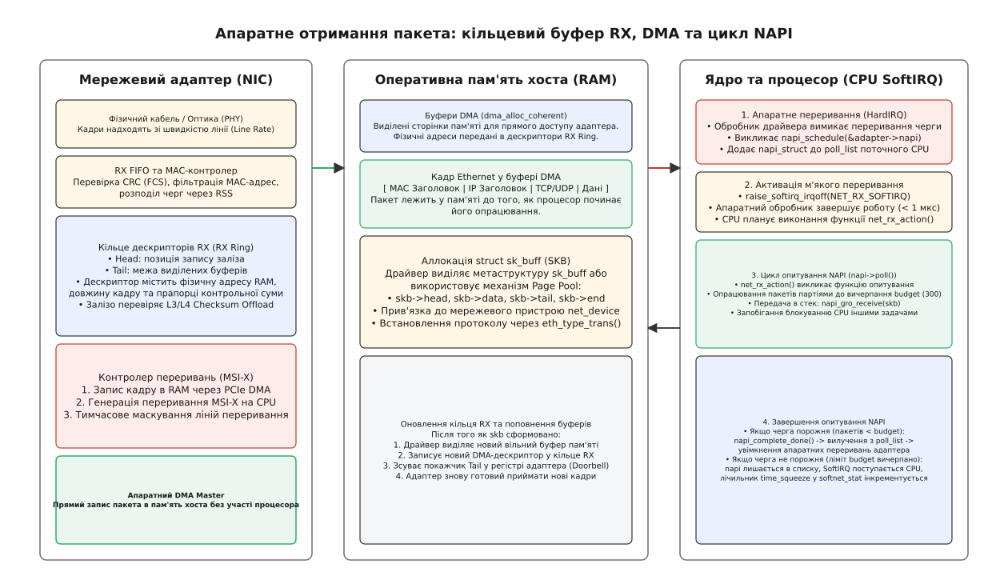
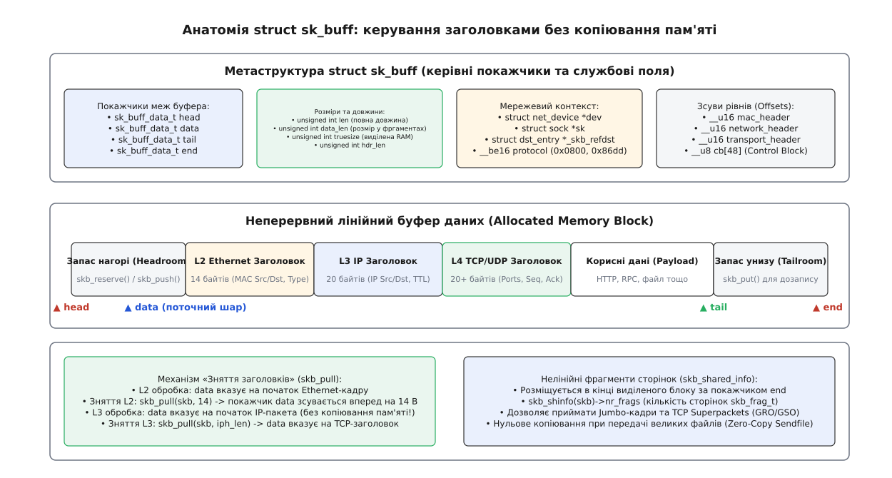
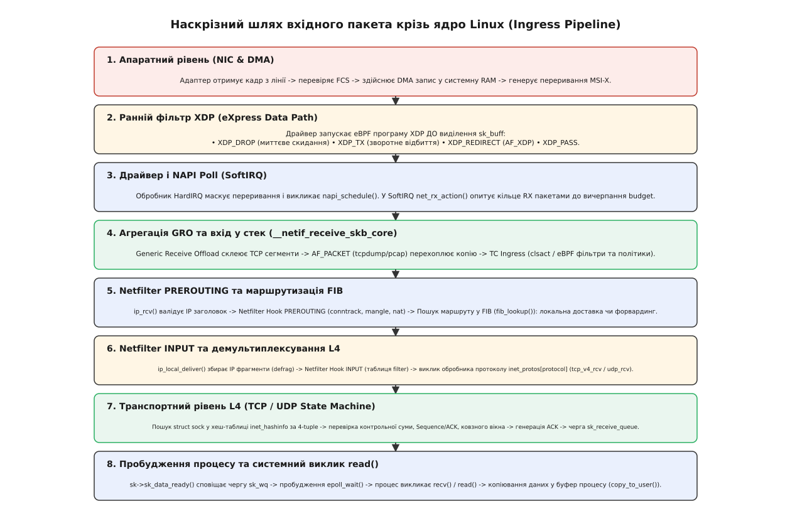
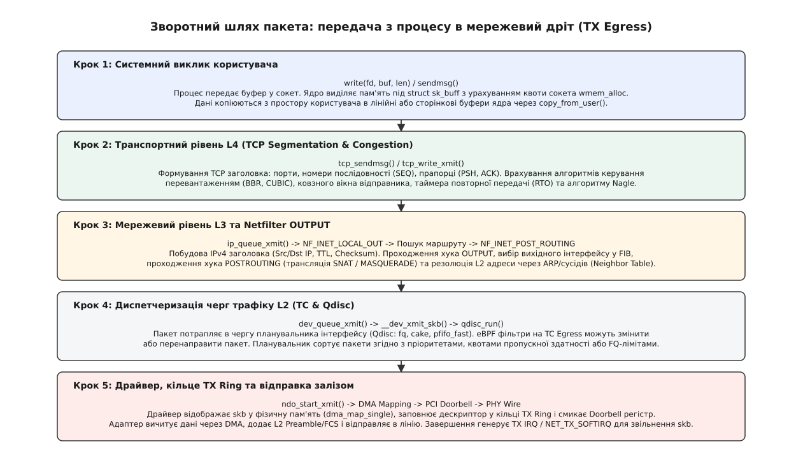

# Шлях пакета крізь Linux

<preknowlist>
- [Мережевий стек у ядрі](book:unix-linux/network-stack) — архітектура рівнів OSI/TCP-IP в операційній системі Linux.
- [Інтерфейси й адреси](book:unix-linux/interfaces-and-addresses) — мережеві адаптери, MAC-адреси, IP-конфігурація та стан лінка.
- [Сокети в Linux](book:unix-linux/socket-api-linux) — дескриптор сокета, буфери передачі та черги прийому.
- [Рішення про маршрут](book:unix-linux/routing-decision) — бази FIB, селекція шлюзу та локальна доставка.
- [netfilter: ланцюги й таблиці](book:unix-linux/netfilter-model) — хуки фільтрації, стан з'єднань conntrack та трансляція NAT.
</preknowlist>

Коли на мережевий адаптер стандарту 10 Gigabit Ethernet надходить потік мінімальних 64-байтних Ethernet-кадрів із граничною швидкістю лінії (*Line Rate*, 14,88 мільйона пакетів щосекунди), центральний процесор сервера має рівно 67,2 наносекунди на опрацювання кожного окремого пакета. Якщо ядро операційної системи реагувало б на кожен такий кадр генерацією класичного апаратного переривання, 14,88 мільйона перемикань контексту за секунду миттєво ввели б процесорні ядра в стан повного колапсу — паралічу перериваннями (*Interrupt Livelock*), за якого 100% часу процесора витрачається на перемикання контексту, а жоден байт корисних даних так і не доходить до застосунку.

Шлях пакета крізь ядро Linux — це детермінований, суворо узгоджений конвеєр взаємодії кремнієвих контролерів, апаратних кілець пам'яті, асинхронних м'яких переривань, фільтрів класифікації та сокетних черг. Розуміння цієї траєкторії дозволяє точно бачити ціну кожного мікросекундного кроку: від появи сигналу на фізичному інтерфейсі до пробудження потоку в системному виклику `epoll_wait()`.

---

### 1. Від фізичного середовища до оперативної пам'яті: NIC, DMA та кільце RX

Життя вхідного пакета починається на фізичному рівні (*PHY*) мережевого контролера (*NIC — Network Interface Controller*). Оптичний трансивер або трансформатор витої пари перетворює фізичні сигнали на бінарну послідовність, яку контролер рівня управління доступом до середовища (*MAC — Media Access Control*) розбирає на байти.

Контролер перевіряє цілісність отриманого кадру за допомогою 32-бітної контрольної суми кадру (*FCS — Frame Check Sequence*). Якщо сума не сходиться (сталася апаратна помилка передачі), кадр негайно знищується в кремнії, а апаратний лічильник `rx_crc_errors` інкрементується. Далі MAC-фільтр перевіряє адресу призначення: якщо це не широкомовний розсип (*broadcast*), не погоджена мультикаст-група і не власна MAC-адреса інтерфейсу (і адаптер не переведено в режим прослуховування *promiscuous mode*), кадр також відкидається.

Кадри, що пройшли первинний контроль, потрапляють у вхідний апаратний буфер FIFO. Проте центральний процесор не зчитує ці дані вручну через повільні регістри вводу-виводу. Замість цього мережева карта записує пакети безпосередньо в оперативну пам'ять хоста за допомогою прямого доступу до пам'яті (*DMA — Direct Memory Access*).


*Механіка апаратного прийому: контролер PHY/MAC, дескриптори RX Ring, прямий доступ DMA до оперативної пам'яті хоста та маскування переривань MSI-X.*

Для здійснення DMA-обміну мережевий драйвер ще під час ініціалізації інтерфейсу виділяє в оперативній пам'яті неперервний кільцевий буфер дескрипторів прийому (*RX Descriptor Ring*). Щоб мінімізувати накладні витрати на доступ до пам'яті в архітектурах NUMA (*Non-Uniform Memory Access*), драйвер виділяє ці сторінки пам'яті на тому ж фізичному вузлі NUMA, до якого прив'язана шина PCIe адаптера (`dma_alloc_coherent_node()`). Кожен дескриптор у цьому кільці містить 64-бітну фізичну адресу заздалегідь виділеної сторінки пам'яті RAM та службові прапорці статусу.

У сучасних багатоядерних контролерах вхідний потік розподіляється між множинними апаратними чергами прийому за допомогою технології **RSS** (*Receive Side Scaling*). Апаратний блок мережевої карти обчислює 32-бітний хеш Toeplitz за заголовками пакета (Source IP, Destination IP, Source Port, Destination Port) і за таблицею індирекції (*Indirection Table*) спрямовує кадр у відповідну чергу RX. Кожна черга RX має власне незалежне кільце дескрипторів та закріплений вектор переривань MSI-X, що дозволяє паралелити обробку сотень тисяч TCP-з'єднань між усіма ядрами процесора без взаємних блокувань.

Механізм прийому кадру працює за строгою послідовністю:

1. Мережевий адаптер зчитує поточний дескриптор за покажчиком `Head` свого внутрішнього регістра.
2. Контролер DMA мережевої карти захоплює шину PCIe і записує вміст Ethernet-кадру безпосередньо за фізичною адресою, вказаною в дескрипторі.
3. Апаратний блок апаратного розвантаження (*Hardware Offload*) мережевої карти самостійно обчислює контрольну суму IP-заголовка та транспортного протоколу (TCP або UDP). Якщо суми коректні, адаптер виставляє біт `CHECKSUM_UNNECESSARY` у дескрипторі, позбавляючи центральний процесор необхідності побайтово обчислювати контрольну суму в пам'яті.
4. Контролер записує довжину отриманого кадру в дескриптор, виставляє прапорець завершення передачі (*Descriptor Done*) і зсуває внутрішній апаратний покажчик `Head` на наступну позицію кільця.
5. Адаптер генерує сигнал апаратного переривання на шині PCIe (зазвичай через механізм векторних переривань MSI-X, прив'язаних до конкретної черги прийому та ядра CPU згідно з налаштуваннями `/proc/irq/<N>/smp_affinity`).

Якщо інтенсивність вхідного потоку перевищує швидкість, з якою драйвер виділяє нові буфери, покажчик `Head` наздоганяє покажчик `Tail`. У кільці не залишається вільних дескрипторів. У цей момент мережева карта змушена скидати наступні вхідні кадри прямо в кремнії, інкрементуючи апаратні лічильники `rx_missed_errors` та `rx_no_buffer_count`, доступні через утиліту `ethtool -S`.

---

### 2. Від апаратного переривання до NAPI: подолання паралічу перериваннями

Коли сигнал MSI-X надходить на призначене ядро процесора, процесор призупиняє виконання поточної задачі та переходить у режим виконання апаратного обробника переривань (*Top Half / HardIRQ*).

Головне завдання первинного обробника — виконати мінімум критичних дій за частки мікросекунди і звільнити лінію переривання. Обробник драйвера:
1. Записує команду в регістр мережевого адаптера, **тимчасово вимикаючи (маскуючи) переривання** для цієї конкретної черги RX. Це гарантує, що наступні пакети, які вже надходять у кільце DMA, не викликатимуть нових штормів апаратних переривань.
2. Викликає функцію ядра `napi_schedule(&adapter->napi)`.
3. Функція `napi_schedule()` додає структуру опитування адаптера `struct napi_struct` до списку `poll_list` структури `softnet_data`, закріпленої за цим процесорним ядром.
4. Ядро виставляє прапорець відкладеного м'якого переривання викликом `__raise_softirq_irqoff(NET_RX_SOFTIRQ)`.
5. Апаратний обробник переривання негайно повертає керування процесору.

Детальний аналіз історичної кризи гігабітних мереж та архітектурного переходу від обробки переривань до NAPI наведено у вставці [Від переривань до NAPI: подолання колапсу мережевого стека](guide:unix/packet-journey/hist-napi-evolution.md).

Коли процесор завершує обробку HardIRQ, планувальник перевіряє наявність активних м'яких переривань і викликає функцію `net_rx_action()` у контексті підсистеми SoftIRQ (або фонового потоку ядра `ksoftirqd/X`, якщо обробник не вкладається у відведений квант часу).

Функція `net_rx_action()` витягує структури `napi_struct` зі списку `poll_list` і викликає зареєстрований драйвером метод опитування `napi->poll()` (наприклад, `ixgbe_poll` або `mlx5e_napi_poll`). Опитування відбувається в межах строго заданого бюджету:

```c
/* Цикл net_rx_action() у net/core/dev.c */
int budget = netdev_budget; /* За замовчуванням 300 пакетів */
work_done = n->poll(n, weight);
```

Драйвер у циклі вичитує дескриптори з кільця RX, формує метаструктури `sk_buff` і передає їх вище у стек. Якщо чергу повністю вичищено до вичерпання бюджету (`work_done < weight`), драйвер викликає `napi_complete_done()`, вилучає себе зі списку опитування і знову вмикає апаратні переривання мережевої карти.

Якщо ж ліміт `budget` вичерпано, а в кільці ще залишилися невичитані кадри, SoftIRQ примусово поступається процесором іншим процесам, інкрементує лічильник `time_squeeze` у файлі `/proc/net/softnet_stat` і планує наступний прохід опитування на наступному такті планувальника.

---

### 3. Анатомія пакета в пам'яті: структура `sk_buff` та фільтрація XDP

Кожен мережевий пакет у ядрі Linux представляється фундаментальною структурою даних `struct sk_buff` (від англ. *Socket Buffer* — буфер сокета, визначений у `include/linux/skbuff.h`).

`sk_buff` спроєктовано так, щоб пакет проходив усі рівні мережевого стека (канальний, мережевий, транспортний, сокетний) без жодного копіювання байтів корисних даних у пам'яті ядра.


*Керівна метаструктура sk_buff, лінійний буфер даних, зсуви заголовків mac/network/transport, механізм skb_pull() та нелінійні сторінкові фрагменти skb_shared_info.*

Структура `sk_buff` є відносно важким об'єктом ядра (понад 220 байтів службових полів). Вона містить чотири ключові покажчики, які керують неперервним лінійним блоком оперативної пам'яті:

* `head` — абсолютний початок виділеного блоку оперативної пам'яті;
* `data` — початок корисних даних або поточного протокольного заголовка;
* `tail` — кінець записаних даних у лінійному буфері;
* `end` — абсолютний кінець виділеного блоку пам'яті.

Простір між `head` та `data` називається *Headroom* (запас на початку). Він використовується при передачі пакетів для додавання заголовків нижчих рівнів без переаллокації пам'яті (виклик `skb_push()`). Простір між `tail` та `end` називається *Tailroom* і використовується для дописування даних униз (виклик `skb_put()`).

Окрім лінійного буфера, безпосередньо за покажчиком `end` розміщується допоміжна метаструктура `struct skb_shared_info`. Вона містить масив нелінійних сторінкових фрагментів `skb_frag_t frags[]`. Це дозволяє ядру приймати величезні Jumbo-кадри та TCP-суперпакети розміром до 64 КіБ без необхідності виділяти гігантські неперервні ділянки фізичної пам'яті, використовуючи окремі розрізнені сторінки RAM.

#### Фільтрація eBPF XDP: обробка до аллокації `sk_buff`

Якщо на мережевий інтерфейс завантажено програму **XDP** (*eXpress Data Path*), вона виконується безпосередньо в драйвері на етапі опитування NAPI — **до того, як ядро виділить пам'ять під структуру `sk_buff`**.

Програма XDP отримує прямий доступ до сирого буфера DMA через структуру `struct xdp_buff` і повертає одне з чотирьох рішень:
* `XDP_DROP` — пакет миттєво відкидається на рівні драйвера (до 24 млн пакетів/с на одне ядро CPU, ідеально для відбиття DoS-атак);
* `XDP_TX` — кадр модифікується і відправляється назад у той самий інтерфейс (робота високошвидкісних L4-балансувальників);
* `XDP_REDIRECT` — кадр передається в обхід стека ядра напряму в користувацький сокет AF_XDP через технологію Zero-Copy або перенаправляється в інший мережевий інтерфейс/віртуальний контейнер;
* `XDP_PASS` — пакет визнано легітимним; драйвер виділяє `struct sk_buff` і передає його в стандартний конвеєр ядра Linux.

---

### 4. Вхід у протокольний стек та рівень каналу L2 (`__netif_receive_skb_core`)

Отримавши `struct sk_buff`, драйвер викликає функцію `eth_type_trans()`, яка аналізує перші 14 байтів кадру, витягує MAC-адреси відправника і одержувача, записує тип інкапсульованого протоколу в поле `skb->protocol` (наприклад, `0x0800` для IPv4 або `0x86dd` для IPv6) та виконує перший зсув: `skb_pull(skb, ETH_HLEN)`. Покажчик `skb->data` зсувається вперед на 14 байтів, встановлюючись рівно на початок IP-заголовка.

Далі драйвер передає пакет у функцію агрегації **GRO** (*Generic Receive Offload*) через виклик `napi_gro_receive()`.

```
[ Потік малих TCP пакетів (MSS 1460 B) ]
        │  │  │  │
        ▼  ▼  ▼  ▼
┌───────────────────────────┐
│     Підсистема GRO        │ ──> Об'єднує послідовні сегменти одного потоку
└─────────────┬─────────────┘
              ▼
[ Один агрегований суперпакет (до 64 KB sk_buff) ] ──> Вхід у __netif_receive_skb_core
```

Підсистема GRO аналізує потік пакетів. Якщо кілька послідовних кадрів належать до одного TCP-з'єднання і мають суміжні номери послідовності (*Sequence Numbers*), GRO склеює їхні корисні дані в один великий `sk_buff` розміром до 64 КіБ. Це дозволяє всьому подальшому мережевому стеку (Netfilter, маршрутизація, TCP-перевірка) опрацювати лише один об'єкт замість десятків дрібних пакетів, що радикально економить процесорні такти.

Далі агрегований `sk_buff` потрапляє в центральний диспетчер канального рівня — функцію ядра `__netif_receive_skb_core()` (`net/core/dev.c`).

У цій точці ядро виконує три послідовні перевірки:

1. **Перехоплення сокетами прямого доступу (AF_PACKET):** Якщо в системі запущено утиліти захоплення трафіку (`tcpdump`, `wireshark`, `libpcap`), ядро знаходить відповідні обробники у списку `ptype_all`, клонує структуру `sk_buff` за допомогою `skb_clone()` і відправляє копію кадру в чергу сокета `AF_PACKET`.
2. **Вхідна класифікація трафіку (TC Ingress):** Якщо на інтерфейсі налаштовано черги підсистеми Traffic Control (псевдодиск `clsact`), ядро запускає прикріплені eBPF-фільтри або класифікатори `tcf_classify()`. Фільтр може перемаркувати пакет, змінити пріоритет або скинути його з вердиктом `TC_ACT_SHOT`.
3. **Демультиплексування протоколів:** Ядро звертається до хеш-таблиці протоколів `ptype_base` за значенням `skb->protocol`. Для значення `ETH_P_IP` (`0x0800`) знайдений обробник вказує на функцію `ip_rcv()`.

Керування передається на мережевий рівень L3.

---

### 5. Мережевий рівень L3: Netfilter PREROUTING та маршрутизація FIB

Функція `ip_rcv()` (`net/ipv4/ip_input.c`) є головною точкою входу для протоколу IPv4. Вона виконує первинну санітарну валідацію: перевіряє, чи довжина пакета не менша за мінімальний IP-заголовок (20 байтів), чи версія IP дорівнює 4, та верифікує контрольну суму заголовка `ip_fast_csum()`.


*Повний наскрізний ланцюг обробки вхідного пакета: від апаратного DMA до системного виклику read() та пробудження черги epoll.*

Після успішної валідації `ip_rcv()` не передає пакет маршрутизатору напряму. Вона передає `sk_buff` через інфраструктуру зворотних викликів **Netfilter** за допомогою макросу `NF_HOOK`:

```c
return NF_HOOK(NFPROTO_IPV4, NF_INET_PRE_ROUTING,
               net, NULL, skb, dev, NULL,
               ip_rcv_finish);
```

#### Хук Netfilter PREROUTING
Пакет послідовно проходить зареєстровані таблиці правил міжмережевого екрана:
1. Таблиця `raw` — дозволяє вимкнути відстеження з'єднань для обраного трафіку (`NOTRACK`);
2. Підсистема **conntrack** (`nf_conntrack_in`) — розбирає 5-параметровий кортеж (*5-tuple*: протокол, IP джерела/призначення, порти джерела/призначення), знаходить запис у глобальній таблиці станів або створює новий стан `CT_STATE_NEW`;
3. Таблиця `mangle` — дозволяє модифікувати поля заголовка (TOS, DSCP, TTL);
4. Таблиця `nat` (ланцюг `PREROUTING`) — виконує трансляцію адреси або порту призначення (*DNAT / Port Forwarding*).

Якщо жодне правило не скинуло пакет (`NF_DROP`), Netfilter викликає функцію продовження `ip_rcv_finish()`.

#### Прийняття рішення про маршрутизацію (Routing Decision)
Функція `ip_rcv_finish()` ініціює пошук у базі маршрутної інформації FIB (*Forwarding Information Base*) через виклик `ip_route_input_noref()`.

Маршрутизатор аналізує IP-адресу призначення `iph->daddr` та інтерфейс прибуття:

```
                          Пошук у таблиці FIB (fib_lookup)
                                        │
                 ┌──────────────────────┴──────────────────────┐
                 ▼                                             ▼
        [ RTN_LOCAL: Адреса хоста ]                [ RTN_UNICAST: Чужа адреса ]
                 │                                             │
      dst_input = ip_local_deliver                 dst_input = ip_forward
                 │                                             │
                 ▼                                             ▼
      Netfilter INPUT Hook                         Netfilter FORWARD Hook
                 │                                             │
          Локальний стек L4                         Транзит на вихідний інтерфейс
```

1. **Локальна адреса (`RTN_LOCAL`):** IP-адреса належить одному з локальних інтерфейсів сервера. Ядро призначає покажчик зворотного виклику `skb_dst(skb)->input = ip_local_deliver` і передає пакет локальному стеку.
2. **Транзитна адреса (`RTN_UNICAST`):** Пакет адресовано іншому вузлу мережі. Якщо в системі увімкнено форвардинг (`net.ipv4.ip_forward = 1`), ядро призначає `skb_dst(skb)->input = ip_forward`. Пакет проходить хук Netfilter `NF_INET_FORWARD`, декрементує TTL, знаходить MAC-адресу наступного шлюзу через таблицю сусідів ARP/Neighbor і спрямовується у чергу передачі вихідного інтерфейсу.
3. **Маршрут відсутній:** Пакет скидається з генерацією повідомлення ICMP Destination Unreachable.

---

### 6. Локальна доставка L3 та Netfilter INPUT

Для локальних пакетів функція `ip_local_deliver()` (`net/ipv4/ip_input.c`) спершу перевіряє наявність IP-фрагментації. Якщо прапорець `MF` (*More Fragments*) встановлено або зсув фрагмента `Fragment Offset` більший за нуль, пакет передається в підсистему дефрагментації `ip_defrag()`. Ядро накопичує всі частини IP-пакета у спеціальному дереві очікування і збирає їх у єдиний повноцінний `sk_buff` лише після прибуття останнього фрагмента.

Далі зібраний пакет проходить другий критичний хук Netfilter:

```c
return NF_HOOK(NFPROTO_IPV4, NF_INET_LOCAL_IN,
               net, NULL, skb, skb->dev, NULL,
               ip_local_deliver_finish);
```

#### Хук Netfilter INPUT
Пакет проходить фільтрацію в таблицях `mangle`, `filter` (головний ланцюг правил захисту `INPUT`) та `nat` (якщо налаштовано зворотний SNAT для локальних з'єднань).

Якщо файрвол пропускає пакет (`NF_ACCEPT`), викликається функція `ip_local_deliver_finish()`.

Функція зчитує 8-бітне поле номера протоколу з IP-заголовка (`iph->protocol`):
* `6` — протокол TCP;
* `17` — протокол UDP;
* `1` — протокол ICMP.

Ядро звертається до глобального масиву обробників транспортного рівня `inet_protos[protocol]` і викликає відповідний зареєстрований метод: для TCP це функція `tcp_v4_rcv()`, для UDP — `udp_rcv()`.

Перед передачею на рівень L4 ядро знову зсуває покажчик даних за допомогою `skb_pull(skb, iph->ihl * 4)`, прибираючи IP-заголовок. Тепер покажчик `skb->data` дивиться строго на перший байт TCP-заголовка.

---

### 7. Транспортний рівень L4: TCP, сокети та пробудження процесу

Функція `tcp_v4_rcv()` (`net/ipv4/tcp_ipv4.c`) бере на себе управління пакетом. Вона перевіряє цілісність TCP-заголовка і приступає до демультиплексування сокета.

Ядро повинно знайти конкретну структуру сокета `struct sock *sk`, якій призначено цей пакет. Пошук здійснюється за 4-параметровим кортежем (*Source IP, Destination IP, Source Port, Destination Port*) у глобальній геш-таблиці `tcp_hashinfo`:

1. Спершу перевіряється геш-таблиця активних встановлених з'єднань `tcp_hashinfo.ehash` (операція без блокування через RCU-покажчики).
2. Якщо з'єднання не знайдено, ядро шукає сокет у таблиці прослуховування `tcp_hashinfo.listening_hash` (пошук сокетів, відкритих викликом `listen()`, що очікують нових клієнтів).
3. Якщо відповідного сокета не знайдено взагалі, ядро генерує пакет TCP RST (скидання з'єднання) або скидає пакет із кодом `SKB_DROP_REASON_NO_SOCKET`.

Знайшовши структуру `struct sock`, ядро блокує сокет за допомогою легковагового спінлока `bh_lock_sock(sk)`. Якщо сокет наразі не заблокований системним викликом користувача (`!sock_owned_by_user(sk)`), пакет передається прямо у скінченний автомат стану TCP через функцію `tcp_v4_do_rcv()`.

#### Опрацювання в автоматі TCP (`tcp_rcv_established`)

Для активного з'єднання у стані `TCP_ESTABLISHED` ядро виконує швидкий шлях обробки (*Fast Path*):

1. **Перевірка номерів послідовності (Sequence Numbers):** Перевіряється, чи номер `TCP SEQ` кадру точно відповідає очікуваному лічильнику `tp->rcv_nxt`. Якщо пакет прибув із порушенням порядку (наприклад, через перемаршрутизацію в інтернеті), ядро відправляє його у спеціальну чергу позачергових пакетів `tp->out_of_order_queue` і негайно генерує дублюючий ACK (*Duplicate ACK*) для ініціалізації швидкого відновлення (*Fast Retransmit*).
2. **Перевірка квоти буфера сокета:** Ядро перевіряє, чи обсяг виділеної пам'яті сокета `sk->sk_rmem_alloc` не перевищує ліміт буфера `sk->sk_rcvbuf`. Якщо пам'ять вичерпано, пакет скидається з кодом `SKB_DROP_REASON_SOCKET_RCVBUFF`.
3. **Постановка в чергу прийому:** `sk_buff` додається у чергу сокета `sk->sk_receive_queue`.
4. **Оновлення ковзного вікна та надсилання ACK:** Ядро зсуває покажчик прийнятих байтів `tp->rcv_nxt` і планує відправку підтвердження ACK (негайно або через таймер відкладеного підтвердження *Delayed ACK*).

```
                      Доставка в чергу сокета та пробудження
                                        │
           ┌────────────────────────────┴────────────────────────────┐
           ▼                                                         ▼
[ sk_buff у sk_receive_queue ]                            [ Виклик sk->sk_data_ready ]
           │                                                         │
           │                                                         ▼
           │                                          [ wake_up_interruptible_sync_poll ]
           │                                                         │
           │                                                         ▼
           │                                              [ Черга epoll_wait (sk_wq) ]
           │                                                         │
           │                                                         ▼
           │                                              [ Потік переходить у RUNNING ]
           ▼                                                         │
[ Системний виклик read(fd) ] <──────────────────────────────────────┘
           │
           ▼
[ tcp_recvmsg() -> copy_to_user() -> вивільнення sk_buff ]
```

#### Пробудження процесу користувача та семантика Epoll
Після додавання пакета в чергу ядро викликає зворотний метод сповіщення сокета `sk->sk_data_ready(sk)` (за замовчуванням це функція `sock_def_readable()`).

Функція `sock_def_readable()`:
1. Звертається до черги очікування сокета `struct socket_wq *wq`.
2. Викликає функцію пробудження `wake_up_interruptible_sync_poll(&wq->wait, EPOLLIN | EPOLLRDNORM)`.
3. Планувальник ядра знаходить процес або потік, заблокований на дескрипторі цього сокета у системному виклику `epoll_wait()`, `select()` або блокуючому `read()`, переводить його стан з `TASK_INTERRUPTIBLE` у стан готовності до виконання `TASK_RUNNING` і розміщує потік у черзі виконання процесора (*Runqueue*).

У разі використання крайового тригера (*Edge-Triggered, EPOLLET*) сповіщення надсилається лише один раз — у момент переходу черги зі стану «порожня» у стан «непорожня». Застосунок зобов'язаний вичитувати дані в нескінченному циклі до отримання помилки `EAGAIN` або `EWOULDBLOCK`, інакше наступні пакети не викличуть повторного пробудження `epoll_wait()`.

#### Читання з простору користувача (`read` / `recvmsg`)
Прокинувшись у системному виклику `epoll_wait()`, користувацький застосунок викликає `read(fd, user_buffer, len)` або `recvmsg()`.

Ядро виконує перехід у простір ядра через обробник `sys_read()` -> VFS -> `sock_recvmsg()` -> `tcp_recvmsg()`:
1. Функція `tcp_recvmsg()` блокує сокет і забирає перший `sk_buff` із голови черги `sk->sk_receive_queue`.
2. За допомогою апаратно-оптимізованої функції копіювання пам'яті `copy_to_user()` корисні дані пакета переносяться з пам'яті ядра (`skb->data` та сторінок `skb_shinfo`) у буфер пам'яті процесу користувача.
3. Лічильник пам'яті сокета `sk->sk_rmem_alloc` декрементується на розмір вичитаних даних.
4. Структура `sk_buff` остаточно знищується викликом `consume_skb(skb)`, а використані сторінки пам'яті повертаються в алокатор або пул повторного використання сторінок драйвера (*Page Pool*).
5. Системний виклик `read()` повертає кількість прочитаних байтів у простір користувача. Подорож вхідного пакета успішно завершена.

---

### 8. Зворотний шлях: передача пакета (TX Egress Path)

Шлях вихідного пакета дзеркально повторює вхідний конвеєр, рухаючись згори вниз від системного виклику користувача до фізичного дроту.


*Послідовність відправки пакета: системний виклик sendmsg, сегментація TCP, маршрутизація L3, Netfilter OUTPUT/POSTROUTING, планувальник TC Qdisc та апаратний передавач TX Ring.*

Конвеєр передачі складається з п'яти послідовних кроків:

#### 1. Системний виклик користувача (`write` / `sendmsg`)
Застосунок викликає `send(fd, buffer, len, 0)`. Ядро через VFS викликає метод сокета `inet_sendmsg()` -> `tcp_sendmsg()`:
* Ядро перевіряє квоту буфера передачі `sk->sk_wmem_alloc`. Якщо буфер переповнено, блокуючий сокет засинає у черзі очікування пам'яті `sk->sk_write_space`.
* Ядро виділяє новий `struct sk_buff` з достатнім запасом *Headroom* під усі майбутні заголовки (L4 TCP, L3 IP, L2 Ethernet).
* Функція `copy_from_user()` копіює дані з пам'яті процесу в буфер ядра.

#### 2. Транспортна сегментація TCP
Функція `tcp_write_xmit()` нарізає потік даних на сегменти розміром, що не перевищує максимальний розмір сегмента MSS (*Maximum Segment Size*, зазвичай 1460 байтів):
* Формується TCP-заголовок: виставляються порти, номер послідовності SEQ, підтвердження ACK, розмір ковзного вікна та прапорці (ACK, PSH).
* Алгоритм керування перевантаженням (BBR, CUBIC) перевіряє, чи дозволяє поточний розмір вікна `snd_cwnd` негайне відправлення сегмента.
* Запускається таймер повторної передачі RTO (*Retransmission Timeout*). Якщо за вказаний час сервер не отримає підтвердження ACK від віддаленого хоста, пакет буде надіслано повторно.

#### 3. Мережевий рівень L3: Маршрутизація та Netfilter OUTPUT/POSTROUTING
Сегмент передається функції `ip_queue_xmit()`:
* Формується IPv4 заголовок: встановлюються адреси відправника і призначення, TTL (зазвичай 64), протокол 6 (TCP).
* Пакет проходить хук Netfilter `NF_INET_LOCAL_OUT` (правила ланцюга `OUTPUT` таблиць `mangle`, `nat`, `filter`).
* Пошук у таблиці FIB визначає вихідний мережевий інтерфейс та адресу шлюзу.
* Пакет проходить хук Netfilter `NF_INET_POST_ROUTING` (трансляція вихідних адрес *SNAT / MASQUERADE*).
* Таблиця сусідів (*Neighbor Discovery / ARP*) підставляє MAC-адресу одержувача або шлюзу.

#### 4. Диспетчеризація черг L2: TC та Qdisc
Пакет передається функції `dev_queue_xmit()`, яка взаємодіє з планувальником черг інтерфейсу **Qdisc** (*Queuing Discipline*):
* Пакет потрапляє в чергу планувальника (за замовчуванням `fq_codel` або `fq`).
* Якщо на виході інтерфейсу налаштовано фільтри TC Egress, eBPF-програми можуть змінити пріоритет або перенаправити пакет.
* Функція `qdisc_run()` витягує наступний готовий пакет згідно з алгоритмом черги (зважене справедливе чергування, шейпінг пропускної здатності) і викликає драйверний метод `ndo_start_xmit()`.

#### 5. Драйвер, кільце TX Ring та передача в лінію
Метод драйвера `ndo_start_xmit()` (наприклад, `ixgbe_xmit_frame`):
* Відображає пам'ять `sk_buff` у фізичну пам'ять через підсистему DMA Mapping (`dma_map_single()`).
* Записує фізичну адресу та довжину пакета в черговий дескриптор кільця передачі **TX Descriptor Ring**.
* Записує номер нового дескриптора в спеціальний регістр адаптера (*PCIe Doorbell*), повідомляючи карту про наявність готових даних.
* Контролер DMA мережевої карти самостійно вичитує байти з пам'яті хоста, додає апаратну преамбулу, обчислює контрольну суму FCS і виштовхує біти у фізичний кабель.
* Після відправки адаптер генерує переривання завершення передачі TX Interrupt. У контексті `NET_TX_SOFTIRQ` драйвер знімає відображення DMA (`dma_unmap_single()`) і звільняє пам'ять `sk_buff` через виклик `napi_consume_skb()`.

---

### 9. Точки діагностики та вузькі місця траєкторії

Складна багаторівнева траєкторія пакета створює десятки потенційних точок виникнення вузьких місць. Системний інженер повинен володіти матрицею діагностики для кожного сегмента шляху:

```
[ NIC Ring ] ──> [ SoftIRQ / Backlog ] ──> [ Netfilter ] ──> [ Socket Buffer ] ──> [ Process ]
     │                     │                     │                   │                   │
 ethtool -S       /proc/net/softnet_stat      nftables -v        ss -t -i           strace / perf
 rx_missed             dropped                kfree_skb          sk_rmem_alloc       epoll_wait
```

1. **Апаратне кільце (NIC Drops):** Якщо `ethtool -S <iface> | grep -E "drop|miss|err"` показує зростання лічильників `rx_missed_errors` або `rx_no_buffer_count`, контролер відкидає кадри на рівні кремнію. Рішення: збільшення розміру кільця (`ethtool -G eth0 rx 4096`), налаштування затримки переривань (`ethtool -c`) або оптимізація енергозберігаючих режимів CPU.
2. **Черга ядра SoftIRQ (Softnet Drops):** Якщо у файлі `/proc/net/softnet_stat` зростає колонка 2 (`dropped`), переповнюється черга `input_pkt_queue`. Рішення: збільшення `net.core.netdev_max_backlog` та увімкнення апаратного/програмного розподілу черг RSS/RPS. Якщо зростає колонка 3 (`time_squeeze`), слід піднімати квоту опитування `net.core.netdev_budget`.
3. **Блокування міжмережевим екраном (Firewall Drops):** Пакети скидаються правилами iptables/nftables або через вичерпання таблиці conntrack (`/proc/sys/net/netfilter/nf_conntrack_count >= nf_conntrack_max`). Діагностується через моніторинг лічильників правил `nft list ruleset` та трасування точки `skb:kfree_skb` з кодом `SKB_DROP_REASON_NETFILTER_DROP`.
4. **Переповнення буфера сокета (Socket Starvation):** Утиліта `ss -t -i` фіксує великі значення в колонці `Recv-Q` та ненульові лічильники `drop_rate`. Це означає, що ядро скидає пакети через перевищення ліміту `SO_RCVBUF` (`SKB_DROP_REASON_SOCKET_RCVBUFF`). Причина криється не в ядрі, а в застосунку користувача, який заблокував свій цикл обробки і не вичитує дані з сокета.

Повну структурну довідку щодо всіх форматів метрик, системних файлів конфігурації та трасувальних точок наведено у вставці [Інтерфейси спостереження та трасування мережевого стека](guide:unix/packet-journey/api-packet-flow-tracepoints.md).

Практичну реалізацію високошвидкісного інструмента вимірювання затримок на кожному етапі траєкторії наведено у вставці [Практичний інструмент наскрізного трасування затримок та скидань пакета](guide:unix/packet-journey/proj-packet-latency-probe.md).

---

### 10. Підсумок: баланс наносекунд та архітектурна цілісність

Шлях пакета крізь операційну систему Linux є зразком інженерного компромісу між абсолютною швидкістю обробки та універсальністю багатозадачної системи:

| Етап конвеєра | Типова тривалість | Основна функція та призначення |
| :--- | :---: | :--- |
| **NIC DMA & HardIRQ** | 200–800 нс | Апаратний прийом у пам'ять хоста, маскування переривання. |
| **NAPI SoftIRQ Poll & GRO** | 500–1500 нс | Вичитка дескрипторів, склеювання сегментів, аллокація skb. |
| **TC Ingress & Netfilter** | 400–1200 нс | Фільтрація, відстеження стану conntrack, трансляція NAT. |
| **FIB Routing Decision** | 200–600 нс | Пошук маршруту в дереві префіксів, вибір цільового стека. |
| **L4 TCP State Machine** | 800–2500 нс | Перевірка сум, вікна, послідовностей, генерація ACK. |
| **Черга сокета & Перемикання** | 2–15 мкс | Сповіщення `sk_data_ready`, планувальник, пробудження `epoll`. |
| **Системний виклик `read()`** | 1–5 мкс | Перехід у простір ядра, `copy_to_user`, звільнення `skb`. |

Загальний час транзиту пакета від фізичного кабелю до пам'яті застосунку становить від 5 до 25 мікросекунд у ненавантаженій системі.

Сучасне ядро надає повну свободу вибору точки входу: критичні до ультранизьких затримок задачі можуть перехоплювати пакети ще в драйвері на етапі XDP за 20 наносекунд, тоді як класичні сервіси користуються всією потужністю, надійністю та безпекою монолітного сокетного API.
