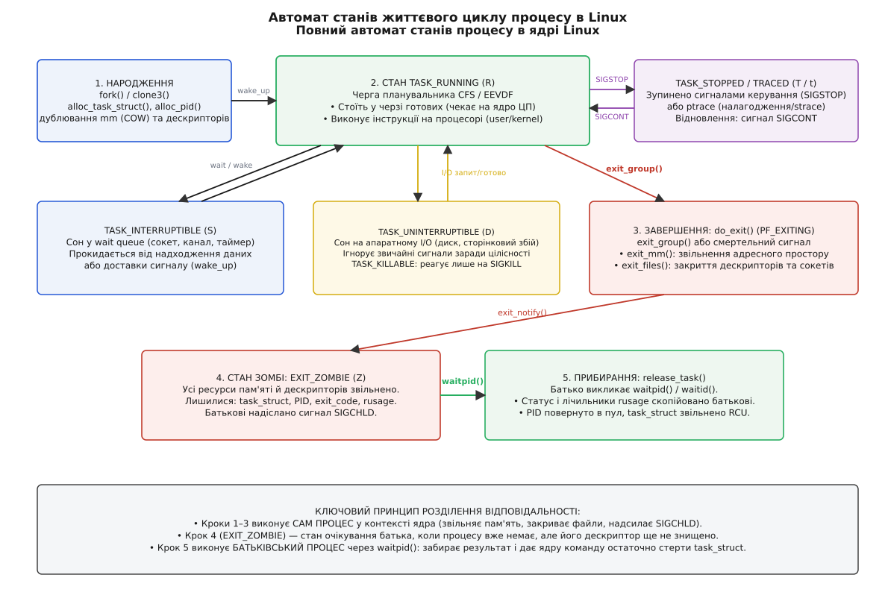
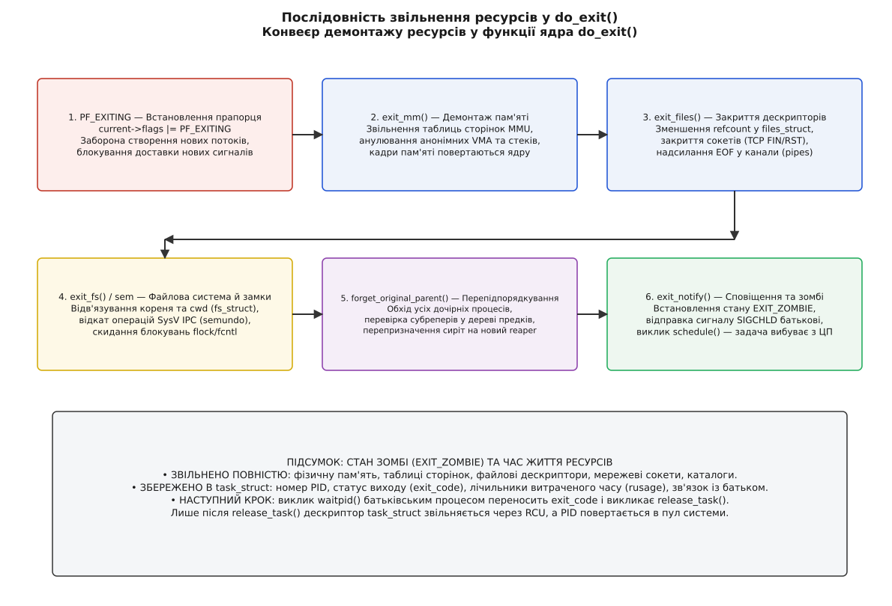
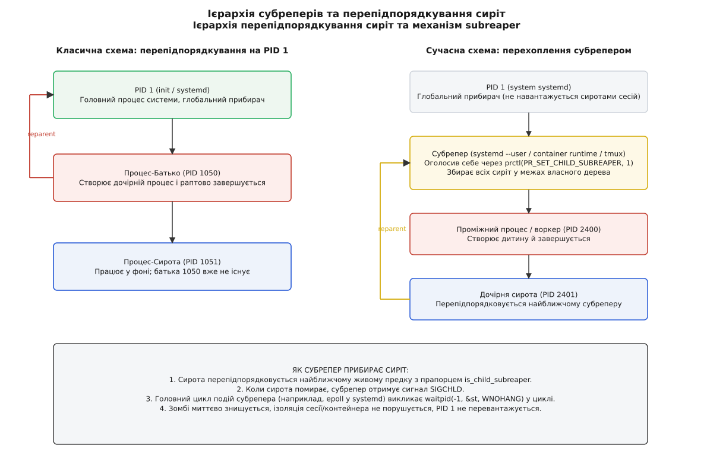

# Життя процесу від запуску до прибирання

<preknowlist>
- [Завершення, wait і зомбі](root:sys-unix/exit-wait-zombies) — два кроки смерті процесу, стан зомбі та механіка збирання результату.
- [Сироти й перепідпорядкування](root:sys-unix/orphan-reparenting) — перепризначення батька померлого процесу та роль ланцюга прибирачів.
- [Стани процесу](root:sys-unix/process-states) — черга готових, сон у станах S та D, пробудження від переривань.
- [fork: розмноження процесу](root:sys-unix/fork-semantics) — розділення пам'яті за механізмом COW, дублювання дескрипторів та ідентичності.
- [exec: заміщення образу](root:sys-unix/exec-semantics) — розбір ELF, заміна адресного простору та скидання обробників сигналів.
</preknowlist>

У робочій системі щомиті народжуються й зникають сотні процесів: вебсервер запускає воркери, компілятор породжує препроцесор і лінкер, скрипти автоматизації перенаправляють дані крізь десятки фільтрів. За нормальних умов цей кругообіг непомітний: ядро виділяє ресурси, процесор виконує інструкції, а після завершення оперативна пам'ять і файлові дескриптори повертаються в систему за лічені мікросекунди. Проте варто статися непомітному збою — батьківський процес зависає без виклику `waitpid`, демон некоректно від'єднується від термінала або драйвер блокує сторінку пам'яті під час вводу-виводу — і система починає накопичувати «мертві душі». Таблиця процесів переповнюється, ліміт ідентифікаторів PID вичерпується, а нові команди завершуються з помилкою `fork: Resource temporarily unavailable` навіть за наявності десятків гігабайтів вільної оперативної пам'яті.

Щоб точно діагностувати витоки, блокування та аномальну поведінку програм, процес не можна розглядати як монолітну сутність, яка просто «працює» чи «закрилася». У просторі ядра Linux процес — це динамічний автомат скінченних станів, чиє життя чітко розбите на фази: виділення дескриптора, виконання в чергах планувальника, каскадне вивільнення ресурсів, очікування в стані зомбі та остаточне поховання. Кожна фаза має власні інваріанти, точки синхронізації та механізми захисту.

## Фаза 1: Народження — створення та ініціалізація task_struct

Життя будь-якого процесу в Linux (за винятком початкового ядра та `idle`-задач) починається з розгалуження вже наявного процесу через системні виклики `fork`, `vfork`, `clone` або сучасний `clone3`. Усі ці виклики всередині ядра сходяться до єдиної внутрішньої функції `copy_process()` (файл `kernel/fork.c`).

Коли ядро отримує запит на створення процесу, воно не завантажує виконуваний файл із диска й не створює потік з нуля. Натомість воно клонує батьківський дескриптор задачі — структуру `struct task_struct`. Дескриптор задачі є центральним вузлом обліку: у ньому зберігаються стан виконання, зв'язки в дереві процесів, показники використання ресурсів, маски сигналів, посилання на віртуальну пам'ять, відкриті файли та облікові дані безпеки.

```
fork / clone3
  └─► copy_process()
        ├─► alloc_task_struct_node()      [виділення пам'яті під дескриптор task_struct зі slab-кешу]
        ├─► alloc_thread_stack_node()     [виділення стека ядра задачі, зазвичай 16 КіБ]
        ├─► dup_task_struct()             [побайтове копіювання стану батьківської task_struct]
        ├─► copy_creds()                  [дублювання UID/GID, прав та можливостей capabilities]
        ├─► copy_files()                  [копіювання таблиці files_struct або спільне використання]
        ├─► copy_fs()                     [дублювання fs_struct: кореневий каталог і поточний cwd]
        ├─► copy_sighand(), copy_signal() [копіювання таблиці обробників сигналів]
        ├─► copy_mm()                     [дублювання mm_struct: таблиці сторінок позначаються як COW]
        ├─► alloc_pid()                   [виділення унікального номера PID у поточному просторі імен]
        └─► sched_fork()                  [ініціалізація планувальника, встановлення стану TASK_NEW]
```

Виділення пам'яті під `task_struct` відбувається не через загальний алокатор, а зі спеціалізованого кешу `kmem_cache` (slab-алокатор ядра). Разом із дескриптором задачі ядро виділяє окремий стек режиму ядра (`thread stack`, розміром 16 КіБ на архітектурі x86_64), на якому виконуватимуться системні виклики та обробники переривань від імені цього процесу.

Після копіювання дескриптора функція `copy_process()` по черзі ініціалізує підсистеми. Якщо виклик не вимагає спільного використання ресурсів (як це роблять потоки через прапорці `CLONE_VM`, `CLONE_FILES`), ядро дублює структури. Найважливіший крок тут — `copy_mm()`: ядро не копіює фізичні сторінки пам'яті батька, а лише дублює таблиці сторінок віртуальної пам'яті `struct mm_struct` і позначає всі доступні для запису сторінки прапорцем «лише для читання». Так активується механізм [копіювання при записі](root:sf-os/copy-on-write) (англ. *Copy-on-Write*, COW): фізичне виділення нової сторінки пам'яті для дитини станеться лише тоді, коли один із процесів спробує змінити байт даних.

Далі функція `alloc_pid()` звертається до бітової карти та дерева ідентифікаторів у поточному просторі імен процесів (PID namespace) і резервує найменший вільний номер. Новий процес отримує свій `struct pid`, під'єднується до списку дітей батьківського процесу (`parent->children`), а його стан встановлюється в `TASK_NEW`.

На цьому етапі процес уже існує як структура даних, але він ще не може виконуватися на процесорі. Щоб дати йому життя, батьківський процес на завершення `copy_process()` викликає `wake_up_new_task()`. Ця функція переводить стан задачі в `TASK_RUNNING` і вставляє її в чергу виконання (runqueue) планувальника задач (CFS / EEVDF). З цієї миті дитина стає повноправним претендентом на процесорний час.

### Перетворення через execve

Якщо новостворений процес має виконувати іншу програму, він робить системний виклик `execve` або `execveat`. Це не створення нового процесу, а радикальна трансформація вже наявного:

1. **Вивільнення старого адресного простору:** функція `flush_old_exec()` руйнує старий `mm_struct`, звільняє відображення пам'яті та таблиці сторінок батьківської програми.
2. **Закриття дескрипторів:** усі файлові дескриптори, позначені прапорцем `FD_CLOEXEC` (або `O_CLOEXEC`), негайно закриваються. Дескриптори без цього прапорця залишаються відкритими й переходять у нову програму.
3. **Скидання сигналів:** оскільки адреси користувацьких функцій-обробників у новому адресному просторі стають недійсними, усі встановлені обробники сигналів скидаються до типової поведінки (`SIG_DFL`). Сигнали, для яких було налаштовано ігнорування (`SIG_IGN`), залишаються ігнорованими.
4. **Завантаження бінарного образу:** ядро розбирає заголовок файлу ELF, виділяє нові області віртуальної пам'яті (сегменти тексту `.text`, ініціалізованих даних `.data`, неініціалізованих даних `.bss`), ініціалізує стек користувача, записує туди масиви аргументів `argv`, змінних оточення `envp` та допоміжний вектор `auxv`.
5. **Старт виконання:** ядро записує в регістр інструкцій (на x86_64 — `RIP`) адресу точки входу (entry point) динамічного компонувальника `/lib64/ld-linux-x86-64.so.2` або самої програми (для статично зібраних бінарників) і повертається в простір користувача.

Процес зберіг свій номер PID, зв'язок із батьком, поточний робочий каталог та незакриті дескриптори, але повністю змінив свою пам'ять і код.

## Фаза 2: Активне життя — черги планувальника та переходи між станами

Після народження процес переходить у фазу активного виконання. У будь-який момент часу кожен потік процесу перебуває рівно в одному зі станів ядра, які фіксуються в полі `__state` структури `task_struct`.



*Автомат переходів між станами планувальника: від народження через черги очікування до демонтажу.*

Розгляньмо, що насправді стоїть за літерами, які виводить утиліта `ps` або `/proc/<pid>/status`:

### Стан TASK_RUNNING (літера R)

Стан `TASK_RUNNING` не означає, що процес фізично займає ядро процесора просто зараз. Він означає, що процесу **нічого не бракує для роботи**: йому не потрібні дані з диска чи мережі, таймери не спливли, замки не заблоковані. Він або безпосередньо виконує машинний код на одному з ядер ЦП, або перебуває в черзі готових задач планувальника, очікуючи, поки планувальник виділить йому квант часу.

Планувальник ядра Linux (історично CFS — *Completely Fair Scheduler*, а починаючи з ядра 6.6 — EEVDF, *Earliest Eligible Virtual Deadline First*) веде черги готових задач у вигляді червоно-чорних дерев або списків готовності для кожного фізичного процесорного ядра. Коли квант часу процесу вичерпується або коли з'являється задача з вищим пріоритетом, планувальник виконує перемикання контексту: зберігає регістри поточної задачі, завантажує регістри нової та передає їй ядро процесора. Процес залишається у стані `TASK_RUNNING`, просто переміщуючись у черзі.

### Стан TASK_INTERRUPTIBLE (літера S)

Коли процес робить блокувальний виклик — наприклад, `read()` із порожнього мережевого сокета чи безнапірного каналу (pipe), `select()`, `epoll_wait()` або `nanosleep()` — він більше не може виконувати обчислення. Витрачати на нього процесорний час безглуздо.

Процес самостійно змінює свій стан на `TASK_INTERRUPTIBLE`, додає свій дескриптор до спеціального списку — **черги очікування** (англ. *wait queue*, `wait_queue_head_t`), що належить конкретному об'єкту (сокету, файлу, м'ютексу), і добровільно віддає процесор викликом `schedule()`.

У цьому стані процес може прокинутися з двох причин:
1. **Надійшли очікувані дані:** апаратне переривання мережевої карти кладе пакет у буфер сокета й викликає функцію ядра `wake_up()`. Ядро знаходить задачу у wait queue, змінює її стан на `TASK_RUNNING` і повертає в чергу планувальника.
2. **Надійшов сигнал:** якщо процесу надіслано сигнал (наприклад, `SIGINT` або `SIGTERM`), ядро виводить задачу зі стану сну. Системний виклик переривається й повертає помилку `-EINTR` (або автоматично перезапускається за наявності прапорця `SA_RESTART`), даючи процесу змогу виконати користувацький обробник сигналу.

### Стан TASK_UNINTERRUPTIBLE (літера D)

Стан `TASK_UNINTERRUPTIBLE` (непереривний сон) — це особливий стан очікування, під час якого процес **категорично ігнорує будь-які сигнали**, включно з невідворотним `SIGKILL`.

Чому ядро не дозволяє перервати цей стан? Непереривний сон використовується під час критичних апаратних операцій драйверів, скидання брудних сторінок пам'яті на диск, обробки синхронних сторінкових збоїв (page faults) або очікування блокувань у мережевих файлових системах (наприклад, NFS). У цих точках ядро тримає внутрішні блокування структур файлової системи чи драйвера. Якби процес прокинувся посеред операції від сигналу `SIGINT` і спробував завершитися, структури ядра залишилися б у напівзруйнованому, неузгодженому стані, що спричинило б паніку ядра (*kernel panic*) або пошкодження даних на диску.

У нормі процес перебуває в стані `D` лічені мікросекунди, поки контролер диска виконує читання блоку. Проте якщо мережевий сервер NFS стає недосяжним або дисковий масив виходить із ладу через апаратний тайм-аут, процес може застрягти в стані `D` назавжди. Оскільки сигнали не обробляються, вбити такий процес командою `kill -9` неможливо: він зникне з системи лише тоді, коли відновить роботу апаратура, або після перезавантаження ОС.

> 🔧 **Навіщо це.** Щоб зменшити кількість незнищенних процесів, у ядрі 2.6.25 з'явився стан `TASK_KILLABLE`. Він працює подібно до `TASK_UNINTERRUPTIBLE` (ігнорує звичайні сигнали під час очікування I/O), але миттєво прокидається й завершує задачу, якщо надійшов смертельний сигнал `SIGKILL`. Сучасні дискові та блокові драйвери здебільшого використовують саме його.

### Стани TASK_STOPPED (T) та TASK_TRACED (t)

Стан `TASK_STOPPED` настає тоді, коли процес призупиняється сигналами керування завданнями: `SIGSTOP` (негайне безумовне зупинення), `SIGTSTP` (натискання клавіш `Ctrl+Z` у терміналі), `SIGTTIN` або `SIGTTOU` (спроба фонового процесу читати з або писати в термінал). Процес повністю вилучається з черги планувальника й не споживає такти ЦП, але зберігає всі ресурси в пам'яті. Повернути його до життя в стан `TASK_RUNNING` може лише сигнал `SIGCONT`.

Стан `TASK_TRACED` виникає тоді, коли виконання процесу контролює інструмент налагодження чи трасування (наприклад, `gdb` або `strace` через системний виклик `ptrace`). Щоразу, коли процес робить системний виклик або зустрічає точку зупину (*breakpoint*), ядро призупиняє його, виставляє стан `t` і надсилає сповіщення процесу-трасувальнику, очікуючи його команди на продовження кроку.

## Фаза 3: Завершення — каскад звільнення ресурсів у do_exit()

Рано чи пізно процес доходить до кінця свого шляху. Завершення може бути добровільним (виклик функції `exit()` чи `exit_group()`, повернення з функції `main()`) або примусовим (отримання смертельного сигналу на зразок `SIGSEGV`, `SIGKILL` чи `SIGTERM`).

У багатопотокових програмах виклик бібліотечної функції C `exit(code)` насправді викликає системний виклик `exit_group(code)`. Він надсилає запит на завершення всім потокам у межах поточної групи потоків (thread group). Кожен потік окремо викликає внутрішню функцію ядра `do_exit()` (файл `kernel/exit.c`), де відбувається фундаментальний демонтаж ресурсів.



*Послідовність вивільнення ресурсів у do_exit(): більшість структур знищується одразу, а дескриптор і код виходу чекають на батька.*

Функція `do_exit()` виконує суворо впорядкований каскад кроків очищення:

1. **Встановлення прапорця PF_EXITING:**
   Першим кроком ядро записує в поле `current->flags` прапорець `PF_EXITING`. Це сигнал усім іншим підсистемам ядра: процес перебуває в процесі ліквідації. Йому заборонено створювати нові потоки, відкривати файли чи отримувати нові сигнали; будь-які спроби надіслати йому сигнал тепер ігноруються.

2. **Очищення сигналів (exit_signals):**
   Ядро скасовує всі таймери POSIX, очищає черги очікуваних сигналів і переводить стан сигнальної підсистеми в режим виходу.

3. **Звільнення пам'яті (exit_mm):**
   Функція `exit_mm()` від'єднує процес від структури віртуальної пам'яті `struct mm_struct`. Якщо на цей адресний простір більше ніхто не посилається (немає інших потоків), ядро демонтує таблиці сторінок, знищує структури областей пам'яті (VMA) і повертає фізичні сторінки пам'яті в загальний пул ядра (buddy allocator). Водночас оновлюються показники використання пам'яті у відповідній контрольній групі `cgroup` (файл `memory.current` негайно падає до нуля для цієї задачі). Процес більше не має власної пам'яті й коду користувача — він перетворюється на порожню оболонку ядра.

4. **Закриття дескрипторів файлів (exit_files):**
   Функція `exit_files()` зменшує лічильник посилань на таблицю відкритих файлів `struct files_struct`. Якщо це був останній процес, що використовував цю таблицю, ядро закриває кожен відкритий файловий дескриптор. Тут спрацьовує ланцюгова реакція:
   - Якщо закрито сокет TCP, ядро починає штатну процедуру розриву з'єднання (надсилає пакет `FIN` або `RST`).
   - Якщо закрито дескриптор запису в пайп (pipe), процес на іншому кінці каналу отримує сигнал кінця файлу (EOF) або `SIGPIPE`.
   - Знімаються всі блокування файлів типу POSIX `fcntl` (`F_SETLK`), якими володів цей процес.

5. **Звільнення контексту файлової системи (exit_fs):**
   Функція `exit_fs()` зменшує лічильники посилань на структуру `struct fs_struct`, відв'язуючи процес від його кореневого каталогу (`chroot`), поточного робочого каталогу (cwd) та маски створення файлів `umask`.

6. **Очищення IPC та семафорів (exit_sem):**
   Якщо процес використовував семафори System V з прапорцем `SEM_UNDO`, ядро автоматично скасовує всі внесені ним зміни до значень семафорів, запобігаючи вічним блокуванням інших програм.

7. **Перепідпорядкування дітей (forget_original_parent):**
   Якщо процес, що вмирає, сам мав дочірні процеси, він не може забрати їх із собою в могилу. Ядро обходить список його дітей і передає кожну дитину новому опікунові — найближчому живому субреперу або процесу `init` (PID 1). Жоден процес не залишається без батьківського зв'язку.

8. **Фіксація коду виходу та сповіщення (exit_notify):**
   Процес записує свій код завершення у поле `current->exit_code`. Стан задачі змінюється на `EXIT_ZOMBIE`. Функція `exit_notify()` надсилає батьківському процесу сигнал `SIGCHLD`, сповіщаючи, що дитина завершила роботу і її результат готовий до збирання.

9. **Остаточний вихід із планувальника:**
   Процес востаннє викликає планувальник `schedule()`. Планувальник бачить стан `EXIT_ZOMBIE`, вилучає задачу з черг назавжди й перемикає процесор на інший процес. Стек ядра цієї задачі вивільняється.

## Фаза 4: Стан зомбі — навіщо потрібен мрець

Після завершення `do_exit()` від процесу залишається лише невелика структура `task_struct` (близько 4–6 КіБ у slab-пам'яті ядра) та запис у таблиці ідентифікаторів PID. Пам'ять, стек користувача, відкриті файли й сокети вже повернуто системі. Утиліта `ps` показує цей процес зі статусом `Z` та підписом `<defunct>`.

Зомбі — це не помилка операційної системи й не витік пам'яті програми. Це **фундаментальний механізм синхронізації та звітування в Unix**.

Чому ядро не може негайно видалити `task_struct` і звільнити номер PID у момент виклику `exit()`?

### 1. Збереження результату для батька
Батьківський процес створив дитину для виконання певної роботи й має законне право дізнатися, чим ця робота скінчилася. Код завершення (успіх `0`, код помилки чи номер сигналу, що вбив програму) разом із важливою статистикою використання ресурсів (скільки мілісекунд процесорного часу в просторі користувача та ядра витратила дитина, скільки сторінкових збоїв викликала) зберігається в полях `exit_code` та структурі `rusage` всередині `task_struct`. Цей запис мусить існувати доти, доки батько не прийде за ним.

### 2. Захист від підміни PID (PID reuse race)
Номер PID — це числовий дескриптор процесу. Поки батько вважає, що його дитина існує (або щойно завершилася), він може надсилати їй сигнали через `kill(pid, SIGTERM)`. Якби ядро негайно звільняло номер PID під час виходу процесу, цей номер міг би бути миттєво перевиділений абсолютно новому, сторонньому процесу в системі. Тоді наступний виклик `kill(pid, ...)` від старого батька влучив би в чужий процес і міг би випадково вбити системну службу чи базу даних.

Збереження процесу в стані зомбі блокує номер PID: **поки живий зомбі, його номер PID не може бути виданий жодному іншому процесу в системі**.

```
Хронологія життя номера PID:

1. fork()      ──► PID 4120 виділено з бітової карти простору імен
2. Робота      ──► PID 4120 закріплено за активною програмою
3. do_exit()   ──► Пам'ять звільнено, але PID 4120 ЗАБЛОКОВАНО у стані зомбі
4. waitpid()   ──► Батько забрав статус; release_task() повертає PID 4120 у пул
5. Наступний   ──► PID 4120 тепер може дістатися новій програмі
```

### Пастка злиття сигналів SIGCHLD

Коли дитина стає зомбі, ядро відправляє батькові сигнал `SIGCHLD`. Батьківський процес може перехопити цей сигнал через `sigaction` і викликати `waitpid()`. Проте тут криється класична пастка системного програмування: стандартні сигнали Unix **не стають у чергу**.

Якщо кілька дочірніх процесів завершуються майже одночасно (наприклад, п'ять воркерів вебсервера), ядро встановить лише один бітовий прапорець `SIGCHLD` у масці очікуваних сигналів батька. Батько отримає лише один виклик обробника сигналу. Якщо в обробнику викликати `waitpid` лише один раз, буде прибрано рівно одного мертвого воркера, а решта четверо назавжди залишаться зомбі.

Єдино правильний шаблон обробки сигналу `SIGCHLD` полягає у виклику `waitpid` у неблокувальному циклі з прапорцем `WNOHANG`:

:::tabs
```c
#include <sys/types.h>
#include <sys/wait.h>
#include <signal.h>
#include <errno.h>

static void sigchld_handler(int sig) {
    (void)sig;
    int saved_errno = errno; /* обробник сигналу зобов'язаний зберегти errno */
    pid_t pid;
    int status;

    /* Вичищаємо ВСІХ дітей, що встигли завершитися до цього моменту */
    while ((pid = waitpid(-1, &status, WNOHANG)) > 0) {
        /* Обробка результату pid і status */
    }

    errno = saved_errno;
}
```
```cpp
#include <sys/types.h>
#include <sys/wait.h>
#include <csignal>
#include <cerrno>

extern "C" void sigchld_handler(int sig) noexcept {
    const int saved_errno = errno;
    int status = 0;

    // Збираємо коди виходу всіх готових дочірніх процесів без блокування
    while (::waitpid(-1, &status, WNOHANG) > 0) {
        // Конкретна реакція на завершення процесу
    }

    errno = saved_errno;
}
```
:::

## Фаза 5: Прибирання — waitpid та функція release_task

Остаточне знищення залишків процесу здійснює виклик родини `wait` (`wait`, `waitpid`, `waitid`, `wait4`), викликаний батьківським процесом.

Коли батько викликає, наприклад, `waitpid(child_pid, &status, 0)`:

1. Ядро переходить у функцію `kernel_waitid()` -> `do_wait()`.
2. Ядро шукає серед нащадків задачу з відповідним PID.
3. Знайшовши задачу в стані `EXIT_ZOMBIE`, ядро вичитує збережений `exit_code` та копіює його в змінну `status` у просторі користувача батька, розпаковуючи інформацію про причину смерті (нормальний вихід через `WEXITSTATUS`, загибель від сигналу через `WTERMSIG`, створення core dump через `WCOREDUMP`).
4. Якщо викликано `wait4`, ядро також копіює статистику використання процесорного часу та пам'яті в структуру `struct rusage`.
5. Після успішної передачі даних ядро викликає фінальну функцію очищення: `release_task(struct task_struct *p)`.

```
waitpid() у батька
  └─► do_wait()
        ├─► знаходить нащадка у стані EXIT_ZOMBIE
        ├─► копіює exit_code та rusage у простір користувача
        └─► release_task(p)
              ├─► __unhash_process(p)   [вилучення з глобального дерева та хеш-таблиць процесів]
              ├─► free_pid(p->thread_pid) [повернення номера PID у бітову карту простору імен]
              ├─► exit_creds(p)         [звільнення структур безпеки та облікових записів]
              └─► put_task_struct(p)    [зменшення лічильника посилань; RCU-звільнення slab-пам'яті]
```

Функція `release_task()` виконує поховання:
- Вилучає задачу з глобального списку задач ядра та списків спорідненості (`__unhash_process`).
- Викликає `free_pid()`, повертаючи номер PID у пул вільних номерів відповідного простору імен.
- Викликає `put_task_struct()`, зменшуючи лічильник посилань на дескриптор задачі. Оскільки лічильник стає рівним нулю, пам'ять структури `task_struct` звільняється через механізм відкладеного звільнення RCU (*Read-Copy Update*) і повертається у slab-кеш. Механізм RCU гарантує, що якщо інший потік ядра (наприклад, обхідник `/proc`) тримав читацьке блокування `rcu_read_lock()` на цю структуру, він встигне безпечно завершити читання до фізичного звільнення блоку пам'яті.

Лише в цей момент процес остаточно перестає існувати у всесвіті Linux. Будь-який наступний виклик `waitpid` на цей PID поверне помилку `ECHILD` («немає такого дочірнього процесу»).

### Автоматичне прибирання без wait: SA_NOCLDWAIT

Якщо батьківському процесу взагалі не потрібні результати роботи дітей і він не бажає займатися викликами `waitpid`, він може явно наказати ядру прибирати дітей автоматично:

:::tabs
```c
#include <signal.h>
#include <stddef.h>

void disable_zombies(void) {
    struct sigaction sa;
    sa.sa_handler = SIG_IGN;
    sigemptyset(&sa.sa_mask);
    sa.sa_flags = SA_NOCLDWAIT; /* ядро автоматично знищує зомбі, не турбуючи батька */
    sigaction(SIGCHLD, &sa, NULL);
}
```
```cpp
#include <csignal>
#include <cstddef>
#include <system_error>

void disable_zombies() {
    struct sigaction sa{};
    sa.sa_handler = SIG_IGN;
    ::sigemptyset(&sa.sa_mask);
    sa.sa_flags = SA_NOCLDWAIT; // автоматичне прибирання зомбі ядром
    if (::sigaction(SIGCHLD, &sa, nullptr) == -1) {
        throw std::system_error(errno, std::generic_category(), "sigaction failed");
    }
}
```
:::

Коли для сигналу `SIGCHLD` встановлено прапорець `SA_NOCLDWAIT` або дію `SIG_IGN`, функція `exit_notify()` під час завершення дитини одразу встановлює стан `EXIT_DEAD` і негайно викликає `release_task()`, оминаючи стан `EXIT_ZOMBIE`. Дитина зникає миттєво.

## Фаза 6: Сироти, субрепери та роль systemd / PID 1

Що станеться, якщо батьківський процес помре **раніше**, ніж його дочірній процес?

Такий дочірній процес називається **сиротою** (англ. *orphan process*). Якщо батько загинув, він уже ніколи не викличе `waitpid()`. Якби система нічого не робила, кожна сирота після завершення перетворювалася б на вічного зомбі, якого неможливо прибрати, що швидко призвело б до вичерпання номерів PID.

Щоб запобігти цьому, ядро реалізує механізм **перепідпорядкування** (англ. *reparenting*).



*Перепідпорядкування сиріт: перехоплення найближчим субрепером запобігає засміченню кореневого PID 1.*

Коли батьківський процес завершується у функції `do_exit()`, він викликає функцію `forget_original_parent()`. Ця функція шукає нового батька для кожної дитини за чітким алгоритмом (`find_new_reaper()`):

1. **Інший живий потік:** якщо в тій самій групі потоків є інший активний потік, опікунство передається йому.
2. **Найближчий субрепер (Subreaper):** ядро підіймається вгору по дереву предків процесу й шукає найближчий процес, який оголосив себе «субрепером» через системний виклик `prctl(PR_SET_CHILD_SUBREAPER, 1)`.
3. **PID 1 (init / systemd):** якщо жодного субрепера в ланцюгу предків не знайдено, новим батьком призначається перший процес системи — `init` (або `systemd`) поточного простору імен PID.

### Навіщо потрібні субрепери

Історично в класичному Unix усі сироти завжди перепідпорядковувалися виключно процесу `init` (PID 1). Проте з появою контейнерів, складних сервіс-менеджерів та сесійних менеджерів (`systemd --user`, `tmux`, Docker, Podman) виникла проблема: коли сервіс використовує подвійний `fork` для демонізації, онук відривався від сервіс-менеджера й тікав під крило глобального PID 1. Сервіс-менеджер втрачав контроль над життєвим циклом власного процесу.

Починаючи з версії Linux 3.4, будь-який процес-наглядач може викликати команду оголошення субрепером:

:::tabs
```c
#include <sys/prctl.h>
#include <stdio.h>

int make_subreaper(void) {
    /* Оголошуємо поточний процес прибирачем усіх сиріт у своєму піддереві */
    if (prctl(PR_SET_CHILD_SUBREAPER, 1, 0, 0, 0) == -1) {
        perror("prctl PR_SET_CHILD_SUBREAPER");
        return -1;
    }
    return 0;
}
```
```cpp
#include <sys/prctl.h>
#include <system_error>
#include <cerrno>

void make_subreaper() {
    // Оголошуємо поточний процес субрепером у піддереві нащадків
    if (::prctl(PR_SET_CHILD_SUBREAPER, 1, 0, 0, 0) == -1) {
        throw std::system_error(errno, std::generic_category(), "prctl PR_SET_CHILD_SUBREAPER failed");
    }
}
```
:::

Після цього всі процеси, запущені в його піддереві, у разі осиротіння будуть перепідпорядковуватися саме цьому наглядачеві, а не PID 1. Саме так працює `systemd --user` та контейнерні рушії: вони ізолюють життєвий цикл процесів усередині своєї сесії.

### Як прибирає systemd

Процес `init` (або `systemd`) має залізний інваріант: він **ніколи не завершується** під час нормальної роботи ОС і **завжди обробляє сигнал SIGCHLD**.

У головному циклі подій `systemd` (побудованому на `epoll` та `signalfd`) сигнал `SIGCHLD` перехоплюється миттєво. Щойно будь-який процес-сирота, приписаний до PID 1, переходить у стан зомбі, `systemd` прокидається, викликає `waitid` / `waitpid`, забирає статус завершення й дозволяє ядру виконати `release_task()`. Таким чином, осиротілі зомбі в системі знищуються за частки мікросекунди.

## Сучасна альтернатива: pidfd та спостереження без гонитви номерів

Традиційне використання числових ідентифікаторів PID завжди несло ризик гонитви номерів (*PID reuse race*). Починаючи з ядра Linux 5.3, з'явився механізм **файлових дескрипторів процесів** — `pidfd` (системний виклик `pidfd_open` та прапорець `CLONE_PIDFD` у `clone3`).

Замість числового PID процес отримує файловий дескриптор:

1. `pidfd` є унікальним об'єктом файлової системи ядра (анонімний inode). Навіть якщо процес помер, а його числовий PID перевиділено, файловий дескриптор продовжує вказувати на оригінальний екземпляр задачі.
2. `pidfd` підтримує опитування готовності через `poll`, `epoll` та `select`. Дескриптор стає доступним для читання (`POLLIN`) рівно в ту мить, коли процес переходить у стан завершення.
3. Через `pidfd_send_signal` можна безпечно відправляти сигнали без ризику випадкового вбивства стороннього процесу.

## Практикум: спостереження життєвого циклу в коді

Щоб побачити всі фази життєвого циклу на практиці, реалізуємо надійний процес-супервізор. Він демонструє коректне створення процесу через `fork`, моніторинг його стану, перехоплення смерті через `waitid` та запобігання витоку зомбі.

:::tabs
```c
#define _GNU_SOURCE
#include <stdio.h>
#include <stdlib.h>
#include <unistd.h>
#include <sys/types.h>
#include <sys/wait.h>
#include <signal.h>
#include <string.h>
#include <errno.h>

int main(void) {
    printf("[Батько PID %d] Запуск життєвого циклу процесу...\n", getpid());

    pid_t pid = fork();

    if (pid < 0) {
        perror("fork помилка");
        return EXIT_FAILURE;
    }

    if (pid == 0) {
        /* Фаза 1 і 2: Дитина народилася й виконує роботу */
        printf("  [Дитина PID %d] Я народилася! Мій батько PPID = %d\n", getpid(), getppid());
        printf("  [Дитина PID %d] Працюю (стан TASK_RUNNING)...\n", getpid());
        usleep(100000); /* 100 мс активності */

        printf("  [Дитина PID %d] Засинаю в TASK_INTERRUPTIBLE на 1 секунду...\n", getpid());
        sleep(1);

        printf("  [Дитина PID %d] Завершуюся через exit(42)...\n", getpid());
        exit(42); /* Фаза 3: Перехід у do_exit() */
    }

    /* Батьківський процес */
    printf("[Батько PID %d] Дитину створено з PID %d. Чекаю 2 секунди...\n", getpid(), pid);
    sleep(2); /* Дитина вже завершилася й чекає у стані EXIT_ZOMBIE (Фаза 4) */

    printf("[Батько PID %d] Викликаю waitid() для збирання статусу (Фаза 5)...\n", getpid());

    siginfo_t info;
    memset(&info, 0, sizeof(info));

    /* Використовуємо waitid для отримання детальної структури siginfo_t */
    if (waitid(P_PID, (id_t)pid, &info, WEXITED) == -1) {
        perror("waitid помилка");
        return EXIT_FAILURE;
    }

    if (info.si_code == CLD_EXITED) {
        printf("[Батько PID %d] Дитина PID %d успішно прибрана! Код виходу = %d\n",
               getpid(), info.si_pid, info.si_status);
    } else if (info.si_code == CLD_KILLED || info.si_code == CLD_DUMPED) {
        printf("[Батько PID %d] Дитина PID %d загинула від сигналу %d\n",
               getpid(), info.si_pid, info.si_status);
    }

    printf("[Батько PID %d] task_struct знищено, PID %d вивільнено. Роботу завершено.\n",
           getpid(), pid);
    return EXIT_SUCCESS;
}
```
```cpp
#include <iostream>
#include <format>
#include <chrono>
#include <thread>
#include <system_error>
#include <cstring>
#include <unistd.h>
#include <sys/types.h>
#include <sys/wait.h>

class ProcessSupervisor {
public:
    static void run_lifecycle_demo() {
        std::cout << std::format("[Батько PID {}] Запуск життєвого циклу процесу...\n", ::getpid());

        const pid_t pid = ::fork();

        if (pid < 0) {
            throw std::system_error(errno, std::generic_category(), "Помилка виклику fork");
        }

        if (pid == 0) {
            // Дитина: Фаза 1 і 2
            std::cout << std::format("  [Дитина PID {}] Я народилася! Батько PPID = {}\n",
                                     ::getpid(), ::getppid());
            std::cout << std::format("  [Дитина PID {}] Працюю (TASK_RUNNING)...\n", ::getpid());
            std::this_thread::sleep_for(std::chrono::milliseconds(100));

            std::cout << std::format("  [Дитина PID {}] Сон (TASK_INTERRUPTIBLE)...\n", ::getpid());
            std::this_thread::sleep_for(std::chrono::seconds(1));

            std::cout << std::format("  [Дитина PID {}] Завершення exit(42)...\n", ::getpid());
            std::_Exit(42); // Фаза 3: вхід у do_exit()
        }

        // Батьківський процес
        std::cout << std::format("[Батько PID {}] Дитину створено: PID {}. Чекаю 2 с...\n",
                                 ::getpid(), pid);
        std::this_thread::sleep_for(std::chrono::seconds(2)); // Дитина стає зомбі (Фаза 4)

        std::cout << std::format("[Батько PID {}] Прибирання через waitid() (Фаза 5)...\n",
                                 ::getpid());

        siginfo_t info{};
        if (::waitid(P_PID, static_cast<id_t>(pid), &info, WEXITED) == -1) {
            throw std::system_error(errno, std::generic_category(), "Помилка виклику waitid");
        }

        if (info.si_code == CLD_EXITED) {
            std::cout << std::format("[Батько PID {}] Дитина PID {} прибрана. Код виходу = {}\n",
                                     ::getpid(), info.si_pid, info.si_status);
        } else {
            std::cout << std::format("[Батько PID {}] Дитина PID {} завершилася сигналом {}\n",
                                     ::getpid(), info.si_pid, info.si_status);
        }

        std::cout << std::format("[Батько PID {}] Ресурси вивільнено, завершення.\n", ::getpid());
    }
};

int main() {
    try {
        ProcessSupervisor::run_lifecycle_demo();
        return 0;
    } catch (const std::exception& ex) {
        std::cerr << "Помилка супервізора: " << ex.what() << '\n';
        return 1;
    }
}
```
:::

### Спостереження за життєвим циклом через трасувальні точки ядра

Побачити всі переходи між фазами в реальному часі можна безпосередньо через підсистему трасування ядра Linux (ftrace або bpftrace). Ядро має спеціальні вбудовані трасувальні точки (*tracepoints*) у підсистемі планувальника `sched`:

- `sched:sched_process_fork` — фіксує народження нового `task_struct` (виклик `copy_process`).
- `sched:sched_process_exec` — фіксує успішну трансформацію образу через `execve`.
- `sched:sched_process_exit` — фіксує вхід у функцію `do_exit()` та звільнення пам'яті.
- `sched:sched_process_wait` та `sched:sched_process_free` — фіксує збирання статусу батьком та виклик `release_task()`.

Однорядковий скрипт `bpftrace` дозволяє наочно простежити повний життєвий шлях процесу від першого до останнього такту:

```bash
sudo bpftrace -e '
tracepoint:sched:sched_process_fork {
    printf("[FORK] Батько %s (%d) породив дитину %s (%d)\n",
           args->parent_comm, args->parent_pid, args->child_comm, args->child_pid);
}
tracepoint:sched:sched_process_exec {
    printf("[EXEC] Процес %d запустив файл %s\n", pid, args->filename);
}
tracepoint:sched:sched_process_exit {
    printf("[EXIT] Процес %s (%d) завершується (код %d)\n",
           comm, pid, curtask->exit_code >> 8);
}
tracepoint:sched:sched_process_free {
    printf("[FREE] Дескриптор task_struct процесу %d остаточно знищено (reaped)\n",
           args->pid);
}'
```

## Діагностичний чекліст: пошук аномалій життєвого циклу

Розуміння фаз життя процесу дає чіткий алгоритм дій під час розслідування системних проблем:

| Симптом | Діагноз у моделі ядра | Метод усунення |
| :--- | :--- | :--- |
| Велика кількість процесів у стані `Z` (`<defunct>`) під одним батьком | Батьківський процес завис або не реалізує цикл `waitpid(-1, &st, WNOHANG)` на сигнал `SIGCHLD`. | Знищити **батьківський процес** (`kill -15 <ppid>`). Зомбі осиротіють і будуть миттєво прибрані субрепером або `systemd`. |
| Процес у стані `D` не реагує на `kill -9` | Процес застряг у непереривному очікуванні відповіді від драйвера диска або завислого сервера NFS. | Відновити зв'язок із мережевою ФС (NFS/CIFS) або перевірити апаратний стан накопичувача (`dmesg`). Вбити процес без перезавантаження ОС неможливо. |
| Помилка `fork: Resource temporarily unavailable` при вільній оперативній пам'яті | Вичерпано ліміт кількості процесів `kernel.pid_max` або ліміт користувача `nproc` у `limits.conf` через витік зомбі або неконтрольоване розгалуження. | Перевірити лічильник процесів (`ps -eLf | wc -l`), знайти джерело форк-бомби чи витоку дескрипторів і тимчасово підняти ліміт: `sysctl -w kernel.pid_max=4194304`. |
| Процес після падіння батька зник безслідно замість перепідпорядкування | Батько перед смертю надіслав групі процесів сигнал `SIGHUP` або дочірній процес був прив'язаний до термінала сесії TTY. | Використовувати `setsid()` під час демонізації або запускати довготривалі фонові процеси як системні служби `systemd` (`Type=exec` / `Type=simple`). |

Життєвий цикл процесу в Linux — це детермінований конвеєр передачі відповідальності: ядро виділяє ресурси під час `fork`, процес володіє ними під час роботи, ядро забирає фізичну пам'ять і файли під час `exit()`, а батьківський процес звільняє числовий ідентифікатор і дескриптор через `waitpid()`. Порушення будь-якої з цих ланок порушує баланс системи, а розуміння точного внутрішнього механізму дозволяє миттєво локалізувати й виправити збій.
