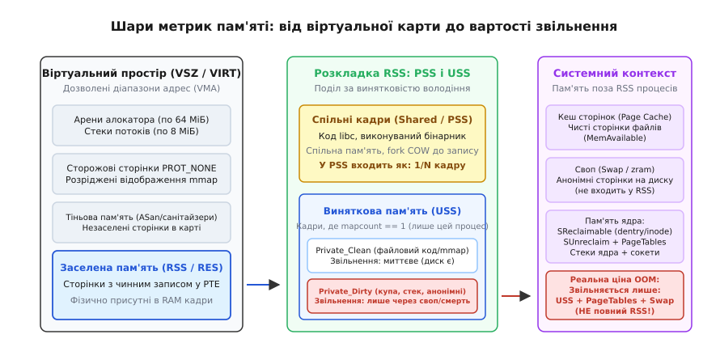
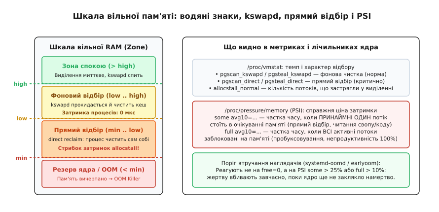
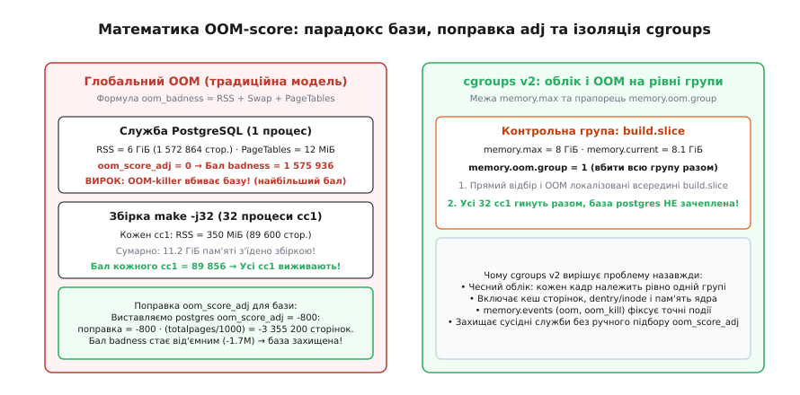

# Як читати цифри пам'яті й не обманутися

<preknowlist>
- [mmap: файл і пам'ять як одне](root:sys-unix/mmap-model) — відображення файлів у віртуальний простір, анонімні області та прапорці доступу.
- [Свопінг і витіснення сторінок](root:sys-unix/swap-and-reclaim) — активні та неактивні списки LRU, водяні знаки пам'яті та фоновий відбір сторінок kswapd.
- [Overcommit і OOM-killer](root:sys-unix/overcommit-and-oom) — механізм надлишкових зобов'язань Committed_AS, режими overcommit та алгоритм oom_badness.
- [Як міряти пам'ять процесу: VSZ, RSS, PSS](root:sys-unix/memory-accounting) — фізичний зміст базових метрик адресного простору та резидентної множини.
- [Звідки алокатор бере пам'ять](root:sys-unix/allocator-and-kernel) — арени glibc, системні виклики brk/mmap та фрагментація купи.
- [cgroups: облік і обмеження ресурсів](root:sys-unix/cgroups-resource-model) — ліміти пам'яті memory.max, cgroups v2 та ізоляція навантажень.
- [Навантаження й тиск на ресурси](root:sys-unix/load-and-pressure) — метрики PSI (Pressure Stall Information) як об'єктивна міра втраченого процесорного часу.
</preknowlist>

О третій годині ночі система моніторингу надсилає черговому інженеру критичне сповіщення: на головному сервері баз даних із 64 ГіБ оперативної пам'яті залишилося лише 250 Мегабайтів вільної пам'яті (`MemFree: 250 MB`), тобто зайнято понад 99%. Інженер підключається до сервера через SSH, вводить команду `ps aux` і бачить, що сума значень стовпчика `RSS` по всіх процесах становить 88 ГіБ — на 24 гігабайти більше, ніж фізично встановлено в серверній стійці. Команда `top` показує віртуальний розмір `VIRT` для головного процесу СУБД на рівні 1.4 Терабайта, а утиліта `free -m` стверджує, що вільними є лише кілька сотень мегабайтів, хоча колонка `available` показує солідні 48 ГіБ.

Сервер при цьому не гальмує, дисковий ввід-вивід перебуває на нулі, а клієнтські запити обробляються за штатний час у кілька мікросекунд. Інженер опиняється перед дилемою: чи треба негайно перезапускати сервіси, рятуючи систему від аварійного забиття демоном OOM-killer, чи система абсолютно здорова, а цифри на екрані просто не означають того, що здається на перший погляд?

Причина цієї плутанини полягає не в помилках розробників утиліт моніторингу. Причина в тому, що між байтом адреси всередині скомпільованої програми та фізичним конденсатором мікросхеми DDR лежить кілька незалежних рівнів абстракції ядра Linux. Кожна утиліта дивиться на ці рівні крізь власну проєкцію. Щоб читати ці числа й не обманюватися, необхідно розібрати механіку викривлення на кожному кроці — від віртуальної карти до вартості реального звільнення кадру.

## Чотири шари викривлення між програмою та кремнієм

Коли розробник запитує в операційної системи «скільки пам'яті займає ця програма», просте запитання стикається з чотирма незалежними фізичними та логічними шарами. Жоден із них не виводиться з іншого, і кожен створює власне викривлення в терміналі.

**Перший шар: віртуальний дозвіл проти фізичної присутності (VSZ проти RSS).** Коли програма викликає виділення пам'яті, ядро не виділяє фізичні кадри RAM. Воно лише створює запис про діапазон дозволених адрес — структуру VMA (англ. *virtual memory area*). Цей діапазон входить у віртуальний розмір (`VSZ` або `VIRT`) повністю. Проте реальний фізичний кадр з'явиться в таблиці сторінок лише тоді, коли процесор уперше виконає інструкцію читання або запису за цією адресою й збудить [сторінковий збій](root:sf-os/page-fault). До цієї миті гігабайти віртуальних адрес не коштують системі жодного байта фізичної оперативної пам'яті.

**Другий шар: одиничне володіння проти спільного доступу (RSS проти PSS та USS).** Фізичний кадр оперативної пам'яті може бути одночасно вписаний у таблиці сторінок багатьох процесів. Код стандартної бібліотеки мови C (`libc.so`), відкритий двома сотнями процесів, присутній у фізичній пам'яті в одному єдиному примірнику. Проте класичний лічильник резидентної пам'яті (`RSS`) зараховує повний обсяг цієї бібліотеки кожному з двохсот процесів. Додавання стовпчиків `RSS` неминуче дає суму, що перевищує обсяг машини у кілька разів.

**Третій шар: чисті сторінки проти брудних даних (вартість вивільнення).** Не всі фізично присутні в пам'яті кадри однакові за своєю ціною для системи. Чиста сторінка файлового кешу (наприклад, прочитаний виконуваний код або файл конфігурації) має точну копію на диску. Якщо ядру терміново знадобиться пам'ять, воно вивільняє цей кадр миттєво: достатньо стерти запис у таблиці сторінок без жодного запису на диск. Брудна анонімна сторінка (купа програми, стек) існує лише в цій комірці RAM: вивільнити її можна лише ціною запису у своп, або знищивши процес-власник.

**Четвертий шар: структури ядра поза простором процесів.** Процеси бачать лише власні сторінки. Проте ядро витрачає оперативну пам'ять на власні потреби: таблиці сторінок усіх процесів (`PageTables`), кеші записів каталогів (`dentry`) та дескрипторів файлів (`inode`) усередині Slab, буфери сокетів TCP/UDP, пам'ять стеків ядра для кожного потоку. Жоден процес не показує ці мегабайти у своєму `RSS`, проте вони можуть займати левову частку фізичної пам'яті сервера.


*Ієрархія метрик: віртуальний простір звужується до заселеної множини RSS, яка далі розділяється за спільністю на PSS і USS, а за станом модифікації — на чисті та брудні кадри. Системний контекст (кеш і структури ядра) живе поза простором окремих процесів.*

Розгляньмо, як ці чотири шари формують показання конкретних інструментів і чому наївне читання кожного з них веде до хибних рішень.

## Анатомія системного погляду: що насправді показує `free -h`

Найпростіша команда для перевірки пам'яті в Unix — `free`. Проте саме вона породжує найбільше хибних тривог, якщо дивитися не на той стовпчик. Розберімо типовий вивід `free -h` на робочому сервері:

```
               total        used        free      shared  buff/cache   available
Mem:            62Gi        14Gi       280Mi       1.2Gi        48Gi        47Gi
Swap:          8.0Gi       120Mi       7.9Gi
```

Кожне число в цій таблиці походить із конкретних лічильників псевдофайлу `/proc/meminfo`:

- **`total` (62Gi):** Повний обсяг фізичної пам'яті, доступний операційній системі після завантаження (значення `MemTotal`). Він менший за встановлені 64 ГіБ, бо ядро відняло зарезервовану для себе пам'ять раннього старту.
- **`free` (280Mi):** Пам'ять, яка в поточну мить не містить узагалі ніяких даних і перебуває в чергах вільного списку алокатора сторінок (`MemFree`). 280 мегабайтів — це нормальний робочий стан. Вільна пам'ять у сучасній ОС — це змарнований ресурс; усе, що не потрібно процесам просто зараз, ядро віддає під дисковий кеш.
- **`shared` (1.2Gi):** Пам'ять, зайнята віртуальною файловою системою `tmpfs` (зокрема `/dev/shm`, `/run`, `/tmp`) та спільними сегментами IPC (`Shmem`). Ця пам'ять формально лежить усередині кешу сторінок, але не може бути скинута на диск без використання свопу.
- **`buff/cache` (48Gi):** Сума дискових буферів, кешу сторінок файлів та придатного до вивільнення Slab-кешу ядра (`Buffers + Cached + SReclaimable`). Майже 50 гігабайтів займають файли, прочитані або записані системою раніше.
- **`used` (14Gi):** Обсяг пам'яті, який реально зайнятий процесами та структурами ядра, що не можуть бути вивільнені негайно. Розраховується як `total - free - buff/cache`.
- **`available` (47Gi):** Головне число таблиці. Воно показує, скільки пам'яті можна отримати під нові задачі **без виснажливого буксування та падіння у своп**.

Звідки береться розрив між `free` (280 МіБ) та `available` (47 ГіБ)? Коли новому процесу потрібна пам'ять, ядро не шукає порожні сторінки у списку `free` — воно за частки мікросекунди забирає чисті сторінки з блоку `buff/cache`. Проте `available` — це не просто `free + buff/cache`. Ядро оцінює доступний обсяг за суворою формулою: воно враховує лише чисті сторінки файлового кешу, придатний до скорочення Slab (`dentry`/`inode`), і обов'язково **віднімає захисні водяні знаки зон пам'яті** (`wmark_low`), нижче яких виділення починає гальмувати процеси.

Повний перелік і точні формули всіх полів системного обліку зведені у вставці [про довідникову карту метрик пам'яті](root:unix/reading-memory-numbers/api-memory-metrics-map.md).

> 🔧 **Навіщо це.** Якщо ви налаштовуєте правила автоматичного сповіщення в Prometheus, Zabbix або Datadog, ніколи не ставте тривогу на `node_memory_MemFree_bytes / node_memory_MemTotal_bytes < 0.1`. Вона спрацьовуватиме щодня на абсолютно здорових серверах. Єдиний коректний системний показник залишку пам'яті — це `node_memory_MemAvailable_bytes`.

## Пастки процесних інструментів: `top`, `ps` і привид спільної пам'яті

Перейдемо від системного рівня до конкретних процесів. Якщо подивитися на вивід `top` для високонавантаженої бази даних або багатопотокового сервера, ми бачимо класичну трійку колонок: `VIRT`, `RES`, `SHR`.

```
    PID USER      PR  NI    VIRT    RES    SHR S  %CPU  %MEM     TIME+ COMMAND
   4711 postgres  20   0 1420.2g  16.4g  14.8g S   2.4  26.5  12:45.10 postgres
```

### Пастка VIRT / VSZ: довжина карти замість пам'яті

Число `VIRT` (у `ps` стовпчик зветься `VSZ`) показує сумарний розмір віртуального адресного простору процесу (`mm->total_vm`). Чому воно дорівнює півтора терабайта на машині з 64 ГіБ RAM?

Віртуальний адресний простір на 64-бітній архітектурі практично безрозмірний (128 або 256 Терабайтів). Програми резервують у ньому адреси велетенськими шматками під власні потреби:
1. **Арени алокатора glibc.** Для усунення конфліктів між потоками бібліотека glibc створює окремі арени пам'яті (до `8 × кількість ядер CPU`). Кожна арена резервує в адресному просторі діапазон у 64 МіБ за допомогою виклику `mmap()`, але не торкається цих сторінок. На 64-ядерному сервері 512 арен додають до `VIRT` понад 32 ГіБ віртуального розміру, з яких реально використано може бути лише кілька сотень мегабайтів.
2. **Стеки потоків.** Кожен створений потік у Linux за замовчуванням резервує 8 МіБ адресного простору під свій стек. Сотня сплячих потоків у фоновому пулі — це 800 МіБ у `VIRT`, хоча кожен використав лише одну 4-кілобайтну сторінку.
3. **Тіньова пам'ять санітайзерів (ASan).** Бінарник, скомпільований з `AddressSanitizer`, резервує 20 Терабайтів адрес під тіньову карту пам'яті при старті. Його `VIRT` дорівнює 20 ТіБ на будь-якому комп'ютері.
4. **Захисні сторінки `PROT_NONE`.** Програми часто оточують свої буфери та стеки сторожовими сторінками без прав доступу, щоб негайно ловити вихід за межі масиву (buffer overflow). Вони входять у `VIRT`, але фізично не існують.

Висновок категоричний: **`VIRT` і `VSZ` не вимірюють споживання фізичної пам'яті**. Вони вимірюють лише довжину карти дозволених адрес. Стрибок `VIRT` без зростання `RES` свідчить лише про створення нових потоків або відкриття нових файлів через `mmap`.

### Пастка RES / RSS: подвійний облік спільного

Стовпчик `RES` (у `ps` — `RSS`, англ. *Resident Set Size*) показує обсяг сторінок, які в поточну мить реально завантажені у фізичну RAM і мають чинні записи в таблицях сторінок процесу.

На перший погляд, це саме те, що треба. Але якщо додати значення `RSS` для всіх процесів системи, сума майже завжди виявиться більшою за фізичний обсяг оперативної пам'яті. Причина криється в спільних сторінках:
- **Код бібліотек:** Бібліотека `libcrypto.so` розміром 4 МіБ, завантажена ста процесами, дає по 4 МіБ у `RSS` кожного з них. Загальна сума додасть 400 МіБ, хоча в мікросхемах пам'яті лежать ті самі 4 Мегабайти.
- **Розмноження через `fork`:** Коли майстер-процес (наприклад, вебсервер Gunicorn або PHP-FPM) ініціалізує застосунок, завантажує моделі в пам'ять на 2 ГіБ, а потім робить 20 викликів `fork()` для створення воркерів, ядро використовує механізм [копіювання при записі](root:sf-os/copy-on-write). Усі 20 воркерів дивляться в ті самі кадри пам'яті батька. Кожен воркер чесно показує `RSS = 2 ГіБ`. Сума по `ps` дорівнюватиме 40 ГіБ, хоча фізично зайнято лише два гігабайти.
- **Спільна пам'ять СУБД:** Сервер PostgreSQL створює пул буферів `shared_buffers` на 16 ГіБ через спільну пам'ять. Кожен клієнтський процес, який підключається до бази, відображає цей пул у свою карту. Якщо до бази підключено 50 клієнтів, кожен показує `RSS = 16.4 ГіБ`. Сума `ps` покаже астрономічні 820 ГіБ на 64-гігабайтній машині.

### Пастка SHR: це не спільна пам'ять

Стовпчик `SHR` у `top` часто трактують як «пам'ять, яку цей процес ділить з іншими». Це небезпечна помилка.

Ядро формує поле `SHR` на основі лічильника `shared` із файлу `/proc/<pid>/statm`. У це число входять **усі сторінки процесу, що мають файлову підкладку або походять зі спільної пам'яті** (`RssFile + RssShmem`). Якщо процес відобразив через `mmap` приватний файл бази даних і більше жоден процес у системі цей файл не відкривав, ці гігабайти все одно потраплять у стовпчик `SHR`. Показник `SHR` показує лише те, що за сторінками стоїть файл, а не те, що їх хтось реально ділить.

## Від міражу до чесних метрик: PSS та USS

Для подолання вад RSS ядро Linux надає дві спеціалізовані метрики, розраховані шляхом чесного проходу таблиць сторінок: PSS та USS.

### PSS (Proportional Set Size): чесна частка в цілому

Ідея PSS гранично проста й математично бездоганна: якщо фізичний кадр пам'яті `f` вписаний у таблиці сторінок `n(f)` різних процесів, кожному процесу зараховується рівно `1 / n(f)` частка цього кадру.

Якщо кадр належить процесу одноосібно (`n = 1`), він зараховується як повна 4-кілобайтна сторінка. Якщо кадр ділять 2 процеси — кожному записується по 2 КіБ. Якщо код `libc` ділять 200 процесів — кожному нараховується по 20 байтів.

Складімо суму PSS по всіх процесах системи:

```
Σ PSS(процес)  =  Σ    Σ      1/n(f)          [за процесами, потім за їхніми кадрами]
  процеси         проц  кадри

               =  Σ    Σ      1/n(f)          [перегрупування: спершу за кадрами]
                  кадри проц

               =  Σ    n(f) · 1/n(f)  =  Σ 1  [скорочення: n(f) доданків по 1/n(f)]
                  кадри                  кадри

               =  кількість реально зайнятих фізичних кадрів RAM
```

Сума PSS усіх процесів **строго дорівнює фізичному обсягу пам'яті, зайнятому користувацькими процесами в системі**. Жоден кадр не враховується двічі. Якщо вам треба побудувати графік «хто скільки з'їв пам'яті» у відсотках від місткості сервера, єдина метрика, яка коректно складається у 100%, — це PSS.

### USS (Unique Set Size): скільки повернеться після смерті

PSS відповідає на питання «яка справедлива частка процесу в системі». Але перед черговим інженером під час аварії стоїть інше питання: **якщо я примусово зупиню цей процес (`kill -9`), скільки фізичної оперативної пам'яті звільниться прямо зараз?**

Відповідь дає показник USS (англ. *Unique Set Size*) — обсяг сторінок, які не відображені більше в жоден інший процес системи (`mapcount == 1`).

USS складається з двох різних за поведінкою компонентів, які ми бачимо у `/proc/<pid>/smaps_rollup`:

```
USS = Private_Clean + Private_Dirty
```

- **`Private_Clean`:** Незмінені сторінки виконуваного файлу та приватних відображень. Коли процес помирає, ядро просто знімає записи в таблицях сторінок. Фізичні кадри не обов'язково повертаються у вільний пул: вони залишаються в кеші сторінок ядра на випадок, якщо програму запустять знову.
- **`Private_Dirty`:** Змінені анонімні сторінки (купа `malloc`, стеки потоків). Їхній вміст існує виключно в пам'яті цього процесу. У мить смерті процесу ядро негайно віддає всі ці кадри у вільний пул `MemFree`.

Тобто обсяг пам'яті, який гарантовано й негайно повернеться системі після ліквідації задачі, дорівнює **`Private_Dirty`**, а зовсім не його `RSS` і навіть не `PSS`.

Програму на мовах C та C++, яка автоматично зчитує ці файли, розраховує PSS, USS і виводить готовий діагностичний звіт без викривлень, розібрано у вставці [практикуму з системної діагностики пам'яті](root:unix/reading-memory-numbers/proj-memory-diagnostics.md).

## Рівні проти потоків: чому статичний своп не має значення

Ще один фундаментальний стереотип системного адміністрування звучить так: «Якщо своп зайнятий — серверу бракує пам'яті й він деградує». Це хибне уявлення базується на плутанині між двома різними категоріями вимірювання: **статичним рівнем** (скільки байтів лежить на диску) та **динамічним потоком** (скільки сторінок перекачується туди й назад за секунду).

### Користь від холодного свопу

Уявімо фонову службу (наприклад, демон друку CUPS чи системний журнал), яка запустилася під час старту сервера, прочитала гігабайтні конфігурації, виділила структури даних, а потім заснула на три місяці, чекаючи на рідкісну подію.

Якщо в системі немає свопу, ядро змушене вічно тримати ці мертві анонімні кадри у фізичній RAM. Якщо своп увімкнено, демон [витіснення сторінок](root:sys-unix/swap-and-reclaim) помітить, що до цих сторінок ніхто не звертається, запише їх у своп-файл на диску й віддасть звільнені кадри RAM під корисний кеш сторінок бази даних.

Сервер, у якого зайнято 4 ГіБ свопу, але швидкість операцій обміну дорівнює нулю, працює **швидше та ефективніше**, ніж сервер без свопу, бо вся його фізична пам'ять віддана під гарячі дані.

### Небезпека динамічного витіснення: шкала водяних знаків

Небезпеку становить не рівень заповнення свопу, а **потік витіснення** та те, хто саме платить затримкою за звільнення сторінок.

Для кожної зони оперативної пам'яті ядро підтримує три рівневі позначки — водяні знаки (англ. *watermarks*): `high`, `low` та `min`.


*Зони тиску пам'яті: фоновий відбір демоном kswapd відбувається непомітно для програм; падіння до позначки min вмикає прямий відбір (direct reclaim), який паралізує виділення пам'яті та здіймає метрики PSI.*

1. **Зона достатку (вільна пам'ять > `high`):** Будь-який процес отримує фізичні кадри миттєво з пулу вільних сторінок. Демон `kswapd` спить. Накладні витрати на виділення дорівнюють кільком наносекундам.
2. **Зона фонового відбору (`low` < вільна пам'ять < `high`):** Коли рівень вільних сторінок просідає нижче позначки `low`, ядро будить фоновий потік `kswapd`. Він сканує неактивні списки LRU, скидає чистий кеш на диск і відкачує анонімні сторінки у своп, повертаючи рівень вільної пам'яті до позначки `high`. Користувацькі процеси в цей час продовжують працювати без затримок: виділення йдуть паралельно.
3. **Зона прямого відбору (вільна пам'ять < `min`):** Якщо темп виділення пам'яті процесами перевищує швидкість роботи `kswapd`, рівень вільної пам'яті падає до критичної позначки `min`. У цей момент поведінка ядра кардинально змінюється: вмикається **прямий відбір** (англ. *direct reclaim*). Процес, який викликав черговий виділення або спровокував сторінковий збій, **блокується в просторі ядра** і змушений самостійно вивільняти собі сторінки — синхронно скидати файловий кеш на диск або вивантажувати пам'ять сусідів у своп. Затримка виділення одного блоку пам'яті підскакує з 50 наносекунд до десятків мілісекунд (час реакції дискового накопичувача).
4. **Пробуксовування (thrashing):** Якщо витіснена сторінка потрібна процесу вже через мікросекунду після скидання, виникає мажорний сторінковий збій, програма чекає на зчитування з диска, а для розміщення прочитаного кадру ядро знову витісняє щойно завантажену сторінку іншого процесу. Система займається виключно перекачуванням сторінок туди-сюди крізь повільну шину вводу-виводу, а продуктивність процесора падає майже до нуля.

## PSI (Pressure Stall Information) — справжній термометр системи

Як виявити момент, коли система перейшла від здорового використання кешу до деструктивного прямого відбору та пробуксовування?

Традиційні метрики (відсоток вільної пам'яті чи обсяг свопу) не здатні відповісти на це питання, бо вони міряють статичний обсяг. Об'єктивну відповідь дає підсистема ядра **PSI** (англ. *Pressure Stall Information*), доступна у файлі `/proc/pressure/memory`.

PSI вимірює частку процесорного часу, яку задачі втрачають через затримки, пов'язані з обслуговуванням пам'яті. У файлі наведено два рядки:

```sh
$ cat /proc/pressure/memory
some avg10=0.15 avg60=0.04 avg300=0.01 total=14258900
full avg10=0.00 avg60=0.00 avg300=0.00 total=124000
```

- **`some`:** Частка часу (у відсотках), коли **принаймні один потік** у системі стояв заблокованим в очікуванні пам'яті (прямий відбір сторінок, очікування завантаження файлу після витіснення з кешу, читання зі свопу). Значення `some avg10 > 10%` показує, що брак пам'яті вже створює відчутний штраф до часу відповіді сервісів.
- **`full`:** Частка часу, коли **абсолютно всі активні потоки на процесорах** одночасно стояли заблокованими на пам'яті й жодне ядро CPU не виконувало корисної роботи. Будь-яке ненульове значення `full avg10 > 0` є безумовним доказом того, що сервер увійшов у стан катастрофічного пробуксовування (thrashing).

Метрика `total` показує сумарний накопичений час простою в мікросекундах з моменту завантаження системи. Швидкість зростання цього лічильника є найнадійнішим фундаментом для побудови інженерного моніторингу дефіциту ресурсів.

## Overcommit, Committed_AS і математика OOM-score

Коли прямий відбір сторінок вичерпано, а вільних фізичних кадрів нижче позначки `min` більше немає, операційна система постає перед фактом порушення контракту [overcommit](root:sys-unix/overcommit-and-oom).

### Чому ядро вбиває не того, хто просить

Процесор виконує звичайну асемблерну інструкцію запису в пам'ять (наприклад, `mov [rax], 1`). Інструкція не має зворотного каналу помилки: в архітектурі процесора немає механізму повернути статус «не вдалося виділити кадр» для команди присвоєння. Єдиний спосіб урятувати ядро від повного зависання — примусово ліквідувати один із процесів сигналом `SIGKILL`. Цю функцію виконує механізм **OOM-killer**.

Щоб вибрати жертву, ядро розраховує для кожної задачі рейтинг «поганості» — функція `oom_badness()`.

Базовий бал розраховується в кількості сторінок пам'яті, які звільняться в разі ліквідації процесу:

```
бал = RSS + сторінки у свопі + сторінки таблиць сторінок (PageTables)
```

До цього числа додається поправка пріоритету `oom_score_adj`, яку встановлює адміністратор або система оркестрації (діапазон від −1000 до +1000). Поправка перераховується у відсотки від загальної пам'яті машини:

```
поправка_у_сторінках = oom_score_adj · (totalpages / 1000)
підсумковий_бал = бал + поправка_у_сторінках
```

Процес із найвищим підсумковим балом отримує сигнал `SIGKILL`.


*Зліва — класичний парадокс OOM: одна велика база даних стає жертвою замість десятків дрібних компіляторів, якщо не налаштовано oom_score_adj. Справа — вирішення через cgroups v2: локалізація OOM усередині групи з прапорцем memory.oom.group.*

### Парадокс бази даних і компіляторів

Уявімо сервер із 16 ГіБ пам'яті. На ньому працює база даних PostgreSQL із `RSS = 6 ГіБ` (1 572 864 сторінки). Поруч розробник запустив паралельну збірку проєкту `make -j32`, яка породила 32 процеси компілятора `cc1`, кожен з яких зайняв по 350 МіБ (`RSS = 89 600` сторінок).

Сумарно компілятори з'їли 11.2 ГіБ пам'яті, вичерпавши всі ресурси сервера. Ядро викликає OOM-killer і порівнює бали:
- Бал бази даних PostgreSQL: `1 572 864 + 3 072 (PTE) = 1 575 936`.
- Бал кожного окремого процесу `cc1`: `89 600 + 256 (PTE) = 89 856`.

OOM-killer обирає задачу з найбільшим балом і **вбиває базу даних**, хоча винуватцями кризи були компілятори. Алгоритм ядра не шукає морального винуватця — він діє суто математично, намагаючись одним пострілом вивільнити максимальний обсяг пам'яті.

Щоб запобігти цій несправедливості, критичним службам вручну задають від'ємну поправку в конфігурації systemd (`OOMScoreAdjust=-800`). Тоді поправка відніме від рейтингу бази понад 3.3 мільйони сторінок, і під удар потрапить один із процесів компіляції.

### Як cgroups v2 вирішує проблему обліку назавжди

Постійне ручне налаштування `oom_score_adj` для десятків процесів є крихким і ненадійним рішенням. Сучасна інфраструктура розв'язує цю проблему принципово іншим шляхом — ізоляцією завдань у контрольні групи [cgroups v2](root:sys-unix/cgroups-resource-model).

У cgroups v2 для групи встановлюється жорстка межа пам'яті `memory.max` (наприклад, 8 ГіБ для сервісу збірки). Коли процеси збірки вичерпують цей ліміт:
1. Прямий відбір сторінок та витіснення відбуваються **виключно всередині цієї групи**. Решта системи, включно з базою даних, не зазнає жодного тиску й не скидає свій кеш.
2. Якщо вивільнити пам'ять не вдалося, стан Out of Memory оголошується **локально всередині групи**. Жертва обирається лише серед процесів збірки.
3. Прапорець `memory.oom.group = 1` дозволяє ядру ліквідувати всю контрольну групу цілком. Це гарантує, що застосунок не залишиться в понівеченому напівробочому стані з одним убитим воркером.

## Покроковий алгоритм діагностики пам'яті

Щоб систематизувати отримані знання, зведемо аналіз будь-якого інциденту з пам'яттю до чіткого чотирикрокового алгоритму:

```
[Крок 1: Чи є реальний дефіцит?]
Перевірити MemAvailable у free -h та метрики PSI (/proc/pressure/memory).
 ├─ MemAvailable > 15% і PSI some == 0  →  СИСТЕМА ЗДОРОВА. Пам'ять зайнята кешем. Тривога хибна.
 └─ MemAvailable < 5% або PSI some > 15% →  КРИТИЧНИЙ ДЕФІЦИТ. Переходимо до кроку 2.

[Крок 2: Чи триває буксування і прямий відбір?]
Запустити vmstat 1 на 5 секунд.
 ├─ si/so > 0 або allocstall зростає    →  БУКСУВАННЯ. Процеси заблоковані на прямому відборі сторінок.
 └─ si/so == 0 і pgscan_direct == 0     →  Пам'ять заповнена, але фоновий kswapd справляється.

[Крок 3: Хто справжній монопольний споживач?]
Визначити процеси з найвищими показниками PSS та Private_Dirty через smaps_rollup або cgroups.
 ├─ RSS високий, але PSS малий         →  Спільний кеш/бібліотеки. Вбивство процесу марне.
 └─ Private_Dirty високий              →  СПРАВЖНІЙ СПОЖИВАЧ. Ліквідація вивільнить цей обсяг RAM.

[Крок 4: Де прихована пам'ять ядра?]
Якщо сума PSS усіх процесів набагато менша за used у free:
 ├─ Перевірити SReclaimable та SUnreclaim у /proc/meminfo  →  Витік у Slab (dentry/inode).
 ├─ Перевірити PageTables у /proc/meminfo                   →  Роздуті таблиці сторінок через VMA.
 └─ Перевірити Shmem у /proc/meminfo                       →  Приховані диски tmpfs у RAM.
```

## Синтез

Пам'ять в операційних системах сімейства Unix не є монолітним резервуаром, який можна виміряти одним числом. Вона являє собою динамічний граф зв'язків між просторами адрес, таблицями перекладу PTE, сторінковим кешем та структурами ядра.

Віртуальний розмір (`VSZ`/`VIRT`) відображає лише намір і довжину карти, нічого не кажучи про фізичні мікросхеми RAM. Резидентна множина (`RSS`/`RES`) рахує присутні сторінки, але множить спільні бібліотеки на кількість процесів. Пропорційний розмір (`PSS`) дає єдино чесну декомпозицію споживання пам'яті між задачами, а приватні брудні сторінки (`Private_Dirty`) точно вказують, скільки пам'яті звільниться в разі ліквідації програми.

Статичний обсяг використаного свопу не свідчить про проблему, тоді як динамічний тиск затримок у PSI викриває пробуксовування миттєво. Нарешті, контрольні групи cgroups v2 трансформують хаотичний глобальний OOM на ізольовану подію з чіткими межами відповідальності. Розуміння цих фізичних шарів позбавляє інженера від марних нічних тривог і перетворює роботу з підсистемою пам'яті Linux на точну математичну дисципліну.
