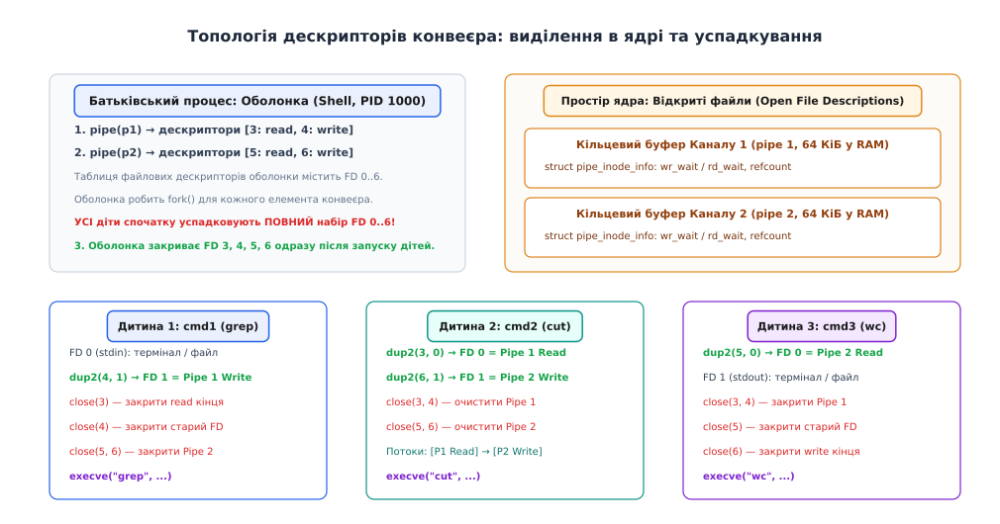
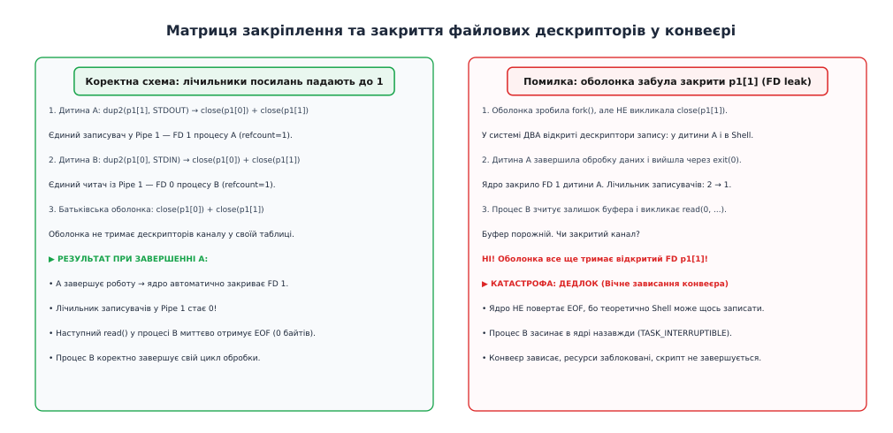
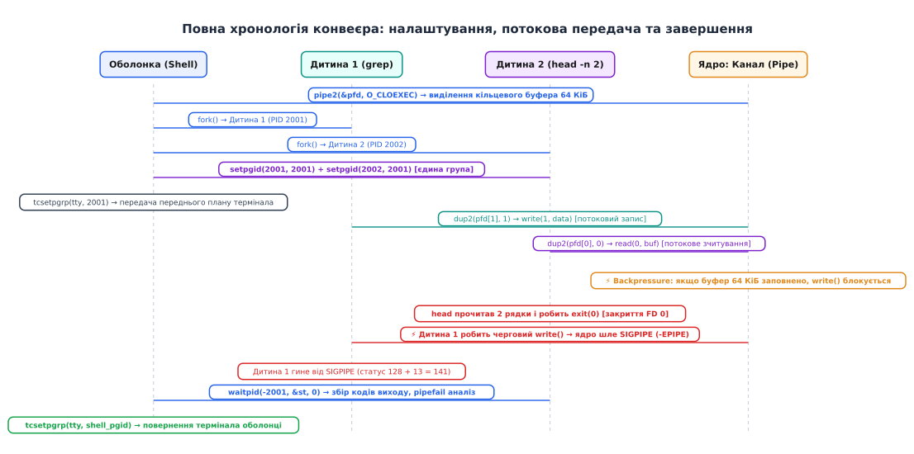

# Оболонка як композитор: один конвеєр наскрізь

<preknowlist>
- [Канали та черги FIFO](topic:unix-linux/pipe-and-fifo) — кільцевий буфер пам'яті ядра для односпрямованої передачі байтового потоку між процесами.
- [Перенаправлення вводу-виводу](topic:unix-linux/redirection-model) — механізм підміни файлових дескрипторів 0, 1, 2 через системний виклик dup2.
- [Сеанси та процесні групи](topic:unix-linux/sessions-and-process-groups) — групування процесів для спільного розподілу сигналів термінала й керування завданнями.
- [Коди завершення процесів](topic:unix-linux/exit-status) — однобайтовий статус виходу та макроси аналізу причин завершення waitpid.
</preknowlist>

Коли системний інженер вводить у термінал рядок `cat /var/log/nginx/access.log | grep " 500 " | cut -d' ' -f1 | sort | uniq -c | sort -nr | head -n 10`, у користувача, знайомого лише з процедурним програмуванням, виникає інтуїтивна ілюзія послідовного виконання. Здається, що спочатку `cat` зчитує весь лог-файл розміром 50 гігабайтів і записує його кудись на диск, потім `grep` фільтрує всі рядки, потім `cut` обрізає стовпчики, і лише наприкінці `head` відбирає перші десять записів. Якби операційна система працювала саме так, для аналізу великого масиву знадобилися б сотні гігабайтів тимчасового дискового простору, а час виконання вимірювався б десятками хвилин через постійне очікування запису проміжних файлів.

Реальність Unix влаштована принципово інакше: **всі шість процесів народжуються практично одночасно і виконуються паралельно на різних ядрах процесора**. Командна оболонка (англ. *shell*) не є простим інтерпретатором, який чекає на завершення кожного окремого кроку: вона діє як композитор і диригент симфонічного оркестру. Оболонка налаштовує топологію комунікаційних каналів у пам'яті ядра, зв'язує файлові дескриптори процесів у єдиний ланцюг, призначає спільну групу для керування сигналами термінала й відходить у бік, дозволяючи даним текти крізь конвеєр з апаратною швидкістю оперативної пам'яті.

Історичні передумови появи цієї моделі, від перших меморандумів Bell Labs до переписування системних утиліт, докладно описано у вставці: [народження конвеєра як фундаментальної парадигми](topic:unix/shell-is-a-composer/hist-pipe-conception.md).

## Топологія каналів: чому труби народжуються ДО процесів

Головний системний закон побудови конвеєрів полягає в тому, що **всі канали зв'язку мають бути виділені в ядрі до того, як народиться перший дочірній процес**.

Для побудови конвеєра з `N` команд оболонці потрібно рівно `N - 1` неіменованих каналів (англ. *pipes*). Кожен канал створюється системним викликом `pipe()` або `pipe2()` (від англ. *pipe* — «труба», «канал»), який виділяє в просторі ядра кільцевий буфер пам'яті та повертає батьківському процесу два файлові дескриптори: дескриптор читання (`read end`) та дескриптор запису (`write end`).

Чому цей крок обов'язково має передувати розгалуженню процесів? Коли процес викликає `fork()` (англ. *fork* — «розвилка»), ядро створює точну копію таблиці файлових дескрипторів батька для новонародженої дитини. Проте самі індекси в таблиці дескрипторів вказують на ті самі системні описи відкритих файлів (`struct file` у ядрі). Якщо батьківська оболонка створить канал заздалегідь, і перший, і другий дочірній процеси після власного народження автоматично матимуть дескриптори, що вказують на **один і той самий кільцевий буфер** у пам'яті ядра.

Якби оболонка спочатку створила дочірні процеси, а потім спробувала налаштувати зв'язок, дитина не змогла б передати свій дескриптор сусідньому процесу без складних і повільних механізмів міжпроцесної передачі дескрипторів через сокети домену Unix (`SCM_RIGHTS`).



*Топологія дескрипторів: батьківська оболонка створює канали в ядрі до розгалуження, а дочірні процеси успадковують таблицю та закріплюють стандартні потоки.*

Після створення всіх `N - 1` каналів таблиця файлових дескрипторів батьківської оболонки містить повний набір точок підключення: дескриптори `3, 4` для першого каналу, `5, 6` для другого, і так далі аж до дескрипторів `2N-1, 2N` для останнього каналу. Кожна новонароджена дитина на мить отримує цей гігантський масив відкритих дескрипторів, після чого починається тонка хірургічна робота з переналаштування власного оточення.

## Танець дескрипторів: dup2, закріплення потоків і закриття зайвих кінців

Коли дочірній процес прокидається після `fork()`, він виконує код у вікні між розгалуженням і заміною виконуваного образу через `execve()`. У цьому часовому проміжку процес володіє повною свободою модифікації власних системних дескрипторів.

Кожна програма в Unix за замовчуванням очікує дані з дескриптора `0` (стандартний вхід, `stdin`), надсилає результати в дескриптор `1` (стандартний вивід, `stdout`) і друкує діагностичні повідомлення в дескриптор `2` (стандартний потік помилок, `stderr`). Завдання дочірнього процесу — підмінити дескриптори `0` та `1` відповідними кінцями каналів за допомогою системного виклику `dup2()` (від лат. *duplicare* — «подвоювати»).

Системний виклик `dup2(oldfd, newfd)` виконує дві дії атомарно: якщо дескриптор `newfd` уже відкритий (наприклад, дескриптор `1` вказує на термінал), ядро закриває його, після чого копіює посилання з `oldfd` у комірку `newfd`.

Правила закріплення дескрипторів для процесу на позиції `i` (від `0` до `N - 1`):

1. **Перший процес (`i = 0`, джерело конвеєра)**:
   - Стандартний вхід (`FD 0`) залишається без змін (зчитування з термінала або файлу, якщо вказано `< input.txt`).
   - Стандартний вивід (`FD 1`) підключається до записувача першого каналу: `dup2(pipes[0][1], STDOUT_FILENO)`.
2. **Проміжні процеси (`0 < i < N - 1`, фільтри)**:
   - Стандартний вхід (`FD 0`) підключається до читача попереднього каналу: `dup2(pipes[i-1][0], STDIN_FILENO)`.
   - Стандартний вивід (`FD 1`) підключається до записувача наступного каналу: `dup2(pipes[i][1], STDOUT_FILENO)`.
3. **Останній процес (`i = N - 1`, споживач конвеєра)**:
   - Стандартний вхід (`FD 0`) підключається до читача останнього каналу: `dup2(pipes[N-2][0], STDIN_FILENO)`.
   - Стандартний вивід (`FD 1`) залишається підключеним до термінала (або файлу `> output.txt`).

Повний довідник системних викликів, сигнатур та структур керування конвеєрами наведено у вставці: [довідник системних викликів і керування конвеєром](topic:unix/shell-is-a-composer/api-pipeline-primitives.md).

### Смертельна пастка: чому незакритий дескриптор викликає вічний дедлок

Операція `dup2()` лише створює копію дескриптора під стандартним номером `0` або `1`. Оригінальні дескриптори `pipes[k][0]` та `pipes[k][1]`, а також дескриптори всіх інших етапів конвеєра все ще залишаються відкритими в таблиці процесу.

Тут криється найнебезпечніша системна пастка конвеєрів: **якщо процес або батьківська оболонка забуде викликати `close()` для невикористовуваних дескрипторів каналу, конвеєр зависне назавжди**.



*Перепідключення через dup2 та закриття невикористовуваних дескрипторів: лічильники посилань записувачів повинні впасти до одиниці для генерації EOF.*

Механізм роботи сигналу кінця файлу (EOF, End of File) у каналах ядра спирається на лічильник посилань `struct file.f_count`:
- Системний виклик `read()` з каналу повертає `0` (стан EOF) **виключно тоді, коли буфер каналу порожній І в системі не залишилося жодного відкритого файлового дескриптора, що вказує на кінець запису цього каналу (`writers == 0`)**.
- Якщо в системі залишається хоча б один відкритий дескриптор запису (наприклад, у самій оболонці або в паралельному дочірньому процесі), ядро вважає, що запис нових даних теоретично можливий у майбутньому.
- У результаті процес-читач, вичерпавши всі наявні дані, не отримує EOF, а **засинає в ядрі назавжди** в очікуванні нової порції байтів.

Тому кожна дитина одразу після виклику `dup2()` зобов'язана в циклі закрити **всі без винятку** вихідні дескриптори масиву `pipes`. Батьківська оболонка також зобов'язана закрити всі дескриптори каналів у своєму власному процесі негайно після того, як останній дочірній процес буде створено.

Практичну реалізацію безпечного очищення дескрипторів та запуск складних конвеєрів двома мовами (C та C++) продемонстровано у вставці: [програмний композитор конвеєрів](topic:unix/shell-is-a-composer/proj-pipeline-composer.md).

## Комбінації перенаправлень у конвеєрі: об'єднання потоків

Часто виникає потреба передати у конвеєр не лише стандартний вивід програми, але й її діагностичні повідомлення про помилки (наприклад, для фільтрації повного логу утиліти через `grep`):

```sh
# Перенаправлення stderr у stdout для передачі в конвеєр
cmd 2>&1 | grep "ERROR"
```

Сучасні оболонки (Bash 4.0+) підтримують скорочений синтаксис `cmd |& grep "ERROR"`, проте під капотом ядро виконує однакову послідовність операцій:

1. Дочірній процес спочатку закріплює свій стандартний вивід у канал: `dup2(pipefd[1], STDOUT_FILENO)`.
2. Потім дублює дескриптор 1 у дескриптор 2: `dup2(STDOUT_FILENO, STDERR_FILENO)`.
3. Тепер обидва дескриптори (і 1, і 2) вказують на той самий відкритий опис записувача каналу в ядрі.

### Чому порядок перенаправлень має вирішальне значення

У роботі з дескрипторами критично розуміти, що операції виконуються **зліва направо**:

```sh
# ВАРІАНТ А: Правильний запис у файл обох потоків
cmd > output.log 2>&1

# ВАРІАНТ Б: Помилковий запис (stderr залишиться на екрані!)
cmd 2>&1 > output.log
```

Розберемо, що відбувається на рівні системних викликів:
- **У варіанті А**: спочатку дескриптор 1 перемикається на файл `output.log`. Потім `dup2(1, 2)` копіює дескриптор 1 (який вже вказує на файл) у дескриптор 2. У результаті і stdout, і stderr пишуть у файл.
- **У варіанті Б**: спочатку `dup2(1, 2)` копіює дескриптор 1 (який у цей момент все ще вказує на термінал) у дескриптор 2. Потім дескриптор 1 перемикається на файл `output.log`. У результаті дескриптор 1 пише у файл, але дескриптор 2 продовжує писати на екран термінала!

## Процесні групи та володіння терміналом: ізоляція сигналів

Коли користувач натискає комбінацію клавіш `Ctrl+C` під час виконання довгого конвеєра, виникає фундаментальне архітектурне питання: чому гинуть усі програми в конвеєрі, але сама командна оболонка не завершує роботу і продовжує приймати нові команди?

Відповідь полягає в механізмі **груп процесів** (англ. *process groups*) та керування переднім планом термінала (англ. *job control*).

Усі процеси в операційній системі належать до певної групи процесів, яка ідентифікується числом `PGID` (Process Group ID). Коли оболонка запускає конвеєр із шести команд, вона не залишає їх у своїй власній групі. Замість цього оболонка створює для конвеєра **нову окрему групу процесів**:

:::tabs
```c
// Перший процес стає лідером нової групи
pid_t pgid = child_pids[0];
setpgid(child_pids[0], pgid);

// Усі наступні процеси конвеєра приєднуються до цієї самої групи
for (size_t i = 1; i < num_cmds; ++i) {
    setpgid(child_pids[i], pgid);
}
```
```cpp
// Призначення групи процесів у C++
const pid_t pgid = child_pids.front();
::setpgid(child_pids.front(), pgid);

for (size_t i = 1; i < child_pids.size(); ++i) {
    ::setpgid(child_pids[i], pgid);
}
```
:::

### Стан гонитви під час налаштування PGID

У налаштуванні групи процесів криється підступний стан гонитви (англ. *race condition*). Якщо виклик `setpgid()` виконає лише дочірній процес, планувальник ядра може передати керування батьківській оболонці до того, як дитина встигне викликати функцію. Оболонка спробує передати передній план термінала неіснуючій групі й отримає системну помилку.

Якщо ж виклик `setpgid()` виконає лише батьківський процес, дитина може встигнути викликати `execve()` до того, як батько встановить групу. Після заміни образу ядро забороняє зміну PGID з міркувань безпеки (помилка `EACCES`).

**Стандарт POSIX вимагає викликати `setpgid()` двічі: і в тілі батька, і в тілі кожної дитини одразу після `fork()`**. Той процес, який виконає системний виклик першим, ініціалізує групу, а другий виклик завершиться безпомилково.

### Передача термінала передньому плану

Після формування групи процесів інтерактивна оболонка викликає системний виклик драйвера термінала:

:::tabs
```c
tcsetpgrp(STDIN_FILENO, pgid);
```
```cpp
::tcsetpgrp(STDIN_FILENO, pgid);
```
:::

Цей виклик призначає групу конвеєра `pgid` активною передньоплановою групою керуючого термінала (англ. *controlling terminal*).

Від цього моменту апаратний драйвер термінала змінює маршрутизацію сигналів:
- Коли користувач натискає `Ctrl+C`, драйвер термінала генерує сигнал переривання `SIGINT` (сигнал № 2) і надсилає його **всім процесам передньопланової групи `pgid`**.
- Оболонка, перебуваючи в іншій групі процесів у фоновому стані очікування, **не отримує сигнал `SIGINT`** і залишається неушкодженою.
- Коли всі дочірні процеси конвеєра завершують роботу, оболонка відновлює контроль над терміналом, викликаючи `tcsetpgrp(STDIN_FILENO, shell_pgid)`.

## Саморегуляція швидкості: буфер 64 КіБ, кеш-пам'ять та Backpressure

Однією з найдосконаліших інженерних властивостей конвеєрів Unix є **повна відсутність потреби в конфігурації швидкості передачі даних**.

Уявімо конвеєр, де перша програма (`cat`) здатна зчитувати дані з надшвидкого NVMe-накопичувача зі швидкістю 3 ГБ/с, а друга програма (`grep` зі складним регулярним виразом) може обробляти лише 30 МБ/с. Чому пам'ять комп'ютера не переповнюється за лічені секунди?

Механізм регулювання спирається на кільцевий буфер пам'яті ядра (`struct pipe_inode_info`):
1. За замовчуванням у сучасних ядрах Linux місткість буфера каналу становить **64 КіБ** (16 сторінок оперативної пам'яті по 4096 байтів).
2. Коли процес-виробник (`cat`) записує дані швидше, ніж споживач встигає їх обробляти, буфер розміром 64 КіБ швидко заповнюється до краю.
3. Щойно вільне місце в кільці вичерпується, системний виклик `write()` процесу-виробника **блокується в ядрі**. Процес переводиться планувальником у стан сну (`TASK_INTERRUPTIBLE`) на черзі очікування `pipe->wr_wait` і не споживає такти процесора.
4. Процес-споживач (`grep`) виконує `read()`, зчитує чергову порцію байтів і звільняє місце в буфері.
5. Ядро миттєво пробуджує заблокований процес-виробник, дозволяючи йому дозаписати наступний блок даних.
6. Якщо ж виробник працює повільніше за споживача, блокується споживач на системному виклику `read()` на черзі `pipe->rd_wait`, доки в буфері не з'являться нові байти.

Цей автоматичний двосторонній зворотний зв'язок називається **зворотним тиском** (англ. *backpressure*). Незалежно від того, скільки терабайтів даних проходить крізь конвеєр із десяти команд, сумарне споживання оперативної пам'яті каналів ядра залишається обмеженим константою: `9 × 64 КіБ = 576 КіБ`.

### Локальність процесорного кешу L1/L2

Розмір буфера 64 КіБ обрано не випадково. Цей обсяг ідеально вкладається в кеш другого рівня (L2 cache) сучасних процесорів (який зазвичай має розмір від 512 КіБ до 1 МіБ на одне ядро).

Коли два процеси конвеєра виконуються на сусідніх ядрах процесора, сторінки буфера каналу залишаються гарячими в спільному кеші L3 або швидко передаються крізь протокол когерентності кешів без звернення до повільної системної оперативної пам'яті (DRAM). Байти, записані виробником, зчитуються споживачем буквально з процесорного кешу, забезпечуючи гігабайтну пропускну здатність передачі даних між процесами.

### Атомарність запису та константа PIPE_BUF

Стандарт POSIX визначає фундаментальну системну константу `PIPE_BUF` (у Linux вона дорівнює **4096 байтів** = 1 сторінка):
- Якщо процес записує в канал блок розміром `len <= PIPE_BUF`, ядро гарантує, що запис виконається **строго атомарно**. Навіть якщо в один і той самий канал одночасно пишуть кілька паралельних процесів, їхні байти ніколи не перемішаються.
- Якщо розмір запису `len > PIPE_BUF`, ядро може розбити дані на кілька фрагментів, чергуючи їх із записами інших процесів.

## Буферизація простору користувача (stdio): коли бібліотека затримує потік

Окрім кільцевого буфера ядра розміром 64 КіБ, у роботу конвеєра втручається **буферизація стандартної бібліотеки C (libc / stdio)**.

Коли програма на C викликає `printf()` або `puts()`, бібліотека не виконує системний виклик `write()` на кожен рядок. Замість цього вона перевіряє тип кінцевого пристрою через системний виклик `isatty(STDOUT_FILENO)`:
- Якщо `stdout` підключено до інтерактивного термінала, вмикається **построкова буферизація** (англ. *line buffering*): дані скидаються в ядро щоразу при зустрічі символу нового рядка `\n`.
- Якщо ж `stdout` підключено до каналу (pipe) або дискового файлу, бібліотека автоматично перемикається в режим **повної блокової буферизації** (англ. *full block buffering*, зазвичай 4096 байтів).

Це призводить до відомої проблеми «зависання» живих потоків у реальному часі:

```sh
# Здається, що конвеєр завис і не виводить помилки:
tail -f /var/log/app.log | grep "ERROR" | awk '{print $1, $5}'
```

Утиліти `grep` та `awk`, виявивши, що їхній вивід спрямовано в канал, накопичують 4096 байтів у внутрішньому буфері процесу перед тим, як зробити єдиний виклик `write()`. Якщо помилки з'являються раз на хвилину, користувач на екрані не побачить жодного рядка протягом годин.

### Способи усунення затримки буферизації:
1. Використання спеціальних прапорців утиліт: `grep --line-buffered` змушує `grep` скидати кожен знайдений рядок негайно.
2. Використання системної утиліти `stdbuf`: команда `stdbuf -oL -eL program` підміняє параметри буферизації через механізм `LD_PRELOAD` перед запуском бінарного файлу.

## Каскадне завершення: SIGPIPE та зламана труба (Broken Pipe)

Що відбувається, коли споживач даних завершує роботу раніше за виробника?

Розглянемо класичний приклад генерації нескінченного потоку даних:

```sh
yes | head -n 5
```

Команда `yes` генерує нескінченний потік рядків `y\n` у стандартний вивід. Команда `head -n 5` зчитує рівно п'ять рядків, виводить їх на екран і викликає системний виклик `exit(0)`.

Яким чином ядро зупиняє нескінченний цикл утиліти `yes` без явного втручання користувача?

1. Коли процес `head` викликає `exit(0)`, ядро операційної системи закриває всі його відкриті файлові дескриптори, включно з дескриптором `0` (читачем каналу).
2. Лічильник активних читачів у структурі каналу `pipe_inode_info` стає рівним нулю (`readers == 0`).
3. Процес `yes`, нічого не підозрюючи, викликає черговий системний виклик `write(1, "y\n", 2)`.
4. Ядро виявляє спробу запису в канал без читачів (англ. *broken pipe* — «зламана труба») і виконує дві системні дії:
   - Генерує та доставляє процесу `yes` системний сигнал **`SIGPIPE`** (сигнал № 13).
   - Якщо процес встановив ігнорування сигналу або має власний обробник, системний виклик `write()` повертає помилку `-1`, виставляючи `errno = EPIPE`.
5. За замовчуванням диспозиція сигналу `SIGPIPE` — негайне аварійне завершення процесу (`Terminate`). Процес `yes` миттєво гине.



*Хронологія життєвого циклу конвеєра: від створення каналів і призначення групи процесів до паралельного потоку даних із саморегуляцією швидкості та каскадного завершення через SIGPIPE.*

Цей механізм забезпечує блискавичне **каскадне завершення всього ланцюжка**: якщо у конвеєрі з десяти команд остання утиліта завершує роботу, сигнал `SIGPIPE` хвилею прокочується назад по ланцюгу від 9-ї до 1-ї команди, миттєво зупиняючи всі процеси без витоку процесорного часу.

## Підпроцеси, ізоляція змінних та вбудовані команди (Builtins)

Глибоке розуміння моделі `fork()` дає відповідь на одну з найпопулярніших загадок скриптування в оболонці Bash: **чому змінні, змінені всередині конвеєра, зникають після його завершення?**

Розглянемо поширений фрагмент скрипту:

```sh
count=0
cat numbers.txt | while read -r num; do
    count=$((count + 1))
done

echo "Всього рядків: $count" # Виведе: 0 !
```

Чому змінна `count` залишилася рівною нулю, попри те, що цикл обробив тисячі рядків?

У стандарті POSIX та оболонці Bash **кожен елемент конвеєра виконується в окремому дочірньому процесі (subshell)**:
1. Батьківська оболонка робить `fork()` для циклу `while`.
2. Дочірній процес отримує власну ізольовану копію адресного простору пам'яті, де змінна `count` дійсно збільшується до 1000.
3. Коли цикл завершується, дочірній процес завершує роботу, і його адресний простір повністю знищується ядром.
4. Батьківська оболонка, яка весь цей час перебувала у виклику `waitpid()`, зберігає своє оригінальне значення `count = 0`.

У деяких оболонках (наприклад, Zsh або KornShell `ksh93`) останній елемент конвеєра оптимізовано: він виконується в контексті самої батьківської оболонки без `fork()`, що дозволяє зберігати значення змінних. В оболонці Bash для досягнення такої поведінки потрібно увімкнути спеціальну опцію `shopt -s lastpipe` (працює лише у неінтерактивних скриптах з вимкненим контролем завдань).

### Вбудовані команди в конвеєрі

Якщо елементом конвеєра є вбудована команда оболонки (наприклад, `echo`, `printf`, `read`, `pwd`, `test`), оболонка не викликає `execve()`. Проте вона все одно зобов'язана зробити `fork()` для створення ізольованого підпроцесу, налаштувати дескриптори через `dup2()` і виконати функцію C з власного внутрішнього коду. Єдиний виняток — якщо вбудована команда змінює стан батька (наприклад, `cd`), виконання її в середині конвеєра `cd /tmp | ls` не змінить каталог батьківської оболонки, оскільки зміна відбудеться у тимчасовій дитині.

## Підстановка процесів: розгалуження конвеєрів

Класичний оператор `|` з'єднує процеси в строго лінійний ланцюжок 1-в-1. Проте що робити, коли програма очікує два або три незалежні потоки даних одночасно (наприклад, утиліта `diff`, яка порівнює вивід двох незалежних команд)?

Сучасні оболонки підтримують механізм **підстановки процесів** (англ. *process substitution*), що використовує синтаксис `<(команда)` для входу та `>(команда)` для виходу:

```sh
diff -u <(sort file1.txt) <(sort file2.txt)
```

Під капотом оболонка реалізує цей вираз через знайомі примітиви каналів:
1. Оболонка створює два незалежні неіменовані канали через `pipe()`.
2. Робить `fork()` для `sort file1.txt`, перенаправляючи його `stdout` у перший канал.
3. Робить `fork()` для `sort file2.txt`, перенаправляючи його `stdout` у другий канал.
4. У командному рядку замість виразів `<(...)` оболонка підставляє спеціальні шляхи до файлових дескрипторів читання у віртуальній файловій системі:
   ```sh
   diff -u /dev/fd/63 /dev/fd/62
   ```
5. Програма `diff` відкриває вказані дескриптори як звичайні файли на читання, зчитуючи паралельні потоки без створення тимчасових файлів на диску.

## Діагностика конвеєра в реальному часі через procfs та lsof

Для системного інженера вкрай важливо вміти перевірити стан працюючого або завислого конвеєра в реальній системі:

### 1. Пошук пов'язаних процесів за номером інода каналу

Кожен канал у ядрі Linux має унікальний системний номер інода (inode number). Перевірити, які процеси з'єднані між собою, можна через команду `lsof` або перегляд каталогу `/proc/<PID>/fd/`:

```sh
# Перегляд відкритих дескрипторів процесу grep (PID 2002)
ls -l /proc/2002/fd/
# lr-x------ 1 user user 64 FD 0 -> pipe:[1054321]  (читач)
# l-wx------ 1 user user 64 FD 1 -> pipe:[1054322]  (записувач)

# Пошук процесу-партнера, який пише в pipe:[1054321]:
ls -l /proc/*/fd/* 2>/dev/null | grep "pipe:\[1054321\]"
# /proc/2001/fd/1 -> pipe:[1054321]  (процес 2001 є записувачем!)
```

### 2. Перевірка заповнення буфера через fdinfo

Якщо конвеєр завис, інженер може зазирнути всередину структури каналу через псевдофайл `/proc/<PID>/fdinfo/<FD>`:

```sh
cat /proc/2002/fdinfo/0
# pos:    0
# flags:  00 (O_RDONLY)
# mnt_id: 15
# ino:    1054321
```

Якщо інспектор показує заповнений буфер і заблокованого записувача, це однозначно вказує на те, що вузьким місцем конвеєра є наступний споживач даних.

## Збирання виходу: waitpid, коди повернення та опція pipefail

Після запуску всіх дочірніх процесів та закриття власних дескрипторів каналів батьківська оболонка переходить у стан збирання результатів.

Оболонка викликає системний виклик `waitpid()` у циклі для кожного народженого процесу:

:::tabs
```c
int wstatus;
waitpid(child_pids[i], &wstatus, 0);
```
```cpp
int wstatus = 0;
::waitpid(child_pids[i], &wstatus, 0);
```
:::

Чому оболонка зобов'язана викликати `waitpid()` для **всіх** процесів конвеєра, навіть якщо її цікавить лише остання команда? Якщо процес завершується, а батько не зчитує його статус виходу, структура процесу залишається в таблиці ядра у стані **зомбі** (англ. *zombie process*, стан `Z`). Накопичення тисяч зомбі-процесів призводить до вичерпання системного ліміту ідентифікаторів (`PID exhaustion`).

### Стандартна семантика POSIX та небезпека прихованих збоїв

За стандартом POSIX за замовчуванням кодом виходу всього конвеєра є **код виходу останньої команди конвеєра**:

```
Статус конвеєра за замовчуванням:
$? = ExitStatus(cmd[N-1])
```

Ця семантика створює класичну пастку тихих збоїв в автоматизованих скриптах та пайплайнах неперервної інтеграції (CI/CD):

```sh
# Якщо файл /var/log/app.log відсутній, grep завершиться з кодом помилки 2.
# Проте sort успішно прочитає порожній вхід і завершиться з кодом 0!
grep "FATAL" /var/log/app.log | sort

echo $? # Виведе: 0 (УСПІХ!), попри те, що дані взагалі не оброблялися!
```

### Порятунок: семантика pipefail

Для розв'язання цієї проблеми сучасні оболонки (Bash, Zsh, Dash, Ksh) підтримують режим `pipefail`:

```sh
set -o pipefail
```

У режимі `pipefail` оболонка зберігає коди виходу всіх етапів конвеєра у спеціальному системному масиві (`PIPESTATUS` у Bash або `$pipestatus` у Zsh) і обчислює підсумковий статус за суворим правилом:

```
Статус конвеєра при увімкненому pipefail:
- Якщо ВСІ команди завершилися з кодом 0 -> $? = 0.
- Якщо хоча б одна команда зазнала збою -> $? дорівнює коду виходу
  НАЙПРАВІШОЇ команди, яка завершилася з ненульовим статусом.
```

Якщо програму було вбито сигналом (наприклад, `SIGPIPE`), оболонка транслює сигнал у код виходу за правилом `128 + SignalNumber` (для `SIGPIPE` це `128 + 13 = 141`, для `SIGINT` це `128 + 2 = 130`).

> 🔧 **Навіщо це.**
> Розуміння наскрізної механіки конвеєрів є фундаментом системного проєктування в Linux. Сучасні високонавантажені архітектури — від обробників логів на зразок Vector і Fluentd до потокових медіасерверів GStreamer та контейнерних рантаймів (runc, containerd) — використовують саме цю модель.
> Замість виділення гігабайтних буферів у пам'яті програми передають дані крізь ланцюжки неіменованих каналів, покладаючись на апаратний зворотний тиск буферів ядра (backpressure), нульове копіювання через системний виклик `splice()` та автоматичне каскадне очищення ресурсів за допомогою сигналів `SIGPIPE`.

## Повний синтез: анатомія системного оркестру

Розглянувши всі ланки механізму, зведемо життя одного конвеєра в єдину цілісну картину:

1. **Парсинг та планування**: оболонка розбиває введений рядок на `N` команд і заздалегідь виділяє `N - 1` каналів у ядрі через `pipe2(..., O_CLOEXEC)`.
2. **Паралельне розгалуження**: оболонка запускає `N` процесів через `fork()`. Усі процеси об'єднуються в спільну групу процесів `PGID` через подвійний виклик `setpgid()`.
3. **Хірургія дескрипторів**: кожен дочірній процес викликає `dup2()`, перемикаючи свій стандартний вхід на читача попереднього каналу, а стандартний вивід — на записувача наступного, після чого закриває всі оригінальні дескриптори каналів.
4. **Очищення в батькові**: оболонка закриває всі дескриптори каналів у своєму процесі, забезпечуючи коректність майбутніх сигналів EOF.
5. **Заміна образу**: кожен дочірній процес викликає `execve()`, перетворюючись на цільову системну утиліту.
6. **Керування терміналом**: оболонка передає передній план термінала групі конвеєра через `tcsetpgrp()`.
7. **Потокова обробка та Backpressure**: дані течуть крізь кільцеві буфери ядра. Швидкість виробників і споживачів автоматично синхронізується через блокування на чергах очікування.
8. **Каскадне згортання**: ранній вихід споживача генерує `SIGPIPE` для виробників, миттєво згортаючи upstream-ланцюг.
9. **Збирання та звітність**: оболонка збирає статуси всіх `N` процесів через `waitpid()`, запобігаючи витоку зомбі, повертає собі контроль над терміналом і виставляє підсумковий код `$?` з урахуванням семантики `pipefail`.
