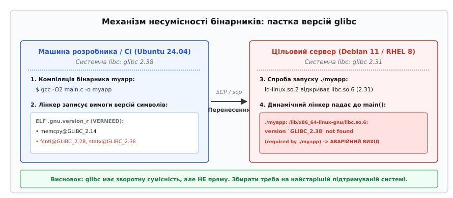
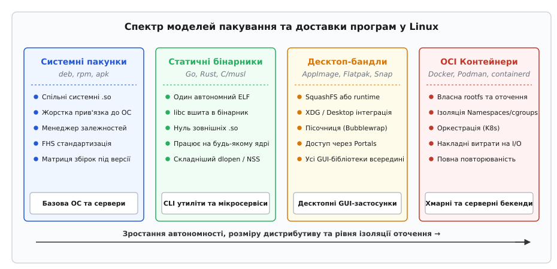
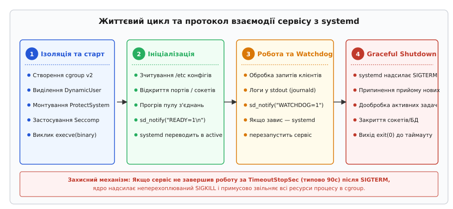

# Доставити свою програму на чужий Linux

<preknowlist>
- [Модель пакетного менеджера](topic:sys-unix/package-manager-model) — репозиторії, метадані та автоматичне розв'язання залежностей.
- [Статичне й динамічне лінкування](topic:sys-unix/static-and-dynamic-linking) — як компілятор та компонувальник збирають бінарний файл ELF.
- [Динамічний завантажувач](topic:sys-unix/dynamic-loader) — пошук і завантаження спільних бібліотек у пам'ять під час виконання execve.
- [Самодостатні пакунки: AppImage, Flatpak, Snap](topic:sys-unix/self-contained-bundles) — ізоляція оточення та пакування залежностей разом із бінарником.
- [Контейнер проти пакунка](topic:sys-unix/containers-vs-packages) — простори імен (namespaces), cgroups та створення власної кореневої файлової системи rootfs.
</preknowlist>

Розробник компілює мережевий сервіс мовою C++ на сучасному ноутбуці з Ubuntu 24.04, перевіряє його локальну працездатність, копіює скомпільований бінарний файл `ELF` через `scp` на робочий сервер під керуванням Debian 11 або RHEL 8 і під час першої ж спроби запуску стикається з миттєвою аварійною зупинкою:

```
./backend-service: /lib/x86_64-linux-gnu/libc.so.6: version `GLIBC_2.38' not found (required by ./backend-service)
```

Програма навіть не дійшла до виконання першої інструкції у функції `main()`: динамічний завантажувач ядра Linux `ld-linux.so` виявив несумісність символів стандартної бібліотеки C і примусово перервав процес через системний виклик `exit_group()`. Ця помилка викриває фундаментальну інженерну реальність: на відміну від операційних систем із фіксованим прикладним двійковим інтерфейсом (ABI, англ. *Application Binary Interface*), екосистема Linux є гетерогенною множиною незалежних дистрибутивів із різними версіями компіляторів, версіями системних бібліотек, шляхами у файловій системі та механізмами ініціалізації.

Доставка програмного забезпечення на Linux вимагає глибокого розуміння чотирьох конкуруючих парадигм дистрибуції та залізної дисципліни підготовки коду до експлуатації у виробничому середовищі.

---

### 1. Анатомія двійкової несумісності в Linux

Щоб зрозуміти, чому скомпільований бінарник відмовляється працювати на сусідньому комп'ютері з тим самим процесором x86-64, необхідно розглянути процес завантаження, компонування та зв'язування символів у форматі `ELF` (англ. *Executable and Linkable Format*).


*Механізм відмови динамічного завантажувача ld-linux при запуску бінарника на старішій версії glibc через вимогу символів VERNEED.*

#### 1.1. Що відбувається під час системного виклику `execve`

Коли користувач або скрипт запускає двійковий файл, ядро виконує системний виклик `execve()`:

1. **Перевірка заголовка ELF:** Ядро зчитує перші 64 байти файлу (структуру `Elf64_Ehdr`), перевіряє сигнатуру `\x7fELF`, тип архітектури (`EM_X86_64`) та таблицю сегментів програми (`Program Headers`).
2. **Пошук динамічного інтерпретатора:** Якщо бінарник скомпільовано динамічно, ядро знаходить сегмент типу `PT_INTERP`, який містить рядок шляху до системного завантажувача (наприклад, `/lib64/ld-linux-x86-64.so.2`).
3. **Передача керування завантажувачу:** Ядро завантажує в адресний простір коду сам інтерпретатор `ld-linux` і передає керування на його точку входу, передаючи вказівник на допоміжний вектор `auxv` (*Auxiliary Vector*), змінні середовища та аргументи командного рядка.
4. **Формування зв'язаного списку `link_map`:** Динамічний завантажувач парсить секцію `.dynamic` бінарника, знаходить усі записи типу `DT_NEEDED` (список потрібних бібліотек, таких як `libc.so.6`, `libm.so.6`, `libssl.so.3`) та рекурсивно відображає їх у пам'ять за допомогою системного виклику `mmap()`.

#### 1.2. Пастка версіонування символів GNU C Library (glibc)

Стандартна системна бібліотека `glibc` використовує механізм версіонування символів (*symbol versioning*). Коли вихідний код викликає базову функцію (наприклад, `fcntl()`, `memcpy()`, `pthread_create()` чи `statx()`), компілятор та статичний компонувальник `ld` прив'язують цей виклик не просто до імені функції, а до найновішої версії цього символу, доступної в системних заголовках машини збірки.

Під час компіляції компонувальник записує у спеціальну секцію виконуваного файлу `.gnu.version_r` таблицю залежностей від версій:

```
# Перегляд версій символів у скомпільованому файлі:
$ readelf -V ./backend-service

Version needs section '.gnu.version_r' contains 1 entry:
  File: libc.so.6
    0x0020: Name: GLIBC_2.38  Flags: none  Version: 4
    0x0030: Name: GLIBC_2.34  Flags: none  Version: 3
    0x0040: Name: GLIBC_2.14  Flags: none  Version: 2
```

Головний закон сумісності `glibc` стверджує: **бібліотека гарантує зворотну сумісність (старі програми працюють на новішій glibc), але не гарантує прямої сумісності (програми, зібрані з новішою glibc, не запускаються на старішій)**. Якщо у коді була використана функція, версія якої позначена як `GLIBC_2.38` (наприклад, оптимізована під нові векторні інструкції версія `memcpy()` або новий системний виклик `statx()`), динамічний завантажувач цільової машини з `glibc 2.31` негайно відмовиться запускати бінарник.

Звідси випливає перше базове правило портативної двійкової збірки: **динамічно скомпільований двійковий файл повинен збиратися в середовищі з найстарішою версією glibc серед усіх цільових дистрибутивів, які планується підтримувати**. Саме тому комерційні дистриб'ютори та великі проекти з відкритим кодом збирають свої пакунки у спеціальних контейнерах на базі застарілих релізів (наприклад, Debian OldStable або Rocky Linux 8).

Для дослідження поведінки завантажувача під час пошуку символів розробники використовують діагностичну змінну оточення `LD_DEBUG`:

```bash
LD_DEBUG=symbols,versions ./backend-service
```

Вивід команди демонструє кожну спробу розв'язання символу, звіряючи версії з файлом `libc.so.6`, що дозволяє точно встановити, яка саме функція спричинила несумісність.

#### 1.3. Ледаче зв'язування проти негайного (Lazy Binding vs Full RELRO)

За замовчуванням у традиційних збірках Linux застосовується ледаче зв'язування символів (*lazy binding*): адреси функцій у спільних бібліотеках не обчислюються під час старту програми. Замість цього під час першого виклику функції керування передається через процедурну таблицю зв'язування (PLT, *Procedure Linkage Table*) до глобальної таблиці зміщень (GOT, *Global Offset Table*), де динамічний завантажувач знаходить адресу та записує її в пам'ять.

У продакшен-середовищі ледаче зв'язування несе дві приховані небезпеки:
1. **Приховані помилки під піковим навантаженням:** Якщо якась специфічна рідкісна гілка коду (наприклад, аварійний обробник помилки бази даних) звертається до функції з відсутньої бібліотеки, програма успішно пропрацює кілька днів, а потім несподівано впаде під час пікового трафіку в момент першого виклику цієї гілки.
2. **Вразливості безпеки (GOT overwrite):** Таблиця GOT залишається доступною для запису (`PROT_WRITE`), що дозволяє зловмиснику перезаписати адреси функцій через переповнення буфера.

Для усунення цих проблем продакшен-бінарники збираються з прапорцями повного захисту релокацій (**Full RELRO**):

```bash
gcc -O2 main.c -Wl,-z,relro -Wl,-z,now -fstack-protector-strong -D_FORTIFY_SOURCE=2 -o myapp
```

Прапорець `-Wl,-z,now` змушує динамічний завантажувач розв'язати абсолютно всі символи ще до виклику `main()`, а `-Wl,-z,relro` переводить усю секцію GOT у режим лише для читання (`MS_RDONLY`), гарантуючи детермінованість запуску та захист пам'яті.

#### 1.4. Розв'язання шляхів до спільних бібліотек (.so)

Якщо програма залежить від додаткових сторонніх бібліотек (наприклад, `libssl.so`, `libuv.so`, `libcurl.so`, `libprotobuf.so`), динамічний завантажувач ядра `ld-linux` виконує пошук за суворим ієрархічним алгоритмом:

1. Шляхи, вказані в заголовку `DT_RPATH` самого виконуваного файлу (якщо відсутній заголовок `DT_RUNPATH`).
2. Каталоги зі змінної середовища `LD_LIBRARY_PATH` поточного процесу.
3. Шляхи, прописані в заголовку `DT_RUNPATH` бінарника.
4. Системний кеш бібліотек `/etc/ld.so.cache` (сформований адміністративною утилітою `ldconfig`).
5. Стандартні системні каталоги `/lib`, `/usr/lib`, `/lib64`, `/usr/lib64` (або multiarch-каталоги на зразок `/usr/lib/x86_64-linux-gnu`).

Якщо цільова операційна система має іншу сонам-версію бібліотеки (наприклад, `libssl.so.3` замість очікуваної `libssl.so.1.1`), завантажувач негайно перериває запуск із помилкою `cannot open shared object file: No such file or directory`.

Для вирішення цієї проблеми під час розповсюдження бінарника разом із власним набором `.so`-бібліотек компонувальнику передають прапорець встановлення відносного шляху пошуку `DT_RUNPATH`:

```bash
gcc -O2 main.c -L./lib -lmylib -Wl,-rpath,'$ORIGIN/lib' -Wl,--enable-new-dtags -o myapp
```

Спеціальна змінна `$ORIGIN` інтерпретується завантажувачем динамічно під час запуску як абсолютний шлях до каталогу, в якому розташований сам виконуваний файл `myapp`. Це дозволяє переносити каталог програми в будь-яке місце файлової системи (наприклад, в `/opt/myapp` або домашній каталог користувача) без порушення зв'язків із внутрішніми бібліотеками.

Крім того, утиліта `patchelf` дозволяє модифікувати заголовки `ELF` уже скомпільованого бінарника, змінюючи шлях динамічного завантажувача (`--set-interpreter`) або список шляхів пошуку бібліотек (`--set-rpath`):

```bash
patchelf --set-rpath '$ORIGIN/../lib:$ORIGIN' ./backend-service
```

---

### 2. Чотири парадигми дистрибуції ПЗ у Linux

Інженерні вимоги до ізоляції, розміру дистрибутиву, простоти оновлення та системної інтеграції привели до формування чотирьох виразних підходів до пакування програм.


*Порівняльний спектр чотирьох парадигм дистрибуції програмного забезпечення в екосистемі Linux.*

#### 2.1. Системні пакунки (deb, rpm, apk)

Системний пакунок — це архів стандартизованого формату (`.deb` для Debian/Ubuntu, `.rpm` для Fedora/RHEL/openSUSE, `.apk` для Alpine), що містить двійкові файли, файли конфігурації, документацію та декларативні метадані (залежності, контрольні суми, перед- та післявстановлювальні скрипти `postinst`/`prerm`).

```
                              ┌───────────────────────────────────┐
                              │     Пакетний менеджер (APT/DNF)   │
                              └─────────────────┬─────────────────┘
                                                │
                 ┌──────────────────────────────┼──────────────────────────────┐
                 ▼                              ▼                              ▼
      ┌────────────────────┐         ┌────────────────────┐         ┌────────────────────┐
      │  Бінарник програми │         │ Спільні бібліотеки │         │ Конфігурація /etc  │
      │    /usr/bin/app    │         │    /usr/lib/*.so   │         │    /etc/app.conf   │
      └────────────────────┘         └────────────────────┘         └────────────────────┘
```

**Внутрішня будова пакунків:**
* **Пакунок `.deb`:** являє собою архів формату `ar`, всередині якого знаходяться три файли: `debian-binary` (версія формату), `control.tar.xz` (метадані, перелік залежностей `Depends`, архітектура та скрипти супроводу `preinst`, `postinst`, `prerm`, `postrm`) та `data.tar.xz` (дерево файлів програми, які розпаковуються безпосередньо в корінь файлової системи `/`).
* **Пакунок `.rpm`:** складається з бінарного заголовка з метаданими та корисного навантаження у форматі архіву `cpio`, стиснутого алгоритмами XZ або Zstandard.

**Механізм автоматичного розрахунку залежностей:**
Сучасні інструменти створення пакунків (наприклад, `dpkg-shlibdeps` або генератори RPM `find-requires`) автоматично сканують скомпільований виконуваний файл за допомогою `readelf -d` та бази даних символів. Якщо бінарник викликає функції з `libssl.so.3`, пакетний менеджер автоматично додає рядок `Depends: libssl3 (>= 3.0.2)` у фінальний маніфест, унеможливлюючи встановлення програми в систему без відповідної бібліотеки.

**Інфраструктура репозиторіїв та криптографічний підпис:**
Дистрибуція через системні пакунки спирається на репозиторії, підписані асиметричними ключами GPG (RSA або Ed25519). Менеджер пакетів завантажує індексний файл метаданих `InRelease` (або пару `Release` та `Release.gpg`), перевіряє цифровий підпис за допомогою збереженого в `/etc/apt/trusted.gpg.d/` або `/etc/pki/rpm-gpg/` відкритого ключа і звіряє хеш-суми `SHA256` для кожного завантаженого файлу `.deb` чи `.rpm`. Це гарантує цілісність коду та унеможливлює підміну бінарників під час мережевого транспортування.

**Переваги підходу:**
* **Максимальна системна інтеграція:** програма автоматично реєструє служби в `systemd`, додає правила `udev`, інтегрує сторінки документації `man` та оновлює кеші MIME-типів.
* **Економія дискового простору та оперативної пам'яті:** завдяки використанню спільних бібліотек сторінки коду `.so` завантажуються в пам'ять ядра лише один раз і розділяються між усіма процесами.
* **Централізована безпека:** коли в системній бібліотеці `OpenSSL` виявляють критичну вразливість, оновлення одного системного пакунка `libssl` автоматично захищає всі програми в системі без необхідності їхнього перекомпілювання авторами.

**Недоліки та вартість експлуатації:**
* **Матриця дистрибутивів:** розробник змушений підтримувати окремі середовища збірки під кожен дистрибутив і кожну версію (Ubuntu 22.04, Ubuntu 24.04, Debian 11, Debian 12, RHEL 8, RHEL 9, Fedora 40), що вимагає складних конвеєрів CI/CD.
* **Повільний цикл оновлення:** потрапляння до офіційних репозиторіїв дистрибутивів зі стабільним циклом релізів (Debian Stable) займає роки, що змушує авторів підтримувати власні PPA, репозиторії APT або COPR.

#### 2.2. Повністю статичні двійкові файли (musl, Go, Rust)

Статичне лінкування повністю усуває залежність від зовнішніх `.so`-бібліотек. Усі виклики функцій з'єднуються на етапі компіляції, утворюючи монолітний виконуваний файл `ELF`, який для своєї роботи вимагає виключно наявності системних викликів ядра Linux.

```
       Динамічний бінарник                       Статичний бінарник
┌─────────────────────────────────┐       ┌─────────────────────────────────┐
│         Код програми            │       │         Код програми            │
├─────────────────────────────────┤       ├─────────────────────────────────┤
│ Секція .interp (ld-linux.so)    │       │     Бібліотека C (musl libc)    │
├─────────────────────────────────┤       ├─────────────────────────────────┤
│ Посилання на libc.so.6          │       │     Криптографія (libssl.a)     │
├─────────────────────────────────┤       ├─────────────────────────────────┤
│ Посилання на libcrypto.so       │       │     Стиснення (libz.a)          │
└─────────────────────────────────┘       └─────────────────────────────────┘
```

Мови програмування Go та Rust за замовчуванням тяжіють до створення повністю або переважно статичних бінарників. Для мов C та C++ еталоном створення статичних програм є альтернативна стандартна бібліотека **musl libc** (на відміну від `glibc`, яка погано пристосована для статичного лінкування через механізм завантаження плагінів `NSS` через `dlopen`).

Збірка статичного бінарника мовою C за допомогою musl:
```bash
musl-gcc -O2 -static -Wall main.c -o standalone-app
```

Перевірка відсутності динамічних залежностей:
```bash
$ file standalone-app
standalone-app: ELF 64-bit LSB executable, x86-64, version 1 (SYSV), statically linked, stripped

$ ldd standalone-app
        not a dynamic executable
```

**Компроміси та підводні камені статичного лінкування:**
* **Розв'язання DNS-імен (`nsswitch.conf`):** `glibc` для роботи функції `getaddrinfo()` динамічно підвантажує бібліотеки розпізнавання імен (`libnss_dns.so`, `libnss_mdns.so`, `libnss_systemd.so`) через системний виклик `dlopen()`. Повністю статичний бінарник, скомпільований із musl, звертається до DNS напряму за адресами з `/etc/resolv.conf`, ігноруючи специфічні корпоративні конфігурації LDAP, Winbind або NSS-плагіни `systemd-resolved`.
* **Оновлення безпеки:** у разі виявлення вразливості у статично вшитій бібліотеці шифрування оновлення операційної системи хоста не захистить програму — розробник зобов'язаний перекомпілювати та перепоставити бінарник.
* **Розмір файлу:** замість бінарника розміром 50 КБ ви отримуєте файл розміром 5–20 МБ через копіювання коду бібліотек у кожну програму.

#### 2.3. Автономні бандли для робочих станцій (AppImage, Flatpak, Snap)

Для розповсюдження десктопних графічних застосунків (GUI на базі GTK, Qt, Electron), де програма тягне за собою сотні мегабайтів графічних бібліотек, розроблено формати самодостатніх бандлів.

| Критерій порівняння | AppImage | Flatpak | Snap |
| :--- | :--- | :--- | :--- |
| **Архітектурний підхід** | Образ SquashFS + вбудований завантажувач AppRun | Рантайм-середовища + шари застосунку (OSTree) | Образи SquashFS, що монтуються демоном snapd |
| **Ізоляція (пісочниця)** | Відсутня за замовчуванням (прямий запуск) | Сувора пісочниця на базі Bubblewrap, cgroups, Seccomp | Мандатний контроль на базі AppArmor та cgroups |
| **Потреба в root/демоні** | Не потребує (використовує FUSE) | Не потребує системного демона (працює в user space) | Вимагає системного фонового демона `snapd` (root) |
| **Доступ до ресурсів** | Прямий доступ до файлової системи та X11 | Через XDG Desktop Portals (D-Bus запити до хоста) | Через явні інтерфейси (*plugs* та *slots*) |
| **Цільове призначення** | Портативні утиліти, запуск із флешки «в один клік» | Десктопні GUI-застосунки для будь-яких дистрибутивів | Серверні служби, CLI-інструменти, десктоп Ubuntu |

**Механіка роботи AppImage:**
AppImage являє собою єдиний файл, початок якого є звичайним двійковим файлом ELF (рантайм), а хвіст — повноцінним стиснутим образом файлової системи SquashFS. Під час запуску рантайм монтує внутрішній SquashFS у тимчасовий каталог `/tmp/.mount_appXXXXXX` за допомогою підсистеми FUSE (`squashfuse`), після чого передає керування скрипту `AppRun`, який виставляє змінні оточення `LD_LIBRARY_PATH`, `PATH`, `XDG_DATA_DIRS` і запускає головний бінарник.

**Механіка ізоляції Flatpak та XDG Desktop Portals:**
Flatpak запускає процес у повністю ізольованій пісочниці за допомогою утиліти `bubblewrap` (`bwrap`), яка використовує непривілейовані простори імен користувача (`user namespaces`) та монтування (`mount namespaces`). Усередині пісочниці корінь `/` монтується зі стандартного системного рантайму (наприклад, `org.freedesktop.Platform`), а каталог `/app` містить файли самої програми.

Якщо застосунку у пісочниці потрібно відкрити файл користувача, увімкнути вебкамеру або відтворити звук, він не намагається відкрити `/dev/video0` чи файл напряму, а звертається через системну шину D-Bus до інтерфейсу порталів `org.freedesktop.portal.*`. Менеджер порталів на стороні хоста малює нативне системне діалогове вікно вибору файлу, перевіряє згоду користувача і прокидає у пісочницю лише один конкретний файловий дескриптор.

**Механіка Snap:**
Snap розроблений компанією Canonical і орієнтований як на десктоп, так і на серверні служби. Кожен snap-пакунок монтується демоном `snapd` у каталог `/snap/<name>/<revision>` як стиснутий SquashFS образ у режимі `read-only`. Безпека будується на базі профілів LSM AppArmor та контрольних груп cgroups. Доступ до ресурсів хоста оголошується у файлі `snapcraft.yaml` через систему підключень (*plugs* та *slots*), наприклад: `plugs: [network, home, removable-media]`.

#### 2.4. OCI-контейнери (Docker, Podman)

Контейнеризація за стандартом OCI (англ. *Open Container Initiative*) пакує не просто виконуваний файл, а цілісну кореневу файлову систему (*rootfs*) з обраним користувацьким оточенням (Alpine, Debian, Ubuntu), системними бібліотеками, утилітами та конфігураціями.

Ізоляція забезпечується базовими примітивами ядра Linux:
* **Простори імен (Namespaces):** ізоляція PID (власне дерево процесів, де процес служби стає PID 1), NET (власні віртуальні мережеві інтерфейси `veth` та таблиці маршрутизації), MNT (власна таблиця точок монтування OverlayFS), IPC (ізольовані сегменти спільної пам'яті POSIX/SysV), UTS (власне ім'я хоста) та USER (відображення непривілейованого користувача хоста в `root` усередині контейнера).
* **Контрольні групи (cgroups v2):** жорсткі ліміти на виділення оперативної пам'яті (`memory.max`, `memory.high`), процесорного часу (`cpu.max`), операцій вводу-виводу на диску (`io.weight`) та кількості дескрипторів процесів `pids.max`.
* **Фільтри Seccomp та захист LSM:** блокування небезпечних системних викликів (`kexec_load`, `reboot`, прямого доступу до пам'яті пристроїв).

**Багатоетапна збірка (Multi-Stage Build) та безпека контейнерів:**
Для мінімізації поверхні атак та розміру образу застосовується багатоетапна збірка: компіляція коду виконується у важкому образі компілятора з повним набором інструментів, а скомпільований бінарник копіюється у повністю чистий базовий образ `scratch` або `gcr.io/distroless/static`. Служба всередині контейнера запускається від непривілейованого користувача (`USER 65534:65534`), з монтуванням файлової системи в режимі `read-only` та явним скиданням усіх системних можливостей Linux (`--cap-drop=ALL`).

Контейнери є стандартом де-факто для серверної розробки та хмарних систем оркестрації (Kubernetes), проте вони створюють відчутні накладні витрати під час використання для настільних програм через складність прокидання апаратного прискорення графіки GPU (OpenGL/Vulkan через `/dev/dri/renderD128`), аудіосерверів (PipeWire/PulseAudio через Unix-сокети) та сокетів дисплейного сервера (Wayland/X11).

---

### 3. Чеклист готовності програми до продакшену (Production Readiness Checklist)

Незалежно від обраного формату пакування, будь-яка програма, що претендує на надійну експлуатацію в Linux-інфраструктурі, повинна відповідати набору обов'язкових системних контрактів.


*Послідовність станів, сигналів та сповіщень продакшен-служби під керуванням менеджера systemd.*

#### 3.1. Дотримання стандартів FHS та XDG Base Directory

Програма не повинна записувати дані в поточний робочий каталог або розкидати файли у випадкових місцях.

* **Для системних демонів та серверних служб (стандарт FHS):**
  * Виконувані файли: `/usr/bin/` або `/usr/sbin/`.
  * Статичні файли конфігурації: `/etc/<app>/<app>.conf` (лише для читання процесом).
  * Змінні персистентні дані (бази даних, стан): `/var/lib/<app>/`.
  * Тимчасові файли та IPC-сокети: `/run/<app>/` (файлова система в оперативній пам'яті `tmpfs`).
  * Журнали (якщо не використовуються стандартні потоки): `/var/log/<app>/`.
  * Кеш, який можна безпечно очистити: `/var/cache/<app>/`.

* **Для користувацьких програм та CLI-інструментів (специфікація XDG):**
  * Конфігурація: `$XDG_CONFIG_HOME/<app>/` (за замовчуванням `~/.config/<app>/`).
  * Дані: `$XDG_DATA_HOME/<app>/` (за замовчуванням `~/.local/share/<app>/`).
  * Стан сеансу та історія: `$XDG_STATE_HOME/<app>/` (за замовчуванням `~/.local/state/<app>/`).
  * Кеш: `$XDG_CACHE_HOME/<app>/` (за замовчуванням `~/.cache/<app>/`).
  * Тимчасові сокети сеансу: `$XDG_RUNTIME_DIR/` (типово `/run/user/<UID>/`).

Повний довідник системних змінних та правил розв'язання шляхів наведено у вставці [Довідник системних інтерфейсів та чеклист готовності програми до продакшену в Linux](topic:unix/shipping-a-linux-app/api-production-checklist.md).

#### 3.2. Стандартизоване логування (12-Factor App та journald)

Сучасний сервіс не повинен самостійно займатися ротацією логів, відкриттям файлів у `/var/log` чи реалізацією власного механізму стиснення.

1. **Запис у `stdout` та `stderr`:** служба виводить текстові логи у стандартний потік виводу. Ініціалізатор (`systemd-journald`, Docker або Kubernetes-агент) автоматично перехоплює цей потік, додає точні мітки часу, ідентифікатори процесів і спрямовує у централізоване сховище.
2. **Префікси пріоритетів Syslog:** для градації рівнів логування на початку рядка додається числовий префікс:
   * `<3>Помилка з'єднання з базою даних` (`LOG_ERR`)
   * `<4>Час відповіді перевищує 500мс` (`LOG_WARNING`)
   * `<6>Службу успішно ініціалізовано на порту 8080` (`LOG_INFO`)
   * `<7>Обробка вхідного пакету розміром 64 байти` (`LOG_DEBUG`)
3. **Структуровані логи (JSON або native journald protocol):** для високонавантажених систем рекомендується передавати структуровані поля (ідентифікатор клієнта, тривалість операції, код помилки) для спрощення фільтрації через `journalctl` або стек Elasticsearch/Loki.

#### 3.3. Коректне завершення роботи (Graceful Shutdown)

Коли адміністратор виконує `systemctl stop` або оркестратор вимикає контейнер, процесу надсилається сигнал `SIGTERM` (номер `15`).

**Алгоритм детермінованого завершення:**
1. **Перехоплення `SIGTERM` та `SIGINT`:** процес фіксує запит на завершення. Найбільш безпечним методом є використання виклику `signalfd()`, що дозволяє обробити сигнал як подію в циклі `epoll` без використання небезпечних асинхронних обробників.
2. **Закриття сокета прослуховування (`listen_fd`):** служба перестає приймати нові вхідні TCP-підключення (нові клієнти негайно перенаправляються балансувальником на інші вузли).
3. **Дообробка активних транзакцій (Draining):** служба дає активним запитам завершити роботу протягом визначеного періоду (наприклад, 10–20 секунд).
4. **Скидання буферів і закриття ресурсів:** закриваються з'єднання з базою даних, скидаються дискові буфери (`fsync()`), видаляються тимчасові файли та сокети блокування.
5. **Штатний вихід:** процес викликає `exit(0)`.

```
                  ┌──────────────────────────────┐
                  │    systemd надсилає SIGTERM  │
                  └──────────────┬───────────────┘
                                 │
                                 ▼
                  ┌──────────────────────────────┐
                  │    Закриття listen сокета    │
                  │  (відхилення нових клієнтів) │
                  └──────────────┬───────────────┘
                                 │
                                 ▼
                  ┌──────────────────────────────┐
                  │    Дообробка активних сесій  │
                  │     (graceful drain таймаут) │
                  └──────────────┬───────────────┘
                                 │
                                 ▼
                  ┌──────────────────────────────┐
                  │    Збереження стану та       │
                  │        виклик exit(0)        │
                  └──────────────────────────────┘
```

Якщо процес завис і не завершився протягом часу `TimeoutStopSec` (за замовчуванням 90 секунд у systemd), ядро надсилає неперехоплюваний сигнал `SIGKILL` (номер `9`), що веде до миттєвого знищення процесу та можливого пошкодження даних на диску.

Повну робочу реалізацію мережевого сервера з підтримкою `signalfd` та коректного завершення наведено у практичній вставці [Створення надійного продакшен-сервісу для Linux: сокети, signalfd та sd_notify](topic:unix/shipping-a-linux-app/proj-graceful-service.md).

#### 3.4. Виконання від непривілейованого користувача та найменші привілеї

Запуск служб від імені суперкористувача `root` (`UID 0`) у сучасному Linux є критичним дефектом архітектури безпеки.

* **Динамічні користувачі (`DynamicUser=yes`):** `systemd` автоматично виділяє тимчасовий неіснуючий у `/etc/passwd` системний UID/GID під час старту служби та знищує його після зупинки.
* **Linux Capabilities замість root:** якщо демону потрібно слухати привілейовані порти (нижче `1024`, наприклад HTTP 80 або HTTPS 443), йому надається виключно атомарне право `CAP_NET_BIND_SERVICE`, без надання повних прав адміністратора:
  ```ini
  AmbientCapabilities=CAP_NET_BIND_SERVICE
  CapabilityBoundingSet=CAP_NET_BIND_SERVICE
  ```
* **Заборона підвищення привілеїв:** директива `NoNewPrivileges=yes` (системний виклик `prctl(PR_SET_NO_NEW_PRIVS, 1)`) блокує можливість підвищення прав через дочірні бінарники з бітом `setuid`.
* **Файлова ізоляція:** директиви `ProtectSystem=strict`, `ProtectHome=yes`, `PrivateTmp=yes` перетворюють усю кореневу файлову систему на `read-only` для процесу, надаючи доступ на запис лише у спеціально виділені каталоги `StateDirectory` та `RuntimeDirectory`.

#### 3.5. Інтеграція з менеджером служб systemd (`sd_notify`)

Для запобігання стану гонитви під час завантаження системи, коли залежні служби намагаються звернутися до сервера, який ще не встиг відкрити сокети, служба повинна сповіщати ініціалізатор про завершення старту.

Використання типу служби `Type=notify` у поєднанні з протоколом `sd_notify` вирішує цю задачу:

:::tabs
```c
#include <systemd/sd-daemon.h>

/* Повідомляємо systemd, що порт відкрито і сервіс готовий до роботи */
void notify_systemd_ready(void) {
    sd_notify(0, "READY=1\nSTATUS=Сервер обробляє клієнтські запити");
}

/* Періодичне надсилання сигналів сторожовому таймеру (Watchdog) */
void notify_systemd_watchdog(void) {
    sd_notify(0, "WATCHDOG=1");
}
```
```cpp
#include <systemd/sd-daemon.h>
#include <string_view>

// Сповіщення менеджера systemd засобами C++
void notify_systemd_ready() noexcept {
    ::sd_notify(0, "READY=1\nSTATUS=C++ Сервер готовий до роботи");
}

// Надсилання пульсу працездатності сторожовому таймеру
void notify_systemd_watchdog() noexcept {
    ::sd_notify(0, "WATCHDOG=1");
}
```
:::

Якщо служба зависне у нескінченному блокуючому циклі або взаємному блокуванні (*deadlock*) і перестане надсилати сигнал `WATCHDOG=1` протягом інтервалу `WatchdogSec`, `systemd` автоматично перезапустить аварійний процес.

---

### 4. Матриця прийняття рішень: яку модель дистрибуції обрати

Вибір оптимального формату пакування залежить від природи створюваного продукту, цільової аудиторії та середовища розгортання.

| Тип програмного продукту | Рекомендована стратегія доставки | Основне технічне обґрунтування |
| :--- | :--- | :--- |
| **CLI-утиліта / інструмент розробника** (наприклад, `ripgrep`, `jq`, `gh`) | Повністю статичний бінарник (Go / Rust / C+musl) або автономний tarball | Працює на будь-якому Linux-дистрибутиві «в один клік» через `curl \| sh` або завантаження з GitHub Releases; нуль залежностей. |
| **Хмарний мікросервіс / веб-бекенд** (наприклад, API сервіс, черга задач) | OCI-контейнер (Docker / Podman) + збірка на базі мінімального образу (distroless / Alpine) | Повна повторюваність оточення, легка інтеграція в Kubernetes, ізоляція залежностей та конфігурацій середовища. |
| **Системний демон базової інфраструктури** (наприклад, агент моніторингу, драйвер ФС, VPN) | Нативні системні пакунки (`.deb`, `.rpm`) зі стандартними `systemd.service` юнітами | Необхідність глибокої інтеграції з ядром, модулями `udev`, мережевим стеком та системними каталогами `/etc` і `/var`. |
| **Десктопний графічний GUI-застосунок** (наприклад, месенджер, IDE, графічний редактор) | **Flatpak** (публікація у Flathub) + опціональний **AppImage** | Універсальна пісочниця, автоматичне надання системних рантаймів (GNOME/KDE), безпечний доступ до екрана та файлів через XDG Portals. |
| **Внутрішній корпоративний софт** (Enterprise) | Власний APT/RPM репозиторій або централізований реєстр контейнерів | Можливість автоматичного оновлення через стандартні регламенти системного адміністрування (Ansible, Puppet). |

---

### 5. Підсумковий інженерний аналіз

Доставка програмного забезпечення на Linux перестала бути тривіальним копіюванням скомпільованого двійкового файлу. Еволюція операційної системи розділила простір розгортання на чітко спеціалізовані ніші:

1. Для системних та низькорівневих компонентів стандартом залишаються нативні пакети дистрибутива, що забезпечують максимальну швидкість виконання та тісну інтеграцію з ядром.
2. Для прикладних десктопних застосунків майбутнє належить ізольованим бандлам Flatpak та AppImage, які вирішують проблему фрагментації графічних бібліотек та гарантують безпеку користувацьких даних через механізм порталів.
3. Для серверних та хмарних систем беззаперечним стандартом стали контейнери OCI, що забезпечують абсолютну повторюваність середовища розгортання.

Головний критерій якості сучасного Linux-застосунку — це не просто відсутність збоїв під час виконання алгоритму, а суворе дотримання системних протоколів ОС: коректна робота з сигналами ядра, структуроване логування у стандартні дескриптори, мінімізація системних привілеїв та бездоганна інтеграція з менеджером ініціалізації.

---

> 🔧 **Навіщо це.**
> Розуміння моделей доставки рятує від найдорожчої помилки системного проектування: намагатися вирішити проблему фрагментації Linux невідповідним інструментом. Не потрібно створювати важкий OCI-контейнер для простої утиліти командного рядка (змушуючи користувача ставити Docker лише заради однієї команди), як і не варто витрачати сотні годин на збірку `deb`/`rpm` матриць для складного хмарного мікросервісу. Обираючи статичний бінарник для CLI, Flatpak для десктопу, OCI для хмари та нативний пакет для системного демона, ви гарантуєте передбачувану та стабільну роботу вашого продукту на будь-якому комп'ютері з ОС Linux.
