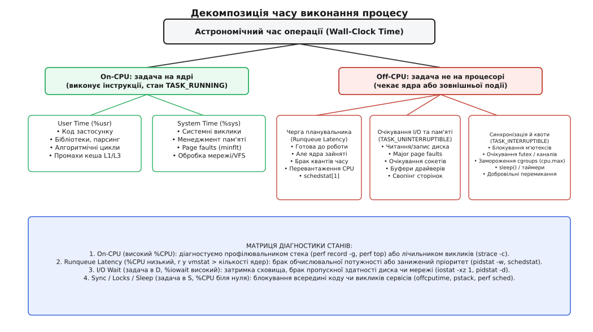
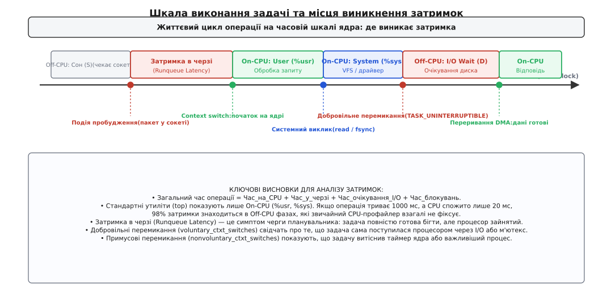
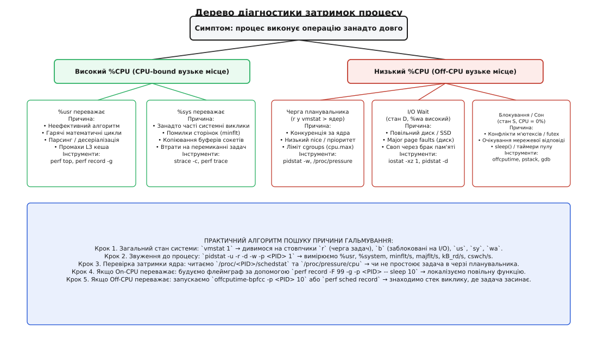

# Чому процес «гальмує»: розбір за моделлю

<preknowlist>
- [Планувальник: як ядро ділить час](topic:unix-linux/scheduler-model) — черга виконання, поділ квантів і витіснення задач.
- [Пріоритети й nice](topic:unix-linux/priority-nice-realtime) — як вага задачі впливає на швидкість зростання віртуального часу.
- [Потоки як задачі](topic:unix-linux/threads-as-tasks) — одиницею планування для ядра є окремий потік зі своїм task_struct.
- [Системний виклик](topic:unix-linux/syscall-mechanics) — перехід межі між простором користувача і ядром.
</preknowlist>

## Парадокс тривалого очікування при низькому навантаженні

Веб-сервіс зазвичай відповідає на запити клієнтів за 3 мілісекунди. Під час пікового навантаження час відповіді раптово підскакує до 450 мілісекунд, користувачі бачать затримки, а моніторинг фіксує порушення SLA. Інженер відкриває утиліту `top`, знаходить PID процесу і бачить несподівану картину: процес споживає лише 2.5% процесорного часу, а загальне завантаження системи далеке від 100%.

Перша інтуїтивна реакція — припустити, що процесу «немає чого робити» або що навантаження взагалі не доходить до програми. Але це хибний висновок. Відсоток завантаження процесора (`%CPU`) показує лише ту частку часу, протягом якої задача фізично перебувала на процесорному ядрі і виконувала машинний код. Якщо операція триває 450 мілісекунд, а процесор був зайнятий нею лише 11 мілісекунд (що якраз і становить 2.5% від секунди), виникає головне системне запитання: **де знаходився процес і що саме відбувалося в системі протягом решти 439 мілісекунд?**

Щоб відповісти на це запитання, потрібно розрізняти два принципово різні поняття часу в операційній системі:

**Астрономічний час (Wall-Clock Time, або реальний час)** — це час за фізичним настінним годинником від початку виконання операції до її повного завершення. Саме цей час відчуває користувач або клієнтська програма, яка надіслала мережевий запит.

**Процесорний час (CPU Time)** — це сумарна кількість наносекунд або системних тактів, протягом яких процесорні конвеєри безпосередньо декодували та виконували інструкції потоку або ядра від імені цього потоку.

Якщо астрономічний час операції зростає, але процесорний час залишається малим або взагалі не змінюється, проблема затримки полягає не в складності обчислень, а в очікуванні зовнішніх ресурсів або черг ядра. Системний підхід до діагностики полягає не у хаотичному переборі налаштувань, а в послідовній декомпозиції кожної секунди астрономічного часу за внутрішньою моделлю станів ядра.

## Модель декомпозиції часу: On-CPU проти Off-CPU

У будь-який момент свого життєвого циклу потік виконання в Linux перебуває рівно в одному з двох базових станів: він або займає фізичне ядро процесора і виконує машинний код (**On-CPU**), або знятий з процесора і перебуває в очікуванні (**Off-CPU**).


*Декомпозиція астрономічного часу процесу: розбивка на фази On-CPU та Off-CPU.*

Кожен із цих двох станів поділяється на дві окремі функціональні підкатегорії. У результаті повний бюджет астрономічного часу процесу розкладається на чотири неперетинні компоненти:

```
T_wall = T_user + T_system + T_runqueue + T_blocked
```

Розглянемо фізичну суть кожної з цих чотирьох складових:

1. **Час у просторі користувача (`T_user`, %usr)** — потік виконує інструкції прикладного коду, динамічних бібліотек або інтерпретатора. Процесор працює у неривілейованому режимі Ring 3. Тут час витрачається на математичні розрахунки, обробку структур даних, парсинг JSON або протоколів, виконання циклів.
2. **Час у просторі ядра (`T_system`, %sys)** — потік виконує код ядра Linux у привілейованому режимі Ring 0. Це відбувається, коли програма робить системний виклик (`read`, `write`, `epoll_wait`), коли ядро обробляє незначний сторінковий збій пам'яті (Minor Page Fault), оновлює таблиці сторінок або обслуговує апаратні та програмні переривання.
3. **Затримка в черзі планувальника (`T_runqueue`, Runqueue Latency)** — потік перебуває у стані готовності `TASK_RUNNING`, його код готовий до виконання, дані завантажені в пам'ять, але жодне фізичне процесорне ядро не може його прийняти, тому що всі ядра зайняті іншими потоками системи. Потік стоїть у черзі `runqueue` планувальника.
4. **Блокування та очікування ресурсів (`T_blocked`, Off-CPU Wait)** — потік добровільно поступився процесором і перейшов у стан сну (`TASK_INTERRUPTIBLE` або `TASK_UNINTERRUPTIBLE`), тому що для продовження роботи йому потрібні зовнішні дані: відповідь від дискового накопичувача, прибуття мережевого пакета в сокет, звільнення зайнятого м'ютекса (`pthread_mutex_t` або `futex`), або спливання таймера сну (`nanosleep`).

Якщо діагностика починається зі з'ясування того, у якій саме з цих чотирьох часток процес проводить левову частку свого часу, пошук несправності звужується в рази.

## Коли час згорає на ядрі: On-CPU аналіз

Якщо аналіз показує високе завантаження процесора (`%CPU > 80%`), вузьке місце знаходиться у фазі On-CPU. Проте природа цього навантаження може бути кардинально різною залежно від співвідношення між часом користувача (`%usr`) та часом ядра (`%sys`).

### Час користувача (`%usr`): алгоритми, цикли та промахи кешу

Коли переважає `%usr`, процесор виконує команди безпосередньо в адресному просторі застосунку. Причини затримок тут поділяються на дві групи: програмні та мікроархітектурні.

Програмні причини — це неефективні алгоритми з високою часовою складністю (наприклад, квадратичний пошук `O(N²)` замість хеш-таблиці `O(1)`), регулярні вирази з катастрофічним поверненням (Catastrophic Backtracking) або гарячі цикли серіалізації даних.

Мікроархітектурні причини набагато підступніші. Процесор може споживати 100% потужності ядра за даними `top`, але при цьому виконувати надзвичайно мало корисної роботи. Це відбувається тоді, коли конвеєр процесора простоює в очікуванні даних із оперативної пам'яті (Memory Stall Cycles). Якщо програма хаотично обходить великий масив вказівників, кожне звернення до пам'яті спричиняє промах кешу L1, L2 та L3, змушуючи ядро чекати 50–100 наносекунд на доставку даних із шини RAM.

Для діагностики On-CPU навантаження використовують підсистему [perf: лічильники та профілювання](topic:unix-linux/perf-events). Головною метрикою ефективності коду є показник IPC (Instructions Per Cycle — кількість інструкцій, виконаних за один такт процесора):

```sh
# Збір апаратної статистики виконання процесу на 5 секунд
perf stat -p <PID> -- sleep 5
```

Типовий вивід показує:
* `instructions` — загальна кількість виконаних інструкцій;
* `cycles` — кількість минулих тактів процесора;
* `insn per cycle` (IPC) — коефіцієнт ефективності.

Якщо IPC становить `1.5 .. 3.0`, код є обчислювально щільним і процесор працює на повну потужність. Якщо ж IPC опускається нижче `0.5`, процесор проводить більшість тактів у стані очікування пам'яті. Для локалізації конкретної повільної функції будують стек викликів із вибіркою (Sampling):

```sh
# Семплювання стека з частотою 99 Гц на 10 секунд
perf record -F 99 -g -p <PID> -- sleep 10

# Перегляд інтерактивного звіту з гарячими функціями
perf report
```

### Час ядра (`%sys`): ціна переходів між просторами

Коли у виводі `top` або `pidstat` переважає час ядра (`%sys > 40%`), це означає, що програма змушує операційну систему виконувати колосальний обсяг службової роботи. Сам по собі [системний виклик](topic:unix-linux/syscall-mechanics) є дорогою операцією: процесор повинен зберегти регістри користувача, перемкнути стек на рівень ядра, перевірити права доступу та виконати код драйвера чи підсистеми VFS.

Основними джерелами високого `%sys` є:

1. **Надмірна частота системних викликів:** Застосунок читає або записує дані дрібними порціями (наприклад, по 1–4 байти замість буфера в 64 КіБ). Мільйон системних викликів на секунду повністю паралізує ядро витратами на перемикання контексту.
2. **Незначні сторінкові збої (Minor Page Faults):** Коли програма динамічно виділяє великі обсяги пам'яті через `malloc()` або `mmap()`, ядро не виділяє фізичні сторінки пам'яті одразу. Фізична сторінка надається лише в момент першого запису за адресою через спрацьовування сторінкового збою. Якщо програма постійно виділяє та звільняє гігабайти пам'яті, ядро витрачає весь час на заповнення таблиць сторінок MMU.
3. **Висока частота перемикань контексту:** Якщо сотні ниток борються за ресурси, ядро витрачає значну частку часу на збереження та відновлення регістрів процесора і перезавантаження регістрів керування пам'яттю `CR3`.
4. **Обробка програмних переривань (Softirq):** Під час інтенсивного мережевого трафіку мережева карта генерує сотні тисяч пакетів на секунду. Драйвер обробляє їх у контексті програмних переривань `NET_RX_SOFTIRQ` або через службовий демон `ksoftirqd/N`. Якщо це навантаження припадає на те саме ядро, де виконується застосунок, ядро примусово перехоплює процесор для обробки мережевого стека, створюючи раптові затримки в обчисленнях.

Для миттєвої оцінки системних викликів використовують інструмент [трасування системних викликів](topic:unix-linux/syscall-tracing):

```sh
# Підрахунок кількості та сумарного часу всіх системних викликів процесу
strace -c -p <PID>
```

Утиліта показує таблицю викликів, де на перших місцях зазвичай опиняються операції, що споживають найбільше часу ядра (`futex`, `read`, `write`, `mmap`, `epoll_wait`).


## Невидима черга: затримка планувальника (Runqueue Latency)

Найбільш підступним видом затримки є очікування в черзі планувальника. У цьому стані потік не блокується на диску, не спить на м'ютексі і повністю готовий до роботи. Його стан у структурі `task_struct` — `TASK_RUNNING`. Проте потік не може виконати жодної інструкції, тому що всі доступні ядра зайняті іншими задачами.


*Шкала виконання задачі та місця виникнення затримок у ядрі.*

Коли операційна система отримує мережевий пакет або сигнал про завершення операції вводу-виводу, обробник переривання викликає функцію ядра `try_to_wake_up()`. Потік переводиться зі стану сну `TASK_INTERRUPTIBLE` у стан `TASK_RUNNING` і додається до черги запуску `runqueue` відповідного процесора.

З цього моменту починає цокати невидимий таймер затримки черги (Runqueue Latency). Якщо на цьому ядрі вже виконується інший процес, ядро не може миттєво віддати процесор новому потоку, якщо тільки пріоритет нового потоку не є значно вищим. Потік змушений чекати, поки поточний процес не вичерпає свій квант часу або не заблокується добровільно.

У сучасному планувальнику EEVDF (Earliest Eligible Virtual Deadline First, впровадженому в Linux 6.6 на заміну класичному CFS) вибір наступної задачі базується на двох фундаментальних поняттях: величині відставання (lag) та віртуальному дедлайні (virtual deadline). Якщо задача щойно прокинулася після тривалого сну, вона має позитивне відставання (вона недоотримала свій справедливий час), тому отримує ранній дедлайн і право швидко витіснити довготривалі обчислювальні процеси. Проте якщо кілька інтерактивних ниток прокидаються одночасно, вони конкурують між собою за чергу, що призводить до сплесків затримки відгуку (Latency Spikes).


### Ознаки голодування в черзі планувальника

Зрозуміти, що система страждає від черг планувальника, можна за кількома фундаментальними ознаками:

1. **Стовпчик `r` утиліти `vmstat 1`:** Цей стовпчик показує сумарну кількість задач у стані `TASK_RUNNING` на всіх процесорах. Якщо на сервері з 8 логічними ядрами значення `r` стабільно тримається на рівні 24, це означає, що на кожне ядро в середньому претендують 3 готові задачі. Кожна задача отримує лише третину часу, а решту 66% часу стоїть у черзі.
2. **Примусові перемикання контексту (`nonvoluntary_ctxt_switches`):** Якщо утиліта `pidstat -w -p <PID> 1` фіксує сотні або тисячі примусових перемикань на секунду, це свідчить про те, що задача постійно вичерпує свій бюджет віртуального часу і планувальник силоміць витісняє її з процесора.
3. **Прямий облік черги у `/proc/[pid]/schedstat`:** Друге число у файлі `/proc/[pid]/schedstat` містить точну суму наносекунд, проведених задачею у стані очікування черги. Якщо приріст цього числа за секунду становить 400 мільйонів наносекунд, задача втрачає 400 мілісекунд (40% кожної секунди) просто стоячи в черзі.

Детальний формат числових полів обліку та методики їх зчитування наведено у вставці [довідка інтерфейсів та метрик затримок процесу](topic:unix/why-my-process-is-slow/api-latency-metrics.md).

Для вимірювання затримок планувальника на системному рівні використовують команду `perf sched`:

```sh
# Запис подій планувальника на 5 секунд
perf sched record -- sleep 5

# Аналіз максимальних та середніх затримок черги для кожного процесу
perf sched latency
```

У звіті параметр `Maximum delay` показує найгіршу затримку, з якою процес чекав на отримання процесорного ядра після пробудження.

## Очікування ресурсів: дисковий ввід-вивід та пам'ять

Коли процес звертається до диска або намагається отримати доступ до сторінки пам'яті, витісненої у розділ свопу, він не може продовжувати виконання машинних інструкцій. Потік викликає внутрішню функцію ядра `schedule()`, переходить у неперериваний стан сну `TASK_UNINTERRUPTIBLE` (стан `D` у списку процесів `ps`) і знімається з процесора.

Стан `TASK_UNINTERRUPTIBLE` створений для того, щоб захистити цілісність структур ядра під час очікування апаратних відповідей: у цьому стані процес не реагує навіть на сигнал негайного завершення `SIGKILL` доти, доки драйвер контролера накопичувача не підтвердить завершення операції передачі даних через апаратне переривання.

### Метрика `%iowait` та її справжній зміст

Однією з найбільш оманливих метрик у звітах `top` та `vmstat` є показник `%wa` (I/O wait). Багато інженерів вважають, що `%wa = 50%` означає, що дискова підсистема завантажена на 50%.

Насправді `%iowait` розраховується ядром за дуже специфічним правилом: **це частка часу, протягом якого процесорне ядро повністю простоювало (Idle), але при цьому хоча б один потік у системі перебував у стані очікування дискового вводу-виводу (`TASK_UNINTERRUPTIBLE`)**.

З цього правила випливають два парадокси:
* Якщо на машині з 64 ядрами єдиний потік читає повільний жорсткий диск, а всі 63 інші ядра зайняті важкими математичними розрахунками, показник `%iowait` дорівнюватиме **0%**, тому що жодне ядро не простоює в стані Idle, хоча потік дискового читання відчуває колосальну затримку.
* Навпаки, на порожній машині один-єдиний фоновий потік, що повільно записує лог-файл, може підняти `%iowait` до 100%, якщо процесору більше немає чим зайнятися.

Тому для діагностики дискових затримок слід дивитися не на системний `%iowait`, а на показники конкретного процесу та блокових пристроїв:

```sh
# Моніторинг дискової активності конкретного процесу (потребує root)
pidstat -d -p <PID> 1

# Моніторинг затримок блокових накопичувачів (await, r_await, w_await)
iostat -xz 1
```

Ключовим параметром у звіті `iostat` є показник `r_await` (середній час обслуговування запиту на читання в мілісекундах) та `aqu-sz` (середня довжина черги запитів до накопичувача). Якщо `r_await` для NVMe накопичувача перевищує 5–10 мс, або для SATA SSD перевищує 20 мс, сховище перевантажене, і процеси накопичуються у стані `D`.

### Пам'ять та значні сторінкові збої (`majflt`)

Якщо системі бракує фізичної оперативної пам'яті, підсистема керування пам'яттю ядра активує [свопінг і витіснення сторінок](topic:unix-linux/swap-and-reclaim). Ядро скидає сторінки анонімної пам'яті застосунків у файл або розділ підкачки (Swap).

Коли процес намагається прочитати або змінити дані на витісненій сторінці, апаратний блок MMU генерує сторінковий збій. Оскільки сторінка відсутня в RAM, ядро класифікує цей збій як **Major Page Fault (`majflt`)**. Процес миттєво переводиться в стан `D`, ядро ініціює синхронне блокуюче читання сторінки зі своп-пристрою, і процес блокується на десятки мілісекунд.

Відстежити значні сторінкові збої для процесу можна за допомогою утиліти `pidstat`:

```sh
# Відстеження сторінкових збоїв процесу (minflt/s та majflt/s)
pidstat -r -p <PID> 1
```

Якщо показник `majflt/s` відмінний від нуля, процес страждає від дефіциту фізичної пам'яті. Вирішенням є збільшення обсягу RAM, зменшення споживання пам'яті застосунком або налаштування лімітів пам'яті через cgroups.

## Внутрішня синхронізація: м'ютекси, futex та очікування подій

Найбільш складна для виявлення категорія сповільнень виникає тоді, коли процес не споживає CPU, не стоїть у черзі планувальника і не виконує дискових операцій. Процес перебуває у перериваному стані сну `TASK_INTERRUPTIBLE` (стан `S` у `top`), а його час відповіді зростає через внутрішні блокування синхронізації.

Коли потік у багатопотоковому застосунку (на C, C++, Go, Rust, Java) намагається захопити м'ютекс, який уже утримується іншим потоком, бібліотека синхронізації викликає системний виклик `futex` (Fast Userspace Mutex) із прапорцем `FUTEX_WAIT`. Ядро призупиняє потік, додає його до черги очікування даного futex і перемикає процесор на іншу задачу. Це генерує **добровільне перемикання контексту (`voluntary_ctxt_switches`)**.

### Проблема сліпоти традиційних профілювальників (Off-CPU Problem)

Традиційні профілювальники на кшталт `perf record` працюють за принципом семплювання: вони налаштовують апаратний таймер процесора так, щоб кожні кілька мілісекунд генерувалося переривання, під час якого профілювальник записує поточний вказівник інструкцій `RIP` та стек викликів.

Але коли потік спить у системному виклику `futex`, `epoll_wait` або `nanosleep`, процесор не виконує жодної інструкції цього потоку. Переривання таймера ніколи не влучають у сплячий процес. У результаті профілювальник будує гарний звіт або флеймграф, у якому відображено лише ті невеликі частки секунди, коли процес працював, і **повністю відсутні ті 95% часу, які процес провів у стані блокування на м'ютексі**.

### Методологія Off-CPU трасування

Для діагностики блокувань синхронізації застосовують підхід Off-CPU профілювання на основі підсистеми [eBPF: спостереження та трасування](topic:unix-linux/ebpf). Замість семплювання активності процесора, інструмент чіпляється до трасувальних точок перемикання контексту ядра `sched:sched_switch`:

1. У момент, коли потік залишає процесор, eBPF-програма записує поточну часову мітку `t_start` та стек викликів простору користувача.
2. Коли потік повертається на процесор через деякий час, eBPF-програма фіксує часову мітку `t_end`, обчислює дельту `Δt = t_end - t_start` і додає цю дельту до загального часу очікування для даного стека викликів.

```sh
# Збір стеків викликів сплячого процесу за допомогою BCC-утиліти offcputime
offcputime-bpfcc -p <PID> 10 > offcpu.stacks

# Генерація флеймграфа затримок очікування
flamegraph.pl --color=io offcpu.stacks > offcpu.svg
```

На результуючому Off-CPU флеймграфі найширшими стовпчиками будуть не ті функції, які спалюють процесор, а ті, які найдовше утримують потік у заблокованому стані (наприклад, конкретний виклик `pthread_mutex_lock` або очікування мережевої відповіді від бази даних).

Якщо підсистема eBPF недоступна, швидким способом оцінки причин сну є зняття знімків стеків сплячих ниток через утиліту `pstack`:

```sh
# Зняття стека викликів усіх ниток процесу
pstack <PID>
```

Якщо при повторних запусках більшість ниток застигли у функціях `__lll_lock_wait` або `futex_wait`, це однозначно свідчить про наявність контенції (високої конкуренції) за спільні блокування в архітектурі програми.

## Приховані гальма: ліміти cgroups та керування живленням процесора

Окрім класичних причин затримок, сучасні процеси можуть сповільнюватися системними механізмами квотування та енергозбереження, які діють повністю прозоро для самого застосунку.

### Тротлінг квот процесора у cgroup v2 (`cpu.max`)

Якщо процес виконується всередині контейнера Docker, поду Kubernetes або під керуванням юніта systemd, на нього можуть накладатися квоти за допомогою контролера [cgroups: облік і обмеження ресурсів](topic:unix-linux/cgroups).

У cgroup v2 квота задається у файлі `cpu.max` двома числами: лімітом часу квоти та тривалістю періоду (за замовчуванням 100 000 мікросекунд = 100 мс). Наприклад, запис `50000 100000` означає, що всім процесам групи сумарно дозволено використовувати не більше 50 мс процесорного часу протягом кожного 100-мілісекундного періоду (еквівалент 0.5 ядра).

Якщо процес є багатопотоковим і запускає 4 нитки, вони можуть повністю вичерпати 50 мс доступного бюджету за перші 12.5 мілісекунд періоду. У цей момент планувальник ядра Linux примусово вимикає всі нитки групи з черги планування і переводить їх у стан примусового замороження (Throttling) на решту 87.5 мілісекунд періоду. Застосунок повністю зупиняється, клієнти отримують затримку майже в 90 мс на рівному місці, хоча апаратний процесор сервера може бути завантажений лише на 5%.

Перевірити наявність тротлінгу можна безпосередньо у файловій системі cgroups:

```sh
# Перевірка статистики тротлінгу для контрольної групи процесу
cat /sys/fs/cgroup/system.slice/my_service.service/cpu.stat
```

Якщо показники `nr_throttled` (кількість періодів обмеження) та `throttled_usec` (сумарний час замороження) постійно зростають, єдиним способом усунення затримок є збільшення значення ліміту `cpu.max` або згладжування пікових сплесків активності у коді програми.

### Енергозбереження та переходи станів процесора (C-states та P-states)

Сучасні процесори для економії електроенергії та зниження тепловиділення переводять неактивні ядра у стани глибокого сну (C-states: C1, C6, C8). Коли спляче ядро отримує переривання або задачу з черги, йому потрібен певний час для відновлення живлення, синхронізації тактового генератора та розігріву конвеєра інструкцій. Для стану C6 ця затримка виходу (Exit Latency) може досягати 20–100 мікросекунд.

Крім того, регулятор тактової частоти (cpufreq governor) може скидати частоту ядра до мінімальної (наприклад, 800 МГц) під час низького навантаження. Коли надходить короткий одиночний пакет, процесор починає обробляти його на заниженій частоті, що в 4–5 разів збільшує час виконання інструкцій, доки регулятор `schedutil` або `powersave` не вирішить підвищити частоту до максимальної.

Для серверів із жорсткими вимогами до низьких затримок (Low Latency) системні адміністратори фіксують регулятор частоти у режимі високої продуктивності:

```sh
# Переведення всіх ядер у режим максимальної продуктивності без скидання частоти
echo performance | tee /sys/devices/system/cpu/cpu*/cpufreq/scaling_governor
```

### Метрики системного тиску: Pressure Stall Information (PSI)

Для отримання єдиної інтегральної картини дефіциту апаратних ресурсів ядра Linux надає механізм [навантаження й тиск на ресурси](topic:unix-linux/load-and-pressure) (PSI). Він дозволяє миттєво визначити, чи не є затримка процесу наслідком загального браку заліза:

```sh
# Перевірка дефіциту процесора, диска та пам'яті
cat /proc/pressure/cpu
cat /proc/pressure/io
cat /proc/pressure/memory
```

Значення `some avg10=12.50` у файлі `/proc/pressure/cpu` означає, що протягом останніх 10 секунд процеси системи провели 12.5% сумарного часу в очікуванні звільнення зайнятих процесорів.

## Повний метод діагностики: від симптому до першопричини

Системний інженер ніколи не вгадує причину затримки навмання. Діагностика завжди виконується за чітким 5-кроковим алгоритмом, який поступово локалізує проблему від загального стану операційної системи до конкретної функції коду або апаратного вузла.


*Систематичний алгоритм пошуку причини уповільнення процесу.*

### Крок 1. Загальний огляд системи (`vmstat 1`)

Запускають утиліту `vmstat 1` на 5–10 секунд і дивляться на ключові системні стовпчики:
* Якщо стовпчик `r` перевищує кількість логічних ядер (`nproc`) — у системі дефіцит процесорів, затримки викликані чергою планувальника.
* Якщо стовпчик `b` (кількість задач у неперериваному стані `D`) більший за 0 або зростає `%wa` — затримки викликані дисковим сховищем або свопом.
* Якщо стовпчики `si` (swap in) або `so` (swap out) показують ненульові значення — система вичерпала RAM і активно використовує розділ підкачки.
* Якщо переважає `us` або `sy` — навантаження локалізовано на процесорах у фазі On-CPU.

### Крок 2. Звуження аналізу до конкретного процесу (`pidstat`)

Використовують утиліту `pidstat` для одночасного зняття всіх категорій метрик цільового PID:

```sh
# Повний зріз метрик процесу: процесор (-u), пам'ять (-r), диск (-d), перемикання контексту (-w)
pidstat -u -r -d -w -p <PID> 1
```

Аналізують отримані параметри:
1. Якщо `%usr` високий — процес обчислювально навантажений, переходять до Кроку 4 (профілювання користувацького стека).
2. Якщо `%system` високий — процес навантажує ядро, переходять до Кроку 3 (трасування системних викликів).
3. Якщо `cswch/s` (добровільні перемикання) досягає тисяч на секунду при низькому `%CPU` — процес страждає від блокувань, переходять до Кроку 5 (Off-CPU аналіз).
4. Якщо `nvcswch/s` (примусові перемикання) високий — процес витісняється планувальником.

### Крок 3. Трасування межі з ядром (`strace` / `perf trace`)

Якщо виявлено високий час ядра або підозрілі добровільні перемикання:
* Запускають `strace -c -p <PID>` на 5 секунд, щоб отримати гістограму системних викликів.
* Якщо лідирує виклик `futex` — процес блокується на м'ютексах або синхронізації ниток.
* Якщо лідирує виклик `read` / `write` на дескрипторах сокетів — процес очікує відповідей від зовнішніх мережевих баз даних або мікросервісів.
* Якщо зафіксовано мільйони дрібних викликів `getpid`, `time` або `read` по 1 байту — проблема полягає у відсутності буферизації.

### Крок 4. Локалізація On-CPU коду (`perf record`)

Якщо процес обмежений обчисленнями у просторі користувача:
* Запускають `perf record -F 99 -g -p <PID> -- sleep 10`.
* Будують флеймграф і знаходять вершину стека — функцію, яка утримує процесор найдовше.
* Перевіряють алгоритмічну складність знайденої функції, наявність блокувань пам'яті або промахів кешу.

### Крок 5. Локалізація Off-CPU затримок (`offcputime` / `schedstat`)

Якщо процес споживає мало процесора, але не відповідає на запити:
* Запускають розроблений інструмент моніторингу бюджету часу, описаний у практичній вставці [профілювальник бюджету часу процесу](topic:unix/why-my-process-is-slow/proj-latency-breakdown.md), щоб виміряти точний відсоток затримки черги `SchedWait` та очікування `OffCPU`.
* Перевіряють файл `cpu.stat` відповідної cgroup на наявність тротлінгу `throttled_usec`.
* Запускають `offcputime-bpfcc -p <PID> 10`, щоб отримати точні стеки викликів функцій, де потік засинає під час очікування.

Дотримання цієї послідовності гарантує, що жоден прихований механізм ядра — від мікроархітектурного промаху кешу до витіснення у черзі планувальника чи замороження в контейнері — не залишиться непоміченим.

> 🔧 **Навіщо це.** У реальній розробці та підтримці розподілених систем скарга «сервіс став працювати повільно» є найбільш частою і водночас найбільш невизначеною проблемою. Розуміння моделі On-CPU / Off-CPU та володіння метриками планувальника дозволяє за 60 секунд визначити точний клас проблеми без перезавантаження сервера та без зупинки виробничих процесів: розробник одразу бачить, чи потрібно оптимізувати SQL-запити, правити алгоритми в коді, збільшувати виділені квоти в Kubernetes чи тюнити черги планувальника ядра.
