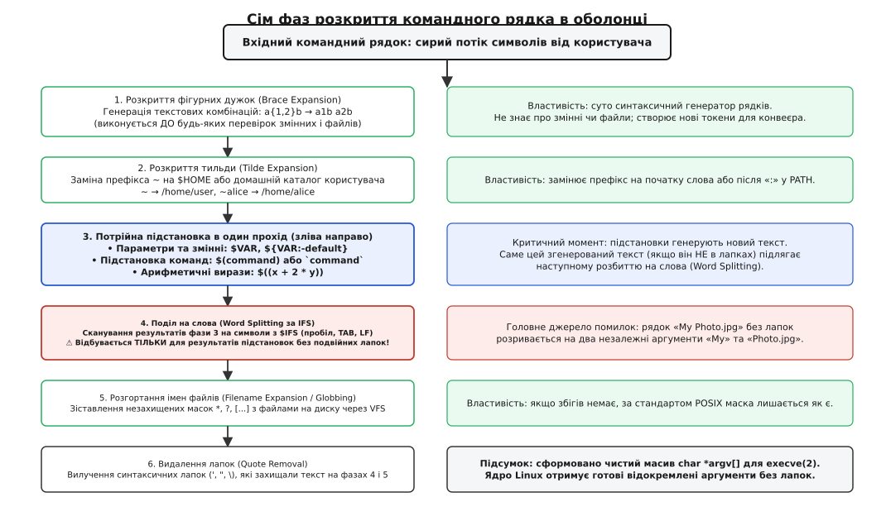
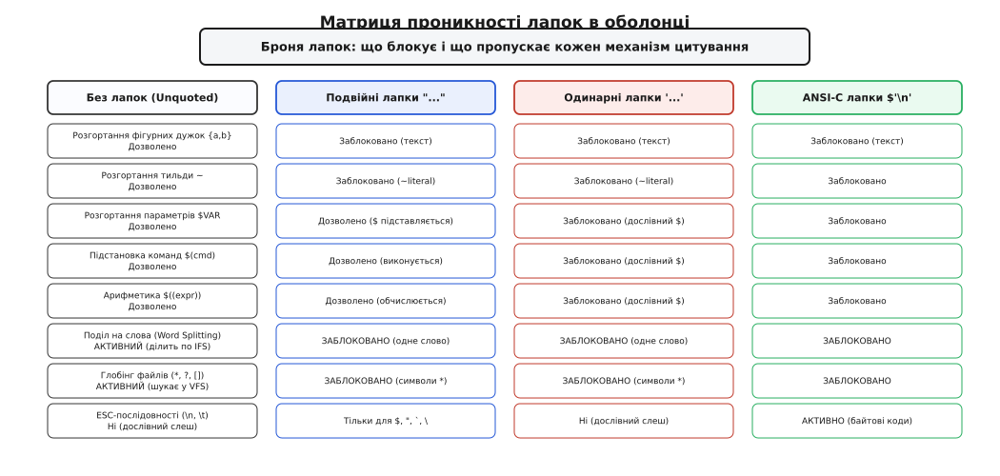
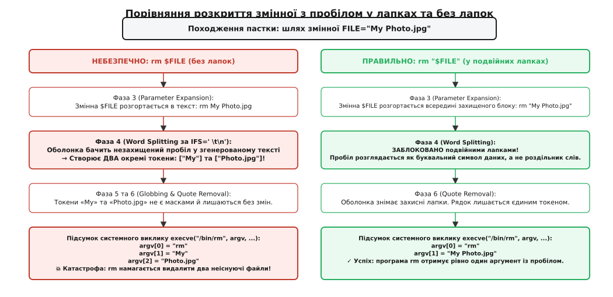
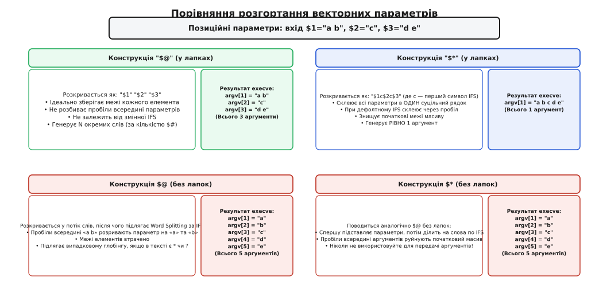

# Чому лапки кусаються: модель розкриття крок за кроком

<preknowlist>
- [Аргументи та оточення: як процеси отримують дані при запуску](root:sys-unix/argv-and-environment) — передача векторів argv[] та envp[] системному виклику execve(2).
- [Роль оболонки: між користувачем і ядром](root:sys-unix/shell-role) — оболонка як інтерпретатор між користувацьким вводом та викликами ядра.
- [Розкриття й лапки](root:sys-unix/expansion-and-quoting) — етапи розкриття та правила екранування в стандарті POSIX.
- [exec: заміна образу](root:sys-unix/exec-semantics) — як ядро завантажує образ нової програми та передає вектор аргументів функції main().
</preknowlist>

Коли системний адміністратор або скрипт автоматизації виконує команду `TARGET_DIR="/data/backup 2026/db"; rm -rf $TARGET_DIR`, людина очікує, що утиліта `rm` видалить зазначений каталог разом із його вмістом. Натомість операційна система видаляє каталог `/data/backup`, де зберігалися архіви попередніх років, а потім завершується з повідомленням про помилку відсутності шляху `2026/db`. Якщо ж змінна містить зірочку `PATTERN="*"; rm -f $PATTERN`, команда знищує всі файли в поточному робочому каталозі.

Ці катастрофи відбуваються не через збій утиліти `rm` чи дефект у ядрі Linux. Програма `rm` взагалі не бачила початкового текстового рядка `rm -rf $TARGET_DIR`. Вона отримала масив аргументів безпосередньо від системного виклику `execve(2)` у такому вигляді, в якому його підготувала командна оболонка.

У прикладних мовах програмування виклик функції передає відокремлений типізований аргумент через регістри або стек. Командний рядок оболонки влаштований інакше: це не середовище типізованих об'єктів, а конвеєр послідовного текстового переписування (*string macro expansion*, від лат. *expandere* — розгортати, поширювати). Оболонка приймає суцільний масив сирих байтів і проганяє його крізь суворо регламентовані фази лексичних і системних перетворень. Розуміння того, де саме в цьому конвеєрі лапки діють як броня, а де втрачають силу, усуває найнебезпечніший клас системних помилок та вразливостей у Unix.

## Прірва між суцільним текстом і вектором argv[]

Ядро операційної системи Linux має гранично простий контракт запуску нових програм. Системний виклик `execve` вимагає від процесу-ініціатора готового масиву покажчиків на рядки, що закінчуються нульовим байтом:

:::tabs
```c
#include <unistd.h>

/* Системний інтерфейс POSIX для заміни образу процесу */
int execve(const char *pathname, char *const argv[], char *const envp[]);
```
```cpp
#include <unistd.h>
#include <span>
#include <string_view>

/* Типізоване представлення аргументів execve у C++ */
extern "C" int execve(const char *pathname, char *const argv[], char *const envp[]);
```
:::

Ядро операційної системи не знає, що таке пробіл як роздільник параметрів, що таке зірочка `*`, знак долара `$`, одинарна чи подвійна лапка. Для ядра аргументи — це вже нарізаний список ізольованих комірок пам'яті: перший елемент `argv[0] = "rm"`, другий елемент `argv[1] = "-rf"`, третій елемент `argv[2] = "/data/backup 2026/db"`.

Тим часом користувач або процес-ініціатор передає в термінал єдиний неперервний потік символів. Головний обов'язок командної оболонки (Bash, Zsh, Dash) полягає в тому, щоб перетворити цей сирий рядок на кінцевий вектор покажчиків `argv[]`.


*Сім послідовних фаз конвеєра оболонки. Лапки та екранування визначають поведінку токенів на кожному кроці трансляції.*

Проблема виникає через те, що це перетворення виконується не за один крок, а через багатоетапний конвеєр. Кожна фаза змінює рядок і передає результат наступній. Якщо розробник не уявляє точний порядок цих фаз, він розставляє лапки навмання, що й спричиняє несподівані збої.

## Сім фаз конвеєра: суворий порядок перетворень

Стандарт POSIX IEEE Std 1003.1 чітко регламентує порядок обробки введеного рядка. Більшість оболонок додають початковий етап розширення, після чого слідують шість обов'язкових системних фаз.

### Фаза 1: Розкриття фігурних дужок (Brace Expansion)

Розкриття фігурних дужок є не-POSIX розширенням, наявним у Bash, Zsh та Ksh. Воно виконується першим — до того, як оболонка спробує знайти значення змінних чи перевірити стан файлової системи.

Це суто синтаксичний генератор текстових комбінацій:
- `img_{A,B}.png` породжує два слова: `img_A.png` та `img_B.png`.
- `{1..4}` породжує послідовність: `1 2 3 4`.
- `prefix_{01..03}_{a,b}` генерує декартовий добуток: `prefix_01_a prefix_01_b prefix_02_a prefix_02_b prefix_03_a prefix_03_b`.

Оскільки ця фаза передує підстановці змінних, конструкція `{$START..$END}` у чистому Bash не працює очікуваним чином: на момент розгортання дужок змінні `$START` та `$END` ще не розкриті, тому рядок залишається буквальним `{1..10}` без генерації діапазону. Для динамічних циклів слід використовувати арифметичні цикли `for ((i=START; i<=END; i++))` або утиліту `seq`.

### Фаза 2: Розкриття тильди (Tilde Expansion)

Якщо слово починається з незахищеного символу `~`, оболонка шукає перший косий слеш `/`. Шматок між тильдою і слешем називається префіксом тильди:
- `~` замінюється на значення змінної оточення `$HOME` (або результат системного виклику `getpwuid(getuid())`, якщо `$HOME` скинуто).
- `~username` шукає домашній каталог користувача через системну базу облікових записів `getpwnam("username")` (наприклад, `/home/username`).
- `~+` замінюється на поточний робочий каталог `$PWD`, а `~-` — на попередній каталог `$OLDPWD`.

Розкриття тильди також відбувається після знака `=` у присвоєннях змінних та після двокрапки `:` у змінних системних шляхів на кшталт `PATH=~/bin:~alice/bin`. Якщо ж тильду взяти у будь-які лапки (`"~"` або `'~'`), вона втрачає магічну властивість і залишається звичайним символом тильди.

### Фаза 3: Потрійна підстановка в один прохід

Після розкриття тильди оболонка сканує рядок зліва направо за один-єдиний прохід, виконуючи три типи підстановок, які мають однаковий пріоритет:

1. **Розкриття параметрів і змінних (Parameter Expansion)**:
   Синтаксис `$VAR` або `${VAR}`. Оболонка зчитує значення змінної з внутрішньої таблиці середовища. Якщо змінна містить модифікатори (наприклад `${FILE%.*}` для відтинання суфікса розширення або `${PORT:-8080}` для підстановки значення за замовчуванням), обчислення виконується безпосередньо тут.
2. **Підстановка команд (Command Substitution)**:
   Синтаксис `$(command)` або застарілий вираз у зворотних апострофах `` `command` ``. Оболонка створює дочірній процес через системний виклик `fork(2)`, перенаправляє його стандартний вивід через анонімний канал `pipe(2)` і зчитує згенеровані байти. Усі завершальні символи переведення рядка `\n` автоматично відсікаються.
3. **Арифметичне розкриття (Arithmetic Expansion)**:
   Синтаксис `$((expression))`. Оболонка обчислює 64-бітний цілочисельний вираз за синтаксичними правилами мови C (наприклад `$(( A * 1024 + 512 ))`).

Критичний архітектурний момент: байти, згенеровані на цьому третьому етапі, є **новим динамічним текстом**, який вливається в командний рядок на льоту. Доля цього нового тексту вирішується на наступній фазі.

### Фаза 4: Поділ на слова (Word Splitting)

Поділ на слова — це головне місце, де виникають помилки з лапками.

Правило POSIX: оболонка переглядає результати розкриття параметрів, підстановки команд та арифметики, **але тільки ті, що не були огорнуті у подвійні лапки**. Рядки, які були введені користувачем буквально, вже розділені на токени раніше і цій фазі не підлягають.

Оболонка бере значення спеціальної змінної `IFS` (*Internal Field Separator*, за замовчуванням це пробіл, знак табуляції та символ переведення рядка — `IFS=$' \t\n'`). Будь-який символ з `IFS`, виявлений у згенерованому тексті без лапок, розриває цей текст на незалежні слова.

Якщо змінна `$TARGET` містить значення `backup 2026`, то вираз `rm $TARGET` після фази 3 перетворюється на текст `rm backup 2026`. На фазі 4 пробіл між словами розглядається як роздільник `IFS`, тому утворюються два окремі токени: `backup` та `2026`.

### Фаза 5: Розгортання імен файлів (Globbing / Pathname Expansion)

Після того як поділ на слова сформував список токенів, оболонка сканує кожен отриманий токен на наявність незахищених метасимволів файлової системи: зірочки `*`, знака питання `?` та квадратних дужок `[...]`.

Якщо токен містить незахищену зірочку, оболонка звертається до ядра через функції читання каталогів `opendir(3)` і `readdir(3)` (системний виклик `getdents64`). Вона перевіряє файлову систему і замінює маску списком усіх імен файлів, які відповідають шаблону.

Якщо у файловій системі існують файли `a.txt` та `b.txt`, токен `*.txt` замінюється двома токенами: `a.txt` і `b.txt`. Якщо збігів немає, стандарт POSIX наказує залишити токен у його початковому вигляді (`*.txt`). У Bash поведінку можна змінити опціями `shopt -s nullglob` (повертати порожнє місце замість нерозкритої маски) або `shopt -s failglob` (видавати помилку при відсутності збігів).

### Фаза 6: Видалення лапок (Quote Removal)

Це фінальна санітарна обробка токенів перед передачею управління ядру. Оболонка сканує всі сформовані слова і видаляє з них усі синтаксичні лапки (`'`, `"`) та зворотні слеші `\`, які використовувалися для захисту символів на попередніх фазах.

Слово `"my file".txt` після видалення лапок перетворюється на чистий байтовий рядок `my file.txt`. Захисна оболонка виконала своє завдання на фазах 4 та 5 і більше не потрібна.

### Фаза 7: Формування argv[] і виклик execve(2)

Сформований масив рядків передається безпосередньо операційній системі. Перший токен (`argv[0]`) стає ім'ям виконуваної програми (або шукається за змінною `$PATH`), а всі наступні токени (`argv[1] ... argv[argc-1]`) стають її параметрами.

## Броня лапок: три рівні захисту та їхня проникність

Щоб керувати цим конвеєром, оболонка надає три фундаментальні інструменти екранування (цитування, англ. *quoting*). Їх можна уявити як броню різної щільності.


*Рівні захисту лапок: від повної ізоляції в одинарних лапках до вибіркової фільтрації у подвійних лапках.*

### 1. Одинарні лапки: абсолютна броня (Strong Quoting)

Рядок, узятий в одинарні лапки `'...'`, стає повністю монолітним і непроникним. Будь-який символ всередині одинарних лапок втрачає своє спеціальне значення:
- Знак долара `$` не розкриває змінних і не запускає підкоманд.
- Зірочка `*` не шукає файлів на диску.
- Зворотний слеш `\` вважається звичайним текстовим символом косої риски.

```bash
echo '$HOME *.log $(uname -r)'
# Результат: $HOME *.log $(uname -r)
```

Головне обмеження одинарних лапок: **всередину одинарних лапок неможливо помістити одинарну лапку навіть через екранування `\'`**. Оскільки зворотний слеш всередині одинарних лапок не має спеціальної сили, послідовність `'abc\'def'` оболонка сприймає як закриту лапку після `abc`, слеш поза лапками, і незакриту лапку перед `def`.

Щоб передати апостроф, блок одинарних лапок розривають і вставляють екрановану лапку окремо:

```bash
echo 'It'\''s working'
# Оболонка бачить три склеєні частини: 'It' + \' + 's working'
```

### 2. Подвійні лапки: вибіркова мембрана (Weak Quoting)

Подвійні лапки `"..."` є найважливішим робочим інструментом у скриптах. Вони блокують ті фази, які найчастіше руйнують дані, але пропускають підстановку динамічного вмісту.

Подвійні лапки **наглухо блокують**:
- Фазу 1: Розкриття фігурних дужок (`"{a,b}"` залишається `{a,b}`).
- Фазу 2: Розкриття тильди (`"~"` залишається `~`).
- Фазу 4: **Поділ на слова (Word Splitting)**. Усі пробіли та символи нового рядка всередині змінних зберігаються як дані одного аргументу!
- Фазу 5: **Глобінг файлів**. Зірочки та знаки питання не чіпають файлову систему.

Водночас подвійні лапки **дозволяють**:
- Розкриття параметрів (`"$VAR"`).
- Підстановку команд (`"$(date)"`).
- Арифметичні обчислення (`"$((1 + 2))"`).

Всередині подвійних лапок зберігають своє спеціальне значення лише чотири символи:
1. `$` — для розкриття змінних, команд та арифметики.
2. `` ` `` — для застарілої підстановки команд.
3. `"` — для закриття блоку подвійних лапок.
4. `\` — для екранування символів `$`, `` ` ``, `"`, `\` та перенесення рядка `\\\n`.

Повний зведений реєстр поведінки лапок у різних оболонках та контекстах наведено в [довіднику правил цитування та матриці розкриття](root:unix/why-quoting-bites/api-quoting-rules.md).

### 3. Зворотний слеш: точковий захист (Escape Character)

Зворотний слеш `\` діє локально на рівно один наступний символ, скасовуючи його спеціальну інтерпретацію оболонкою:
- `\$VAR` передає ядру буквений рядок `$VAR`.
- `\ ` (слеш із пробілом) створює пробіл, який не ділить слово на фазі Word Splitting.
- Послідовність `\\\n` (слеш у кінці фізичного рядка) видаляє сам символ переведення рядка, дозволяючи розбивати довгу команду на кілька рядків у редакторі.

### 4. ANSI-C цитування: `$'...'`

Якщо рядок містить керуючі байти (символ повернення каретки `\r`, табуляцію `\t`, переведення рядка `\n` чи байти шістнадцяткового коду `\x1b`), сучасні оболонки підтримують синтаксис `$'...'`. Всередині цих лапок оболонка транслює послідовності на етапі парсингу за правилами мови C:

```bash
# Розділити рядок за символом табуляції
IFS=$'\t' read -r col1 col2 col3 <<< "$DATA"
```

## Анатомія укусів: чотири класичні пастки розкриття

Маючи перед очима модель семи фаз, розберемо, чому саме лапки кусаються на практиці, коли розробники забувають про їхню взаємодію з конвеєром.

### Пастка 1: Пробіли в іменах файлів і Word Splitting

Найпоширеніша катастрофа системного адміністрування — обробка файлів, що містять пробіли.


*Трасування змінної FILE="My Photo.jpg". Зліва — незахищене розщеплення на два хибні аргументи; справа — захищений монолітний аргумент у подвійних лапках.*

Розглянемо виконання команди видалення:

```bash
FILE="My Photo.jpg"
rm $FILE
```

Покроковий прохід крізь фази:
1. Фази 1 і 2: рядок `rm $FILE` не містить дужок і тильд.
2. Фаза 3 (Parameter Expansion): `$FILE` розкривається у текст `My Photo.jpg`. Рядок стає `rm My Photo.jpg`.
3. **Фаза 4 (Word Splitting)**: оскільки `$FILE` був без подвійних лапок, оболонка сканує згенерований текст на символи `IFS`. Вона бачить пробіл між `My` та `Photo.jpg` і розрізає рядок на два окремі слова!
4. Фази 5 і 6: масок немає, лапок немає.
5. Фаза 7: оболонка формує виклик `execve("/bin/rm", ["rm", "My", "Photo.jpg"], envp)`.

Програма `rm` отримує два аргументи. Вона намагається знайти й видалити файл `My`, якого не існує, і файл `Photo.jpg`, якого також не існує. Обидві операції зазнають краху.

Виправлення тривіальне — огортати кожну змінну в подвійні лапки: `rm "$FILE"`. На фазі 4 подвійні лапки блокують поділ на слова, і в `argv[1]` потрапляє непорушний рядок `"My Photo.jpg"`.

### Пастка 2: Несподіваний глобінг вмісту змінної

Уявімо скрипт, який генерує пароль, токен безпеки або парсить математичний вираз:

```bash
TOKEN="user*secret"
echo $TOKEN
```

Якщо в поточному каталозі випадково опиняться файли `user_a_secret` та `user_b_secret`, команда виведе не початковий токен `user*secret`, а перелік цих двох файлів.

Механізм катастрофи:
1. Фаза 3 розкриває `$TOKEN` у `user*secret`.
2. Фаза 4 не знаходить пробілів (якщо `IFS` стандартний).
3. **Фаза 5 (Globbing)**: оболонка бачить незахищену зірочку `*` у слові `user*secret`. Вона сканує поточний каталог через системний виклик `getdents64` і знаходить збіги. Оболонка замінює токен `user*secret` списком знайдених файлів!
4. `echo` друкує імена файлів замість токена безпеки.

Якщо змінна містила просто символ `*` (наприклад, знак множення в калькуляторі `OP="*"`), незахищений вираз `calculate $A $OP $B` на фазі 5 розгорнеться у список абсолютно всіх файлів поточного каталогу.

> 🔧 **Золоте правило захисту.** Будь-яка змінна, що містить довільні дані користувача або шляхи до файлів, **завжди** мусить братися у подвійні лапки: `"$TOKEN"`, `"$OP"`, `"$FILE"`.

### Пастка 3: Порожні змінні та зникнення аргументів у виразах test / [

Класичний тест умовних переходів у скриптах Unix використовує команду `[` (яка є системною утилітою `/bin/[` та вбудованою функцією оболонки):

```bash
STATUS=""
if [ $STATUS = "active" ]; then
    echo "Service is running"
fi
```

При виконанні цього блоку оболонка видає фатальну синтаксичну помилку: `bash: [: =: unary operator expected`.

Чому це сталося:
1. Фаза 3 розкриває `$STATUS` у порожній рядок `""`.
2. **Фаза 4 (Word Splitting)**: оболонка бачить порожній результат від незахищеного розкриття і **повністю видаляє цей токен** із командного рядка!
3. Оболонка передає утиліті `[` масив аргументів: `argv = ["[", "=", "active", "]"]`.
4. Утиліта `[` очікує, що першим аргументом після `[` буде лівий операнд. Натомість вона бачить знак рівності `=`, який для неї є бінарним оператором без лівої частини, і аварійно завершується.

Виправлення в рамках POSIX полягає у подвійних лапках:
```bash
if [ "$STATUS" = "active" ]; then
    echo "Service is running"
fi
```
У подвійних лапках порожня змінна генерує дійсний аргумент порожнього рядка (`argv[1] = ""`), тому `[` отримує коректні чотири аргументи: `[`, `""`, `=`, `"active"`, `]`.

У сучасних оболонках (Bash, Zsh) перевагу віддають оператору `[[ ... ]]`:
```bash
if [[ $STATUS == "active" ]]; then
    echo "Service is running"
fi
```
Конструкція `[[` є ключовим словом самої мови оболонки (*keyword*), а не зовнішньою командою. Всередині `[[` поділ на слова за `IFS` та випадковий глобінг лівої частини вимкнені на рівні граматичного аналізатора.

### Пастка 4: «Команда у змінній» і міф про динамічні лапки

Одна з найглибших помилок розробників — спроба зібрати складну команду з прапорцями та лапками всередині звичайної рядкової змінної:

```bash
# НЕПРАВИЛЬНО!
CMD="curl -H 'Content-Type: application/json' https://api.example.com"
$CMD
```

Розробник запускає цей скрипт і отримує помилку від утиліти `curl`: `curl: (6) Could not resolve host: 'Content-Type:`.

Здавалося б, одинарні лапки навколо `'Content-Type: application/json'` мали захистити заголовок від поділу на слова. Чому ж `curl` сприйняв лапку як частину імені хоста?

Розберемо роботу конвеєра:
1. На етапі первинного лексичного аналізу оболонка бачить команду `$CMD`. Вона ще не знає, що знаходиться всередині змінної.
2. Фаза 3 (Parameter Expansion): змінна `$CMD` розгортається у рядок `curl -H 'Content-Type: application/json' https://api.example.com`.
3. **Фаза 4 (Word Splitting)**: оболонка ділить рядок на слова за пробілами `IFS`. Оскільки лапки всередині змінної були згенеровані під час підстановки, оболонка **не розглядає їх як синтаксичні лапки**! Для оболонки одинарні лапки є звичайними буквальними символами даних (байт `0x27`). Рядок нещадно розрізається за пробілом між `Content-Type:` та `application/json`.
4. Фаза 6 (Quote Removal): оболонка видаляє лише ті лапки, які були присутні в синтаксисі початкового рядка команди. Лапки, що виникли в результаті розкриття змінної, **не видаляються**!
5. Оболонка передає операційній системі вектор:
   - `argv[0] = "curl"`
   - `argv[1] = "-H"`
   - `argv[2] = "'Content-Type:"`  (з буквальним апострофом на початку!)
   - `argv[3] = "application/json'"` (з буквальним апострофом у кінці!)
   - `argv[4] = "https://api.example.com"`

Утиліта `curl` отримує аргумент `-H` зі значенням `'Content-Type:`, а шматок `application/json'` сприймає як наступний позиційний аргумент — адресу іншого веб-сервера!

Правильний спосіб передачі складних команд із аргументами — використання **масивів (arrays)** у Bash/Zsh або позиційних параметрів у POSIX `sh`:

```bash
# Правильно: масив зберігає кожен елемент як окремий елемент argv[]
CMD_ARGS=(
    curl
    -H "Content-Type: application/json"
    -H "Authorization: Bearer $TOKEN"
    "https://api.example.com/v1/data"
)

# Виклик розгортає масив зі збереженням меж:
"${CMD_ARGS[@]}"
```

Як створити утиліту для перехоплення та побайтового дослідження масиву `argv[]`, показано в практичному проєкті: [інспектора аргументів та перехоплювача системних викликів](root:unix/why-quoting-bites/proj-argv-debugger.md).

## Вбудовані документи (Here-Documents) та екранування

Окремим синтаксичним контекстом, де правила цитування кардинально змінюють семантику виконання, є конструкція вбудованого документа (*Here-Document*, `<<`).

Якщо обмежувальний маркер вказано без лапок:
```bash
cat <<EOF
Поточний користувач: $USER
Каталог: $(pwd)
EOF
```
Оболонка розглядає все тіло документа як рядок у подвійних лапках. Усі змінні `$USER` та підстановки команд `$(pwd)` будуть виконані до передачі даних утиліті `cat`.

Якщо ж маркер взято в одинарні або подвійні лапки (`<<'EOF'` або `<<"EOF"`):
```bash
cat <<'EOF'
Поточний користувач: $USER
Каталог: $(pwd)
EOF
```
Оболонка повністю блокує всі види розгортань усередині тіла документа. Текст передається процесу в його абсолютно буквальному вигляді, включно зі знаками долара та круглими дужками. Це єдиний надійний спосіб генерації конфігураційних файлів або вкладених скриптів, які самі містять змінні оболонки.

## Нульовий байт і конвеєри find -print0 та xargs -0

Файлові системи Unix мають лише два заборонені символи в іменах файлів: косий слеш `/` (роздільник каталогів) та нульовий байт `\0` (термінатор рядків C). Усі інші символи, включно з пробілами, знаками табуляції, новими рядками `\n` і навіть лапками, є абсолютно дійсними байтами в іменах файлів.

Через це конвеєри на зразок `for file in $(ls *.txt); do ... done` є принципово небезпечними. Якщо файл містить переведення рядка у своїй назві, жодне маніпулювання змінною `IFS` не здатне відокремити символ нового рядка в імені від роздільника між двома файлами.

Єдиним стандартизованим вирішенням цієї фундаментальної проблеми в Unix є використання нульового байта як роздільника потоку:

```bash
# Безпечна потокова обробка будь-яких файлів
find /data -type f -name "*.log" -print0 | while IFS= read -r -d '' file; do
    process_log "$file"
done
```

Опція `-print0` наказує утиліті `find` завершувати кожне ім'я байтом `\0`, а прапорець `-d ''` змушує вбудовану команду `read` зчитувати токени до нульового байта замість символу переведення рядка. Аналогічно працює утиліта `xargs -0`, яка формує масиви `argv[]` без участі проміжного текстового розкриття оболонки.

## Відмінності філософій: чому Zsh не розбиває змінні

Поведінка фази поділу на слова (Word Splitting) у класичному Bash та Dash викликає стільки нарікань, що творці оболонки Zsh пішли на принциповий розрив зі стандартом POSIX за замовчуванням.

У Zsh розкриття звичайної змінної `$VAR` **не підлягає поділу на слова по IFS та глобінгу**, якщо тільки користувач явно не ввімкне сумісність із POSIX (`setopt shwordsplit`) або не застосує спеціальний модифікатор розщеплення `$=VAR`:

```zsh
# У Zsh за замовчуванням:
FILE="My Document.txt"
ls $FILE   # Працює коректно! Zsh не ділить змінну на слова без лапок
```

Проте в написанні переносних скриптів (`#!/bin/sh` або `#!/usr/bin/env bash`) розробник не може покладатися на поведінку Zsh. Будь-який шел-скрипт, розрахований на виконання в дистрибутивах Linux або FreeBSD, зобов'язаний суворо дотримуватися моделі подвійних лапок POSIX.

## Векторні параметри: битва "$@" проти "$*"

Коли скрипт або функція пишеться як обгортка (*wrapper*) навколо іншої програми, постає фундаментальна задача: передати всі вхідні аргументи далі без спотворення їхньої структури. Для цього в оболонці існують спеціальні змінні `$*` та `$@`.


*Різниця між чотирма формами позиційних параметрів. Тільки "$@" гарантує збереження початкових меж кожного аргументу.*

Нехай скрипт викликано з двома параметрами, що містять пробіли:
`./wrapper.sh "report 2026.txt" "confidential data"` (тобто `$1="report 2026.txt"`, `$2="confidential data"`).

Порівняємо поведінку чотирьох варіантів розгортання:

### 1. Використання `$*` або `$@` без лапок

Обидві форми без лапок поводяться однаково руйнівно:
1. Підставляються рядки параметрів: `report 2026.txt confidential data`.
2. На фазі 4 (Word Splitting) усі пробіли розбивають текст.
3. Цільова програма отримує 4 окремі аргументи: `argv = ["report", "2026.txt", "confidential", "data"]`. Початкову структуру списку аргументів знищено.

### 2. Використання `"$*"` у подвійних лапках

Конструкція `"$*"` розгортається у **рівно один аргумент**. Оболонка бере всі позиційні параметри і склеює їх в один суцільний рядок, використовуючи як роздільник **перший символ змінної `IFS`** (за замовчуванням це пробіл):

```bash
# Якщо IFS=":"
"$*"  # Розгортається в один аргумент: "report 2026.txt:confidential data"
```

Цільова програма отримує `argc = 2` (ім'я програми + один гігантський рядок). Якщо ви хотіли передати два окремі файли утиліті `cp` або `git`, команда впаде через брак аргументів.

### 3. Використання `"$@"` у подвійних лапках — стандартне рішення

Конструкція `"$@"` — це унікальний граматичний виняток у мові оболонки. Всередині подвійних лапок вона генерує не одне слово, а **список слів**, де кожен позиційний параметр огорнутий у власні невидимі подвійні лапки:

```bash
"$@"  # Точно еквівалентно: "$1" "$2" "$3" ...
```

Результат для нашого прикладу:
- `argv[1] = "report 2026.txt"`
- `argv[2] = "confidential data"`

Кількість елементів (`argc`), пробіли всередині параметрів та навіть нульові рядки зберігаються з абсолютною точністю.

```bash
# Зразок бездоганної функції-обгортки:
run_secure_backup() {
    local target_host="$1"
    shift # Зсуваємо перший аргумент
    
    # Решту параметрів передаємо без втрати структури:
    ssh "$target_host" rsync -avz "$@"
}
```

## Небезпечна зона: подвійне розкриття та катастрофи з eval

Команда `eval` є найнебезпечнішою інструкцією мови оболонки. Її призначення — взяти свої аргументи, склеїти їх через пробіл і **прогнати отриманий рядок через повний конвеєр розгортання вдруге**.

```bash
# Демонстрація подвійного розкриття:
VAR="HELLO"
NAME="VAR"
eval echo "\$$NAME"
```

При першому проході оболонка бачить `\$$NAME`. Вона знімає екранування `\$` і розкриває `$NAME`, отримуючи рядок `echo $VAR`. Команда `eval` запускає інтерпретатор наново над рядком `echo $VAR`. Під час другого проходу `$VAR` розгортається у `HELLO`, і команда виводить результат.

Чому `eval` породжує вразливості безпеки (Remote Code Execution):

Якщо у вираз `eval` потрапляють неперевірені дані від користувача або зовнішнього API, зловмисник може вставити метасимволи оболонки, які виконаються під час другого проходу розгортання:

```bash
# КРИТИЧНА ВРАЗЛИВІСТЬ!
USER_INPUT="report.txt; rm -rf /"
eval "process_file $USER_INPUT"
```

При першому проході рядок стає: `process_file report.txt; rm -rf /`. При другому проході оболонка інтерпретує крапку з комою `;` як роздільник інструкцій, виконує `process_file report.txt`, а потім негайно запускає команду видалення файлової системи `rm -rf /` від імені поточного користувача.

> ⚠️ **Безпечна альтернатива.** У 99% випадків, коли розробники намагаються використати `eval` для динамічних імен змінних чи аргументів, задачу слід вирішувати через непрямі посилання Bash `${!VAR}`, асоціативні масиви `declare -A` або явні масиви аргументів.

## Безпечний запуск процесів із C та C++

Помилки розкриття командного рядка виникають не лише у скриптах shell, але й у прикладних програмах, коли розробники на C чи C++ викликають системну функцію `system(3)` або `popen(3)`.

Функція `system("rm -rf " + user_path)` створює процес `/bin/sh -c` і змушує його прогнати весь рядок через повний конвеєр розкриття. Якщо `user_path` містить пробіли, крапки з комою чи символи підстановки, виникає та сама вразливість командної ін'єкції або помилкового розбиття аргументів.

Правильний підхід на рівні системного програмування полягає у прямому використанні сімейства викликів `execve(2)` / `execvp(3)` без виклику проміжної оболонки:

:::tabs
```c
#include <stdio.h>
#include <stdlib.h>
#include <unistd.h>
#include <sys/wait.h>

/* Безпечний запуск процесу без участі оболонки */
int safe_run_command(const char *file, const char *arg1, const char *arg2) {
    pid_t pid = fork();
    if (pid < 0) {
        return -1;
    }
    if (pid == 0) {
        /* Дочірній процес: пряма передача масиву покажчиків */
        char *const argv[] = {(char *)file, (char *)arg1, (char *)arg2, NULL};
        execvp(file, argv);
        _exit(127);
    }

    int status = 0;
    waitpid(pid, &status, 0);
    return WIFEXITED(status) ? WEXITSTATUS(status) : -1;
}
```
```cpp
#include <iostream>
#include <vector>
#include <string>
#include <unistd.h>
#include <sys/wait.h>
#include <span>

/* Безпечна RAII-обгортка запуску дочірнього процесу у C++ */
class SafeProcessLauncher {
public:
    static int execute(std::string_view program, std::span<const std::string> arguments) {
        pid_t pid = fork();
        if (pid < 0) {
            throw std::runtime_error("Не вдалося виконати fork()");
        }
        if (pid == 0) {
            std::vector<char*> argv;
            argv.reserve(arguments.size() + 2);
            
            std::string prog_str(program);
            argv.push_back(prog_str.data());
            
            std::vector<std::string> args_storage(arguments.begin(), arguments.end());
            for (auto& arg : args_storage) {
                argv.push_back(arg.data());
            }
            argv.push_back(nullptr);

            execvp(prog_str.c_str(), argv.data());
            _exit(127);
        }

        int status = 0;
        waitpid(pid, &status, 0);
        return WIFEXITED(status) ? WEXITSTATUS(status) : -1;
    }
};
```
:::

## Інструментальне спостереження: як побачити справжній argv[]

Коли скрипт поводиться незрозуміло, спроби здогадатися про причину зазвичай марнують години часу. Unix надає три точні способи спостереження за розкриттям:

### 1. Трасування оболонки через xtrace (set -x)

Команда `set -x` змушує оболонку виводити кожну команду в `stderr` **після** виконання всіх фаз розкриття та видалення лапок, але **до** її реального виклику.

Щоб чітко бачити межі аргументів, налаштуйте спеціальну змінну підказки `PS4`:

```bash
$ export PS4='+ [${BASH_SOURCE}:${LINENO}] '
$ set -x
$ FILE="system log.txt"
$ ls -l "$FILE"
+ [environment:1] ls -l 'system log.txt'
```

Оболонка Bash у виводі `xtrace` автоматично додає одинарні лапки навколо тих аргументів, які містять пробіли або спецсимволи, щоб показати розробнику, що `system log.txt` передається як єдиний неподільний елемент масиву.

### 2. Діагностичний зонд через printf

Найпростіший спосіб перевірити, як функція чи скрипт отримує аргументи — роздрукувати кожен аргумент в окремому рядку, огорнувши його в маркери:

```bash
debug_args() {
    printf 'arg[%d] = <%s>\n' $(seq 1 $#) "$@"
}
```

Якщо викликати `debug_args "a b" "c"`, вивід покаже:
```
arg[1] = <a b>
arg[2] = <c>
```
Якщо кутові дужки `<...>` містять очікувані шматки рядків, аргументи нарізані правильно.

### 3. Системне трасування через strace

Щоб побачити абсолютну істину на рівні ядра операційної системи, запустіть скрипт під трасувальником `strace`, відфільтрувавши виклики `execve`:

```bash
$ strace -f -e execve bash -c 'rm -rf "my backup.tar.gz"'
execve("/usr/bin/bash", ["bash", "-c", "rm -rf \"my backup.tar.gz\""], 0x7ffc...) = 0
[pid 12345] execve("/usr/bin/rm", ["rm", "-rf", "my backup.tar.gz"], 0x7ffc...) = 0
```

Вивід `strace` фіксує точний стан масиву `argv[]` у момент перетину межі простору користувача та ядра. Якщо у векторі аргументів ви бачите `["rm", "-rf", "my", "backup.tar.gz"]`, помилку розкриття допущено ще до виклику ядра.

## Архітектурні висновки: звід правил безпечного коду

Щоб лапки в оболонці ніколи не створювали неочікуваних наслідків у роботі системи, дотримуйтеся п'яти засадничих правил:

1. **Завжди огортайте змінні у подвійні лапки**: `"$VAR"`, `"${PATH_TO_FILE}"`, `"$OUTPUT"`. Виняток допускається лише тоді, коли ви свідомо прагнете, щоб вміст змінної розпався на окремі слова або перетворився на список файлів за маскою.
2. **Передавайте позиційні параметри виключно через `"$@"`**: конструкції `$*`, `$@` та `"$*"` не призначені для делегування масивів аргументів.
3. **Використовуйте масиви замість текстових рядків для зберігання списків команд**: масиви `args=("-a" "-b" "file with space.txt")` зберігають точні межі елементів при розгортанні `"${args[@]}"`.
4. **Уникайте `eval`**: подвійне розкриття несе ризик командної ін'єкції при обробці зовнішніх даних.
5. **Розрізняйте етап лексичного аналізу та етап розкриття**: лапки всередині значень змінних є даними, а не інструкціями для оболонки. Оболонка не зніматиме лапки, згенеровані під час підстановки параметрів.
