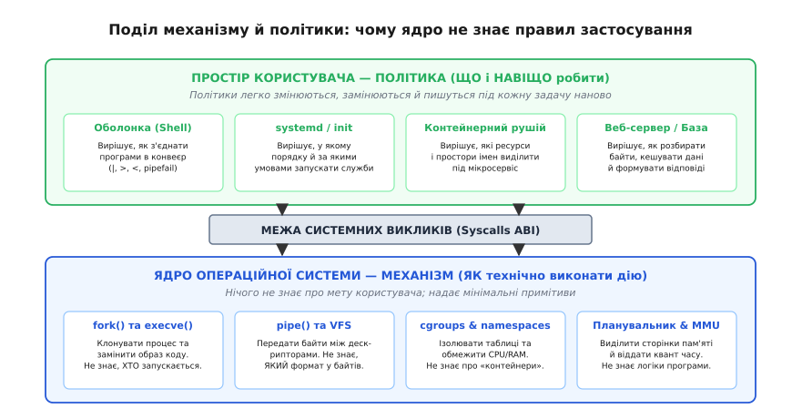
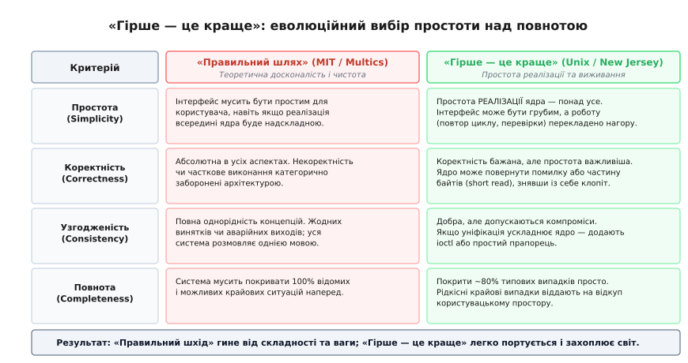

# Чому ця модель пережила все інше

<preknowlist>
- [«Гірше — це краще»](topic:sf-apps/worse-is-better) — чому простота внутрішньої реалізації та легкість портування перемагають теоретичну досконалість і повноту інтерфейсу.
- [Інтерфейс проти реалізації](topic:sf-apps/interface-vs-implementation) — різниця між незмінним контрактом на межі та замінними внутрішніми нутрощами системи.
- [Наскрізний аргумент (end-to-end argument)](topic:sf-apps/end-to-end-argument) — чому низькорівневі шари не повинні брати на себе складні гарантії, які все одно мусить перевіряти кінцевий застосунок.
</preknowlist>

У 1969 році комп'ютерна наука вже вміла проєктувати операційні системи, що виглядали незрівнянно досконалішими, багатшими та потужнішими за ранній Unix. Проєкт Multics спирався на восьмирівневі апаратні кільця захисту, динамічне сегментування пам'яті та мову PL/I. Операційна система OS/360 від IBM надавала складні механізми типізованого доступу до записів і транзакційні монітори. Десятиліттям пізніше інженери DEC створили VMS із вбудованим версіонуванням файлів та індексно-послідовними таблицями; дослідники MIT побудували Lisp-машини з апаратними тегами типів і суцільною мовною персистентністю; а теоретики мікроядерної архітектури розробили Mach, обіцяючи математично чисту ізоляцію модулів через передачу повідомлень.

Проте сьогодні кожен із п'ятисот найпотужніших суперкомп'ютерів планети, переважна більшість хмарних серверів, усі смартфони на Android та iOS, мільйони вбудованих контролерів і вся базова інфраструктура глобального Інтернету працюють під керуванням прямих нащадків Unix — насамперед Linux та BSD-систем.

Цей факт не є випадковістю ринку чи наслідком вдалого ліцензування. Це фундаментальний інженерний результат. Модель Unix пережила всі технологічні революції — від переходу з 16-бітних міні-комп'ютерів із 64 кілобайтами пам'яті до багатоядерних суперсерверів і розподілених датацентрів — завдяки чотирьом засадничим архітектурним опорам: **вузькому поясу інтерфейсу**, **строгому поділу механізму й політики**, **принципу переваги простоти реалізації над повнотою семантики** та **моделі одноразових ізольованих процесів**.

## Перший стовп: «Вузький пояс» і закон сумісності

Щоб зрозуміти, чому Unix став універсальним стандартом обчислень, корисно поглянути на іншу технологію, яка завоювала світ за тим самим принципом — протокол IP (*Internet Protocol*).

У 1980-х роках існували значно складніші й теоретично досконаліші мережеві стандарти: наприклад, мережі ATM (*Asynchronous Transfer Mode*), що забезпечували апаратну комутацію фіксованих комірок із гарантованою якістю обслуговування (QoS) та вбудованим резервуванням смуги пропускання. Проте перемогла модель Інтернету з її принципом «пісочного годинника» (*hourglass model*). Посередині цього годинника розташований ультрамінімалістичний, навмисно ненадійний протокол IP — **вузький пояс** (*narrow waist*). Усе, що знаходиться над цим поясом (HTTP, SSH, відеострімінг, електронна пошта), не знає нічого про фізичне середовище; усе, що під ним (оптоволокно, кручена пара, Wi-Fi, супутник, стільниковий зв'язок), не знає нічого про прикладні програми. Протокол IP переносить лише сирі байти без гарантій порядку й доставки.

Unix застосував принцип вузького пояса до операційних систем за десять років до появи комерційного Інтернету:

1. **Вузький пояс даних**: потік байтів без внутрішньої структури (лат. *structura* — будова). Жодних записів фіксованої довжини, жодних вбудованих схем таблиць чи обов'язкових системних заголовків.
2. **Вузький пояс операцій**: мінімальний набір системних викликів — `open()`, `read()`, `write()`, `close()`, `lseek()`.
3. **Вузький пояс з'єднання**: мале ціле число — [файловий дескриптор](topic:sys-unix/file-descriptor) — як єдиний абстрактний роз'єм для файлів на диску, каналів між процесами, терміналів і мережевих сокетів.


*Вузький пояс розриває квадратичну залежність між кількістю програм і кількістю джерел даних. Замість написання окремих драйверних адаптерів під кожну пару система підтримує спільний інтерфейс байтового потоку.*

Арифметика тут безжальна. Якщо система має `N` програм і `M` видів джерел даних (диски, магнітні стрічки, термінали, сокети), то в типізованій системі на кшталт OS/360 або VMS для кожної комбінації потрібен власний код конвертації — кількість зв'язків зростає як `N × M`. Поява нового формату чи пристрою вимагає оновлення або перекомпіляції всіх наявних програм.

У моделі Unix завдяки вузькому поясу кількість зв'язків дорівнює `N + M`. Програма `sort` або `grep` пишеться один раз під інтерфейс дескриптора. Коли інженери додають новий носій — наприклад, твердотільний накопичувач NVMe, віртуальну пам'ять у RAM (`tmpfs`) чи мережевий сокет, — жодна з наявних утиліт не змінюється ні на байт. Вони продовжують викликати `read()` та `write()`.

Універсальність виявилася ціннішою за типізацію. Тип можна накласти згори в користувацькому просторі за потреби, але викинути жорстко зашитий тип із низькорівневого інтерфейсу ядра неможливо.

## Другий стовп: Розділення механізму й політики

Найшвидший спосіб приректи операційну систему на застарівання — це вбудувати в її ядро конкретні бізнес-правила, сценарії використання або організаційні політики.

Класичні системи робили це постійно:
- **Multics** вбудував правила авторизації користувачів і пріоритети доступу безпосередньо в апаратні сегменти та кільця захисту.
- **VAX/VMS** вбудував у ядро політику версіонування файлів (збереження до трьох останніх копій) та формати бізнес-записів RMS.
- **Класичний MacOS і ранній Windows** зашили графічну віконну підсистему прямо в ядро або жорстко пов'язали її з системними процесами.

Unix проголосив фундаментальне правило архітектурної гігієни: **ядро надає чисті механізми, але ніколи не диктує політику**. Механізм (грец. *mechane* — знаряддя, пристрій) — це відповідь на питання «*як технічно зробити дію*». Політика (грец. *politike* — мистецтво управління) — це відповідь на питання «*що саме, коли і навіщо робити*».



*Поділ на механізм і політику гарантує довговічність ядра: зміна вимог користувача або бізнесу призводить лише до написання нової утиліти в просторі користувача, не зачіпаючи перевірені низькорівневі примітиви.*

Найяскравішим проявом цього принципу є розділення операції запуску нової програми на два системні виклики: [`fork()`](topic:sys-unix/fork-semantics) та [`execve()`](topic:sys-unix/exec-semantics).

У монолітному виклику `CreateProcess()` ядро змушене знати все про політику запуску: які файли відкрити, які права передати, чи створювати нове консольне вікно, які змінні середовища прокинути. Якщо користувачеві потрібна комбінація, не передбачена розробниками API, він опиняється в глухому куті.

В Unix ядро надає два чисті механізми:
1. `fork()`: створити точний клон поточного процесу з розділеними адресними просторами через копіювання при записі (*Copy-On-Write*).
2. `execve()`: викинути поточний код і завантажити новий виконуваний файл.

Між цими двома викликами дочірній процес виконується у звичайному [просторі користувача](topic:sys-unix/kernel-and-userspace). Саме там, у користувацькому коді, реалізується будь-яка довільна політика:
- Оболонка може підмінити дескриптори 0, 1, 2 через виклик `dup2()` для організації конвеєра;
- Демон ініціалізації може обмежити ресурси через `setrlimit()` або [cgroups](topic:sys-unix/cgroups-resource-model);
- Контейнерний рушій може ізолювати файлове дерево через `chroot()` або [простори імен (namespaces)](topic:sys-unix/namespaces);
- Служба безпеки може скинути права до непривілейованого користувача через `setuid()`.

Ядро не знає, що дочірній процес став веб-сервером чи ланкою в конвеєрі `grep | awk | sort`. Воно лише безвідмовно виконало примітиви клонування та заміни пам'яті.

Як саме цей поділ втілюється в системному коді, від створення дочірнього процесу до реалізації експоненційного сповільнення при збоях, розібрано в окремому практичному проєкті: [розробка наглядача процесів без вбудованих догм](topic:unix/why-unix-won/proj-mechanism-vs-policy.md).

## Третій стовп: «Гірше — це краще» як еволюційна суперсила

У 1989 році Річард Ґебріел у відомому есе «Парадигма Lisp: Програмування від дна до верху» сформулював концепцію, що пояснила тріумф Unix над його академічно бездоганними конкурентами: філософію **«Гірше — це краще»** (*Worse is Better*, або підхід Нью-Джерсі, де розташовувалася Bell Labs) проти **«Правильного шляху»** (*The Right Thing*, або підхід MIT та Стенфорда).

Ґебріел зіставив дві школи системного проєктування за чотирма фундаментальними критеріями:

| Критерій | «Правильний шлях» (MIT / Multics / Lisp) | «Гірше — це краще» (Unix / C / New Jersey) |
| :--- | :--- | :--- |
| **Простота** | Інтерфейс має бути простим і зручним для користувача. Складність реалізації всередині ядра не має значення. | **Простота реалізації всередині ядра — абсолютний пріоритет.** Інтерфейс може бути грубим, а робота перекладається на програміста. |
| **Коректність** | Абсолютна в усіх аспектах. Неповнота або часткове виконання операції неприпустимі. | Коректність бажана, але простота коду важливіша. Дозволено повертати помилку або частину даних, якщо повна обробка переускладнює ядро. |
| **Узгодженість** | Жодних винятків. Усі підсистеми розмовляють однією абстрактною мовою. | Узгодженість добра, але нею можна пожертвувати заради простоти коду (наприклад, додавши виклик `ioctl`). |
| **Повнота** | Система має покривати 100% відомих і потенційних крайових випадків. | Досить покрити 80% типових задач просто, а рідкісні крайові випадки віддати користувачеві. |



*Філософія «Гірше — це краще» ставить простоту внутрішнього коду вище за все. Це робить систему надзвичайно дешевою для портування, швидкою на реальному залізі та життєздатною в умовах обмежених ресурсів.*

Класичний приклад цієї філософії в ядрі Unix — обробка переривань системних викликів.

Уявіть процес, який заблокувався у виклику `read()`, очікуючи на байти з повільного термінала чи стрічки. У цей момент процесу надходить асинхронний системний сигнал. Що має зробити ядро?
- **«Правильний шлях» (MIT/Multics)**: Ядро зобов'язане призупинити виклик, зберегти повний контекст вводу-виводу, виконати обробник сигналу користувача, а потім прозоро й безшовно відновити виконання `read()` з точного місця зупинки. Це вимагає складних транзакційних машин станів у ядрі та роздуває кодову базу.
- **«Гірше — це краще» (Unix)**: Ядро просто скасовує виклик `read()`, не виконує операцію і повертає користувачеві помилку зі статусом [`EINTR`](topic:sys-unix/syscall-mechanics). Ядро каже програмісту: «Мене перервали. Я знімаю з себе всю відповідальність. Напиши сам цикл `while (read(...) == -1 && errno == EINTR)` навколо виклику».

Те саме стосується так званих **коротких читань** (*short reads*). Виклик `read(fd, buf, 4096)` має повне право повернути 10 байтів замість 4096, якщо в буфері наразі є лише 10 байтів. Ядро не чекає накопичення повного пакета й не гарантує атомарного збирання кадрів.

Це рішення зробило ядро Unix на порядок простішим, компактнішим і стабільнішим за ядра конкурентів. Програміст у просторі користувача мусив писати обережні цикли перевірок, але саме ядро стало майже невразливим до внутрішніх блокувань і дедлоків.

Ця простота реалізації дала колосальну еволюційну перевагу: **портативність** (лат. *portare* — нести, переносити). Коли на початку 1980-х і 1990-х років на ринку з'являвся новий мікропроцесор — Motorola 68000, Intel 386, MIPS, SPARC, ARM, PowerPC, — для перенесення Unix на нову платформу одному інженеру було достатньо написати невеликий шар асемблерного коду для комутації контексту й компілятор C. Складні системи на кшталт VMS чи Lisp-машин вимагали років праці гігантських колективів або спеціалізованого кремнію, і тому вимерли разом зі своїм залізом.

Як саме розгорталася ця боротьба і чому в ній загинули найвідоміші альтернативи свого часу, розказано окремо: [історичний цвинтар Multics, VMS, Mach та Lisp-машин](topic:unix/why-unix-won/hist-competitors-graveyard.md).

## Четвертий стовп: Одноразові процеси та природні межі ізоляції

У багатьох об'єктно-орієнтованих операційних системах 1980-х років (наприклад, у Smalltalk-середовищах чи на Lisp-машинах) панувала ідея **єдиного адресного простору** (*single address space*). Усі компоненти системи жили в спільній пам'яті, обмінюючись живими об'єктами через прямі вказівники.

У теорії це давало неймовірну швидкість і гнучкість: жодної серіалізації даних у текст, жодних системних викликів і копіювань. На практиці це перетворювало систему на мінне поле:
1. Помилка в одній компоненті (нескінченна рекурсія, переповнення буфера або витік пам'яті) поступово отруювала спільний стан усього середовища.
2. Програми накопичували фрагментацію пам'яті, і єдиним способом відновити стабільність було повне перезавантаження всієї машини.

Unix зробив базовою одиницею виконання [процес](topic:sys-unix/process-model) — ізольовану сутність із власним адресним простором, власними таблицями сторінок MMU та власним набором дескрипторів.

Це породило концепцію **одноразового інструменту**:
- Програма запускається для виконання конкретної порції роботи.
- Під час роботи вона може виділяти пам'ять, відкривати тимчасові файли та маніпулювати структурами без страху зашкодити сусідам.
- У мить виходу програми через `exit()` ядро операційної системи здійснює **повне й гарантоване прибирання**: звільняє всі сторінки фізичної пам'яті, закриває всі відкриті файли й сокети, скидає всі блокування (*locks*) та прибирає дескриптори.

Процес в Unix є ідеальною **межею ізоляції збоїв** (*failure domain*). Якщо утиліта аварійно падає із помилкою сегментації (`SIGSEGV`), це не впливає на стабільність системи: ядро фіксує її смерть, повертає статус батькові й продовжує роботу.

Ця властивість зробила можливим [конвеєрне складання малих програм](topic:sys-unix/unix-philosophy): програми з'єднуються каналами на льоту, працюють одночасно на потоці даних і зникають після завершення задачі, не залишаючи після себе жодного прихованого стану.

## Наскрізний аргумент: чому ядро не мусить гарантувати зайвого

У класичній статті 1981 року «Наскрізні міркування при проєктуванні систем» Джером Зальцер, Девід Рід та Девід Кларк сформулювали принцип, який пояснює стійкість Unix: **функцію можна повністю й правильно реалізувати лише за участі та знання кінцевого застосунку; спроба вбудувати її в низькі шари системи не позбавляє кінцевий рівень необхідності перевірки, а лише сповільнює всіх інших**.

Конкуренти Unix намагалися забезпечити абсолютну надійність усередині ОС:
- Операційні системи класу IBM AS/400 та Tandem NonStop намагалися реалізувати транзакційні файлові сховища на рівні мікрокоду та системних блокувань.
- Мережеві стеки складних протоколів (X.25) вимагали підтвердження отримання кожного окремого пакету на кожному проміжному маршрутизаторі.

Unix і наскрізний принцип показали, що такі зусилля є марною тратою продуктивності:
- Навіть якщо ядро забезпечить транзакційний запис блоку на диск, це не рятує базу даних від збою живлення посеред запису багатосторінкового B-дерева. База даних (PostgreSQL, SQLite) **все одно зобов'язана** вести власний журнал випереджального запису (WAL, *Write-Ahead Logging*) у просторі користувача.
- Якщо кінцевий застосунок усе одно змушений дублювати перевірку цілісності, то вбудовування важких транзакцій у ядро лише гальмує прості програми на кшталт компіляторів і текстових редакторів, яким ці гарантії не потрібні взагалі.

Unix звів обов'язки ядра до гранично чесного мінімуму: скинути байти в кеш сторінок і дати застосунку явний інструмент синхронізації — системний виклик `fsync()`. Уся відповідальність за консистентність даних лягла туди, де є повне розуміння предметної області — на сам застосунок.

## Мова C і стандартизація POSIX: захист від фрагментації

Успіх моделі Unix був би неможливим без ще одного критичного чинника — **симбіозу з мовою C та стандартизації [POSIX](topic:sys-unix/posix-standard)**.

Більшість операційних систем 1970-х років розроблялися або на асемблері конкретного процесора, або складними експериментальними мовами, компілятори яких існували в одному екземплярі (PL/I у Multics, Bliss у DEC). Денніс Рітчі створив C як «портативний асемблер»: мову, що дає прямий доступ до байтів і пам'яті через вказівники, але не прив'язана до архітектури конкретного чипа.

Коли у 1980-х роках почалися так звані «війни Unix» (*Unix wars*) між комерційними дистрибутивами (System V від AT&T, SunOS, HP-UX, AIX, IRIX) та академічним BSD, виникла смертельна загроза фрагментації: кожен вендор додавав власні системні виклики та прапорці.

Порятунком став стандарт **POSIX.1 (IEEE 1003.1, 1988 рік)**. Він зафіксував набір системних викликів, сигналів, дескрипторів та поведінку оболонки як обов'язковий інженерний контракт. Стандартизація межі дозволила створити величезну екосистему відкритого коду — утиліти проєкту GNU, компілятор GCC, веб-сервер Apache, бази даних. Коли 1991 року з'явився Linux, йому не довелося чекати на написання прикладного софту: завдяки сумісності з POSIX тисячі готових складних програм скомпілювалися на ньому за лічені дні.

## Шар VFS і віртуалізація простору імен

У середині 1980-х років компанія Sun Microsystems розробила шар **віртуальної файлової системи** (VFS). Це рішення перетворило концепцію «усе є файлом» із вдалого трюку на безмежно розширювану архітектуру.

VFS формалізувала поліморфну таблицю диспетчеризації операцій: структуру вказівників на функції `struct file_operations` та `struct inode_operations`. Для простору користувача кожен файл залишався тим самим набором дієслів (`read`, `write`, `lseek`). Але під капотом VFS дозволила динамічно підставляти абсолютно будь-яку реалізацію:
1. Традиційні дискові файлові системи (ext4, XFS, btrfs, ZFS);
2. Мережеві протоколи віддаленого доступу (NFS, SMB, 9P);
3. Псевдофайлові системи відображення стану ядра (`/proc` для процесів, `/sys` для дерева пристроїв і драйверів, `/dev/pts` для віртуальних терміналів);
4. Пам'яттєві тимчасові сховища (`tmpfs`, `ramfs`);
5. Шаруваті об'єднані файлові системи (*overlayfs* / *union mounts*).

Особливо показовою стала поява `overlayfs`. Вона дозволяє накласти шар файлів «лише для запису» поверх базового образу «лише для читання». Саме на цій можливості VFS тримається вся сучасна контейнеризація: образ контейнера Docker завантажується один раз і розділяється між сотнями запущених екземплярів, а кожен процес бачить власні локальні зміни без копіювання гігабайтів даних.

Шар VFS показав силу чистого інтерфейсу: не змінюючи жодного системного виклику, операційна система навчилася працювати з хмарними об'єктними сховищами, криптографічними контейнерами та розподіленими кластерними дисками.

## Математика потокового конвеєра: вбудований протитиск

Одним із найменш помітних, але технічно фундаментальних механізмів Unix є **керування темпом** у конвеєрах.

Коли дві програми з'єднуються символом каналу в оболонці:
```sh
генератор_трафіку | фільтр_обробки
```
ядро створює в пам'яті фіксований кільцевий буфер розміром 64 КіБ (у сучасному Linux).

Цей фіксований розмір діє як автоматичний регулятор темпу:
- Якщо перший процес (`генератор`) працює швидше, ніж другий (`фільтр`), кільцевий буфер швидко заповнюється.
- Щойно вільне місце вичерпується, наступний системний виклик `write()` у генераторі **блокує процес і переводить його в стан сну**.
- Другий процес (`фільтр`) спокійно вичитує дані. Щойно він забирає порцію байтів, ядро будить генератор і дозволяє йому записати наступну порцію.

Цей механізм у сучасних розподілених системах відомий як **протитиск** (*backpressure*). У складних брокерах повідомлень (Kafka, RabbitMQ) для організації протитиску доводиться налаштовувати водяні знаки пам'яті, вікна ковзання та спеціальні мережеві сповіщення.

У конвеєрі Unix протитиск виникає **безкоштовно**, як природний наслідок взаємодії процесу з обмеженим буфером ядра. Конвеєр із десятка утиліт може перекачувати терабайти даних крізь комп'ютер із кількома мегабайтами RAM, ніколи не переповнюючи пам'ять і автоматично синхронізуючи швидкість усіх ланок за найповільнішим учасником.

## Як модель увібрала власні обмеження

Було б нечесно стверджувати, що модель Unix не мала вад. Вона мала серйозні інженерні компроміси, які в різні епохи ставали вузькими місцями:

1. **Накладні витрати на розбір тексту**: перетворення чисел у рядки й назад на кожній межі конвеєра вимагає процесорного часу.
2. **Аварійний клапан `ioctl`**: коли п'яти базових дієслів забракло для керування специфічними властивостями пристроїв (швидкістю UART чи режимами радіомодемів), з'явився виклик `ioctl` — дірка в типізації, крізь яку кожен драйвер вивів власні несумісні структури.
3. **Надто грубий привілей `root`**: модель із єдиним всесильним суперкористувачем (UID 0) була занадто небезпечною для серверних систем.
4. **Проблема масштабування блокуючого вводу-виводу (C10K/C10M)**: класичні синхронні виклики `read()` не могли масштабуватися на сотні тисяч одночасних мережевих з'єднань.

Проте тріумф Unix полягає в тому, що система змогла подолати ці обмеження, **не ламаючи свого фундаменту**:
- **Від тексту до двійкових потоків і BPF**: для критичних за швидкістю ділянок з'явилися структуровані формати (JSON, Protobuf), а для обробки мільйонів пакетів у ядрі — верифікована віртуальна машина eBPF, що дозволяє виконувати користувацький код прямо в контексті ядра без перемикання контексту.
- **Від монолітного root до просторів імен і Capabilities**: всесилля адміністратора було розбито на десятки незалежних привілеїв (*Linux Capabilities*), а простори імен (*namespaces*) дозволили створювати віртуалізовані середовища з власними ізольованими деревами процесів і мереж — саме так народилися сучасні контейнери Docker та LXC.
- **Від блокування до дескрипторів очікування**: коли системі знадобився неблокуючий асинхронний ввід-вивід, ядро не відмовилося від файлових дескрипторів — воно створило інтерфейси `epoll` та `io_uring`, перетворивши сам дескриптор на універсальний ключ очікування подій.

## Головна іронія: Сучасна хмара перевідкрила Unix

Найяскравішим доказом життєздатності моделі Unix є те, що всі сучасні технології хмарних обчислень та мікросервісів, які створювалися впродовж останніх п'ятнадцяти років, фактично **повторно винайшли Unix на рівні датацентрів**:

- **Контейнеризація (Docker, Podman)** — це не що інше, як класичний процес Unix, загорнутий у простори імен (*namespaces*) та обмежений контролером ресурсів (*cgroups*), із власним змонтованим кореневим каталогом VFS.
- **Мікросервісна архітектура** — це дослівне перенесення філософії Unix на розподілені системи: «роби одну справу добре», де замість каналу `pipe` використовується мережевий сокет, а замість `stdin`/`stdout` — запити HTTP POST із JSON-тілом.
- **Оркестратор Kubernetes** — це розподілений планувальник процесів і конвеєрів (*shell/init* для цілого кластера), де под (*Pod*) відіграє роль групи процесів зі спільною мережею та змонтованими томами.
- **Безсерверні обчислення (Serverless / AWS Lambda)** — це повернення до ідеї одноразового короткоживучого процесу, який запускається під одну подію, обробляє вхідні байти, повертає результат і негайно знищується.
- **Архітектурний стиль REST та веб-інтерфейси** — це пряме втілення «усе є файлом» у глобальному масштабі: ієрархічні URI-імена для всіх ресурсів і вузький пояс універсальних дієслів HTTP (GET, POST, PUT, DELETE), що точно відповідають операціям `read()`, `write()`, `create()` та `unlink()`.

У 1990-х та 2000-х роках індустрія намагалася замінити цю модель складними розподіленими об'єктними брокерами: стандартами CORBA, DCOM, SOAP та важкими серверами корпоративних компонентів (J2EE Enterprise JavaBeans). Усі ці надскладні типізовані монстри зазнали краху під власною вагою. Індустрія викинула їх на смітник і повернулася до плоских байтів, тексту JSON, дескрипторів сокетів і незалежних мікросервісів.

> 🔧 **Навіщо це. Практичні уроки для архітектора систем.**
> П'ятдесятирічний досвід виживання моделі Unix дає п'ять засадничих правил для проєктування будь-якого сучасного програмного забезпечення:
> 1. **Проєктуйте вузькі пояси на межах систем**: мінімізуйте кількість дієслів і форматів у публічних API. Чим менше припущень про природу даних робить ваш інтерфейс, тим довше він проживе.
> 2. **Строго відокремлюйте механізм від політики**: рушій обробки ніколи не повинен знати про бізнес-правила клієнта. Давайте користувачеві примітиви, а не готові негнучкі сценарії.
> 3. **Робіть стан замінним, а процеси — одноразовими**: будуйте архітектуру так, щоб аварійне падіння будь-якого вузла чи мікросервісу не пошкоджувало спільні дані й автоматично відновлювалося наглядачем.
> 4. **Обирайте простоту внутрішньої реалізації замість складної семантики**: якщо повна автоматизація крайового випадку вимагає роздуття рушія втричі, краще поверніть чесну помилку й змусьте клієнта повторити запит.
> 5. **Текстові або самоописові формати на межах економлять роки життя**: використовуйте прозорі дані скрізь, де немає підтверджених профілюванням обмежень пропускної здатності.

## Синтез

Операційні системи живуть і перемагають не тому, що вони містять найскладніші алгоритми чи надають найбільшу кількість готових функцій у ядрі. Вони перемагають завдяки **скромності своєї архітектури**.

Unix вижив тому, що відмовився від претензій на абсолютне знання майбутнього. Замість спроби вгадати всі задачі, які людство захоче розв'язати з комп'ютером через п'ятдесят років, автори системи створили мінімальний набір інструментів: потік нетипізованих байтів, таблицю дескрипторів, клонування ізольованих процесів і з'єднувальний канал між ними.

Цей набір виявився достатнім для того, щоб витримати зміну апаратних поколінь, народження Інтернету, прихід мобільних пристроїв і розгортання глобальних хмарних платформ. І саме на цьому фундаменті будується будь-яка надійна система сьогодення.
