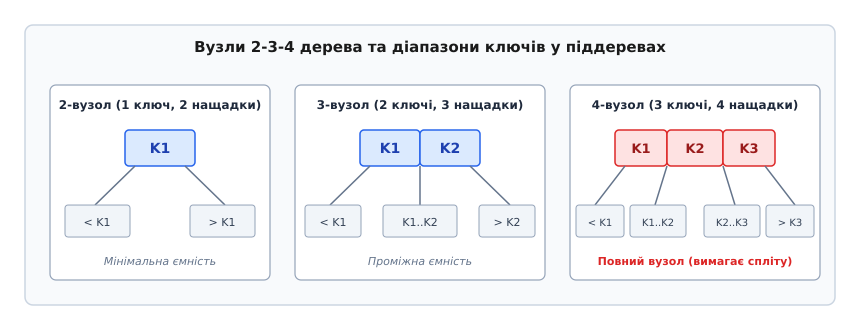
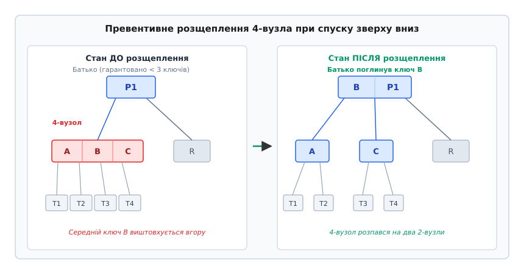
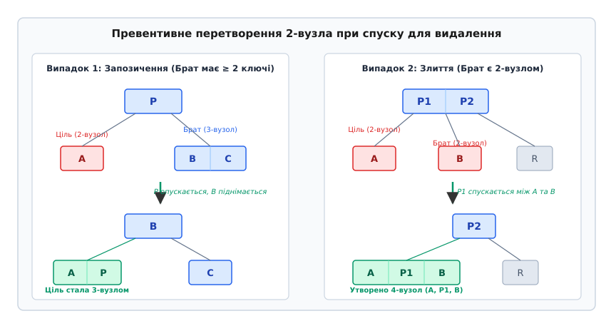
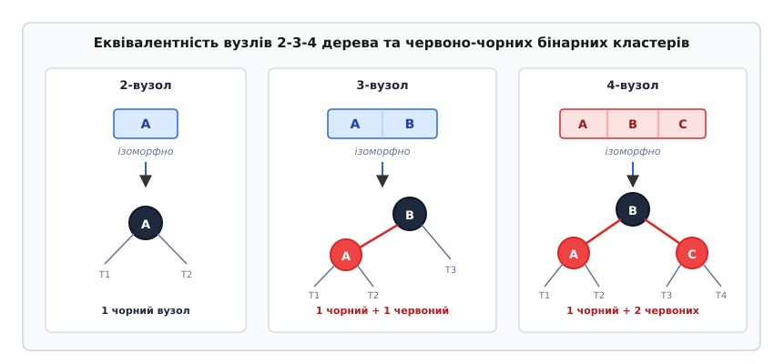

# 2-3-4 дерево

<preknowlist>
- [Бінарне дерево пошуку](topic:sf-algorithms/binary-search-tree) — порядок розташування ключів (ліворуч менші, праворуч більші) та базові операції пошуку.
- [B-дерево](topic:sf-data/b-tree) — концепція багатошляхового вузла та балансування глибини листків.
- [Повороти дерева](topic:sf-algorithms/tree-rotation) — зміна локальної топології без порушення симетричного порядку.
</preknowlist>

Коли у звичайне бінарне дерево пошуку надходить монотонно зростаюча послідовність ключів (наприклад, ідентифікатори 10, 20, 30, 40, 50, що додаються по черзі), кожен новий елемент приєднується виключно як правий нащадок попереднього. Дерево миттєво вироджується у лінійний зв'язаний список глибиною `N`. Замість очікуваного логарифмічного часу пошуку процесор змушений послідовно обходити всі `N` вершин, уповільнюючи виконання операцій до неприйнятної складності `O(N)`. При обробці мільйона записів це перетворює 20 швидких переходів за вказівниками на мільйон ітерацій, що блокує роботу обчислювальної системи.

Самобалансовані структури даних покликані запобігати такому виродженню шляхом динамічного контролю висоти піддерев. Проте класичні рішення створюють іншу проблему — необхідність каскадного балансування знизу вгору (англ. *bottom-up rebalancing*). В AVL-деревах після вставки нового листка алгоритм змушений підніматися стеком викликів назад до кореня, перевіряючи фактори балансу та виконуючи серії локальних поворотів. У традиційних B-деревах переповнення листка викликає розщеплення, яке за принципом ланцюгової реакції може поширюватися вгору через усі рівні ієрархії аж до кореневого вузла. У багатопотокових системах такий двопрохідний алгоритм вимагає блокування цілих вертикальних шляхів від листка до вершини, що кардинально знижує пропускну здатність паралельної обробки даних.

2-3-4 дерево (англ. *2-3-4 tree*, або B-дерево порядку 4) розв'язує задачу самобалансування принципово іншим шляхом. Замість реактивного усунення переповнень під час зворотного підйому воно застосовує стратегію **превентивного балансування зверху вниз (Top-Down)**. Під час спуску від кореня до листка алгоритм завчасно трансформує критичні вузли, гарантуючи виконання вставки або вилучення за один-єдиний низхідний прохід без повернення назад і без збереження стека батьківських вказівників.

Детальний опис історичного шляху від симетричних бінарних B-дерев Рудольфа Баєра до колірного друку в Xerox PARC наведено у вставці [Еволюція багатошляхового пошуку](topic:sf-algorithms/2-3-4-tree/hist-234-tree.md).

---

## Анатомія вузлів та просторовий інваріант

2-3-4 дерево є багатошляховим деревом пошуку (англ. *multi-way search tree*), де кожен внутрішній вузол залежно від кількості збережених ключів належить до однієї з трьох категорій:

1. **2-вузол:** містить рівно `1` ключ `K1` та має `2` дочірні вказівники. Усі ключі лівого піддерева строго менші за `K1`, а ключі правого піддерева — строго більші за `K1`. Це мінімально допустима ємність вузла.
2. **3-вузол:** містить `2` впорядковані ключі `K1 < K2` та має `3` дочірні вказівники. Ліве піддерево містить ключі `< K1`, середнє піддерево — ключі з відкритого інтервалу `(K1, K2)`, а праве піддерево — ключі `> K2`.
3. **4-вузол:** містить `3` впорядковані ключі `K1 < K2 < K3` та має `4` дочірні вказівники. Вказівники розбивають числовий простір на 4 неперетинні інтервали: `< K1`, `(K1, K2)`, `(K2, K3)` та `> K3`. Це максимально допустима ємність вузла; додавання четвертого ключа робить вузол переповненим і вимагає його обов'язкового розщеплення.


*Структура 2-вузла, 3-вузла та 4-вузла з відповідними діапазонами ключів дочірніх піддерев.*

Листові вузли 2-3-4 дерева підпорядковуються тій самій класифікації (містять 1, 2 або 3 ключі), але всі їхні дочірні вказівники є порожніми (`NULL`).

### Фундаментальний інваріант ідеального балансу

Головна геометрична властивість 2-3-4 дерева формулюється так: **усі листові вузли дерева розташовані на абсолютно однаковій глибині від кореня**.

У 2-3-4 дереві не може існувати листка, шлях до якого містить три ребра, якщо до іншого листка веде чотири ребра. Завдяки цьому дерево ніколи не страждає від локальних перекосів, а його загальна висота строго обмежена логарифмічною функцією:

```
h ≤ log₂(N + 1) - 1
```

де `N` — сумарна кількість збережених у дереві ключів. Точне математичне виведення верхньої та нижньої меж висоти, а також аналіз максимальної ємності рівнів наведено у вставці [Математичний аналіз висоти та ємності](topic:sf-algorithms/2-3-4-tree/math-234-bounds.md).

> 🔧 **Навіщо це.**
> Ідеальний баланс за висотою перетворює пошук у передбачувану системну операцію з фіксованим часом реакції. Якщо класичне бінарне дерево може давати непередбачувані затримки через витягування окремих гілок, 2-3-4 дерево гарантує, що операція пошуку будь-якого ключа серед мільйона записів виконає не більше ніж 19 переходів по вузлах у найгіршому випадку.

---

## Операція пошуку (Lookup)

Пошук ключа `X` у 2-3-4 дереві узагальнює стандартний алгоритм пошуку в бінарному дереві на випадок декількох ключів усередині однієї вершини. Алгоритм починається з кореня і виконує такі послідовні кроки:

1. Нехай поточний вузол містить `k` ключів `keys[0] .. keys[k-1]` (де `k ∈ {1, 2, 3}`).
2. Значення `X` послідовно або бінарно порівнюється з ключами поточного вузла:
   - Якщо знайдено індекс `i`, такий що `keys[i] == X`, пошук завершується успішно: знайдено вказівник на дані.
   - Якщо `X < keys[0]`, пошук переходить у піддерево `children[0]`.
   - Якщо `keys[i-1] < X < keys[i]`, пошук переходить у проміжне піддерево `children[i]`.
   - Якщо `X > keys[k-1]`, пошук переходить у крайнє праве піддерево `children[k]`.
3. Якщо досягнуто листка і ключ `X` у ньому відсутній, операція повертає ознаку невдачі: ключ у дереві відсутній.

Оскільки на кожному рівні дерева виконується не більше ніж 2–3 елементарних порівнянь, а кількість рівнів не перевищує `log₂(N + 1)`, загальний час пошуку строго становить `O(log N)`.

---

## Вставка зверху вниз (Top-Down Insertion)

Класичний спосіб додавання елемента до B-дерева полягає у спуску до потрібного листка та вставці ключа безпосередньо у знайдений масив. Якщо листок уже містить 3 ключі, він стає переповненим 5-вузлом. Листок доводиться розщеплювати на два 2-вузли, а його середній ключ проштовхувати вгору у батьківський вузол. Якщо батько також був 4-вузлом, він теж розщеплюється, запускаючи хвилю зворотного підйому (англ. *cascading split*) аж до вершини дерева.

2-3-4 дерево усуває потребу в зворотному підйомі за допомогою **превентивного розщеплення 4-вузлів під час руху зверху вниз**.

### Механізм превентивного розщеплення

Коли алгоритм вставки спускається від кореня до цільового листка, для кожного відвіданого вузла виконується перевірка: чи не є він 4-вузлом (тобто чи не містить він 3 ключі).

Якщо поточний вузол є 4-вузлом, він **негайно розщеплюється ще до того, як алгоритм піде далі в його піддерева**:

1. Вузол, що містить ключі `[A, B, C]`, розпадається на два незалежні 2-вузли: лівий вузол `[A]` та правий вузол `[C]`.
2. Чотири дочірні піддерева вихідного вузла розподіляються порівну: піддерева `T1, T2` приєднуються до лівого вузла `[A]`, а піддерева `T3, T4` — до правого вузла `[C]`.
3. Середній ключ `B` (медіана) проштовхується вгору у батьківський вузол, де займає відповідне впорядковане місце між вказівниками на нові вузли `[A]` та `[C]`.


*Превентивне виштовхування середнього ключа B у батьківський вузол та розподіл піддерев між двома новими 2-вузлами.*

### Чому батьківський вузол ніколи не переповнюється

Головна елегантність низхідного алгоритму полягає в індуктивному інваріанті: **коли алгоритм перебуває у поточному вузлі, його безпосередній батько гарантовано містить не більше ніж 2 ключі (є 2-вузлом або 3-вузлом)**.

Ця гарантія забезпечується попереднім кроком алгоритму: якби сам батько був 4-вузлом, алгоритм розщепив би його ще на попередній ітерації, перш ніж спуститися до поточної дитини.

Отже, коли 4-вузол виштовхує свій середній ключ `B` у батьківський вузол:
- Батьківський 2-вузол перетворюється на 3-вузол (має 2 ключі та 3 дітей).
- Батьківський 3-вузол перетворюється на 4-вузол (має 3 ключі та 4 дітей).
- Батько **ні за яких умов не переповнюється**, тому розщеплення дитини є локальною операцією з константною складністю `O(1)`, яка ніколи не спричиняє каскадних змін на вищих рівнях.

### Розщеплення кореневого вузла

Окремим базовим випадком є ситуація, коли 4-вузлом виявляється сам корінь дерева:

1. Створюється новий порожній кореневий вузол.
2. Старий корінь стає першою дитиною нового кореня.
3. Дочірній старий корінь розщеплюється за загальним правилом: ключ `B` піднімається у новий корінь, утворюючи з нього 2-вузол з двома дітьми `[A]` та `[C]`.
4. Висота всього дерева збільшується рівно на 1.

Це єдиний спосіб зростання висоти 2-3-4 дерева: дерево росте вгору від кореня, зберігаючи однакову глибину всіх листків.

### Покроковий приклад вставки послідовності

Простежимо процес послідовної побудови 2-3-4 дерева при додаванні ключів `10, 20, 30, 40, 50, 60, 70`:

1. **Вставка 10:** створюється кореневий 2-вузол `[10]`.
2. **Вставка 20:** ключ 20 додається у корінь; утворюється 3-вузол `[10, 20]`.
3. **Вставка 30:** ключ 30 додається у корінь; утворюється 4-вузол `[10, 20, 30]`.
4. **Вставка 40:**
   - Алгоритм бачить, що корінь `[10, 20, 30]` є 4-вузлом.
   - Корінь превентивно розщеплюється: створюється новий корінь `[20]`, ліва дитина `[10]`, права дитина `[30]`.
   - Алгоритм спускається до правого листка `[30]` (оскільки `40 > 20`).
   - Ключ 40 вставляється у листок `[30]`, утворюючи 3-вузол `[30, 40]`.
5. **Вставка 50:**
   - Алгоритм перевіряє корінь `[20]` (він є 2-вузлом, спліт не потрібен).
   - Алгоритм перевіряє дитину `[30, 40]` (це 3-вузол, спліт не потрібен).
   - Ключ 50 додається у листок `[30, 40]`, утворюючи 4-вузол `[30, 40, 50]`.
6. **Вставка 60:**
   - Корінь `[20]` не є 4-вузлом.
   - Алгоритм спускається праворуч і бачить, що права дитина `[30, 40, 50]` є 4-вузлом.
   - Дитина розщеплюється: медіана 40 піднімається в корінь, корінь стає 3-вузлом `[20, 40]`. Утворюються два 2-вузли: `[30]` та `[50]`.
   - Оскільки `60 > 40`, алгоритм спускається у крайній правий листок `[50]`.
   - Ключ 60 вставляється у листок `[50]`, утворюючи 3-вузол `[50, 60]`.
7. **Вставка 70:**
   - Корінь `[20, 40]` є 3-вузлом (не розщеплюється).
   - Алгоритм спускається праворуч до `[50, 60]` (3-вузол).
   - Ключ 70 додається у листок, утворюючи 4-вузол `[50, 60, 70]`.

Дерево залишається ідеально збалансованим на кожному кроці. Повна програмна реалізація алгоритму вставки мовами C та C++ міститься у вставці [Реалізація 2-3-4 дерева на C та C++](topic:sf-algorithms/2-3-4-tree/proj-234-tree.md).

---

## Вилучення зверху вниз (Top-Down Deletion)

Вилучення ключа з багатошляхового дерева є складнішим за вставку через ризик виникнення дефіциту елементів (англ. *underflow*). Якщо з 2-вузла вилучити його єдиний ключ, вузол стає порожнім 0-ключовим вузлом, що є неприпустимим порушенням інваріантів B-дерева.

Традиційне видалення знизу вгору видаляє ключ із листка, а потім піднімається вгору, виконуючи каскадні злиття вузлів. На противагу цьому 2-3-4 дерево реалізує **превентивну підготовку вузлів під час спуску зверху вниз**.

### Головне правило низхідного вилучення

Коли алгоритм спускається деревом у пошуках ключа для видалення, він гарантує, що **кожен вузол, у який здійснюється перехід, містить щонайменше 2 ключі (тобто є 3-вузлом або 4-вузлом)**.

Якщо наступний дочірній вузол `X` на шляху спуску виявляється 2-вузлом (містить лише 1 ключ), алгоритм негайно трансформує його у 3-вузол або 4-вузол ще до здійснення кроку вниз. Для цього аналізується стан безпосередніх братів вузла `X` (сусідніх дітей того самого батька).

Можливі два випадки:

### Випадок 1: Сусідній брат має ≥ 2 ключі (Запозичення / Поворот)

Якщо принаймні один із суміжних братів вузла `X` є 3-вузлом або 4-вузлом:

1. Батьківський вузол спускає свій розділовий ключ (що стоїть між `X` та цим братом) у вузол `X`.
2. Брат віддає свій крайній суміжний ключ вгору у батьківський вузол на місце спущеного роздільника.
3. Крайнє піддерево брата перепідключається до вузла `X`.
4. Вузол `X` поповнюється одним ключем і стає 3-вузлом, а брат залишається валідним 2-вузлом або 3-вузлом.

Ця операція є еквівалентом локального повороту і повністю розв'язує проблему дефіциту.


*Два сценарії низхідного відновлення ємності 2-вузла: запозичення ключа у багатого брата через батька або злиття двох 2-вузлів із розділовим ключем батьківського вузла.*

### Випадок 2: Усі суміжні брати є 2-вузлами (Злиття)

Якщо всі доступні брати вузла `X` містять лише по 1 ключу:

1. Вузол `X`, відповідний брат-2-вузол та розділовий ключ із батьківського вузла об'єднуються разом.
2. Утворюється новий об'єднаний 4-вузол, що містить рівно 3 ключі: `[Ключ_X, Роздільник_Батька, Ключ_Брата]`.
3. Оскільки батьківський вузол на попередньому кроці вже гарантовано містив щонайменше 2 ключі (був 3-вузлом або 4-вузлом), вилучення з нього одного роздільника залишає його у валідному стані (щонайменше 1 ключ).

### Злиття на рівні кореня

Якщо кореневий вузол є 2-вузлом, а обидва його нащадки також є 2-вузлами, застосовується окреме правило стиснення: корінь та обидві його дитини зливаються в один 4-вузол, який стає новим коренем дерева. Висота дерева зменшується на 1.

### Завершення вилучення

Завдяки попередній підготовці, коли алгоритм нарешті досягає цільового ключа:
- Якщо ключ знаходиться у **листку**, він просто вилучається. Оскільки листок був завчасно трансформований у 3-вузол або 4-вузол, після видалення в ньому гарантовано залишається 1 або 2 ключі. Дефіцит не виникає.
- Якщо ключ знаходиться у **внутрішньому вузлі**, він замінюється своїм безпосереднім симетричним попередником (найбільшим ключем лівого піддерева) або наступником (найменшим ключем правого піддерева). Після цього задача зводиться до вилучення заміщеного ключа з листка відповідного піддерева, куди алгоритм продовжує спуск за тими самими превентивними правилами.

### Покроковий приклад вилучення елементів

Розглянемо дерево після вставки семи елементів:
- Корінь: 3-вузол `[20, 40]`.
- Діти: лівий листок `[10]`, середній листок `[30]`, правий листок `[50, 60, 70]`.

Простежимо вилучення ключа `10`:
1. Алгоритм починає з кореня `[20, 40]`. Корінь містить 2 ключі (дефіциту немає).
2. Наступним кроком є перехід у ліве піддерево до ключа 10. Листок `[10]` є 2-вузлом (дефіцитний стан).
3. Алгоритм аналізує суміжного брата: середній листок `[30]` також є 2-вузлом.
4. Оскільки брат є 2-вузлом, застосовується **Випадок 2 (Злиття)**:
   - Листок `[10]`, перший розділовий ключ кореня `20` та листок `[30]` зливаються в один 4-вузол `[10, 20, 30]`.
   - Корінь віддає ключ 20 і стає 2-вузлом `[40]`.
   - Дерево тепер має корінь `[40]` та двох дітей: лівий 4-вузол `[10, 20, 30]` та правий 4-вузол `[50, 60, 70]`.
5. Алгоритм спускається у лівий вузол `[10, 20, 30]`. Цільовий ключ 10 знаходиться у листку, який тепер є 4-вузлом.
6. Ключ 10 видаляється, листок перетворюється на валідний 3-вузол `[20, 30]`.

Усі інваріанти збережено без жодного кроку зворотного підйому.

---

## Розширені операції: злиття дерев та діапазонні запити

Окрім базових операцій пошуку, вставки та вилучення, 2-3-4 дерево ефективно підтримує високорівневі маніпуляції з колекціями даних.

### Злиття двох дерев за розділовим ключем (Join)

Нехай задано два 2-3-4 дерева `T1` та `T2`, де всі ключі `T1` строго менші за розділовий ключ `K`, а всі ключі `T2` строго більші за `K`. Нехай `h1` та `h2` — висоти цих дерев.

1. **Якщо `h1 == h2`:** створюється новий кореневий 2-вузол із ключем `K`, лівим піддеревом `T1` та правим піддеревом `T2`. Висота результуючого дерева дорівнює `h1 + 1`. Час виконання — `O(1)`.
2. **Якщо `h1 > h2`:** алгоритм спускається вздовж крайньої правої гілки дерева `T1` до вузла на глибині `h1 - h2`. Ключ `K` та корінь дерева `T2` приєднуються як новий елемент і нове піддерево цього вузла. Якщо вузол стає переповненим, виконується локальне розщеплення з можливим підйомом на кілька рівнів. Загальний час операції становить `O(h1 - h2) = O(log N)`.
3. **Якщо `h1 < h2`:** аналогічно алгоритм спускається вздовж крайньої лівої гілки дерева `T2` до відповідної глибини за час `O(h2 - h1) = O(log N)`.

### Діапазонний пошук (Range Query)

Завдяки збереженню відсортованого порядку ключів у вузлах, пошук усіх елементів з інтервалу `[Low, High]` виконується за один симетричний обхід:
1. Алгоритм знаходить найменший ключ `≥ Low` за час `O(log N)`.
2. Починаючи з цієї позиції, виконується послідовний обхід відповідних піддерев та ключів вузла до досягнення верхньої межі `High`.
3. Загальна часова складність вибірки становить `O(log N + M)`, де `M` — кількість знайдених ключів, що задовольняють умову діапазону.

---

## Ізоморфізм між 2-3-4 деревами та червоно-чорними деревами

Хоча 2-3-4 дерево володіє концептуальною простотою та елегантним алгоритмом балансування, його пряма програмна реалізація пов'язана з помітним накладним оверхедом пам'яті. У типовій реалізації вузол повинен містити статичний масив на 3 ключі та 4 вказівники на піддерева (загалом `3 · sizeof(Key) + 4 · sizeof(Node*)` байтів). Для 2-вузла, де зберігається лише один ключ і два вказівники, більше половини виділеної пам'яті структурно пустує.

Червоно-чорне дерево (англ. *Red-Black Tree*, RB-дерево) розв'язує цю інженерну проблему, зберігаючи всі переваги 2-3-4 дерева без жодного байта марної пам'яті. **Червоно-чорне дерево — це просто компактне бінарне кодування 2-3-4 дерева**.

### Правила ізоморфного відображення

Кожен мульти-вузол 2-3-4 дерева представляється кластером зі звичайних бінарних вузлів, зв'язаних червоними та чорними ребрами:

1. **2-вузол `[A]`** відображається як один чорний бінарний вузол `A`.
2. **3-вузол `[A, B]`** відображається як батьківський чорний вузол `B` та його лівий червоний нащадок `A` (або батьківський чорний `A` з правим червоним нащадком `B`). Червоне ребро позначає внутрішній горизонтальний зв'язок між ключами одного мульти-вузла.
3. **4-вузол `[A, B, C]`** відображається як симетрична трійка: чорний батьківський вузол `B` та два його червоні нащадки — лівий `A` і правий `C`.


*Ізоморфізм між вузлами 2-3-4 дерева та бінарними червоно-чорними конфігураціями.*

### Походження інваріантів червоно-чорного дерева

Усі п'ять абстрактних правил червоно-чорного дерева миттєво стають зрозумілими, якщо поглянути на них крізь призму 2-3-4 дерева:

| Інваріант червоно-чорного дерева | Фізичний зміст у 2-3-4 дереві |
|---|---|
| **Корінь дерева завжди чорний** | Корінь 2-3-4 дерева є самостійним вузлом, він не є частиною вищого мульти-вузла. |
| **Листки (NIL-вказівники) чорні** | Листові вказівники позначають зовнішні переходи між рівнями, тому вони є чорними ребрами. |
| **У червоного вузла обидва нащадки чорні (немає двох червоних поспіль)** | Мульти-вузол 2-3-4 дерева вміщує максимум 3 ключі (4-вузол). Два червоні ребра поспіль означали б наявність 4 ключів у вузлі (5-вузол), що заборонено специфікацією B-дерева порядку 4. |
| **Однакова чорна висота для всіх шляхів від кореня до листків** | Усі листки у 2-3-4 дереві розташовані на строго однаковій глибині. Оскільки кожному вузлу 2-3-4 дерева відповідає рівно один чорний вузол, кількість чорних вузлів на будь-якому шляху від кореня до листка є абсолютно однаковою. |

### Відповідність операцій: повороти та перефарбовування

Незрозумілі на перший погляд операції вставки у червоно-чорне дерево є точними еквівалентами розщеплень та поворотів 2-3-4 дерева:

1. **Перефарбовування (Color Flip):** У червоно-чорному дереві, коли вузол має двох червоних дітей, а його батько стає червоним, виконується інверсія кольорів (батько стає червоним, діти — чорними). У 2-3-4 дереві це відповідає **розщепленню 4-вузла**: діти `A` і `C` стають самостійними чорними 2-вузлами, а середній ключ `B` стає червоним ребром, що входить у батьківський вузол.
2. **Одинарний поворот (Single Rotation):** У червоно-чорному дереві поворот застосовується, коли виникає конфлікт двох лівих або двох правих червоних вузлів. У 2-3-4 дереві це відповідає **запозиченню ключа у сусіднього 3-вузла** з обертанням роздільника через батька.
3. **Подвійний поворот (Double Rotation / Left-Right):** Відповідає нормалізації зигзагоподібного 4-вузла до канонічної симетричної форми перед виконанням розщеплення.

### Лівосторонні червоно-чорні дерева (LLRB) та 2-3 дерева

Класичне 2-3-4 дерево дозволяє 3-вузлу `[A, B]` мати два рівноправні бінарні представлення у червоно-чорному дереві: або `A` є лівою червоною дитиною чорного `B`, або `B` є правою червоною дитиною чорного `A`. Ця симетрія подвоює кількість окремих випадків поворотів у програмному коді.

У 2008 році Роберт Седжвік запропонував **лівосторонні червоно-чорні дерева (Left-Leaning Red-Black Trees, LLRB)**. В LLRB-деревах вводиться додаткове обмеження: червоне ребро всередині 3-вузла може бути нахилене **виключно ліворуч**. Якщо після вставки червоне ребро нахилене праворуч, виконується лівий поворот для нормалізації. Це відповідає строгому ізоморфізму з **2-3 деревами** (де дозволені лише 2-вузли та 3-вузли) і скорочує розмір реалізації алгоритму вставки та видалення до мінімального обсягу.

---

## Апаратна оптимізація та організація кеш-ліній

При виборі між бінарними деревами та 2-3-4 деревами в архітектурі сучасних процесорів вирішальну роль відіграє взаємодія з ієрархією пам'яті (кеш L1, L2, L3).

### Розмір вузла та лінія кешу

У сучасних процесорах з архітектурою x86-64 та ARM64 стандартний розмір кеш-лінії становить рівно **64 байти**.

Розглянемо розмір структури вузла 2-3-4 дерева для 64-бітних цілих ключів:
- 3 ключі по 8 байтів = `24 байти`.
- 4 вказівники на дітей по 8 байтів = `32 байти`.
- Лічильник `num_keys` (4 байти) + вирівнювання (4 байти) = `8 байтів`.
- Загальний розмір структури вузла: `24 + 32 + 8 = 64 байти`.

Вузол 2-3-4 дерева **ідеально вміщується рівно в одну кеш-лінію процесора**.

Коли процесор звертається до вузла 2-3-4 дерева, вся інформація — усі 3 ключі та всі 4 вказівники на нащадків — завантажується з оперативної пам'яті за один апаратний цикл кеш-промаху (англ. *cache miss*). Порівняння шуканого значення з усіма трьома ключами виконується безпосередньо у надшвидких регістрах або кеші L1.

Навпаки, у звичайному бінарному дереві (зокрема й червоно-чорному) вузол займає 32 байти (1 ключ, 2 вказівники, колір). Щоб пройти шлях еквівалентної глибини, процесору необхідно виконати удвічі більше стрибків за вказівниками між несуміжними адресами купи, що спричиняє вдвічі більше кеш-промахів і затримок шини пам'яті.

### Передбачення переходів (Branch Prediction)

Усередині 4-вузла пошук можна організувати як коротку послідовність умовних інструкцій або за допомогою SIMD-векторизації. Оскільки дані розташовані локально в одному масиві, блок передбачення переходів (англ. *branch predictor*) процесора працює значно ефективніше, ніж під час переходів за випадковими динамічними вказівниками в пам'яті.

---

## Паралелізм та блокування: перевага блокування зв'язкою (Lock Coupling)

У багатопотокових базах даних та високонавантажених серверах структури індексів зазнають одночасних звернень від десятків робочих потоків.

Традиційні bottom-up дерева вимагають блокування цілого шляху від кореня до листка (або використання важких блокувань на читання-запис), оскільки операція вставки в листок потенційно може викликати хвилю розщеплень, яка підніметься до самого кореня і змінить покажчики верхніх вузлів.

2-3-4 дерево завдяки низхідному превентивному розщепленню підтримує протокол **рухомого блокування зв'язкою (Lock Coupling / Crab Locking)**:

1. Потік захоплює блокування на поточний вузол `P`.
2. Потік перевіряє дочірній вузол `C`. Якщо `C` є 4-вузлом, потік розщеплює його прямо зараз, змінюючи лише вміст вузлів `P` та `C`.
3. Потік захоплює блокування на вузол `C`.
4. Оскільки `P` гарантовано більше ніколи не буде змінений цією операцією (розщеплення нижчих вузлів ніколи не підніметься вище `C`), потік **негайно відпускає блокування з вузла `P`**.
5. Потік продовжує спуск, утримуючи блокування лише на один або два суміжні вузли одночасно.

Цей механізм дозволяє різним потокам одночасно модифікувати різні гілки одного й того самого дерева без взаємних блокувань, забезпечуючи високу масштабованість у багатоядерних обчислювальних середовищах.

---

## Порівняльний аналіз самоврівноважених структур

Вибір конкретної структури даних у системному проектуванні диктується компромісом між простотою реалізації, витратами пам'яті та локальністю кеш-ліній процесора.

| Параметр / Структура | 2-3-4 дерево | Червоно-чорне дерево | AVL-дерево | B-дерево (великий порядок `m ≥ 64`) |
|---|---|---|---|---|
| **Тип структури** | Багатошляхове дерево пошуку | Бінарне дерево пошуку | Бінарне дерево пошуку | Багатошляхове блочне дерево |
| **Середовище розміщення** | Оперативна пам'ять (RAM) | Оперативна пам'ять (RAM) | Оперативна пам'ять (RAM) | Дискові накопичувачі / SSD / NVMe |
| **Максимальна висота** | `log₂(N + 1)` | `2 · log₂(N + 1)` | `1.44 · log₂(N + 2)` | `log_m(N)` |
| **Оверхед пам'яті на вузол** | Високий (невикористані слоти у 2-вузлах) | Мінімальний (1 біт кольору на вузол) | Низький (2 біти фактора балансу) | Мінімальний (вузли заповнені на 50–100%) |
| **Тип алгоритму вставки** | Однопрохідний зверху вниз (Top-Down) | Двопрохідний знизу вгору або Top-Down | Двопрохідний знизу вгору (Bottom-Up) | Зазвичай Bottom-Up або Top-Down |
| **Кількість поворотів при вставці** | Не застосовуються (спліти) | `≤ 2` повороти | `≤ 2` повороти | Не застосовуються |
| **Кількість поворотів при вилученні** | Не застосовуються (злиття) | `≤ 3` повороти | `O(log N)` каскадних поворотів | Не застосовуються |
| **Складність реалізації** | Середня | Висока | Середня | Висока |

### Практичні висновки для інженера

1. **Для швидкого пошуку в пам'яті з рідкісними змінами** AVL-дерева демонструють дещо кращу швидкість за рахунок меншої константи висоти (`1.44 log N` проти `2 log N` у гіршому випадку RB-дерева).
2. **Для високоінтенсивних потоків вставки та вилучення в RAM** червоно-чорні дерева (і їхня сучасна форма — LLRB) є неперевершеним стандартом індустрії завдяки гарантії не більше ніж 3 поворотів на модифікацію та нульовому простою структурної пам'яті.
3. **Для зберігання на зовнішніх носіях та у базах даних** 2-3-4 дерево поступається B-деревам високих порядків (`m = 512, 1024`), де великий розмір вузла узгоджується з розміром сторінки пам'яті ОС (4 КБ) для мінімізації кількості операцій введення-виведення.
4. **В академічній практиці та проектуванні алгоритмів** 2-3-4 дерево залишається незамінною аналітичною моделлю, яка надає наочне пояснення прихованої механіки балансування більшості сучасних асоціативних контейнерів.
