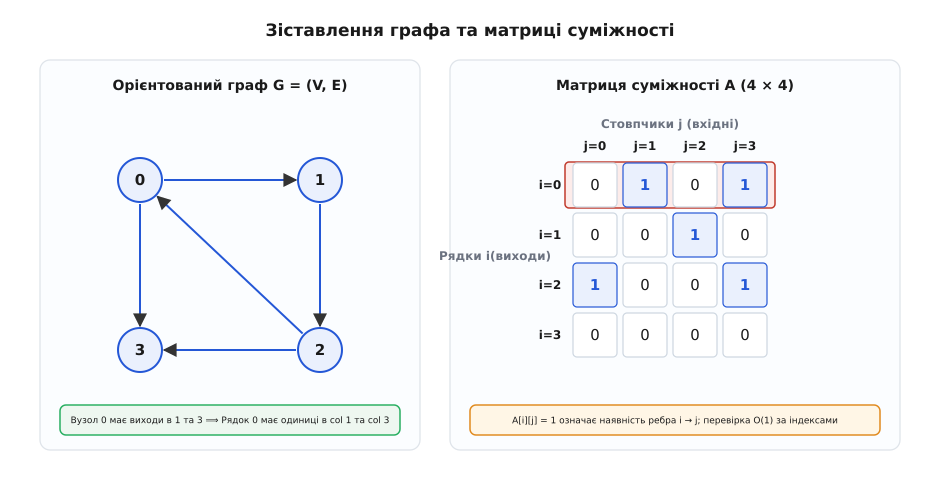
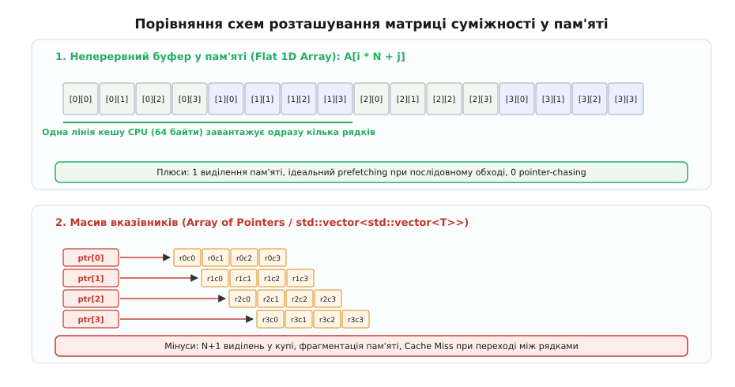
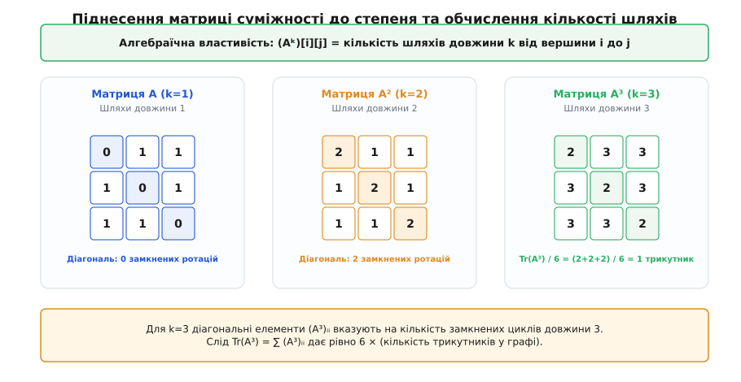
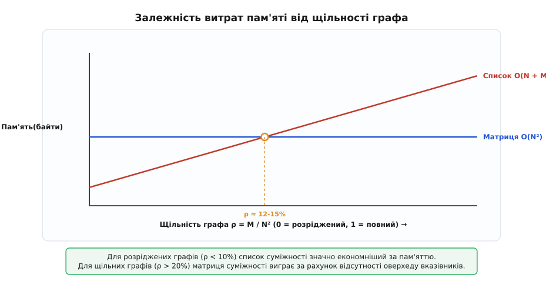

# Матриця суміжності

<preknowlist>
- [Асимптотична складність (нотація O великого)](root:computability/asymptotic-complexity) — як міряти час і пам'ять через кроки n та N², а не секунди.
- [Двочастковий граф](root:sf-algorithms/bipartite-graph) — структура графа з двома незалежними множинами вершин та його симетричний спектр.
</preknowlist>

Уяви, що ти розробляєш мережевий маршрутизатор високого навантаження або сервер соціальної мережі з `N` користувачами, і тобі потрібно мільйони разів на секунду відповідати на одне й те саме запитання: «Чи зв'язані між собою вузол `u` та вузол `v`?». Якщо зберігати всі зв'язки у вигляді звичайного списку пар `(u, v)`, для відповіді доведеться сканувати весь список, перебираючи тисячі елементів. Якщо зберігати сусіда у динамічному масиві кожен для своєї вершини, доведеться шукати потрібний ID серед усіх вихідних зв'язків цієї вершини. Але якщо пронумерувати всі `N` вершин від `0` до `N - 1` і створити двовимірний масив розмірності `N × N`, перевірка наявності зв'язку зводиться до єдиного звернення за індексом `A[u][v]`. Ця двовимірна таблиця і є **матрицею суміжності**.

Матриця суміжності — це фундаментальна двовимірна структура даних та алгебраїчний об'єкт, який представляє граф у вигляді квадратної сітки, де рядок `i` відповідає вершині-джерелу, стовпчик `j` — вершині-призначенню, а значення в комірці `(i, j)` показує наявність, вагу або кількість ребер, що ведуть із `i` у `j`.


*Зіставлення орієнтованого графа та його 4×4 матриці суміжності. Рядок i відображає вихідні ребра, стовпчик j — вхідні.*

## Від абстрактного графа до двовимірного масиву

Математично граф `G = (V, E)` складається з множини вершин `V` та множини ребер `E`. Щоб перевести цю дискретну абстракцію у формат, зрозумілий оперативній пам’яті процесора, кожній вершині присвоюють унікальний цілочисельний індекс `i ∈ {0, 1, ..., N - 1}`.

Матриця суміжності `A` розміру `N × N` будується за простим математичним правилом:

```
A[i][j] = 1,  якщо в графі існує ребро i → j
A[i][j] = 0,  якщо ребра i → j немає
```

Якщо граф є **неорієнтованим** (зв'язок між `i` та `j` є двостороннім), наявність ребра між `i` та `j` означає одночасну наявність зв'язку як із `i` у `j`, так і з `j` у `i`. У результаті матриця `A` стає повністю симетричною відносно своєї головної діагоналі:

```
A[i][j] = A[j][i]  для всіх i, j
```

Якщо граф не містить петель (тобто ребер, що ведуть із вершини в саму себе), уся головна діагональ матриці заповнюється нулями: `A[i][i] = 0`. Якщо ж петлі дозволені, значення `A[i][i] = 1` позначає наявність самопетлі у вершині `i`.

Для **орієнтованого графа** (орграфа) ребро `i → j` має чітко визначений напрямок. У цьому випадку симетрія втрачається, і матриця `A`, як правило, є несиметричною (`A ≠ Aᵀ`). Рядок `i` повністю описує **вихідні ребра** вершини `i` (out-edges), а стовпчик `j` описує **вхідні ребра** у вершину `j` (in-edges). 

Сума елементів у рядку `i` дорівнює півстепеню виходу вершини (out-degree), а сума елементів у стовпчику `j` — півстепеню входу (in-degree):

```
out_degree(i) = ∑ⱼ A[i][j]
in_degree(j)  = ∑ᵢ A[i][j]
```

Транспонована матриця `Aᵀ` позначає той самий граф, але з інвертованим напрямком усіх ребер: якщо в початковому графі існувало ребро `i → j`, то в транспонованій матриці існуватиме ребро `j → i`. 

Зв'язок між матрицею суміжності `A` та орієнтованою матрицею інцидентності `M` (де рядки позначають вершини, а стовпчики — ребра) виражається фундаментальним співвідношенням:

```
M · Mᵀ = D - A
```

де `D` — діагональна матриця ступенів вершин (`D[i][i] = deg(i)`). Ця формула є основою для застосування методів теорії матриць у топологічному аналізі складних мереж.

Для глибшого занурення в передісторію того, як зв'язки між геометричними схемами Кірхгофа, матричною алгеброю Сильвестра й Келі та першими ЕОМ сформували цей підхід, читай [Історія матричного представлення графів](root:sf-algorithms/adjacency-matrix/hist-matrix-graph.md).

## Зважені графи, мультиграфи та вибір значень-сентинелів

У багатьох практичних задачах ребра графа мають чисельні характеристики: довжину дороги в кілометрах, затримку мережевого пакета у мілісекундах, вартість авіаквитка або коефіцієнт кореляції. Такий граф називається **зваженим**.

У матриці суміжності зваженого графа замість бінарних прапорців `1` у комірку `A[i][j]` записують числове значення ваги ребра `w(i, j)`. Проте тут виникає фундаментальне інженерне питання: яке значення записати в комірку `A[i][j]`, якщо ребра між `i` та `j` **не існує**?

Вибір значення-сентинела (sentinel value) залежить від математичного сенсу алгоритму, який працюватиме з цією матрицею:

1. **Алгоритми найкоротших шляхів (Флойда — Уоршелла, Дейкстри)**:
   Відсутність ребра позначається спеціальним значенням **нескінченності** (`+∞`, у програмуванні — `INFINITY` для `double` або `std::numeric_limits<T>::infinity()`). Це необхідно для того, щоб під час мінімізації `min(A[i][j], A[i][k] + A[k][j])` відсутні шляхи не перебивали реальні маршрути. При цьому діагональ `A[i][i]` заповнюється нулями (`0.0`), оскільки відстань від вершини до самої себе дорівнює 0.

2. **Задачі максимального потоку (Max-Flow, алгоритм Форда — Фалкерсона)**:
   Комірка `A[i][j]` містить пропускну здатність каналу (capacity). Відсутність ребра позначається **нулем** (`0`), оскільки по неіснуючому каналу можна передати 0 одиниць потоку.

3. **Графи з можливими нульовими вагами ребер**:
   Якщо ребро з вагою `0` є легітимним (наприклад, безкоштовний перехід між станціями), нуль не можна використовувати як сентинел. У таких випадках застосовують від'ємні значення-маркери (наприклад, `-1`), окремий бітовий масив наявності ребер або типи-контейнери на зразок `std::optional<T>` у мові C++.

4. **Знаковий граф (Signed Graph) та матриці зв'язків**:
   У соціальних та біологічних мережах ребро може бути позитивним (`+1`, дружба / активація гена) або негативним (`-1`, ворожнеча / пригнічення гена). Для таких графів нуль `0` слугує сентинелом відсутності взаємодії, а знакові елементи описують характер зв'язку.

### Обмеження матриць: Мультиграфи та Гіперграфи

Класична двовимірна матриця суміжності розрахована на прості графи. У випадку **мультиграфів** (де між двома вершинами `i` та `j` може існувати кілька паралельних ребер) значення `A[i][j]` зберігає ціле число — кількість паралельних ребер між цією парою. Проте якщо кожне паралельне ребро має власні унікальні ваги або атрибути, двовимірна матриця перестає підходити; у таких ситуаціях доводиться використовувати тривимірні тензори або списки ребер.

Для **гіперграфів** (де одне гіперребро зєднує не дві, а довільну множину вершин) матриця суміжності замінюється матрицею інцидентності розміру `|V| × |E|`.

## Розташування у пам'яті: Flat Array проти вкладених масивів

Те, як двовимірна матриця розміщується в оперативній пам’яті комп’ютера, безпосередньо визначає швидкість виконання алгоритмів на сучасному залізі.


*Схеми організації пам'яті: 1D плоский буфер гарантує неперервність і роботу з кешем CPU, на відміну від вкладеного масиву вказівників.*

Існують дві фундаментально різні схеми зберігання матриці `N × N`:

### 1. Вкладений масив вказівників (`std::vector<std::vector<T>>` або `T**`)

У цьому підході створюється один головний масив із `N` вказівників, кожен з яких вказує на окремий виділений у купі масив розміру `N`. 

Хоча синтаксис звернення `matrix[i][j]` виглядає природним, ця схема є невигідною з погляду архітектури системної пам'яті:
* **Фрагментація**: Створення `N + 1` окремих об'єктів у купі (*heap*) розкидає рядки матриці по різних адресах оперативної пам’яті.
* **Промахи кешу (Cache Misses)**: При переході від рядка `i` до рядка `i + 1` процесор мусить виконувати додаткове читання вказівника (*pointer chasing*), що призводить до зупинки конвеєра процесора.

### 2. Неперервний плоский буфер (Flat 1D Array)

Матриця виділяється як один суцільний блок пам'яті розміром `N² × sizeof(T)` байтів. Індексація двох вимірів виконується арифметично:

```
index(i, j) = i * N + j
```

Цей підхід має колосальні переваги:
* **Ідеальна локальність даних (Data Locality)**: Коли процесор запитує елемент `A[i][0]`, апаратний префечер L1/L2 кешу завантажує в кеш-лінію (Cache Line розміром 64 байти) одразу наступні елементи рядка `A[i][1]`, `A[i][2]`, ..., `A[i][7]`. У результаті послідовний обхід рядка відбувається майже миттєво.
* **Апаратна векторизація (SIMD)**: Процесорні інструкції (AVX2, AVX-512, ARM Neon) можуть обробляти по 8, 16 або 64 елементи матриці за один інструкційний такт.

### 3. Бітові матриці (Bit-Packed Matrices)

Для незважених графів кожне ребро є булевим прапорцем `true/false`. Зберігати кожен булевий елемент у виділеному байті `uint8_t` або `bool` (які займають 8 бітів пам'яті) — це восьмикратне марнотратство.

Упакована бітова матриця зберігає по 64 ребра в одному 64-бітному цілому числі `uint64_t`. Матриця розміром `N × N` перетворюється на масив розмірності `N × ⌈N / 64⌉` машинних слів.

Переваги бітових матриць:
* **Стиснення пам'яті у 8–64 рази**: Граф на 10 000 вершин вимагає не 100 МБ, а лише ~12.5 МБ пам'яті, повністю вміщуючись у L3-кеш процесора.
* **Бітова паралельність (Bit-Parallelism)**: Перетин множин сусідів двох вершин `u` та `v` (наприклад, для пошуку спільних друзів або клік) зводиться до виконання однієї бітової інструкції `AND` над 64-бітними словами `row[u] & row[v]`. Підрахунок кількості спільних сусідів виконується однією процесорною інструкцією `popcount` (Population Count).

### 4. Упакована трикутна матриця (Packed Triangular Matrix)

Для неорієнтованих графів без петель матриця є симетричною, а головна діагональ містить нулі. Зберігати обидві половини матриці недоцільно. 

Замість повної матриці `N × N` виділяють масив лише для елементів під головною діагоналлю (`i > j`). Загальна кількість елементів становить:

```
Num_Elements = N · (N - 1) / 2
```

Формула розрахунку одновимірного індексу для пари `(i, j)` при `i > j`:

```
index(i, j) = i · (i - 1) / 2 + j
```

Якщо `i < j`, індекси просто міняють місцями `swap(i, j)`. Це скорочує використання пам'яті удвічі, хоча додає незначний оверхед на перевірку умов гілкування.

Детальний аналіз кодів реалізації C/C++, виділення буферів та оптимізації роботи з пам'яттю наведено у вставці [Реалізація матриці суміжності мовами C та C++](root:sf-algorithms/adjacency-matrix/proj-graph-matrix.md).

## Алгебраїчні властивості: шляхи, трикутники та спектр

Найбільша сила матриці суміжності полягає в тому, що вона перетворює комбінаторні задачі на графах у звичайне множення матриць.


*Піднесення матриці A до степеня k. Сума діагональних елементів Tr(A³) дорівнює шестикратній кількості трикутників у графі.*

### Кількість шляхів та піднесення до степеня

Якщо піднести матрицю суміжності `A` до квадрата `A² = A · A`, значення елемента `(A²)[i][j]` обчислюється як:

```
(A²)[i][j] = ∑ₘ A[i][m] · A[m][j]
```

Добуток `A[i][m] · A[m][j]` дорівнює `1` тоді й лише тоді, коли існують ребра `i → m` та `m → j`. Таким чином, сума по всіх `m` дає **точну кількість маршрутів довжиною 2** між вершинами `i` та `j`.

Узагальнюючи це за індукцією, отримуємо фундаментальну теорему:

> **Теорема про степені матриці**: Елемент `(Aᵏ)[i][j]` k-го степеня матриці суміжності дорівнює кількості різних маршрутів довжини `k`, що ведуть із вершини `i` у вершину `j`.

Розглянемо числовий приклад для неорієнтованого графа-трикутника з 3 вершинами `{0, 1, 2}`. Його матриця суміжності `A`:

```
    [ 0  1  1 ]
A = [ 1  0  1 ]
    [ 1  1  0 ]
```

Обчислимо квадрат матриці `A²`:

```
     [ 0  1  1 ]   [ 0  1  1 ]   [ 2  1  1 ]
A² = [ 1  0  1 ] · [ 1  0  1 ] = [ 1  2  1 ]
     [ 1  1  0 ]   [ 1  1  0 ]   [ 1  1  2 ]
```

На діагоналі `(A²)[0][0] = 2` — це два маршрути довжини 2 з вершини 0 у вершину 0: `0 → 1 → 0` та `0 → 2 → 0`.

Тепер обчислимо куб матриці `A³`:

```
     [ 2  1  1 ]   [ 0  1  1 ]   [ 2  3  3 ]
A³ = [ 1  2  1 ] · [ 1  0  1 ] = [ 3  2  3 ]
     [ 1  1  2 ]   [ 1  1  0 ]   [ 3  3  2 ]
```

Елемент `(A³)[0][1] = 3` означає, що існує рівно 3 маршрути довжини 3 від вершини 0 до вершини 1:
1. `0 → 1 → 0 → 1`
2. `0 → 2 → 0 → 1`
3. `0 → 1 → 2 → 1`

### Підрахунок трикутників через след матриці

Трикутник у графі — це потрійний цикл із трьох вершин, з'єднаних ребрами між собою. За теоремою про степені матриці елемент `(A³)[i][i]` показує кількість замкнених маршрутів довжини 3, що починаються й закінчуються у вершині `i`.

Слід матриці `Tr(A³)` (сума елементів на головній діагоналі) дає суму всіх таких маршрутів по всьому графу. Оскільки кожен трикутник у неорієнтованому графі містить 3 вершини і може бути обійдений у 2 напрямках (за та проти годинникової стрілки), кожен трикутник враховується в слід точно `3 × 2 = 6` разів.

Звідси випливає красива формула підрахунку трикутників `T`:

```
T = Tr(A³) / 6
```

Для нашого трикутника з прикладу: `Tr(A³) = 2 + 2 + 2 = 6`. Звідси `T = 6 / 6 = 1` трикутник.

Обчислення `Tr(A³)` за допомогою швидких алгоритмів множення матриць (таких як алгоритм Штрассена із складністю `O(N^2.807)` або сучасні підходи Coppersmith — Winograd) дозволяє шукати трикутники у щільних графах значно швидше за наївний перебір трійок вершин `O(N³)`.

### Спектральні властивості та матриця Лапласа

Оскільки для неорієнтованого графа матриця суміжності `A` є дійсною та симетричною (`A = Aᵀ`), вона має `N` дійсних власних значень `λ₁ ≥ λ₂ ≥ ... ≥ λₙ`, які утворюють **спектр графа**.

* **Теорема Перрона — Фробеніуса**: Найбільше власне значення `λ₁` задовольняє нерівність `d_avg ≤ λ₁ ≤ d_max`, де `d_avg` та `d_max` — середня та максимальна степені вершин. Для `k`-регулярного графа `λ₁ = k`.
* **Симетрія спектра двочасткових графів**: Граф `G` є двочастковим (bipartite) тоді й лише тоді, коли його спектр повністю симетричний відносно нуля: якщо `λ` є власним значенням, то `-λ` також є власним значенням тієї ж кратності.
* **Матриця Лапласа `L = D - A`**: Де `D` — діагональна матриця ступенів вершин. Власні значення матриці Лапласа описують процеси дифузії на графі, кластеризацію та зв'язність (друге власне значення `μ₂ > 0` називається алгебраїчною зв'язністю Фідлера).
* **Матриця доповнення графа**: Матриця суміжності доповнення графа `Ḡ` обчислюється через матрицю з усіх одиниць `J` та одиничну матрицю `I` як `A(Ḡ) = J - I - A(G)`.

Повні математичні доведення винесено у вставку [Спектральні та алгебраїчні властивості матриці суміжності](root:sf-algorithms/adjacency-matrix/math-spectral-properties.md).

## Алгоритми, що працюють безпосередньо над матрицею

Завдяки прямій адресації `O(1)` матриця суміжності слугує базовим середовищем виконання для цілої серії фундаментальних алгоритмів на графах.

### 1. Пошук найкоротших шляхів для всіх пар (Алгоритм Флойда — Уоршелла)

Класичним прикладом є **алгоритм Флойда — Уоршелла** (Floyd-Warshall Algorithm). Він розв'язує задачу пошуку найкоротших шляхів між абсолютно всіма парами вершин `(i, j)` у зваженому графі за час `O(N³)` і пам'ять `O(N²)`.

Алгоритм використовує метод динамічного програмування безпосередньо над матрицею суміжності. Нехай `D[i][j]` — матриця найкоротших відстаней, яка початково дорівнює матриці суміжності `A[i][j]`.

На кожному з `N` кроків алгоритм розглядає вершину `k` як можливу проміжну точку на шляху від `i` до `j`:

```python
# Ініціалізація: D дорівнює матриці суміжності A
for k in range(N):
    for i in range(N):
        for j in range(N):
            if D[i][k] + D[k][j] < D[i][j]:
                D[i][j] = D[i][k] + D[k][j]
```

Зверни увагу на порядок вкладення циклів: цикл `k` знаходиться **зовні**. Це гарантує, що до моменту розгляду вершини `k` всі найкоротші шляхи через вершини `{0, ..., k-1}` вже обчислені. 

Завдяки тому, що матриця суміжності розташована у неперервному блоці пам'яті, внутрішній цикл по `j` ітерується послідовно по комірках рядків `D[i]` та `D[k]`. Це дозволяє сучасному процесору виконувати алгоритм Флойда — Уоршелла з максимальною кеш-ефективністю.

### 2. Транзитивне замикання (Алгоритм Уоршелла)

Якщо граф незважений, алгоритм зводиться до визначення досяжності між вершинами. Логічне «АБО» та «ТА» замінюють додавання та мінімізацію:

```
D[i][j] = D[i][j] ∨ (D[i][k] ∧ D[k][j])
```

Для бітових матриць цей цикл виконується не по окремих елементах, а по 64-бітних машинах словах одразу `row[i] |= row[k]` (якщо `D[i][k] == 1`), що прискорює пошук досяжності в 64 рази.

### 3. Паралельний пошук ушир (BFS) та розмноження фронту

У паралельних обчисленнях пошук ушир (Breadth-First Search) на бітовій матриці суміжності обчислюється як векторно-матричний добуток. Поточний фронт відвіданих вершин представляється бітовим вектором `f`. Наступний фронт `f'` обчислюється за один крок через бітове множення на матрицю `A`:

```
f' = f · A
```

На графічних процесорах (GPU) цей підхід дає прискорення в десятки разів порівняно зі звичайними чергами списків суміжності, оскільки усуває непередбачувані відгалуження (branch divergence) та хаотичний доступ до пам'яті.

### 4. Ізоморфізм графів та матриці перестановки

Два графи `G₁` та `G₂` з матрицями суміжності `A` та `B` є ізоморфними (тобто мають однакову структуру з точністю до перейменування вершин) тоді й лише тоді, коли існує матриця перестановки `P` така, що:

```
B = P · A · Pᵀ
```

Ця формулювання переводить складну комбінаторну задачу перевірки ізоморфізму графів у область матричного аналізу.

## Порівняльний аналіз: Матриця проти Списку суміжності

Вибір між матрицею суміжності та списком суміжності (Adjacency List) є одним із найголовніших інженерних рішень при розробці алгоритмів на графах.


*Порівняння витрат пам’яті залежно від щільності ребер ρ = M / N². При ρ > 15% матриця стає економнішою за списки через відсутність оверхеду вказівників.*

Показником, який визначає доцільність використання матриці, є **щільність графа** (Graph Density) `ρ`:

```
ρ = M / N²  (для орієнтованих графів)
ρ = 2M / (N · (N - 1))  (для неорієнтованих графів)
```

де `M` — кількість ребер, `N` — кількість вершин.

### Порівняльні характеристики графів

1. **Розріджені графи (Sparse Graphs, ρ < 0.1)**:
   Кількість ребер пропорційна кількості вершин (`M = O(N)`). Наприклад, дорожні мережі, сітки міст, дерева, веб-графи. Тут матриця розміру `N²` зберігатиме понад 90% нулів або нескінченностей. У цьому випадку список суміжності займає `O(N + M)` пам'яті і є набагато ефективнішим.

2. **Щільні графи (Dense Graphs, ρ > 0.2)**:
   Кількість ребер наближається до максимуму (`M = O(N²)`). Наприклад, повні графи, матриці кореляцій між фінансовими активами, молекулярні графи, фазові простори. У цьому випадку матриця суміжності займає **менше пам'яті**, ніж список суміжності, оскільки список витрачає 8–16 байтів на один вказівник вузла списку, тоді як упакована бітова матриця витрачає лише 1 біт на ребро. При ρ > 15% (поріг точки перетину між розрідженими ρ < 0.1 та щільними ρ > 0.2 графами) матриця стає економнішою за списки через відсутність оверхеду вказівників.

3. **Проміжний формат: Стиснутий рядок матриці (CSR — Compressed Sparse Row)**:
   Для розріджених графів, яким потрібна продуктивність матричного множення на GPU, застосовують гібридний формат CSR. Він зберігає три неперервні масиви: масив значень ненульових елементів, масив індексів стовпчиків та масив зміщень рядків. CSR поєднує компактність списку суміжності `O(N + M)` із локальністю пам'яті неперервного масиву.

Нижче наведено деталізовану зведену таблицю порівняння характеристик чотирьох основних структур даних для представлення графів:

| Характеристика / Операція | Матриця суміжності (Flat 1D) | Матриця (Packed Bitset) | Список суміжності (`vector<vector>`) | Список ребер (Edge List) |
| :--- | :--- | :--- | :--- | :--- |
| **Обсяг пам'яті (Space)** | `O(N²)` байтів | `O(N² / 8)` байтів | `O(N + M)` | `O(M)` |
| **Перевірка ребра (u → v)** | `O(1)` | `O(1)` | `O(deg(u))` | `O(M)` |
| **Додавання ребра (u → v)** | `O(1)` | `O(1)` | `O(1)` | `O(1)` |
| **Видалення ребра (u → v)** | `O(1)` | `O(1)` | `O(deg(u))` | `O(M)` |
| **Перебір усіх сусідів u** | `O(N)` | `O(N / 64)` | `O(deg(u))` | `O(M)` |
| **Додавання нової вершини** | `O(N²)` (перевиділення) | `O(N²)` | `O(1)` | `O(1)` |
| **Видалення вершини** | `O(N²)` (зсув даних) | `O(N²)` | `O(N + M)` | `O(M)` |
| **Локальність кешу CPU** | Ідеальна | Екстремальна | Низька | Висока |
| **Придатність до SIMD / GPU** | Відмінна | Екстремальна | Погана | Середня |

Повний довідник інтерфейсів, формули обчислення індексів для бітових матриць та трикутних стиснутих масивів дивись у вставці [Інтерфейс та memory-layout матриці суміжності](root:sf-algorithms/adjacency-matrix/api-matrix-interface.md).

> 🔧 **Навіщо це.**
> Матриця суміжності є базовим стандартом у задачах, де перевірка зв'язків є частішою за обхід сусідів, або де графи є природно щільними:
> 1. **Алгоритми транзитивного замикання та All-Pairs Shortest Path**: Алгоритм Флойда — Уоршелла працює виключно над матрицею суміжності, забезпечуючи розрахунок маршрутів між усіма вузлами мережі за один прохід.
> 2. **Масивно-паралельні обчислення на GPU (CUDA / OpenCL / GraphBLAS)**: Графічні прискорювачі мають тисячі простих ядер, які розкривають максимальну продуктивність лише при обробці регулярних матриць без динамічних списків та вказівників.
> 3. **Квантові обчислення та спектральний аналіз**: Графові стани (Graph States) у квантовій інформатиці та матриці щільності базуються безпосередньо на операторі матриці суміжності.
> 4. **Системи розпізнавання образів та аналіз зображень**: Графи суміжності пікселів чи регіонів (Region Adjacency Graphs) для зображень фіксованої роздільності моделюються матрицями для швидкого виявлення меж та сегментації.
