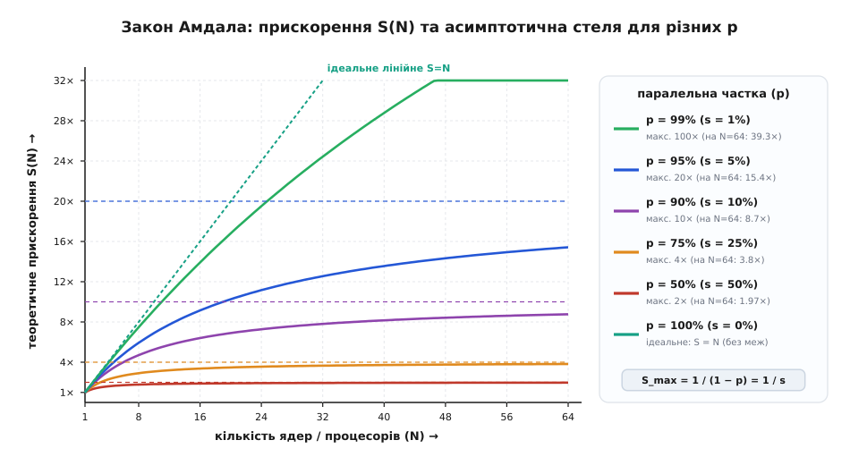
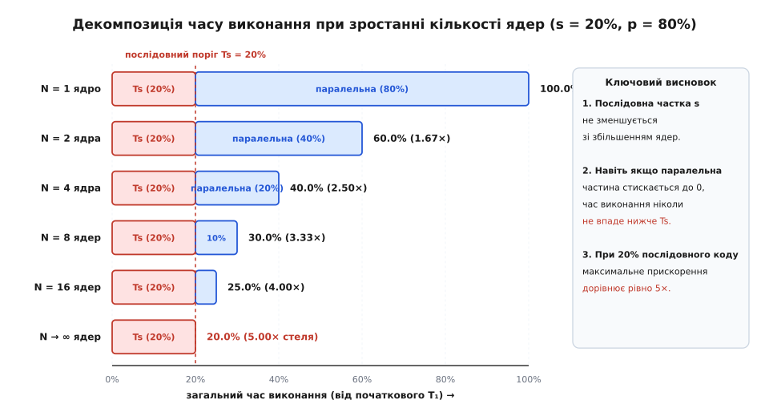
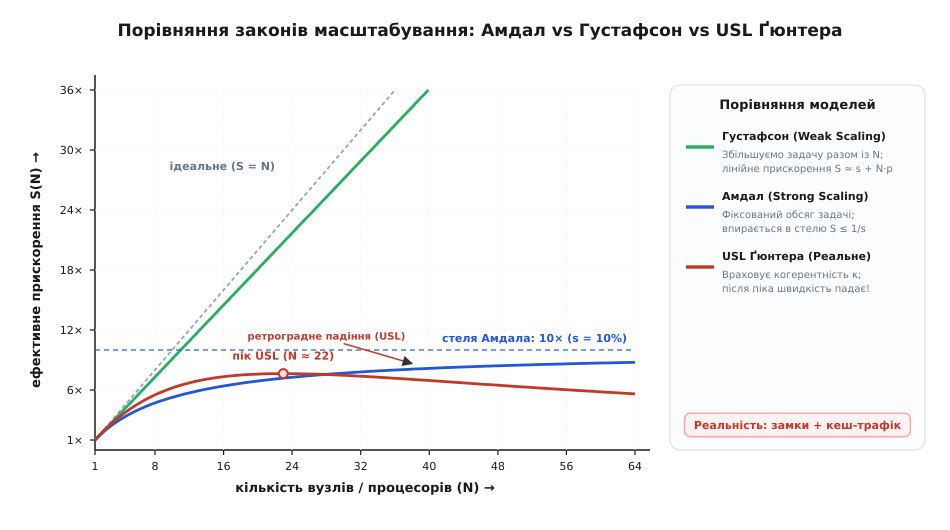
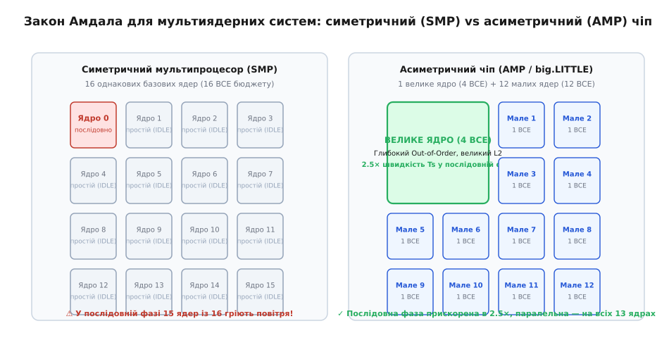

# Закон Амдала та межі паралельних обчислень

<preknowlist>
- [Асимптотична складність](root:computability/asymptotic-complexity) — оцінка зростання обчислювальної складності алгоритмів залежно від розміру входу.
- [Розділяй і володарюй](root:sf-algorithms/divide-and-conquer) — декомпозиція задачі на незалежні підзадачі для паралельного виконання.
</preknowlist>

Команда інженерів оптимізує пайплайн обробки ста мільйонів транзакцій. На одноядерному сервері повний розрахунок займає рівно 100 секунд. Керівництво купує потужну обчислювальну ноду на 64 процесорні ядра, очікуючи скорочення часу до півтори секунди. Програму переписують під роботу в 64 потоки, запускають тест — і отримують результат 15.6 секунди. Замість очікуваного 64-кратного прискорення система продемонструвала виграш лише в 6.4 раза. Додавання ще 64 ядер майже не змінює цифру на секундомірі: час виконання застрягає біля позначки 10 секунд.

Причина цієї інженерної невдачі полягає не в помилках компілятора чи недосконалості операційної системи. Вона криється у фундаментальному фізичному та математичному обмеженні, яке 1967 року сформулював комп'ютерний архітектор Джин Амдал. Будь-яка програма містить ділянки, які принципово неможливо виконати паралельно: читання файлу з диска, створення потоків, захоплення спільних замків та фінальну агрегацію результатів. Ця нерозпаралелювана частка діє як незнищенний якір, що встановлює жорстку асимптотичну стелю для швидкодії системи за будь-якої кількості процесорів.

Детальний опис історичного протистояння між прихильниками масивного розпаралелювання та творцями класичних процесорів читайте у вставці [📜 Історичний диспут: Джин Амдал, Деніел Слотнік та народження закону](root:sf-algorithms/amdahls-law/hist-gene-amdahl.md).

---

## Анатомія розпаралелювання: виведення закону

Нехай час виконання певної програми на одному процесорному ядрі становить `T₁`. Цей час складається з двох фундаментальних компонентів:
1. `T_s` (Serial Time) — сумарний час, витрачений на суто послідовні інструкції, які повинні виконуватися строго одна за одною через залежності за даними або апаратні обмеження.
2. `T_p` (Parallel Time) — сумарний час, витрачений на операції, які можна розділити на незалежні блоки та виконувати одночасно на різних обчислювальних вузлах.

```
T₁ = T_s + T_p
```

Введемо відносні частки кожної з фаз стосовно загального часу `T₁`:
- **Послідовна частка (`s`):** `s = T_s / T₁`, де `0 ≤ s ≤ 1`.
- **Паралельна частка (`p`):** `p = T_p / T₁ = 1 - s`, де `0 ≤ p ≤ 1`.

Якщо ми виділяємо для виконання програми `N` ідентичних процесорних ядер, то за ідеальних умов (відсутність накладних витрат на зв'язок і бездоганно рівномірний розподіл навантаження) паралельна частина скоротиться рівно в `N` разів. Послідовна ж частина `T_s` не скоротиться взагалі, оскільки її виконує одне ядро, поки решта `N - 1` ядер змушені очікувати.

```
Час виконання на N ядрах T(N):
T(N) = T_s + T_p / N
     = T₁·s + (T₁·p) / N          [підстановка T_s = s·T₁ та T_p = p·T₁]
     = T₁ · (s + p / N)           [винесення T₁ за дужки]
     = T₁ · ((1 - p) + p / N)     [заміна послідовної частки s на 1 - p]
```

Прискоренням (англ. *speedup*, позначається `S(N)`) називають безрозмірний коефіцієнт, що показує, у скільки разів швидше виконується задача на системі з `N` ядер порівняно з одним ядром:

```
S(N) = T₁ / T(N)
     = T₁ / ( T₁ · ((1 - p) + p / N) )    [підстановка виразу для T(N)]
     = 1 / ((1 - p) + p / N)              [скорочення на T₁]
     = 1 / (s + (1 - s) / N)              [запис через послідовну частку s]
```

Це рівняння і є класичним **законом Амдала**.



*Теоретичне прискорення S(N) за законом Амдала залежно від кількості ядер N. Навіть при паралельній частці 95% (s = 5%) графік виходить на горизонтальне плато і ніколи не перевищить позначку 20×, скільки б ядер не додали до системи.*

---

## Асимптотична стеля та закон спадної віддачі

Найважливіший висновок закону Амдала стає очевидним, якщо спрямувати кількість процесорних ядер `N` до нескінченності:

```
lim_{N → ∞} S(N) = lim_{N → ∞} [ 1 / ((1 - p) + p / N) ] = 1 / (1 - p) = 1 / s
```

Доданок `p / N` нівелюється, і в знаменнику залишається виключно послідовна частка `s`. Це встановлює абсолютний бар'єр швидкодії:
- Якщо `s = 50%` (`p = 0.50`), максимальне прискорення дорівнює `1 / 0.5 = 2×`.
- Якщо `s = 10%` (`p = 0.90`), максимальне прискорення дорівнює `1 / 0.1 = 10×`.
- Якщо `s = 5%` (`p = 0.95`), максимальне прискорення дорівнює `1 / 0.05 = 20×`.
- Якщо `s = 1%` (`p = 0.99`), максимальне прискорення дорівнює `1 / 0.01 = 100×`.

Повернімося до інженерного прикладу з початку статті. У програмі з часом виконання 100 секунд послідовна фаза (зчитування диска та зведення підсумків) займала 10 секунд (`s = 0.10`), а паралельна обробка записів — 90 секунд (`p = 0.90`).

На 64 ядрах розрахунковий час становить:
`T(64) = 10 + 90 / 64 = 10 + 1.406 = 11.406` секунд (прискорення `8.76×` в ідеалі, а з урахуванням накладних витрат ОС — якраз отримані 15.6 с). Навіть якби паралельна частина рахувалася миттєво (`T_p / N = 0`), загальний час не міг би стати меншим за 10 секунд послідовної роботи (`S_max = 100 / 10 = 10×`).



*Декомпозиція загального часу виконання на послідовну складову Ts (червоний блок) та паралельну Tp (синій блок). Зі зростанням кількості ядер синій блок стискається, але червоний залишається незмінним і зрештою починає займати понад 90% усього часу виконання.*

---

## Теорема Брента та модель "Робота — Проліт"

Щоб формалізувати послідовну частку на рівні теорії алгоритмів, паралельну програму представляють у вигляді спрямованого ациклічного графа обчислень (Directed Acyclic Graph, DAG), де вершини — це атомарні операції, а ребра — залежності за даними.

У такій моделі алгоритм характеризується двома фундаментальними величинами:
1. **Робота (`Work`, `W` або `T₁`):** загальна кількість операцій у графі (час виконання на одному процесорі).
2. **Проліт (`Span` або `Critical Path`, `D_∞` або `T_∞`):** довжина найдовшого шляху від входу до виходу графа. Це мінімальний час, за який алгоритм можна виконати на нескінченній кількості ядер, оскільки жодні дві операції на критичному шляху не можуть виконуватися одночасно.

Фундаментальна **теорема Брента (Brent's Theorem)** стверджує, що час виконання графа з роботою `W` та критичним шляхом `D_∞` на системі з `N` процесорів за використання жадібного планувальника обмежений нерівністю:

```
T(N) ≤ (W - D_∞) / N + D_∞
```

Звідси прискорення на `N` процесорах задовольняє умову:

```
S(N) = W / T(N) ≥ W / ( (W - D_∞)/N + D_∞ ) = 1 / ( (D_∞ / W) + (1 - D_∞ / W) / N )
```

Цей вираз математично ідентичний закону Амдала, де послідовна частка `s` строго дорівнює відношенню критичного шляху до загальної роботи:

```
s = D_∞ / W = T_∞ / T₁
```

Це доводить: якщо алгоритм має довгий нерозпаралелюваний ланцюг залежностей (`D_∞`), жодна система розподілу задач не зможе подолати межу `W / D_∞`.

---

## Паралельна ефективність та економічна вартість

Паралельною ефективністю (англ. *parallel efficiency*, `E(N)`) називають відношення отриманого прискорення `S(N)` до кількості витрачених процесорних ядер `N`:

```
E(N) = S(N) / N = 1 / ( N · ((1 - p) + p / N) ) = 1 / ( N·(1 - p) + p ) = 1 / ( N·s + (1 - s) )
```

Ефективність вимірюється в частках одиниці або у відсотках. В ідеальній системі без послідовних ділянок (`s = 0`) ефективність дорівнює `1.0` (100%): подвоєння кількості ядер подвоює швидкість. Проте за наявності навіть крихітної послідовної частки `s > 0` функція `E(N)` монотонно прямує до нуля при зростанні `N`:

```
lim_{N → ∞} E(N) = lim_{N → ∞} [ 1 / (s·N + (1 - s)) ] = 0
```

Погляньмо на конкретні числа для програми з послідовною часткою `s = 5%` (`p = 95%`):
- На `N = 1` ядрі: `S(1) = 1.0×`, `E(1) = 100%`.
- На `N = 8` ядрах: `S(8) = 5.92×`, `E(8) = 74.0%`.
- На `N = 16` ядрах: `S(16) = 9.14×`, `E(16) = 57.1%`.
- На `N = 64` ядрах: `S(64) = 15.42×`, `E(64) = 24.1%`.
- На `N = 256` ядрах: `S(256) = 18.68×`, `E(256) = 7.3%`.

Перехід від 16 до 64 ядер (збільшення апаратних витрат у 4 рази) дав приріст швидкості лише з 9.14× до 15.42× (менше ніж у 1.7 раза). А перехід від 64 до 256 ядер додав жалюгідні 20% швидкості ціною чотирикратного зростання енергоспоживання та оренди серверів.

У промисловій розробці точку зупинки нарощування ядер часто вибирають за порогом ефективності: коли `E(N)` падає нижче `0.5–0.6` (50–60%), подальше додавання процесорів стає економічно збитковим.

---

## Чому виникає послідовна частка: фізичні та алгоритмічні витоки

Послідовна частка `s` не є абстрактною константою — вона породжується реальними механізмами взаємодії програми з процесором, пам'яттю та операційною системою.

### 1. Залежності за даними (Data Dependencies)

Алгоритмічна природа багатьох обчислень вимагає, щоб крок `K+1` спирався на результати кроку `K`. Наприклад, в обчисленні послідовності чисел Фібоначчі чи розв'язанні систем диференціальних рівнянь методом Ейлера кожен наступний стан залежить від попереднього. У графі залежностей задачі довжина найдовшого шляху визначає мінімальний теоретичний час обчислення на нескінченній кількості ядер.

### 2. Синхронізація та конкуренція за замки (Lock Contention)

Коли кілька потоків звертаються до спільної структури даних (черги задач, хеш-таблиці, пулу пам'яті), вони змушені брати блокування (м'ютекси або спінлоки). Під час перебування одного потоку в критичній секції всі інші потоки зупиняються. Що більше потоків додається в систему, то вища ймовірність черги на замку, і критична секція перетворюється на вузьке місце, яке виконується суто послідовно.

### 3. Бар'єрна синхронізація та дисбаланс навантаження (Load Imbalance)

Якщо `N` потоків виконують паралельну ітерацію, загальний час фази визначається найповільнішим потоком (англ. *straggler*). Якщо через неоднорідність даних один потік працює 10 мілісекунд, а решта закінчили за 5 мілісекунд, 63 ядра простоюватимуть на бар'єрі очікування. Цей час простою адитивно додається до послідовної частки `s`.

### 4. Введення-виведення та системні виклики (I/O Bottleneck)

Зчитування вхідних файлів із диска, розбір JSON/CSV, парсинг мережевих пакетів і запис фінального звіту в базу даних здійснюються через ядро ОС. Пропускна здатність контролера накопичувача (NVMe/SSD) або мережевого інтерфейсу є спільною для всіх потоків, перетворюючи системні виклики на спільну послідовну ділянку.

---

## Апаратні бар'єри пам'яті: стіна пам'яті, Roofline-модель та когерентність

Навіть якщо алгоритмічно код розпаралелюється майже на 100%, у багатоядерних системах виникають фізичні апаратні обмеження, що штучно збільшують послідовну частку:

### Стіна пропускної здатності пам'яті (Memory Bandwidth Wall)

Сучасні процесори здатні обробляти терафлопси операцій, проте оперативна пам'ять (DDR4/DDR5) під'єднана до процесора через фіксовану кількість каналів (зазвичай 2 канали на настільних ПК, 8 каналів на серверах). Сумарна пропускна здатність шини становить 50–300 ГБ/с.

Коли 64 ядра одночасно виконують потокову обробку великого масиву даних, сумарний запит ядер до пам'яті багаторазово перевищує пропускну здатність шини. Ядра вичерпують ліміт каналів і переходять у стан очікування (Memory Stall). У результаті час виконання паралельної частини `T_p` перестає ділитися на `N`, а масштабування повністю зупиняється на апаратній пропускній здатності контролера пам'яті.

У рамках **моделі Roofline** (Williams et al., 2009) продуктивність програми обмежена або піковою обчислювальною потужністю CPU (Compute-Bound), або пропускною здатністю пам'яті (Memory-Bound). Відношення кількості операцій з плаваючою комою до обсягу прочитаних байтів (операційна інтенсивність, англ. *Operational Intensity*, FLOP/Byte) визначає, чи зможе код масштабуватися з додаванням ядер. Якщо інтенсивність низька, розпаралелювання впирається в пам'ять значно раніше, ніж в алгоритмічну послідовну частку Амдала.

### Шторм когерентності кешів (Cache Coherency Storm)

Кожне ядро процесора володіє власними надшвидкими кешами першого (L1) та другого (L2) рівнів. Для підтримання узгодженого стану пам'яті апаратний контролер використовує протокол когерентності (наприклад, MESI або MOESI):
- **Modified (M):** лінія кешу змінена поточним ядром і недійсна в усіх інших.
- **Exclusive (E):** лінія присутня тільки в цьому кеші та збігається з оперативною пам'яттю.
- **Shared (S):** лінія присутня в кешах кількох ядер у режимі "тільки для читання".
- **Invalid (I):** дані застаріли.

Якщо різні ядра записують дані в змінні, які випадково опинилися в межах однієї 64-байтової лінії кешу (явище **False Sharing**, або хибне розділення), ядро перед кожним записом змушене розсилати сигнал інвалідації через міжядерну шину (Ring Bus / Mesh Interconnect). Лінія починає "стрибати" між ядрами (Cache Bouncing / HITM), генеруючи сотні тактів простою на кожну операцію запису.

### Затримки архітектури NUMA (Non-Uniform Memory Access)

У багатосокетних серверах пам'ять фізично прив'язана до окремих процесорів (вузлів NUMA). Доступ ядра до локальної пам'яті свого сокета займає ~60–80 наносекунд, тоді як звернення до пам'яті сусіднього сокета через міжпроцесорну шину (Intel UPI або AMD Infinity Fabric) триває ~140–200 наносекунд. Якщо потоки не прив'язані до ядер і хаотично мігрують між сокетами, міжвузловий трафік перевантажує шину зв'язку, збільшуючи загальний час обчислень.

---

## Сильне та слабке масштабування: закон Густафсона — Барсіса

Закон Амдала спирається на жорстке припущення: **розмір задачі фіксований**, і ми намагаємося розв'язати її швидше за допомогою більшої кількості ядер. Цей режим називають **сильним масштабуванням** (англ. *Strong Scaling*).

Проте 1988 року Джон Густафсон і Едвін Барсіс звернули увагу на те, що інженери та науковці використовують потужніші комп'ютери інакше: із появою багатоядерних кластерів користувачі **збільшують розмір розв'язуваної задачі**, щоб отримати детальніший або точніший результат за прийнятний фіксований час. Цей підхід називають **слабким масштабуванням** (англ. *Weak Scaling*).

Коли розмір вхідних даних зростає пропорційно до кількості ядер `N`, паралельна частина роботи масштабується разом із даними, тоді як послідовна частина (ініціалізація програми, виділення пам'яті) часто залишається майже незмінною або росте значно повільніше.

Нехай час паралельного виконання масштабованої задачі на `N` процесорах дорівнює `T(N) = 1` (нормалізований час). Якщо `s'` — частка часу, витрачена на послідовну роботу, а `(1 - s')` — частка часу на паралельну роботу на `N` ядрах, то на одному ядрі ця сама збільшена задача вимагала б часу:

```
T₁ = s' + N · (1 - s')
```

Тоді масштабоване прискорення за законом Густафсона — Барсіса становить:

```
S_G(N) = T₁ / T(N) = s' + N · (1 - s') = N - s' · (N - 1)
```

На відміну від увігнутої кривої Амдала, функція Густафсона зростає **лінійно** зі збільшенням кількості ядер:

```
S_G(N) ≈ (1 - s') · N
```

Якщо на кластері з 1024 ядер послідовна частка великої задачі становить лише `s' = 0.01` (1%), закон Густафсона дає прискорення:
`S_G(1024) = 1024 - 0.01 · 1023 = 1013.77×`.

Повні математичні виведення, диференціальні властивості та граничні переходи обох моделей дивіться у вставці [🧮 Математичні моделі масштабування: від Амдала до USL](root:sf-algorithms/amdahls-law/math-scaling-laws.md).

---

## Апаратні межі: закон масштабованості Ґюнтера (USL)

У реальних багатоядерних процесорах та розподілених системах прискорення не просто виходить на горизонтальне плато за Амдалом — воно починає **падати** після досягнення певного піку ядер. Це явище має назву ретроградного масштабування (англ. *retrograde scaling*).

Причиною ретроградності є два фізичні процеси на рівні апаратури:

1. **Конкуренція за спільні ресурси (`σ`, Contention):** потоки шикуються в чергу до ліній зв'язку з пам'яттю, дискових каналів або таблиць сторінок віртуальної пам'яті.
2. **Накладні витрати узгодженості кешів (`κ`, Coherency / Crosstalk):** у багатоядерних чіпах кожне ядро має власні кеші L1 та L2. Коли одне ядро змінює змінну, апаратний протокол когерентності (MESI/MOESI) розсилає сигнали інвалідації всім іншим ядрам через кільцеву шину (Ring Bus) або сітку (Mesh). Кількість парних взаємодій між ядрами зростає пропорційно до `N · (N - 1)`.

Ніл Ґюнтер узагальнив ці фактори в **Універсальному законі масштабованості** (Universal Scalability Law, USL):

```
C(N) = N / ( 1 + σ·(N - 1) + κ·N·(N - 1) )
```

де `σ` — коефіцієнт серіалізації (Амдалівська послідовна частка), а `κ` — коефіцієнт міжядерних накладних витрат когерентності.



*Порівняння кривих масштабування. Закон Густафсона дає лінійне зростання для масштабованих задач; закон Амдала встановлює горизонтальну межу; реальна крива USL Ґюнтера досягає піку N* і потім падає через шторм когерентності кешів.*

Оптимальна кількість ядер `N*`, за якої система досягає абсолютної пікової продуктивності, обчислюється точно за формулою екстремуму:

```
N* = √[ (1 - σ) / κ ]
```

Якщо додати в таку систему більше ядер, ніж `N*`, загальна пропускна здатність впаде: процесори витрачатимуть більше тактів на пересилання повідомлень когерентності, ніж на самі обчислення.

---

## Діагностика вузьких місць: метрика Карпа — Флатта

Коли інженер запускає бенчмарк і бачить, що на 16 ядрах прискорення становить лише 6× замість 16×, постає критичне діагностичне питання: чому це сталося? Чи винен сам алгоритм (велика послідовна частка `s`), чи винна апаратура та операційна система (блокування, перемикання контексту, промахи повз кеш)?

Для відповіді на це питання 1990 року Алан Карп та Горас Флатт запропонували розраховувати експериментально визначену послідовну частку `e`:

```
e = ( 1 / S(N) - 1 / N ) / ( 1 - 1 / N )
```

де `S(N)` — реальне виміряне прискорення на `N` ядрах.

Метрика `e` слугує високоточним діагностичним інструментом:
- **Якщо значення `e(N)` залишається приблизно однаковим** при зміні `N` від 2 до 16 (`e ≈ const`): система масштабується строго за Амдалом. Причина низької швидкості — суто алгоритмічна послідовна ділянка коду. Оптимізувати треба алгоритм.
- **Якщо значення `e(N)` зростає зі збільшенням `N`** (`e(2) = 0.05`, `e(4) = 0.08`, `e(8) = 0.15`): алгоритм розпаралелений непогано, але система страждає від динамічних накладних витрат (конкуренції за блокування, насичення шини оперативної пам'яті або частих перемикань контексту ОС).

Повний перелік системних метрик та апаратних лічильників ядра Linux дивіться у вставці [📋 Довідник метрик паралельного масштабування та профілювання](root:sf-algorithms/amdahls-law/api-profiling-metrics.md).

---

## Закон Амдала в епоху багатоядерності: модель Гілла і Марті

У середині 2000-х років фізика напівпровідників зіткнулася з крахом масштабування Деннарда (англ. *Dennard scaling*): зменшення розміру транзисторів перестало супроводжуватися пропорційним зниженням напруги живлення. Густина тепловиділення на кристалі сягнула критичних значень (явище "темного кремнію", англ. *dark silicon*), і зростання тактової частоти одноядерних процесорів зупинилося на рівні ~3–4 ГГц.

Індустрія мікропроцесорів перейшла на розміщення кількох ядер на одному кристалі. 2008 року Марк Гілл (Mark D. Hill) та Майкл Марті (Michael R. Marty) опублікували фундаментальну статтю *«Amdahl's Law in the Multicore Era»*, де адаптували класичний закон Амдала до вибору топології кремнієвих чіпів.

Автори ввели поняття базового еквівалента ядра (Base Core Equivalent, BCE) — площі кристала та енергетичного бюджету, необхідних для розміщення одного простого однопотокового ядра.

Розглянемо чип із загальним апаратним бюджетом у `16 BCE`:

### 1. Симетричний багатоядерний процесор (Symmetric Multicore, SMP)
Чіп складається з 16 однакових простих ядер по 1 BCE кожне.
- **Паралельна фаза:** працюють усі 16 ядер із сумарною швидкістю `16×`.
- **Послідовна фаза:** працює лише 1 маленьке ядро зі швидкістю `1.0×`, тоді як інші 15 ядер (93.75% площі чіпа) стоять вимкненими або простоюють.

Якщо в програмі послідовна частка становить лише `s = 10%`, час виконання на такому процесорі дорівнює:
`T = 0.10 / 1.0 + 0.90 / 16 = 0.10 + 0.05625 = 0.15625` (прискорення `6.4×`).

### 2. Асиметричний гетерогенний процесор (Asymmetric Multicore, AMP)
Замість однакових ядер виділимо бюджет `4 BCE` на одне велике швидке ядро (глибокий Out-of-Order конвеєр, широкі блоки векторних інструкцій AVX, великий L2-кеш), а залишок `12 BCE` віддамо під 12 простих енергоефективних ядер.
Велике ядро за рахунок мікроархітектурної складності виконує однопотоковий код зі швидкістю `perf(4 BCE) = √4 = 2.0×` (за емпіричним правилом Поллака, продуктивність ядра зростає пропорційно квадратному кореню від його площі на кристалі).
- **Послідовна фаза:** виконується на великому ядрі зі швидкістю `2.0×` (час `0.10 / 2.0 = 0.05`).
- **Паралельна фаза:** задіює велике ядро (еквівалент 2) та 12 малих (разом продуктивність `2 + 12 = 14`), час `0.90 / 14 = 0.06428`.

Сумарний час виконання на асиметричному чіпі:
`T = 0.05 + 0.06428 = 0.11428` (прискорення `8.75×` проти `6.4×` на симетричному чіпі при абсолютно однаковій площі кристала!).



*Модель Гілла і Марті для багатоядерних чіпів. Симетричний чіп (ліворуч) залишає 15 ядер без діла у послідовній фазі. Асиметричний чіп (праворуч) використовує одне потужне ядро для швидкого проходження послідовного вузького місця, забезпечуючи вище сумарне прискорення.*

Саме закон Амдала лежить в основі створення сучасних гетерогенних процесорів: архітектури ARM big.LITTLE / DynamIQ (ядра Cortex-X + Cortex-A), Apple Silicon серій M (Performance та Efficiency ядра) та Intel Core 12–14 поколінь (P-cores та E-cores).

---

## Закон Амдала у графічних процесорах (GPU) та прискорювачах

Графічні процесори (GPU) складаються з тисяч простих обчислювальних ядер (Streaming Multiprocessors у Nvidia або Compute Units у AMD), оптимізованих для масивної паралельної обробки потоків інструкцій (архітектура SIMT — Single Instruction, Multiple Threads).

Проте закон Амдала діє всередині GPU навіть жорсткіше, ніж на центральних процесорах:

1. **Дивергенція варпів (Warp Divergence):**
   GPU групує потоки у варпи по 32 нитки. Якщо всередині паралельного коду трапляється умовне розгалуження `if (condition) { ... } else { ... }`, і частина потоків варпа йде за гілкою `true`, а частина — за `false`, апаратний конвеєр не може виконати обидві гілки одночасно. Він виконує спочатку гілку `true` для одних ниток (маскуючи інші), а потім послідовно виконує гілку `false` для решти. У результаті час виконання варпа подвоюється, а паралелізм деградує до послідовного виконання.
2. **Накладні витрати шини PCIe:**
   Перед запуском обчислень на GPU вхідні дані мають бути скопійовані з оперативної пам'яті хоста (RAM) у відеопам'ять (VRAM) через шину PCIe, а після завершення ядра — повернуті назад. Ця передача є суто послідовною ділянкою з погляду графа виконання. Якщо тривалість копіювання перевищує виграш від паралельного ядра, застосування GPU стає повільнішим за виконання на CPU.

---

## Практична демонстрація в коді

Проілюструємо вплив закону Амдала на простому обчислювальному завданні: паралельній обробці масиву з подальшою послідовною редукцією.

:::tabs
```c
#include <stdio.h>
#include <stdlib.h>
#include <pthread.h>
#include <math.h>
#include <time.h>

#define N 10000000
#define NUM_THREADS 4

typedef struct {
    double* data;
    size_t start;
    size_t end;
    double partial_sum;
} WorkerTask;

void* parallel_worker(void* arg) {
    WorkerTask* task = (WorkerTask*)arg;
    double sum = 0.0;
    /* Паралельна фаза: важкі математичні перетворення */
    for (size_t i = task->start; i < task->end; ++i) {
        task->data[i] = sqrt(task->data[i]) * 1.5;
        sum += task->data[i];
    }
    task->partial_sum = sum;
    return NULL;
}

int main(void) {
    double* array = (double*)malloc(sizeof(double) * N);
    for (size_t i = 0; i < N; ++i) array[i] = (double)i + 1.0;

    pthread_t threads[NUM_THREADS];
    WorkerTask tasks[NUM_THREADS];
    size_t chunk = N / NUM_THREADS;

    /* 1. Паралельна фаза Tp */
    for (int i = 0; i < NUM_THREADS; ++i) {
        tasks[i].data = array;
        tasks[i].start = i * chunk;
        tasks[i].end = (i == NUM_THREADS - 1) ? N : (i + 1) * chunk;
        pthread_create(&threads[i], NULL, parallel_worker, &tasks[i]);
    }

    double total_sum = 0.0;
    for (int i = 0; i < NUM_THREADS; ++i) {
        pthread_join(threads[i], NULL);
        total_sum += tasks[i].partial_sum;
    }

    /* 2. Послідовна фаза Ts: фінальна агрегація та верифікація */
    double serial_check = 0.0;
    for (size_t i = 0; i < N; i += 100) {
        serial_check += log(array[i]);
    }

    printf("Результат: sum = %.2f, check = %.2f\n", total_sum, serial_check);
    free(array);
    return 0;
}
```
```cpp
#include <iostream>
#include <vector>
#include <thread>
#include <cmath>
#include <numeric>
#include <span>

constexpr size_t N = 10'000'000;
constexpr size_t NUM_THREADS = 4;

struct WorkerTask {
    double partial_sum{0.0};
};

void parallel_worker(std::span<double> chunk, WorkerTask& task) {
    double sum = 0.0;
    // Паралельна фаза: важкі математичні перетворення
    for (auto& val : chunk) {
        val = std::sqrt(val) * 1.5;
        sum += val;
    }
    task.partial_sum = sum;
}

int main() {
    std::vector<double> array(N);
    std::iota(array.begin(), array.end(), 1.0);

    std::vector<std::thread> workers;
    std::vector<WorkerTask> tasks(NUM_THREADS);
    const size_t chunk_size = N / NUM_THREADS;

    // 1. Паралельна фаза Tp
    workers.reserve(NUM_THREADS);
    for (size_t i = 0; i < NUM_THREADS; ++i) {
        size_t start = i * chunk_size;
        size_t count = (i == NUM_THREADS - 1) ? (N - start) : chunk_size;
        workers.emplace_back(parallel_worker, std::span<double>(&array[start], count), std::ref(tasks[i]));
    }

    double total_sum = 0.0;
    for (size_t i = 0; i < NUM_THREADS; ++i) {
        if (workers[i].joinable()) {
            workers[i].join();
        }
        total_sum += tasks[i].partial_sum;
    }

    // 2. Послідовна фаза Ts: фінальна агрегація та верифікація
    double serial_check = 0.0;
    for (size_t i = 0; i < N; i += 100) {
        serial_check += std::log(array[i]);
    }

    std::cout << "Результат: sum = " << total_sum << ", check = " << serial_check << "\n";
    return 0;
}
```
:::

Повний комплект для автоматизованого запуску тестів, вимірювання часу та розрахунку метрик дивіться у вставці [⚙️ Практичний бенчмарк закону Амдала: від теорії до профілювання](root:sf-algorithms/amdahls-law/proj-parallel-bench.md).

---

> 🔧 **Навіщо це.** Закон Амдала — це головний фільтр інженерних рішень при проєктуванні високопродуктивних систем. Перед тим як витрачати місяці роботи на розпаралелювання алгоритму, профілювальник повинен визначити послідовну частку `s`. Якщо 15% часу програми займає нерозпаралелюване читання з диска чи очікування бази даних, жодна кількість ядер у світі не зможе прискорити її більш ніж у 6.6 раза. Оптимізація цієї 15-відсоткової послідовної ділянки дасть системі значно більше швидкодії, ніж покупка найдорожчого 128-ядерного сервера.

---

## Інженерні висновки: як долати обмеження закону Амдала

Щоб створити систему, яка ефективно масштабується на сотні й тисячі вузлів, інженери застосовують фундаментальні архітектурні патерни подолання послідовного вузького місця:

1. **Мінімізація послідовних ділянок через паралельні дерева (Tree Reduction):**
   Заміна лінійних операцій `O(N)` на паралельні дерева редукції складності `O(log N)`. Наприклад, паралельне підсумовування масиву виконується попарним зведенням на кожному кроці, що знижує тривалість синхронізації з лінійної до логарифмічної.
2. **Асинхронне перекриття обчислень та вводу-виводу (Overlapping & Double Buffering):**
   Послідовне зчитування наступної порції даних із мережі чи накопичувача виконується у фоновому DMA-потоці одночасно з паралельною обробкою поточної порції на ядрах CPU або GPU. Завдяки цьому послідовний час `T_s` ховається за паралельним часом `T_p`.
3. **Конвеєрний паралелізм (Pipeline Parallelism):**
   Розбиття послідовного алгоритму на послідовність етапів, де кожен етап виконується окремим ядром над потоком даних. Хоча латентність обробки одного елемента не зменшується, загальна пропускна здатність системи (Throughput) зростає пропорційно до кількості стадій конвеєра.
4. **Безблокувальні структури даних (Lock-Free Programming):**
   Усунення спільних м'ютексів на користь атомарних інструкцій процесора (Compare-And-Swap, CAS), кільцевих буферів одного виробника/одного споживача (SPSC) та структур RCU (Read-Copy-Update). Це зводить параметр конкуренції `σ` в моделі USL майже до нуля.
5. **Алгоритми крадіжки роботи (Work-Stealing Scheduling):**
   Усунення глобальних черг задач на користь локальних двобічних черг (deques) для кожного ядра (як реалізовано в Cilk, Intel TBB та Go runtime). Коли ядро завершує власні задачі, воно асинхронно викрадає задачі з кінця черги іншого ядра, мінімізуючи час простою та дисбаланс навантаження.
6. **Перехід до моделі слабкого масштабування (Gustafson Paradigm):**
   Проєктування розподілених систем (Hadoop, Spark, ClickHouse, тренування нейромереж LLM) за принципом обробки більших обсягів інформації (збільшення розміру батчу, роздільної здатності моделі) при додаванні нових обчислювальних вузлів.
