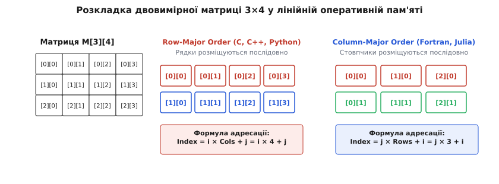
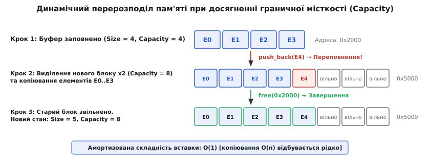

# Масив (Array)

<preknowlist>
- [Асимптотична складність](topic:computability/asymptotic-complexity) — поняття O(1) та O(n) для вимірювання часу доступу та обсягу пам'яті.
- [Амортизаційний аналіз](topic:computability/amortized-analysis) — математичний метод оцінки середньої вартості послідовності операцій при динамічній зміні розміру.
</preknowlist>

Центральний процесор обчислює фізичну адресу будь-якої комірки оперативного запам'ятовуючого пристрою (ОЗП) за один базовий такт за допомогою єдиної арифметичної операції додавання. Проте безпосередній зв'язок між логічним порядком елементів у програмі та фізичними адресами в системній шині вимагає структури даних, яка повністю дзеркалить лінійну природу самої оперативної пам'яті. Такою базовою структурою є масив.

Масив (Array) — це фундаментальна структура даних, що являє собою суцільний (неперервний) блок одинакових за розміром елементів, розміщених у пам'яті послідовно один за одним. Головною властивістю масиву є можливість отримати доступ до будь-якого елемента за його числовим індексом за сталий час `O(1)`, незалежно від загальної кількості елементів або розміру самого масиву.

## Сутність масиву та адресація в оперативній пам'яті

Сучасна оперативна пам'ять комп'ютера (RAM) з точки зору процесора являє собою величезний одновимірний масив байтів. Кожен байт має унікальну числову фізичну адресу. Коли програма оголошує масив із `N` елементів типу `T`, операційна система та аллокатор пам'яті виділяють суцільний неперервний фрагмент адресного простору довжиною `N · sizeof(T)` байтів.

Концептуальна сила масиву полягає у відсутності будь-яких службових покажчиків між елементами. Елементи лежать щільно, а зв'язок між ними описується чистою алгеброю. Нехай `B` — базова адреса (початок блоку пам'яті, або адреса нулевого елемента `&A[0]`), а `S` — розмір одного елемента в байтах (`sizeof(T)`). Тоді фізична адреса елемента з індексом `i` обчислюється за формулою:

```
Address(A[i]) = B + i · S
```

Оскільки операції множення цілого числа та додавання виконуються безпосередньо в арифметико-логічному пристрої (АЛУ) процесора за 1 такт, обчислення адреси не вимагає звернення до пам'яті чи обходу проміжних вузлів. На відміну від зв'язаних списків або дерев, де для пошуку `i`-го елемента доводиться послідовно зчитувати `i` покажчиків (`O(n)` операцій), масив обчислює цільову адресу миттєво.

Ключовим обмеженням неперервної адресації є вимога однорідності типів (Homogeneity). Якщо елементи масиву матимуть різний розмір, зміщення `i`-го елемента стане неможливо обчислити за допомогою простого множення `i · S`. Тоді довелося б зберігати додаткову таблицю зміщень, що зруйнувало б головну перевагу масиву — відсутність накладних витрат пам'яті на метадані.

Таблиця висвітлює порівняння часової складності основних операцій для статичного масиву:

| Операція | Асимптотична складність | Фізична причина тривалості |
| :--- | :--- | :--- |
| **Доступ за індексом (`A[i]`)** | `O(1)` | Пряме обчислення адреси `Base + i · Size` за 1 такт АЛУ. |
| **Зміна елемента (`A[i] = v`)** | `O(1)` | Запис значення за відомою адресою без зсуву інших даних. |
| **Пошук за значенням (невідсортований)** | `O(n)` | Послідовний перебір усіх комірок у найгіршому випадку. |
| **Пошук за значенням (відсортований)** | `O(log n)` | [Двійковий пошук](topic:sf-algorithms/binary-search) завдяки миттєвому доступу до середини. |
| **Вставка в початок/середину** | `O(n)` | Необхідність фізичного зсуву `n - i` елементів вправо. |
| **Вилучення з початку/середини** | `O(n)` | Необхідність фізичного зсуву `n - i` елементів вліво. |

## Апаратний рівень: кеш-лінії, просторова локальність та векторизація

У сучасних обчислювальних системах швидкість роботи процесора суттєво випереджає пропускну здатність оперативної пам'яті. Звернення до DRAM вимагає сотень тактів затримки (так званий Memory Wall). Щоб нівелювати цю затримку, процесори оснащують багаторівневою кеш-пам'яттю (L1, L2, L3) із надшвидким доступом.

Коли процесор запитує з оперативної пам'яті конкретний байт за адресою `Address`, контролер пам'яті зчитує не один байт і не один елемент, а цілий суцільний блок фіксованого розміру — **кеш-лінію** (Cache Line), яка у більшості архітектур x86 та ARM становить 64 байти.

![Розміщення масиву int A[5] у фізичній пам'яті та кеш-лінії](img/memory-layout.svg)
*Фізичне розташування елементів масиву в оперативній пам'яті та завантаження блоків у 64-байтну кеш-лінію процесора.*

Масив забезпечує ідеальну **просторову локальність даних** (Spatial Locality of Reference). Оскільки елементи масиву розташовані в пам'яті строго послідовно, при читанні елемента `A[0]` у кеш-лінію процесора автоматично опиняються і елементи `A[1]`, `A[2]`, ..., `A[15]` (якщо елемент має розмір 4 байти). Наступні 15 звернень до сусідніх елементів відбуваються миттєво з кешу L1 (Cache Hit), усього за 1–4 такти, взагалі не звертаючись до повільної RAM.

Крім того, апаратні блоки процесора — **Hardware Prefetchers** (блоки попередньої вибірки) — аналізують паттерни доступу до пам'яті. Побачивши, що програма послідовно читає адреси `A[0]`, `A[1]`, `A[2]`, Prefetcher заздалегідь підвантажує наступні кеш-лінії з DRAM у кеш L1 ще до того, як програма подасть запит на читання `A[16]`.

На противагу цьому, структури даних на покажчиках (зокрема вузли зв'язаних списків або дерев) виділяються в динамічній пам'яті хаотично. Перехід за покажчиком `node->next` з високою ймовірністю веде за адресою в іншій кеш-лінії, що спричиняє постійні промахи кешу (Cache Misses) та «погоню за покажчиками» (Pointer Chasing). Саме завдяки апаратній кеш-локальності лінійне сканування масиву на практиці працює в десятки разів швидше за обхід зв'язаного списку аналогічного розміру.

Ще однією вирішальною перевагою неперервних масивів є підтримка **SIMD-векторизації** (Single Instruction, Multiple Data). Сучасні процесори мають широкі векторні регістри (наприклад, 256-бітні AVX2 або 512-бітні AVX-512 в x86, 128-бітні Neon в ARM). За допомогою єдиної векторної інструкції процесор може одночасно завантажити з масиву 8 чи 16 чисел і виконати над ними додавання чи множення за один такт. Якщо дані не лежать у пам'яті неперервно, векторизація стає неможливою.

Однак при багатопотоковому програмуванні просторова локальність може створювати прихований дефект продуктивності — **хибне розділення пам'яті** (False Sharing). Якщо два незалежних ядра процесора одночасно модифікують різні елементи масиву, які випадково лежать у межах однієї 64-байтної кеш-лінії, процесорний протокол кеш-когерентності (MESI/MOESI) змушений постійно інвалідувати та перезавантажувати цю кеш-лінію між ядрами, що катастрофічно сповільнює виконання.

Детальніше про [історію виникнення масивів та апаратної адресації пам'яті](topic:sf-algorithms/array/hist-array.md) — від перших індексних регістрів ЕОМ до покажчикової арифметики C — можна прочитати у відповідній історичній вставці.

## Апаратне вирівнювання та пакувальні накладні витрати

Системна шина процесора зчитує дані з оперативної пам'яті блоками, кратними розміру машинного слова (4 байти для 32-бітних архітектур, 8 байтів для 64-бітних). З міркувань апаратної оптимізації процесори вимагають **вирівнювання пам'яті** (Memory Alignment): змінна розміром `S` байтів повинна розташовуватися за адресою, кратною `S`.

Якщо масив містить складні структури даних (`struct`), компілятор автоматично вставляє між полями структури або між елементами масиву порожні заповнювальні байти (**Padding**). Наприклад, розглянемо структуру з трьох полів:

:::tabs
```c
struct Element {
    char flag;     // 1 байт
    // 7 байтів padding (заповнювач)
    double value;  // 8 байтів (вимагає адреси, кратної 8)
    int count;     // 4 байти
    // 4 байти padding наприкінці структури
};
```
```cpp
struct Element {
    char flag;     // 1 байт
    // 7 байтів padding (заповнювач)
    double value;  // 8 байтів (вимагає адреси, кратної 8)
    int count;     // 4 байти
    // 4 байти padding наприкінці структури
};
```
:::

Хоча сума корисних даних складає `1 + 8 + 4 = 13` байтів, реальний розмір `sizeof(struct Element)` у пам'яті дорівнюватиме `24` байтам. Масив із 1000 таких структур витратить 24000 байтів, з яких 11000 байтів будуть абсолютно порожнім заповнювачем.

Для оптимізації обсягу пам'яті та кеш-ефективності розробники використовують впорядкування полів за зменшенням їхнього розміру або переходять від системи **Array of Structures (AoS)** до системи **Structure of Arrays (SoA)**: замість одного масиву структур створюють кілька окремих паралельних масивів для кожного поля. Це не лише усуває заповнювачі, але й робить масиви ідеально придатними для SIMD-векторизації.

## Багатовимірні масиви: геометрія сіток у пласкій пам'яті

Не зважаючи на те, що фізична пам'ять є строго одновимірною, у багатьох задачах (комп'ютерна графіка, фізичне моделювання, машинне навчання) дані мають двовимірну, тривимірну або n-вимірну структуру (матриці, сітки, тензори).

Щоб розмістити n-вимірний масив у лінійній пам'яті, використовується математична трансформація багатовимірного індексу в одновимірний зміщений зсув. Існує два канонічних стандарти такої трансформації: **Row-Major Order** (порядок за рядками) та **Column-Major Order** (порядок за стовпчиками).


*Трансформація двовимірної матриці в лінійну пам'ять за рядковим (Row-Major) та стовпчиковим (Column-Major) порядками.*

У мовах C, C++, Python, Rust та Pascal прийнято порядок **Row-Major Order**. Елементи матриці розміщуються в пам'яті рядок за рядком: спочатку всі елементи першого рядка, потім другого і так далі. Для двовимірної матриці `M[R][C]` з `R` рядків та `C` стовпчиків адреса елемента `M[i][j]` обчислюється за формулою:

```
Index = i · C + j
Address(M[i][j]) = BaseAddress + (i · C + j) · sizeof(T)
```

У мовах Fortran, MATLAB, R та Julia застосовується порядок **Column-Major Order**, де послідовно розміщуються стовпчики. Для них формула має вигляд:

```
Index = j · R + i
```

Різниця між порядками адресації має критичний вплив на продуктивність програм. Якщо у мові C обходити матрицю за стовпчиками (у зовнішньому циклі індекс стовпчика `j`, у внутрішньому — індекс рядка `i`), то кожна ітерація внутрішнього циклу робить крок адреси розміром `C · sizeof(T)`. Це призводить до виходу за межі поточної кеш-лінії, постійних промахів кешу та падіння швидкості обчислень у 5–20 разів порівняно з правильним обходом за рядками.

У високопродуктивних обчисленнях (наприклад, у бібліотеках лінійної алгебри BLAS та LAPACK) для подолання обмежень кешу при множенні великих матрицій застосовують техніку **блокування (Tiling / Blocking)**. Матрицю розбивають на невеликі підматриці (блоки), розмір яких підбирають так, щоб вони повністю вміщалися в кеш L1/L2, що дозволяє повторно використовувати зчитані дані без вимивання з кешу.

Загальне формальне доведення та [математичне виведення формул адресації для n-вимірних тензорів та вирівнювання](topic:sf-algorithms/array/math-array-addressing.md) міститься у математичній вставці.

## Динамічні масиви та амортизоване зростання

Статичні масиви мають жорстко фіксований розмір, визначений під час компіляції. Проте більшість реальних застосунків не знають заздалегідь точний обсяг вхідних даних. Для вирішення цієї проблеми створено **динамічний масив** (`std::vector` у C++, `ArrayList` у Java, `list` у Python, зрізи в Go).

Динамічний масив зберігає вказівник на суцільний блок у купі (Heap) та підтримує дві окремі змінні розмірності:
1. **Size (Розмір):** Поточна кількість фактично збережених елементів.
2. **Capacity (Місткість):** Загальний розмір виділеного блоку пам'яті в купі (максимальна кількість елементів без виконання нового перевиділення).

Коли додається новий елемент операцією `push_back()`, перевіряється умова `Size < Capacity`. Якщо умова виконується, елемент просто записується за адресою `Base + Size · sizeof(T)`, а значення `Size` збільшується на 1 (`O(1)` операція).


*Процес переподілу пам'яті та копіювання елементів при перевищенні поточної місткості (capacity) динамічного масиву.*

Якщо ж буфер заповнено (`Size == Capacity`), відбувається процедура розширення (Reallocation):
1. Виділяється **новий суцільний блок пам'яті** більшої місткості: `NewCapacity = Capacity · GrowthFactor`.
2. Усі існуючі `Size` елементів копіюються (або переміщуються через Move-семантику) зі старого буфера у новий.
3. Додається новий елемент.
4. Старий блок пам'яті звільняється (`free` / `delete[]`).
5. Вказівник масиву перенаправляється на новий буфер.

Поодинока операція розширення коштує `O(n)` часу, оскільки вимагає копіювання `n` елементів. Проте завдяки **геометричному зростанню** (Growth Factor > 1, зазвичай 2.0 у GCC `std::vector` або 1.5 у MSVC та FBVector) процедура виділення пам'яті відбувається все рідше і рідше. Вибір коефіцієнта 1.5 є астрономічно вигідним з точки зору повторного використання звільнених блоків купи: сума попередніх розмірів `4 + 6 + 9 = 19` перевищує наступний розмір, що дозволяє аллокатору повторно виділити раніше звільнену пам'ять.

Із застосуванням [амортизаційного аналізу](topic:computability/amortized-analysis) доведено, що середня вартість операції `push_back()` становить `O(1)` амортизованого часу. Сумарна вартість додавання `N` елементів складає `O(N)` операцій копіювання, а не `O(N²)`, як було б у разі арифметичного збільшення місткості на сталу величину (+K).

Наведений нижче приклад демонструє роботу зі статичними та динамічними масивами у мовах C та C++:

:::tabs
```c
#include <stdio.h>
#include <stdlib.h>

int main(void) {
    // 1. Статичний масив на стеку
    int static_arr[5] = {10, 20, 30, 40, 50};
    printf("Статичний масив A[2] = %d\n", static_arr[2]);

    // 2. Динамічний масив у купі (Heap)
    size_t capacity = 4;
    size_t size = 0;
    int *dyn_arr = (int *)malloc(capacity * sizeof(int));
    if (!dyn_arr) return 1;

    // Додавання елементів з динамічним розширенням x2
    for (int i = 0; i < 10; ++i) {
        if (size == capacity) {
            capacity *= 2;
            int *temp = (int *)realloc(dyn_arr, capacity * sizeof(int));
            if (!temp) {
                free(dyn_arr);
                return 1;
            }
            dyn_arr = temp;
        }
        dyn_arr[size++] = (i + 1) * 100;
    }

    printf("Динамічний масив: розмір = %zu, місткість = %zu\n", size, capacity);
    printf("Елемент [5] = %d\n", dyn_arr[5]);

    free(dyn_arr);
    return 0;
}
```
```cpp
#include <iostream>
#include <vector>
#include <array>
#include <span>

void print_span(std::span<const int> view) {
    std::cout << "Елементи через span: ";
    for (int val : view) {
        std::cout << val << " ";
    }
    std::cout << "\n";
}

int main() {
    // 1. Статичний безпечний масив (на стеку)
    std::array<int, 5> static_arr = {10, 20, 30, 40, 50};
    std::cout << "std::array A[2] = " << static_arr.at(2) << "\n";

    // 2. Динамічний вектор (у купі)
    std::vector<int> dyn_vec;
    dyn_vec.reserve(4); // Заздалегідь резервуємо пам'ять

    for (int i = 0; i < 10; ++i) {
        dyn_vec.push_back((i + 1) * 100);
    }

    std::cout << "std::vector: розмір = " << dyn_vec.size() 
              << ", місткість = " << dyn_vec.capacity() << "\n";

    // 3. Неволодіючий зріз (C++20 span)
    print_span(static_arr);
    print_span(dyn_vec);

    return 0;
}
```
:::

Ви побачите [повну реалізацію динамічного масиву із кеш-вирівнюванням](topic:sf-algorithms/array/proj-array-operations.md) та підтримкою SIMD у відповідній практичній вставці.

## Обмеження, безпека та крайові випадки

Попри високу швидкість адресації та ідеальну сумісність із кешем, масиви мають фундаментальні недоліки та архітектурні обмеження:

### 1. Дорога вставка та вилучення (`O(n)`)
Щоб вставити новий елемент на початок або в середину масиву, всі наступні елементи доводяться фізично копіювати вправо на одну позицію, звільняючи комірку. При вилученні елемента відбувається зворотний зсув вліво. Для великих масивів з мільйонами елементів це призводить до масивного перекачування байтів у пам'яті. Якщо програма вимагає частих вставок у середину, використовують [двійкові дерева пошуку](topic:sf-algorithms/binary-search-tree) або B-дерева.

### 2. Вимога суцільності пам'яті та фрагментація
Динамічний масив великого розміру вимагає **єдиного неперервного шматка** віртуальної пам'яті. Навіть якщо в системі сумарно вільно 4 ГБ оперативної пам'яті, але вона фрагментована на дрібні блоки по 1 МБ, спроба виділити суцільний масив розміром 2 ГБ завершиться помилкою виділення (`std::bad_alloc` / `NULL`).

### 3. Просторова безпека та переповнення буфера (Buffer Overflow)
У низькорівневих мовах C та C++ оператор індексації `A[i]` з міркувань максимальної швидкості не виконує апаратної перевірки виходу за межі масиву (`i >= N` або `i < 0`). 
Якщо програма звертається до індексу поза межами виділеного блоку, вона зчитує або перезаписує чужі комірки пам'яті. Це спричиняє невизначену поведінку (Undefined Behavior), руйнування стек-фреймів та є головним джерелом вразливостей системи безпеки (Buffer Overflow Attacks).

Для захисту від помилок виходу за межі масиву сучасні інструменти пропонують кілька рівнів захисту:
- **Програмні обгортки:** Використання методу `.at(i)` у C++, який перевіряє індекс `i < size()` і кидає виняток `std::out_of_range`.
- **Динамічні санітайзери (AddressSanitizer / ASan):** Компілятор створює «тіньову пам'ять» (Shadow Memory), позначаючи червоні зони (Redzones) навколо масивів для миттєвого перехоплення помилок Out-of-Bounds доступу під час тестування.
- **Апаратний захист (Memory Tagging Extensions / CHERI):** Сучасні архітектури додають до вказівників апаратні теги та межі, роблячи звернення поза масив неможливим на рівні процесорного заліза.

Детальний аналіз відмінностей між різними реалізаціями контейнерів містить [порівняльну довідку інтерфейсів масивів у C та C++](topic:sf-algorithms/array/api-array-vector.md).

> 🔧 **Навіщо це.** Масив — це найважливіший цеглинка у будівництві високопродуктивного програмного забезпечення. Завдяки абсолютній кеш-локальності та адресації за `O(1)` масиви лежать в основі хеш-таблиць (масив бакетів), черг із пріоритетом (двійкова купа над масивом), операційних систем (таблиці дескрипторів файлів, сторінки пам'яті), баз даних (сторінки індексів B-дерев) та обчислювальних бібліотек машинного навчання та штучного інтелекту (BLAS, NumPy, PyTorch tensor structures), де суцільне розміщення даних у пам'яті є обов'язковою умовою SIMD та GPU векторизації.
