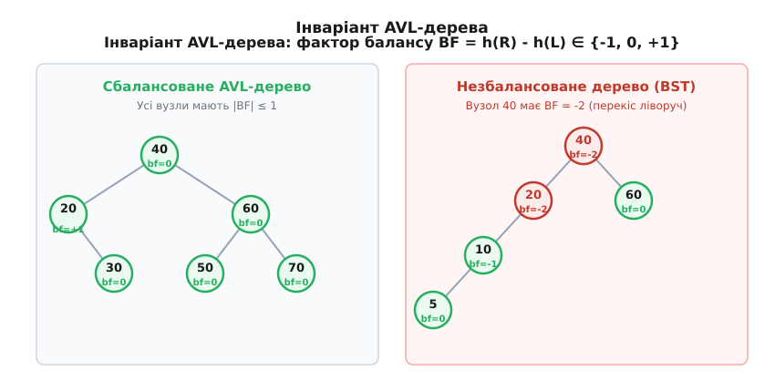
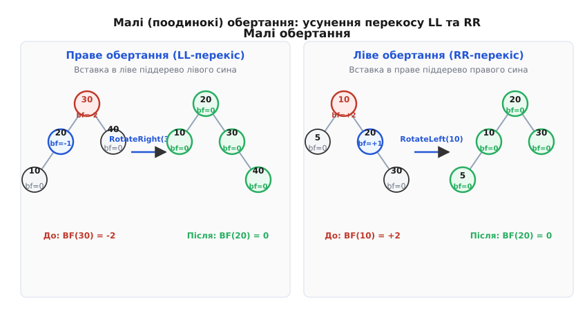
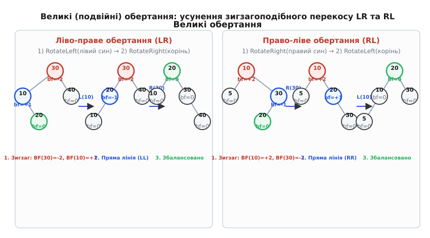
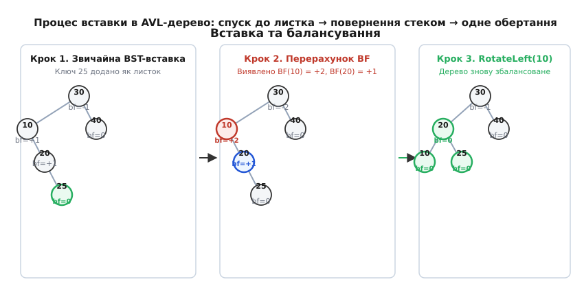
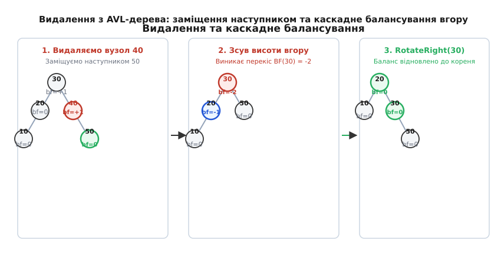

# AVL-дерево

<preknowlist>
- [Двійкове дерево пошуку](topic:sf-algorithms/binary-search-tree) — як працює інваріант упорядкування ключа, спуск ліворуч і праворуч та чому вироджене дерево втрачає логарифмічну швидкість.
- [Двійкове дерево](topic:sf-algorithms/binary-tree) — корінь, піддерева, листки, поняття рівнів та обчислення висоти дерева.
- [Рекурсія](topic:sf-algorithms/recursion) — повернення значення зі стеку викликів та рекурсивне оновлення зв'язків між вузлами.
- [Асимптотична складність](topic:computability/asymptotic-complexity) — нотація O великого для оцінки швидкості пошуку, вставки та видалення.
</preknowlist>

Коли у звичайне [двійкове дерево пошуку](topic:sf-algorithms/binary-search-tree) додають послідовність вже відсортованих даних — наприклад, ідентифікатори 1, 2, 3, 4, 5 — кожен новий ключ стає правим сином попереднього. Дерево миттєво втрачає свою розгалужену форму і вироджується у звичайний однозв'язаний список. Замість логарифмічного обходу за `O(log n)` крок порівняння з кожним вузлом змушений послідовно проходити через усі `n` елементів. Один мільйон записів у відсортованому файлі перетворює швидкий пошук із 20 порівнянь на один мільйон кроків у базі даних, повністю руйнуючи продуктивність системи.

Причина цієї деградації полягає у відсутності контролю за формою дерева. Звичайне двійкове дерево пошуку гарантує впорядкованість елементів, але нічого не обіцяє щодо його висоти. Щоб повернути логарифмічну швидкість, дерево повинно вміти самостійно стежити за своїм перекосом після кожного додавання чи видалення елемента і виправляти його за допомогою локальної перебудови зв'язків.

Першою структурою даних, яка розв'язала цю задачу і довела можливість підтримки логарифмічної висоти, стало **AVL-дерево** (англ. *AVL tree*, на честь його винахідників Георгія Адельсон-Вельського та Євгена Ландіса, 1962 рік).

## Чому саме перекіс у 1 рівень: пошук оптимального інваріанта

На перший погляд здається, що найкращим розв'язком було б вимагати від дерева **ідеального балансу**: аби для кожного вузла кількість елементів у лівому піддереві дорівнювала кількості елементів у правому піддереві (або відрізнялася не більше ніж на 1). 

Однак таку сувору вимогу неможливо підтримувати за логарифмічний час під час динамічних вставок. Якщо дерево містить, наприклад, 7 вузлів, воно може утворити повне двійкове дерево висоти 3. Але додавання 8-го елемента неминуче змушує створити новий 4-й рівень. Щоб зберегти ідеальну симетрію кількості елементів по всіх гілках, довелося б повністю перебудувати більшість зв'язків у дереві, що вимагає лінійного часу `O(n)`.

Геніальність розробки Адельсон-Вельського та Ландіса полягала у переході від підрахунку кількості елементів до **вимірювання висоти піддерев**, та у свідомому послабленні вимоги до симетрії.

Замість ідеальної рівності вони запропонували дозволити відхилення висот сусідніх піддерев на **1 рівень**. Як виявилося, таке незначне послаблення дає дивовижний ефект:
1. Висота дерева все одно залишається суворо логарифмічною: не більше ніж `1.4404 · log₂ n`.
2. Відновлення балансу після вставки елемента більше не вимагає перебудови всього дерева, а виконується за не більше ніж одне або два локальних обертання покажчиків за час `O(1)`.

## Інваріант AVL-дерева: фактор балансу та контроль висоти

Щоб утримати висоту двійкового дерева в логарифмічних межах, достатньо стежити за тим, наскільки сильно відрізняються висоти лівого та правого піддерев у кожному вузлі.

Введемо поняття **висоти вузла** `h(v)` — це довжина найдовшого шляху від вузла `v` до найвіддаленішого листка у його піддереві. За домовленістю, висота порожнього піддерева (`NULL`) дорівнює 0, а висота вузла-листка дорівнює 1.

На основі висот визначається **фактор балансу** (англ. *balance factor*, `BF`) для кожного вузла `v`:

```
BF(v) = height(Right(v)) - height(Left(v))
```

Фактор балансу показує, у який бік відхиляється вага піддерева:
- Якщо `BF(v) < 0`, то ліве піддерево вище за праве (перекіс ліворуч).
- Якщо `BF(v) > 0`, праве піддерево вище за ліве (перекіс праворуч).
- Якщо `BF(v) = 0`, висоти обох піддерев абсолютно однакові.

> **Інваріант AVL-дерева.** У кожному вузлі дерева модуль фактора балансу не перевищує одиницю:
> **`|BF(v)| ≤ 1`**, тобто **`BF(v) ∈ {-1, 0, +1}`**.

Якщо в результаті вставки або видалення елемента хоча б в одного вузла `|BF(v)|` стає рівним 2, інваріант порушується. Дерево вважається незбалансованим у вузлі `v` і вимагає негайної перебудови.



*Ліворуч: збалансоване AVL-дерево, де фактор балансу кожного вузла лежить у межах від -1 до +1. Праворуч: незбалансоване дерево, у корені якого BF = -2 через перекіс лівого гілкування.*

Суворість цього інваріанта гарантує, що максимальна висота AVL-дерева `h` із `n` вузлами ніколи не перевищить `1.4404 · log₂ n`. Навіть у найгіршому випадку дерево перевищує ідеальну висоту повного двійкового дерева лише на 44%. Строге математичне виведення цього зв'язку через числа Фібоначчі розкрито у вставці [🧮 Доведення логарифмічної межі висоти AVL-дерева](topic:sf-algorithms/avl-tree/math-height-bound.md).

Збереження висоти вузла вимагає додаткових 4 байтів пам'яті (або 2 біти для запису балансу `{-1, 0, +1}`) у кожній структурі вузла. Докладну специфікацію розміщення полів у пам'яті наведено у [📋 Довіднику інтерфейсу та складності операцій AVL-дерева](topic:sf-algorithms/avl-tree/api-interface.md).

## Локальна перебудова: чотири типи дисбалансу та їх обертання

Коли в результаті зміни даних інваріант `|BF(v)| ≤ 1` порушується, баланс відновлюють за допомогою [обертань дерева](topic:sf-algorithms/tree-rotation). Обертання — це локальна зміна покажчиків між батьківським і дочірніми вузлами, яка змінює висоти піддерев, але **суворо зберігає інваріант BST** (всі елементи ліворуч менші за корінь, всі праворуч — більші).

Існує чотири типи перекосу, які розбиваються на дві симетричні пари: дві симетричні ситуації для малих (поодиноких) обертань і дві — для великих (подвійних).

### 1. Лівий перекіс (LL-випадок): праве обертання

Ситуація **LL** (англ. *Left-Left*) виникає, коли корінь `Z` має `BF(Z) = -2`, а його лівий син `Y` має `BF(Y) ≤ 0`. Це означає, що новий елемент був доданий у **ліве піддерево лівого сина**.

Для відновлення балансу виконують **просте праве обертання** (англ. *Right Rotation*) навколо `Z`:

```
        Z (-2)                   Y (0)
       / \                      / \
      Y (-1) T4   ===>         X   Z (0)
     / \                      / \ / \
    X   T3                   T1 T2 T3 T4
   / \
  T1  T2
```

Під час правого обертання вузол `Y` піднімається на місце `Z` і стає новим коренем піддерева. Вузол `Z` опускається і стає правим сином `Y`. Піддерево `T3`, яке містило елементи, більші за `Y`, але менші за `Z`, перечіплюється і стає лівим сином `Z`.

У результаті обертання висота піддерева зменшується на 1, а фактори балансу вузлів `Y` та `Z` стають рівними 0.

### 2. Правий перекіс (RR-випадок): ліве обертання

Ситуація **RR** (англ. *Right-Right*) є дзеркальним відображенням LL. Вона виникає, коли корінь `X` має `BF(X) = +2`, а його правий син `Y` має `BF(Y) ≥ 0` (елемент додано в **праве піддерево правого сина**).

Для ліквідації перекосу застосовують **просте ліве обертання** (англ. *Left Rotation*) навколо `X`:

```
    X (+2)                       Y (0)
   / \                          / \
  T1  Y (+1)      ===>         X   Z
     / \                      / \ / \
    T2  Z                    T1 T2 T3 T4
       / \
      T3  T4
```

Вузол `Y` стає новим коренем, `X` опускається ліворуч, а піддерево `T2` стає правим сином `X`.



*Схема малих (поодиноких) обертань: праве обертання усуває лінійний перекіс LL, а ліве обертання усуває перекіс RR.*

### 3. Ліво-правий перекіс (LR-випадок): подвійне обертання

Ситуація **LR** (англ. *Left-Right*) виникає, коли корінь `Z` має `BF(Z) = -2`, але його лівий син `Y` має `BF(Y) = +1`. Це означає, що перекіс спричинений вставкою у **праве піддерево лівого сина** (зигзагоподібна форма).

Однократне праве обертання навколо `Z` тут не допоможе: воно лише перенесе зигзаг на інший бік. Щоб випрямити структуру, застосовують **велике ліво-праве обертання** (англ. *Left-Right Double Rotation*), яке складається з двох послідовних кроків:
1. Виконується **ліве обертання** навколо лівого сина `Y`. Це перетворює зигзаг LR у пряму лінію LL.
2. Виконується **праве обертання** навколо кореня `Z`.

```
      Z (-2)                Z (-2)               X (0)
     / \                   / \                  / \
    Y (+1) T4  ==>        X (-1) T4   ==>      Y   Z
   / \                   / \                  / \ / \
  T1  X                 Y   T3               T1 T2 T3 T4
     / \               / \
    T2  T3            T1  T2
```

### 4. Право-лівий перекіс (RL-випадок): подвійне обертання

Ситуація **RL** (англ. *Right-Left*) є дзеркальною до LR: корінь `X` має `BF(X) = +2`, а його правий син `Y` має `BF(Y) = -1` (вставка у **ліве піддерево правого сина**).

Застосовується **велике право-ліве обертання** (англ. *Right-Left Double Rotation*):
1. **Праве обертання** навколо правого сина `Y` (перетворення RL у пряму RR).
2. **Ліве обертання** навколо кореня `X`.



*Схема великих (подвійних) обертань: спочатку внутрішнє обертання випрямляє зигзаг у лінійну форму, після чого зовнішнє обертання відновлює баланс піддерева.*

## Алгоритм вставки: підйом стеком та єдине балансування

Вставка нового елемента в AVL-дерево виконується у два проходи: спуск угору-вниз для пошуку місця додавання листком і зворотний підйом стеком рекурсії для оновлення висот та відновлення балансу.

```
Спуск:
 1. Порівнюємо новий ключ x із поточним вузлом.
 2. Якщо x < node->key, рекурсивно йдемо в ліве піддерево.
 3. Якщо x > node->key, рекурсивно йдемо в праве піддерево.
 4. Коли досягли порожнього місця (NULL), створюємо новий вузол з height = 1.

Підйом (unwinding стеку):
 5. Оновлюємо висоту поточного вузла: node->height = 1 + max(h(L), h(R)).
 6. Обчислюємо фактор балансу: BF = h(R) - h(L).
 7. Якщо |BF| <= 1, повертаємо вузол без змін.
 8. Якщо |BF| == 2, визначаємо тип перекосу (LL, RR, LR, RL) і виконуємо відповідне обертання.
```

Критично важливою властивістю вставки в AVL-дерево є те, що **одне поодиноке або подвійне обертання гарантовано відновлює початкову висоту піддерева**, яка була до додавання елемента.

Оскільки висота перебалансованого піддерева стає такою самою, якою вона була до вставки, жоден із вищих предків уздовж шляху до кореня більше не змінить свій фактор балансу.

> **Правило вставки AVL.** Під час додавання одного елемента виконується **не більше одного** поодинокого або подвійного обертання. Часова складність вставки строго дорівнює `O(log n)`.



*Покрокова вставка ключа 25: після додавання листка стек рекурсії піднімається вгору, обчислює BF(10) = +2 і виконує ліве обертання навколо вузла 10, відновлюючи баланс усього дерева.*

## Алгоритм видалення: каскадне відновлення балансу

Видалення вузла з AVL-дерева є складнішою операцією за вставку, оскільки ліквідація елемента може зменшити висоту піддерева і спричинити перекіс у батьківських вузлах.

Процедура видалення складається з трьох етапів:

1. **Пошук та стандартне BST-видалення:**
   - Якщо вузол є листком (не має дітей), він просто видаляється, а покажчик батька стає `NULL`.
   - Якщо вузол має лише одного сина, цей син стає на місце видаленого вузла.
   - Якщо вузол має двох дітей, шукають його **симетричного наступника** (найменший ключ у правому піддереві) або попередника (найбільший ключ у лівому піддереві). Значення наступника копіюється у поточний вузол, після чого рекурсивно видаляється сам наступник із правого піддерева.

2. **Підйом стеком і перерахунок висот:**
   При поверненні з рекурсивного виклику для кожного предка вилученого вузла оновлюється висота та обчислюється фактор балансу.

3. **Балансування при виявленні `|BF| == 2`:**
   Визначають випадок перекосу за фактором балансу відповідного сина і виконують обертання.

На відміну від вставки, обертання при видаленні зменшує висоту піддерева на 1. Це зменшення може змінити фактор балансу вищого батьківського вузла, викликавши нове порушення інваріанта `|BF| == 2`.

В результаті операція видалення може вимагати **каскаду обертань** на кожному рівні вздовж усього шляху від місця видалення до кореня дерева. Оскільки висота дерева обмежена `O(log n)`, максимальна кількість обертань під час одного видалення становить `O(log n)`.



*Процес видалення вузла 40: його місце займає наступник 50, після чого зменшення висоти правої гілки викликає перекіс BF(30) = -2 у корені. Праве обертання відновлює баланс.*

Повну реалізацію алгоритмів вставки, видалення та обертань мовами C та C++ з керуванням пам'яттю наведено у вставці [⚙️ Повна реалізація AVL-дерева мовами C та C++](topic:sf-algorithms/avl-tree/proj-avl-tree.md).

## Складніші операції: злиття (Join) та розщеплення (Split)

Окрім базового точкового пошуку, вставки та видалення, AVL-дерева підтримують високоефективні високорівневі операції над цілими деревами: **злиття двох дерев** та **розщеплення дерева за ключем**.

### Операція злиття (Join)

Нехай дано два AVL-дерева `T1` та `T2`, а також окремий ключ `k` такий, що всі ключі в `T1` менші за `k`, а всі ключі в `T2` більші за `k` (`keys(T1) < k < keys(T2)`). Задача полягає в побудові єдиного збалансованого AVL-дерева `T`, що містить усі елементи з `T1`, `T2` та ключ `k`.

Наївний підхід додавання елементів по одному вимагав би `O(n log n)` часу. Алгоритм `Join` виконує це за час, пропорційний різниці висот дерев: **`O(|h1 - h2| + 1)`**.

1. Якщо `h1 ≈ h2` (різниця не перевищує 1), створюється новий корінь `k` із лівим сином `T1` та правим сином `T2`.
2. Якщо `h1 > h2`, спускаються правою гілкою дерева `T1` до вузла `v` висоти `h2` або `h2 + 1`. Створюється новий вузол з ключем `k`, лівим сином якого стає піддерево `v`, а правим — `T2`. Після цього піднімаються стеком вгору до кореня `T1`, виконуючи необхідні обертання за інваріантом AVL.
3. Якщо `h1 < h2`, алгоритм діє симетрично, спускаючись лівою гілкою `T2`.

### Операція розщеплення (Split)

Операція `Split(T, k)` розділяє вихідне AVL-дерево `T` на два нових збалансованих AVL-дерева `T1` та `T2` такі, що `keys(T1) ≤ k`, а `keys(T2) > k`.

Алгоритм виконує звичайний пошук ключа `k` від кореня до листка. Під час підйому назад усі відокремлені піддерева зливаються за допомогою операції `Join` за логарифмічний час. Загальна складність розщеплення становить **`O(log n)`**.

## Простеження продуктивності та профілювання (Profiling & Tracepoints)

Під час аналізу продуктивності AVL-дерева у реальних системах низького рівня (наприклад, системних сервісах Linux) використовують інструменти профілювання `perf stat` та `valgrind --tool=cachegrind`.

Профілювання дозволяє виміряти два ключові показники апаратної ефективності:
1. **L1-dcache-load-misses:** Кількість промахів кешу даних першого рівня під час проходу по покажчиках `left` та `right`.
2. **branch-misses:** Кількість промахів передбачення розгалужень (англ. *branch mispredictions*) під час порівняння ключів `key < node->key`.

Оскільки AVL-дерево має суворо мінімальну висоту, кількість порівнянь та переходів за покажчиками є найменшою серед усіх динамічних бінарних дерев. У системах із високою частотою запитів на читання це забезпечує найменшу кількість промахів кешу на один пошуковий запит.

## Фізична пам'ять та кешева локальність: де програє дерево

Аналізуючи швидкодію AVL-дерева на реальному апаратному забезпеченні, важливо розуміти не лише кількість порівнянь, а й динаміку роботи кеш-пам'яті центрального процесора (CPU Cache).

Кожен вузол AVL-дерева виділяється у динамічній пам'яті (купі) окремим блоком. Це означає, що вузли розташовані в RAM за довільними, незапланованими адресами. Під час пошуку ключів процес опиняється в ситуації **послідовного вибірки покажчиків** (англ. *pointer chasing*): обчислювальний ядро змушене чекати завантаження наступного вузла з оперативної пам'яті в кеш L1/L2.

На відміну від суцільного масиву, де процесорний механізм попередньої вибірки (англ. *hardware prefetcher*) заздалегідь завантажує сусідні елементи у кеш-лінії, обхід AVL-дерева супроводжується частими промахами кешу (англ. *cache misses*). 

Саме з цієї причини для невеликих обсягів даних (до кількох сотень елементів) звичайний відсортований масив або плоский вектор може працювати швидше за AVL-дерево завдяки ідеальній кешевій локальності, незважаючи на теоретичну складність `O(n)` для вставки. Проте зі зростанням кількості елементів до десятків тисяч і мільйонів сувора логарифмічна складність AVL-дерева повністю компенсує затримки кешу.

Для зменшення промахів кешу у високопродуктивних реалізаціях AVL-дерев застосовують **арена-алокатори** (англ. *arena allocators*), які виділяють пам'яті під вузли суцільними великими блоками, підвищуючи щільність упаковки вузлів у кеш-лініях процесора.

> 🔧 **Навіщо це.**
> AVL-дерева є ідеальним вибором для **систем із перевагою операцій читання** (англ. *read-heavy workloads*), де швидкість пошуку критичніша за швидкість вставки та видалення. Оскільки висота AVL-дерева є строго меншою за висоту червоно-чорного дерева (`1.44 log₂ n` проти `2 log₂ n`), пошук в AVL-дереві виконується в середньому на 15–20% швидше.
> 
> AVL-дерева застосовуються в:
> - **Внутрішньопам'яткових індексах баз даних**, де дані часто запитуються за точним значенням або діапазоном, але рідко оновлюються.
> - **Підсистемах керування віртуальною пам'яттю операційних систем** (наприклад, для відстеження вільних і зайнятих діапазонів адрес у деяких ядрах Unix).
> - **Геометричних алгоритмах та комп'ютерній графіці** (задачі пошуку перетинів відрізків, точкові локалізаційні структури).
> - **Системах реального часу**, які вимагають строго визначеної верхньої межі часу відповіді на запит пошуку (без амортизаційних затримок).

## Порівняльний аналіз: AVL-дерево проти альтернатив

Під час вибору впорядкованої структури даних інженер обирає між трьома основними альтернативами: AVL-деревом, червоно-чорним деревом та B-деревом (або хеш-таблицею, коли порядок не потрібен).

### AVL-дерево проти червоно-чорного дерева

Обидва дерева є самобалансованими двійковими деревами пошуку з логарифмічною складністю `O(log n)` для всіх операцій. Різниця полягає у суворості інваріанта:

- **AVL-дерево:** Суворіший інваріант висоти (`|BF| ≤ 1`). Висота не перевищує `1.44 log₂ n`. Пошук виконується швидше, але вставка та видалення частіше викликають обертання (при видаленні — до `O(log n)` обертань).
- **[Червоно-чорне дерево](topic:sf-algorithms/red-black-tree):** Послаблений інваріант кольору (найдовший шлях від кореня до листка не більше ніж удвічі довший за найкоротший). Висота не перевищує `2 log₂ n`. Вставка та видалення відбуваються швидше, бо вимагають не більше 2 і 3 обертань відповідно (решта корекцій робиться перефарбовуванням).

**Правило вибору:** Якщо кількість операцій пошуку суттєво перевищує кількість оновлень (співвідношення читань до записів > 70/30) — обирають **AVL-дерево**. Якщо ж вставки та видалення відбуваються так само часто, як і пошук — обирають **червоно-чорне дерево** (саме воно є основою `std::map` у C++ та `TreeMap` у Java).

### AVL-дерево проти B-дерева та Хеш-таблиці

- **Проти [B-дерева](topic:sf-data/b-tree):** AVL-дерево оптимізоване для оперативної пам'яті (RAM), де перехід за вказівником коштує декілька наносекунд. B-дерево групує сотні ключів в один вузол під розмір сторінки диска (4 КБ), мінімізуючи повільні операції введення-виведення (I/O). AVL-дерево на диску працювало б вкрай повільно через велику кількість стрибків по блоках.
- **Проти [Хеш-таблиці](topic:sf-algorithms/hash-table):** Хеш-таблиця забезпечує середній час доступу `O(1)`, що швидше за будь-яке дерево. Однак вона повністю втрачає порядок елементів. AVL-дерево дозволяє за `O(log n)` знайти мінімум, максимум, наступний/попередній елемент та виконувати діапазонні запити (англ. *range queries*), що неможливо зробити у хеш-таблиці без повного перебору.

Історію створення першого самобалансованого дерева та контекст шахових розробок в ІТЕФ висвітлено у вставці [📜 Історія створення AVL-дерева](topic:sf-algorithms/avl-tree/hist-avl.md).
