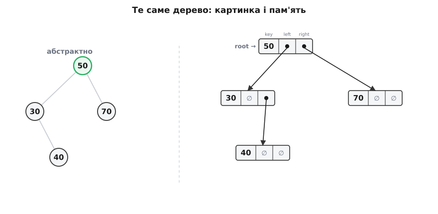

# 🌳 BST, що компілюється: повна реалізація на C++ від вузла до main

**Задача.** Пошук, вставка й видалення поодинці — це фрагменти; програма — це коли вони складаються в один файл, який компілюється, запускається й **прибирає за собою**. Зберімо дерево пошуку повністю: структуру вузла, три операції з усіма трьома випадками видалення, симетричний обхід, що друкує ключі за зростанням, вимір висоти — і дві речі, про які легко забути, поки бавишся фрагментами: хто врешті викликає `delete` і що станеться зі стеком на виродженому дереві. Мова — C++: вузли живуть у купі на сирих вказівниках, і саме керування їхнім часом життя — половина того, що робить це «проєктом», а не начерком.

**Ідея.** Усі три операції — це один і той самий спуск від кореня, керований інваріантом «ліве менше, праве більше»; різниця лише в тому, що робиться в кінці шляху. Тож замість чотирьох окремих алгоритмів у нас одна форма: рекурсивна функція бере **корінь піддерева**, спускається в потрібного сина й повертає **(можливо, новий) корінь того ж піддерева** назад батькові. Ця дрібна домовленість — «поверни корінь, а батько нехай перепризначить сина» — і склеює всю програму: вона однаково обробляє зміну десь усередині, зміну самого кореня, і не потребує жодного вказівника на батька.

## Одна домовленість, що тримає всю програму

[Рекурсія](root:sf-algorithms/recursion) над деревом природна, бо дерево й саме рекурсивне: піддерево — теж дерево. Але є тонкість, на якій тримається вся елегантність коду. Коли `insert` чи `erase` щось міняють у лівому піддереві, хтось мусить **перечепити вказівник** батька на, можливо, інший корінь цього піддерева. Хто? Найпростіша відповідь: нехай функція завжди повертає актуальний корінь піддерева, з яким працювала, а батько беззастережно робить `t->left = insert(t->left, key)`. Корінь не змінився — присвоєння нічого не псує; змінився (виросло нове піддерево, зникло старе) — батько дізнається про це тим самим рядком.

> 🔧 **Навіщо це.** Контракт «функція повертає корінь піддерева» усуває цілий клас помилок. Не треба окремо ловити випадок «а що як міняється сам корінь дерева» — виклик верхнього рівня `root = insert(root, key)` обробляє його тим самим присвоєнням, що й будь-яку внутрішню зміну. Ціна одна: **не забувай це присвоєння**. Написати `insert(root, key);`, викинувши результат, — і вставка в порожнє дерево нікуди не приліпиться, а видалення кореня лишить `root` висіти на звільненій пам'яті.

## Уся програма

Ось повний файл. Пошук тут — цикл (рекурсія в ньому нічого не додає, лише кадри стека), решта рекурсивна за формою піддерева. Нове проти начерків — три останні функції (`inorder`, `height`, `destroy`) і `main`, що все це проганяє:

```cpp
#include <cstdio>

struct Node {
    int   key;
    Node* left  = nullptr;
    Node* right = nullptr;
    explicit Node(int k) : key(k) {}
};

// Пошук: цикл до збігу або до пустки. O(h).
Node* find(Node* t, int key) {
    while (t && t->key != key)
        t = (key < t->key) ? t->left : t->right;
    return t;                       // вузол або nullptr
}

// Вставка: спуск + новий листок; повертає корінь піддерева. O(h).
Node* insert(Node* t, int key) {
    if (!t) return new Node(key);              // місце знайдено
    if      (key < t->key) t->left  = insert(t->left,  key);
    else if (key > t->key) t->right = insert(t->right, key);
    return t;                                  // key == t->key: дублікат ігноруємо
}

// Найлівіший вузол піддерева — in-order-наступник. O(h).
Node* min_node(Node* t) { while (t->left) t = t->left; return t; }

// Видалення: три випадки, двоє дітей — через наступника. O(h).
Node* erase(Node* t, int key) {
    if (!t) return nullptr;
    if      (key < t->key) t->left  = erase(t->left,  key);
    else if (key > t->key) t->right = erase(t->right, key);
    else {                                     // знайшли вузол
        if (!t->left)  { Node* r = t->right; delete t; return r; }   // 0/1 дитина
        if (!t->right) { Node* l = t->left;  delete t; return l; }
        Node* s = min_node(t->right);          // наступник
        t->key   = s->key;                     // копіюємо його ключ у нашу діру
        t->right = erase(t->right, s->key);    // і зносимо наступника (легкий випадок)
    }
    return t;
}

// Симетричний обхід: ліве, вузол, праве → ключі за зростанням. O(n).
void inorder(Node* t) {
    if (!t) return;
    inorder(t->left);
    printf("%d ", t->key);
    inorder(t->right);
}

// Висота: найдовший шлях у РЕБРАХ; порожнє дерево = -1, лист = 0. O(n).
int height(Node* t) {
    if (!t) return -1;
    int l = height(t->left);
    int r = height(t->right);
    return 1 + (l > r ? l : r);
}

// Знесення: спершу обидві дитини, потім сам вузол (post-order). O(n).
void destroy(Node* t) {
    if (!t) return;
    destroy(t->left);
    destroy(t->right);
    delete t;
}

int main() {
    Node* root = nullptr;
    int keys[] = {50, 30, 70, 20, 40, 60, 80, 35, 45};
    for (int k : keys) root = insert(root, k);

    printf("in-order: ");    inorder(root); printf("\n");
    printf("height  : %d\n", height(root));
    printf("find 45 : %s\n", find(root, 45) ? "є" : "нема");

    root = erase(root, 30);          // вузол із двома дітьми
    printf("after 30: ");    inorder(root); printf("\n");

    destroy(root);                   // повернути всю пам'ять
    return 0;
}
```

Запуск друкує:

```
in-order: 20 30 35 40 45 50 60 70 80 
height  : 3
find 45 : є
after 30: 20 35 40 45 50 60 70 80 
```

`inorder` видає ключі відсортованими — так і мусить бути: у кожному вузлі спершу вичерпується все менше зліва, потім сам ключ, потім усе більше справа. Висота 3 — це чотири рівні (корінь 50 → 30 → 40 → 35): рахуємо **ребра**, не вузли, тому й порожнє дерево дістає −1, а самотній лист — 0. Ця «мінус одиниця» не примха: тоді формула `1 + max(висоти дітей)` працює без винятків навіть для листка, у якого обидві дитини порожні (`1 + max(−1, −1) = 0`). А видалення 30 — вузла з двома дітьми — підставило на його місце наступника 35 рівно так, як велить теорія: порядок лишився цілим.

## Що це насправді в пам'яті



*Дерево — це не кружечки, а розкидані по купі записи по три поля, зчеплені адресами. Порожня дитина — nullptr, «корінь» — окремий вказівник ззовні; кожен new треба колись віддати delete.*

Абстрактні кружечки-стрілочки — зручна картинка, але процесор бачить інше: розкидані по купі записи по три поля — ключ і два вказівники, — зчеплені адресами. «Ребро» дерева — це не лінія, а число-адреса в полі `left` чи `right`; порожня дитина — це `nullptr`, домовлений «нікуди»; «корінь» — окремий вказівник поза деревом, що тримає адресу верхнього запису. Ось звідки береться вартість: кожна операція коштує рівно стільки переходів за вказівником, скільки вузлів на шляху. І ось чому за собою треба прибирати вручну: `new` виділив запис у купі, і поки хтось не викличе `delete`, той запис займатиме пам'ять — навіть коли на нього вже ніхто не вказує.

## Спуск без рекурсії: `Node**` замість батька


*`Node** p` тримає адресу комірки-вказівника й переступає нею вниз: root, потім праве поле п'ятдесятки, потім ліве поле сімдесятки, аж поки `*p` не стане nullptr — це й є діра під новий листок. Присвоєння `*p = new Node(65)` заповнює її, само́ оновивши поле батька.*

Рекурсивний `insert` елегантний, але носить приховану ціну — кадр стека на кожен рівень. Ітеративний спуск її прибирає, і тут є гарний трюк. Наївний цикл мусив би тягти вказівник на батька, щоб було до чого причепити новий листок. Але можна інакше — вести **вказівник на вказівник**:

```cpp
Node* insert_iter(Node*& root, int key) {
    Node** p = &root;                 // p дивиться на той вказівник, який, можливо, зміниться
    while (*p) {
        Node* t = *p;
        if      (key < t->key) p = &t->left;
        else if (key > t->key) p = &t->right;
        else return t;                // ключ уже є
    }
    return *p = new Node(key);         // *p — саме та порожня комірка; сюди й садимо
}
```

`p` тримає адресу **комірки-вказівника**, у яку ми, можливо, покладемо нового листка: спершу це сам `root`, далі — поле `left` чи `right` вузла, крізь який проходимо. Коли `*p` виявляється `nullptr`, ми стоїмо рівно над «дірою», про яку каже теорія вставки, — і `*p = new Node(key)` заповнює її, автоматично оновивши потрібне поле батька (або `root`, якщо дерево було порожнє). Жодного окремого випадку для кореня, жодного вказівника на батька: та сама комірка, крізь яку ми дивилися, і є місце під листок.

## Видаляти чесніше: зчепити вузол, а не копіювати ключ

Наш `erase` для двох дітей **копіює ключ** наступника в діру, а тоді зносить наступника. Просто — і для чисел цілком добре. Але придивись: ключ 35 «переїхав» з одного вузла в інший. Якщо десь зовні хтось тримав вказівник саме на **вузол** зі значенням, а не на ключ, — після нашої операції той вказівник раптом дивиться на інше значення. Тому стандартні впорядковані контейнери (`std::map`, `std::set`) роблять інакше: вони **фізично зчеплюють** вузол наступника на місце видаленого, не чіпаючи чужих значень. Стандарт вимагає, щоб видалення псувало посилання лише на **сам** видалений елемент, а не на випадкового сусіда, — а це можливо тільки перечіпленням вузлів, не копіюванням ключів.

```cpp
Node* erase_splice(Node* t, int key) {
    if (!t) return nullptr;
    if      (key < t->key) t->left  = erase_splice(t->left,  key);
    else if (key > t->key) t->right = erase_splice(t->right, key);
    else {
        if (!t->left)  { Node* r = t->right; delete t; return r; }
        if (!t->right) { Node* l = t->left;  delete t; return l; }
        Node* par = t, *s = t->right;          // шукаємо наступника й ЙОГО батька
        while (s->left) { par = s; s = s->left; }
        if (par != t) { par->left = s->right;  s->right = t->right; }
        // (якщо par == t, наступник — прямий правий син: його right уже на місці)
        s->left = t->left;                     // наступник переймає піддерева жертви
        delete t;
        return s;                              // і стає новим коренем піддерева
    }
    return t;
}
```

Наступник не має лівої дитини (він найлівіший), тому від'єднати його легко: на його місце підіймається його ж праве піддерево. Далі він переймає обидва піддерева видаленого вузла й повертається нагору новим коренем. Значення жодного вузла не зсунулося — переставили самі вузли.

## Прибрати за собою: delete, RAII і глибокий стек

`destroy` обходить дерево **post-order** — спершу обидві дитини, лише потім сам вузол — і це не примха стилю: звільни батька першим, і вказівники на його дітей пропадуть разом із ним, а самі діти лишаться загубленими в купі. Порядок «діти → батько» гарантує, що ми ще маємо на кого подивитися, коли доходимо до звільнення.

Ручний `delete` легко забути, тож у справжньому коді власність часто віддають **розумним вказівникам**. Заміни сирі поля на `std::unique_ptr<Node>` — і вони стануть **власниками**: коли гине вузол, його деструктор сам знищить дітей, знову post-order, без жодного `destroy`:

```cpp
struct Node {
    int key;
    std::unique_ptr<Node> left, right;
    explicit Node(int k) : key(k) {}
};

void insert(std::unique_ptr<Node>& t, int key) {
    if (!t) { t = std::make_unique<Node>(key); return; }
    if      (key < t->key) insert(t->left,  key);
    else if (key > t->key) insert(t->right, key);
}
// коли root вийде з області видимості — усе дерево звільниться саме́.
```

Це принцип RAII: час життя вузла прив'язаний до власника, а не до того, чи згадав програміст про `delete`. Витік стає структурно неможливим. Ціну, щоправда, платить не пам'ять, а стек: і рекурсивний `destroy`, і ланцюг деструкторів `unique_ptr` занурюються на всю **висоту** дерева. На гарному дереві висота близько log₂ n — дрібниця. Але на виродженому ланцюгу заввишки n цей спуск має n вкладених кадрів — і на великому відсортованому вході рекурсія [переповнить системний стек](root:sf-lang/stack-overflow) та обвалить програму жорстким аварійним завершенням. Тому ітеративні спуски (як `insert_iter`) — не лише про швидкість: вони не бояться глибини.

## Складність і пастки

Уся вартість тримається на одній величині — висоті h. Спуск коштує стільки переходів, скільки вузлів на шляху; обхід і знесення мусять торкнутися кожного вузла:

```
операція   вартість   чому
find       O(h)       один спуск від кореня
insert     O(h)       спуск + підвіска листка за O(1)
erase      O(h)       спуск до вузла + ще ≤ h до наступника → усе одно O(h)
min / max  O(h)       весь час ліворуч (чи праворуч)
inorder    O(n)       кожен вузол відвідано рівно раз
height     O(n)       треба оглянути все дерево
destroy    O(n)       кожен вузол звільнено рівно раз
```

O(h) — це [від O(log n) до O(n)](root:computability/asymptotic-complexity): на гілкуватому дереві висота логарифмічна, на виродженому — лінійна. Тепер пастки, кожна з яких колись комусь коштувала годин:

- **Забуте присвоєння кореня.** `insert(root, k);` замість `root = insert(root, k);` — і вставка в порожнє дерево зникне, а видалення кореня лишить `root` вказувати на щойно звільнену пам'ять. Контракт «поверни корінь» працює, лише коли повернене справді присвоюють.
- **Витік.** Кожен `new` без пари `delete` — загублений у купі вузол. `erase` звільняє один; решту звільнить лише `destroy` або власники-`unique_ptr`. Забув — пам'ять тече.
- **Глибина = висота.** Будь-яка рекурсія тут занурюється на висоту дерева. Вироджений вхід (відсортовані ключі) робить висоту рівною n і кладе стек. Ліки — ітеративні спуски або дерево, що не дає висоті рости.
- **Дублікати.** Наша домовленість — мовчки ігнорувати повтор (гілки строго `<` і `>`). Треба кратні входження — тримай у вузлі лічильник `int count`, а не другий однаковий ключ: два однакові ключі роблять шлях спуску неоднозначним.
- **Копія ключа проти зчеплення.** Простий `erase` зсуває значення між вузлами; там, де на вузли дивляться ззовні (ітератори, чужі вказівники) — зчеплюй сам вузол, як роблять контейнери стандартної бібліотеки.
- **Не кожна мова любить цю хірургію.** Тут два поля вказують донизу, а `erase` їх перечіплює — це впорядкована правка спільної мутабельної структури. У Rust [модель власності](root:sf-lang/rust-ownership) навмисне опирається кільком мутабельним посиланням на один вузол, тож наївне дерево через `Option<Box<Node>>` тоне в `take()`/`replace()`, а серйозні реалізації або тримають вузли в арені з індексами замість вказівників, або спускаються в `unsafe` (як робить `BTreeMap` стандартної бібліотеки). C++ показує сам алгоритм найпрозоріше — вказівник робить рівно те, що написано, і нічого не приховує.
