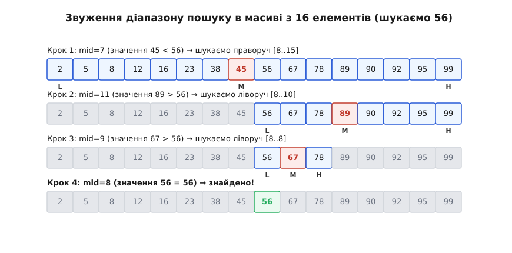
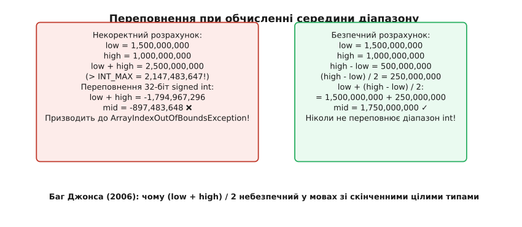
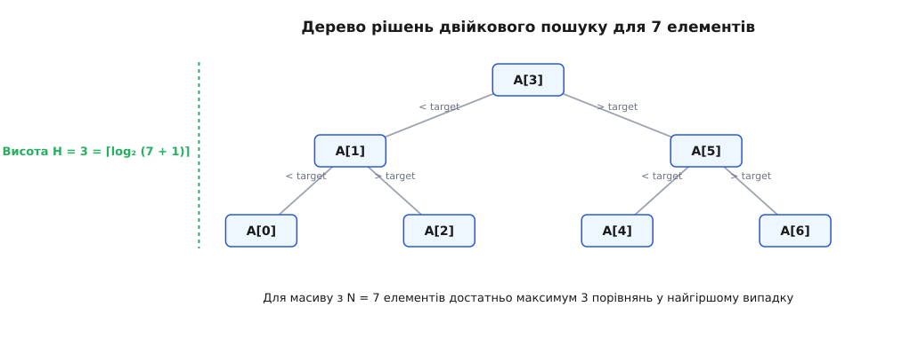

# Двійковий пошук

<preknowlist>
- [Масив](root:sf-algorithms/array) — впорядкована послідовність елементів у безперервному блоці пам'яті з доступом за індексом за O(1).
- [Асимптотична складність (нотація O великого)](root:computability/asymptotic-complexity) — оцінка зростання часу виконання алгоритму від розміру вхідних даних.
</preknowlist>

Уявіть, що ви тримаєте в руках паперовий телефонний довідник або друковану енциклопедію на 1000 сторінок. Вам потрібно знайти прізвище «Марченко». Як ви діятимете?

Ви точно не гортатимете книгу скрупульозно сторінка за сторінкою з самого початку, перевіряючи кожне ім'я від «Абакумов» до «Яковенко». Тобто ви свідомо відмовляєтеся від лінійного перебору, оскільки для 1000 сторінок це могло б вимагати тисячі перевірок. Натомість ви відкриваєте книгу приблизно посередині. Припустимо, ви потрапили на літеру «П». Оскільки літера «М» в алфавіті стоїть раніше за «П», ви миттєво робите фундаментальний висновок: шуканого прізвища **гарантовано немає** у другій половині книги (від «П» до «Я»). 

Одним коротким рухом ви відкидаєте рівно 500 сторінок. Потім ви берете першу половину книги (від 1 до 500 сторінки), знову відкриваєте її посередині — скажімо, на літері «З» — і бачите, що «М» лежить правіше. Тепер ви відкидаєте ще чверть книги. З кожним таким кроком область пошуку скорочується вдвічі, і вже за 10 кроків ви гарантовано знайдете потрібний запис серед тисячі сторінок.

Цей інтуїтивний метод ділення навпіл і є **двійковим пошуком** (англ. *Binary Search*, від латинського *binarius* — подвійний, двоїнний, та італійського *buscare* — шукати). 


*Звуження діапазону пошуку в впорядкованому масиві з 16 елементів на кожному кроці алгоритму.*

## Фізична та логічна модель: математика ділення навпіл

Чому двійковий пошук працює так вражаюче швидко? Секрет полягає не в самому алгоритмі, а у внутрішній структурі даних: **впорядкованості**.

Коли масив із N елементів впорядкований за зростанням (`A[0] ≤ A[1] ≤ A[2] ≤ ... ≤ A[N-1]`), він володіє властивістю транзитивності порядку. Це означає, що якщо ми порівняємо шукане значення `target` з елементом у середині масиву `A[mid]`, можливі лише три випадки:

1. **`A[mid] == target`**: Ми знайшли потрібний елемент, пошук успішно завершено.
2. **`A[mid] > target`**: Оскільки масив впорядкований, усі елементи праворуч від `mid` (з індексами від `mid` до `high`) також строго більші за `target`. Отже, `target` може перебувати лише в лівій частині — від індексу `low` до `mid - 1`.
3. **`A[mid] < target`**: Усі елементи ліворуч від `mid` (від `low` до `mid`) строго менші за `target`. Отже, шуканий елемент може бути лише у правій частині — від індексу `mid + 1` до `high`.

Зверніть увагу: на кожній ітерації ми здійснюємо **всього одне порівняння**, але натомість викидаємо з розгляду **цілу половину** залишкового масиву.

Якщо на початку у нас є N елементів, то після 1-го порівняння залишається N/2 елементів, після 2-го — N/4, після 3-го — N/8, і так далі. На кроці з номером k кількість елементів під підозрою становить N / 2ᵏ.

Пошук зупиняється, коли область пошуку скорочується до 1 елемента (або стає порожньою). Щоб знайти максимальну кількість кроків k у найгіршому випадку, розв'яжемо рівняння:

```
N / 2ᵏ = 1  ==>  N = 2ᵏ  ==>  k = log₂ N
```

Це означає, що часова складність двійкового пошуку становить **O(log N)**. 

Щоб відчути різницю між лінійним O(N) та логарифмічним O(log N) пошуком, погляньте на числові масштаби:

| Кількість елементів (N) | Лінійний пошук O(N) | Двійковий пошук O(log₂ N) |
| :--- | :--- | :--- |
| 10 | 10 порівнянь | 4 порівняння |
| 1 000 | 1 000 порівнянь | 10 порівнянь |
| 1 000 000 (1 мільйон) | 1 000 000 порівнянь | 20 порівнянь |
| 4 000 000 000 (4 мільярди) | 4 000 000 000 порівнянь | 32 порівняння |

Як бачимо, для масиву розміром у 4 мільярди записів (що вимагало б 4 гігабайти пам'яті лише для вказівників чи чисел) лінійному пошуку знадобилися б мільярди операцій, що зайняло б кілька секунд на сучасному процесорі. Двійковий пошук знаходить відповідь **всього за 32 порівняння** — за частки мікросекунди!

📜 Про те, як алгоритм пройшов шлях від давніх бібліотечних каталогів до класичних комп'ютерних монографій, читайте в уставці [Від телефонних довідників до багу на пів мільярда пристроїв: історія двійкового пошуку](root:sf-algorithms/binary-search/hist-binary-search.md).

## Інваріант циклу та фундаментальна формула середини

Написати ідею двійкового пошуку словами легко, проте правильно реалізувати його в коді без «помилок на одиницю» (англ. *off-by-one errors*) — це відома інженерна задача. Видатний науковець Дональд Кнут зазначав, що хоча ідея двійкового пошуку проста, перша повністю коректна реалізація алгоритму з'явилася лише через 16 років після його першої публікації.

Щоб алгоритм був гарантовано коректним, ми мусимо сформулювати та суворо дотримуватися **інваріанта циклу**.

### Інваріант двійкового пошуку

На початку кожної ітерації циклу виконується умова:
*Якщо шуканий елемент `target` присутній у масиві, то його індекс `i` належить закритому інтервалу `[low, high]`.*

- **Ініціалізація**: На початку `low = 0`, `high = N - 1`. Інтервал `[0, N - 1]` охоплює весь масив. Інваріант істинний.
- **Збереження (ітерація)**: Ми вираховуємо опорний індекс `mid`.
  - Якщо `A[mid] < target`, то для всіх `j ≤ mid` маємо `A[j] ≤ A[mid] < target`. Отже, елемент не може бути на позиціях `≤ mid`. Звужуємо інтервал до `[mid + 1, high]`. Інваріант зберігається.
  - Якщо `A[mid] > target`, то для всіх `j ≥ mid` маємо `A[j] ≥ A[mid] > target`. Елемент не може бути на позиціях `≥ mid`. Звужуємо інтервал до `[low, mid - 1]`. Інваріант зберігається.
  - Якщо `A[mid] == target`, елемент знайдено.
- **Завершення**: Цикл триває, поки `low ≤ high`. Якщо `low > high`, інтервал `[low, high]` стає порожнім. Згідно з інваріантом, це означає, що `target` відсутній у масиві.

### Пастка переповнення: Баг Джонса (2006)

У багатьох підручниках із програмування протягом десятиліть середину інтервалу обчислювали за «очевидною» формулою:

```c
int mid = (low + high) / 2; // ❌ НЕБЕЗПЕЧНО!
```

На перший погляд, це математично бездоганно. Проте в комп'ютерній арифметиці зі скінченною розрядністю цілих чисел (наприклад, 32-бітне ціле зі знаком `int32_t`, яке має максимальне значення `2 147 483 647`) ховається критична уразливість!

Якщо масив дуже великий (скажімо, містить 1.5 мільярда елементів), і пошук відбувається в правій половині масиву, де `low = 1 000 000 000` та `high = 1 500 000 000`, сума `low + high` дорівнює `2 500 000 000`. 

Це значення перевищує верхню межу `INT_MAX` (`2 147 483 647`). Відбувається знакове арифметичне переповнення (англ. *signed integer overflow*). Число «згортається» в від'ємну область і стає дорівнювати `-1 794 967 296`! Поділ на 2 дає від'ємний індекс `mid = -897 483 648`.

При спробі звернутися до `A[mid]` програма миттєво аварійно завершується з помилкою `ArrayIndexOutOfBoundsException` у Java або звертається до чужої пам'яті (Undefined Behavior) у C/C++.


*Порівняння небезпечного формулювання середини з переповненням та захищеного математичного варіанта.*

**Математично коректна та безпечна формула:**

```c
int mid = low + (high - low) / 2; // ✓ БЕЗПЕЧНО!
```

Оскільки `high ≥ low`, різниця `high - low` завжди додатна і не перевищує розміру масиву. Поділ на 2 ще більше зменшує це значення, а додавання `low` ніколи не виходить за межі `high`. Таким чином, переповнення арифметики стає принципово неможливим.

У мовах програмування з підтримкою побітових операцій беззнакового зсуву (або при роботі з беззнаковими індексами) також застосовують альтернативний запис:

```c
int mid = ((unsigned int)low + (unsigned int)high) >> 1;
```

## Worked-приклад: Покроковий розбір виконання

Простежимо роботу класичного алгоритму двійкового пошуку на конкретному прикладі.

**Умова задачі:**
Дано впорядкований масив з N = 10 цілих чисел: `A = [3, 8, 12, 15, 19, 24, 31, 42, 57, 68]`.
Необхідно знайти індекс значення `target = 42`.

**Покрокове обчислення:**

```
Початковий масив і індекси:
Індекс:    0    1    2    3    4    5    6    7    8    9
Значення: [3,   8,  12,  15,  19,  24,  31,  42,  57,  68]
           ^                                             ^
          low                                           high

--- Крок 1 ---
low = 0, high = 9
mid = 0 + (9 - 0) / 2 = 4
A[mid] = A[4] = 19
Порівняння: A[4] (19) < target (42)
Висновок: target лежить праворуч від mid.
Нове значення low = mid + 1 = 5.

--- Крок 2 ---
low = 5, high = 9
mid = 5 + (9 - 5) / 2 = 7
A[mid] = A[7] = 42
Порівняння: A[7] (42) == target (42)
Висновок: Елемент знайдено на індексі 7!
```

Алгоритм завершив роботу за **всього 2 кроки**, зробивши 2 порівняння замість 8 порівнянь, які були б потрібні при послідовному лінійному переборі.

Подивимося тепер на випадок, коли елемента **немає в масиві**. Шукаємо `target = 20`.

```
--- Крок 1 ---
low = 0, high = 9, mid = 4 (A[4] = 19)
19 < 20 ==> low = mid + 1 = 5.

--- Крок 2 ---
low = 5, high = 9, mid = 7 (A[7] = 42)
42 > 20 ==> high = mid - 1 = 6.

--- Крок 3 ---
low = 5, high = 6, mid = 5 + (6 - 5) / 2 = 5 (A[5] = 24)
24 > 20 ==> high = mid - 1 = 4.

--- Перевірка умови циклу ---
low = 5, high = 4
Умова (low <= high) більше не виконується (5 > 4).
Цикл зупиняється. Повертаємо -1 (значення не знайдено).
```

## Граничні випадки та пастки реалізації

При розробці алгоритмічно надійного коду інженер мусить чітко аналізувати всі можливі граничні випадки (англ. *edge cases*):

1. **Порожній масив (`N = 0`)**:
   Якщо передано масив довжини 0, початкові індекси становитимуть `low = 0`, `high = -1`. Умова циклу `low ≤ high` одразу ж оціниться як `false` (`0 ≤ -1` є хибою), цикл не виконається жодного разу, і функція коректно поверне `-1`.

2. **Шуканий елемент менший за найменший елемент масиву (`target < A[0]`)**:
   На кожному кроці `A[mid] > target`, тому зміщуватиметься лише верхня межа `high = mid - 1`. Наприкінці `high` стане дорівнювати `-1`, і цикл зупиниться при `low = 0, high = -1`.

3. **Шуканий елемент більший за найбільший елемент масиву (`target > A[N-1]`)**:
   На кожному кроці зміщуватиметься лише нижня межа `low = mid + 1`. Наприкінці `low` стане дорівнювати `N`, і цикл зупиниться при `low = N, high = N - 1`.

4. **Дублікати в масиві**:
   Якщо масив містить однакові елементи (наприклад, `[1, 2, 2, 2, 3]`), класичний двійковий пошук поверне індекс **будь-якого** з них, який першим потрапить у `mid`. Він не гарантує повернення саме першого або саме останнього входження. Для знаходження лівої чи правої межі дублікатів використовуються спеціалізовані модифікації — `lower_bound` та `upper_bound`.

⚙️ Детальний розбір реалізації модифікацій `lower_bound`, `upper_bound` та двійкового пошуку в циклічно зсунутому масиві двома мовами (C++ та Python) дивіться у практичній уставці [Практичні варіації двійкового пошуку: lower_bound, upper_bound та пошук у повернутому масиві](root:sf-algorithms/binary-search/proj-binary-search-variants.md).


*Дерево рішень для масиву з 7 елементів, що ілюструє логарифмічну висоту H = 3.*

🧮 Глибоке математичне обґрунтування нижньої межі складності через концепцію дерева рішень та ентропію Шеннона подано в уставці [Дерево рішень та логарифмічний поріг складності](root:sf-algorithms/binary-search/math-log-complexity.md).

> 🔧 **Навіщо це.**
> Двійковий пошук — це не просто шкільний алгоритм для пошуку чисел у масиві. Це фундаментальний паттерн проєктування системних алгоритмів.
> 
> 1. **Бази даних та B-Tree індекси**: Реляційні бази даних (PostgreSQL, SQLite, MySQL) зберігають табличні індекси у формі B-дерев. Кожен вузол B-дерева містить впорядкований масив ключів (від кількох десятків до сотень). Пошук потрібного напрямку спуску всередині кожного вузла здійснюється саме двійковим пошуком.
> 2. **Ядро операційної системи**: Операційні системи використовують двійковий пошук для швидкої трансляції віртуальних адрес пам'яті, пошуку в таблицях системних викликів та обробки таблиць переривань.
> 3. **Розродження багів (git bisect)**: Утиліта `git bisect` застосовує двійковий пошук по історії коммітів репозиторію. Якщо між коммітом A (працював) та коммітом B (зламано) є 1000 коммітів, `git bisect` за 10 тестових збірок точно вкаже комміт, який вніс дефект.
> 4. **Двійковий пошук за відповіддю**: У складних задач обчислювальної геометрії та оптимізації, де неможливо прямо обчислити точне значення, але можна легко перевірити предикат «чи можливе розв'язання для значення X?», двійковий пошук використовують для знаходження оптимального X у неперервному або дискретному діапазоні.

---

Двійковий пошук ілюструє одну з найпотужніших ідей в інформатиці: **використання впорядкованості структури даних для експоненційного скорочення обсягу обчислень**. Розуміння його інваріантів, границь та арифметичних нюансів відкриває шлях до побудови високоефективних систем збереження й обробки даних.
