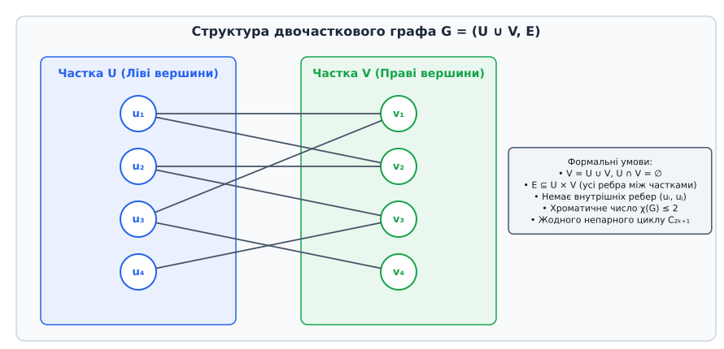
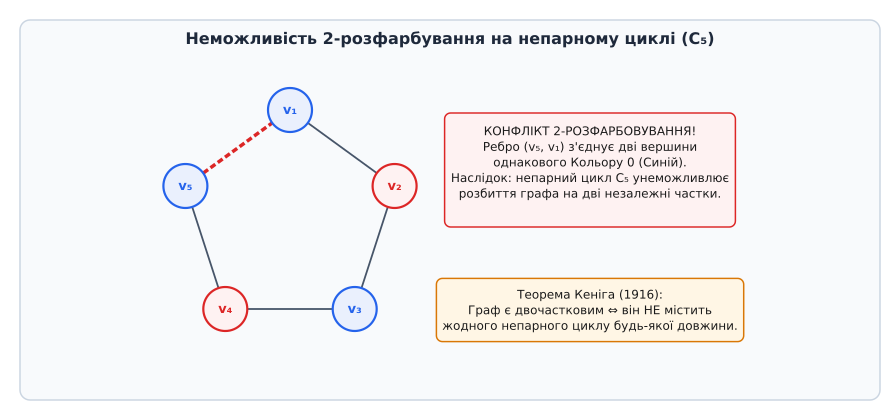
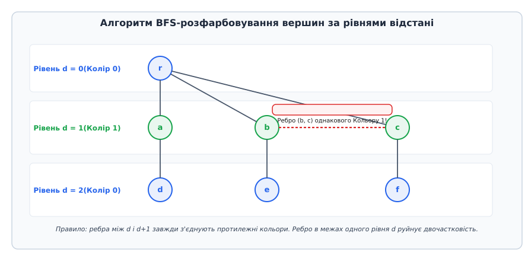
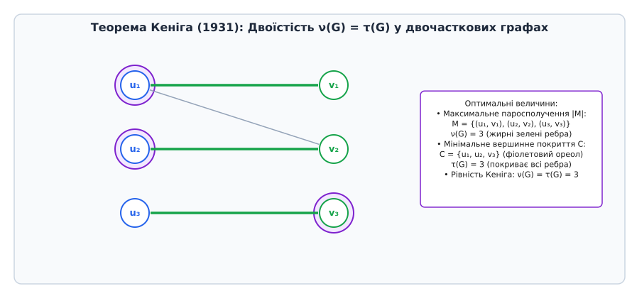

# Двочастковий граф

<preknowlist>
- [Обхід у ширину (BFS)](topic:sf-algorithms/breadth-first-search) — базовий алгоритм обходу графів, розфарбовування вершин за рівнями відстані.
- [Обхід у глибину (DFS)](topic:sf-algorithms/depth-first-search) — обхід у глибину та пошук збільшуючих шляхів.
- [Асимптотична складність](topic:computability/asymptotic-complexity) — нотація O великого, оцінка роботи алгоритмів O(|V| + |E|).
</preknowlist>

Уяви систему управління робочим розкладом у великому автоматизованому логістичному центрі. У системі зареєстровано п'ятдесят операторів і п'ятдесят спеціалізованих вантажних машин. Кожен робітник має кваліфікаційний допуск лише до деяких типів машин, а кожна машина в один момент часу може керуватися лише одним оператором. Головне завдання диспетчера — скласти щоденну зміну так, щоб задіяти максимальну кількість працівників і закрити найменшою кількістю техніки всі виробничі потреби. Якщо ми зобразимо цю систему у вигляді мережі, де точки позначають робітників і машини, а лінії між ними — наявність допуску до керування, ми одразу помітимо фундаментальну структурну особливість: жоден робітник не з'єднаний із іншим робітником, і жодна машина не зв'язана безпосередньо з іншою машиною. Усі лінії зв'язку пролягають виключно між двома ізольованими категоріями об'єктів — робітниками з одного боку та машинами з іншого.

Ця фундаментальна математична структура у теорії графів називається двочастковим графом (від латинського *bipartitus* — «двороздільний», утвореного з приставки *bi-* — «двічі» та дієслова *partire* — «ділити», «розділяти»). Вона є природною мовою опису будь-яких систем, де зв'язки виникають виключно між об'єктами двох принципово різних класів: покупцями й товарами в інтернет-магазинах, студентами й навчальними курсами в університетах, медичними інтернами й клініками, або реєстрами процесора й обчислювальними інструкціями в програмах. Повна відсутність внутрішніх зв'язків усередині кожної категорії дарує двочастковим графам дивовижні алгебраїчні й комбінаторні властивості. Завдяки їм задачі, які на загальних графах є безнадійно складними (NP-повними), на двочасткових графах розв'язуються за елегантний і надшвидкий поліноміальний час.



*Структура двочасткового графа `G = (U ∪ V, E)`. Усі ребра пролягають виключно між множиною лівих вершин `U` та множиною правих вершин `V`. Усередині кожної частки немає жодного ребра, що робить кожну частку незалежною множиною.*

## 1. Фундаментальне визначення та анатомія розбиття

Формально неорієнтований граф `G = (V, E)` називається двочастковим, якщо множину його вершин `V` можна розбити на дві підмножини `U` та `V` (їх називають частками, або лівою і правою множинами вершин) так, що виконуються дві суворі математичні умови:

1. Множини `U` та `V` не перетинаються і разом складають усі вершини графа: `U ∩ V = ∅` та `U ∪ V = V`.
2. Кожне ребро `e = (u, v) ∈ E` з'єднує одну вершину з частки `U` та одну вершину з частки `V` (тобто `u ∈ U` і `v ∈ V`, або навпаки).

З цього визначення безпосередньо випливає, що жодні дві вершини, які належать до однієї частки, не з'єднані між собою ребром. У теорії графів підмножина вершин, між якими немає жодного ребра, називається **незалежною множиною** (independent set). Отже, двочастковий граф — це граф, множину вершин якого можна повністю розбити на дві незалежні множини.

Мовою теорії розфарбовування графів двочастковість означає, що хроматичне число графа не перевищує двох: `χ(G) ≤ 2`. Це означає, що ми можемо пофарбувати кожну вершину частки `U` в синій колір (Колір 0), а кожну вершину частки `V` — у зелений колір (Колір 1). Оскільки жодне ребро не з'єднує вершини одного кольору, таке 2-розфарбовування є абсолютно правильним. Якщо граф містить хоча б одне ребро, його хроматичне число точно дорівнює `χ(G) = 2`; для порожнього графа без ребер `χ(G) = 1`.

Розбиття вершин на дві частки є єдиним з точністю до перестановки кольорів у кожній зв'язаній компоненті графа. Якщо граф є зв'язаним, то фіксація кольору однієї вершини однозначно визначає кольори всіх інших вершин. Для графа з `k` зв'язаними компонентами існує точно `2ᵏ` варіантів правильного 2-розфарбовування.

Двочасткові графи природно виникають у задачах моделювання систем із подвійною природою. Наприклад, у компіляторах під час оптимального розподілу регістрів процесора будується двочастковий граф між змінними програми та доступними апаратними реєстрами. У рекомендаційних мережах граф взаємодій «користувач — контент» моделюється двочастковою структурою, де ребра означають перегляди або покупки. Цікаво, що задачі виділення максимального двочасткового підграфа (Max Cut) у довільному графі є NP-важкою, тоді як перевірка самої двочастковості виконується за лінійний час.

## 2. Критерій Кеніга: непарні цикли як єдиний топологічний бар'єр

Чому одні графи можна легко розбити на дві частки, а інші чинять опір розфарбуванню? Яка саме геометрична чи топологічна структура заважає двочастковому розбиттю?

Фундаментальну відповідь на це питання 1916 року знайшов угорський математик Денеш Кеніг. Його теорема стверджє: **граф є двочастковим тоді й лише тоді, коли він не містить жодного циклу непарної довжини**.



*Неможливість 2-розфарбовування на непарному циклі `C₅`. При почерговому призначенні кольорів (Синій, Червоний, Синій, Червоний, Синій) останнє ребро `(v₅, v₁)` з'єднує дві вершини якогось одного кольору. Цей конфлікт робить двочасткове розбиття неможливим.*

Наочна інтуїція за цим результатом надзвичайно проста й елегантна. Уявімо, що ми рухаємося вздовж циклу у двочастковому графі, чергуючи кольори вершин на кожному кроці: Синій → Червоний → Синій → Червоний... Щоб після проходження всього циклу повернутися у вихідну початкову вершину синього кольору, ми повинні зробити **парну** кількість кроків (переходів по ребрах). Якщо ж цикл має непарну довжину (наприклад, трикутник `C₃`, п'ятикутник `C₅` або семикутник `C₇`), то при поверненні у вихідну вершину ми неминуче отримаємо колірний конфлікт: останнє ребро циклу з'єднає дві вершини одного кольору.

Це правило розповсюджується не лише на прості цикли, а й на замкнені маршути (walks) загального вигляду: граф є двочастковим тоді й лише тоді, коли в ньому немає жодного замкненого маршруту непарної довжини. 

Строге математичне доведення цієї еквівалентності (в обох напрямках через побудову найкоротших шляхів та парність відстаней) детально розібрано у вставці [математичних доведень теорем двочастковості](topic:sf-algorithms/bipartite-graph/math-bipartite-equivalence.md).

З критерію Кеніга випливають важливі практичні наслідки:
- Усі деревні графи (дерева та ліси) є двочастковими, оскільки вони взагалі не містять жодних циклів.
- Усі парні цикли `C₂ₖ` (квадрати `C₄`, шестикутники `C₆` тощо) є двочастковими графами.
- Будь-який підграф двочасткового графа також обов'язково є двочастковим.
- Ейлерів граф є двочастковим тоді й лише тоді, коли кожен його вершиновий ступінь є парним і всі його цикли мають парну довжину.

> 🔧 **Навіщо це.** У системному програмуванні перевірка на наявність непарних циклів є найшвидшим способом виявлення суперечностей у парних антимонотонних обмеженнях. Наприклад, у задачах планивання задач реального часу виникають умови вигляду «задачі A та B не можуть виконуватися на одному ядрі». Якщо граф таких конфліктів містить непарний цикл (скажімо, A не сумісна з B, B з C, а C з A), то розподілити ці задачі по двох ядерних кластерах без конфліктів апаратно неможливо. Крім того, у соціальній психології теорія структурного балансу Гайдера моделює дружбу й ворожнечу саме через двочасткові розбиття та відсутність непарних негативних циклів.

## 3. Алгоритм 2-розфарбовування: виявлення двочастковості за лінійний час

Як алгоритмічно перевірити, чи є заданий граф двочастковим? Наївний перебір усіх можливих `2ⁿ` розбиттів вершин вимагав би експоненціального часу, що абсолютно непридатно для реальних мереж. Однак критерій Кеніга дає нам алгоритм із лінійною складністю `O(|V| + |E|)`.

Ідея полягає у використанні [обходу в ширину (BFS)](topic:sf-algorithms/breadth-first-search) або [обходу в глибину (DFS)](topic:sf-algorithms/depth-first-search). Ми фіксуємо початкову вершину, фарбуємо її в Колір 0, а всім її сусідам призначаємо Колір 1. На кожному наступному кроці обходу сусідам вершин кольору `c` ми намагаємося призначити протилежний колір `1 - c`.



*Процес BFS-розфарбовування за рівнями відстані `d`. Вершини парних рівнів отримують Колір 0, непарних — Колір 1. Деревні ребра між сусідніми рівнями гарантовано з'єднують протилежні кольори. Якщо виявляється ребро всередині одного рівня (як `(b, c)`), це свідчить про наявність непарного циклу та руйнує двочастковість.*

Під час обходу можливі лише дві ситуації при зустрічі з вже відвіданою вершиною `v`:
1. Вершина `v` вже має колір `1 - color[u]`. Це коректний стан: ребро з'єднує протилежні кольори, обхід триває далі.
2. Вершина `v` вже має колір `color[u]`. Це означає, що ми знайшли ребро між вершинами одного кольору! Алгоритм негайно зупиняється й повертає вердикт: граф **не є двочастковим**, а шлях у дереві BFS разом із цим ребром формує явний непарний цикл.

Класифікація ребер під час BFS розбігається на деревні ребра (tree edges), що з'єднують рівні `d` та `d + 1`, та перекресні ребра (cross edges). Ребра між сусідніми рівнями `d` та `d + 1` завжди є коректними. Єдиний тип ребер, що руйнує двочастковість — це ребро між двома вершинами одного й того самого рівня `d`.

Якщо обхід успішно завершується без жодного конфлікту для всіх компонент зв'язності, граф є двочастковим, а масив кольорів задає шукане розбиття `U = {v | color[v] == 0}` та `V = {v | color[v] == 1}`.

Повну реалізацію цього алгоритму мовами C, C++ та Python з обробкою всіх крайових випадків наведено у вставці [практичної реалізації перевірки двочастковості](topic:sf-algorithms/bipartite-graph/proj-bipartite-checker.md), а специфікацію типів даних і кодів помилок — у [довіднику API двочасткового графа](topic:sf-algorithms/bipartite-graph/api-bipartite-graph.md).

## 4. Повні двочасткові графи, матрична структура та спектр

Найщільнішим представником сімейства є **повний двочастковий граф** (complete bipartite graph), який позначають `Kᵣ,ₛ` (або `Kₘ,ₙ`). У ньому кожна з `r` вершин частки `U` з'єднана ребром із кожною з `s` вершин частки `V`.

Основні числові характеристики `Kᵣ,ₛ`:
- Кількість вершин: `|V| = r + s`.
- Кількість ребер: `|E| = r · s`.
- Ступені вершин: усі вершини частки `U` мають ступінь `s`, а всі вершини частки `V` мають ступінь `r`.

Повний двочастковий граф `K₃,₃` (три будинки та три колодязі) відіграє фундаментальну роль у топологічній теорії графів: за теоремою Куратовського (1930) саме граф `K₃,₃` є одним із двох базових неоригінальних планарних блоків (разом із повним графом `K₅`). Якщо граф містить підграф, ізоморфний `K₃,₃`, його неможливо укласти на площині без перетинів ребер.

Особлива краса двочасткових графів розкривається в їхній [суміжній матриці](topic:sf-algorithms/adjacency-matrix) `A`. Якщо впорядкувати вершини так, щоб спочатку йшли всі вершини частки `U`, а потім усі вершини частки `V`, матриця суміжності `A` набуває блокової структури:

```
    |  0   B  |
A = |         |
    | Bᵀ   0  |
```

де `B` — це матриця інцидентності часток розміром `r × s`, `Bᵀ` — її транспонована матриця, а нульові блоки на головній діагоналі прямо відображають відсутність внутрішніх ребер усередині `U` та `V`.

З цієї блокової структури випливає фундаментальний спектральний інваріант: **спектр матриці суміжності двочасткового графа є симетричним відносно нуля**. Це означає, що якщо `λ` є власним значенням матриці `A`, то `-λ` також обов'язково є власним значенням із тією самою кратністю. Для повного двочасткового графа `Kᵣ,ₛ` ненульовими власними значеннями є лише `+√(r·s)` та `-√(r·s)`, а решта `r + s - 2` власних значень дорівнюють нулю.

Крім того, перманент матриці суміжності `B` для повного двочасткового графа `Kₙ,ₙ` точно підраховує кількість досконалих паросполучень, яка дорівнює `n!`. Обчислення перманентів у загальному випадку є #P-повною задачею (теорема Леслі Валіанта, 1979), але на двочасткових графах знаходження хоча б одного максимального паросполучення розв'язується швидко.

## 5. Теорема Кеніга про паросполучення та вершинні покриття

Центральною темою теорії двочасткових графів є задача про **паросполучення** (matching). Паросполученням у графі `G` називається підмножина ребер `M ⊆ E`, у якій жодні два ребра не мають спільних вершин. Паросполучення називається максимальним, якщо воно містить найбільшу можливу кількість ребер. Розмір максимального паросполучення позначають `ν(G)`.

Двоїстою до паросполучення є задача про **вершинне покриття** (vertex cover). Вершинним покриттям називається підмножина вершин `C ⊆ V`, яка торкається кожного ребра графа `E`. Покриття називається мінімальним, якщо воно містить найменшу кількість вершин. Розмір мінімального вершинного покриття позначають `τ(G)`.

У загальних графах знаходження мінімального вершинного покриття є класичною [NP-повною задачею](topic:computability/np-completeness). Однак у двочасткових графах відбувається диво.

1931 року Денеш Кеніг довів фундаментальну теорему двоїстісті: **у будь-якому двочастковому графі розмір максимального паросполучення дорівнює розміру мінімального вершинного покриття**:

```
ν(G) = τ(G)
```



*Демонстрація рівності Кеніга `ν(G) = τ(G) = 3`. Максимальне паросполучення складається з 3 зелених ребер `M = {(u₁, v₁), (u₂, v₂), (u₃, v₃)}`. Мінімальне вершинне покриття складається з 3 вершин `C = {u₁, u₂, v₃}` (позначених фіолетовим ореолом), які торкаються абсолютно всіх ребер графа.*

Чому ця рівність така важлива? Вона показує, що у двочасткових графах задача мінімального вершинного покриття зводиться до задачі пошуку максимального паросполучення, яка розв'язується за поліноміальний час!

З точки зору лінійного програмування, матриця інцидентності двочасткового графа є **повністю унімодулярною** (Total Unimodular, TUM). Це означає, що визначник будь-якої її квадратної підматриці дорівнює `-1`, `0` або `1`. Завдяки повній унімодулярності розв'язки релаксованої задачі лінійного програмування для паросполучень та покриттів гарантовано є цілочисельними.

За тотожністю Галлаї (Gallai, 1959), для будь-якого графа без ізольованих вершин сума розміру максимальної незалежної множини `α(G)` та розміру мінімального вершинного покриття `τ(G)` дорівнює кількості вершин `|V|`:

```
α(G) + τ(G) = |V|
```

Завдяки теоремі Кеніга `τ(G) = ν(G)`, ми отримуємо тотожність `α(G) + ν(G) = |V|`. Це дозволяє за поліноміальний час знаходити не лише максимальне паросполучення, а й мінімальне вершинне покриття та максимальну незалежну множину двочасткового графа. Більше про математичний розвиток цих ідей читайте у вставці [історії вивчення двочасткових графів](topic:sf-algorithms/bipartite-graph/hist-bipartite-graphs.md).

## 6. Теорема Голла про шлюб та бар'єри покриття

У багатьох практичних задачах потрібно знайти паросполучення, яке повністю покриє всі вершини частки `U` (наприклад, задовольнить запити всіх робітників). Таке паросполучення називається **повним** відносно частки `U`.

Коли таке паросполучення існує? 1935 року британський математик Філіп Голл сформулював **теорему про шлюб** (Hall's Marriage Theorem).

Нехай `S ⊆ U` — довільна підмножина вершин лівої частки `U`. Позначимо через `N(S) ⊆ V` множину всіх сусідів вершин із `S` у правій частці `V`.

**Теорема Голла:** Паросполучення, що покриває всі вершини частки `U`, існує тоді й лише тоді, коли для будь-якої підмножини `S ⊆ U` кількість її сусідів не менша за розмір самісінької підмножини:

```
∀ S ⊆ U : |N(S)| ≥ |S|
```

Якщо знайдеться підмножина `S ⊆ U`, для якої `|N(S)| < |S|`, то така підмножина називається **вузьким місцем** (бар'єром Голла). Наприклад, якщо 3 студенти претендують на стажування, але разом мають допуск лише до 2 компаній, розподілити всіх трьох студентів неможливо. Теорема Голла ствердє, що такі локальні «вузькі місця» є єдиною причиною відсутності повного паросполучення.

Узагальнена (дефектна) форма теореми Голла каже, що розмір максимального паросполучення дорівнює:

```
max |M| = |U| - max ( |S| - |N(S)| )   для всіх S ⊆ U
```

Крім того, для будь-якого `r`-регулярного двочасткового графа (`r ≥ 1`) умова Голла виконується автоматично, тому кожен `r`-регулярний двочастковий граф обов'язково містить досконале паросполучення (perfect matching).

## 7. Алгоритмічний арсенал: від збільшуючих шляхів до Гопкрофта-Карпа

Як практично шукати максимальне двочасткове паросполучення?

Фундаментом усіх алгоритмів є поняття **збільшуючого шляху** (augmenting path), сформульоване Клодом Бержем 1957 року. Простий шлях називається `M`-чередувальним, якщо його ребра по черзі належать і не належать до паросполучення `M`. Якщо такий шлях починається і закінчується у вільних вершинах, він є **збільшуючим шляхом**.

**Теорема Бержа (1957):** Паросполучення `M` є максимальним тоді й лише тоді, коли у графі немає жодного `M`-збільшуючого шляху.

На цій теоремі базуються основні алгоритми:
1. **Алгоритм Куна (Ford-Fulkerson):** Запускає DFS для пошуку одного збільшуючого шляху з кожної вільної вершини. Часова складність: `O(|V| · |E|)`.
2. **Алгоритм Гопкрофта-Карпа (1973):** Будує шарний граф за допомогою BFS і знаходить систему найкоротших диз'юнктних збільшуючих шляхів за фази. Складність: `O(|E| · √|V|)`.
3. **Зведення до максимального потоку:** Створюється джерело `S` із ребрами пропускної здатності 1 до всіх вершин `U`, та сток `T` із ребрами пропускної здатності 1 від всіх вершин `V`. Алгоритм Дініца розв'язує задачу за `O(|E| · √|V|)`.
4. **Угорський алгоритм (Kuhn-Munkres, 1955):** Знаходить паросполучення **найменшої ваги** у зваженому двочастковому графі за час `O(|V|³)`.

> 🔧 **Навіщо це.** В обробці зображень та комп'ютерному зорі Угорський алгоритм використовується для зіставлення розпізнаних об'єктів між кадрами відеопотоку. А алгоритм Гопкрофта-Карпа є стандартом у високопродуктивних решітчастих комутаторах мережевих маршрутизаторів.

## 8. Практичні застосування та підсумок

Двочасткові графи є універсальним інструментом у багатьох галузях:
- **Рекомендаційні системи:** Мережі взаємодій «користувач — товар» (User-Item Graphs). Прогнозування вподобань базується на аналізі двочасткових проекцій (bipartite projection).
- **Теорія кодів:** Коди з низькою щільністю перевірок на парність (LDPC) у стандартах 5G та Wi-Fi 6 моделюються двочастковими графами Таннера.
- **Машинне навчання:** Двочасткові графові нейронні мережі (Bipartite GNNs).

Розуміння структури двочасткових графів, критерію Кеніга та теореми Голла дає інженеру можливість замкнути складні комбінаторні задачі в ефективні алгоритми лінійного та майже лінійного часу.
