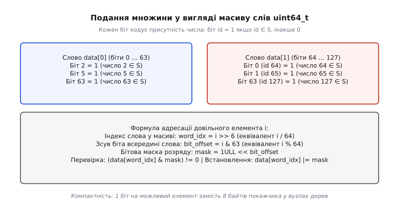
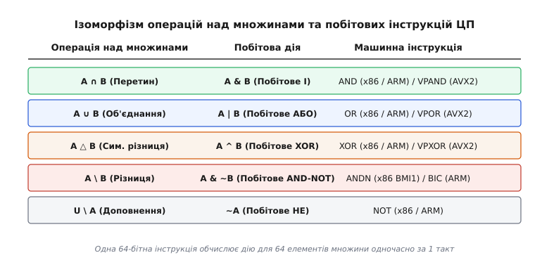
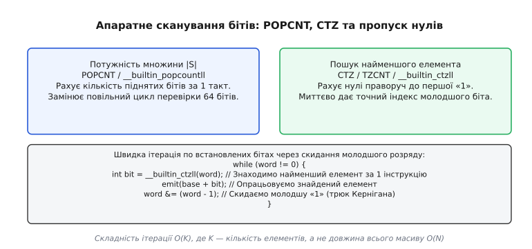
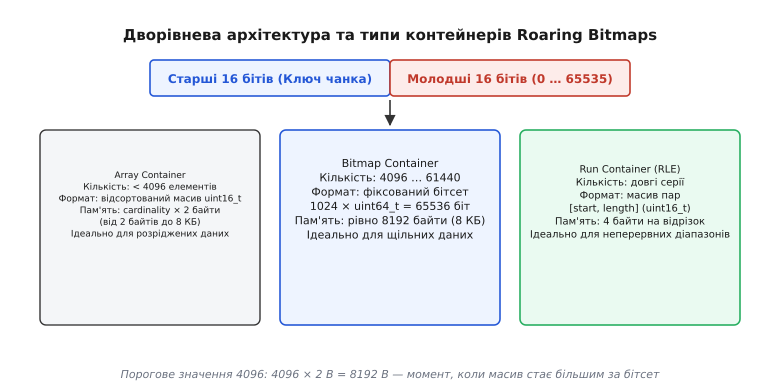

# Бітова множина: множина як набір бітів

<preknowlist>
- [Біти й порядок байтів](root:sf-algorithms/bits-bytes-endianness) — що таке біт, байт, машинне слово та як байти розташовуються в пам'яті.
- [Побітові операції та маски](root:sf-algorithms/bitwise-operations) — базові побітові дії AND, OR, XOR, NOT та операції бітового зсуву.
- [Теорія множин](root:math-logic/set-theory) — математичні поняття множини, підмножини, універсуму, перетину та об'єднання.
- [Булева алгебра](root:math-logic/boolean-algebra) — закони логічних операцій, дистрибутивність і правила де Моргана.
- [Операція Popcount](root:sf-algorithms/popcount-rank) — апаратний і програмний підрахунок кількості одиничних бітів у слові.
</preknowlist>

Коли програмі потрібно зберегти набір унікальних цілих чисел від `0` до `1 000 000`, першим інтуїтивним рішенням часто стає геш-таблиця `std::unordered_set<int>` або збалансоване двійкове дерево пошуку `std::set<int>`. Якщо в таку множину записати один мільйон чисел, геш-таблиця в мовах C++ чи Java споживе від 32 до 48 мегабайтів оперативної пам'яті. Кожен елемент у ній вимагає окремого вузла в купі, покажчиків на сусідні зв'язки, збереження геш-коду та захисних інтервалів вирівнювання пам'яті. Процесор при цьому змушений постійно переходити за покажчиками, перериваючи конвеєр і перевантажуючи кеш-пам'ять сотнями тисяч кеш-промахів.

Проте для цілих чисел існує фундаментально інший спосіб збереження. Якщо відомий максимальний діапазон значень (універсум `U`), наявність або відсутність кожного елемента можна закодувати **рівно одним бітом**. Якщо число `42` належить множині, 42-й біт у суцільному масиві пам'яті встановлюється в `1`, якщо ні — скидається в `0`.

Для одного мільйона чисел такий масив займає рівно `1 000 000 / 8 = 125 000` байтів (близько 122 кілобайтів) — це в **300 разів менше** за геш-таблицю. Весь цей масив цілком поміщається в швидкий кеш L2 процесора. Така структура даних зветься **бітовою множиною** (англ. *bitset*, *bit array*, *bit vector* або *bitmap* — бітова карта), і вона лежить в основі системних алокаторів пам'яті, пошукових рушіїв, баз даних і мережевих маршрутизаторів.

### Математична основа: характеристичний вектор множини

У дискретній математиці будь-яку підмножину `S` скінченного універсуму `U = {0, 1, 2, ..., N - 1}` можна однозначно описати за допомогою **характеристичної функції** (або функції належності) `χ_S(x)`:

```
χ_S(x) = 1,  якщо x ∈ S
χ_S(x) = 0,  якщо x ∉ S
```

Послідовність значень `(χ_S(0), χ_S(1), ..., χ_S(N-1))` утворює двійковий вектор фіксованої довжини `N` — **характеристичний вектор** множини. Цей вектор встановлює взаємно однозначну відповідність (бієкцію) між усіма `2ᴺ` можливими підмножинами універсуму `U` та всіма можливими `N`-бітними двійковими послідовностями.

Ця відповідність зберігає алгебраїчну структуру: булева алгебра підмножин з операціями перетину `∩`, об'єднання `∪` та доповнення `\` є строго ізоморфною булевій алгебрі двійкових розрядів з побітовими операціями `AND`, `OR` та `NOT`. Більше того, множина двійкових векторів утворює булеве кільце над скінченним полем з двох елементів `GF(2)` (полем Галуа), де кільцевим додаванням виступає побітове `XOR` (додавання за модулем 2), а кільцевим множенням — побітове `AND`.

Завдяки цьому складна теоретико-множинна логіка транслюється в прямі інструкції процесора без проміжних рівнів абстракції.

### Масив машинних слів та бітова адресація

Комп'ютерна пам'ять адресується байтами, а процесорні регістри оперують машинними словами фіксованої ширини — зазвичай 64 біти (`uint64_t`). Окремий біт не має власної фізичної адреси на шині пам'яті, тому бітова множина реалізується як суцільний масив 64-бітних цілих чисел без знака.

Щоб визначити, де саме в пам'яті розташований біт з довільним індексом `i`, використовують два арифметичні кроки: знаходження індексу слова в масиві та зміщення всередині цього слова.


*Подання бітової множини у пам'яті. Математична множина `S` зберігається як масив слів `uint64_t`. Довільний індекс `i` розкладається на номер слова через зсув `i >> 6` та зміщення біта через маскування `i & 63`.*

Для 64-бітного слова ділення на 64 та взяття залишку замінюються швидкими побітовими операціями:

```
word_index  = i / 64  =  i >> 6       [зсув праворуч на 6 розрядів, бо 2⁶ = 64]
bit_offset  = i % 64  =  i & 63      [побітове І з маскою 0011 1111₂]
mask        = 1ULL << bit_offset     [одиничний біт, зсунутий на потрібну позицію]
```

Чотири базові операції над множиною реалізуються елементарними діями процесора:

:::tabs
```c
/* 1. Додавання елемента (S = S ∪ {i}) */
words[i >> 6] |= (1ULL << (i & 63));

/* 2. Видалення елемента (S = S \ {i}) */
words[i >> 6] &= ~(1ULL << (i & 63));

/* 3. Перевірка належності (i ∈ S) */
bool exists = (words[i >> 6] & (1ULL << (i & 63))) != 0;

/* 4. Симетричне перемикання */
words[i >> 6] ^= (1ULL << (i & 63));
```
```cpp
/* 1. Додавання елемента (S = S ∪ {i}) */
words[i >> 6] |= (1ULL << (i & 63));

/* 2. Видалення елемента (S = S \ {i}) */
words[i >> 6] &= ~(1ULL << (i & 63));

/* 3. Перевірка належності (i ∈ S) */
bool exists = (words[i >> 6] & (1ULL << (i & 63))) != 0;

/* 4. Симетричне перемикання */
words[i >> 6] ^= (1ULL << (i & 63));
```
:::

Кожна з цих дій не містить розгалужень (є *branchless*) і виконується за 1–2 машинні такти, зводячись до одного читання, бітової маски та одного запису в пам'ять.

> 🔧 **Навіщо це.** У системному програмуванні на C/C++ часто припускаються помилки, виконуючи вираз `1 << bit`. Якщо змінна `1` має знаковий тип `int` (32 біти), то зсув `1 << 35` або `1 << 63` породжує невизначену поведінку (*Undefined Behavior*). Для 64-бітних слів літерал завжди повинен мати суфікс беззнакового 64-бітного числа: `1ULL << bit` або `UINT64_C(1) << bit`.

### Ізоморфізм булевої алгебри та операцій над множинами

Головна обчислювальна сила бітових множин проявляється під час виконання операцій над двома або більше множинами одночасно. У класичних геш-таблицях або деревах обчислення перетину двох множин розміром `N` вимагає перебору всіх елементів однієї множини та пошуку кожного в іншій, що займає час `O(N)`.

У бітових множинах існує строгий математичний ізоморфізм між операціями над множинами в [теорії множин](root:math-logic/set-theory) та побітовими операціями [булевої алгебри](root:math-logic/boolean-algebra).


*Зв'язок математичних операцій над множинами з апаратними побітовими командами. Кожна 64-бітна інструкція виконує дію над 64 парами елементів одночасно.*

Розгляньмо, як кожна операція над множинами транслюється в машинну команду процесора:

1. **Перетин множин (`A ∩ B`):** елемент належить результату тоді й лише тоді, коли він є і в `A`, і в `B`. Це в точності відповідає побітовому `AND` (`&`).
2. **Об'єднання множин (`A ∪ B`):** елемент є в результаті, якщо він є хоча б в одній із множин. Це побітове `OR` (`|`).
3. **Симетрична різниця (`A △ B`):** елементи, що належать рівно одній із множин, але не обом одночасно. Це побітове `XOR` (`^`).
4. **Різниця множин (`A \ B`):** елементи, які є в `A`, але відсутні в `B`. Реалізується як `A & ~B` (побітове `AND` з інверсією `B`). Сучасні процесори з розширенням інструкцій BMI1 (x86) та ARM мають окрему апаратну команду `ANDN` (`BIC` в ARM), що виконує `a & ~b` за один такт.
5. **Доповнення до універсуму (`U \ A`):** інверсія всіх бітів через побітове `NOT` (`~`).

Оскільки регістр процесора вміщує 64 біти, одна процесорна інструкція `AND`, `OR` чи `XOR` обчислює перетин, об'єднання або різницю для **64 елементів одночасно**. Це апаратний паралелізм на рівні окремого машинного слова (SWAR, *SIMD Within A Register*).

Якщо ж використати векторні SIMD-регістри AVX2 (256 бітів, команди `_mm256_and_si256`) або AVX-512 (512 бітів, команди `_mm512_and_si512`), один такт ядра процесора обробляє перетин для **512 елементів множини**. Порівняння двох бітсетів на 1 000 000 елементів вимагає всього 1953 векторні операції, що займає лічені частки мікросекунди і повністю впирається в пропускну здатність шини пам'яті, а не в АЛП.

Детальну реалізацію власного динамічного бітсета з підтримкою побітових операцій та апаратного сканування наведено в [практичній реалізації динамічного бітсета](root:sf-algorithms/bitset/proj-dynamic-bitset.md).

### Просторова локальність і поведінка кеш-пам'яті

Колосальна перевага бітового вектора над деревоподібними структурами та геш-таблицями криється в мікроархітектурі сучасних процесорів, а саме в роботі **ієрархії кешів**.

Процесор обмінюється даними з оперативною пам'яттю блоками фіксованого розміру — **кеш-лініями** (англ. *cache lines*), розмір яких на більшості сучасних x86 та ARM процесорів становить рівно 64 байти (512 бітів). 

Коли програма звертається до вузла двійкового дерева пошуку `std::set<int>`, вона завантажує цілу 64-байтову кеш-лінію заради одного 4-байтного числа та двох 8-байтних покажчиків. Решта байтів лінії витрачається марно. Наступний вузол дерева розташований у довільному непередбачуваному місці купи, що спричиняє черговий кеш-промах (*cache miss*) із затримкою у 50–200 тактів.

У бітовому масиві одна 64-байтова кеш-лінія вміщує **512 послідовних елементів множини**. Якщо алгоритм перевіряє або опрацьовує числа по порядку, одне звернення до пам'яті забезпечує процесор даними для наступних 512 перевірок. Апаратний блок випереджального читання пам'яті процесора (*hardware prefetcher*) миттєво розпізнає лінійний шаблон читання суцільного масиву й заздалегідь завантажує наступні блоки в кеш L1/L2, повністю нівелюючи затримку оперативної пам'яті.

### Підрахунок потужності множини та інструкція POPCNT

Потужність множини (розмір множини `|S|`, англ. *cardinality*) — це загальна кількість елементів, які в ній містяться. Для бітової карти це еквівалентно кількості бітів, встановлених в `1` (вазі Хеммінга, англ. *Hamming weight*).

Наївний підрахунок одиниць через цикл зі зсувом кожного біта виконує 64 ітерації на кожне слово, що неприпустимо повільно. Для розв'язання цієї задачі розроблено як апаратні, так і програмні паралельні алгоритми.


*Апаратне сканування бітів. Інструкція `POPCNT` за 1 такт визначає кількість елементів у слові, а `CTZ` миттєво повертає індекс молодшої одиниці. Трюк `x & (x - 1)` дозволяє перебирати елементи за час, пропорційний кількості наявних чисел `O(K)`.*

#### Апаратна інструкція POPCNT

Сучасні мікропроцесори містять спеціальний апаратний блок паралельного підсумовування бітів. На архітектурі x86 починаючи з набору інструкцій SSE4.2 (2008 рік) доступна інструкція `POPCNT`, яка підраховує всі встановлені біти у 64-бітному регістрі за 1 машинний такт. На архітектурі ARM присутня аналогічна векторна команда `VCNT` / `CNT`. У розширеннях AVX-512 VPOPCNTDQ присутня команда `_mm512_popcnt_epi64`, яка за один такт обчислює popcount для восьми 64-бітних слів (512 бітів) паралельно.

У сучасних компіляторах (GCC, Clang, MSVC) для цього існують вбудовані функції (*compiler intrinsics*):
* C: `__builtin_popcountll(uint64_t x)`
* C++20: `std::popcount(x)` з заголовного файлу `<bit>`

#### Програмний паралельний суматор бітів (алгоритм SWAR)

Якщо цільовий процесор не має апаратної команди `POPCNT` (наприклад, прості мікроконтролери), підрахунок одиниць виконується за логарифмічний час `O(log W)` за методом «розділяй і володарюй» через бітові маски:

:::tabs
```c
#include <stdint.h>

uint32_t popcount64_swar(uint64_t x) {
    /* Додаємо пари сусідніх бітів (маска 0x5555... = 0101 0101...) */
    x = x - ((x >> 1) & 0x5555555555555555ULL);
    /* Додаємо групи по 4 біти (маска 0x3333... = 0011 0011...) */
    x = (x & 0x3333333333333333ULL) + ((x >> 2) & 0x3333333333333333ULL);
    /* Додаємо групи по 8 бітів (маска 0x0F0F... = 0000 1111...) */
    x = (x + (x >> 4)) & 0x0F0F0F0F0F0F0F0FULL;
    /* Множенням збираємо суми байтів у найстаршому байті та зсуваємо на 56 */
    return (uint32_t)((x * 0x0101010101010101ULL) >> 56);
}
```
```cpp
#include <cstdint>

constexpr std::uint32_t popcount64_swar(std::uint64_t x) noexcept {
    x = x - ((x >> 1) & 0x5555555555555555ULL);
    x = (x & 0x3333333333333333ULL) + ((x >> 2) & 0x3333333333333333ULL);
    x = (x + (x >> 4)) & 0x0F0F0F0F0F0F0F0FULL;
    return static_cast<std::uint32_t>((x * 0x0101010101010101ULL) >> 56);
}
```
:::

Магічне число `0x0101010101010101ULL` при множенні складає суми всіх 8 окремих байтів числа в один старший байт, звідки результат витягується одним фінальним зсувом на 56 розрядів. Весь алгоритм виконує фіксовану послідовність із 12 арифметичних і побітових операцій без жодного розгалуження.

#### Обчислення об'єднання через формулу включень-виключень

За допомогою `POPCNT` можна миттєво обчислити потужність об'єднання двох множин `|A ∪ B|`, не створюючи тимчасовий третій бітовий масив під результат `A | B`. За класичною формулою включень-виключень:

```
|A ∪ B| = |A| + |B| - |A ∩ B|
```

У коді це зводиться до паралельного підсумовування:

```
cardinality_union = popcount(A) + popcount(B) - popcount(A & B)
```

Це дозволяє оптимізаторам запитів у базах даних оцінювати кардинальність складних булевих фільтрів в один прохід по пам'яті.

### Пошук першого встановленого біта та ітерація по множині

Ще одна фундаментальна задача — послідовно отримати всі значення, присутні в множині (ітерація). Якщо в множині з універсумом `0 … 1 000 000` міститься лише 3 елементи (наприклад, числа `5`, `63` та `999 999`), перевірка кожного окремого біта через `test(i)` потребує один мільйон ітерацій, що вкрай неефективно.

Замість цього застосовують спеціалізовані апаратні інструкції сканування бітів:

1. **CTZ (Count Trailing Zeros) / TZCNT:** підраховує кількість нулів від молодшого біта праворуч до першої одиниці. Для числа `x = ... 0010 1000₂` функція `ctz(x)` повертає `3` (індекс найменшого встановленого біта).
   * Інструкція x86: `TZCNT` (або застаріла `BSF` — *Bit Scan Forward*).
   * Інтринсіки: `__builtin_ctzll(x)` у GCC/Clang, `std::countr_zero(x)` у C++20.
2. **CLZ (Count Leading Zeros) / LZCNT:** підраховує кількість нулів від найстаршого біта ліворуч. Дозволяє миттєво знайти найбільший елемент або визначити старший значущий розряд.
   * Інструкція x86: `LZCNT` (або `BSR` — *Bit Scan Reverse*).
   * Інтринсіки: `__builtin_clzll(x)` у GCC/Clang, `std::countl_zero(x)` у C++20.
3. **FFS (Find First Set):** повертає індекс першого встановленого біта (нумерація від 1, або 0 якщо число нульове).

#### Пастка нульового аргументу в CTZ/CLZ

На архітектурі x86 старі інструкції `BSF` та `BSR` мають підступну особливість: якщо вхідний регістр дорівнює `0` (число не містить жодної одиниці), процесор встановлює прапорець нуля `ZF = 1`, але **залишає значення цільового регістра невизначеним**. Виклик `__builtin_ctzll(0)` у компіляторах GCC/Clang є невизначеною поведінкою (UB) і на реальному залізі може повернути будь-яке випадкове сміття, що залишилося в регістрі.

Розширення BMI1 ввело сучасні інструкції `TZCNT` та `LZCNT`, які позбавлені цієї вади: для нульового 64-бітного операнда `TZCNT` гарантовано повертає рівно `64`. Проте в переносному коді перед викликом `CTZ` обов'язково повинна стояти перевірка `if (word != 0)`.

#### Швидка ітерація через трюк Браяна Кернігана

Щоб перебирати лише встановлені біти всередині слова, застосовують класичний бітовий вираз `x & (x - 1)` (алгоритм Браяна Кернігана). 

Віднімання одиниці від числа `x` інвертує наймолодший встановлений біт і всі нулі праворуч від нього. Побітове `AND` числа `x` із `(x - 1)` скидає рівно один наймолодший одиничний біт, залишаючи решту незмінними:

```
x           = 0010 1000₂   (встановлені біти 3 та 5)
x - 1       = 0010 0111₂   (біт 3 став 0, біти 0..2 стали 1)
x & (x - 1) = 0010 0000₂   (молодший біт 3 успішно скинуто в 0)
```

Поєднуючи `CTZ` та скидання біта, ми отримуємо цикл ітерації, який виконує рівно стільки кроків, скільки елементів присутньо в множині:

:::tabs
```c
#include <stdint.h>
#include <stdio.h>

void iterate_bitset_word(uint64_t word, size_t word_base_index) {
    while (word != 0) {
        int bit_offset = __builtin_ctzll(word);
        size_t element = word_base_index + (size_t)bit_offset;
        printf("Знайдено елемент: %zu\n", element);
        
        /* Скидаємо оброблений молодший біт */
        word &= (word - 1);
    }
}
```
```cpp
#include <cstdint>
#include <bit>
#include <iostream>

void iterate_bitset_word(std::uint64_t word, std::size_t word_base_index) {
    while (word != 0) {
        int bit_offset = std::countr_zero(word);
        std::size_t element = word_base_index + static_cast<std::size_t>(bit_offset);
        std::cout << "Знайдено елемент: " << element << "\n";
        
        word &= (word - 1);
    }
}
```
:::

Якщо слово дорівнює нулю (не містить жодного елемента), перевірка `if (word != 0)` пропускає відразу всі 64 числа за одну операцію перевірки регістра.

#### Ізоляція молодшого біта: трюк x & (-x)

Якщо замість індексу розряду нам потрібна бітова маска, що містить виключно наймолодшу одиницю числа (LSB, *Least Significant Bit*), використовують властивість [доповняльного коду](root:hw-arch/twos-complement). Взяти число з протилежним знаком `-x` означає інвертувати всі його біти й додати `1` (`-x = ~x + 1`). 

При додаванні одиниці всі інвертовані нулі в молодших розрядах перетворюються на нулі з переносом, а молодша одиниця вихідного числа знову стає одиницею:

```
x           = 0010 1000₂
~x          = 1101 0111₂
-x = ~x + 1 = 1101 1000₂
x & (-x)    = 0000 1000₂   (ізольовано рівно один молодший біт 3)
```

Цей вираз є основою двійкових індексованих дерев Фенвіка (*Fenwick Trees*) та швидких алгоритмів обходу бітових масок у шахових рушіях.

### Операції Rank та Select у лаконічних структурах даних

У сучасних інформаційно-пошукових системах, алгоритмах стиснення геномів та повнотекстових індексах (таких як FM-index на базі перетворення Барроуза-Вілера) бітові масиви доповнюються двома фундаментальними запитами:

1. **`Rank₁(i)`:** повертає кількість одиничних бітів у префіксі бітового масиву від початку до позиції `i` включно (тобто скільки елементів менші або дорівнюють `i`).
2. **`Select₁(k)`:** повертає точний індекс `k`-ї за порядком одиниці у бітовому масиві (знаходження `k`-го найменшого елемента множини).

Наївне обчислення `Rank(i)` вимагає підсумовування `POPCNT` для всіх попередніх слів за час `O(i / 64)`. У лаконічних структурах даних (*Succinct Data Structures*) поверх бітсета будують дворівневу таблицю префіксних сум. Весь бітовий масив розбивається на суперблоки фіксованого розміру (наприклад, `512` або `2048` бітів), для кожного з яких зберігається точна 64-бітна сума всіх одиниць від початку масиву. Всередині суперблока створюються малі блоки по `64` біти, де зберігаються відносні 16-бітні зміщення щодо початку суперблока.

Завдяки такій структурі запит `Rank(i)` виконується за сталий час `O(1)`:
* індекс суперблока `i / 512` дає базову кількість одиниць з глобальної таблиці;
* індекс малого блока дає відносне зміщення всередині суперблока;
* фінальний залишок до 63 бітів обчислюється одним викликом апаратної інструкції `POPCNT` над цільовим словом із маскою `(1ULL << (i & 63)) - 1`.

Допоміжні індексні структури при цьому додають лише 3–5% додаткової пам'яті до розміру самого бітсета, дозволяючи виконувати мільйони запитів ранжування за секунду.

### Багатопотоковість, атомарність та протокол когерентності кешів

Коли кілька потоків виконання одночасно опрацьовують спільну бітову множину у високопродуктивному серверному середовищі, виникають дві апаратні проблеми: стан гонитви (*race condition*) та помилкове спільне використання (*false sharing*).

Оскільки процесор не має команд модифікації окремого біта в оперативній пам'яті без завантаження всього машинного слова в регістр, операція встановлення біта `words[w] |= mask` є неатомарним ланцюжком із трьох дій: читання слова з пам'яті в регістр АЛП, побітове `OR` та запис модифікованого слова назад. Якщо два потоки одночасно спробують підняти 3-й і 5-й біти в тому самому слові, один із записів перетре інший, і одна з операцій безповоротно втратиться.

Для усунення стану гонитви застосовують атомарні інструкції:
* `std::atomic_ref<uint64_t>(words[w]).fetch_or(mask, std::memory_order_relaxed)` у C++20;
* `atomic_fetch_or((_Atomic uint64_t*)&words[w], mask)` у C11.

На мікроархітектурному рівні x86 ці команди транслюються в асемблерну інструкцію з префіксом блокування шини `LOCK BTS` (Bit Test and Set) або `LOCK OR`. Префікс `LOCK` активує протокол когерентності кешів (MESI або MOESI), переводячи відповідну 64-байтову кеш-лінію в ексклюзивний стан `Modified` (M) і тимчасово блокуючи її оновлення іншими ядрами.

Якщо різні потоки дуже часто пишуть у сусідні біти, що потрапляють в одну 64-байтову кеш-лінію (навіть якщо це різні слова `uint64_t`), кеш-лінія починає неперервно мігрувати між L1-кешами різних ядер процесора — це явище зветься **кешовим пінг-понгом** (*cache line bouncing*). Воно здатне знизити пропускну здатність програми в десятки разів. Для уникнення цієї деградації висококонкурентні системи шардують бітові множини між потоками (Thread-Local Bitsets) або виділяють кожному потоку окремі діапазони слів, вирівняні по межах 64 байтів.

### Межа звичайного бітсета та проблема розріджених даних

Простий масив слів `uint64_t[]` ідеально працює, коли множина є **щільною** (англ. *dense*), а універсум значень компактний. Проте в реальних системах дані часто є **розрідженими** (англ. *sparse*).

Уявімо задачу збереження списку користувачів мобільного застосунку, які придбали платну підписку. Ідентифікатори користувачів — це 32-бітні числа в діапазоні `0 … 2³² - 1` (до 4.29 мільярда). Якщо підписку придбали лише 100 користувачів, звичайний бітсет на повний універсум `2³²` вимагає:

```
Розмір = 2³² бітів = 536 870 912 байтів = 512 МБ пам'яті
```

Зберігати 512 мегабайтів майже суцільних нулів заради 100 встановлених бітів — катастрофічне марнотратство пам'яті. Для таких задач розроблено спеціалізовані **стиснені бітові карти** (англ. *compressed bitmaps*).

#### Перше покоління стиснення: WAH (Word-Aligned Hybrid)

Першим успішним промисловим форматом стиснених бітсетів став алгоритм **WAH (Word-Aligned Hybrid)**, створений Кешеном Ву у 2006 році. WAH стискає довгі послідовності нульових або одиничних слів за допомогою модифікованого кодування довжин серій (RLE, *Run-Length Encoding*), зберігаючи вирівнювання по 32- або 64-бітних межах.

У 32-бітному WAH кожне збережене слово ділиться на два типи за своїм найстаршим бітом:
1. **Literal Word (старший біт 0):** решта 31 біт кодують сирі дані без стиснення, якщо в них змішані нулі й одиниці.
2. **Fill Word (старший біт 1):** другий біт вказує тип заповнювача (0 — серія нулів, 1 — серія одиниць), а решта 30 бітів зберігають кількість таких 31-бітних блоків, що йдуть поспіль.

WAH дозволив обчислювати побітові операції `AND` та `OR` безпосередньо над стисненими словами: якщо один з операндів є словом-заповнювачем із нулів (`0-Fill`), результат перетину з будь-яким іншим блоком гарантовано буде нулем, що дозволяє миттєво пропускати тисячі слів.

Проте WAH мав серйозне обмеження: він був лінійним потоком змінної довжини. Довільний доступ до конкретного біта чи виконання операцій між двома бітсетами з сильно різною щільністю вимагали повного послідовного розпакування потоку від початку до кінця.

Про історичний шлях розвитку стиснених індексів від ранніх перфокарт до сучасних СУБД детально розповідається в [історичному нарисі про еволюцію бітових індексів](root:sf-algorithms/bitset/hist-bitmap-indexing.md).

### Сучасний стандарт: Roaring Bitmaps

У 2016 році Даніель Лемір представив архітектуру **Roaring Bitmaps**, яка повністю витіснила WAH і стала де-факто промисловим стандартом стиснення бітових множин у високопродуктивних системах.

Головна інновація Roaring Bitmaps полягає у відмові від єдиного лінійного RLE-масиву на користь **дворівневої гібридної структури**.


*Дворівнева архітектура Roaring Bitmaps. Старші 16 бітів 32-бітного ідентифікатора адресують чанк, а молодші 16 бітів потрапляють у відповідний контейнер одного з трьох типів.*

#### Дворівневий поділ простору

Будь-яке 32-бітне ціле число розбивається на дві половини:
* **Старші 16 бітів (Chunk Key, `0 … 65535`):** слугують ключем у верхньорівневому відсортованому каталозі чанків.
* **Молодші 16 бітів (Container Offset, `0 … 65535`):** кодують значення елемента всередині чанка.

Кожен чанк покриває фіксований інтервал із `2¹⁶ = 65536` можливих чисел. Якщо в певному діапазоні значень взагалі немає елементів, відповідний чанк просто не створюється і не займає жодного байта.

#### Три типи контейнерів

Всередині кожного чанка Roaring Bitmap адаптивно обирає один із трьох типів контейнерів залежно від кількості та структури елементів:

1. **Array Container (для розріджених даних):**
   * Застосовується, коли в чанку **менше ніж 4096 елементів**.
   * Зберігається як простий динамічний масив відсортованих 16-бітних чисел (`uint16_t[]`).
   * Споживання пам'яті: `cardinality × 2` байти (від 2 байтів до 8190 байтів).
2. **Bitmap Container (для щільних даних):**
   * Застосовується, коли в чанку **від 4096 до 61440 елементів**.
   * Зберігається як нестиснений бітовий масив фіксованого розміру: `65536` бітів = `1024` слова `uint64_t` = **рівно 8192 байти (8 КБ)**.
   * Споживання пам'яті завжди стале — рівно 8 КБ незалежно від кількості одиниць.
3. **Run Container (для неперервних діапазонів):**
   * Застосовується для послідовностей неперервних чисел (наприклад, `100 … 5000`).
   * Зберігається як масив пар `[початок, довжина]`, де кожне число є 16-бітним.
   * Кожен відрізок займає лише 4 байти незалежно від того, скільки тисяч елементів він містить.

#### Чому поріг дорівнює 4096?

Число `4096` вибрано з точного математичного балансу розміру пам'яті:

```
Пам'ять Array Container для K елементів  =  K × 2 байти
Пам'ять Bitmap Container на 65536 бітів   =  65536 / 8 = 8192 байти

K × 2 = 8192  ⇒  K = 4096
```

Якщо `K < 4096`, масив `uint16_t` займає менше ніж 8192 байти. Щойно кількість елементів досягає `4096`, розмір масиву зрівнюється з розміром повної бітової карти (8 КБ). При додаванні 4097-го елемента Roaring Bitmap автоматично конвертує `Array Container` у `Bitmap Container`, фіксуючи витрати пам'яті на рівні 8 КБ і прискорюючи перевірку входження до `O(1)`. Якщо внаслідок видалення елементів їхня кількість падає нижче 4096, контейнер автоматично стискається назад у масив.

#### Побітові операції між контейнерами

Завдяки фіксованому розміру чанків Roaring Bitmap виконує булеві операції `AND` / `OR` над різними типами контейнерів за спеціалізованими швидкими алгоритмами:
* **Array ∩ Array:** класичне злиття двох відсортованих списків двома покажчиками за час `O(N + M)` або бінарний пошук `O(N log M)`, якщо розміри сильно відрізняються.
* **Bitmap ∩ Bitmap:** векторизоване побітове `AND` над 1024 машинними словами за допомогою інструкцій SIMD AVX2/AVX-512.
* **Array ∩ Bitmap:** простий прохід по елементах масиву `x` із перевіркою біта `bitmap.test(x)` за `O(K)`. Повний бітсет взагалі не сканується.

Така гібридна модель забезпечує миттєвий довільний доступ до будь-якого елемента та прискорення операцій у десятки разів порівняно зі звичайними RLE-підходами.

### Застосування у реальних архітектурах

Бітові множини та їхні стиснені модифікації є фундаментальним будівельним блоком сучасного системного програмного забезпечення.

#### 1. Пошукові індекси (Lucene / Elasticsearch)

В інвертованому індексі пошукового рушія кожному слову (терміну) відповідає список ідентифікаторів документів (*posting list*), у яких це слово зустрічається. Коли користувач робить запит `алгоритми AND структури NOT застарілі`, пошуковий рушій дістає три бітові карти:

```
doc_set_алгоритми  = RoaringBitmap(doc_id_1, doc_id_4, doc_id_7, ...)
doc_set_структури  = RoaringBitmap(doc_id_4, doc_id_7, doc_id_9, ...)
doc_set_застарілі  = RoaringBitmap(doc_id_7, doc_id_12, ...)

результат = (doc_set_алгоритми & doc_set_структури) & ~doc_set_застарілі;
```

Виконання запиту над сотнями мільйонів документів перетворюється на кілька десятків векторних операцій над Roaring-контейнерами в оперативній пам'яті без звернення до диска.

#### 2. Аналітичні СУБД та колоночні бази даних (ClickHouse, Druid, PostgreSQL)

У колоночних базах даних для полів із низькою кардинальністю (статус транзакції, код країни, категорія товару) створюється бітовий індекс (*Bitmap Index*). Для кожного можливого значення створюється окремий бітсет, де `i`-й біт вказує, чи має `i`-й рядок це значення.

Аналітичний запит виду:
```sql
SELECT count(*) FROM sales WHERE country = 'UA' AND status = 'COMPLETED';
```
не читає таблицю з накопичувача. СУБД бере бітову карту `country_UA`, виконує `AND` з бітовою картою `status_COMPLETED` і викликає інструкцію `POPCNT` над результуючим вектором, повертаючи точну кількість за мікросекунди.

У СУБД PostgreSQL під час виконання складних умов `WHERE` планувальник використовує вузол *Bitmap Index Scan*: він створює в пам'яті тимчасову бітову карту фізичних сторінок таблиці, побітово об'єднує результати різних індексів і лише потім читає потрібні сторінки з диска суцільним послідовним блоком, уникаючи хаотичного вводу-виводу.

#### 3. Системні алокатори пам'яті ядра ОС

У ядрі операційної системи Linux алокатор фізичних сторінок пам'яті (*Buddy Allocator*) та алокатори малих об'єктів (*Slab Allocator*, *jemalloc*, *tcmalloc*) використовують бітові карти для відстеження зайнятих і вільних блоків пам'яті.

Кожній сторінці пам'яті розміром 4 КБ відповідає один біт у глобальній карті сторінок. Коли ядру потрібно виділити пам'ять під новий процес, воно не шукає блоки у зв'язаних списках:
1. Завантажується 64-бітне слово бітової карти в регістр.
2. Якщо слово не дорівнює `~0ULL` (тобто містить хоча б один нульовий біт — вільну сторінку), викликається інструкція `CTZ` над інвертованим значенням:
:::tabs
```c
int free_bit = __builtin_ctzll(~word);
```
```cpp
int free_bit = std::countr_zero(~word);
```
:::
3. Ядро за 1 машинний такт знаходить номер вільної сторінки й встановлює біт в 1.

Це забезпечує константний час виділення пам'яті `O(1)` з мінімальними накладними витратами на службові структури даних.
